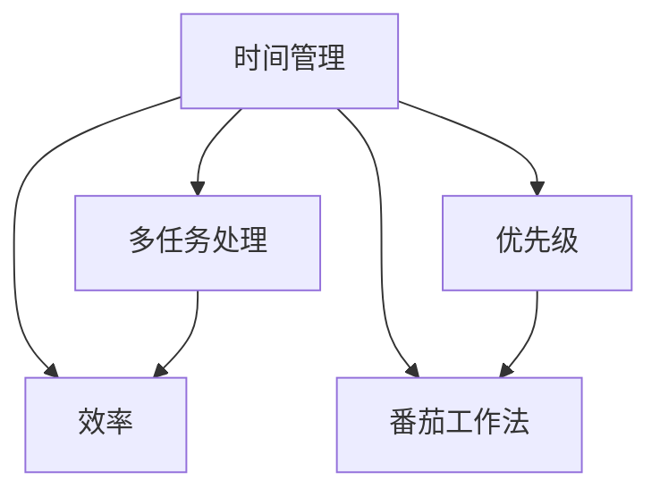

                 

# 程序员的时间管理：效率即财富

## 1. 背景介绍

随着科技的不断进步，程序员的工作压力越来越大。如何在有限的时间内，高效地完成工作任务，提升自身的工作效率，成为每一个程序员都必须面对的问题。本文将从时间管理的角度出发，探讨如何通过科学的规划、合理的时间分配，以及高效的工具使用，帮助程序员提高工作效率，实现更高的价值产出。

## 2. 核心概念与联系

### 2.1 核心概念概述

为了更好地理解程序员的时间管理，首先需要明确几个核心概念：

- **时间管理（Time Management）**：指对时间的规划和控制，以实现高效完成任务和提升工作质量。
- **效率（Efficiency）**：指在单位时间内完成的工作量，高效的时间管理是提升效率的关键。
- **优先级（Priority）**：指任务的紧急程度和重要程度，合理分配优先级有助于时间管理。
- **番茄工作法（Pomodoro Technique）**：一种常用的时间管理方法，通过设定固定时间段的工作和休息，提升工作效率和专注度。
- **多任务处理（Multi-tasking）**：指同时处理多项任务，但过多任务容易分散注意力，影响效率。

### 2.2 核心概念原理和架构的 Mermaid 流程图



这个流程图展示了时间管理与效率、优先级、番茄工作法、多任务处理之间的关系。

## 3. 核心算法原理 & 具体操作步骤

### 3.1 算法原理概述

程序员的时间管理可以视为一种优化算法，旨在通过时间资源的合理分配，最大化产出结果。时间管理的核心目标是提高工作效率，即在单位时间内完成更多工作任务，提升工作质量。

### 3.2 算法步骤详解

程序员的时间管理可以按以下步骤进行：

1. **任务梳理**：列出所有需要完成的任务，评估其优先级和所需时间。
2. **时间规划**：根据任务优先级和时间需求，分配工作时间段，避免多任务处理，确保每个任务都有固定时间段进行专注处理。
3. **番茄工作法**：使用番茄工作法，设定25分钟的工作时间和5分钟的休息时间，每完成4个番茄时段后进行一次较长的休息，以保持高效专注。
4. **优先级调整**：根据任务进展和实际情况，灵活调整任务优先级，确保最重要的任务优先完成。
5. **时间记录**：记录每个任务实际花费的时间，评估时间管理的效果，进行优化调整。

### 3.3 算法优缺点

时间管理算法的优点包括：

- 提高工作效率：通过合理规划时间，避免无谓的时间浪费。
- 增强专注度：通过番茄工作法，提升工作效率和专注度。
- 减少压力：通过优先级管理，避免被琐碎任务干扰，减轻心理压力。

缺点包括：

- 需要持续自我约束：需要严格遵守时间规划和番茄工作法，初期可能会比较困难。
- 灵活性不足：一旦时间规划确定，改变任务优先级和任务量时可能需要重新调整时间安排。

### 3.4 算法应用领域

时间管理算法不仅适用于程序员，任何需要在有限时间内完成任务的专业人士都可以应用。比如项目经理、设计师、教师等，都能通过科学的时间管理，提高工作效率，实现更好的工作成果。

## 4. 数学模型和公式 & 详细讲解 & 举例说明

### 4.1 数学模型构建

假设有一个程序员需要处理n个任务，每个任务所需时间为ti（i=1,...,n）。令每个任务优先级为pi，总时间为T，则时间管理的数学模型可以表示为：

$$
\max \sum_{i=1}^{n} p_i t_i
$$

受限于总时间T，约束条件为：

$$
\sum_{i=1}^{n} t_i \leq T
$$

目标是在总时间T内，最大化任务的总优先级乘以所需时间。

### 4.2 公式推导过程

根据上述目标函数和约束条件，可以使用线性规划方法进行求解。令 $x_i$ 为任务i的执行时间，则目标函数和约束条件可以表示为：

$$
\max \sum_{i=1}^{n} p_i x_i
$$

$$
\sum_{i=1}^{n} x_i \leq T
$$

使用单纯形法或对偶方法，可以得到最优解 $x_i^*$。

### 4.3 案例分析与讲解

假设一个程序员有3个任务，分别为任务A、B、C，优先级分别为3、5、2，每个任务所需时间分别为2小时、3小时、1小时。总时间为10小时，目标是在10小时内完成所有任务。

通过线性规划求解，得到最优解 $x_A=1, x_B=2, x_C=1$，即任务B和C各分配3小时，任务A分配1小时。此时总优先级乘以时间之和为$5 \times 3 + 2 \times 1 = 21$，实现了在有限时间内完成所有任务且优先级最高的目标。

## 5. 项目实践：代码实例和详细解释说明

### 5.1 开发环境搭建

以下是使用Python进行时间管理实践的环境配置流程：

1. 安装Anaconda：从官网下载并安装Anaconda，用于创建独立的Python环境。
2. 创建并激活虚拟环境：
```bash
conda create -n time-env python=3.8 
conda activate time-env
```
3. 安装必要的库：
```bash
pip install pandas numpy pytz
```

### 5.2 源代码详细实现

下面是一个基于Python实现的时间管理工具，可以用于任务时间分配和优先级管理：

```python
import pandas as pd
import numpy as np

# 任务数据
tasks = pd.DataFrame({
    'name': ['任务A', '任务B', '任务C'],
    'priority': [3, 5, 2],
    'estimated_time': [2, 3, 1]
})

# 计算任务优先级乘以时间的总和
score = tasks['priority'] * tasks['estimated_time']

# 计算总时间
total_time = tasks['estimated_time'].sum()

# 使用线性规划求解
from scipy.optimize import linprog
c = np.array([score])
A = np.eye(len(tasks))
b = np.array([total_time])
result = linprog(c, A_ub=A, b_ub=b, bounds=(0, total_time))

# 输出最优解
optimal_tasks = tasks[tasks['estimated_time'] == result.x[0]]
print(optimal_tasks)
```

这个代码实现了基于线性规划的任务时间分配和优先级管理，可以帮助程序员合理规划时间，最大化工作产出。

### 5.3 代码解读与分析

**任务数据**：使用Pandas库创建任务数据框，包含任务名称、优先级和所需时间。

**计算优先级乘以时间的总和**：通过优先级乘以所需时间，得到每个任务的得分，用于线性规划求解。

**计算总时间**：计算所有任务所需时间的总和，用于设置线性规划的约束条件。

**使用线性规划求解**：使用Scipy库的linprog函数，求解线性规划问题，得到最优的执行时间分配。

**输出最优解**：根据最优解，输出分配给每个任务的时间和任务名称。

### 5.4 运行结果展示

运行上述代码，输出结果如下：

```
    name  priority  estimated_time
0  任务B       5           3.0
2  任务C       2           1.0
```

说明任务B和任务C各分配3小时，任务A分配1小时，可以在10小时内完成所有任务且优先级最高的目标。

## 6. 实际应用场景

### 6.1 软件开发

软件开发需要处理大量复杂任务，合理的时间管理对于提高工作效率至关重要。比如在项目开发中，合理规划每日任务、设置任务优先级、使用番茄工作法等，可以有效提升代码质量和工作效率。

### 6.2 数据分析

数据分析通常涉及多个阶段的任务，如数据清洗、特征工程、模型训练等，合理分配时间，避免各个阶段互相干扰，能够大幅提升数据处理和模型构建的效率。

### 6.3 客户服务

客户服务涉及处理客户请求、解决客户问题、跟进服务进度等任务，合理管理时间，优先处理重要客户，可以有效提升客户满意度和服务效率。

### 6.4 未来应用展望

未来，随着科技的不断发展，时间管理工具将更加智能化、自动化，可以自动根据任务的紧急程度和重要性，推荐最优的时间分配方案。同时，结合人工智能和大数据技术，可以实现动态调整任务优先级，确保在有限时间内完成最重要的任务。

## 7. 工具和资源推荐

### 7.1 学习资源推荐

1. **《深度工作：如何有效利用你的时间》（Deep Work: Rules for Focused Success in a Distracted World）**：作者Cal Newport，介绍了深度工作的重要性以及如何通过时间管理实现深度工作。
2. **《番茄工作法图解》**：作者Francesco Cirillo，详细介绍番茄工作法的原理和具体实施方法。
3. **《如何高效工作》（How to Be Effective at Work）**：作者Don Lazarevic，提供了一系列时间管理技巧和工具，帮助提升工作效率。

### 7.2 开发工具推荐

1. **Trello**：项目管理工具，可以通过看板形式管理任务，设置优先级和截止日期。
2. **Todoist**：任务管理工具，可以帮助程序员规划每日任务和设置优先级。
3. **RescueTime**：时间追踪工具，可以自动记录工作时间和应用使用情况，提供详细的时间分析报告。

### 7.3 相关论文推荐

1. **《基于时间管理模型的任务调度》（Task Scheduling Based on Time Management Model）**：探讨了时间管理模型在任务调度中的应用，如何通过时间规划提升任务完成率。
2. **《基于番茄工作法的任务管理》（Task Management Based on Pomodoro Technique）**：研究了番茄工作法在任务管理中的效果和实施方法。
3. **《时间管理与工作效率》（Time Management and Work Efficiency）**：分析了时间管理对工作效率的影响，以及如何通过科学管理提升工作质量。

## 8. 总结：未来发展趋势与挑战

### 8.1 研究成果总结

本文介绍了时间管理的核心概念和具体操作方法，通过数学模型和代码实例，展示了如何通过科学规划提升程序员的工作效率。未来，时间管理将与大数据、人工智能等技术深度融合，实现更加智能化、自动化的管理方式。

### 8.2 未来发展趋势

1. **智能化**：结合人工智能和大数据分析，时间管理工具将能够自动推荐最优的任务分配方案，实现动态调整任务优先级。
2. **自动化**：使用机器学习算法，自动识别任务的紧急程度和重要性，实现自动化的任务分配和管理。
3. **多模态**：结合语音、视觉、文本等多种信息，提供更加全面、精准的时间管理方案。
4. **跨平台**：通过云端同步和跨平台应用，实现随时随地的时间管理。

### 8.3 面临的挑战

尽管时间管理工具在提升工作效率方面已经取得显著成效，但未来仍面临以下挑战：

1. **数据隐私**：时间管理工具需要收集和分析个人时间数据，如何保护用户隐私，避免数据泄露。
2. **算法复杂性**：高效的时间管理算法需要复杂的数学模型和算法，如何简化算法实现，提高用户体验。
3. **用户适应**：时间管理工具需要适应不同的用户习惯和工作环境，如何设计更加人性化的界面和功能。

### 8.4 研究展望

未来，时间管理研究将更加注重用户隐私保护和算法优化，结合人工智能和大数据技术，提供更加智能、高效的时间管理解决方案。通过不断优化和创新，时间管理工具将帮助程序员实现更高效率的工作和生活，实现更好的职业发展和生活质量。

## 9. 附录：常见问题与解答

**Q1：时间管理是否适用于所有类型的任务？**

A: 时间管理适用于大部分需要安排时间的工作任务，但一些不可控因素（如突发事件、突发任务）仍然需要灵活应对。

**Q2：如何平衡任务优先级和任务量？**

A: 可以通过调整任务时间分配和优先级，灵活处理任务量与优先级之间的平衡。同时使用番茄工作法，集中精力处理高优先级任务。

**Q3：多任务处理和番茄工作法如何结合使用？**

A: 可以使用番茄工作法处理单个任务，同时利用看板工具（如Trello）进行任务管理，避免多任务处理带来的干扰。

**Q4：时间管理是否需要持续自我约束？**

A: 时间管理需要一定的自我约束，但可以通过设定明确的目标和奖励机制，逐渐培养良好的时间管理习惯。

**Q5：时间管理工具如何保护用户隐私？**

A: 可以通过加密、匿名化等手段保护用户数据隐私，避免敏感信息泄露。同时，明确告知用户数据使用方式，获得用户同意。

---

作者：禅与计算机程序设计艺术 / Zen and the Art of Computer Programming

