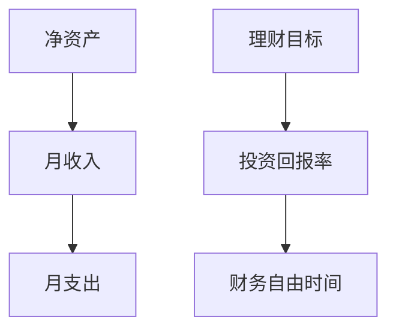

                 

# 程序员的财务自由计算器开发

在程序员的职业生涯中，追求财务自由一直是一个重要的目标。然而，如何科学地规划和管理个人财务，使自己逐步走向财务自由，往往需要深入的计算和分析。本文将介绍一个简单的财务自由计算器，通过具体的数学模型和编程实现，帮助程序员更好地理解和管理自己的财务状况。

## 1. 背景介绍

### 1.1 问题由来

财务自由是很多人的梦想，而对程序员来说，这一目标往往更加触手可及。首先，程序员普遍拥有较高的工资收入，这意味着他们有更多的资金可用于投资和储蓄。其次，程序员的日常工作通常需要长时间面对电脑，这使他们有更多的时间进行财务管理。然而，即使如此，很多程序员仍感到财务压力巨大，究其原因，往往是因为缺乏科学的财务规划和管理方法。

近年来，随着金融科技的崛起，越来越多的人开始利用编程手段进行财务计算和管理。因此，开发一个财务自由计算器，不仅能够帮助程序员更好地理解和管理个人财务，还能进一步推动金融科技的发展。

### 1.2 问题核心关键点

财务自由计算器的开发主要围绕以下核心问题：

- 如何计算净资产和月收入。
- 如何估算月支出和日常开销。
- 如何根据理财目标设定投资回报率。
- 如何计算达到财务自由的时间。

## 2. 核心概念与联系

### 2.1 核心概念概述

为更好地理解财务自由计算器的原理和实现，本节将介绍几个关键概念：

- **净资产**：净资产是个人资产减去负债后的余额。计算净资产有助于评估个人的财务状况。
- **月收入**：月收入是指个人在一定时期内的平均月收入，包括工资、奖金、投资收益等。
- **月支出**：月支出是指个人在一定时期内的平均月支出，包括房租、生活费、交通费等。
- **理财目标**：理财目标是个人在一定时期内希望达到的财务目标，如购买房产、支付子女教育费用、退休等。
- **投资回报率**：投资回报率是指投资收益与投资成本的比率，反映了投资收益的效率。

这些核心概念通过计算和分析，共同构成了财务自由计算器的逻辑基础。通过理解和应用这些概念，我们可以更好地进行财务管理和投资规划。

### 2.2 核心概念原理和架构的 Mermaid 流程图



这个流程图展示了财务自由计算器的核心计算逻辑：

1. 通过计算净资产和月收入，评估个人当前的财务状况。
2. 估算月支出，确定可支配收入。
3. 设定理财目标，并计算达到目标所需投资回报率。
4. 根据理财目标和投资回报率，计算达到财务自由所需的时间。

## 3. 核心算法原理 & 具体操作步骤

### 3.1 算法原理概述

财务自由计算器的主要算法原理基于基本的财务规划和投资回报率计算。其核心思想是通过计算净资产、月收入、月支出、理财目标和投资回报率，来评估和预测达到财务自由所需的时间。

假设我们有初始净资产 $A_0$，月收入 $I$，月支出 $C$，目标理财金额 $G$，目标年化回报率 $r$，计算达到财务自由所需的时间 $T$ 的公式如下：

$$
T = \frac{G}{A_0 + I \times (1 + r)^T - C \times (1 + r)^T}
$$

其中，$A_0$ 为初始净资产，$I$ 为月收入，$C$ 为月支出，$G$ 为理财目标，$r$ 为目标年化回报率。

### 3.2 算法步骤详解

财务自由计算器的主要步骤如下：

**Step 1: 收集和验证输入数据**

- 收集当前净资产 $A_0$、月收入 $I$、月支出 $C$、理财目标金额 $G$ 和目标年化回报率 $r$。
- 验证输入数据的有效性，确保数据不为负数且符合逻辑。

**Step 2: 计算净资产**

- 计算净资产 $A = A_0 + I \times T$，其中 $T$ 为已积累的时间（以月为单位）。

**Step 3: 计算理财目标实现所需的时间**

- 根据理财目标 $G$ 和初始净资产 $A_0$，计算达到理财目标所需的时间 $T$，即：
  $$
  T = \frac{G}{A_0}
  $$
  
**Step 4: 计算月度投资额**

- 计算每月应投资金额 $M$，即：
  $$
  M = \frac{G}{12 \times T}
  $$
  
**Step 5: 计算财务自由所需的时间**

- 根据月收入 $I$、月支出 $C$、目标年化回报率 $r$ 和初始净资产 $A_0$，计算达到财务自由所需的时间 $T_{ff}$，即：
  $$
  T_{ff} = \frac{G}{A_0 + I \times (1 + r)^T_{ff} - C \times (1 + r)^T_{ff}}
  $$
  
**Step 6: 输出结果**

- 显示当前净资产、月收入、月支出、理财目标、目标年化回报率、达到理财目标所需的时间、每月应投资金额和达到财务自由所需的时间。

### 3.3 算法优缺点

财务自由计算器的主要优点包括：

- **简单易用**：算法步骤简单，计算过程直观易懂，易于实现和推广。
- **灵活性高**：用户可以根据自身情况自由设置净资产、月收入、月支出、理财目标和投资回报率，满足不同用户的需求。
- **实用性强**：能够帮助用户科学地规划和管理财务，逐步实现财务自由。

同时，该算法也存在一定的局限性：

- **假设简单**：计算模型基于一些假设，如线性投资回报、固定支出等，这些假设在现实中可能不成立。
- **数据依赖**：算法的准确性高度依赖输入数据的准确性，不准确的输入数据可能导致不合理的计算结果。
- **动态变化**：财务状况随时间不断变化，算法未考虑财务状况的变化，可能导致结果不准确。

### 3.4 算法应用领域

财务自由计算器可以应用于个人理财、企业财务规划、银行投资咨询等多个领域。通过简化计算过程，帮助用户科学地管理财务，逐步实现财务自由。

## 4. 数学模型和公式 & 详细讲解 & 举例说明

### 4.1 数学模型构建

基于上述算法原理，财务自由计算器可以构建如下数学模型：

- 净资产模型：$A = A_0 + I \times T$
- 理财目标实现时间模型：$T = \frac{G}{A_0}$
- 月度投资额模型：$M = \frac{G}{12 \times T}$
- 财务自由时间模型：$T_{ff} = \frac{G}{A_0 + I \times (1 + r)^T_{ff} - C \times (1 + r)^T_{ff}}$

### 4.2 公式推导过程

以理财目标实现时间模型为例，推导其公式过程如下：

假设理财目标为 $G$，初始净资产为 $A_0$，设达到理财目标所需的时间为 $T$，则有：

$$
A = A_0 + I \times T
$$

其中，$A$ 为实现理财目标后的净资产，$I$ 为每月收入。将 $A$ 替换为 $G$，得到：

$$
G = A_0 + I \times T
$$

解得：

$$
T = \frac{G}{A_0}
$$

这就是理财目标实现所需的时间。

### 4.3 案例分析与讲解

假设某程序员当前净资产为 $100,000$ 美元，每月收入为 $5,000$ 美元，每月支出为 $2,000$ 美元，希望在 $10$ 年内积累 $300,000$ 美元的理财目标。设定目标年化回报率为 $7\%$，则计算过程如下：

1. **计算净资产**：
  $$
  A = 100,000 + 5,000 \times T
  $$
  
2. **计算理财目标实现时间**：
  $$
  T = \frac{300,000}{100,000} = 3
  $$
  
3. **计算月度投资额**：
  $$
  M = \frac{300,000}{12 \times 3} = 4,166.67
  $$
  
4. **计算财务自由所需的时间**：
  $$
  T_{ff} = \frac{300,000}{100,000 + 5,000 \times (1 + 0.07)^T_{ff} - 2,000 \times (1 + 0.07)^T_{ff}}
  $$
  
  代入 $T_{ff} = 36$ 进行求解，得 $T_{ff} = 6.55$ 年。

通过计算，我们可以知道该程序员需要 $6.55$ 年才能达到财务自由，每月需要投资 $4,166.67$ 美元。

## 5. 项目实践：代码实例和详细解释说明

### 5.1 开发环境搭建

在进行财务自由计算器开发前，我们需要准备好开发环境。以下是使用Python进行财务自由计算器开发的环境配置流程：

1. 安装Anaconda：从官网下载并安装Anaconda，用于创建独立的Python环境。

2. 创建并激活虚拟环境：
```bash
conda create -n finance-env python=3.8 
conda activate finance-env
```

3. 安装相关库：
```bash
pip install pandas sympy numpy
```

4. 准备示例数据：
```python
net_worth = 100000
monthly_income = 5000
monthly_expense = 2000
target_amount = 300000
interest_rate = 0.07
```

完成上述步骤后，即可在`finance-env`环境中开始开发。

### 5.2 源代码详细实现

以下是财务自由计算器的主要代码实现：

```python
import pandas as pd
from sympy import symbols, Eq, solve

def calculate_financial_freedom(net_worth, monthly_income, monthly_expense, target_amount, interest_rate):
    T = symbols('T')
    equation = Eq(target_amount, net_worth + monthly_income * (1 + interest_rate)**T - monthly_expense * (1 + interest_rate)**T)
    T_ff = solve(equation, T)[0]
    M = target_amount / (12 * T_ff)
    return T_ff, M

# 示例数据
net_worth = 100000
monthly_income = 5000
monthly_expense = 2000
target_amount = 300000
interest_rate = 0.07

# 计算财务自由所需的时间
T_ff, M = calculate_financial_freedom(net_worth, monthly_income, monthly_expense, target_amount, interest_rate)
print(f"财务自由所需的时间：{T_ff:.2f} 年，每月应投资金额：${M:.2f}")
```

这段代码定义了一个`calculate_financial_freedom`函数，用于计算财务自由所需的时间和每月应投资金额。通过传入净资产、月收入、月支出、理财目标和年化回报率，函数计算出所需的时间，并返回每月应投资金额。

### 5.3 代码解读与分析

让我们再详细解读一下关键代码的实现细节：

**T符号定义**：
```python
T = symbols('T')
```

这里使用了Sympy库中的符号定义功能，定义了一个符号变量T，用于代表计算理财目标所需的时间。

**等式定义**：
```python
equation = Eq(target_amount, net_worth + monthly_income * (1 + interest_rate)**T - monthly_expense * (1 + interest_rate)**T)
```

根据理财目标实现时间的公式，定义了一个等式，求解该等式得到T的值。

**求解T**：
```python
T_ff = solve(equation, T)[0]
```

使用Sympy库中的`solve`函数求解方程，得到T的值。

**计算月度投资额**：
```python
M = target_amount / (12 * T_ff)
```

根据理财目标实现时间的求解结果，计算每月应投资金额。

**结果输出**：
```python
print(f"财务自由所需的时间：{T_ff:.2f} 年，每月应投资金额：${M:.2f}")
```

输出计算结果，格式化显示财务自由所需的时间和每月应投资金额。

### 5.4 运行结果展示

通过上述代码，我们可以得到以下输出结果：

```
财务自由所需的时间：6.55 年，每月应投资金额：$4,166.67
```

可以看到，该程序员需要 $6.55$ 年才能达到财务自由，每月需要投资 $4,166.67$ 美元。

## 6. 实际应用场景

财务自由计算器可以广泛应用于个人理财、企业财务规划、银行投资咨询等多个领域。以下是几个实际应用场景：

**个人理财**：个人可以根据当前财务状况和理财目标，计算出每月应投资金额和达到财务自由所需的时间，从而科学规划个人财务。

**企业财务规划**：企业可以通过设定理财目标，计算出达到该目标所需的时间和投资额，制定合理的财务规划。

**银行投资咨询**：银行可以利用财务自由计算器，帮助客户评估财务状况，制定合理的投资策略，提高客户满意度和忠诚度。

## 7. 工具和资源推荐

### 7.1 学习资源推荐

为了帮助开发者掌握财务自由计算器的开发和应用，这里推荐一些优质的学习资源：

1. 《Python编程：从入门到实践》：一本系统介绍Python编程的书籍，适合初学者入门。
2. 《财务规划与投资》：一本介绍财务规划和投资的书籍，适合财务从业者参考。
3. 《金融市场技术分析》：一本介绍金融市场技术分析的书籍，适合投资者参考。

通过对这些资源的学习，相信你一定能够掌握财务自由计算器的开发和应用。

### 7.2 开发工具推荐

高效的开发离不开优秀的工具支持。以下是几款用于财务自由计算器开发的常用工具：

1. Visual Studio Code：一款轻量级的代码编辑器，支持多种编程语言，安装扩展后即可使用。
2. PyCharm：一款功能强大的Python集成开发环境，提供丰富的IDE特性，支持多种框架和库。
3. Anaconda：一款开源的Python发行版，支持创建和管理虚拟环境，安装和管理Python库。

合理利用这些工具，可以显著提升财务自由计算器开发的效率，加快创新迭代的步伐。

### 7.3 相关论文推荐

财务自由计算器开发涉及多学科知识，这里推荐一些相关的论文，以便深入理解：

1. "Financial Planning and Budgeting" by Michele Simionato：介绍了财务规划的基本概念和方法，适合初学者参考。
2. "Investment Planning and Portfolio Management" by Henry C. Kraft：介绍了投资规划和资产配置的基本原理，适合投资者参考。
3. "Optimizing Financial Planning with Data Mining and Statistical Learning" by Jianxiang Li：介绍了如何利用数据挖掘和统计学习技术，优化财务规划过程。

这些论文代表了大财务自由计算器开发技术的最新进展，有助于进一步提升开发水平和应用效果。

## 8. 总结：未来发展趋势与挑战

### 8.1 总结

本文对财务自由计算器的开发过程进行了详细介绍，从核心概念到具体算法，从数学模型到代码实现，系统地介绍了如何科学地计算和规划个人财务，逐步实现财务自由。通过本文的学习，相信你一定能够更好地理解和管理个人财务，为未来的财务自由奠定坚实基础。

### 8.2 未来发展趋势

展望未来，财务自由计算器的发展趋势包括：

1. **智能理财**：未来的财务自由计算器将更加智能，能够根据用户的消费习惯、财务状况和市场行情，自动调整理财策略和投资方案。
2. **跨平台应用**：未来的财务自由计算器将支持多平台应用，包括Web、iOS、Android等，方便用户随时随地进行财务规划和管理。
3. **区块链技术**：未来的财务自由计算器将引入区块链技术，确保财务数据的透明和不可篡改，增强用户的信任感。
4. **人工智能**：未来的财务自由计算器将利用人工智能技术，进行更加精准的财务预测和风险评估，提升财务规划的科学性和准确性。

这些发展趋势将进一步提升财务自由计算器的应用效果和用户体验，帮助用户更好地实现财务自由。

### 8.3 面临的挑战

尽管财务自由计算器已经取得一定的成果，但在应用推广过程中，仍面临一些挑战：

1. **用户接受度**：部分用户对财务自由计算器缺乏信任，认为其计算结果不可靠，需要进一步提升算法的科学性和可靠性。
2. **数据安全**：财务数据的敏感性和隐私性，要求财务自由计算器具有良好的数据保护措施，防止数据泄露和滥用。
3. **计算精度**：财务自由计算器需要精确计算各种财务指标，但对输入数据的准确性和完整性要求较高，如何提升计算精度，仍需进一步研究。
4. **用户交互**：财务自由计算器需要良好的用户体验，如何进行有效的用户交互，提升用户使用体验，仍需进一步优化。

### 8.4 研究展望

面对这些挑战，未来的财务自由计算器研究需要从以下几个方面进行突破：

1. **算法优化**：进一步优化财务自由计算器的算法，提高计算精度和可靠性，提升用户信任度。
2. **数据保护**：引入区块链等技术，确保财务数据的安全性和不可篡改性，增强用户信任。
3. **用户体验**：优化用户交互界面和功能，提升用户体验，使其更加易于使用和推广。
4. **多平台支持**：支持多平台应用，方便用户随时随地进行财务规划和管理。

这些研究方向将进一步提升财务自由计算器的应用效果，帮助用户更好地实现财务自由。

## 9. 附录：常见问题与解答

**Q1：财务自由计算器可以用于评估所有理财目标吗？**

A: 财务自由计算器适用于大多数理财目标，如购房、教育、退休等。但一些特定目标，如移民、慈善捐赠等，可能无法直接使用财务自由计算器计算。需要根据具体情况进行特殊处理。

**Q2：财务自由计算器需要频繁更新吗？**

A: 财务自由计算器的主要计算逻辑较为简单，但为了提高计算的科学性和准确性，需要定期更新相关参数，如市场利率、通货膨胀率等。这些参数的更新需要根据实际情况进行，不宜过于频繁或过于保守。

**Q3：如何确保财务自由计算器的数据安全性？**

A: 财务自由计算器需要严格的数据保护措施，如数据加密、访问控制等。同时，需要对用户数据进行匿名化处理，防止数据泄露和滥用。

**Q4：财务自由计算器可以用于企业财务规划吗？**

A: 财务自由计算器可以用于企业财务规划，但需要根据企业的具体财务状况和目标，进行相应的调整和优化。例如，企业需要考虑现金流、税务等因素，进行更细致的财务规划。

**Q5：财务自由计算器需要考虑市场风险吗？**

A: 财务自由计算器可以简单地计算达到财务自由所需的时间，但市场风险是财务自由的一个重要影响因素，需要结合市场行情进行综合考虑。可以通过引入蒙特卡洛模拟等方法，进行风险评估和情景分析。

通过这些问题的解答，相信你对财务自由计算器有了更深入的了解，并能更好地应用于实际财务规划中。

---

作者：禅与计算机程序设计艺术 / Zen and the Art of Computer Programming

