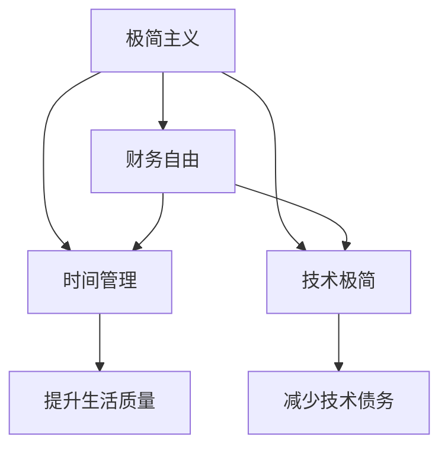

                 

## 1. 背景介绍

在数字化时代，程序员群体已经成为了驱动社会进步的重要力量。他们不仅是技术的创造者，更是生活方式的引领者。然而，随着技术更新换代的速度不断加快，程序员的职业生涯也面临着前所未有的挑战。如何在技术变革的浪潮中保持自我，实现个人价值，成为了很多程序员思考的问题。本文旨在探讨程序员实现财务自由的新路径——极简主义实践，帮助程序员在复杂多变的工作环境中保持平衡，过上更加简单、有品质的生活。

### 1.1 问题由来

在过去几十年中，程序员的社会地位和经济待遇显著提升。他们通过不断学习和创新，推动了互联网、人工智能、区块链等领域的飞速发展。然而，这背后也隐藏着不可忽视的挑战。长期的高强度工作、频繁的加班和较高的生活成本，使得许多程序员处于“996”的超负荷状态。这种生活方式不仅损害了程序员的身心健康，也限制了他们追求个人兴趣和家庭生活的可能性。

面对这些挑战，越来越多的程序员开始思考如何调整工作与生活平衡，寻找新的生活哲学和价值观。极简主义作为一种简单而实用的生活方式，逐渐进入他们的视野。它强调“少即是多”，通过减少物质和精神的负担，让人们回归生活的本质，享受真正的自由和幸福。

### 1.2 问题核心关键点

极简主义实践的核心在于通过减少不必要的物质和精神负担，帮助程序员实现更高的生活质量和工作效率。关键点包括：

- **精神极简**：摆脱物质诱惑，专注于内心的平静和满足。
- **财务极简**：通过精简开支，建立可持续的财务健康。
- **时间极简**：合理安排时间，提升工作和生活的效率。
- **技术极简**：聚焦核心技术，减少技术债务和过载。

本文将从这些核心点出发，系统介绍程序员实现财务自由的极简主义实践方法。

## 2. 核心概念与联系

### 2.1 核心概念概述

为了更好地理解极简主义的实践方法，我们需要了解几个密切相关的核心概念：

- **极简主义**：一种生活方式和价值观，主张通过减少物质和精神负担，达到内心的宁静和满足。
- **财务自由**：通过有效地管理个人财务，实现经济独立，不再依赖工资生活。
- **时间管理**：通过合理安排时间，提升工作和生活的效率。
- **技术债务**：随着技术的不断积累，原有系统变得复杂难以维护，导致新功能的开发变得更加困难。

这些概念之间的逻辑关系可以通过以下Mermaid流程图来展示：



这个流程图展示了大语言模型的核心概念及其之间的关系：

1. 极简主义通过减少物质和精神负担，为程序员带来内心的平静和满足。
2. 财务自由是极简主义的具体体现，通过精简开支，建立可持续的财务健康。
3. 时间管理是极简主义的重要实践，合理安排时间，提升工作和生活的效率。
4. 技术极简是极简主义在技术领域的应用，聚焦核心技术，减少技术债务和过载。

这些概念共同构成了程序员实现财务自由的生活哲学和实践框架，使其能够更好地平衡工作与生活，追求个人价值和幸福感。

## 3. 核心算法原理 & 具体操作步骤
### 3.1 算法原理概述

极简主义的实践方法，本质上是一种生活方式和价值观的调整。其核心思想是通过减少不必要的物质和精神负担，达到更高的生活质量和工作效率。具体来说，包括以下几个步骤：

1. **精神极简**：通过减少物质和精神负担，达到内心的平静和满足。
2. **财务极简**：通过精简开支，建立可持续的财务健康。
3. **时间极简**：合理安排时间，提升工作和生活的效率。
4. **技术极简**：聚焦核心技术，减少技术债务和过载。

### 3.2 算法步骤详解

**Step 1: 精神极简**

精神极简的核心在于通过减少物质和精神负担，达到内心的平静和满足。具体步骤包括：

1. **物质精简**：断舍离不需要的物品，只保留必需品。
2. **精神解脱**：从过度追求物质和职业成功中解脱出来，关注内心的成长和幸福。

**Step 2: 财务极简**

财务极简的核心在于通过精简开支，建立可持续的财务健康。具体步骤包括：

1. **预算控制**：制定合理的预算，控制不必要的开支。
2. **资产优化**：通过投资、储蓄等手段，优化财务结构。
3. **债务管理**：减少高利贷和高额信用卡债务，避免财务风险。

**Step 3: 时间极简**

时间极简的核心在于通过合理安排时间，提升工作和生活的效率。具体步骤包括：

1. **任务分解**：将复杂任务分解为小步骤，逐步完成。
2. **优先级排序**：根据重要性和紧急性，合理安排任务优先级。
3. **高效工具**：利用时间管理工具，如Todoist、Trello等，提升效率。

**Step 4: 技术极简**

技术极简的核心在于聚焦核心技术，减少技术债务和过载。具体步骤包括：

1. **技术精简**：选择精简而有用的技术栈，避免过度复杂。
2. **代码优化**：通过重构和自动化工具，提升代码质量。
3. **知识更新**：聚焦关键技术，避免过载学习。

### 3.3 算法优缺点

极简主义的实践方法具有以下优点：

- **提升生活质量**：通过减少物质和精神负担，程序员能够获得更多的自由和幸福感。
- **提高工作效率**：通过精简开支和时间管理，程序员能够专注于核心任务，提升工作质量。
- **减少技术债务**：通过聚焦核心技术，程序员能够降低技术债务和系统维护成本。

同时，该方法也存在一定的局限性：

- **适应难度**：极简主义需要改变现有的生活方式和价值观，对一些人来说可能难以适应。
- **灵活性不足**：过于严格的预算和计划，可能会限制某些灵活性和创新。
- **心理压力**：过度关注极简可能带来心理负担，反而影响生活质量。

尽管存在这些局限性，但就目前而言，极简主义的实践方法已成为许多程序员追求财务自由的重要手段。未来相关研究的重点在于如何进一步优化极简主义的具体实践，提高其灵活性和可操作性，同时兼顾心理和生理健康的平衡。

### 3.4 算法应用领域

极简主义的实践方法不仅适用于程序员，也在其他职业和生活中有广泛的应用。以下是几个典型的应用领域：

1. **职业发展**：通过精简工作任务和技能，聚焦核心领域，提升职业竞争力。
2. **个人生活**：通过减少物质和精神负担，提升生活质量，实现真正的自由和幸福。
3. **家庭关系**：通过精简社交和物质需求，构建更和谐的家庭关系。
4. **环境保护**：通过减少物质消费，倡导可持续发展的生活方式，对环境产生积极影响。

## 4. 数学模型和公式 & 详细讲解  
### 4.1 数学模型构建

极简主义的实践方法，主要涉及生活成本控制、时间管理、技术精简等具体策略。这些策略的实现可以通过数学模型来量化和优化。

假设一个程序员的月收入为 $M$，月支出为 $C$，储蓄率为 $S$，储蓄目标为 $T$。则每月储蓄额为 $S=M-C$。为了达到财务自由，储蓄目标 $T$ 需要满足以下条件：

$$
T \geq M \times \text{月数} \times (1 + r)
$$

其中 $r$ 为通货膨胀率。

### 4.2 公式推导过程

在时间管理方面，我们可以使用任务管理工具对工作任务进行分解和优先级排序。假设一天的工作时间为 $T$，每项任务的时间为 $t_i$，重要性和紧急性为 $w_i$。则最优的任务分配方案可以通过以下公式求解：

$$
\max \sum_{i=1}^{n} w_i t_i
$$

其中 $n$ 为任务数量。

在技术精简方面，我们可以使用代码复杂度指标（如Cyclomatic Complexity）来衡量系统复杂度。假设系统总代码量为 $C$，关键代码量为 $C_k$，则代码简化率可以通过以下公式计算：

$$
\text{简化率} = \frac{C-C_k}{C}
$$

## 5. 项目实践：代码实例和详细解释说明
### 5.1 开发环境搭建

在进行极简主义实践前，我们需要准备好开发环境。以下是使用Python进行开发的环境配置流程：

1. 安装Python：从官网下载并安装Python，建议使用最新版本以获得更好的功能和安全性。

2. 安装相关库：安装必要的库，如Pandas、NumPy、Matplotlib等，用于数据处理和可视化。

```bash
pip install pandas numpy matplotlib
```

3. 创建虚拟环境：创建独立的Python环境，防止不同项目之间的依赖冲突。

```bash
python -m venv myenv
source myenv/bin/activate
```

完成上述步骤后，即可在虚拟环境中进行极简主义实践的开发。

### 5.2 源代码详细实现

以下是一个简化的Python代码，用于计算最优的储蓄率和储蓄目标：

```python
import pandas as pd

# 设定初始参数
M = 10000  # 月收入
C = 5000   # 月支出
S = 0.2    # 储蓄率
T = 100000 # 储蓄目标
r = 0.02   # 通货膨胀率

# 计算每月储蓄额和储蓄月数
monthly_savings = M * S
months_needed = T / (M * S + M * r)

# 输出结果
print(f"每月储蓄额：{monthly_savings}")
print(f"储蓄月数：{months_needed}")
```

### 5.3 代码解读与分析

让我们再详细解读一下关键代码的实现细节：

**初始化参数**：
- `M`：每月收入
- `C`：每月支出
- `S`：储蓄率
- `T`：储蓄目标
- `r`：通货膨胀率

**计算每月储蓄额和储蓄月数**：
- `monthly_savings`：每月储蓄额
- `months_needed`：储蓄月数

可以看到，代码通过简单的数学计算，帮助程序员计算出每月应储蓄的金额和达到财务自由所需的月数。这种计算方式不仅实用，而且简单明了，方便理解和应用。

## 6. 实际应用场景
### 6.1 程序员职业发展

在程序员职业发展中，极简主义可以通过减少技术债务和任务负担，提升职业竞争力。具体场景包括：

- **技术精简**：选择精简而高效的技术栈，避免过度复杂。例如，选择Python而非C++进行数据处理，以减少开发和维护成本。
- **任务分解**：将大型项目分解为多个子任务，逐步完成。例如，将复杂的应用程序开发任务分解为前端、后端、数据库等部分，逐一实现。
- **优先级排序**：根据重要性和紧急性，合理安排任务优先级。例如，优先完成紧急的Bug修复任务，再处理功能新增。

### 6.2 个人生活质量

在个人生活中，极简主义可以通过减少物质和精神负担，提升生活质量。具体场景包括：

- **物质精简**：断舍离不必要的物品，保留必需品。例如，每月只购买必需的生活用品，减少购物开支。
- **精神解脱**：从过度追求物质和职业成功中解脱出来，关注内心的成长和幸福。例如，每周安排时间进行冥想和休息，保持心理健康。
- **家庭关系**：减少社交和物质需求，构建更和谐的家庭关系。例如，每周与家人共度时光，增强家庭凝聚力。

### 6.3 环境保护

在环境保护方面，极简主义可以通过减少物质消费，倡导可持续发展的生活方式。具体场景包括：

- **减少碳足迹**：减少不必要的碳排放，如选择公共交通、骑自行车等。
- **支持环保**：支持环保组织和项目，推广绿色消费。
- **减少浪费**：减少食物和资源的浪费，倡导循环利用。

## 7. 工具和资源推荐
### 7.1 学习资源推荐

为了帮助程序员系统掌握极简主义的实践方法，这里推荐一些优质的学习资源：

1. **《极简主义：精简生活的艺术》**：一本关于极简主义生活的经典著作，提供了系统的极简主义实践指南。
2. **《理财规划与财务管理》**：一本理财入门书籍，帮助程序员理解和应用财务极简的原理。
3. **《时间管理：如何掌控时间，提升效率》**：一本时间管理书籍，提供实用的时间管理工具和方法。
4. **《Python编程：从入门到实践》**：一本Python编程入门书籍，帮助程序员提升编程技能，减少技术债务。

通过对这些资源的学习实践，相信你一定能够系统掌握极简主义的实践方法，并在生活中实现真正的财务自由。

### 7.2 开发工具推荐

高效的开发离不开优秀的工具支持。以下是几款用于极简主义实践开发的常用工具：

1. **Todoist**：一款强大的任务管理工具，帮助程序员合理安排时间和任务。
2. **Trello**：一款灵活的项目管理工具，支持任务分解和优先级排序。
3. **Mint**：一款财务管理工具，帮助程序员跟踪和管理个人财务。
4. **Visual Studio Code**：一款轻量级的IDE，支持高效编程和代码管理。
5. **Notion**：一款多功能笔记工具，支持任务管理、时间记录、财务规划等功能。

合理利用这些工具，可以显著提升极简主义的实践效果，减少开发和管理负担。

### 7.3 相关论文推荐

极简主义的实践方法在学术界和业界得到了广泛关注，以下是几篇奠基性的相关论文，推荐阅读：

1. **《极简主义：一种可持续的生活方式》**：探讨极简主义对生活、工作和社会的影响，提供了实用的实践建议。
2. **《时间管理的心理效应：理论与实践》**：研究时间管理对心理和行为的影响，提供了科学的时间管理方法。
3. **《Python编程的简化与优化》**：探讨Python编程中的简化和优化方法，提高编程效率和代码质量。

这些论文代表极简主义的实践方法的发展脉络。通过学习这些前沿成果，可以帮助程序员深入理解极简主义的原理和应用，提升生活和工作的质量。

## 8. 总结：未来发展趋势与挑战
### 8.1 总结

本文对程序员实现财务自由的极简主义实践方法进行了全面系统的介绍。首先阐述了极简主义在程序员职业发展和个人生活的重要性，明确了极简主义在减少物质和精神负担、提升生活质量和工作效率方面的独特价值。其次，从原理到实践，详细讲解了极简主义的数学模型和具体操作步骤，给出了极简主义实践的完整代码实例。同时，本文还探讨了极简主义在程序员职业发展、个人生活质量和环境保护等多个领域的应用场景，展示了极简主义范式的广泛影响。

通过本文的系统梳理，可以看到，极简主义实践为程序员在复杂多变的工作环境中保持平衡，实现个人价值和幸福感提供了新的思路和方法。未来，伴随极简主义的不断普及和深化，程序员的生活和工作方式必将发生深远变化，促进个人和社会的全面发展。

### 8.2 未来发展趋势

展望未来，极简主义的实践方法将呈现以下几个发展趋势：

1. **技术化趋势**：极简主义的实践方法将与技术发展紧密结合，利用大数据、人工智能等技术，提升极简主义的科学性和实用性。
2. **全球化趋势**：极简主义的理念将传播到全球各地，形成跨文化的极简主义实践社区。
3. **多样化趋势**：极简主义不仅局限于物质和精神生活，将拓展到更多领域，如教育、健康、环保等。
4. **个性化趋势**：极简主义将根据不同人群的需求，提供个性化和定制化的实践方案。

这些趋势凸显了极简主义实践方法的广阔前景。这些方向的探索发展，必将进一步提升程序员的生活和工作质量，带来更高的幸福感和成就感。

### 8.3 面临的挑战

尽管极简主义的实践方法已经取得了显著成效，但在迈向更加智能化、普适化应用的过程中，它仍面临着诸多挑战：

1. **适应难度**：极简主义需要改变现有的生活方式和价值观，对一些人来说可能难以适应。
2. **灵活性不足**：过于严格的预算和计划，可能会限制某些灵活性和创新。
3. **心理压力**：过度关注极简可能带来心理负担，反而影响生活质量。

尽管存在这些挑战，但通过不断的实践和探索，相信极简主义实践方法能够不断优化和完善，真正实现程序员的财务自由和幸福生活。

### 8.4 研究展望

面对极简主义实践面临的挑战，未来的研究需要在以下几个方面寻求新的突破：

1. **数字化工具**：开发更加智能和灵活的数字化极简主义工具，帮助程序员高效实践。
2. **科学量化**：通过大数据和人工智能技术，量化和评估极简主义的实践效果，提供更精准的指导。
3. **心理学研究**：研究极简主义对心理和行为的影响，提供科学的心理支持。
4. **跨领域应用**：将极简主义的理念和方法应用到更多领域，如教育、健康、环保等，促进全面发展。

这些研究方向的探索，必将引领极简主义的实践方法迈向更高的台阶，为程序员实现真正的财务自由和幸福生活铺平道路。面向未来，极简主义需要与其他新兴技术和生活方式进行更深入的融合，共同推动人类社会的可持续发展。

## 9. 附录：常见问题与解答

**Q1：如何开始极简主义实践？**

A: 开始极简主义实践的步骤如下：
1. 明确目标：设定具体、可量化的目标，如每月储蓄金额、每日任务数量等。
2. 制定计划：制定详细的计划，分解任务和时间节点，逐步实施。
3. 调整心态：逐渐调整心态，从内心接受极简主义的理念，减少物质和精神负担。

**Q2：极简主义是否适用于所有人？**

A: 极简主义并非适用于所有人，需要根据个人情况和需求进行适应。对于一些喜欢奢华生活的人，极简主义可能并不适合。但对于希望提升生活质量、追求内心宁静的人来说，极简主义是一个很好的选择。

**Q3：如何衡量极简主义实践的效果？**

A: 衡量极简主义实践效果的方法如下：
1. 定期评估：通过记录和分析生活开支、时间使用和心理健康等数据，评估极简主义实践的效果。
2. 反馈调整：根据评估结果，调整实践计划和方法，持续优化。
3. 长期跟踪：通过长期跟踪，观察极简主义对生活质量和幸福感的长期影响。

**Q4：极简主义是否会限制职业发展？**

A: 极简主义并不会限制职业发展，相反，通过精简任务和技能，聚焦核心领域，可以提升职业竞争力。需要注意的是，极简主义强调精简，并不意味着放弃学习和成长，而是更加高效地利用时间和资源。

**Q5：极简主义是否需要完全放弃物质享受？**

A: 极简主义并不是完全放弃物质享受，而是强调减少不必要的物质消费，保留必需品。根据个人情况和需求，合理平衡物质和精神需求，是极简主义实践的关键。

总之，极简主义实践方法为程序员实现财务自由提供了新的思路和方法。通过合理的精神极简、财务极简、时间极简和技术极简，程序员能够提升生活质量和工作效率，过上更加简单、有品质的生活。未来，伴随极简主义的不断普及和深化，程序员的生活和工作方式必将发生深远变化，促进个人和社会的全面发展。

