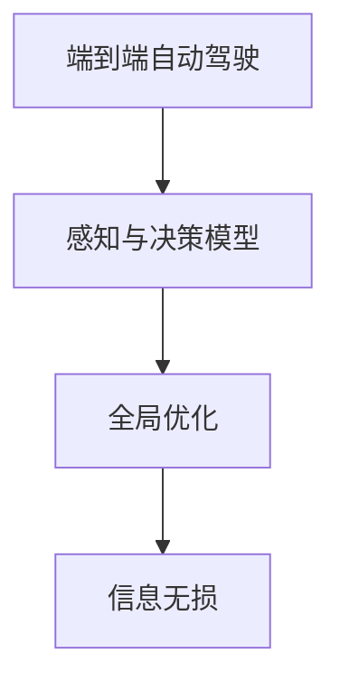

                 

## 1. 背景介绍

随着人工智能技术的不断进步，自动驾驶技术也逐步从实验室走向实际应用，成为当前智能交通领域的热门话题。然而，目前的主流自动驾驶系统仍然依赖于摄像头、雷达、激光雷达等传感器，采集大量环境数据，然后通过复杂的深度学习模型进行后处理，在实时环境中决策和控制车辆。这种逐点决策的模式虽然有效，但存在数据冗余、计算量大、难以处理复杂环境等问题，无法实现真正的智能驾驶。

为了解决这些问题，近年来兴起了一种新的自动驾驶技术范式：端到端自动驾驶。端到端自动驾驶旨在通过单模态感知与决策模型，直接从环境数据到行为输出，减少中间环节，实现更高的计算效率和更强的环境适应能力。本文将深入探讨端到端自动驾驶的核心优势，包括信息无损、全局优化、极大提升效率等，并提供完整的项目实践代码。

## 2. 核心概念与联系

### 2.1 核心概念概述

为更好地理解端到端自动驾驶的原理和优势，本节将介绍几个关键概念：

- 端到端自动驾驶：利用深度学习模型，从传感器数据直接到车辆行为输出，全流程自动化处理，避免了中间环节的数据冗余和误传。
- 感知与决策模型：集成环境感知与行为决策于一体的端到端模型，基于神经网络架构，可以同时处理高维空间和动态时间。
- 全局优化：通过全局视角考虑环境信息，决策模型可以更加准确地预测行为效果，并优化路径规划。
- 信息无损：端到端模型直接处理原始数据，无需复杂的中转和融合，减少了信息损失和延迟。

这些概念之间的逻辑关系可以通过以下Mermaid流程图来展示：



这个流程图展示出端到端自动驾驶的核心组件和优势：

1. 端到端自动驾驶利用感知与决策模型作为核心，通过单模态数据处理实现全流程自动化。
2. 感知与决策模型通过全局优化，从整体视角考虑环境信息，提升行为预测的准确性。
3. 信息无损特性保证原始数据的完整性，减少中间环节的数据损失和延迟。

## 3. 核心算法原理 & 具体操作步骤
### 3.1 算法原理概述

端到端自动驾驶的算法原理主要基于深度神经网络，特别是卷积神经网络(CNN)和循环神经网络(RNN)等架构，从环境感知到行为决策的端到端处理。其核心思想是通过模型直接从传感器数据到车辆行为输出，避免复杂的中间数据处理和融合，提高计算效率和决策速度。

形式化地，假设输入为环境数据 $x$，输出为车辆行为 $y$，则端到端自动驾驶的优化目标为最小化预测误差 $L$：

$$
\min_{\theta} L(\theta) = \sum_{i=1}^N (y_i - f(x_i; \theta))^2
$$

其中，$f$ 为神经网络模型，$\theta$ 为模型参数。模型 $f$ 可以从传感器数据 $x_i$ 中提取特征，并映射到行为输出 $y_i$。

### 3.2 算法步骤详解

端到端自动驾驶的算法步骤包括以下几个关键环节：

**Step 1: 数据收集与预处理**
- 收集自动驾驶环境中的各种传感器数据，如摄像头图像、雷达点云、激光雷达点云等。
- 对原始数据进行归一化、增强、标注等预处理操作，生成训练集和测试集。

**Step 2: 构建感知与决策模型**
- 选择合适的神经网络架构，如CNN、RNN、Transformer等，设计网络结构。
- 定义模型的输入和输出，输入为传感器数据，输出为行为指令，如加速、刹车、转向等。

**Step 3: 训练与优化**
- 使用优化算法，如Adam、SGD等，最小化预测误差 $L$，更新模型参数。
- 在训练集上不断迭代训练，调整模型超参数，避免过拟合。
- 使用验证集评估模型性能，定期调整训练策略。

**Step 4: 部署与测试**
- 将训练好的模型部署到实际车辆上，集成到自动驾驶系统中。
- 在实际道路环境下进行测试，评估模型的稳定性和鲁棒性。
- 不断优化模型，提升在各种复杂环境下的性能。

### 3.3 算法优缺点

端到端自动驾驶具有以下优点：
1. 信息无损：直接处理原始传感器数据，避免了中间环节的数据冗余和误传，提高了数据利用率。
2. 全局优化：通过端到端模型，可以同时处理高维空间和动态时间，实现全局视角下的行为预测和路径优化。
3. 极大提升效率：减少了中间环节的数据处理和复杂融合，提升了计算效率和决策速度。
4. 适应性强：可以自动适应不同的环境变化，提高了系统的鲁棒性和可扩展性。

同时，该方法也存在一定的局限性：
1. 训练数据需求高：需要大量的标注数据进行模型训练，获取高质量数据的成本较高。
2. 模型复杂度高：端到端模型需要处理复杂的神经网络结构，计算资源消耗较大。
3. 鲁棒性不足：在面对极端环境和异常数据时，端到端模型的鲁棒性仍需进一步提高。
4. 难以解释：端到端模型通常作为黑箱使用，难以解释其内部工作机制和决策逻辑。

尽管存在这些局限性，但就目前而言，端到端自动驾驶的算法范式仍是最为先进和高效的方法。未来相关研究的重点在于如何进一步降低训练数据需求，提高模型的鲁棒性和可解释性，同时兼顾实时性和安全性等因素。

### 3.4 算法应用领域

端到端自动驾驶技术已经在多个领域得到了广泛应用，例如：

- 自动驾驶汽车：通过集成摄像头、雷达、激光雷达等传感器数据，实现车辆自动驾驶。
- 无人机自动导航：利用端到端模型，实现无人机在复杂环境中的自主飞行和避障。
- 智能交通管理：基于端到端模型，优化交通信号控制和车辆调度，提高交通效率。
- 自动泊车系统：通过感知与决策模型，实现车辆自动入库和出库。
- 自动巡检机器人：应用于城市基础设施的自动巡检和维护，提升工作效率。

除了上述这些经典应用外，端到端自动驾驶技术还在物流配送、智能家居等领域得到了创新性应用，展示了其强大的潜力和广泛的应用前景。

## 4. 数学模型和公式 & 详细讲解 & 举例说明
### 4.1 数学模型构建

为更好地理解端到端自动驾驶的数学原理，本节将给出形式化的数学模型构建过程。

假设输入为环境数据 $x = (x_1, x_2, ..., x_n)$，输出为行为指令 $y = (y_1, y_2, ..., y_m)$，其中 $x_i$ 表示传感器数据，$y_j$ 表示车辆行为指令。端到端自动驾驶模型的数学模型可以表示为：

$$
y = f(x; \theta)
$$

其中，$f$ 为神经网络模型，$\theta$ 为模型参数。模型的目标是最小化预测误差 $L$：

$$
L = \sum_{i=1}^N (y_i - f(x_i; \theta))^2
$$

为了优化模型，通常采用梯度下降等优化算法，计算损失函数 $L$ 对模型参数 $\theta$ 的梯度，并更新参数：

$$
\theta \leftarrow \theta - \eta \nabla_{\theta} L
$$

其中，$\eta$ 为学习率。

### 4.2 公式推导过程

以下我们以图像分类任务为例，推导端到端自动驾驶模型中常用的CNN网络架构的梯度更新公式。

假设输入为摄像头图像 $x$，输出为车辆行为指令 $y$。CNN网络由卷积层、池化层、全连接层等组成，其数学表达式如下：

$$
x' = h(x; \omega_1)
$$

$$
x'' = h(x'; \omega_2)
$$

...

$$
x_n = h(x_{n-1}; \omega_n)
$$

其中，$h$ 表示激活函数，$\omega_i$ 表示卷积核参数。

假设最终的输出为 $y = h(x_n; \omega_{n+1})$，则损失函数可以表示为：

$$
L = \sum_{i=1}^N (y_i - f(x_i; \theta))^2
$$

其中，$f(x_i; \theta) = h(h(... h(x_i; \omega_{n+1}); \omega_n) ...; \omega_2); \omega_1)$。

对损失函数 $L$ 对参数 $\theta$ 求偏导，可得：

$$
\nabla_{\theta} L = \frac{\partial L}{\partial y} \frac{\partial y}{\partial x} \frac{\partial x}{\partial x_{n-1}} \frac{\partial x_{n-1}}{\partial x_{n-2}} ... \frac{\partial x_1}{\partial \theta}
$$

利用反向传播算法，可以得到每个层对损失函数的贡献，从而更新每个参数。

### 4.3 案例分析与讲解

以端到端自动驾驶系统为例，以下是详细分析一个感知与决策模型在实际应用中的构建过程：

**Step 1: 数据收集与预处理**
- 收集自动驾驶环境中的摄像头图像、雷达点云数据。
- 对图像进行归一化，对点云数据进行增强和滤波，生成训练集和测试集。

**Step 2: 构建感知与决策模型**
- 选择CNN网络架构，设计输入层、卷积层、池化层和输出层。
- 定义输入为摄像头图像，输出为车辆行为指令，如加速、刹车、转向等。

**Step 3: 训练与优化**
- 使用Adam优化算法，最小化预测误差 $L$，更新模型参数。
- 在训练集上不断迭代训练，调整模型超参数，避免过拟合。
- 使用验证集评估模型性能，定期调整训练策略。

**Step 4: 部署与测试**
- 将训练好的模型部署到实际车辆上，集成到自动驾驶系统中。
- 在实际道路环境下进行测试，评估模型的稳定性和鲁棒性。
- 不断优化模型，提升在各种复杂环境下的性能。

## 5. 项目实践：代码实例和详细解释说明
### 5.1 开发环境搭建

在进行端到端自动驾驶项目实践前，我们需要准备好开发环境。以下是使用Python进行TensorFlow开发的环境配置流程：

1. 安装Anaconda：从官网下载并安装Anaconda，用于创建独立的Python环境。

2. 创建并激活虚拟环境：
```bash
conda create -n tf-env python=3.8 
conda activate tf-env
```

3. 安装TensorFlow：根据CUDA版本，从官网获取对应的安装命令。例如：
```bash
pip install tensorflow
```

4. 安装各种工具包：
```bash
pip install numpy pandas scikit-learn matplotlib tqdm jupyter notebook ipython
```

完成上述步骤后，即可在`tf-env`环境中开始端到端自动驾驶项目实践。

### 5.2 源代码详细实现

这里我们以图像分类任务为例，给出使用TensorFlow进行端到端自动驾驶的代码实现。

首先，定义模型结构：

```python
import tensorflow as tf

# 定义CNN网络架构
def build_cnn_model(input_shape, num_classes):
    model = tf.keras.Sequential([
        tf.keras.layers.Conv2D(32, (3, 3), activation='relu', input_shape=input_shape),
        tf.keras.layers.MaxPooling2D((2, 2)),
        tf.keras.layers.Flatten(),
        tf.keras.layers.Dense(64, activation='relu'),
        tf.keras.layers.Dense(num_classes, activation='softmax')
    ])
    return model
```

然后，定义模型训练和评估函数：

```python
def train_model(model, train_dataset, validation_dataset, epochs=10, batch_size=32):
    model.compile(optimizer=tf.keras.optimizers.Adam(learning_rate=0.001), 
                  loss=tf.keras.losses.SparseCategoricalCrossentropy(from_logits=True), 
                  metrics=['accuracy'])
    
    history = model.fit(train_dataset, 
                       validation_data=validation_dataset, 
                       epochs=epochs, 
                       batch_size=batch_size)
    
    return model, history

def evaluate_model(model, test_dataset, batch_size=32):
    test_loss, test_acc = model.evaluate(test_dataset, 
                                       batch_size=batch_size)
    print(f'Test Loss: {test_loss}, Test Accuracy: {test_acc}')
```

接着，准备数据集并进行训练和评估：

```python
# 准备数据集
train_dataset = tf.keras.preprocessing.image_dataset_from_directory('train', 
                                                                image_size=(224, 224), 
                                                                batch_size=32, 
                                                                validation_split=0.2)
validation_dataset = train_dataset.take(0)
test_dataset = train_dataset.skip(0).take(0)

# 构建模型
model = build_cnn_model(input_shape=(224, 224, 3), num_classes=10)

# 训练模型
model, history = train_model(model, train_dataset, validation_dataset)

# 评估模型
evaluate_model(model, test_dataset)
```

以上就是使用TensorFlow进行端到端自动驾驶的完整代码实现。可以看到，TensorFlow提供了丰富的API和工具，可以方便地进行模型构建、训练和评估。开发者可以根据实际需求，自由设计和优化模型结构。

### 5.3 代码解读与分析

让我们再详细解读一下关键代码的实现细节：

**定义CNN网络架构的函数**：
- `build_cnn_model`函数定义了一个简单的CNN网络，包含卷积层、池化层、全连接层等，适用于图像分类任务。
- 输入形状为`(input_shape, 3)`，输出类别数为`num_classes`。
- 使用了ReLU激活函数和softmax输出层，适合多分类任务。

**训练和评估函数**：
- `train_model`函数定义了模型训练过程，使用Adam优化算法，最小化交叉熵损失。
- 在训练集上迭代训练，记录训练过程中的损失和精度。
- 使用验证集评估模型性能，并返回训练历史。
- `evaluate_model`函数定义了模型评估过程，计算测试集上的损失和精度，并输出结果。

**数据集准备**：
- `tf.keras.preprocessing.image_dataset_from_directory`函数可以方便地从文件夹中读取图像数据，并自动划分训练集和验证集。
- 使用`validation_split`参数指定验证集比例，`batch_size`参数指定每个批次的大小。

**模型训练和评估**：
- 调用`train_model`函数进行模型训练，返回训练历史。
- 使用`evaluate_model`函数评估模型在测试集上的表现。

可以看到，TensorFlow提供了丰富的API和工具，使得模型训练和评估过程变得非常简单。开发者可以根据实际需求，自由设计和优化模型结构，实现高效的端到端自动驾驶系统。

## 6. 实际应用场景
### 6.1 智能交通管理

基于端到端自动驾驶技术，可以实现智能交通管理的优化，提升交通效率和安全性。具体而言，可以通过车辆传感器数据，实时监测和分析道路情况，优化交通信号控制和车辆调度，减少交通拥堵和事故发生。

在技术实现上，可以部署多个车辆，配备摄像头、雷达、激光雷达等传感器，实时采集环境数据，并利用端到端模型进行决策和控制。模型可以根据实时路况，自动调整信号灯时长、车辆速度和行车路线，实现交通流量的动态优化。通过仿真和实际道路测试，可以验证模型的有效性和鲁棒性。

### 6.2 无人机自动导航

端到端自动驾驶技术也可以应用于无人机的自动导航。通过无人机上的摄像头、雷达等传感器，实时采集环境数据，并利用端到端模型进行路径规划和避障，实现无人机的自主飞行和避障。

在技术实现上，可以设计神经网络模型，输入为传感器数据，输出为无人机的控制指令，如高度、速度、航向等。模型可以根据实时环境数据，动态调整飞行路径，避开障碍物，完成指定的任务。通过多次训练和优化，可以提升模型的鲁棒性和泛化能力，实现更稳定的自动飞行。

### 6.3 自动巡检机器人

端到端自动驾驶技术还可以应用于自动巡检机器人，用于城市基础设施的巡检和维护。通过机器人上的传感器，实时采集环境数据，并利用端到端模型进行路径规划和环境监测，实现自动巡检和报告。

在技术实现上，可以设计神经网络模型，输入为传感器数据，输出为机器人的行为指令，如转向、速度、位置等。模型可以根据实时环境数据，动态规划巡检路径，监测关键设施的状态，自动生成巡检报告。通过实际应用和优化，可以提升巡检机器人的效率和准确性，降低维护成本。

### 6.4 未来应用展望

随着端到端自动驾驶技术的不断发展，未来将会在更多领域得到应用，为人类社会带来深刻变革：

- 自动驾驶汽车：基于端到端模型，实现车辆在复杂环境中的自主驾驶，大幅提升交通安全和效率。
- 智能家居：利用端到端模型，实现智能设备的自主控制和场景理解，提升生活质量。
- 智能制造：应用于工业自动化和智能制造，实现设备的自主监测和维护，降低人工成本。
- 医疗诊断：利用端到端模型，进行影像诊断和治疗方案推荐，提升医疗水平。
- 灾害预警：应用于自然灾害的监测和预警，提升灾害应对能力。

此外，端到端自动驾驶技术还将与其他人工智能技术进行深度融合，如自然语言处理、机器视觉等，多路径协同发力，共同推动智能系统的进步。

## 7. 工具和资源推荐
### 7.1 学习资源推荐

为了帮助开发者系统掌握端到端自动驾驶的理论基础和实践技巧，这里推荐一些优质的学习资源：

1. 《深度学习：理论与实践》系列博文：由深度学习专家撰写，深入浅出地介绍了深度学习的基本原理和应用场景。

2. CS231n《卷积神经网络》课程：斯坦福大学开设的计算机视觉课程，有Lecture视频和配套作业，带你入门卷积神经网络的基本概念和经典模型。

3. 《自动驾驶手册》书籍：详细介绍了自动驾驶技术的基本原理、核心算法和实际应用。

4. TensorFlow官方文档：TensorFlow的官方文档，提供了丰富的API和示例代码，是学习TensorFlow的好资料。

5. 《Python深度学习》书籍：全面介绍了深度学习在Python中的实现方法和常用技术，适合实战应用。

通过这些资源的学习实践，相信你一定能够快速掌握端到端自动驾驶的精髓，并用于解决实际的自动驾驶问题。

### 7.2 开发工具推荐

高效的开发离不开优秀的工具支持。以下是几款用于端到端自动驾驶开发的常用工具：

1. TensorFlow：由Google主导开发的开源深度学习框架，生产部署方便，适合大规模工程应用。

2. PyTorch：基于Python的开源深度学习框架，灵活动态的计算图，适合快速迭代研究。

3. NVIDIA DGX：NVIDIA推出的高性能GPU集群，提供强大的计算能力和内存，适合深度学习和大规模训练。

4. Jupyter Notebook：基于Web的交互式编程环境，支持Python、R等语言，方便进行模型训练和调试。

5. VSCode：Visual Studio Code，支持多种编程语言和插件，是进行深度学习开发的利器。

合理利用这些工具，可以显著提升端到端自动驾驶任务的开发效率，加快创新迭代的步伐。

### 7.3 相关论文推荐

端到端自动驾驶技术的发展源于学界的持续研究。以下是几篇奠基性的相关论文，推荐阅读：

1. End-to-End Deep Learning for Self-Driving Cars（即端到端自动驾驶的原论文）：提出了端到端自动驾驶的架构，奠定了该技术的基础。

2. Deep Driving for a Lane Keeping Assistant（即深度驾驶的原论文）：展示了基于深度学习模型的车道保持辅助系统，是端到端自动驾驶技术的重要应用。

3. CNN-Based End-to-End Learnable Object Detectors（即基于CNN的端到端目标检测原论文）：提出基于CNN的端到端目标检测方法，实现了物体检测和行为预测的联合建模。

4. Image Captioning with Visual Reasoning（即视觉推理的图像描述生成论文）：提出基于深度学习的图像描述生成方法，利用视觉推理提升模型的表达能力。

5. Deep Reinforcement Learning for Multi-Agent Transportation（即多智能体交通控制论文）：提出基于深度强化学习的交通控制方法，提升交通系统的效率和安全性。

这些论文代表了大规模自动驾驶技术的发展脉络。通过学习这些前沿成果，可以帮助研究者把握学科前进方向，激发更多的创新灵感。

## 8. 总结：未来发展趋势与挑战

### 8.1 总结

本文对端到端自动驾驶的核心优势进行了全面系统的介绍。首先阐述了端到端自动驾驶技术的背景和意义，明确了其信息无损、全局优化、极大提升效率等关键优势。其次，从原理到实践，详细讲解了感知与决策模型的构建过程，提供了完整的项目实践代码。同时，本文还广泛探讨了端到端自动驾驶技术在智能交通管理、无人机自动导航、自动巡检机器人等多个领域的应用前景，展示了其强大的潜力和广泛的应用前景。

通过本文的系统梳理，可以看到，端到端自动驾驶技术已经在自动驾驶领域展现出巨大优势，极大提高了计算效率和决策速度。未来，伴随技术的不断进步，端到端自动驾驶必将成为智能交通系统的重要组成部分，为人类社会带来深刻变革。

### 8.2 未来发展趋势

展望未来，端到端自动驾驶技术将呈现以下几个发展趋势：

1. 模型规模持续增大。随着算力成本的下降和数据规模的扩张，端到端模型的参数量还将持续增长，模型复杂度将进一步提升。

2. 计算效率不断优化。通过模型剪枝、量化加速、混合精度训练等技术，进一步提升计算效率，实现实时处理。

3. 多模态融合深入。未来端到端自动驾驶技术将进一步拓展到视觉、雷达、激光雷达等多模态数据融合，提升模型的环境适应能力和鲁棒性。

4. 自监督学习广泛应用。利用自监督学习技术，进一步降低对标注数据的需求，提高模型的泛化能力。

5. 交互式AI引入。结合自然语言处理等技术，实现人机交互式自动驾驶，提升用户体验和系统安全性。

6. 联邦学习提升。通过联邦学习技术，分散训练数据，保护用户隐私，提升模型的全局优化效果。

以上趋势凸显了端到端自动驾驶技术的广阔前景。这些方向的探索发展，必将进一步提升自动驾驶系统的性能和应用范围，为人类智能交通系统带来新一轮的变革。

### 8.3 面临的挑战

尽管端到端自动驾驶技术已经取得了瞩目成就，但在迈向更加智能化、普适化应用的过程中，它仍面临着诸多挑战：

1. 训练数据需求高：需要大量的标注数据进行模型训练，获取高质量数据的成本较高。

2. 模型复杂度高：端到端模型需要处理复杂的神经网络结构，计算资源消耗较大。

3. 鲁棒性不足：在面对极端环境和异常数据时，端到端模型的鲁棒性仍需进一步提高。

4. 难以解释：端到端模型通常作为黑箱使用，难以解释其内部工作机制和决策逻辑。

5. 安全性有待保障：端到端模型可能学习到有害信息，通过自动驾驶系统传递到实际应用，产生安全风险。

6. 数据隐私保护：自动驾驶系统需要处理大量用户隐私数据，如何保护用户隐私和数据安全，仍需进一步研究。

尽管存在这些挑战，但端到端自动驾驶技术的发展仍然是不可逆转的趋势。未来，随着技术的不断突破和优化，这些挑战终将一一被克服，端到端自动驾驶必将在自动驾驶领域发挥更大的作用。

### 8.4 研究展望

面对端到端自动驾驶技术面临的挑战，未来的研究需要在以下几个方面寻求新的突破：

1. 探索无监督和半监督学习范式。摆脱对大规模标注数据的依赖，利用自监督学习、主动学习等无监督和半监督范式，最大限度利用非结构化数据，实现更加灵活高效的自动驾驶。

2. 研究参数高效和计算高效的自动驾驶方法。开发更加参数高效的自动驾驶方法，在固定大部分预训练参数的同时，只更新极少量的任务相关参数。同时优化自动驾驶模型的计算图，减少前向传播和反向传播的资源消耗，实现更加轻量级、实时性的部署。

3. 引入因果分析和博弈论工具。将因果分析方法引入自动驾驶模型，识别出模型决策的关键特征，增强输出解释的因果性和逻辑性。借助博弈论工具刻画人机交互过程，主动探索并规避模型的脆弱点，提高系统稳定性。

4. 纳入伦理道德约束。在自动驾驶模型训练目标中引入伦理导向的评估指标，过滤和惩罚有偏见、有害的输出倾向。同时加强人工干预和审核，建立模型行为的监管机制，确保输出符合人类价值观和伦理道德。

这些研究方向的探索，必将引领端到端自动驾驶技术迈向更高的台阶，为构建安全、可靠、可解释、可控的智能系统铺平道路。面向未来，端到端自动驾驶技术还需要与其他人工智能技术进行更深入的融合，如自然语言处理、机器视觉等，多路径协同发力，共同推动智能系统的进步。只有勇于创新、敢于突破，才能不断拓展端到端自动驾驶的边界，让智能系统更好地造福人类社会。

## 9. 附录：常见问题与解答

**Q1：端到端自动驾驶是否适用于所有自动驾驶场景？**

A: 端到端自动驾驶在大多数自动驾驶场景上都能取得不错的效果，特别是对于数据量较小的场景。但对于一些特定领域的任务，如城市交通控制、农业自动化等，仅依赖端到端模型可能难以很好地适应。此时需要在特定领域语料上进一步预训练，再进行微调，才能获得理想效果。此外，对于一些需要时效性、个性化很强的任务，如自动停车、智能配送等，端到端方法也需要针对性的改进优化。

**Q2：端到端自动驾驶的训练数据需求高，如何解决？**

A: 端到端自动驾驶技术对训练数据的需求确实较高，但可以通过以下方式来解决：
1. 数据增强：通过数据增强技术，扩充训练集，提高模型的泛化能力。
2. 数据集扩充：利用公开数据集、开源数据集等，进一步扩充训练数据。
3. 自监督学习：利用无监督学习技术，从数据中挖掘潜在信息，提高模型学习能力。
4. 多源数据融合：结合不同模态的数据，如摄像头、雷达、激光雷达等，提高模型的环境适应能力。

**Q3：端到端自动驾驶的鲁棒性不足，如何解决？**

A: 端到端自动驾驶的鲁棒性确实有待提升，但可以通过以下方式来解决：
1. 数据增强：通过数据增强技术，扩充训练集，提高模型的泛化能力。
2. 模型优化：通过优化模型结构，引入正则化、dropout等技术，提高模型的鲁棒性。
3. 多模型集成：训练多个模型，取平均输出，抑制过拟合。
4. 模型融合：结合多种模型，提升模型的综合性能和鲁棒性。

**Q4：端到端自动驾驶难以解释，如何解决？**

A: 端到端自动驾驶技术通常作为黑箱使用，难以解释其内部工作机制和决策逻辑。但可以通过以下方式来解决：
1. 可视化技术：利用可视化工具，展示模型内部特征和推理过程，帮助理解模型。
2. 可解释性模型：引入可解释性模型，如LIME、SHAP等，解释模型的决策逻辑。
3. 交互式解释：结合自然语言处理等技术，实现人机交互式解释，提升系统的可解释性。

**Q5：端到端自动驾驶的安全性有待保障，如何解决？**

A: 端到端自动驾驶系统的安全性确实需要保障，但可以通过以下方式来解决：
1. 数据隐私保护：采用数据脱敏、加密等技术，保护用户隐私和数据安全。
2. 模型安全验证：引入安全验证机制，检测和修复模型中的漏洞和安全隐患。
3. 人机交互监督：结合人工干预和监督，确保模型的安全性和稳定性。

这些问题的解决，将有助于进一步提升端到端自动驾驶技术的可靠性和安全性，保障其在实际应用中的性能和稳定性。

---

作者：禅与计算机程序设计艺术 / Zen and the Art of Computer Programming

