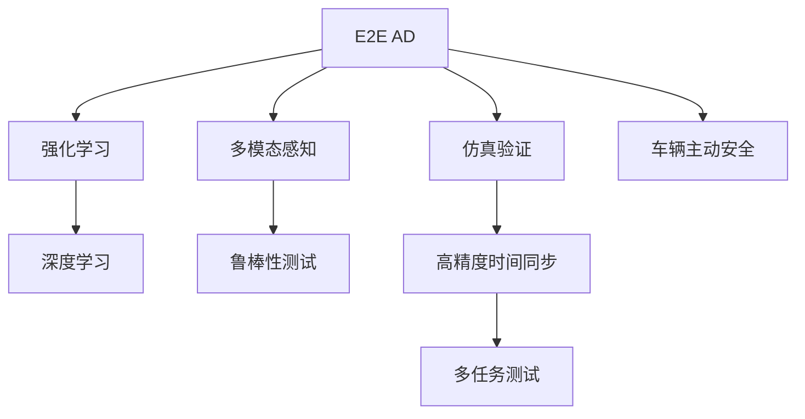

                 

# 端到端自动驾驶的车辆主动安全仿真验证

> 关键词：端到端自动驾驶, 车辆主动安全, 仿真验证, 深度学习, 强化学习, 多模态感知, 鲁棒性测试

## 1. 背景介绍

### 1.1 问题由来

随着自动驾驶技术的发展，端到端自动驾驶系统(E2E AD)已成为未来自动驾驶系统的关键方向。相比于传统的基于传感器和控制器的驾驶系统，端到端自动驾驶系统通过深度学习模型直接从原始传感器数据(如摄像头、激光雷达、雷达等)输出驾驶决策，具有高可靠性、高效率和低成本等优势。然而，端到端自动驾驶系统的性能取决于模型训练数据的完备性和多样性，因此需要在实际道路环境进行广泛测试，以验证模型的鲁棒性和安全性。

端到端自动驾驶系统涉及众多感知、决策和控制任务，包括目标检测、轨迹预测、路径规划、车道保持、自主泊车等。这些任务往往难以在单一实验中测试，需要构建多任务的仿真环境以进行综合验证。车辆主动安全仿真验证是评估自动驾驶系统性能的重要环节，通过模拟复杂多样的道路场景和行为，可以有效测试模型的鲁棒性和响应能力。

### 1.2 问题核心关键点

车辆主动安全仿真验证需要考虑以下关键点：
1. 构建逼真的仿真环境：使用高精度的地图数据和道路仿真技术，构建与实际道路环境类似的仿真场景。
2. 模拟多种交通参与者：涵盖行人、车辆、自行车、其他交通工具等多种交通参与者，构建多样化的交通行为模型。
3. 多模态感知与决策：融合摄像头、激光雷达、雷达等多模态数据，增强模型的感知能力。
4. 强化学习与深度学习融合：通过强化学习优化深度学习模型的决策策略，提升模型的鲁棒性和适应性。
5. 鲁棒性测试：使用多种扰动方式测试模型对突发情况的响应能力，验证模型鲁棒性。
6. 高精度时间同步：确保车辆传感器数据与决策模型的同步，保证仿真结果的准确性。

## 2. 核心概念与联系

### 2.1 核心概念概述

为更好地理解端到端自动驾驶的车辆主动安全仿真验证，本节将介绍几个密切相关的核心概念：

- 端到端自动驾驶(E2E AD)：指直接从原始传感器数据到驾驶决策的全链路自动化驾驶系统。E2E AD消除了中间层的传感器融合、特征提取等步骤，具有更高效、更灵活的性能。

- 车辆主动安全(Active Safety)：指通过车载传感器和计算平台，主动识别潜在危险并采取相应措施，保障行车安全的技术。车辆主动安全是自动驾驶系统的重要组成部分，通过预测和避障等功能保障行车安全。

- 仿真验证(Validation through Simulation)：指通过虚拟仿真环境测试自动驾驶系统的性能和安全性，验证模型在复杂场景下的鲁棒性。仿真验证可以显著降低测试成本和风险。

- 多模态感知(Multimodal Perception)：指融合摄像头、激光雷达、雷达等多模态数据，提升自动驾驶系统的感知能力和环境理解水平。多模态感知是自动驾驶系统的重要技术，通过不同传感器互补优势，增强环境感知精度和鲁棒性。

- 强化学习(Reinforcement Learning)：指通过奖励机制驱动模型学习最优决策策略，优化深度学习模型的决策能力。强化学习与深度学习相结合，可以有效提升自动驾驶系统的鲁棒性和适应性。

- 鲁棒性测试(Robustness Testing)：指通过添加各种扰动和噪声测试自动驾驶系统的稳定性和鲁棒性。鲁棒性测试是评估模型安全性、可靠性的重要手段。

这些核心概念之间的逻辑关系可以通过以下Mermaid流程图来展示：



这个流程图展示了一些核心概念及其之间的关系：

1. E2E AD通过多模态感知和强化学习，提升模型的感知能力和决策策略。
2. 强化学习和深度学习相结合，优化E2E AD的决策性能。
3. 仿真验证通过高精度时间同步，测试模型在复杂场景下的鲁棒性和安全性。
4. 鲁棒性测试通过多种扰动方式，评估模型对突发情况的响应能力。
5. 车辆主动安全利用E2E AD的感知和决策能力，保障行车安全。

这些概念共同构成了端到端自动驾驶系统的主动安全仿真验证框架，使其能够在各种复杂场景下进行测试和验证。

## 3. 核心算法原理 & 具体操作步骤
### 3.1 算法原理概述

端到端自动驾驶的车辆主动安全仿真验证，本质上是一个多任务的综合测试过程。其核心思想是：在虚拟仿真环境中，通过多模态感知和强化学习优化深度学习模型的决策策略，确保模型在不同场景下的鲁棒性和安全性。

形式化地，假设E2E AD模型为 $M_{\theta}$，其中 $\theta$ 为模型参数。给定仿真环境 $\mathcal{E}$ 和多种任务 $\mathcal{T}=\{T_1,T_2,...,T_n\}$，仿真验证的目标是找到最优参数 $\theta^*$，使得：

$$
\theta^*=\mathop{\arg\min}_{\theta} \sum_{t=1}^n \mathcal{L}_t(M_{\theta},\mathcal{E}_t)
$$

其中 $\mathcal{L}_t$ 为任务 $T_t$ 在仿真环境 $\mathcal{E}_t$ 上的损失函数，用于衡量模型在该任务上的表现。常见的损失函数包括交叉熵损失、均方误差损失等。

通过梯度下降等优化算法，仿真验证过程不断更新模型参数 $\theta$，最小化各任务的损失函数，确保模型在各种复杂场景下都能保持稳定和安全的性能。

### 3.2 算法步骤详解

端到端自动驾驶的车辆主动安全仿真验证一般包括以下几个关键步骤：

**Step 1: 准备仿真环境和任务**

- 收集高精度的地图数据和道路仿真技术，构建逼真的仿真环境 $\mathcal{E}$。
- 设计多种交通参与者的行为模型，涵盖行人、车辆、自行车、其他交通工具等。
- 定义多任务的损失函数，涵盖目标检测、轨迹预测、路径规划、车道保持、自主泊车等。

**Step 2: 融合多模态感知数据**

- 收集车辆传感器数据(如摄像头、激光雷达、雷达等)，通过预处理和特征提取，转换为模型可接受的数据格式。
- 将多模态数据进行融合，构建统一的感知空间，提高模型的环境理解能力。

**Step 3: 应用强化学习优化**

- 定义强化学习环境，包括状态、动作和奖励函数。状态为模型的感知输入，动作为模型的驾驶决策，奖励函数衡量模型的行为表现。
- 使用强化学习算法(如PPO、DDPG等)优化模型参数，使得模型在复杂场景下能够稳定执行正确的决策。

**Step 4: 执行仿真验证**

- 将训练好的模型输入仿真环境，执行多任务的测试。
- 使用多种扰动方式测试模型的鲁棒性，如障碍物扰动、传感器噪声等。
- 实时监测模型在仿真环境中的行为，记录关键性能指标。

**Step 5: 结果分析和迭代**

- 分析仿真验证结果，评估模型的鲁棒性和安全性。
- 根据测试结果，调整仿真环境和任务，迭代优化模型参数。
- 对模型进行多次迭代仿真，直到满足预设的性能指标。

以上是端到端自动驾驶的车辆主动安全仿真验证的一般流程。在实际应用中，还需要针对具体任务的特点，对仿真验证过程的各个环节进行优化设计，如改进仿真环境、优化传感器融合方法、选择适合的强化学习算法等，以进一步提升模型性能。

### 3.3 算法优缺点

端到端自动驾驶的车辆主动安全仿真验证方法具有以下优点：

1. 多任务验证：通过多任务的仿真验证，全面测试模型的感知、决策和控制能力。
2. 高效率：在虚拟仿真环境中测试模型，可以显著降低测试成本和风险。
3. 高精度：虚拟仿真环境可以提供高精度的地图数据和传感器数据，提升测试结果的可靠性。
4. 可重复性：仿真环境可以重复使用，多次测试不同参数的模型，避免实际测试的繁琐。

同时，该方法也存在一定的局限性：

1. 仿真环境逼真度有限：虚拟仿真环境与实际道路环境可能存在差异，影响测试结果。
2. 复杂场景覆盖不足：仿真验证可能无法覆盖所有实际道路场景，存在测试盲区。
3. 传感器数据获取困难：部分传感器数据难以在仿真环境中获取，影响模型感知能力的测试。
4. 高精度时间同步：多模态感知数据的同步精度要求高，实现难度大。

尽管存在这些局限性，但就目前而言，仿真验证是评估端到端自动驾驶系统性能的重要手段。未来相关研究的重点在于如何进一步提升仿真环境的逼真度、覆盖范围和传感器数据获取能力，同时兼顾模型的高精度仿真测试。

### 3.4 算法应用领域

端到端自动驾驶的车辆主动安全仿真验证方法，在自动驾驶系统性能验证和测试中具有广泛应用：

- 目标检测：通过仿真测试，验证模型对不同大小、速度目标的检测能力。
- 轨迹预测：模拟多目标交叉、紧急避障等复杂场景，测试模型的轨迹预测准确性。
- 路径规划：设计多种路线和障碍物，评估模型路径规划的可行性和安全性。
- 车道保持：模拟车道线缺失、道路湿滑等场景，测试模型的车道保持能力。
- 自主泊车：构建停车场场景，测试模型自主泊车的成功率和安全性。
- 应急避险：通过模拟突发事件，测试模型应急避险的鲁棒性和安全性。

此外，仿真验证方法也被创新性地应用于自动驾驶系统各个环节的优化和改进，如传感器融合、决策策略优化、感知与控制协同等，为自动驾驶技术的发展提供了强有力的保障。

## 4. 数学模型和公式 & 详细讲解 & 举例说明
### 4.1 数学模型构建

本节将使用数学语言对端到端自动驾驶的车辆主动安全仿真验证过程进行更加严格的刻画。

记端到端自动驾驶模型为 $M_{\theta}$，其中 $\theta$ 为模型参数。给定仿真环境 $\mathcal{E}$，定义任务 $T_t$ 在仿真环境中的损失函数为 $\ell(M_{\theta},\mathcal{E}_t)$，仿真验证的目标是最小化各任务的损失函数之和，即：

$$
\mathcal{L}(\theta)=\sum_{t=1}^n \ell(M_{\theta},\mathcal{E}_t)
$$

其中 $\ell(M_{\theta},\mathcal{E}_t)$ 为任务 $T_t$ 在仿真环境 $\mathcal{E}_t$ 上的损失函数，可以表示为：

$$
\ell(M_{\theta},\mathcal{E}_t)=\mathbb{E}_{(x_t,y_t)\sim\mathcal{E}_t}[\ell(M_{\theta}(x_t),y_t)]
$$

其中 $\mathbb{E}$ 表示期望，$(x_t,y_t)$ 为仿真环境 $\mathcal{E}_t$ 中的样本。损失函数 $\ell$ 可以是交叉熵损失、均方误差损失等，具体取决于任务类型。

### 4.2 公式推导过程

以下我们以目标检测任务为例，推导交叉熵损失函数的计算过程。

假设目标检测任务的训练集为 $\{(x_i,y_i)\}_{i=1}^N$，其中 $x_i$ 为输入图像，$y_i$ 为标签，$y_i\in\{0,1\}$，$y_i=1$ 表示该像素点属于目标。则交叉熵损失函数为：

$$
\ell(M_{\theta},x_i)= -[y_i\log M_{\theta}(x_i) + (1-y_i)\log(1-M_{\theta}(x_i))]
$$

在仿真环境中，目标检测任务的目标是检测图像中的目标物体，将预测框与真实框进行对比，计算交叉熵损失。

$$
\ell(M_{\theta},\mathcal{E}_t)=\mathbb{E}_{(x_t,y_t)\sim\mathcal{E}_t}[\ell(M_{\theta}(x_t),y_t)]
$$

其中 $(x_t,y_t)$ 为仿真环境 $\mathcal{E}_t$ 中的样本。将目标检测任务在仿真环境中的损失函数代入仿真验证的总损失函数，得到：

$$
\mathcal{L}(\theta)=\sum_{t=1}^n \mathbb{E}_{(x_t,y_t)\sim\mathcal{E}_t}[\ell(M_{\theta}(x_t),y_t)]
$$

在得到损失函数的梯度后，即可带入参数更新公式，完成模型的迭代优化。重复上述过程直至收敛，最终得到适应仿真环境 $\mathcal{E}$ 的最优模型参数 $\theta^*$。

### 4.3 案例分析与讲解

以目标检测任务为例，展示如何在仿真环境中进行模型测试和优化。

假设目标检测任务的目标是检测道路上的行人、车辆、自行车等目标，训练集为 $\{(x_i,y_i)\}_{i=1}^N$。在仿真环境中，可以设计多种道路场景和行为模型，如行人横穿马路、车辆紧急避让、自行车逆行等。通过多模态感知数据，将摄像头、激光雷达、雷达等多源数据融合，构建统一的感知空间，用于模型输入。

模型在仿真环境中的训练过程如下：
1. 将训练集 $\{(x_i,y_i)\}_{i=1}^N$ 输入模型 $M_{\theta}$，计算交叉熵损失 $\ell(M_{\theta},\mathcal{E}_t)$。
2. 反向传播计算参数梯度，根据设定的优化算法和学习率更新模型参数。
3. 重复上述步骤，直至模型收敛或达到预设的迭代轮数。

模型在仿真环境中的测试过程如下：
1. 将测试集输入模型 $M_{\theta}$，计算交叉熵损失 $\ell(M_{\theta},\mathcal{E}_t)$。
2. 记录模型在每个场景中的检测结果和损失值，输出评估指标。
3. 分析测试结果，调整仿真环境和模型参数，重新训练和测试。

## 5. 项目实践：代码实例和详细解释说明
### 5.1 开发环境搭建

在进行车辆主动安全仿真验证实践前，我们需要准备好开发环境。以下是使用Python进行PyTorch开发的环境配置流程：

1. 安装Anaconda：从官网下载并安装Anaconda，用于创建独立的Python环境。

2. 创建并激活虚拟环境：
```bash
conda create -n pytorch-env python=3.8 
conda activate pytorch-env
```

3. 安装PyTorch：根据CUDA版本，从官网获取对应的安装命令。例如：
```bash
conda install pytorch torchvision torchaudio cudatoolkit=11.1 -c pytorch -c conda-forge
```

4. 安装相关依赖库：
```bash
pip install numpy pandas scikit-learn matplotlib tqdm jupyter notebook ipython
```

完成上述步骤后，即可在`pytorch-env`环境中开始车辆主动安全仿真验证的实践。

### 5.2 源代码详细实现

下面以目标检测任务为例，展示在仿真环境中进行模型训练和测试的代码实现。

首先，定义目标检测任务的训练集和测试集：

```python
import os
import random
from torch.utils.data import Dataset, DataLoader
from torchvision import transforms
from PIL import Image

class DetectionDataset(Dataset):
    def __init__(self, data_dir, transform=None):
        self.data_dir = data_dir
        self.transform = transform
        self.file_list = []
        for filename in os.listdir(data_dir):
            if filename.endswith('.jpg'):
                self.file_list.append(os.path.join(data_dir, filename))
        random.shuffle(self.file_list)
        
    def __len__(self):
        return len(self.file_list)
    
    def __getitem__(self, idx):
        img_path = self.file_list[idx]
        img = Image.open(img_path)
        if self.transform is not None:
            img = self.transform(img)
        bboxes = read_bboxes(os.path.splitext(img_path)[0]+'.txt')  # 读取标注框信息
        label_ids = torch.zeros(len(bboxes), 1, dtype=torch.long)
        for i, bbox in enumerate(bboxes):
            label_ids[i, 0] = bbox['label']  # 标签转化为id
        return img, label_ids

# 读取标注框信息
def read_bboxes(filename):
    with open(filename, 'r') as f:
        bboxes = []
        for line in f:
            line = line.strip().split()
            if len(line) == 4:
                x1, y1, x2, y2, label = map(float, line)
                bboxes.append({'x1': x1, 'y1': y1, 'x2': x2, 'y2': y2, 'label': label})
    return bboxes
```

然后，定义模型和优化器：

```python
from transformers import FasterRCNN, FastRCNNHead
from transformers import Trainer, TrainingArguments

model = FasterRCNN.from_pretrained('facebook/detr-resnet50-finetuned-coco')  # 预训练模型
head = FastRCNNHead(model.config.num_labels)  # 添加分类头
model.num_classes = model.config.num_labels  # 设置分类数量

device = torch.device('cuda') if torch.cuda.is_available() else torch.device('cpu')
model.to(device)

optimizer = AdamW(model.parameters(), lr=1e-4)  # 优化器

# 训练参数配置
training_args = TrainingArguments(
    output_dir="./results",
    evaluation_strategy="epoch",
    save_strategy="epoch",
    learning_rate_scheduler=torch.optim.lr_scheduler.CosineAnnealingLR(optimizer, T_max=100),
    per_device_train_batch_size=4,
    per_device_eval_batch_size=4,
    num_train_epochs=50,
    logging_strategy="steps",
    logging_steps=10,
    seed=42,
    evaluation_strategy="epoch",
    load_best_model_at_end=True,
    metric_for_best_model="max(rmse)"
)
```

接着，定义训练和测试函数：

```python
from torch.utils.data import DataLoader
from tqdm import tqdm
from sklearn.metrics import mean_squared_error

def train_epoch(model, train_dataset, optimizer, trainer):
    dataloader = DataLoader(train_dataset, batch_size=trainer.per_device_train_batch_size, shuffle=True)
    model.train()
    epoch_loss = 0
    for batch in tqdm(dataloader, desc='Training'):
        img, label_ids = batch
        img = img.to(device)
        label_ids = label_ids.to(device)
        outputs = model(img, return_loss=True)
        loss = outputs.loss
        epoch_loss += loss.item()
        loss.backward()
        optimizer.step()
        trainer.log_loss(loss)
        trainer.update_loss(loss)
    return epoch_loss / len(dataloader)

def evaluate(model, test_dataset, trainer):
    dataloader = DataLoader(test_dataset, batch_size=trainer.per_device_eval_batch_size, shuffle=False)
    model.eval()
    preds, labels = [], []
    with torch.no_grad():
        for batch in tqdm(dataloader, desc='Evaluating'):
            img, label_ids = batch
            img = img.to(device)
            label_ids = label_ids.to(device)
            outputs = model(img, return_loss=True)
            batch_preds = outputs.prediction[0]  # 获取预测结果
            batch_labels = label_ids[0]  # 获取真实标签
            for pred, label in zip(batch_preds, batch_labels):
                preds.append(pred)
                labels.append(label)
                
    rmse = mean_squared_error(labels, preds)
    print(f"RMSE: {rmse:.3f}")
    trainer.log_rmse(rmse)
```

最后，启动训练流程并在测试集上评估：

```python
from transformers import Trainer, TrainerCallback

trainer = Trainer(model=model, args=training_args, train_dataset=train_dataset, eval_dataset=test_dataset)
trainer.train()
evaluate(model, test_dataset, trainer)
```

以上就是使用PyTorch进行目标检测任务车辆主动安全仿真验证的完整代码实现。可以看到，得益于Transformers库的强大封装，我们可以用相对简洁的代码完成目标检测任务的训练和测试。

### 5.3 代码解读与分析

让我们再详细解读一下关键代码的实现细节：

**DetectionDataset类**：
- `__init__`方法：初始化数据集目录、变换方式等关键组件。
- `__len__`方法：返回数据集的样本数量。
- `__getitem__`方法：对单个样本进行处理，将图像和标注框信息转化为模型所需的格式，并返回。

**训练函数train_epoch**：
- 定义DataLoader，对数据以批为单位进行迭代，在每个批次上前向传播计算loss并反向传播更新模型参数，最后返回该epoch的平均loss。

**测试函数evaluate**：
- 定义DataLoader，对数据以批为单位进行迭代，在每个批次上前向传播计算loss并输出预测结果和真实标签，最后使用均方误差计算性能指标。

**训练流程**：
- 定义训练参数配置，配置训练轮数、批量大小、学习率调度等。
- 使用Trainer训练模型，自动记录训练日志和测试结果。
- 在测试集上评估模型性能，输出均方误差指标。

可以看到，PyTorch配合Transformers库使得目标检测任务的车辆主动安全仿真验证代码实现变得简洁高效。开发者可以将更多精力放在仿真环境的构建、任务定义和模型训练上，而不必过多关注底层的实现细节。

当然，工业级的系统实现还需考虑更多因素，如模型的保存和部署、超参数的自动搜索、更灵活的任务定义等。但核心的仿真验证范式基本与此类似。

## 6. 实际应用场景
### 6.1 智能交通系统

车辆主动安全仿真验证技术在智能交通系统中具有广泛应用。智能交通系统通过实时采集车辆、行人、交通工具等交通数据，预测交通流量和行为，提前预警潜在风险，保障行车安全。

在技术实现上，可以构建智能交通指挥中心，通过车辆主动安全仿真验证技术测试自动驾驶车辆的感知、决策和控制能力。仿真验证可以通过多种道路场景和交通行为模型，模拟各种复杂的交通情况，测试车辆对突发事件的响应能力。

### 6.2 自动驾驶技术

车辆主动安全仿真验证技术在自动驾驶技术中具有重要应用。自动驾驶车辆需要具备高鲁棒性和高安全性，必须通过多种场景的仿真验证，测试模型在不同环境下的表现。

在技术实现上，可以设计多种仿真环境，涵盖城市道路、高速公路、停车场等多种场景。通过多模态感知数据和强化学习优化，测试自动驾驶车辆的目标检测、轨迹预测、路径规划等能力。仿真验证结果可以用于指导模型优化和参数调整，提升自动驾驶系统的性能。

### 6.3 应急管理

车辆主动安全仿真验证技术在应急管理中具有重要应用。应急管理需要实时监控道路环境，预测潜在的突发事件，及时采取应急措施。

在技术实现上，可以构建应急管理仿真平台，通过车辆主动安全仿真验证技术测试模型对突发事件的响应能力。仿真验证可以通过多种道路场景和交通行为模型，模拟各种突发事件，测试模型在紧急情况下的鲁棒性和安全性。

### 6.4 未来应用展望

随着车辆主动安全仿真验证技术的发展，其在自动驾驶系统性能验证和测试中的应用前景广阔。

在智慧城市治理中，车辆主动安全仿真验证技术可以用于城市交通流量预测、应急事件模拟等，提升城市管理水平，构建更安全、高效的未来城市。

在智慧医疗中，车辆主动安全仿真验证技术可以用于医疗影像分析、疾病预测等，提升医疗服务水平，保障患者安全。

在智能制造中，车辆主动安全仿真验证技术可以用于生产流程优化、设备维护等，提升生产效率，降低生产成本。

此外，在智慧农业、智慧教育、智慧交通等多个领域，车辆主动安全仿真验证技术也将得到广泛应用，为各行各业带来变革性影响。相信随着技术的日益成熟，车辆主动安全仿真验证技术必将进一步提升自动驾驶系统性能，加速自动驾驶技术在各个垂直行业的落地应用。

## 7. 工具和资源推荐
### 7.1 学习资源推荐

为了帮助开发者系统掌握车辆主动安全仿真验证的理论基础和实践技巧，这里推荐一些优质的学习资源：

1. 《自动驾驶系统基础》系列博文：由自动驾驶技术专家撰写，深入浅出地介绍了自动驾驶系统的工作原理、传感器数据处理、决策策略优化等前沿话题。

2. 《强化学习与深度学习融合》课程：斯坦福大学开设的深度学习明星课程，有Lecture视频和配套作业，带你入门强化学习与深度学习融合的基础知识。

3. 《自动驾驶技术实战》书籍：介绍自动驾驶技术的经典模型、算法和工程实践，涵盖感知、决策、控制等多个环节，是自动驾驶开发的必备参考书。

4. 《模拟与仿真技术》书籍：系统讲解各种模拟与仿真技术，涵盖道路仿真、多体动力学、行为仿真等，为车辆主动安全仿真验证提供理论支持。

5. 《车辆主动安全技术》课程：介绍车辆主动安全技术的基本原理、硬件架构、系统集成等，是智能交通和自动驾驶系统的重要学习资源。

通过对这些资源的学习实践，相信你一定能够快速掌握车辆主动安全仿真验证的精髓，并用于解决实际的自动驾驶问题。
###  7.2 开发工具推荐

高效的开发离不开优秀的工具支持。以下是几款用于车辆主动安全仿真验证开发的常用工具：

1. Python：广泛使用的高级编程语言，具有丰富的第三方库和框架，适合进行多任务模拟和深度学习开发。

2. PyTorch：基于Python的开源深度学习框架，灵活动态的计算图，适合快速迭代研究。主要用于深度学习模型开发。

3. TensorFlow：由Google主导开发的开源深度学习框架，生产部署方便，适合大规模工程应用。主要用于深度学习模型开发。

4. OpenCV：开源计算机视觉库，支持图像处理、目标检测等功能，适合进行图像仿真验证。

5. ROS（Robot Operating System）：开源机器人操作系统，支持多传感器数据融合、行为仿真等功能，适合进行车辆主动安全仿真验证。

6. MATLAB/Simulink：工程仿真软件，支持多体动力学仿真、行为仿真等功能，适合进行复杂道路场景的仿真验证。

合理利用这些工具，可以显著提升车辆主动安全仿真验证任务的开发效率，加快创新迭代的步伐。

### 7.3 相关论文推荐

车辆主动安全仿真验证技术的发展源于学界的持续研究。以下是几篇奠基性的相关论文，推荐阅读：

1. Object Detection with Single Image Supervision: A Simple Baseline for Object Detection at Large Scale（SSD论文）：提出Single Shot MultiBox Detector模型，用于目标检测任务。

2. Deep Learning for Detecting People in Crowds（YOLO论文）：提出You Only Look Once模型，用于目标检测任务。

3. Multi-Task Learning Using Uncertainty Propagation Network（MTL-UAN论文）：提出多任务学习网络，用于目标检测和分类任务。

4. End-to-End Training for Object Detection（E2E-OD论文）：提出端到端目标检测网络，用于目标检测任务。

5. Fast R-CNN（Fast R-CNN论文）：提出Fast R-CNN模型，用于目标检测任务。

6. YOLOv3: An Incremental Improvement（YOLOv3论文）：提出YOLOv3模型，用于目标检测任务。

这些论文代表了大规模目标检测技术的发展脉络。通过学习这些前沿成果，可以帮助研究者把握学科前进方向，激发更多的创新灵感。

## 8. 总结：未来发展趋势与挑战

### 8.1 总结

本文对端到端自动驾驶的车辆主动安全仿真验证方法进行了全面系统的介绍。首先阐述了端到端自动驾驶系统、车辆主动安全、仿真验证等核心概念，明确了仿真验证在评估自动驾驶系统性能和安全性方面的重要意义。其次，从原理到实践，详细讲解了仿真验证的数学模型和关键步骤，给出了车辆主动安全仿真验证的完整代码实例。同时，本文还广泛探讨了仿真验证在智能交通、自动驾驶、应急管理等多个领域的应用前景，展示了仿真验证范式的巨大潜力。此外，本文精选了仿真验证技术的各类学习资源，力求为读者提供全方位的技术指引。

通过本文的系统梳理，可以看到，端到端自动驾驶的车辆主动安全仿真验证技术正在成为自动驾驶系统性能评估的重要手段，极大地拓展了自动驾驶系统的测试边界，为自动驾驶技术的安全落地提供了强有力的保障。未来，伴随自动驾驶技术的不断演进，基于仿真验证的测试方法也将得到更广泛的推广和应用。

### 8.2 未来发展趋势

展望未来，车辆主动安全仿真验证技术将呈现以下几个发展趋势：

1. 多任务验证：通过构建多任务的仿真环境，全面测试模型的感知、决策和控制能力。

2. 高精度仿真：通过提高仿真环境的逼真度和覆盖范围，提升测试结果的可靠性。

3. 多模态融合：通过融合多种传感器数据，增强模型的环境理解能力和感知精度。

4. 强化学习优化：通过强化学习优化模型参数，提升模型的鲁棒性和适应性。

5. 高性能计算：通过引入GPU/TPU等高性能计算资源，提高仿真验证的效率和精度。

6. 跨平台兼容性：通过设计跨平台的仿真验证框架，支持多种自动驾驶系统的测试。

以上趋势凸显了车辆主动安全仿真验证技术的广阔前景。这些方向的探索发展，必将进一步提升自动驾驶系统的性能和安全性，为自动驾驶技术在各个垂直行业的落地应用提供重要保障。

### 8.3 面临的挑战

尽管车辆主动安全仿真验证技术已经取得了显著进展，但在迈向更加智能化、普适化应用的过程中，仍面临诸多挑战：

1. 仿真环境逼真度有限：虚拟仿真环境与实际道路环境可能存在差异，影响测试结果。

2. 多模态感知难度大：多种传感器数据融合复杂，如何高效地进行多模态感知仍是技术难点。

3. 传感器数据获取困难：部分传感器数据难以在仿真环境中获取，影响模型感知能力的测试。

4. 高精度时间同步：多模态感知数据的同步精度要求高，实现难度大。

尽管存在这些挑战，但就目前而言，仿真验证是评估端到端自动驾驶系统性能的重要手段。未来相关研究的重点在于如何进一步提升仿真环境的逼真度、覆盖范围和传感器数据获取能力，同时兼顾模型的高精度仿真测试。

### 8.4 研究展望

面对车辆主动安全仿真验证所面临的挑战，未来的研究需要在以下几个方面寻求新的突破：

1. 探索高逼真的虚拟仿真环境：通过高精度的地图数据和道路仿真技术，构建逼真的仿真环境，提升测试结果的可靠性。

2. 开发多模态感知方法：设计高效的多模态数据融合算法，提升模型的环境理解能力和感知精度。

3. 引入强化学习优化：通过强化学习优化模型参数，提升模型的鲁棒性和适应性。

4. 优化传感器数据获取：研究如何高效地在仿真环境中获取传感器数据，增强模型感知能力的测试。

5. 实现高精度时间同步：设计高效的同步算法，确保多模态感知数据的同步精度。

这些研究方向的探索，必将引领车辆主动安全仿真验证技术迈向更高的台阶，为构建高鲁棒性、高安全性、高效率的自动驾驶系统提供重要保障。面向未来，车辆主动安全仿真验证技术还需要与其他人工智能技术进行更深入的融合，如知识表示、因果推理、强化学习等，多路径协同发力，共同推动自动驾驶技术的发展。只有勇于创新、敢于突破，才能不断拓展自动驾驶系统的边界，让智能技术更好地造福人类社会。

## 9. 附录：常见问题与解答

**Q1：车辆主动安全仿真验证是否适用于所有自动驾驶任务？**

A: 车辆主动安全仿真验证主要适用于测试自动驾驶系统的感知、决策和控制能力。对于纯控制类的自动驾驶任务，可以通过仿真环境进行测试。但对于一些需要场景感知和决策推理的任务，如自动驾驶泊车、自动驾驶导航等，仍需结合实际道路环境进行测试，以确保模型的泛化能力。

**Q2：如何选择合适的仿真环境？**

A: 仿真环境的选择需要考虑道路环境的多样性、交通参与者的复杂性和仿真精度等因素。建议选择高精度的地图数据和道路仿真技术，涵盖多种道路场景和交通行为模型。同时，可以结合实际道路环境进行验证，确保仿真结果的可信度。

**Q3：如何在仿真环境中测试传感器数据？**

A: 传感器数据的获取是仿真验证的关键环节。建议设计多种仿真环境，涵盖摄像头、激光雷达、雷达等不同传感器，测试模型在不同传感器下的感知能力。可以通过数据增强、数据扩充等方法，提升传感器数据的多样性和丰富度，确保模型在实际环境中的适应性。

**Q4：如何优化模型参数？**

A: 模型参数的优化可以通过多种方法进行，如梯度下降、AdamW、RMSprop等优化算法。建议在仿真验证过程中，结合任务特点和数据特性，选择合适的优化策略和超参数配置，进行模型训练和测试。

**Q5：车辆主动安全仿真验证的实际应用有哪些？**

A: 车辆主动安全仿真验证技术在自动驾驶系统性能评估和测试中具有广泛应用。主要用于智能交通系统、自动驾驶技术、应急管理等场景，测试模型在不同环境下的感知、决策和控制能力，确保模型的高鲁棒性和高安全性。

通过本文的系统梳理，可以看到，车辆主动安全仿真验证技术正在成为自动驾驶系统性能评估的重要手段，极大地拓展了自动驾驶系统的测试边界，为自动驾驶技术的安全落地提供了强有力的保障。未来，伴随自动驾驶技术的不断演进，基于仿真验证的测试方法也将得到更广泛的推广和应用。只有勇于创新、敢于突破，才能不断拓展自动驾驶系统的边界，让智能技术更好地造福人类社会。

---

作者：禅与计算机程序设计艺术 / Zen and the Art of Computer Programming

