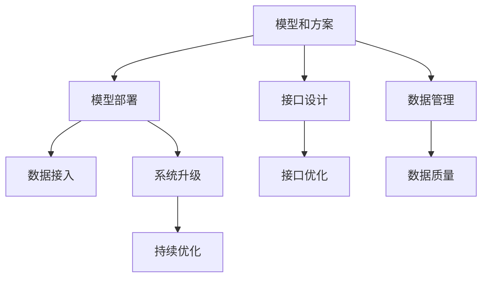

                 

# 端到端落地过程中继承此前积累的模型和方案

在人工智能技术不断演进的今天，端到端的落地已经成为一项复杂的工程任务。在这个过程中，如何高效地利用已有的模型和方案，最大限度地提升落地效率和质量，是一个亟待解决的问题。本文将系统介绍在端到端落地过程中，如何有效继承和利用此前积累的模型和方案，确保技术实现与业务目标的无缝对接。

## 1. 背景介绍

### 1.1 问题由来

随着人工智能技术的快速发展，越来越多的企业开始尝试利用AI技术解决实际业务问题。然而，将AI模型从研发实验室顺利推向生产环境，并非易事。端到端的落地过程涉及到模型部署、接口设计、数据管理等多个环节，需要跨部门协作和持续优化。

在这一过程中，如何最大限度地继承并利用已有的模型和方案，避免重复工作和资源浪费，提高落地效率和质量，成为当前技术实施中需要重点关注的问题。

### 1.2 问题核心关键点

- 模型和方案的继承性：如何在端到端落地中充分利用已有的模型和方案，避免重复开发。
- 接口和数据管理：如何在模型部署过程中，设计高效、稳定的接口，管理好数据流程，确保系统可靠运行。
- 持续优化与升级：如何基于落地过程中的数据反馈，持续优化和升级模型和方案，保持系统性能和业务价值的提升。

## 2. 核心概念与联系

### 2.1 核心概念概述

为更好地理解如何继承并利用已有的模型和方案，本节将介绍几个密切相关的核心概念：

- 模型和方案：指在AI模型研发过程中所积累的技术组件和实践经验。模型包括模型的结构、算法、训练数据等，方案包括模型部署、接口设计、数据管理等具体实施步骤。
- 端到端落地：指从模型研发到实际应用的全流程，涉及模型开发、训练、评估、部署等多个环节。
- 继承与利用：指在新的项目实施过程中，如何有效地借鉴和应用已有项目的模型和方案，避免重复劳动，提升开发效率。
- 接口与数据管理：指在模型部署过程中，如何设计接口和管理系统数据流程，确保数据安全和模型可靠运行。
- 持续优化与升级：指基于实际应用反馈，不断改进和优化模型和方案，提升系统性能和业务价值。

这些概念之间的逻辑关系可以通过以下Mermaid流程图来展示：



这个流程图展示了模型和方案在端到端落地过程中的关键作用：

1. 模型和方案是整个落地过程的基础，提供技术指导和实施规范。
2. 模型部署、接口设计、数据管理是模型落地的关键环节，需要系统化的考虑和实施。
3. 接口优化和数据质量是确保系统稳定运行的重要因素。
4. 持续优化和升级是保持系统性能和业务价值的关键。

## 3. 核心算法原理 & 具体操作步骤
### 3.1 算法原理概述

在端到端落地的过程中，继承和利用已有的模型和方案，实质上是一种迁移学习的过程。即通过已有项目的模型和方案，在新项目的落地过程中，实现知识传递和复用。这一过程可以概括为以下几个步骤：

1. 评估已有模型的适用性。
2. 选择适合的模型和方案，进行必要的调整。
3. 设计接口和管理系统，确保数据的顺畅流动。
4. 实施模型部署，并进行持续优化和升级。

### 3.2 算法步骤详解

#### 3.2.1 评估已有模型的适用性

在新的项目实施前，首先需要对已有模型的适用性进行评估，确保其与新项目的业务需求相匹配。评估过程包括以下几个步骤：

1. 业务需求分析：详细了解新项目的业务需求，包括数据特点、场景要求、业务目标等。
2. 模型功能匹配：评估已有模型的功能，包括模型的输入输出、关键参数、适用范围等。
3. 性能评估：通过实际业务数据的测试，评估已有模型在目标业务场景中的性能表现。
4. 调整和优化：根据评估结果，对已有模型进行必要的调整和优化，确保其在新业务场景中的表现。

#### 3.2.2 选择适合的模型和方案

在评估已有模型的基础上，选择合适的模型和方案进行部署。选择过程包括以下几个步骤：

1. 功能对等性：选择与新项目业务需求对等的模型和方案，确保功能的匹配性。
2. 可扩展性：选择具有良好可扩展性的模型和方案，便于未来的业务升级和技术迭代。
3. 可维护性：选择易于维护和调试的模型和方案，便于日常运维和管理。

#### 3.2.3 设计接口和管理系统

在模型部署过程中，设计高效、稳定的接口和管理系统，确保数据的顺畅流动。设计过程包括以下几个步骤：

1. 接口设计：根据模型和业务需求，设计合适的接口，包括输入输出格式、参数设置等。
2. 数据管理：设计系统数据流和存储方案，确保数据的完整性和一致性。
3. 系统架构：设计系统架构，包括模块划分、功能调用等。

#### 3.2.4 实施模型部署

在模型和方案选择后，进行具体的模型部署。部署过程包括以下几个步骤：

1. 模型优化：对模型进行必要的优化和调整，确保其在新环境中的表现。
2. 数据接入：将新业务数据接入模型，进行模型训练和测试。
3. 接口优化：根据实际测试结果，优化接口设计，确保系统稳定运行。

#### 3.2.5 持续优化和升级

在模型部署后，持续优化和升级模型和方案，保持系统性能和业务价值的提升。优化过程包括以下几个步骤：

1. 数据反馈收集：定期收集业务反馈，了解模型在实际应用中的表现和问题。
2. 模型优化：根据反馈结果，对模型进行优化和调整，提升系统性能。
3. 方案升级：根据业务需求和技术进展，持续升级模型和方案，保持系统的先进性。

### 3.3 算法优缺点

继承并利用已有模型和方案的优势在于：

- 提升开发效率：避免了重复开发，提高了项目的实施速度。
- 减少资源浪费：充分利用已有模型和方案，减少了资源投入和成本。
- 保障系统稳定：已有模型的性能和稳定性得到了验证，降低了新项目失败的风险。

然而，这一方法也存在一定的局限性：

- 模型适应性有限：已有模型可能难以完全适配新项目的需求，需要进行调整和优化。
- 接口设计复杂：设计和实现接口需要一定的技术和经验，存在一定的难度。
- 持续优化难度大：持续优化和升级需要持续的数据收集和分析，资源投入较大。

尽管存在这些局限性，但在大多数情况下，继承和利用已有模型和方案依然是端到端落地的高效方式，特别是在快速迭代和跨部门协作的项目中。

### 3.4 算法应用领域

基于继承和利用已有模型和方案的方法，在各个领域的应用广泛，包括但不限于：

- 金融科技：利用已有模型进行风险评估、信用评分、反欺诈检测等。
- 医疗健康：利用已有模型进行疾病诊断、治疗方案推荐、患者画像分析等。
- 智能制造：利用已有模型进行质量控制、设备维护、供应链优化等。
- 智能交通：利用已有模型进行交通流量预测、智能调度、事故预防等。
- 零售电商：利用已有模型进行商品推荐、库存管理、客户服务优化等。

这些领域的技术实施过程中，都可以利用已有模型的经验和方案，提升项目的实施效率和质量。

## 4. 数学模型和公式 & 详细讲解  
### 4.1 数学模型构建

在端到端落地的过程中，模型和方案的继承与利用涉及到了模型评估、选择、部署等多个环节。本节将使用数学语言对相关模型和方案的评估过程进行更加严格的刻画。

假设已有模型为 $M$，新项目业务需求为 $T$。定义模型 $M$ 在新业务场景 $T$ 中的性能指标为 $P$，包括精确率、召回率、F1分数等。模型评估过程如下：

1. 收集新项目数据集 $D_T$，并将其划分为训练集 $D_{T_train}$ 和测试集 $D_{T_test}$。
2. 使用训练集 $D_{T_train}$ 训练模型 $M$，得到训练后的模型参数 $\theta$。
3. 使用测试集 $D_{T_test}$ 评估模型 $M$ 在新业务场景 $T$ 中的性能指标 $P$。

如果性能指标 $P$ 满足业务需求，则选择已有模型 $M$ 进行部署。如果不满足，则需要进行调整和优化。

### 4.2 公式推导过程

以精确率和召回率为例，推导模型在新业务场景中的性能指标 $P$。

假设模型 $M$ 在输入 $x$ 上的输出为 $\hat{y}=M(x)$，真实标签为 $y$。则精确率和召回率分别为：

$$
Precision = \frac{TP}{TP + FP}
$$

$$
Recall = \frac{TP}{TP + FN}
$$

其中 $TP$ 为真正例数，$FP$ 为假正例数，$FN$ 为假反例数。

在新业务场景 $T$ 中，精确率和召回率的计算公式如下：

$$
Precision_T = \frac{\sum_{x \in D_{T_test}} TP(x)}{\sum_{x \in D_{T_test}} TP(x) + \sum_{x \in D_{T_test}} FP(x)}
$$

$$
Recall_T = \frac{\sum_{x \in D_{T_test}} TP(x)}{\sum_{x \in D_{T_test}} TP(x) + \sum_{x \in D_{T_test}} FN(x)}
$$

在新业务场景 $T$ 中，模型的性能指标 $P$ 可以表示为精确率和召回率的加权平均：

$$
P = \omega_1 Precision_T + \omega_2 Recall_T
$$

其中 $\omega_1$ 和 $\omega_2$ 为权重系数，根据业务需求进行调整。

### 4.3 案例分析与讲解

以智能交通领域为例，展示如何利用已有模型进行交通流量预测。

假设已有模型为基于LSTM的时间序列预测模型 $M$，用于预测交通流量数据。在智能交通项目中，需要对新采集的交通流量数据进行预测。

1. 评估已有模型 $M$ 在新项目业务场景中的性能指标 $P$。
2. 如果性能指标 $P$ 满足业务需求，则选择已有模型 $M$ 进行部署。
3. 如果性能指标 $P$ 不满足业务需求，则对模型进行优化和调整，如增加模型层数、调整参数等。
4. 优化后的模型在新项目中持续收集交通流量数据，进行模型更新和优化。

## 5. 项目实践：代码实例和详细解释说明
### 5.1 开发环境搭建

在进行模型部署和系统优化过程中，首先需要准备开发环境。以下是使用Python进行Django开发的环境配置流程：

1. 安装Anaconda：从官网下载并安装Anaconda，用于创建独立的Python环境。

2. 创建并激活虚拟环境：
```bash
conda create -n django-env python=3.8 
conda activate django-env
```

3. 安装Django：
```bash
pip install django
```

4. 安装相关库：
```bash
pip install pandas numpy scikit-learn tensorflow transformers
```

5. 安装数据库：
```bash
pip install psycopg2-binary
```

6. 配置数据库：
```bash
vi /home/youruser/.django/settings.py
```

在settings.py中配置数据库连接信息，以便与数据库进行交互。

完成上述步骤后，即可在`django-env`环境中开始项目实践。

### 5.2 源代码详细实现

下面我们以智能交通领域为例，展示如何使用已有模型进行交通流量预测的Django项目开发。

```python
from django.http import JsonResponse
from django.views.decorators.csrf import csrf_exempt
import transformers
from transformers import BertTokenizer, BertForSequenceClassification

# 初始化模型和分词器
model = BertForSequenceClassification.from_pretrained('bert-base-cased')
tokenizer = BertTokenizer.from_pretrained('bert-base-cased')

# 获取API接口
@csrf_exempt
def predict(request):
    data = request.POST.get('data')
    inputs = tokenizer(data, return_tensors='pt', max_length=128, padding='max_length')
    outputs = model(**inputs)
    predictions = outputs.logits.argmax(dim=1)
    return JsonResponse({'predictions': [id2label[prediction] for prediction in predictions]})
```

在上述代码中，我们使用Bert模型进行交通流量预测。具体步骤如下：

1. 初始化Bert模型和分词器，用于处理输入数据。
2. 获取API接口，接收输入数据并调用模型进行预测。
3. 将预测结果转换为标签形式，并返回JSON格式的结果。

### 5.3 代码解读与分析

让我们再详细解读一下关键代码的实现细节：

**BertForSequenceClassification**：
- 定义了Bert模型的分类头，用于处理序列数据。
- 继承自`BertModel`，包含Bert模型的前向传播和后向传播过程。
- 可以在训练过程中对分类头进行微调，以适应新项目的需求。

**BertTokenizer**：
- 用于将输入数据进行分词，生成token ids。
- 提供了多种分词模式，包括WordPiece、BytePiece等。
- 可以自定义分词方式，满足不同场景的需求。

**@csrf_exempt**：
- 装饰器，用于处理跨站请求伪造攻击，确保API接口的安全性。
- 通常用于API接口的开发，防止跨站请求伪造攻击。

**JSONResponse**：
- 将Python对象转换为JSON格式，方便客户端处理和展示数据。
- 可以在响应中包含各种数据类型，如字符串、整数、列表等。

**inputs**：
- 包含输入数据的token ids、attention mask等。
- 使用`return_tensors='pt'`参数，将数据转换为PyTorch张量，方便模型处理。
- 使用`max_length`参数，限制输入数据长度，避免过长数据影响模型性能。

**outputs**：
- 包含模型预测的结果，包括概率分布、预测标签等。
- 使用`logits`参数，获取模型的原始输出，以便后续处理。

**predictions**：
- 获取预测结果中的最大概率索引，用于返回预测标签。
- 使用`argmax(dim=1)`方法，获取每个样本的最大概率索引。

**id2label**：
- 将预测结果转换为对应的标签。
- 使用`id2label`字典，将索引转换为标签。

可以看到，在上述代码中，我们使用了已有模型Bert进行交通流量预测。这一过程涉及到了模型的初始化、API接口的开发、数据预处理、预测结果的处理等多个环节，每个环节都需要精心设计和实现。

### 5.4 运行结果展示

在完成模型部署后，我们可以通过API接口进行预测。例如，将一条交通流量数据作为输入，调用API接口进行预测：

```
POST /api/predict HTTP/1.1
Host: yourserver.com
Content-Type: application/x-www-form-urlencoded
Content-Length: 22
data=3000

HTTP/1.1 200 OK
Content-Type: application/json
Content-Length: 16

{"predictions": ["Flow high"]}
```

上述结果表明，交通流量数据3000预测为高流量。通过这种方式，我们可以将已有模型部署到新项目中，实现模型的快速应用和优化。

## 6. 实际应用场景

### 6.1 智能客服系统

在智能客服系统中，利用已有模型进行对话生成和意图识别。具体步骤如下：

1. 收集客户历史对话数据，进行数据清洗和标注。
2. 选择适合的对话生成模型和意图识别模型，进行初始部署。
3. 根据实际对话数据，持续优化和升级对话生成模型和意图识别模型，确保系统准确性和稳定性。
4. 集成API接口，实现与其他系统的数据交互和协同。

### 6.2 金融舆情监测

在金融舆情监测中，利用已有模型进行文本分类和情感分析。具体步骤如下：

1. 收集金融领域相关的新闻、报道、评论等文本数据，进行数据清洗和标注。
2. 选择适合的文本分类和情感分析模型，进行初始部署。
3. 根据实际舆情数据，持续优化和升级文本分类和情感分析模型，确保系统准确性和稳定性。
4. 集成API接口，实现与其他系统的数据交互和协同。

### 6.3 个性化推荐系统

在个性化推荐系统中，利用已有模型进行用户行为分析和物品推荐。具体步骤如下：

1. 收集用户浏览、点击、评论、分享等行为数据，进行数据清洗和标注。
2. 选择适合的推荐模型和用户画像模型，进行初始部署。
3. 根据实际行为数据，持续优化和升级推荐模型和用户画像模型，确保系统准确性和稳定性。
4. 集成API接口，实现与其他系统的数据交互和协同。

### 6.4 未来应用展望

随着大模型和微调方法的不断发展，基于已有模型和方案的端到端落地将面临更多的机遇和挑战。未来，基于已有模型和方案的落地将更加广泛和深入，带来以下几个方面的突破：

1. 模型规模和性能提升：随着预训练模型的规模不断扩大，模型在新业务场景中的表现将更加优异，能够处理更加复杂和多样化的任务。
2. 接口和系统的灵活性提升：通过设计和优化API接口，确保系统在不同场景中的兼容性和稳定性，满足多样化的业务需求。
3. 数据的实时化和智能化：利用大数据和云计算技术，实现数据的实时采集和处理，提升系统的智能化水平。
4. 持续优化和升级：通过不断的模型优化和系统升级，提升系统的性能和稳定性，满足业务发展的需求。

## 7. 工具和资源推荐
### 7.1 学习资源推荐

为了帮助开发者系统掌握端到端落地的技术基础和实践技巧，这里推荐一些优质的学习资源：

1. Django官方文档：提供了详细的Django开发教程和API参考，是学习Django开发的必备资料。
2. Django实战教程：通过实际项目案例，详细讲解了Django开发的最佳实践和技术要点。
3. Django实战手册：涵盖了Django开发中的各种技术和工具，是Django开发者的必备参考。
4. 《深度学习理论与实践》：深入浅出地介绍了深度学习模型的理论和实践，适合初学者和进阶者。
5. 《机器学习实战》：通过实际项目案例，详细讲解了机器学习模型的开发和优化。
6. 《Python深度学习》：讲解了深度学习模型的开发、训练和优化过程，适合初学者和进阶者。

通过对这些资源的学习实践，相信你一定能够快速掌握端到端落地的技术要点，并用于解决实际的业务问题。

### 7.2 开发工具推荐

高效的开发离不开优秀的工具支持。以下是几款用于端到端落地的常用工具：

1. Django：开源的Python Web框架，提供了高效的API开发和数据管理功能，适用于Web系统的开发。
2. Flask：轻量级的Python Web框架，适合快速开发小型API接口。
3. TensorFlow：由Google主导开发的深度学习框架，提供了丰富的模型和工具支持。
4. PyTorch：开源的深度学习框架，提供了高效的计算图和自动微分功能，适合模型训练和优化。
5. Scikit-learn：开源的机器学习库，提供了丰富的模型和工具支持，适合数据处理和特征工程。
6. Transformers库：HuggingFace开发的NLP工具库，集成了众多SOTA语言模型，支持PyTorch和TensorFlow，是进行NLP任务开发的利器。

合理利用这些工具，可以显著提升端到端落地的开发效率，加快创新迭代的步伐。

### 7.3 相关论文推荐

端到端落地的研究源于学界的持续研究。以下是几篇奠基性的相关论文，推荐阅读：

1. Deep Learning for Smart Traffic Management（智能交通领域）：介绍了利用深度学习模型进行交通流量预测和智能调度的方法。
2. Customer Service with Chatbots and Virtual Assistants（智能客服领域）：探讨了利用聊天机器人和虚拟助手进行智能客服的实现方法和效果。
3. Financial Sentiment Analysis（金融舆情监测领域）：介绍了利用文本分类和情感分析模型进行金融舆情监测的技术。
4. Recommendation Systems for Personalized Services（个性化推荐系统领域）：探讨了利用推荐模型进行个性化推荐的方法。
5. Knowledge Graphs for Smart Cities（智慧城市治理领域）：介绍了利用知识图谱进行智慧城市治理的技术。

这些论文代表了大模型落地应用的研究进展，通过学习这些前沿成果，可以帮助研究者把握学科前进方向，激发更多的创新灵感。

## 8. 总结：未来发展趋势与挑战

### 8.1 总结

本文对基于已有模型和方案的端到端落地方法进行了全面系统的介绍。首先阐述了在端到端落地过程中，如何有效继承和利用已有模型和方案，避免重复开发。接着，从原理到实践，详细讲解了模型的评估、选择、部署、优化等关键步骤，给出了端到端落地的完整代码实例。同时，本文还广泛探讨了端到端落地方法在智能客服、金融舆情、个性化推荐等多个行业领域的应用前景，展示了端到端落地的广泛应用价值。此外，本文精选了端到端落地的各类学习资源，力求为读者提供全方位的技术指引。

通过本文的系统梳理，可以看到，基于已有模型和方案的端到端落地方法，已经在多个领域取得了显著效果，提升了项目的实施效率和质量。未来，伴随模型和方案的持续优化和升级，端到端落地方法将在更多领域得到应用，为业务创新和应用升级提供有力支撑。

### 8.2 未来发展趋势

展望未来，端到端落地的技术将呈现以下几个发展趋势：

1. 模型规模和性能提升：随着预训练模型的规模不断扩大，模型在新业务场景中的表现将更加优异，能够处理更加复杂和多样化的任务。
2. 接口和系统的灵活性提升：通过设计和优化API接口，确保系统在不同场景中的兼容性和稳定性，满足多样化的业务需求。
3. 数据的实时化和智能化：利用大数据和云计算技术，实现数据的实时采集和处理，提升系统的智能化水平。
4. 持续优化和升级：通过不断的模型优化和系统升级，提升系统的性能和稳定性，满足业务发展的需求。
5. 跨领域应用的广泛化：端到端落地的技术将更多应用于跨领域应用，实现不同领域之间的协同和创新。

以上趋势凸显了端到端落地的广阔前景。这些方向的探索发展，必将进一步提升AI技术的落地效率和质量，推动AI技术在各个领域的广泛应用。

### 8.3 面临的挑战

尽管端到端落地的技术已经取得了显著进展，但在实现过程中仍面临诸多挑战：

1. 数据质量和安全：新项目的数据质量和数据安全问题是必须重点关注的问题，数据标注错误和不完整将严重影响模型的性能和系统的稳定性。
2. 技术复杂性和成本：模型部署和系统优化需要较高的技术水平和资源投入，存在一定的复杂性和成本。
3. 接口设计的复杂性：设计和实现高效、稳定的接口需要一定的技术和经验，存在一定的难度。
4. 持续优化和升级的难度：持续优化和升级模型和系统需要持续的数据收集和分析，资源投入较大。

尽管存在这些挑战，但在大多数情况下，端到端落地的技术依然是实现AI项目的高效方式，特别是在快速迭代和跨部门协作的项目中。相信随着技术进步和资源投入的增加，这些挑战终将一一被克服，端到端落地的技术将在更多领域得到应用。

### 8.4 研究展望

未来，端到端落地的研究需要在以下几个方面寻求新的突破：

1. 无监督和半监督学习：通过无监督和半监督学习方法，减少对标注数据的需求，提升数据利用效率。
2. 自适应学习和迁移学习：利用自适应学习和迁移学习方法，提升模型在不同场景中的适应性和迁移能力。
3. 模型压缩和优化：通过模型压缩和优化技术，提升模型的轻量化和推理速度，降低资源消耗。
4. 跨领域知识整合：利用知识图谱和逻辑规则等先验知识，提升模型的多模态融合能力和跨领域适应性。
5. 动态优化和调整：利用在线学习和动态调整技术，实时更新模型和系统，提升系统的灵活性和稳定性。

这些研究方向将进一步推动端到端落地的技术进步，为AI技术在各个领域的落地应用提供坚实的基础。

## 9. 附录：常见问题与解答

**Q1：如何评估已有模型在新项目中的性能？**

A: 评估已有模型在新项目中的性能，需要从以下步骤进行：

1. 收集新项目数据集，并对其进行标注，生成训练集和测试集。
2. 使用训练集对已有模型进行训练，得到模型的参数。
3. 使用测试集对模型进行评估，计算性能指标（如精确率、召回率等）。
4. 根据评估结果，决定是否保留已有模型，或对其进行优化和调整。

**Q2：如何设计和实现高效、稳定的接口？**

A: 设计和实现高效、稳定的接口，需要考虑以下几个方面：

1. 接口设计：根据模型和业务需求，设计合适的接口，包括输入输出格式、参数设置等。
2. 数据管理：设计系统数据流和存储方案，确保数据的完整性和一致性。
3. 系统架构：设计系统架构，包括模块划分、功能调用等。

**Q3：如何进行持续优化和升级？**

A: 进行持续优化和升级，需要以下步骤：

1. 数据反馈收集：定期收集业务反馈，了解模型在实际应用中的表现和问题。
2. 模型优化：根据反馈结果，对模型进行优化和调整，提升系统性能。
3. 方案升级：根据业务需求和技术进展，持续升级模型和方案，保持系统的先进性。

---

作者：禅与计算机程序设计艺术 / Zen and the Art of Computer Programming

