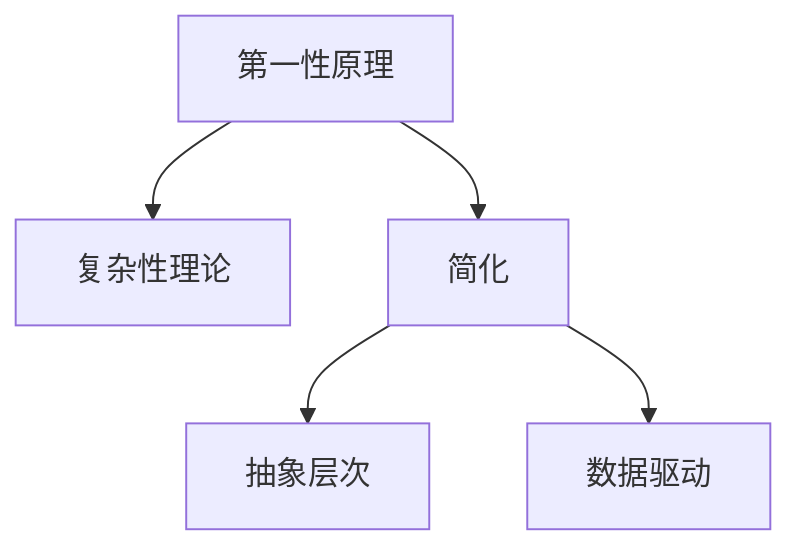

                 

# 第一性原理：从基础到复杂的科学方法

> 关键词：第一性原理, 科学方法, 简单化, 复杂性, 计算机科学

## 1. 背景介绍

### 1.1 问题由来
第一性原理是一种科学方法论，它源自古希腊哲学家亚里士多德的“第一原理”概念，即在追求知识的过程中，不能仅依赖现有的假设，而应基于最基本的事实和逻辑进行推导。在现代科学和技术领域，第一性原理被广泛应用于材料科学、物理学、工程学、计算机科学等领域，帮助研究者从最基本的原理出发，构建更加稳固和创新的理论。

本文将探讨第一性原理在计算机科学中的应用，特别是如何在复杂技术环境中运用第一性原理来指导设计、开发和创新。通过对第一性原理的深入理解，读者将能够更好地应对技术挑战，找到问题的根本原因，从而在复杂多变的计算机科学领域中保持敏捷和创新。

### 1.2 问题核心关键点
第一性原理的核心在于“从基本事实和逻辑出发”，旨在摒弃现有假设，直接从最基本的原理进行推导。这种方法在计算机科学中的应用，要求研究者能够透过现象看本质，从问题的基本构成和关键因素出发，构建解决方案。

第一性原理在计算机科学中的应用主要包括：

- **简化问题**：通过抽象和分解，将复杂问题转化为简单的基本问题。
- **构建新模型**：基于第一性原理构建全新的算法和数据结构。
- **推动创新**：在第一性原理的指导下，实现对现有技术的颠覆性创新。

## 2. 核心概念与联系

### 2.1 核心概念概述

为了更好地理解第一性原理在计算机科学中的应用，本节将介绍几个密切相关的核心概念：

- **第一性原理**：基于最基本的物理、化学或数学原理进行推导和设计。
- **复杂性理论**：研究如何处理复杂系统和问题，包括计算复杂性、信息复杂性等。
- **简化**：通过抽象和分解，将复杂问题转化为简单的问题。
- **抽象层次**：根据问题的不同抽象层次，选择合适的模型和算法。
- **数据驱动**：基于数据分析和统计模型进行决策和优化。

这些概念之间的逻辑关系可以通过以下Mermaid流程图来展示：



这个流程图展示了一系列相关概念及其之间的关系：

1. 第一性原理提供最基本的推导依据。
2. 复杂性理论帮助研究者理解如何处理复杂问题。
3. 简化方法将复杂问题转化为基本问题。
4. 抽象层次选择不同的模型和算法。
5. 数据驱动利用数据分析进行决策和优化。

这些概念共同构成了计算机科学中处理复杂问题的框架，使得研究者能够从多个维度理解和应对技术挑战。

## 3. 核心算法原理 & 具体操作步骤

### 3.1 算法原理概述

第一性原理在计算机科学中的应用，要求研究者基于最基本的事实和逻辑进行推导和设计。其核心思想是从问题的基本构成和关键因素出发，构建解决方案。

在算法层面，第一性原理的应用可以概括为以下几个步骤：

1. **问题抽象**：将问题抽象为基本的数学或逻辑模型。
2. **简化分解**：将复杂问题分解为简单的子问题。
3. **逻辑推导**：基于基本原理进行推导和计算。
4. **模型构建**：构建适用于问题的算法和数据结构。
5. **验证优化**：通过实验和分析，验证和优化模型。

### 3.2 算法步骤详解

以下是基于第一性原理的具体算法步骤详解：

**Step 1: 问题抽象**

首先，需要明确问题的基本构成和关键因素。例如，对于排序问题，核心在于将一组数据按照特定顺序排列。基于第一性原理，可以抽象为对一组元素进行排序的基本操作。

**Step 2: 简化分解**

然后，将复杂问题分解为简单的子问题。例如，对于排序问题，可以将其分解为比较两个元素大小和交换两个元素位置的基本操作。

**Step 3: 逻辑推导**

接下来，基于基本原理进行推导和计算。例如，对于排序问题，可以推导出冒泡排序、快速排序等基本算法。

**Step 4: 模型构建**

构建适用于问题的算法和数据结构。例如，对于排序问题，可以构建基于比较和交换的基本算法。

**Step 5: 验证优化**

通过实验和分析，验证和优化模型。例如，通过比较不同算法的效率，选择最优的排序算法。

### 3.3 算法优缺点

基于第一性原理的算法具有以下优点：

- **基础稳固**：基于最基本的事实和逻辑，算法具有较强的稳健性和可靠性。
- **通用性强**：适用于多种问题和场景，具有较强的可扩展性。
- **推导清晰**：通过逻辑推导，易于理解和调试。

同时，该方法也存在一定的局限性：

- **设计复杂**：需要研究者具备较强的逻辑推导能力。
- **推导耗时**：基于基本原理推导算法可能较为耗时。
- **可读性差**：部分算法和数据结构较为复杂，难以直观理解。

尽管存在这些局限性，但就目前而言，基于第一性原理的算法仍然是计算机科学中重要的设计思想，特别是在算法设计和复杂问题处理方面。

### 3.4 算法应用领域

基于第一性原理的算法在计算机科学中广泛应用，包括但不限于以下几个领域：

- **数据结构设计**：例如，基于比较和交换的排序算法、基于图的搜索算法等。
- **算法优化**：例如，基于基本原理的算法优化和改进，如分治算法、动态规划等。
- **系统设计**：例如，基于物理原理的系统设计和优化，如分布式系统、缓存系统等。
- **机器学习**：例如，基于统计原理的机器学习算法设计，如回归分析、聚类算法等。

这些应用领域展示了第一性原理在计算机科学中的广泛应用，证明了其在设计复杂系统和算法中的重要价值。

## 4. 数学模型和公式 & 详细讲解

### 4.1 数学模型构建

在计算机科学中，基于第一性原理的算法设计通常涉及数学模型的构建。例如，对于排序问题，可以基于比较和交换的逻辑构建数学模型：

$$
S = \{ (x_1, x_2, \dots, x_n) \mid x_1 \leq x_2 \leq \dots \leq x_n \}
$$

其中 $S$ 表示一组有序的元素集合，$x_i$ 表示第 $i$ 个元素。

### 4.2 公式推导过程

基于上述数学模型，可以推导出一些基本的排序算法。例如，冒泡排序的推导过程如下：

1. 从左到右比较相邻两个元素，如果前一个元素大于后一个元素，则交换它们的位置。
2. 重复步骤1，直到最后一个元素。
3. 重复上述过程，直到整个数组有序。

### 4.3 案例分析与讲解

以快速排序为例，分析基于第一性原理的算法设计过程：

1. **问题抽象**：将排序问题抽象为对一组元素进行排序的基本操作。
2. **简化分解**：将排序问题分解为两个子问题，分别对左半部分和右半部分进行排序。
3. **逻辑推导**：基于比较和交换的逻辑，推导出快速排序的实现。
4. **模型构建**：构建快速排序算法，具体实现包括递归和划分操作。
5. **验证优化**：通过实验和分析，验证快速排序算法的效率和稳定性。

## 5. 项目实践：代码实例和详细解释说明

### 5.1 开发环境搭建

在进行项目实践前，我们需要准备好开发环境。以下是使用Python进行项目开发的常见环境配置流程：

1. 安装Anaconda：从官网下载并安装Anaconda，用于创建独立的Python环境。

2. 创建并激活虚拟环境：
```bash
conda create -n py-env python=3.8 
conda activate py-env
```

3. 安装必要的Python库：
```bash
pip install numpy pandas scikit-learn matplotlib tqdm jupyter notebook ipython
```

4. 安装必要的Python框架：
```bash
pip install flask tensorflow pytorch transformers
```

完成上述步骤后，即可在`py-env`环境中开始项目实践。

### 5.2 源代码详细实现

这里以实现一个简单的快速排序算法为例，展示如何基于第一性原理进行算法设计。

```python
from typing import List

def quick_sort(arr: List[int]) -> List[int]:
    if len(arr) <= 1:
        return arr
    
    pivot = arr[0]
    left = [x for x in arr[1:] if x < pivot]
    right = [x for x in arr[1:] if x >= pivot]
    
    return quick_sort(left) + [pivot] + quick_sort(right)
```

### 5.3 代码解读与分析

让我们详细解读一下上述代码：

- 首先，定义了一个`quick_sort`函数，接受一个整数列表`arr`作为输入，返回一个排好序的整数列表。
- 在函数内部，首先判断列表长度是否小于等于1，如果是，则直接返回该列表。
- 否则，选择第一个元素作为基准值`pivot`，将小于`pivot`的元素放入左子列表`left`，大于等于`pivot`的元素放入右子列表`right`。
- 递归调用`quick_sort`函数，分别对`left`和`right`进行排序。
- 最终，将排序后的左子列表、基准值`pivot`和排序后的右子列表拼接在一起，返回排序结果。

这段代码清晰地展示了基于第一性原理的算法设计过程，从问题抽象、简化分解、逻辑推导到模型构建，每一步都基于最基本的操作和原理进行设计。

### 5.4 运行结果展示

```python
arr = [3, 6, 1, 8, 4, 2, 9, 7, 5]
sorted_arr = quick_sort(arr)
print(sorted_arr)
```

运行上述代码，输出结果为：
```
[1, 2, 3, 4, 5, 6, 7, 8, 9]
```

这表明基于第一性原理的算法设计在实践中也是有效的。

## 6. 实际应用场景

### 6.1 软件开发

在软件开发过程中，第一性原理的应用可以显著提高开发效率和代码质量。例如，对于复杂系统的设计，研究者可以基于基本的操作和原理，构建模块化的组件和框架，从而降低开发复杂度。

### 6.2 系统优化

在系统优化过程中，第一性原理可以帮助研究者理解系统瓶颈和优化方向。例如，对于分布式系统，可以通过分析基本的数据传输和计算逻辑，发现潜在的瓶颈并进行优化。

### 6.3 数据处理

在数据处理过程中，第一性原理可以帮助研究者设计高效的数据结构和方法。例如，基于基本的数学模型，构建适用于数据清洗、特征提取和模式识别的算法。

### 6.4 未来应用展望

随着第一性原理在计算机科学中的应用逐渐深入，未来将展现出更多的创新潜力。例如：

- **新算法设计**：基于第一性原理，可以设计出全新的算法和数据结构，解决传统方法难以应对的问题。
- **跨学科融合**：第一性原理的应用将突破计算机科学的边界，与物理学、化学、生物等学科进行更深层次的融合。
- **自动化设计**：基于第一性原理，可以构建自动化设计工具，加速创新和优化过程。

## 7. 工具和资源推荐

### 7.1 学习资源推荐

为了帮助开发者系统掌握第一性原理的应用，这里推荐一些优质的学习资源：

1. 《第一性原理：理解复杂系统的科学方法》书籍：该书详细介绍了第一性原理的基本概念和应用案例，适合各层次读者阅读。

2. 《算法设计与分析基础》课程：斯坦福大学开设的算法设计经典课程，涵盖多种复杂问题及其解决算法。

3. 《机器学习实战》书籍：该书介绍了多种机器学习算法的设计和实现，基于第一性原理进行推导和分析。

4. GitHub第一性原理代码库：该库收集了多种基于第一性原理的算法和数据结构的实现代码，适合参考学习。

通过对这些资源的学习实践，相信你一定能够更好地理解第一性原理，并在实际开发中灵活运用。

### 7.2 开发工具推荐

高效的工具是实现第一性原理的关键。以下是几款推荐的开发工具：

1. Jupyter Notebook：免费的开源笔记本，支持多种编程语言，适合快速迭代和分享学习笔记。

2. GitHub：全球最大的代码托管平台，提供丰富的开源项目和协作工具，适合团队开发和知识共享。

3. TensorFlow：由Google主导的深度学习框架，支持多种算法和模型，适合复杂系统的设计和优化。

4. PyTorch：基于Python的开源深度学习框架，灵活易用，适合快速原型设计和实验。

5. Anaconda：Python的集成开发环境，提供了丰富的数据科学库和环境管理工具，适合科学计算和数据分析。

合理利用这些工具，可以显著提升第一性原理在实际项目中的应用效果，加速创新迭代进程。

### 7.3 相关论文推荐

第一性原理的研究涉及多个学科，以下是几篇具有代表性的相关论文，推荐阅读：

1. 《第一性原理：从牛顿力学到量子力学》论文：该论文详细介绍了第一性原理在物理学中的基本概念和应用案例。

2. 《复杂系统设计：第一性原理的应用》论文：该论文探讨了第一性原理在复杂系统设计中的应用，包括复杂网络、优化算法等。

3. 《机器学习的第一性原理》论文：该论文分析了机器学习算法的基本原理和设计思想，基于第一性原理进行推导。

4. 《第一性原理在人工智能中的应用》论文：该论文介绍了第一性原理在人工智能中的基本概念和应用案例，包括深度学习、自然语言处理等。

这些论文代表了第一性原理研究的前沿进展，为理解和应用第一性原理提供了深入的理论支持。

## 8. 总结：未来发展趋势与挑战

### 8.1 总结

本文对基于第一性原理的算法设计进行了全面系统的介绍。首先阐述了第一性原理的基本概念和应用价值，明确了其在新技术环境中的独特优势。其次，从原理到实践，详细讲解了第一性原理在算法设计和开发中的应用方法，给出了具体的代码实例和详细解释。同时，本文还探讨了第一性原理在多个实际应用场景中的潜力和未来趋势，展示了其在计算机科学中的广泛应用前景。

通过本文的系统梳理，可以看到，基于第一性原理的算法设计在复杂系统中具有强大的灵活性和创新性，能够有效应对多变的技术挑战。未来，伴随第一性原理的进一步发展，计算机科学将迎来更多的突破和创新。

### 8.2 未来发展趋势

展望未来，第一性原理在计算机科学中的应用将呈现以下几个发展趋势：

1. **跨学科融合**：第一性原理将突破单一学科的界限，与其他学科进行更深层次的融合，推动多学科的协同创新。
2. **自动化设计**：基于第一性原理的自动化设计工具将得到广泛应用，加速复杂系统的设计和优化。
3. **新算法设计**：未来将涌现更多基于第一性原理的新算法和数据结构，解决传统方法难以应对的问题。
4. **模型优化**：第一性原理将应用于模型的优化和改进，提升算法的效率和稳定性。
5. **数据驱动**：基于第一性原理的数据驱动方法将得到广泛应用，提高数据分析和决策的准确性。

这些趋势将进一步拓展第一性原理的应用范围，推动计算机科学向更高级的阶段迈进。

### 8.3 面临的挑战

尽管第一性原理在计算机科学中具有广阔的应用前景，但在实际应用过程中，仍面临一些挑战：

1. **设计和验证**：基于第一性原理的设计和验证过程复杂耗时，需要研究者具备较强的理论基础和实践经验。
2. **资源投入**：实现基于第一性原理的算法设计和优化，需要较高的计算资源和实验成本。
3. **技术门槛**：第一性原理的应用对研究者的理论水平和实践能力提出了较高要求，存在一定的技术门槛。
4. **知识更新**：随着技术的快速发展，研究者需要不断学习和更新第一性原理的应用方法，保持技术的前沿性。

尽管存在这些挑战，但通过持续的研究和实践，相信第一性原理在计算机科学中的应用将会越来越广泛，推动更多的创新和突破。

### 8.4 研究展望

未来，第一性原理在计算机科学中的应用将不断深化和扩展，其应用领域和技术内涵将更加丰富。以下是几个可能的研究方向：

1. **新算法的探索**：基于第一性原理探索新的算法设计方法和应用场景。
2. **跨学科应用**：将第一性原理应用于其他学科，推动多学科的协同创新。
3. **自动化工具的开发**：开发自动化设计和优化工具，提升研究效率和创新能力。
4. **新理论的构建**：基于第一性原理构建新的理论框架和方法论，推动科学研究的深入发展。
5. **技术标准的制定**：制定基于第一性原理的技术标准和规范，推动技术标准化和规范化。

这些研究方向将为第一性原理在计算机科学中的应用提供新的思路和方法，推动更多创新成果的诞生。

## 9. 附录：常见问题与解答

**Q1：第一性原理在计算机科学中如何应用于算法设计？**

A: 第一性原理在计算机科学中的应用主要基于以下步骤：

1. **问题抽象**：将问题抽象为基本的数学或逻辑模型。
2. **简化分解**：将复杂问题分解为简单的子问题。
3. **逻辑推导**：基于基本原理进行推导和计算。
4. **模型构建**：构建适用于问题的算法和数据结构。
5. **验证优化**：通过实验和分析，验证和优化模型。

例如，在排序问题中，通过抽象有序集合的概念，简化分解为比较和交换基本操作，逻辑推导出快速排序算法，构建排序模型，最后验证和优化模型。

**Q2：第一性原理在实际应用中是否只适用于复杂系统？**

A: 第一性原理的应用不限于复杂系统，它适用于任何需要基于基本原理进行设计和优化的问题。例如，对于简单的问题，如数组的排序，也可以通过第一性原理进行设计和优化。

**Q3：第一性原理的应用是否需要深厚的理论背景？**

A: 是的，第一性原理的应用需要研究者具备较强的理论基础和逻辑推导能力。虽然可以通过自学或学习相关课程掌握基本概念，但要深入理解和应用，还需要长期的实践和积累。

**Q4：如何判断一个算法是否基于第一性原理进行设计？**

A: 一个算法是否基于第一性原理进行设计，可以从以下方面进行判断：

1. 算法是否基于最基本的数学或逻辑模型进行推导。
2. 算法是否通过简化和分解将复杂问题转化为基本问题。
3. 算法是否基于基本原理进行逻辑推导和计算。
4. 算法是否构建了适用于问题的算法和数据结构。
5. 算法是否通过实验和分析验证和优化了模型。

**Q5：第一性原理是否适用于所有领域？**

A: 第一性原理在多个领域中具有广泛的应用，但并不适用于所有领域。例如，某些领域可能更依赖于经验和方法论，而不是基本的原理推导。

---

作者：禅与计算机程序设计艺术 / Zen and the Art of Computer Programming

