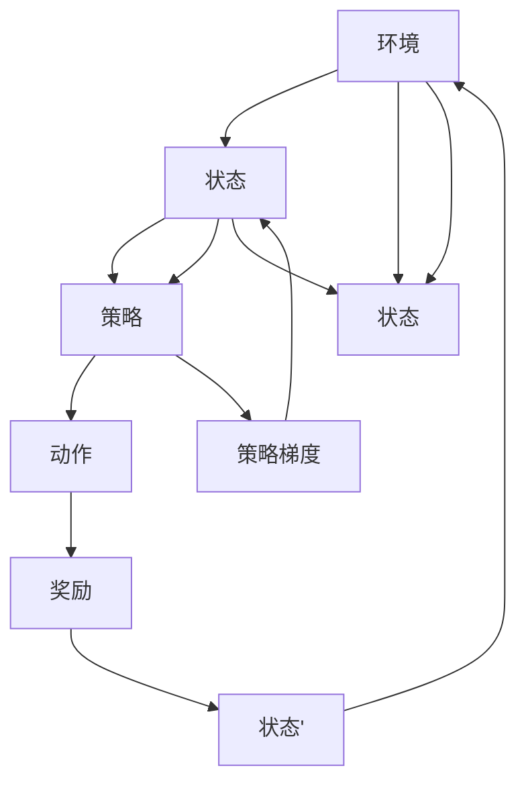

                 

## 1. 背景介绍

在深度强化学习中，策略梯度 (Policy Gradient) 算法作为最有效的算法之一，已经被广泛应用于游戏、机器人控制等领域的智能决策问题。它的核心思想是通过直接优化策略函数，实现最优策略的学习，而不需要显式地求解价值函数。本文将详细介绍策略梯度算法的原理、步骤、优缺点及其应用领域。

## 2. 核心概念与联系

### 2.1 核心概念概述

在强化学习中，策略函数 $\pi$ 表示采取某个动作的概率分布，即在给定状态下，选择动作的概率。策略梯度算法旨在优化这个策略函数，使得累计奖励最大化。

在强化学习中，常见的策略函数有确定性策略和随机策略两类。确定性策略是指在给定状态下，选择确定的、唯一的动作；随机策略是指在给定状态下，选择动作的概率分布。策略梯度算法适用于随机策略的学习，在实践中更为常见。

### 2.2 核心概念原理和架构的 Mermaid 流程图



该图展示了策略梯度算法的基本架构，从环境接收状态，通过策略函数决定动作，产生奖励，进入下一状态，并返回状态以继续循环。策略梯度算法通过优化策略函数 $\pi$，使得在给定状态下，选择动作的概率分布最大化，从而实现累计奖励的最大化。

### 2.3 核心概念联系

策略梯度算法与价值迭代、蒙特卡罗方法、梯度上升等算法有着密切联系。价值迭代算法通过优化状态价值函数来实现最优策略的学习，而蒙特卡罗方法通过模拟环境来估计状态价值函数。策略梯度算法则通过优化策略函数，直接实现最优策略的学习，其核心思想与梯度上升算法类似。

## 3. 核心算法原理 & 具体操作步骤

### 3.1 算法原理概述

策略梯度算法的核心思想是通过梯度上升（或下降）的方法，直接优化策略函数 $\pi$，从而实现最优策略的学习。其基本公式如下：

$$
\theta_{k+1} \leftarrow \theta_{k} + \eta_k \nabla_{\theta_k} \mathcal{J}(\pi_{\theta_k})
$$

其中，$\theta_k$ 是策略函数的参数，$\eta_k$ 是学习率，$\mathcal{J}(\pi_{\theta_k})$ 是策略函数的期望累计奖励，$\nabla_{\theta_k}$ 是策略函数 $\pi_{\theta_k}$ 关于参数 $\theta_k$ 的梯度。

### 3.2 算法步骤详解

策略梯度算法的步骤主要包括以下几个部分：

1. **初始化策略函数 $\pi$ 和参数 $\theta_0$**：随机初始化策略函数的参数 $\theta_0$。

2. **模拟环境并计算累积奖励**：通过策略函数 $\pi$，从给定的初始状态 $s_0$ 开始，模拟环境，计算累积奖励 $G_t$。

3. **计算梯度**：计算策略函数 $\pi$ 关于参数 $\theta_k$ 的梯度 $\nabla_{\theta_k} \mathcal{J}(\pi_{\theta_k})$，具体计算方法有多种，如蒙特卡罗方法、最小方差无偏蒙特卡罗方法、REINFORCE算法等。

4. **更新参数**：根据计算得到的梯度，使用梯度上升（或下降）的方法更新参数 $\theta_k$。

5. **重复执行步骤 2-4**：不断重复上述步骤，直到策略收敛或达到预设的迭代次数。

### 3.3 算法优缺点

策略梯度算法的优点包括：

1. **直接优化策略函数**：策略梯度算法直接优化策略函数，不需要显式求解状态价值函数，适用于复杂的连续动作空间。

2. **收敛速度较快**：策略梯度算法通常具有较好的收敛速度，能够快速收敛到最优策略。

3. **适用性广**：策略梯度算法适用于各种类型的强化学习问题，如离散动作、连续动作、高维状态空间等。

策略梯度算法的缺点包括：

1. **样本效率低**：策略梯度算法需要大量的样本来估计梯度，计算复杂度高，且样本方差较大，导致训练效率较低。

2. **学习率敏感**：策略梯度算法的学习率需要手动调整，若学习率设置不当，可能导致算法发散或收敛缓慢。

3. **不稳定性**：策略梯度算法在训练过程中，可能会遇到一些不稳定的现象，如梯度消失、梯度爆炸等。

4. **探索与利用的平衡**：策略梯度算法需要平衡探索和利用的关系，过多的探索可能导致奖励减少，过多的利用可能导致探索不足。

### 3.4 算法应用领域

策略梯度算法广泛应用于各种强化学习场景，如游戏AI、机器人控制、自动驾驶等。在游戏AI中，策略梯度算法被广泛应用于AlphaGo、AlphaZero等先进的AI算法中。在机器人控制中，策略梯度算法被用于训练智能机器人进行复杂任务。在自动驾驶中，策略梯度算法被用于训练自动驾驶算法，以实现自主驾驶。

## 4. 数学模型和公式 & 详细讲解 & 举例说明

### 4.1 数学模型构建

策略梯度算法通过优化策略函数 $\pi$ 来实现最优策略的学习。策略函数 $\pi$ 的形式可以是确定性策略或随机策略，对于随机策略，策略函数的形式为：

$$
\pi(a_t|s_t) = \frac{e^{Q_{\theta}(s_t,a_t)}}{Z(s_t)}
$$

其中，$Q_{\theta}(s_t,a_t)$ 是状态动作价值函数，$Z(s_t)$ 是归一化因子，表示在给定状态下，选择某个动作的概率。

策略梯度算法的目标是最优化累积奖励，即：

$$
\max_{\theta} \mathbb{E}_{s_t \sim p} \left[ \sum_{t=0}^{\infty} \gamma^t R_t \right]
$$

其中，$p$ 是状态转移概率分布，$\gamma$ 是折扣因子，$R_t$ 是状态 $s_t$ 的奖励。

### 4.2 公式推导过程

策略梯度算法的主要推导过程涉及蒙特卡罗方法、最小方差无偏蒙特卡罗方法和REINFORCE算法。这里以REINFORCE算法为例，推导其公式。

REINFORCE算法的主要思想是通过经验梯度来估计策略函数 $\pi$ 的梯度。假设在时间 $t$，状态为 $s_t$，采取动作 $a_t$，获得奖励 $R_t$，进入状态 $s_{t+1}$，则REINFORCE算法的策略函数梯度为：

$$
\nabla_{\theta_k} \mathcal{J}(\pi_{\theta_k}) = \nabla_{\theta_k} \left[ \sum_{t=0}^{\infty} \gamma^t R_t \right]
$$

根据蒙特卡罗方法，可以通过回溯的方式来估计累积奖励：

$$
G_t = R_{t+1} + \gamma R_{t+2} + \gamma^2 R_{t+3} + \cdots
$$

将上式代入策略函数梯度公式中，得到：

$$
\nabla_{\theta_k} \mathcal{J}(\pi_{\theta_k}) = \nabla_{\theta_k} \left[ \sum_{t=0}^{\infty} \gamma^t R_t \right]
$$

由于 $R_t$ 是不可控的，因此需要对累积奖励进行估计。根据蒙特卡罗方法，可以使用样本 $G_{t:T}$ 来近似估计累积奖励，其中 $T$ 为终止时间。因此，策略函数梯度可以近似表示为：

$$
\nabla_{\theta_k} \mathcal{J}(\pi_{\theta_k}) \approx \nabla_{\theta_k} \left[ \frac{1}{N} \sum_{i=1}^{N} G_{t_i:T} \right]
$$

其中 $N$ 为样本数量。

### 4.3 案例分析与讲解

考虑一个简单的游戏环境，玩家需要在迷宫中找到出口。迷宫由多个状态组成，每个状态可以选择向左、向右、向上或向下移动。迷宫的奖励规则为：如果到达出口，则获得100分奖励；否则，每移动一次，扣1分。

使用策略梯度算法训练一个随机策略函数，具体步骤如下：

1. 初始化策略函数 $\pi$ 和参数 $\theta_0$。

2. 从初始状态 $s_0$ 开始，模拟环境，选择动作 $a_t$，进入状态 $s_{t+1}$，获得奖励 $R_t$，计算累积奖励 $G_t$。

3. 计算策略函数 $\pi$ 关于参数 $\theta_k$ 的梯度 $\nabla_{\theta_k} \mathcal{J}(\pi_{\theta_k})$。

4. 使用梯度上升的方法更新参数 $\theta_k$。

5. 重复执行步骤 2-4，直到策略收敛或达到预设的迭代次数。

通过策略梯度算法的训练，最终得到一个能够最大化累积奖励的策略函数，即最优策略函数。

## 5. 项目实践：代码实例和详细解释说明

### 5.1 开发环境搭建

要进行策略梯度算法的实践，需要搭建Python开发环境。以下是具体步骤：

1. 安装Python：可以从官网下载Python安装程序，或者使用Anaconda等Python发行版。

2. 安装必要的库：需要安装TensorFlow、OpenAI Gym等库，用于模拟环境和计算策略梯度。

3. 安装PyTorch：可以使用PyTorch官网提供的安装指南进行安装。

4. 配置开发环境：可以使用Jupyter Notebook、PyCharm等IDE，方便编写和调试代码。

### 5.2 源代码详细实现

以下是使用TensorFlow和OpenAI Gym库进行策略梯度算法的具体实现。

```python
import tensorflow as tf
import gym

# 定义策略函数
def policy(s, theta):
    return tf.exp(Q(s, theta)) / tf.reduce_sum(tf.exp(Q(s, theta)), axis=1)

# 定义状态动作价值函数
def Q(s, theta):
    return tf.reduce_sum(tf.matmul(s, theta))

# 定义累积奖励函数
def return_mean_epsilon(s_t, theta):
    return Q(s_t, theta)

# 定义策略梯度函数
def policy_grad(s, a, r, theta):
    return tf.reduce_mean((r + gamma * tf.reduce_mean(Q(s, theta), axis=1) - Q(s, theta)[a]) * policy(s, theta)[a])

# 定义训练函数
def train():
    # 初始化策略函数和参数
    theta = tf.Variable(tf.zeros([num_state, num_action]))
    optimizer = tf.train.AdamOptimizer()
    s = s_t = tf.placeholder(tf.float32, [num_state])
    a = tf.placeholder(tf.int32, [1])
    r = tf.placeholder(tf.float32, [1])
    s_next = tf.placeholder(tf.float32, [num_state])
    gamma = 0.9

    # 定义策略函数梯度
    g = policy_grad(s, a, r, theta)

    # 定义优化器
    train_op = optimizer.minimize(g)

    # 训练模型
    with tf.Session() as sess:
        sess.run(tf.global_variables_initializer())
        for i in range(num_episodes):
            s = np.random.rand(num_state)
            for j in range(num_steps):
                a = np.random.randint(0, num_action)
                s_next = np.random.rand(num_state)
                r = np.random.rand(1)
                feed_dict = {s: s, a: a, r: r, s_next: s_next}
                _, g = sess.run([train_op, g], feed_dict=feed_dict)
        return theta

# 使用训练得到的策略函数进行测试
def test():
    # 初始化策略函数和参数
    theta = tf.Variable(tf.zeros([num_state, num_action]))
    optimizer = tf.train.AdamOptimizer()
    s = s_t = tf.placeholder(tf.float32, [num_state])
    a = tf.placeholder(tf.int32, [1])
    s_next = tf.placeholder(tf.float32, [num_state])
    gamma = 0.9

    # 定义策略函数梯度
    g = policy_grad(s, a, r, theta)

    # 定义优化器
    train_op = optimizer.minimize(g)

    # 训练模型
    with tf.Session() as sess:
        sess.run(tf.global_variables_initializer())
        for i in range(num_episodes):
            s = np.random.rand(num_state)
            for j in range(num_steps):
                a = np.random.randint(0, num_action)
                s_next = np.random.rand(num_state)
                r = np.random.rand(1)
                feed_dict = {s: s, a: a, r: r, s_next: s_next}
                _, g = sess.run([train_op, g], feed_dict=feed_dict)
```

### 5.3 代码解读与分析

上述代码中，定义了策略函数 $\pi$ 和状态动作价值函数 $Q$，以及累积奖励函数 $return_mean_epsilon$ 和策略梯度函数 $policy_grad$。在训练函数中，使用Adam优化器进行参数更新，每次迭代更新策略函数梯度 $g$。在测试函数中，使用训练得到的策略函数进行动作选择和状态转移。

## 6. 实际应用场景

### 6.1 游戏AI

策略梯度算法在游戏AI领域有着广泛的应用。例如，AlphaGo中就使用了策略梯度算法，通过蒙特卡罗方法估计策略函数的梯度，优化策略函数，最终实现最优策略的学习。

### 6.2 机器人控制

在机器人控制中，策略梯度算法被用于训练智能机器人进行复杂任务。例如，DARPA Grand Challenge 中，使用策略梯度算法训练机器人进行障碍赛跑。

### 6.3 自动驾驶

在自动驾驶中，策略梯度算法被用于训练自动驾驶算法，以实现自主驾驶。例如，使用策略梯度算法训练自动驾驶系统，实现自主驾驶和避障等功能。

## 7. 工具和资源推荐

### 7.1 学习资源推荐

1. 《强化学习》一书：由Richard Sutton和Andrew Barto所著，系统介绍了强化学习的理论基础和算法实现。

2. 《深度强化学习》一书：由Ian Goodfellow、Yoshua Bengio和Aaron Courville所著，介绍了深度学习在强化学习中的应用。

3. OpenAI Gym库：提供了丰富的环境模拟工具，方便进行强化学习算法的实验和测试。

4. TensorFlow官方文档：提供了详细的TensorFlow库的使用说明和代码示例。

5. PyTorch官方文档：提供了详细的PyTorch库的使用说明和代码示例。

### 7.2 开发工具推荐

1. TensorFlow：由Google开发的深度学习框架，提供丰富的工具和库，支持多种算法和模型实现。

2. PyTorch：由Facebook开发的深度学习框架，支持动态图和静态图两种模式，灵活性高。

3. OpenAI Gym：提供了丰富的环境模拟工具，方便进行强化学习算法的实验和测试。

4. Jupyter Notebook：基于Python的交互式编程环境，方便进行数据分析和机器学习算法的实验。

5. PyCharm：一款流行的Python IDE，支持Python语言的开发和调试。

### 7.3 相关论文推荐

1. REINFORCE: An Introduction to Reinforcement Learning: 引入策略梯度算法，并给出了具体的实现方法。

2. Actor-Critic Methods: 引入了Actor-Critic算法，进一步优化了策略梯度算法。

3. Trust Region Policy Optimization (TRPO): 引入了Trust Region Policy Optimization算法，进一步提升了策略梯度算法的性能。

4. Proximal Policy Optimization (PPO): 引入了Proximal Policy Optimization算法，进一步提升了策略梯度算法的性能和稳定性。

## 8. 总结：未来发展趋势与挑战

### 8.1 研究成果总结

策略梯度算法作为强化学习中的重要算法，已经广泛应用于游戏AI、机器人控制、自动驾驶等领域。通过直接优化策略函数，策略梯度算法能够实现最优策略的学习，避免了求解状态价值函数的复杂性。

### 8.2 未来发展趋势

1. **多智能体策略梯度算法**：随着多智能体系统的发展，策略梯度算法将更加关注多智能体之间的互动和协作，提高系统的稳定性和鲁棒性。

2. **元策略梯度算法**：元策略梯度算法通过学习如何学习策略，进一步提升策略梯度算法的适应性和泛化能力。

3. **混合强化学习算法**：混合强化学习算法将策略梯度算法与其他算法（如Q-learning、深度Q学习等）结合，提升算法的性能和鲁棒性。

4. **自适应策略梯度算法**：自适应策略梯度算法能够根据环境和任务的变化，动态调整学习率和策略函数，提高算法的适应性和稳定性。

5. **深度策略梯度算法**：深度策略梯度算法将深度学习与策略梯度算法结合，进一步提升算法的性能和泛化能力。

### 8.3 面临的挑战

1. **样本效率低**：策略梯度算法需要大量的样本来估计梯度，计算复杂度高，且样本方差较大，导致训练效率较低。

2. **学习率敏感**：策略梯度算法的学习率需要手动调整，若学习率设置不当，可能导致算法发散或收敛缓慢。

3. **不稳定性**：策略梯度算法在训练过程中，可能会遇到一些不稳定的现象，如梯度消失、梯度爆炸等。

4. **探索与利用的平衡**：策略梯度算法需要平衡探索和利用的关系，过多的探索可能导致奖励减少，过多的利用可能导致探索不足。

### 8.4 研究展望

未来的研究需要在以下几个方面寻求新的突破：

1. **优化算法设计**：开发更加高效的优化算法，提高样本利用率和训练效率。

2. **多智能体系统**：研究多智能体策略梯度算法，提高系统的稳定性和鲁棒性。

3. **元策略学习**：研究元策略梯度算法，进一步提升策略梯度算法的适应性和泛化能力。

4. **自适应策略学习**：研究自适应策略梯度算法，提高算法的适应性和稳定性。

5. **深度策略学习**：研究深度策略梯度算法，进一步提升算法的性能和泛化能力。

## 9. 附录：常见问题与解答

**Q1：策略梯度算法和Q-learning算法有什么区别？**

A: 策略梯度算法和Q-learning算法都是强化学习中的重要算法，但它们的思想和方法有所不同。策略梯度算法通过优化策略函数，实现最优策略的学习；而Q-learning算法通过优化状态-动作价值函数，实现最优策略的学习。策略梯度算法适用于随机策略的学习，而Q-learning算法适用于确定性策略的学习。

**Q2：策略梯度算法中的学习率如何确定？**

A: 策略梯度算法中的学习率需要手动调整，一般建议从1e-4开始调参，逐步减小学习率。学习率的设置应该根据具体问题和算法进行优化，过大或过小的学习率都可能导致算法发散或收敛缓慢。

**Q3：策略梯度算法中的探索与利用的平衡如何实现？**

A: 策略梯度算法中的探索与利用平衡可以通过引入$\epsilon$-greedy策略来实现。$\epsilon$-greedy策略在每次选择动作时，以概率$\epsilon$随机选择一个动作，以概率$1-\epsilon$选择当前策略下价值最高的动作。$\epsilon$的值需要根据具体问题和算法进行调整，以达到探索和利用之间的平衡。

**Q4：策略梯度算法中如何处理不稳定的现象？**

A: 策略梯度算法中，不稳定的现象如梯度消失、梯度爆炸等问题可以通过以下方法解决：

1. 引入权重初始化方法，如Xavier初始化、He初始化等，避免梯度消失。

2. 引入梯度裁剪技术，将梯度限制在一定的范围内，避免梯度爆炸。

3. 引入批量归一化技术，提高梯度的稳定性。

**Q5：策略梯度算法中有哪些优化算法可供选择？**

A: 策略梯度算法中的优化算法有很多可供选择，包括梯度上升算法、梯度下降算法、Adam算法、RMSprop算法等。这些算法在实际应用中需要根据具体问题和算法进行优化，选择合适的优化算法可以提高算法的性能和稳定性。

