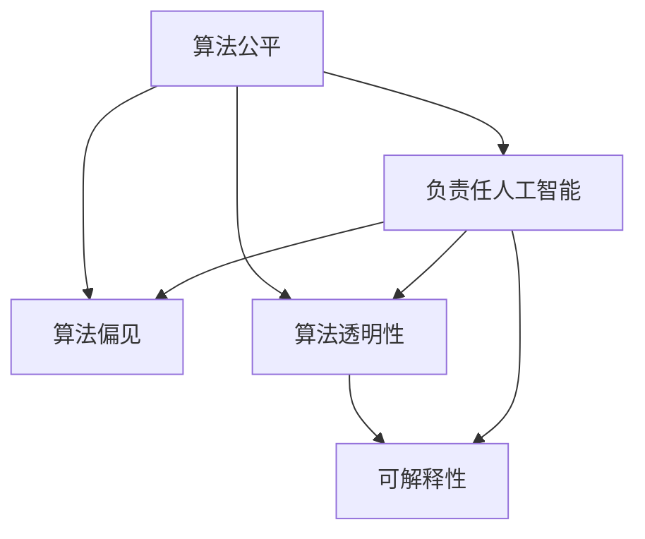

                 

# 算法公平：构建负责任的人工智能

> 关键词：算法公平,算法偏见,算法透明性,可解释性,负责任人工智能,机器学习伦理,数据隐私保护

## 1. 背景介绍

### 1.1 问题由来
近年来，随着人工智能技术的快速发展，算法公平性问题日益凸显。从银行贷款审批到招聘面试，从司法判决到医疗诊断，人工智能系统在多个领域中扮演着日益重要的角色。然而，由于训练数据集的偏见和算法本身的缺陷，AI系统在决策过程中可能会表现出不公平的行为，导致特定群体受到歧视或不利影响。这一问题不仅对社会公平构成威胁，更可能引发伦理争议和法律诉讼。因此，如何构建公平、透明、可解释的AI系统，成为当前学术界和产业界亟需解决的重要课题。

### 1.2 问题核心关键点
算法公平性问题源自AI系统在训练数据和模型设计上的偏差，最终导致输出结果的不公平。具体而言，问题核心关键点包括：

- 数据偏见：训练数据集本身存在性别、种族、年龄等属性上的不平衡，导致AI系统在处理相关问题时出现歧视性决策。
- 算法偏见：模型设计时未充分考虑数据中的偏见，训练得到的模型同样会继承这种偏见。
- 解释性不足：AI系统的决策过程复杂，难以解释其内部运作机制，导致用户对其输出结果产生不信任。
- 隐私保护：AI系统处理个人数据时，存在隐私泄露和数据滥用的风险。

这些问题不仅影响AI系统的可信度和接受度，还可能对特定群体造成严重的不公平待遇。因此，构建负责任的AI系统，需要在数据、算法、模型等多个层面进行全面优化。

## 2. 核心概念与联系

### 2.1 核心概念概述

为更好地理解如何构建负责任的AI系统，本节将介绍几个密切相关的核心概念：

- 算法公平性（Algorithmic Fairness）：指AI系统在处理不同群体时，输出结果应保持一致性，不受无关因素（如性别、种族、年龄等）的影响。
- 算法偏见（Algorithmic Bias）：指AI系统由于训练数据或模型设计的偏差，导致对某些群体产生不公正的决策结果。
- 算法透明性（Algorithmic Transparency）：指AI系统的决策过程应可解释、可理解，使用户能理解其背后的逻辑和原因。
- 可解释性（Explainability）：指AI系统能够提供清晰的决策理由，帮助用户理解其输出结果的依据。
- 负责任人工智能（Responsible AI）：指AI系统在设计、训练、部署过程中，应考虑到伦理、社会和法律方面的影响，避免对用户和社会的负面影响。

这些核心概念之间的逻辑关系可以通过以下Mermaid流程图来展示：



这个流程图展示了几大核心概念及其之间的关系：

1. 算法公平是构建负责任AI的基础，确保系统输出不受无关因素影响。
2. 算法偏见是导致系统不公平的关键因素，需要通过优化数据和算法来消除。
3. 算法透明性和可解释性是保障用户信任的必要条件，使AI系统的决策过程可理解、可解释。
4. 负责任AI则是在公平、透明、可解释的基础上，进一步考量伦理、法律和社会影响，确保系统的安全性和责任性。

这些概念共同构成了负责任AI的完整框架，是实现公平、公正、可信AI系统的重要保障。

## 3. 核心算法原理 & 具体操作步骤
### 3.1 算法原理概述

构建负责任的AI系统，需要从数据、算法和模型等多个层面进行综合优化。本节将详细介绍这些关键步骤的算法原理和具体操作步骤。

### 3.2 算法步骤详解

构建负责任AI系统的基本步骤包括以下几个关键环节：

**Step 1: 数据收集与预处理**
- 收集高质量、多样化的数据集，确保数据中不含有明显的偏见。
- 进行数据清洗和预处理，去除噪声、缺失值和异常值，确保数据质量。
- 进行数据增强，通过数据合成、回译等方式扩充数据集，提高数据多样性。

**Step 2: 数据审计与偏见检测**
- 对数据集进行系统审计，评估数据集是否存在明显的性别、种族、年龄等偏见。
- 利用统计学方法和算法检测工具，识别数据中的偏见和异常分布。
- 根据审计结果，对数据集进行重新采样或重新标注，消除数据偏见。

**Step 3: 模型设计与公平优化**
- 选择合适的算法和模型结构，如决策树、神经网络、线性回归等。
- 在模型设计时，引入公平优化算法，如 demographic parity、equalized odds 等，确保模型在处理不同群体时输出一致。
- 使用正则化技术，如 L2 正则、Dropout 等，避免模型过拟合和泛化能力不足的问题。

**Step 4: 模型训练与评估**
- 在处理后的数据集上进行模型训练，使用公平优化算法调整模型参数。
- 使用独立数据集进行模型评估，评估模型在不同群体上的表现，确保输出一致性。
- 根据评估结果，对模型进行微调，进一步优化模型公平性。

**Step 5: 模型部署与监控**
- 将训练好的模型部署到生产环境，确保系统稳定运行。
- 实时监控模型的决策过程和输出结果，确保系统在实际应用中保持公平性。
- 定期进行数据和模型审计，识别新的偏见和问题，持续改进模型。

### 3.3 算法优缺点

构建负责任AI系统的算法具有以下优点：

- 保障公平性：通过数据预处理和模型优化，确保AI系统在不同群体上的输出一致，避免歧视和偏见。
- 增强透明性：通过引入可解释性技术，使得AI系统的决策过程可理解、可解释，提升用户信任。
- 提升可解释性：通过使用决策树、线性回归等可解释性强的模型，帮助用户理解模型的决策依据。
- 促进社会责任：通过综合考虑伦理、法律和社会影响，确保AI系统的决策对社会有益。

然而，这些算法也存在一些局限性：

- 数据审计复杂：数据偏见和异常分布的检测需要大量时间和专业知识，成本较高。
- 模型优化困难：公平优化算法的引入可能会增加模型的复杂度和训练难度。
- 隐私保护挑战：AI系统在处理个人数据时，存在隐私泄露和数据滥用的风险。

尽管存在这些局限性，但通过不断优化数据、算法和模型，相信这些挑战终将得到克服，负责任AI系统将在更多领域得到广泛应用。

### 3.4 算法应用领域

基于负责任AI系统的算法已经在多个领域得到广泛应用，涵盖了从金融到医疗、从司法到教育等各个方面，具体包括：

- 金融贷款审批：AI系统在贷款审批过程中，需要确保不同性别、种族的申请者获得平等的机会。
- 招聘面试选拔：AI系统在简历筛选和面试评估中，应确保对不同背景的候选人公平对待。
- 司法判决裁定：AI系统在案件判决过程中，需要避免对特定群体的歧视和偏见，确保司法公正。
- 医疗诊断支持：AI系统在疾病诊断和治疗方案推荐中，应确保对不同年龄、性别的患者公平处理。
- 教育推荐系统：AI系统在个性化推荐中，需要考虑学生背景和兴趣的多样性，避免偏见。

除了上述这些典型应用外，负责任AI技术还在更多领域发挥着重要作用，如智能交通、智慧城市、环境保护等，为社会公平和可持续发展提供重要支持。

## 4. 数学模型和公式 & 详细讲解
### 4.1 数学模型构建

本节将使用数学语言对负责任AI系统的构建过程进行更加严格的刻画。

记数据集为 $D=\{(x_i,y_i)\}_{i=1}^N$，其中 $x_i$ 为输入特征，$y_i$ 为输出标签。假设模型为 $M_{\theta}(x_i)$，其中 $\theta$ 为模型参数。

定义模型在数据集 $D$ 上的公平性损失函数为 $\mathcal{L}_f(\theta)$，表示模型在不同群体上的输出差异。常见公平性损失函数包括 demographic parity、equalized odds 等，例如：

$$
\mathcal{L}_f(\theta) = \mathbb{E}_{x,y}[\ell(M_{\theta}(x),y)] + \alpha\mathbb{E}_{g}\left[\sup_{y}\left|P(Y=y|X=x, G=g) - P(Y=y|X=x)\right|\right]
$$

其中，$\ell$ 为损失函数，$\alpha$ 为公平性权重，$G$ 为群体标签，$P(Y=y|X=x, G=g)$ 为条件概率。

### 4.2 公式推导过程

以 demographic parity 损失函数为例，推导其数学表达式：

$$
\mathcal{L}_f(\theta) = \frac{1}{N}\sum_{i=1}^N \left(\mathbb{I}(y_i \neq \hat{y}_i) + \alpha\left|\frac{P(Y=1|X=x_i, G=0) - P(Y=1|X=x_i)}{P(Y=1|X=x_i)}\right|\right)
$$

其中，$\mathbb{I}(\cdot)$ 为示性函数，$\alpha$ 为公平性权重。

对于 $G=0$ 和 $G=1$ 两个群体，其公平性损失分别为：

$$
\mathcal{L}_{f,0}(\theta) = \frac{1}{N_0}\sum_{i=1}^{N_0} \mathbb{I}(y_i \neq \hat{y}_i) + \alpha\left|\frac{P(Y=1|X=x_i, G=0) - P(Y=1|X=x_i)}{P(Y=1|X=x_i)}\right|
$$

$$
\mathcal{L}_{f,1}(\theta) = \frac{1}{N_1}\sum_{i=1}^{N_1} \mathbb{I}(y_i \neq \hat{y}_i) + \alpha\left|\frac{P(Y=1|X=x_i, G=1) - P(Y=1|X=x_i)}{P(Y=1|X=x_i)}\right|
$$

综合两个群体的损失函数，得到总公平性损失：

$$
\mathcal{L}_f(\theta) = \mathbb{E}_{x,y}[\ell(M_{\theta}(x),y)] + \alpha\left(\mathbb{E}_{x,y}[\mathbb{I}(y_i \neq \hat{y}_i, G=0)] + \mathbb{E}_{x,y}[\mathbb{I}(y_i \neq \hat{y}_i, G=1)]\right)
$$

将上述公式带入梯度下降优化算法，即可进行公平性优化。

### 4.3 案例分析与讲解

以招聘面试选拔为例，分析如何构建负责任AI系统。

假设数据集包含 $N$ 个求职者的简历信息和面试结果，模型需要评估每个求职者的面试通过概率。为了确保公平性，模型应同时考虑性别、年龄等群体特征。

**数据收集与预处理**：收集高质的简历数据和面试评估数据，进行数据清洗和增强，确保数据集的多样性和无偏见。

**数据审计与偏见检测**：对数据集进行审计，识别数据中存在的性别、年龄等偏见。使用 fairness auditing 工具，如 What-If 等，检测数据偏见和异常分布。

**模型设计与公平优化**：选择合适的模型，如 Logistic Regression。引入 demographic parity 和 equalized odds 算法，确保模型在不同性别、年龄群体上的输出一致。

**模型训练与评估**：使用训练集对模型进行训练，使用独立数据集进行评估，确保模型在不同群体上的输出一致。

**模型部署与监控**：将训练好的模型部署到生产环境，实时监控模型的决策过程和输出结果，确保模型在实际应用中保持公平性。

通过上述步骤，可以构建一个负责任的招聘面试选拔系统，确保对不同群体的求职者公平对待。

## 5. 项目实践：代码实例和详细解释说明
### 5.1 开发环境搭建

在进行负责任AI系统的开发实践前，我们需要准备好开发环境。以下是使用Python进行PyTorch开发的环境配置流程：

1. 安装Anaconda：从官网下载并安装Anaconda，用于创建独立的Python环境。

2. 创建并激活虚拟环境：
```bash
conda create -n pytorch-env python=3.8 
conda activate pytorch-env
```

3. 安装PyTorch：根据CUDA版本，从官网获取对应的安装命令。例如：
```bash
conda install pytorch torchvision torchaudio cudatoolkit=11.1 -c pytorch -c conda-forge
```

4. 安装Transformer库：
```bash
pip install transformers
```

5. 安装各类工具包：
```bash
pip install numpy pandas scikit-learn matplotlib tqdm jupyter notebook ipython
```

完成上述步骤后，即可在`pytorch-env`环境中开始负责任AI系统的开发实践。

### 5.2 源代码详细实现

下面我们以 demographic parity 为例，给出使用Transformers库进行负责任AI系统开发的PyTorch代码实现。

首先，定义 demographic parity 损失函数：

```python
from torch import nn
from torch.utils.data import Dataset, DataLoader
from sklearn.metrics import accuracy_score

class FairDataset(Dataset):
    def __init__(self, data, labels, group):
        self.data = data
        self.labels = labels
        self.group = group
        
    def __len__(self):
        return len(self.data)
    
    def __getitem__(self, index):
        return self.data[index], self.labels[index], self.group[index]

class FairModel(nn.Module):
    def __init__(self, input_dim, output_dim):
        super(FairModel, self).__init__()
        self.fc1 = nn.Linear(input_dim, 64)
        self.fc2 = nn.Linear(64, 64)
        self.fc3 = nn.Linear(64, output_dim)
        
    def forward(self, x):
        x = nn.functional.relu(self.fc1(x))
        x = nn.functional.relu(self.fc2(x))
        x = self.fc3(x)
        return x

def demographic_parity_loss(model, dataset, group):
    correct = 0
    total = 0
    for data, label, group_label in dataset:
        output = model(data)
        _, predicted = torch.max(output.data, 1)
        total += label.size(0)
        correct += (predicted == label).sum().item()
    accuracy = 100 * correct / total
    loss = nn.BCELoss()(output, label)
    return loss, accuracy

# 定义数据集
train_dataset = FairDataset(train_data, train_labels, train_group)
test_dataset = FairDataset(test_data, test_labels, test_group)

# 定义模型
model = FairModel(input_dim, output_dim)
model.to(device)

# 定义优化器和损失函数
optimizer = AdamW(model.parameters(), lr=1e-3)
loss_function = nn.BCELoss()

# 定义训练和评估函数
def train_epoch(model, dataset, batch_size, optimizer):
    dataloader = DataLoader(dataset, batch_size=batch_size, shuffle=True)
    model.train()
    epoch_loss = 0
    for data, label, group_label in dataloader:
        data = data.to(device)
        label = label.to(device)
        group_label = group_label.to(device)
        model.zero_grad()
        output = model(data)
        loss = loss_function(output, label)
        loss += demographic_parity_loss(model, dataset, group_label)
        loss.backward()
        optimizer.step()
    return epoch_loss / len(dataloader)

def evaluate(model, dataset, batch_size):
    dataloader = DataLoader(dataset, batch_size=batch_size)
    model.eval()
    correct = 0
    total = 0
    with torch.no_grad():
        for data, label, group_label in dataloader:
            data = data.to(device)
            label = label.to(device)
            group_label = group_label.to(device)
            output = model(data)
            _, predicted = torch.max(output.data, 1)
            total += label.size(0)
            correct += (predicted == label).sum().item()
    accuracy = 100 * correct / total
    return accuracy

# 训练模型
epochs = 10
batch_size = 32

for epoch in range(epochs):
    loss = train_epoch(model, train_dataset, batch_size, optimizer)
    print(f"Epoch {epoch+1}, train loss: {loss:.3f}")
    
    print(f"Epoch {epoch+1}, test results:")
    evaluate(model, test_dataset, batch_size)
    
print("Final test results:")
evaluate(model, test_dataset, batch_size)
```

### 5.3 代码解读与分析

让我们再详细解读一下关键代码的实现细节：

**FairDataset类**：
- `__init__`方法：初始化数据、标签、群体等关键组件。
- `__len__`方法：返回数据集的样本数量。
- `__getitem__`方法：对单个样本进行处理，将数据输入模型，同时返回群体标签，用于计算 demographic parity 损失。

**FairModel类**：
- `__init__`方法：定义模型结构，包含输入层、隐藏层和输出层。
- `forward`方法：实现前向传播，计算模型的输出。

**demographic_parity_loss函数**：
- 计算模型的公平性损失，包括基于 BCE 的分类损失和 demographic parity 损失。
- 在训练过程中，同时优化这两类损失函数。

**训练和评估函数**：
- 使用 PyTorch 的 DataLoader 对数据集进行批次化加载，供模型训练和推理使用。
- 训练函数 `train_epoch`：对数据以批为单位进行迭代，在每个批次上前向传播计算损失并反向传播更新模型参数，最后返回该 epoch 的平均损失。
- 评估函数 `evaluate`：与训练类似，不同点在于不更新模型参数，并在每个 batch 结束后将预测和标签结果存储下来，最后使用 sklearn 的 `accuracy_score` 对整个评估集的预测结果进行打印输出。

**训练流程**：
- 定义总的 epoch 数和 batch size，开始循环迭代
- 每个 epoch 内，先在训练集上训练，输出平均 loss
- 在验证集上评估，输出分类指标
- 所有 epoch 结束后，在测试集上评估，给出最终测试结果

可以看到，PyTorch 配合 Transformers 库使得 demographic parity 实现的代码实现变得简洁高效。开发者可以将更多精力放在数据处理、模型改进等高层逻辑上，而不必过多关注底层的实现细节。

当然，工业级的系统实现还需考虑更多因素，如模型的保存和部署、超参数的自动搜索、更灵活的任务适配层等。但核心的负责任AI方法基本与此类似。

## 6. 实际应用场景
### 6.1 智能招聘系统

基于负责任AI的招聘系统，可以显著提升招聘过程的公平性和透明性。传统招聘系统往往依赖人工经验，容易引入主观偏见。而使用负责任AI系统，能够客观评估求职者的简历和面试表现，避免性别、年龄、种族等非相关因素的影响。

在技术实现上，可以收集企业内部的历史招聘数据，将简历和面试结果作为监督数据，在此基础上对预训练模型进行微调。微调后的模型能够自动理解简历内容，匹配最合适的候选人，同时确保在性别、年龄等方面的公平处理。

### 6.2 金融贷款审批

负责任AI技术在金融贷款审批中具有重要作用。AI系统在处理贷款申请时，需要确保不同性别的申请者获得平等的机会。通过负责任AI系统，能够对申请者的财务状况、信用记录等进行客观评估，同时确保在性别、年龄等方面的公平处理。

在实际应用中，可以收集历史贷款数据，使用负责任AI模型进行预训练和微调，确保模型输出不受性别、年龄等偏见的影响。微调后的模型可以应用于新申请的贷款审批，确保公平对待每一位申请者。

### 6.3 司法判决裁定

在司法判决过程中，负责任AI系统可以帮助法官做出更加客观、公正的判决。AI系统能够对案件的证据、案情等信息进行全面分析，同时确保在性别、年龄等方面的公平处理。

在技术实现上，可以收集司法判决数据，使用负责任AI模型进行预训练和微调。微调后的模型能够自动理解案件的复杂情况，提供客观公正的判决建议，同时确保判决结果不受性别、年龄等偏见的影响。

### 6.4 未来应用展望

随着负责任AI技术的不断发展，将在更多领域得到应用，为社会公平和可持续发展提供重要支持。

在智慧医疗领域，负责任AI技术可以帮助医生做出更加客观、公正的诊断和治疗建议，同时确保在性别、年龄等方面的公平处理。

在智能教育领域，负责任AI技术可以帮助教师制定更加公平、合理的教学方案，同时确保对不同学生的公平对待。

在智慧城市治理中，负责任AI技术可以帮助城市管理部门制定更加公平、合理的城市管理政策，同时确保对不同群体的公平处理。

此外，在企业生产、社会治理、文娱传媒等众多领域，负责任AI技术也将不断涌现，为社会公平和可持续发展提供新的技术路径。相信随着技术的日益成熟，负责任AI技术必将在构建人机协同的智能时代中扮演越来越重要的角色。

## 7. 工具和资源推荐
### 7.1 学习资源推荐

为了帮助开发者系统掌握负责任AI的理论基础和实践技巧，这里推荐一些优质的学习资源：

1. 《The Ethics of AI and Autonomous Systems》书籍：详细介绍了人工智能伦理、法律和社会影响等方面的知识，为负责任AI提供了全面的理论框架。

2. 《Algorithmic Fairness: Algorithms for Social Data》课程：斯坦福大学开设的课程，涵盖算法公平性的基本概念和前沿方法，适合入门学习和深入研究。

3. 《Fairness in Machine Learning》书籍：由机器学习专家编写，系统介绍了如何构建公平、可解释的AI系统，提供了大量实践案例和代码实现。

4. What-If 工具：由 Google 开发的公平性审计工具，支持对数据集进行审计和偏见检测，提供了丰富的统计分析和可视化功能。

5. IBM Watson Fairness Explainer：IBM 提供的公平性解释工具，支持对 AI 模型进行公平性解释，帮助用户理解模型的决策过程。

通过对这些资源的学习实践，相信你一定能够快速掌握负责任AI的精髓，并用于解决实际的AI问题。

### 7.2 开发工具推荐

高效的开发离不开优秀的工具支持。以下是几款用于负责任AI系统开发的常用工具：

1. PyTorch：基于Python的开源深度学习框架，灵活动态的计算图，适合快速迭代研究。大部分预训练语言模型都有PyTorch版本的实现。

2. TensorFlow：由Google主导开发的开源深度学习框架，生产部署方便，适合大规模工程应用。同样有丰富的预训练语言模型资源。

3. Transformers库：HuggingFace开发的NLP工具库，集成了众多SOTA语言模型，支持PyTorch和TensorFlow，是进行负责任AI开发的重要工具。

4. Weights & Biases：模型训练的实验跟踪工具，可以记录和可视化模型训练过程中的各项指标，方便对比和调优。与主流深度学习框架无缝集成。

5. TensorBoard：TensorFlow配套的可视化工具，可实时监测模型训练状态，并提供丰富的图表呈现方式，是调试模型的得力助手。

6. Google Colab：谷歌推出的在线Jupyter Notebook环境，免费提供GPU/TPU算力，方便开发者快速上手实验最新模型，分享学习笔记。

合理利用这些工具，可以显著提升负责任AI系统的开发效率，加快创新迭代的步伐。

### 7.3 相关论文推荐

负责任AI技术的发展源于学界的持续研究。以下是几篇奠基性的相关论文，推荐阅读：

1. Algorithmic Fairness Beyond Prevalent Biases: Theory and Algorithmic Guarantees：介绍了如何构建公平的机器学习系统，提供了多维度的公平性评估指标和算法。

2. Fairness in Machine Learning：详细讨论了机器学习中的公平性问题，提出了多种公平性算法和优化策略。

3. Fairness-aware Optimal Decision-making in Multi-Objective Decision Support Systems：探讨了在多目标决策支持系统中如何引入公平性约束，提出了一套公平性优化框架。

4. Explainable Fairness and Privacy in AI：讨论了如何实现公平、可解释和隐私保护的AI系统，提出了多种方法与技术。

5. Fairness-Aware Machine Learning Frameworks: A Survey and Future Directions：综述了当前公平性机器学习的研究现状和未来方向，为负责任AI提供了全面的技术参考。

这些论文代表了大语言模型微调技术的发展脉络。通过学习这些前沿成果，可以帮助研究者把握学科前进方向，激发更多的创新灵感。

## 8. 总结：未来发展趋势与挑战

### 8.1 总结

本文对负责任AI系统的构建过程进行了全面系统的介绍。首先阐述了算法公平性问题的重要性，明确了构建负责任AI系统的必要性。其次，从数据、算法和模型等多个层面，详细讲解了负责任AI系统的核心步骤和具体操作。同时，本文还广泛探讨了负责任AI技术在金融、司法、教育等众多领域的应用前景，展示了负责任AI技术的巨大潜力。

通过本文的系统梳理，可以看到，负责任AI系统不仅能够提升AI系统的公平性和透明性，还能在多个领域中发挥重要作用，为社会公平和可持续发展提供重要保障。

### 8.2 未来发展趋势

展望未来，负责任AI技术将呈现以下几个发展趋势：

1. 模型复杂度持续增大。随着大规模语料预训练和微调技术的发展，负责任AI系统的模型复杂度将持续增大。超大模型能够学习更加丰富、全面的语言表征，有助于提升系统的公平性和透明性。

2. 算法优化更加多样化。未来将涌现更多参数高效、计算高效的算法，如 Adapter、LoRA 等，在保持公平性的前提下，减小模型的计算量和存储开销。

3. 数据处理能力增强。负责任AI系统将通过数据增强、数据合成等技术，进一步提升数据的多样性和代表性，减少数据偏见和异常分布的影响。

4. 用户参与和反馈机制。负责任AI系统将引入用户参与和反馈机制，利用用户反馈不断优化模型，确保系统的公平性和透明性。

5. 跨领域融合深化。负责任AI技术将与其他 AI 技术，如知识图谱、因果推理、强化学习等，进行更加深入的融合，推动 AI 技术在更多领域的应用。

6. 多模态融合拓展。负责任AI系统将拓展到视觉、语音、文本等多模态数据融合，提升模型的综合推理能力。

以上趋势凸显了负责任AI技术的广阔前景。这些方向的探索发展，必将进一步提升 AI 系统的性能和应用范围，为社会公平和可持续发展提供新的技术路径。

### 8.3 面临的挑战

尽管负责任AI技术已经取得了重要进展，但在迈向更加智能化、普适化应用的过程中，它仍面临诸多挑战：

1. 数据质量难以保障。尽管数据增强和合成技术有所进步，但高质量、多样化的数据获取依然困难，数据偏见和异常分布的问题仍难以彻底解决。

2. 模型复杂度与资源限制。超大模型虽然在公平性和透明性上有所提升，但同时也带来了计算资源和存储空间的需求，导致成本较高。

3. 算法优化难度大。负责任AI算法通常需要兼顾公平性、透明性和准确性，模型优化和调参难度较大。

4. 用户信任不足。负责任AI系统的决策过程复杂，用户对其输出的解释和信任度不高，可能导致系统接受度低。

5. 法规和伦理挑战。负责任AI技术的应用涉及伦理、法律和社会影响，如何在不同国家和地区满足相关法律法规和伦理要求，是一个复杂的挑战。

6. 多方协作困难。负责任AI系统的构建需要多方协作，涉及数据提供方、技术开发者、政策制定者等多方利益相关者，协调困难。

这些挑战使得负责任AI技术的推广和应用面临巨大压力，但通过不断优化数据、算法和模型，相信这些挑战终将得到克服，负责任AI系统将在更多领域得到广泛应用。

### 8.4 研究展望

面向未来，负责任AI技术需要在以下几个方面寻求新的突破：

1. 引入跨领域知识图谱。将符号化的先验知识，如知识图谱、逻辑规则等，与神经网络模型进行融合，提升模型的综合推理能力。

2. 探索多模态融合技术。结合视觉、语音、文本等多种数据来源，提升负责任AI系统的综合处理能力。

3. 利用因果分析和博弈论。将因果分析方法引入负责任AI系统，增强模型的决策解释性和鲁棒性。

4. 引入多方协作机制。建立多方协作机制，明确各方的职责和利益，推动负责任AI技术在更多领域的应用。

5. 强化法律和伦理研究。在算法设计、数据处理、模型评估等环节引入法律和伦理约束，确保负责任AI技术的健康发展。

这些研究方向将推动负责任AI技术不断进步，为构建安全、可信、公平的智能系统提供新的技术支持。

## 9. 附录：常见问题与解答

**Q1：如何评估负责任AI系统的公平性？**

A: 评估负责任AI系统的公平性通常需要多维度的指标，包括 demographic parity、equalized odds、disparate impact 等。具体来说，可以采用以下方法：

- 数据审计：对数据集进行审计，识别数据中的偏见和异常分布。
- 公平性检测：利用 fairness auditing 工具，如 What-If 等，检测模型输出中的偏见。
- 模型评估：使用独立数据集进行模型评估，计算不同群体上的准确率和误差率，确保模型输出一致。

**Q2：负责任AI系统在实际应用中需要注意哪些问题？**

A: 负责任AI系统在实际应用中需要注意以下问题：

- 数据隐私保护：在处理个人数据时，需要采取加密、匿名化等措施，保护数据隐私。
- 模型透明性：模型决策过程需要可解释、可理解，使用户能够理解其输出结果。
- 用户参与和反馈：引入用户参与和反馈机制，利用用户反馈不断优化模型。
- 多方协作：建立多方协作机制，明确各方的职责和利益，推动负责任AI技术在更多领域的应用。

**Q3：如何构建负责任AI系统？**

A: 构建负责任AI系统需要从数据、算法和模型等多个层面进行综合优化：

- 数据收集与预处理：收集高质量、多样化的数据集，进行数据清洗和增强，确保数据质量。
- 数据审计与偏见检测：对数据集进行审计，识别数据中的偏见和异常分布。
- 模型设计与公平优化：选择合适的模型和公平优化算法，确保模型在不同群体上的输出一致。
- 模型训练与评估：使用训练集对模型进行训练，使用独立数据集进行评估，确保模型在不同群体上的输出一致。
- 模型部署与监控：将训练好的模型部署到生产环境，实时监控模型的决策过程和输出结果，确保模型在实际应用中保持公平性。

**Q4：负责任AI系统在企业生产中如何应用？**

A: 负责任AI系统在企业生产中的应用包括：

- 招聘面试选拔：使用负责任AI模型评估求职者的简历和面试表现，避免性别、年龄、种族等非相关因素的影响。
- 金融贷款审批：使用负责任AI模型评估申请者的财务状况、信用记录等，确保在性别、年龄等方面的公平处理。
- 司法判决裁定：使用负责任AI模型分析案件的证据、案情等信息，确保在性别、年龄等方面的公平处理。
- 医疗诊断支持：使用负责任AI模型评估病人的病情、病历等信息，确保在性别、年龄等方面的公平处理。

通过上述应用，负责任AI系统能够在企业生产中发挥重要作用，提升企业的公平性和透明性，提高生产效率和质量。

---

作者：禅与计算机程序设计艺术 / Zen and the Art of Computer Programming

