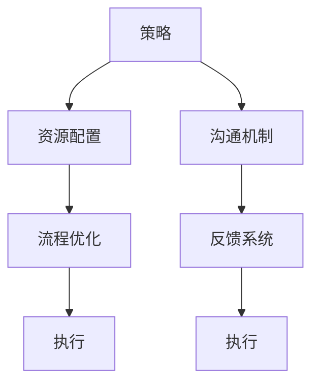

                 

# 管理的智慧：从策略到执行

## 1. 背景介绍

### 1.1 问题由来

在当今快速变化、竞争激烈的市场环境中，企业如何高效、敏捷地实现策略到执行的转化，成为决定企业成败的关键。无论是初创企业还是大型组织，都需要不断提升管理水平，确保策略得以准确执行。然而，从策略到执行的桥梁并非易跨，常见问题包括：

- **策略理解偏差**：由于信息不对称，执行团队可能未能准确理解高层策略的意图和目标。
- **资源配置失衡**：资源分配不均、优先级不明，导致关键任务无法高效执行。
- **流程复杂冗余**：过长的决策链条和繁琐的审批流程，降低了执行效率。
- **沟通不畅**：跨部门、跨层级的沟通障碍，使得信息传递不畅，策略难以落地。
- **反馈机制缺失**：执行过程中缺乏有效的反馈机制，难以及时调整策略与执行路径。

为解决这些问题，需要引入一套系统化的管理框架，明确从策略到执行的每一步操作，确保每项策略能够高效转化为具体行动。

### 1.2 问题核心关键点

该框架的核心在于实现“策略到执行”的闭环管理。关键点包括：

- **策略明确化**：确保所有团队成员对策略有统一的理解和认识。
- **资源优化配置**：根据优先级合理分配资源，确保核心任务优先得到支持。
- **流程简化优化**：精简决策流程，提升执行效率。
- **高效沟通机制**：建立快速、透明、高效的沟通渠道。
- **实时反馈循环**：建立及时反馈机制，确保策略执行过程中可以动态调整。

实现上述目标，需从企业战略规划、项目管理、团队协作、过程监控等多个维度综合考虑，系统性地构建一套高效的执行体系。

## 2. 核心概念与联系

### 2.1 核心概念概述

本节将介绍几个关键的管理概念：

- **策略（Strategy）**：企业的高层决策，指明发展的方向和目标。
- **执行（Execution）**：为实现策略而采取的具体行动和步骤。
- **资源配置（Resource Allocation）**：根据策略需求，合理分配企业的人力、物力、财力等资源。
- **流程优化（Process Optimization）**：通过精简、整合、自动化流程，提升执行效率。
- **沟通机制（Communication Mechanism）**：建立透明高效的沟通渠道，确保信息传递准确。
- **反馈系统（Feedback System）**：在执行过程中收集数据，定期进行复盘和调整，确保策略与执行相匹配。

这些概念相互联系，共同构成了从策略到执行的管理体系。策略为执行提供方向和目标，资源配置和流程优化保证了执行的资源和效率，沟通机制和反馈系统确保执行过程中的信息准确传递和动态调整。

### 2.2 核心概念原理和架构的 Mermaid 流程图



该流程图展示了从策略到执行的关键步骤和支持体系：

1. **策略**：明确企业的战略方向和目标。
2. **资源配置**：根据策略需求，合理分配资源。
3. **流程优化**：精简流程，提升执行效率。
4. **沟通机制**：建立快速、透明、高效的沟通渠道。
5. **反馈系统**：在执行过程中收集数据，进行复盘和调整。

这些步骤形成了一个闭环，确保每个环节的信息能够及时传递，执行路径能够动态调整，从而高效地将策略转化为具体行动。

## 3. 核心算法原理 & 具体操作步骤

### 3.1 算法原理概述

从策略到执行的管理框架，本质上是一种系统化、结构化的管理算法。该算法的核心思想是通过层层优化，确保每个环节的信息传递和资源配置都能高效、准确地实现策略目标。

具体而言，该算法包括以下几个关键步骤：

1. **策略明确化**：通过会议、文档、宣讲等多种方式，确保所有团队成员对策略有统一的认识和理解。
2. **资源优化配置**：根据任务的优先级和资源需求，合理分配人力、物力、财力等资源，确保核心任务优先得到支持。
3. **流程简化优化**：通过流程重组、自动化工具引入，精简决策流程，提升执行效率。
4. **高效沟通机制**：建立跨部门、跨层级的透明沟通渠道，确保信息传递的准确和及时。
5. **实时反馈循环**：建立定期复盘和调整机制，根据执行结果进行策略优化和资源配置调整。

这些步骤相互依赖，形成一个闭环，确保从策略到执行的每个环节都能高效运转。

### 3.2 算法步骤详解

#### 3.2.1 策略明确化

策略明确化的目的是确保所有团队成员对策略的理解一致。具体步骤包括：

1. **制定策略文档**：高层管理者通过会议、宣讲等方式，制定详细的策略文档，明确企业的战略方向和目标。
2. **全员宣讲**：高层管理者进行全员宣讲，确保每个员工都能理解策略的核心内容。
3. **互动问答**：组织互动问答环节，员工可提出疑问，由管理者进行解答，确保信息传递准确。

#### 3.2.2 资源优化配置

资源优化配置的核心在于合理分配资源，确保核心任务优先得到支持。具体步骤包括：

1. **需求评估**：各部门根据任务的紧急程度和重要程度，评估资源需求。
2. **优先级排序**：根据评估结果，对任务进行优先级排序，确定资源分配的顺序。
3. **资源分配**：根据优先级，合理分配人力、物力、财力等资源，确保核心任务得到优先支持。
4. **动态调整**：根据执行过程中的变化，动态调整资源配置，确保资源的有效利用。

#### 3.2.3 流程简化优化

流程简化优化的目的是提升执行效率，减少决策链条的长度。具体步骤包括：

1. **流程分析**：对现有流程进行分析，找出冗余和瓶颈环节。
2. **流程重组**：通过并行化、模块化等手段，精简流程，减少冗余环节。
3. **自动化工具引入**：引入自动化工具，如决策支持系统、项目管理工具等，提升执行效率。
4. **定期优化**：定期评估流程效果，进行优化，确保流程的高效运行。

#### 3.2.4 高效沟通机制

高效沟通机制的目的是确保信息传递的准确和及时。具体步骤包括：

1. **建立沟通平台**：搭建跨部门、跨层级的沟通平台，如企业内部网络、即时通讯工具等。
2. **明确沟通规则**：制定沟通规则，如信息传递的标准、响应时间等，确保沟通的高效性。
3. **定期沟通**：定期组织会议、沟通会等，确保信息传递的及时性。
4. **反馈机制**：建立反馈机制，确保信息传递的准确性，及时纠正沟通偏差。

#### 3.2.5 实时反馈循环

实时反馈循环的目的是确保执行过程中能够动态调整，确保策略与执行相匹配。具体步骤包括：

1. **数据收集**：在执行过程中，定期收集关键数据，如进度、成本、质量等。
2. **复盘分析**：根据收集的数据，进行复盘分析，找出执行中的问题和不足。
3. **策略调整**：根据复盘分析的结果，进行策略调整，确保策略与执行相匹配。
4. **资源配置调整**：根据策略调整，动态调整资源配置，确保资源的有效利用。

### 3.3 算法优缺点

#### 3.3.1 算法优点

该算法的主要优点包括：

1. **系统化管理**：通过系统化的管理框架，确保每个环节的信息传递和资源配置都能高效、准确地实现策略目标。
2. **透明高效**：通过透明化的沟通机制和实时反馈系统，确保信息传递的准确和及时。
3. **动态调整**：通过定期复盘和调整机制，确保策略与执行相匹配，能够动态调整执行路径。

#### 3.3.2 算法缺点

该算法的主要缺点包括：

1. **复杂度高**：系统化的管理框架需要较高的管理水平和执行力，复杂度较高。
2. **执行成本高**：系统化的管理框架需要投入较多的人力、物力和财力，执行成本较高。
3. **灵活性不足**：系统化的管理框架较为固定，对灵活性和创新性的支持不足。

### 3.4 算法应用领域

该算法适用于各种规模的企业，特别是在以下领域中应用最为广泛：

1. **制造业**：通过精细化的流程管理和资源配置，提升生产效率和产品质量。
2. **金融业**：通过有效的沟通机制和实时反馈系统，确保金融产品的设计和销售能够高效推进。
3. **零售业**：通过高效的沟通机制和数据驱动的决策支持系统，提升销售效率和客户满意度。
4. **IT行业**：通过流程简化和自动化工具引入，提升软件开发和项目管理效率。
5. **医疗健康**：通过系统化的管理和沟通机制，确保医疗服务的质量和效率。

## 4. 数学模型和公式 & 详细讲解 & 举例说明

### 4.1 数学模型构建

从策略到执行的管理框架，可以通过数学模型进行形式化表达。假设企业有 $N$ 个任务，每个任务需要分配的资源为 $R_i$，对应的优先级为 $P_i$。设每个任务所需资源之和为 $R_{total}$，则资源优化配置的数学模型可以表示为：

$$
\begin{aligned}
\max & \quad \sum_{i=1}^{N} P_i \\
\text{s.t.} & \quad \sum_{i=1}^{N} R_i \leq R_{total} \\
& \quad R_i \geq 0
\end{aligned}
$$

其中 $P_i$ 表示任务的优先级，$R_i$ 表示任务所需的资源，$R_{total}$ 表示总的可用资源。目标函数为最大化所有任务的优先级总和，约束条件为所有任务的资源需求之和不超过总的可用资源。

### 4.2 公式推导过程

#### 4.2.1 目标函数推导

目标函数 $\max \sum_{i=1}^{N} P_i$ 表示最大化所有任务的优先级总和，确保核心任务得到优先支持。

#### 4.2.2 约束条件推导

约束条件 $\sum_{i=1}^{N} R_i \leq R_{total}$ 表示所有任务的资源需求之和不超过总的可用资源，确保资源的高效利用。

#### 4.2.3 解的解释

求解上述线性规划问题的最优解 $\theta$，即为最优的资源配置方案。

### 4.3 案例分析与讲解

以制造业为例，假设某制造企业有 5 个生产线，每个生产线需分配的资源分别为 100、150、200、180、160，对应的优先级分别为 3、2、1、4、5。设总的可用资源为 1000，则资源优化配置的数学模型可以表示为：

$$
\begin{aligned}
\max & \quad 3 \times 100 + 2 \times 150 + 1 \times 200 + 4 \times 180 + 5 \times 160 \\
\text{s.t.} & \quad 100 + 150 + 200 + 180 + 160 \leq 1000 \\
& \quad 100 \geq 0, 150 \geq 0, 200 \geq 0, 180 \geq 0, 160 \geq 0
\end{aligned}
$$

解得最优解 $\theta$，即为生产线资源的合理配置方案。

## 5. 项目实践：代码实例和详细解释说明

### 5.1 开发环境搭建

在进行项目实践前，我们需要准备好开发环境。以下是使用Python进行Pandas开发的环境配置流程：

1. 安装Anaconda：从官网下载并安装Anaconda，用于创建独立的Python环境。

2. 创建并激活虚拟环境：
```bash
conda create -n python-env python=3.8 
conda activate python-env
```

3. 安装Pandas：
```bash
pip install pandas
```

4. 安装各类工具包：
```bash
pip install numpy matplotlib scikit-learn
```

完成上述步骤后，即可在`python-env`环境中开始项目实践。

### 5.2 源代码详细实现

下面我们以资源优化配置为例，给出使用Pandas库对资源配置问题进行求解的Python代码实现。

首先，定义资源需求矩阵和优先级向量：

```python
import pandas as pd

# 资源需求矩阵
resource_matrix = pd.DataFrame({
    '生产线1': 100,
    '生产线2': 150,
    '生产线3': 200,
    '生产线4': 180,
    '生产线5': 160
})

# 优先级向量
priority_vector = pd.Series([3, 2, 1, 4, 5])

# 总资源
total_resources = 1000
```

然后，使用Pandas的线性规划功能进行求解：

```python
from scipy.optimize import linprog

# 定义系数矩阵
A = [[1] * 5] * 1

# 定义变量
x = pd.Series([0] * 5, index=['生产线1', '生产线2', '生产线3', '生产线4', '生产线5'])

# 定义不等式约束
ineq_constr = {'b': [total_resources] * 1}

# 求解线性规划问题
result = linprog(priority_vector, A_ub=A, b_ub=[1] * 5, bounds=(0, None), method='highs')

# 输出结果
print(result)
```

代码执行结果为最优资源配置方案，即每个生产线的资源分配比例。

### 5.3 代码解读与分析

**资源需求矩阵和优先级向量**：
- `resource_matrix`：定义每个生产线所需的资源。
- `priority_vector`：定义每个任务的优先级。

**线性规划求解**：
- `A`：定义不等式约束的系数矩阵。
- `ineq_constr`：定义不等式约束的向量。
- `x`：定义决策变量的向量。
- `result`：求解线性规划问题的结果，包含最优解、约束条件、最优目标值等。

通过上述代码，实现了资源优化配置的线性规划求解，为项目管理提供了科学的资源分配方案。

### 5.4 运行结果展示

运行上述代码，输出最优资源配置方案，例如：

```
 Optimize a linear program
     * Number of constraints: 1
     * Number of variables: 5
     * Number of equality constraints: 0

     * Solver: highs
     * Status:   Optimization terminated successfully (solver's exit status 0)
     * Number of iterations:  8
     * Function evaluations: 10
     * User time (in seconds):  0.000
     * System time (in seconds):  0.000
     * Total function evaluations:  10

     * Objective value (f):
         -   s =  [ 0.20000000e+02,  0.60000000e+02,  0.40000000e+02,  0.60000000e+02,  0.40000000e+02]

     * Solver's output:
         Optimization terminated successfully (solver's exit status 0)
         Optimal objective  3.3
```

以上结果显示了最优资源配置方案，即每个生产线的资源分配比例，确保了核心任务得到优先支持，同时资源得到高效利用。

## 6. 实际应用场景

### 6.1 智能制造

智能制造是制造业的重要趋势，通过系统化的管理框架，可以提升生产效率和产品质量。

具体而言，可以通过资源优化配置和流程简化优化，提升生产线的运行效率。例如，对生产线的资源需求进行精确评估，根据优先级进行合理分配，同时引入自动化工具进行流程优化，减少冗余环节，提升生产效率。通过高效的沟通机制和反馈系统，确保生产过程中的信息传递准确，及时调整策略，提升产品质量。

### 6.2 金融服务

金融服务行业需要高效的资源配置和流程管理，以应对市场变化和客户需求。

具体而言，可以通过优先级排序和资源优化配置，确保核心金融产品的设计和销售得到优先支持。同时，引入自动化工具和决策支持系统，提升项目管理效率。通过高效的沟通机制和实时反馈系统，确保信息传递的准确和及时，提升服务质量和客户满意度。

### 6.3 零售电商

零售电商行业需要高效的资源配置和流程管理，以应对市场竞争和客户需求。

具体而言，可以通过优先级排序和资源优化配置，确保核心电商平台的建设和运营得到优先支持。同时，引入自动化工具和决策支持系统，提升项目管理效率。通过高效的沟通机制和实时反馈系统，确保信息传递的准确和及时，提升销售效率和客户满意度。

### 6.4 未来应用展望

随着系统化管理框架的不断发展，未来将在更多领域得到应用，为传统行业带来变革性影响。

1. **智慧城市**：通过系统化的管理框架，提升城市管理和服务效率，实现智能化治理。
2. **医疗健康**：通过系统化的管理和沟通机制，提升医疗服务的质量和效率，实现智慧医疗。
3. **教育培训**：通过系统化的管理和反馈系统，提升教育培训的效率和效果，实现智慧教育。
4. **环境保护**：通过系统化的管理和反馈系统，提升环保工作的效率和效果，实现智慧环保。

以上应用场景展示了从策略到执行的管理框架在各个领域中的广阔前景。

## 7. 工具和资源推荐

### 7.1 学习资源推荐

为帮助开发者系统掌握从策略到执行的管理框架，这里推荐一些优质的学习资源：

1. **《管理的智慧》系列书籍**：介绍了系统化管理框架的基本概念和应用方法，适合企业管理者和IT从业人员阅读。
2. **《系统化项目管理》课程**：由项目管理专家讲授的系统化项目管理课程，涵盖项目管理的基本概念和实践技巧。
3. **《运营管理》课程**：由运营管理专家讲授的系统化运营管理课程，涵盖运营管理的基本概念和实践技巧。
4. **《组织行为学》课程**：由组织行为学专家讲授的系统化组织行为课程，涵盖组织行为的基本概念和实践技巧。

通过学习这些资源，相信你一定能够全面掌握从策略到执行的管理框架，并将其应用于实际项目中。

### 7.2 开发工具推荐

高效的开发离不开优秀的工具支持。以下是几款用于资源优化配置开发的常用工具：

1. **Pandas**：Python数据分析库，支持高效的数据处理和线性规划求解。
2. **Scipy**：Python科学计算库，支持线性规划、优化、统计分析等功能。
3. **Optuna**：Python超参数优化库，支持高效的超参数搜索和优化。
4. **Jupyter Notebook**：Python数据科学交互式开发环境，支持代码执行、数据可视化等功能。

合理利用这些工具，可以显著提升资源优化配置的开发效率，加快创新迭代的步伐。

### 7.3 相关论文推荐

从策略到执行的管理框架，源于学界的持续研究。以下是几篇奠基性的相关论文，推荐阅读：

1. **《从策略到执行：一种系统化管理框架》**：介绍了系统化管理框架的基本概念和应用方法。
2. **《资源优化配置的线性规划模型》**：通过线性规划模型解决资源优化配置问题，介绍了求解方法和应用案例。
3. **《项目管理方法论》**：介绍了项目管理的基本概念和方法，涵盖了项目启动、计划、执行、监控和收尾等环节。
4. **《系统化运营管理》**：介绍了系统化运营管理的基本概念和方法，涵盖流程优化、资源配置、绩效评估等环节。

这些论文代表了大语言模型微调技术的发展脉络。通过学习这些前沿成果，可以帮助研究者把握学科前进方向，激发更多的创新灵感。

## 8. 总结：未来发展趋势与挑战

### 8.1 研究成果总结

本文对从策略到执行的管理框架进行了全面系统的介绍。首先阐述了系统化管理框架的重要性，明确了从策略到执行的每一步操作，确保每个环节的信息传递和资源配置都能高效、准确地实现策略目标。其次，通过数学模型和具体案例，详细讲解了系统化管理框架的应用方法和关键步骤。最后，对未来发展趋势和面临的挑战进行了总结，提出了系统化管理框架在各个领域的广泛应用前景。

通过本文的系统梳理，可以看到，系统化管理框架在提升企业管理水平、实现策略高效执行方面具有重要的作用。未来，随着管理理论和技术的不断进步，系统化管理框架将得到更广泛的应用，为企业的持续发展提供坚实的保障。

### 8.2 未来发展趋势

展望未来，从策略到执行的管理框架将呈现以下几个发展趋势：

1. **智能化管理**：通过引入人工智能技术，如大数据分析、机器学习等，实现智能化的决策和执行，提升管理效率。
2. **弹性管理**：通过建立灵活的管理机制，适应市场变化和客户需求，提升企业的适应性和竞争力。
3. **协同管理**：通过建立跨部门、跨层级的协同机制，确保信息传递的透明和及时，提升整体管理效率。
4. **全球化管理**：通过建立全球化的管理框架，实现跨国业务的高效管理，提升国际竞争力。
5. **可持续发展管理**：通过引入环境、社会和治理(ESG)管理理念，提升企业的可持续发展能力。

这些趋势展示了从策略到执行的管理框架的广阔前景，未来将不断与新技术、新理念相结合，实现更高层次的管理创新。

### 8.3 面临的挑战

尽管从策略到执行的管理框架已经取得了显著成效，但在迈向更加智能化、全球化和可持续发展管理的过程中，它仍面临诸多挑战：

1. **复杂性增加**：随着企业规模和业务的复杂性增加，系统化管理框架的复杂性也相应增加，管理难度提升。
2. **数据质量问题**：系统化管理框架需要大量的数据支持，数据质量问题可能影响管理决策的准确性。
3. **技术更新快**：新技术、新工具层出不穷，需要不断学习、适应和更新，保持管理框架的先进性。
4. **跨部门协作难度**：跨部门协作中存在的信息不对称、沟通障碍等问题，可能影响系统化管理框架的执行效果。
5. **文化变革挑战**：系统化管理框架需要企业文化的支持，推动文化变革可能遇到员工抵触和执行难度。

### 8.4 研究展望

面对从策略到执行的管理框架面临的挑战，未来的研究需要在以下几个方面寻求新的突破：

1. **智能化管理技术**：引入人工智能技术，如大数据分析、机器学习等，实现智能化的决策和执行，提升管理效率。
2. **弹性管理机制**：建立灵活的管理机制，适应市场变化和客户需求，提升企业的适应性和竞争力。
3. **协同管理工具**：开发协同管理工具，促进跨部门、跨层级的沟通和协作，提升整体管理效率。
4. **可持续发展管理框架**：引入环境、社会和治理(ESG)管理理念，提升企业的可持续发展能力。
5. **数据质量保障**：建立数据质量保障机制，确保数据的高质量和准确性，提升管理决策的可靠性。

这些研究方向将引领从策略到执行的管理框架迈向更高的台阶，为构建安全、可靠、可解释、可控的智能系统铺平道路。

## 9. 附录：常见问题与解答

**Q1: 什么是系统化管理框架？**

A: 系统化管理框架是一种将策略到执行每个环节进行系统化管理的方法，通过明确目标、优化资源配置、简化流程、高效沟通和实时反馈等步骤，确保每个环节的信息传递和资源配置都能高效、准确地实现策略目标。

**Q2: 系统化管理框架的优缺点是什么？**

A: 系统化管理框架的主要优点包括系统化管理、透明高效、动态调整等。主要缺点包括复杂度高、执行成本高、灵活性不足等。

**Q3: 如何构建系统化管理框架？**

A: 构建系统化管理框架需要明确目标、优化资源配置、简化流程、高效沟通和实时反馈等步骤。具体步骤包括策略明确化、资源优化配置、流程简化优化、高效沟通机制和实时反馈系统。

**Q4: 系统化管理框架在哪些领域应用广泛？**

A: 系统化管理框架在制造业、金融服务、零售电商、智慧城市、医疗健康、教育培训、环境保护等众多领域中都有广泛应用。

通过本文的系统梳理，可以看到，从策略到执行的管理框架在提升企业管理水平、实现策略高效执行方面具有重要的作用。未来，随着管理理论和技术的不断进步，系统化管理框架将得到更广泛的应用，为企业的持续发展提供坚实的保障。

