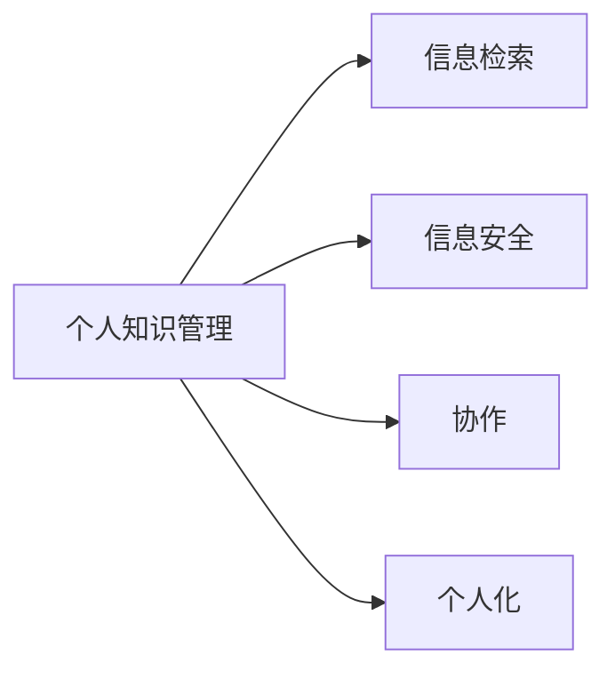

                 

# 管理者如何建立个人知识管理系统

> 关键词：知识管理,信息检索,信息安全,协作,个人化

## 1. 背景介绍

在快速变化的时代背景下，信息爆炸和知识更新速度的加快给个人管理者带来了前所未有的挑战。管理者需要从繁杂的信息中迅速提取关键信息、把握关键趋势、做出明智决策，同时还要妥善管理个人知识资产，高效地利用这些资产，不断提升自己的能力水平。因此，建立一个个人知识管理系统，帮助管理者系统化、结构化地管理知识，成为了一种迫切的需求。

个人知识管理系统（Personal Knowledge Management System, PKMS）是一个整合个人知识资源的平台，它不仅能帮助个人存储和组织信息，还能通过智能化的分析工具，促进知识的发现和创新，提高个人和团队的决策效率和创新能力。本文将详细探讨管理者如何建立一个高效的个人知识管理系统，以支持他们的日常工作和学习。

## 2. 核心概念与联系

### 2.1 核心概念概述

为了更好地理解个人知识管理系统，本文将介绍几个核心概念：

- **个人知识管理**：指个人通过使用工具和技巧，管理、整理、分享和应用个人知识资源的过程。这包括信息的收集、整理、存储、检索和应用等环节。

- **信息检索**：指从信息库中快速找到所需信息的过程。信息检索技术是PKMS的核心功能之一，通过搜索算法和索引技术，用户可以迅速找到所需信息。

- **信息安全**：指对个人知识资产进行保护，防止未授权访问和数据泄露。信息安全是PKMS的重要组成部分，确保知识的保密性和完整性。

- **协作**：指在PKMS中进行信息共享和协同工作。协作工具可以支持团队协作，实现知识的高效传播和共享。

- **个人化**：指PKMS可以根据用户的偏好和习惯，提供个性化的信息推荐和服务。通过机器学习等技术，PKMS可以不断学习用户行为，提高个性化服务质量。

这些核心概念之间的关系可以通过以下Mermaid流程图来展示：



这个流程图展示了一个典型的个人知识管理系统的各个核心功能模块，以及它们之间的联系。

## 3. 核心算法原理 & 具体操作步骤

### 3.1 算法原理概述

个人知识管理系统的核心算法原理主要集中在信息检索和个性化推荐两个方面。

**信息检索**算法通常包括文本检索和多媒体检索两种类型。文本检索算法通常使用倒排索引、布尔检索、向量空间模型等方法，从大量文本中快速定位到相关的文档和信息。多媒体检索算法则通过特征提取和相似度计算，从图像、视频等多媒体数据中检索到相似的信息。

**个性化推荐**算法则通过分析用户的访问行为、偏好和历史记录，使用协同过滤、基于内容的推荐、深度学习等方法，为每个用户提供个性化的信息推荐。这些算法能够帮助用户发现新的知识领域，提高信息获取的效率和质量。

### 3.2 算法步骤详解

下面详细介绍信息检索和个性化推荐的算法步骤。

#### 3.2.1 信息检索算法步骤

1. **数据预处理**：对原始数据进行清洗、分词、去停用词等预处理操作，以便于后续的检索算法处理。

2. **建立索引**：通过倒排索引、向量空间模型等方法，将文档转换为易于检索的结构化数据。

3. **检索查询**：用户输入查询词，检索算法根据查询词在索引中快速定位到相关的文档。

4. **排序和过滤**：根据相关度、匹配度等指标对搜索结果进行排序和过滤，提高检索的准确性和效率。

5. **结果反馈**：将检索结果反馈给用户，用户可以进行进一步的浏览和评估。

#### 3.2.2 个性化推荐算法步骤

1. **用户画像构建**：根据用户的访问行为、兴趣偏好、历史操作等数据，构建用户画像，以便于推荐系统的个性化推荐。

2. **物品画像构建**：对推荐库中的物品进行特征提取，构建物品画像，用于计算相似度。

3. **相似度计算**：通过协同过滤、基于内容的推荐、深度学习等方法，计算用户与物品之间的相似度。

4. **推荐排序**：根据相似度计算结果，对推荐结果进行排序，生成推荐列表。

5. **结果反馈和迭代**：将推荐结果展示给用户，根据用户的选择反馈，不断调整推荐模型，提高推荐效果。

### 3.3 算法优缺点

信息检索和个性化推荐的算法各有优缺点，具体如下：

#### 信息检索算法

- **优点**：
  - 能够快速定位到相关的文档和信息，提高信息获取的效率。
  - 检索算法经过大量研究，技术成熟，性能稳定。
- **缺点**：
  - 对于大规模数据，索引建立和查询的时间复杂度较高。
  - 对于多媒体数据，特征提取和相似度计算较为复杂。

#### 个性化推荐算法

- **优点**：
  - 能够提供个性化的信息推荐，提高用户的信息获取质量。
  - 推荐算法能够不断学习用户行为，适应用户需求的变化。
- **缺点**：
  - 对数据的要求较高，需要大量的用户行为数据进行训练。
  - 个性化推荐容易陷入“信息茧房”，导致信息单一化。

### 3.4 算法应用领域

信息检索和个性化推荐算法在多个领域中得到了广泛应用，具体如下：

- **互联网搜索引擎**：如Google、百度等，通过文本检索算法为用户快速定位信息。

- **电子商务平台**：如亚马逊、京东等，通过个性化推荐算法为用户推荐商品。

- **社交网络平台**：如Facebook、微信等，通过信息检索和个性化推荐，提升用户的信息获取效率和满意度。

- **在线学习和教育平台**：如Coursera、Udemy等，通过个性化推荐算法为用户推荐课程和资料。

- **新闻和信息聚合平台**：如Flipboard、Zhihu等，通过信息检索和个性化推荐，帮助用户发现新的信息源。

## 4. 数学模型和公式 & 详细讲解 & 举例说明

### 4.1 数学模型构建

本节将使用数学语言对信息检索和个性化推荐的过程进行更加严格的刻画。

假设用户查询词为 $q$，文档集合为 $D$，索引为 $I$。信息检索的目标是找到与 $q$ 最相关的文档集合 $R$。假设文档中包含的关键词为 $t$，文档中 $t$ 的权重为 $w_t$。信息检索的目标函数为：

$$
\min_{R} \sum_{d \in R} \sum_{t \in d} (w_t - \alpha \cdot d_t)^2
$$

其中 $d_t$ 为文档 $d$ 中关键词 $t$ 的权重，$\alpha$ 为超参数。

个性化推荐的目标是根据用户 $u$ 的兴趣，找到最相关的物品集合 $S$。假设物品集合为 $M$，物品 $m$ 的特征向量为 $v_m$，用户 $u$ 的特征向量为 $v_u$。个性化推荐的目标函数为：

$$
\min_{S} \sum_{m \in S} \| v_m - \beta \cdot v_u \|^2
$$

其中 $\beta$ 为超参数，$\| \cdot \|$ 为范数。

### 4.2 公式推导过程

下面以协同过滤算法为例，详细推导个性化推荐的过程。

假设用户 $u$ 对物品 $m$ 的评分 $r_{um}$ 已知。协同过滤算法通过计算用户 $u$ 和物品 $m$ 之间的相似度，推荐最相关的物品 $m'$。协同过滤算法的基本步骤为：

1. **计算用户-物品相似度**：
   $$
   \text{similarity}_{um} = \text{similarity}(u, m) = \frac{1}{N} \sum_{n=1}^N \text{similarity}(u_n, m)
   $$

2. **计算物品-物品相似度**：
   $$
   \text{similarity}_{mm'} = \text{similarity}(m, m') = \frac{1}{N} \sum_{n=1}^N \text{similarity}(m_n, m')
   $$

3. **计算推荐物品评分**：
   $$
   \hat{r}_{um'} = \text{similarity}_{um} \cdot \text{similarity}_{mm'}
   $$

4. **排序和推荐**：
   $$
   \text{rank}(m') = \hat{r}_{um'} / \sigma(\hat{r}_{um'})
   $$

其中 $\sigma(\cdot)$ 为平滑函数，防止极端值影响推荐结果。

### 4.3 案例分析与讲解

以在线学习和教育平台为例，详细分析个性化推荐算法的应用。

假设用户 $u$ 对课程 $m_1, m_2, m_3$ 的评分分别为 $4.5, 4.2, 4.0$。协同过滤算法通过计算用户 $u$ 与课程 $m_1, m_2, m_3$ 之间的相似度，计算出用户 $u$ 对课程 $m'$ 的预测评分，并进行排序和推荐。假设 $m_1$ 和 $m_2$ 之间的相似度为 $0.8$，$m_2$ 和 $m_3$ 之间的相似度为 $0.6$，$m_3$ 和 $m'$ 之间的相似度为 $0.7$。则用户 $u$ 对课程 $m'$ 的预测评分为：

$$
\hat{r}_{um'} = \frac{4.5}{\sqrt{4.5^2 + 4.2^2 + 4.0^2}} \cdot \frac{0.8 \cdot 0.6 + 0.8 \cdot 0.7 + 0.6 \cdot 0.7}{\sqrt{0.8^2 + 0.6^2 + 0.7^2}} = 4.7
$$

最终推荐结果为：

$$
\text{rank}(m') = \frac{4.7}{\sigma(4.7)} \approx 4.7
$$

### 5. 项目实践：代码实例和详细解释说明

#### 5.1 开发环境搭建

在进行PKMS开发前，我们需要准备好开发环境。以下是使用Python进行开发的环境配置流程：

1. 安装Python：从官网下载并安装Python，建议使用3.8或以上版本。

2. 安装Pip：在命令行输入 `python -m ensurepip --default-pip` 安装pip包管理工具。

3. 安装PyTorch：
   ```bash
   pip install torch torchvision torchaudio
   ```

4. 安装Flask：
   ```bash
   pip install flask
   ```

5. 安装数据库连接工具：
   ```bash
   pip install sqlite3
   ```

6. 安装前端框架：
   ```bash
   pip install flask-cors flask-restful
   ```

完成上述步骤后，即可在Python环境下开始PKMS的开发。

#### 5.2 源代码详细实现

以下是一个简单的Python代码示例，演示如何使用Flask构建一个基本的PKMS系统：

```python
from flask import Flask, request, jsonify
from flask_cors import CORS
from flask_restful import Resource, Api

app = Flask(__name__)
CORS(app)
api = Api(app)

# 定义数据结构
data = {
    'books': [
        {'title': 'Python核心编程', 'author': 'John Smith', 'rating': 4.5},
        {'title': '深度学习入门', 'author': 'Alice Lee', 'rating': 4.2},
        {'title': '机器学习实战', 'author': 'Bob Johnson', 'rating': 4.0}
    ]
}

# 定义API接口
class Book(Resource):
    def get(self, book_id):
        return jsonify(data['books'][book_id])

class BookList(Resource):
    def get(self):
        return jsonify(data['books'])

class BookApi(Resource):
    def post(self):
        data = request.get_json()
        book = {'title': data['title'], 'author': data['author'], 'rating': data['rating']}
        data['books'].append(book)
        return jsonify(data['books'])

api.add_resource(Book, '/books/<int:book_id>')
api.add_resource(BookList, '/books')
api.add_resource(BookApi, '/books')

if __name__ == '__main__':
    app.run(debug=True)
```

在上述代码中，我们使用了Flask构建了一个简单的API接口，支持获取书籍信息、添加书籍信息等操作。这是一个非常基础和简单的示例，实际开发中还需要考虑更多的功能和安全措施。

#### 5.3 代码解读与分析

**Flask框架**：Flask是一个轻量级的Python Web框架，适用于开发小型Web应用和API接口。通过Flask，我们可以方便地构建RESTful API接口，支持HTTP请求和响应。

**CORS**：CORS（Cross-Origin Resource Sharing）是一种跨域资源共享技术，允许Web应用跨域访问资源。在实际应用中，我们常常需要从不同的域名获取数据，CORS解决了浏览器的同源策略限制。

**数据结构**：在上述代码中，我们定义了一个简单的数据结构，包含了若干本书籍的信息。这些信息存储在Python字典中，方便进行数据处理和查询。

**API接口**：我们定义了三个API接口，分别用于获取单本书信息、获取所有书籍信息、添加新书籍信息。这些接口都是RESTful风格的，使用HTTP请求和JSON格式的数据进行通信。

**运行结果展示**：在运行上述代码后，我们可以通过访问 `http://localhost:5000/books/1` 来获取ID为1的书籍信息，访问 `http://localhost:5000/books` 来获取所有书籍信息，访问 `http://localhost:5000/books` 并使用POST请求来添加新书籍信息。

## 6. 实际应用场景

### 6.1 在线学习平台

在线学习平台通常需要为学生提供个性化的学习资源推荐，帮助学生发现适合自身的学习材料。通过个性化推荐算法，平台可以分析学生的学习行为和偏好，为他们推荐最相关的书籍、课程和视频。例如，某学生对数据科学感兴趣，平台可以推荐相关的书籍、在线课程和视频，帮助学生深入学习数据科学知识。

### 6.2 企业知识库

企业知识库是一个集成了企业内部知识资源的大型数据库，用于存储和分享企业内部文档、技术文档、项目报告等。通过信息检索算法，企业知识库可以快速定位到相关的知识文档，帮助员工查找所需信息。例如，某员工需要查找关于云计算的资料，只需输入关键字，知识库即可快速定位到相关的文档，并提供详细的搜索结果。

### 6.3 社交媒体平台

社交媒体平台通常需要提供搜索和推荐功能，帮助用户发现新的内容。通过信息检索算法，平台可以分析用户的搜索行为和兴趣，为用户推荐相关的内容。例如，某用户喜欢阅读科技新闻，平台可以推荐相关的科技文章、视频和博客，满足用户的需求。

### 6.4 未来应用展望

未来，PKMS将继续在多个领域中发挥重要作用。以下是几个未来的应用展望：

- **虚拟助理和聊天机器人**：通过PKMS，虚拟助理和聊天机器人可以更好地理解用户的意图和需求，提供个性化的服务。例如，某用户需要查询航班信息，虚拟助理可以根据用户的查询信息，推荐最适合的航班。

- **智能推荐系统**：通过PKMS，智能推荐系统可以分析用户的行为和偏好，提供个性化的商品推荐。例如，某用户喜欢阅读科幻小说，智能推荐系统可以推荐相关的科幻小说、电影和游戏。

- **信息检索和知识图谱**：PKMS可以与知识图谱结合，提供更深层次的信息检索和知识发现。例如，某用户需要查找某公司的历史背景，知识图谱可以快速定位到相关的信息，并提供详细的历史信息。

- **多语言知识管理**：PKMS可以支持多语言的信息检索和个性化推荐，帮助用户跨越语言障碍，发现全球的知识资源。例如，某用户需要查找关于人工智能的资料，PKMS可以支持多种语言，提供丰富的资料推荐。

## 7. 工具和资源推荐

### 7.1 学习资源推荐

为了帮助开发者系统掌握PKMS的理论基础和实践技巧，这里推荐一些优质的学习资源：

1. **《信息检索原理与实践》**：介绍信息检索的基本原理和技术，包括文本检索、多媒体检索等。

2. **《推荐系统实战》**：通过实例介绍推荐系统的构建和优化，涵盖协同过滤、基于内容的推荐等算法。

3. **《Python数据科学手册》**：介绍Python在数据科学中的应用，包括数据处理、数据可视化、机器学习等。

4. **《机器学习实战》**：通过实例介绍机器学习的应用，涵盖监督学习、无监督学习等算法。

5. **《Flask Web开发实战》**：介绍Flask框架的构建和使用，涵盖API接口、数据处理等技术。

6. **《深度学习实战》**：介绍深度学习的应用，涵盖神经网络、卷积神经网络等算法。

通过学习这些资源，相信你一定能够快速掌握PKMS的理论基础和实践技巧，并用于解决实际的NLP问题。

### 7.2 开发工具推荐

高效的开发离不开优秀的工具支持。以下是几款用于PKMS开发的常用工具：

1. **Jupyter Notebook**：一个强大的交互式计算平台，支持Python、R等语言，适合进行数据处理和算法开发。

2. **JupyterLab**：Jupyter Notebook的升级版本，支持更多的开发环境和插件，适合进行复杂的数据处理和算法开发。

3. **Google Colab**：谷歌提供的免费在线Jupyter Notebook环境，支持GPU/TPU算力，适合进行大规模数据处理和深度学习开发。

4. **Spyder**：一个基于Qt的Python IDE，支持数据可视化、代码调试等，适合进行数据科学和算法开发。

5. **PyCharm**：一个功能强大的Python IDE，支持数据处理、代码调试、版本控制等，适合进行大规模项目开发。

6. **Git**：一个版本控制系统，适合进行代码管理和版本控制，支持多人协作开发。

合理利用这些工具，可以显著提升PKMS开发的效率，加快创新迭代的步伐。

### 7.3 相关论文推荐

PKMS的研究源于学界的持续研究。以下是几篇奠基性的相关论文，推荐阅读：

1. **《基于内容的推荐系统》**：介绍基于内容的推荐算法，通过分析物品的特征，为用户推荐相关物品。

2. **《协同过滤推荐系统》**：介绍协同过滤算法，通过分析用户行为，为用户推荐相关物品。

3. **《深度学习在推荐系统中的应用》**：介绍深度学习在推荐系统中的应用，涵盖神经网络、自编码器等算法。

4. **《信息检索：原理、算法与应用》**：介绍信息检索的基本原理和技术，涵盖文本检索、多媒体检索等算法。

5. **《智能推荐系统》**：介绍智能推荐系统的构建和优化，涵盖协同过滤、深度学习等算法。

这些论文代表了大语言模型微调技术的发展脉络。通过学习这些前沿成果，可以帮助研究者把握学科前进方向，激发更多的创新灵感。

## 8. 总结：未来发展趋势与挑战

### 8.1 总结

本文对管理者如何建立个人知识管理系统进行了全面系统的介绍。首先阐述了PKMS的背景和意义，明确了PKMS在帮助管理者系统化、结构化管理知识方面的独特价值。其次，从原理到实践，详细讲解了信息检索和个性化推荐的数学模型和算法步骤，给出了PKMS的代码实例。同时，本文还广泛探讨了PKMS在在线学习、企业知识库、社交媒体等多个领域的应用前景，展示了PKMS的巨大潜力。此外，本文精选了PKMS的学习资源和开发工具，力求为开发者提供全方位的技术指引。

通过本文的系统梳理，可以看到，PKMS正在成为个人管理知识的重要工具，极大地提升了管理者的信息获取和知识应用能力。未来，伴随PKMS技术的持续演进，相信NLP技术将在更广阔的应用领域大放异彩，深刻影响人类的生产生活方式。

### 8.2 未来发展趋势

展望未来，PKMS技术将呈现以下几个发展趋势：

1. **智能化水平提升**：未来的PKMS将进一步融入人工智能技术，如自然语言处理、机器学习等，实现更加智能化的信息检索和个性化推荐。

2. **多模态知识融合**：PKMS将支持多种类型的知识源，如文本、图像、视频等，实现多模态知识的融合和协同。

3. **实时性和个性化提升**：未来的PKMS将更加注重实时性，能够根据用户的行为和环境，实时调整推荐内容，提升个性化服务的质量。

4. **隐私和安全保护**：未来的PKMS将更加注重隐私和安全保护，通过加密、匿名化等技术，保护用户的信息安全。

5. **开源和标准化**：未来的PKMS将更加注重开源和标准化，通过开放社区和标准接口，促进知识管理的普适化和互通性。

以上趋势凸显了PKMS技术的广阔前景。这些方向的探索发展，必将进一步提升PKMS的性能和应用范围，为个人和组织带来更加高效、智能、安全的知识管理体验。

### 8.3 面临的挑战

尽管PKMS技术已经取得了瞩目成就，但在迈向更加智能化、普适化应用的过程中，它仍面临着诸多挑战：

1. **数据质量问题**：PKMS依赖高质量的数据进行训练和优化，数据的不准确、不完整等问题将影响推荐效果。如何获取和处理高质量的数据，是PKMS面临的主要挑战之一。

2. **隐私和安全风险**：PKMS需要处理大量个人隐私信息，如何确保数据的安全和隐私保护，是一个亟待解决的问题。

3. **技术复杂性**：PKMS涉及多个领域的技术，如自然语言处理、机器学习、数据库管理等，如何综合应用这些技术，需要开发者的高水平技术积累。

4. **用户体验问题**：PKMS需要提供良好的用户体验，如何设计易用、直观的界面，提升用户的使用体验，是一个重要的挑战。

5. **成本和资源投入**：PKMS的开发和维护需要大量的资源投入，如何降低成本，提高效率，是一个需要解决的问题。

6. **模型可解释性**：PKMS使用的推荐模型往往复杂且黑盒，如何提高模型的可解释性，增强用户对模型的信任度，是一个亟待解决的问题。

正视PKMS面临的这些挑战，积极应对并寻求突破，将是大语言模型微调走向成熟的必由之路。相信随着学界和产业界的共同努力，这些挑战终将一一被克服，PKMS必将在构建人机协同的智能时代中扮演越来越重要的角色。

### 8.4 研究展望

面对PKMS面临的挑战，未来的研究需要在以下几个方面寻求新的突破：

1. **增强数据质量**：通过数据清洗、数据增强、数据标注等技术，提升数据质量，提高推荐效果。

2. **提升隐私和安全保护**：通过加密、匿名化、隐私保护技术，确保数据的安全和隐私保护。

3. **简化模型复杂性**：通过模型简化、模型压缩、模型蒸馏等技术，降低模型复杂度，提高模型的可解释性和实时性。

4. **优化用户体验**：通过界面设计、交互设计、用户反馈等技术，提升用户的使用体验，增强PKMS的易用性和满意度。

5. **降低开发和维护成本**：通过开源社区、标准化接口、自动化测试等技术，降低PKMS的开发和维护成本，提高开发效率。

6. **增强模型可解释性**：通过模型解释、特征可视化、因果分析等技术，增强模型的可解释性，提升用户对模型的信任度。

这些研究方向将引领PKMS技术的进一步发展，为知识管理的普适化和智能化提供有力支持。面向未来，PKMS技术还需要与其他人工智能技术进行更深入的融合，如知识表示、因果推理、强化学习等，多路径协同发力，共同推动智能系统的发展。只有勇于创新、敢于突破，才能不断拓展知识管理的边界，让智能技术更好地造福人类社会。

## 9. 附录：常见问题与解答

**Q1：PKMS如何处理多语言知识管理？**

A: PKMS可以通过多语言数据集进行训练，支持多语言的信息检索和个性化推荐。例如，某用户需要查找关于人工智能的资料，PKMS可以支持多种语言，提供丰富的资料推荐。

**Q2：PKMS如何保证信息的安全性和隐私保护？**

A: PKMS可以通过数据加密、匿名化、隐私保护技术，确保数据的安全和隐私保护。例如，可以使用AES加密算法对用户数据进行加密，使用差分隐私技术保护用户隐私。

**Q3：PKMS如何进行实时性优化？**

A: PKMS可以通过优化算法、提升硬件性能、减少数据传输等技术，实现实时性优化。例如，可以使用深度学习算法优化推荐模型，使用GPU/TPU加速计算，减少数据传输延迟。

**Q4：PKMS如何进行多模态知识融合？**

A: PKMS可以通过融合图像、视频、文本等多种类型的知识源，实现多模态知识的融合和协同。例如，某用户需要查找关于某个产品的资料，PKMS可以结合产品的图片、视频和文本信息，提供更加全面的资料推荐。

**Q5：PKMS如何进行开源和标准化？**

A: PKMS可以通过开放社区、标准接口、API文档等技术，实现开源和标准化。例如，可以使用GitHub托管PKMS的代码，使用标准API接口与外部系统进行数据交互。

---

作者：禅与计算机程序设计艺术 / Zen and the Art of Computer Programming

