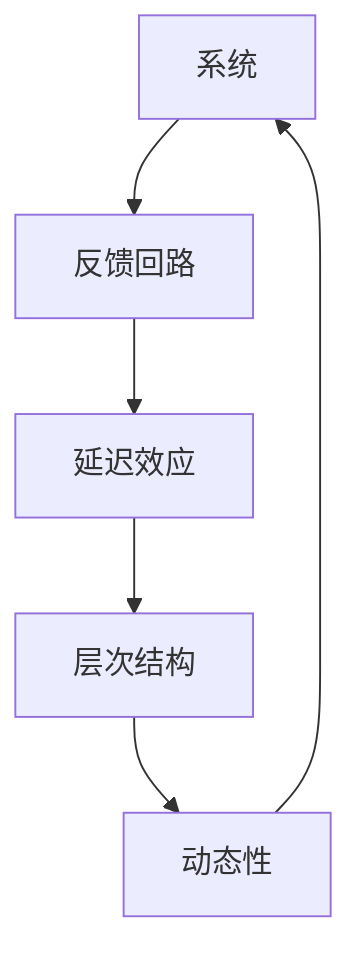

                 

# 系统思考在组织变革中的应用

## 1. 背景介绍

### 1.1 问题由来

在当今快速变化、竞争激烈的市场环境中，组织变革已成为企业生存和发展的必要手段。然而，在推动变革的过程中，传统的零散、分割式管理方法往往难以应对复杂的系统性问题，导致变革成效有限。系统思考（Systems Thinking）作为一种系统性、整体性思维模式，能够帮助组织从全局视角出发，全面、深入地理解和应对变革带来的挑战。

### 1.2 问题核心关键点

系统思考的核心在于理解组织是一个由相互依赖、相互作用的各要素组成的复杂系统。其关键点包括：

- **系统视角**：从整体而非局部视角分析问题，理解系统各要素间的相互作用。
- **动态性**：理解系统随时间动态变化的特点，预判系统变化趋势。
- **反馈循环**：识别系统中的反馈回路，理解其在系统行为中的作用。
- **层次结构**：理解系统不同层次间的相互作用，分析系统不同层级的功能和关联。
- **延迟效应**：认识系统行为与响应之间的延迟关系，避免急功近利的决策。

这些核心观点构成了系统思考的理论基础，为组织变革提供了系统性、整体性的分析框架，使组织能够更有效地应对变革带来的挑战。

### 1.3 问题研究意义

系统思考在组织变革中的应用，不仅能够帮助企业更科学、有效地推动变革，还能够提升组织整体的管理水平和适应能力。具体而言：

1. **全局视角**：系统思考促使组织从整体视角出发，全面分析变革的影响，避免短视和局部优化导致的整体失衡。
2. **风险预判**：通过动态分析和反馈回路识别，组织能够更准确地预判变革中的潜在风险，提前制定应对策略。
3. **层次优化**：理解不同层级的功能和关联，有助于组织进行层次化管理，优化资源配置，提升整体效率。
4. **延迟效应管理**：通过理解延迟效应，组织能够制定更合理的变革计划，避免因急功近利导致的资源浪费和效果不理想。
5. **持续改进**：系统思考的持续性特点，鼓励组织进行不断的自我优化和改进，提升组织的长期竞争力和创新能力。

通过系统思考的应用，组织能够更科学、系统地推动变革，提升变革的效率和效果，实现持续发展和创新。

## 2. 核心概念与联系

### 2.1 核心概念概述

系统思考涉及诸多核心概念，以下将逐一介绍这些关键概念及其在组织变革中的应用：

- **系统**：由相互依赖、相互作用的要素组成的网络。在组织变革中，系统通常指的是整个组织结构、流程、文化等要素。
- **反馈回路**：系统中的信息流和能量流形成循环，对系统的状态产生影响。组织变革中，反馈回路通常涉及组织的决策、执行和反馈过程。
- **延迟效应**：系统行为与响应之间的滞后时间。在组织变革中，延迟效应往往会导致决策效果和预期不符。
- **层次结构**：系统内不同层级间的相互作用和关联。组织变革中，层次结构通常涉及管理层、执行层和操作层等。
- **动态性**：系统随时间变化的特点。组织变革中，动态性通常体现在组织结构、流程、文化等随市场、技术变化而调整的过程。

这些核心概念之间的逻辑关系可以通过以下Mermaid流程图来展示：



这个流程图展示了系统思考中关键概念之间的相互作用关系：

1. 系统通过反馈回路动态调整，识别和应对内部和外部的变化。
2. 延迟效应影响了系统对反馈的响应速度，需要组织在变革中提前预判和准备。
3. 层次结构反映了组织中不同层级的功能和关联，有助于组织进行层次化管理和优化。
4. 动态性展示了组织随时间变化的特点，促使组织在变革中考虑长期影响和适应性。

这些概念共同构成了系统思考的理论基础，为组织变革提供了系统性、整体性的分析框架。

## 3. 核心算法原理 & 具体操作步骤
### 3.1 算法原理概述

系统思考在组织变革中的应用，主要基于系统动力学（System Dynamics）模型的构建和优化。系统动力学模型是一种用于描述和预测系统行为随时间变化的数学模型，能够帮助组织识别系统中的反馈回路和延迟效应，从而制定更科学的变革策略。

### 3.2 算法步骤详解

基于系统思考的组织变革过程，通常包括以下几个关键步骤：

**Step 1: 系统诊断**
- 通过系统诊断，全面了解组织系统中的问题、挑战和机会。
- 识别系统中的关键要素、反馈回路和延迟效应。

**Step 2: 设定目标**
- 根据系统诊断结果，设定明确的变革目标和期望效果。
- 制定短期、中期和长期的变革目标，确保目标的可达性和可实现性。

**Step 3: 构建模型**
- 利用系统动力学模型，构建组织变革的仿真模型。
- 设定模型中的关键变量、参数和假设，反映组织系统的动态变化。

**Step 4: 仿真与分析**
- 通过仿真模型，预测组织系统在变革过程中可能的变化和效果。
- 识别系统中的瓶颈和风险，制定相应的风险应对策略。

**Step 5: 实施与优化**
- 根据仿真分析结果，制定具体的变革实施计划。
- 逐步实施变革计划，并在实施过程中不断优化和调整。

**Step 6: 评估与反馈**
- 在变革实施过程中，定期评估变革效果和系统状态。
- 根据反馈结果，调整变革策略和实施计划，确保变革目标的实现。

通过以上步骤，组织能够全面、系统地理解变革过程，制定科学、有效的变革策略，提升变革的成功率和效果。

### 3.3 算法优缺点

基于系统思考的组织变革方法具有以下优点：

1. **系统视角**：从整体视角出发，避免局部优化导致的整体失衡。
2. **动态分析**：通过仿真和预测，提前预判变革中的风险和机会，提高变革成功率。
3. **层次优化**：理解不同层级的功能和关联，进行层次化管理和优化，提升整体效率。
4. **延迟效应管理**：理解延迟效应，制定合理的变革计划，避免急功近利导致的资源浪费和效果不理想。
5. **持续改进**：系统思考的持续性特点，鼓励组织进行不断的自我优化和改进，提升组织的长期竞争力和创新能力。

同时，该方法也存在一定的局限性：

1. **复杂性**：系统思考和系统动力学模型的构建和分析较为复杂，需要专业知识和技能。
2. **资源需求**：构建和维护系统动力学模型需要大量的时间和资源投入。
3. **执行难度**：变革实施过程中，需要各层级协同配合，执行难度较大。
4. **灵活性**：系统思考模型通常较为静态，难以应对快速变化的环境。

尽管存在这些局限性，但就目前而言，基于系统思考的组织变革方法仍是一种科学、系统、整体性的变革范式，广泛应用于各行业和组织中。

### 3.4 算法应用领域

基于系统思考的组织变革方法，在多个领域得到了广泛的应用，例如：

- **企业管理**：通过系统思考分析企业的组织结构、流程和文化，制定科学的战略和运营计划。
- **供应链管理**：利用系统动力学模型，优化供应链中的物流、库存和生产流程，提高供应链效率和响应速度。
- **人力资源管理**：理解员工行为和组织系统的互动，制定合理的人力资源政策和激励机制。
- **创新管理**：通过系统思考识别创新机会和障碍，制定创新战略，推动组织持续创新。
- **项目管理**：利用系统思考分析项目的内部和外部环境，优化项目管理和资源配置。
- **风险管理**：识别组织系统中的潜在风险和反馈回路，制定风险应对策略，提升风险管理能力。

这些应用场景展示了系统思考在组织变革中的广泛应用和深远影响。

## 4. 数学模型和公式 & 详细讲解 & 举例说明

### 4.1 数学模型构建

基于系统思考的组织变革过程，可以构建一个简单的系统动力学模型。以下是一个典型的系统动力学模型，包含两个变量 $X_1$ 和 $X_2$，以及一个反馈回路：

1. $X_1$ 的变化率
2. $X_1$ 到 $X_2$ 的传递关系
3. $X_2$ 的变化率
4. $X_2$ 到 $X_1$ 的反馈关系

通过这些变量和关系，可以构建一个反映组织系统动态变化的仿真模型。

### 4.2 公式推导过程

假设 $X_1$ 表示某个管理指标（如销售额），$X_2$ 表示另一个相关指标（如市场份额），其变化率分别表示为 $\frac{dX_1}{dt}$ 和 $\frac{dX_2}{dt}$，传递关系和反馈关系表示为 $f(X_1,X_2)$ 和 $g(X_1,X_2)$。则系统动力学模型可以表示为：

$$
\frac{dX_1}{dt} = aX_1 + bX_2 + cX_1f(X_1,X_2) - dX_2g(X_1,X_2)
$$
$$
\frac{dX_2}{dt} = eX_1 + fX_2 + gX_1g(X_1,X_2) - hX_2f(X_1,X_2)
$$

其中 $a, b, c, d, e, f, g, h$ 为模型参数，表示系统中的关键变量和参数。

### 4.3 案例分析与讲解

以一家科技公司的组织变革为例，我们可以利用系统动力学模型分析其销售和市场份额的变化，识别其中的关键因素和反馈回路。

1. **销售变化率**：假设销售变化率 $\frac{dX_1}{dt}$ 受公司市场营销、产品研发和客户满意度影响。
2. **市场份额变化率**：市场份额变化率 $\frac{dX_2}{dt}$ 受市场竞争、品牌形象和客户忠诚度影响。
3. **市场营销**：市场营销对销售有直接影响，同时也会提升品牌形象和客户忠诚度。
4. **产品研发**：产品研发提升产品质量和功能，进而影响销售和市场份额。
5. **客户满意度**：客户满意度提升销售和市场份额，同时也会影响市场营销和产品研发。

将这些变量和关系带入上述系统动力学模型，可以构建反映公司销售和市场份额变化的仿真模型。通过仿真和分析，识别其中的关键因素和反馈回路，制定相应的变革策略，提升公司的市场竞争力和创新能力。

## 5. 项目实践：代码实例和详细解释说明

### 5.1 开发环境搭建

在进行系统思考和系统动力学模型的实践前，我们需要准备好开发环境。以下是使用Python进行SimPy（一种基于Python的仿真库）开发的环境配置流程：

1. 安装Anaconda：从官网下载并安装Anaconda，用于创建独立的Python环境。

2. 创建并激活虚拟环境：
```bash
conda create -n simpy-env python=3.8 
conda activate simpy-env
```

3. 安装SimPy：
```bash
conda install simpy
```

4. 安装各类工具包：
```bash
pip install numpy pandas scikit-learn matplotlib tqdm jupyter notebook ipython
```

完成上述步骤后，即可在`simpy-env`环境中开始系统思考和系统动力学模型的实践。

### 5.2 源代码详细实现

这里我们以一家科技公司的销售和市场份额为例，使用SimPy构建和仿真系统动力学模型。

首先，定义销售和市场份额的变量和初始值：

```python
from simpy import Environment, Resource, Process

env = Environment()
S = env.create_shared_array('double', 1, [0.0])
M = env.create_shared_array('double', 1, [0.0])

S_initial = 0.0
M_initial = 0.0
S[0] = S_initial
M[0] = M_initial
```

然后，定义模型中的关键参数和函数：

```python
a = 0.1  # 销售变化率参数
b = 0.2  # 市场份额变化率参数
c = 0.3  # 市场营销对销售的传递系数
d = 0.4  # 市场营销对市场份额的传递系数
e = 0.5  # 产品研发对销售的传递系数
f = 0.6  # 产品研发对市场份额的传递系数
g = 0.7  # 客户满意度对销售的传递系数
h = 0.8  # 客户满意度对市场份额的传递系数

def process(env, s, m):
    # 销售变化率
    ds = a * s + b * m + c * s * f(s, m) - d * m * g(s, m)
    # 市场份额变化率
    dm = e * s + f * m + g * s * g(s, m) - h * m * f(s, m)
    # 反馈函数
    def feedback(s, m):
        return s * (0.9 - s) * (0.8 - m)
    env.process(env.schedule(env.cosine(0, 1, 0, 0, 0), process, s, m, ds, dm))
```

最后，定义仿真模型并运行：

```python
def main():
    env = Environment()
    S = env.create_shared_array('double', 1, [0.0])
    M = env.create_shared_array('double', 1, [0.0])

    S_initial = 0.0
    M_initial = 0.0
    S[0] = S_initial
    M[0] = M_initial

    a = 0.1
    b = 0.2
    c = 0.3
    d = 0.4
    e = 0.5
    f = 0.6
    g = 0.7
    h = 0.8

    env.process(env.cosine(0, 1, 0, 0, 0), process, S, M)

    env.run(until=100)

    # 输出销售和市场份额随时间变化的曲线
    import matplotlib.pyplot as plt
    plt.plot(env.random.variates(lambda: S[0], 100), label='Sales')
    plt.plot(env.random.variates(lambda: M[0], 100), label='Market Share')
    plt.legend()
    plt.show()

main()
```

以上代码展示了使用SimPy构建和仿真系统动力学模型的完整流程。通过定义销售和市场份额的变量、关键参数和反馈函数，构建了反映公司销售和市场份额变化的仿真模型。运行仿真后，可以得到销售和市场份额随时间变化的曲线，识别其中的关键因素和反馈回路，制定相应的变革策略。

### 5.3 代码解读与分析

让我们再详细解读一下关键代码的实现细节：

**SimPy环境定义**：
- `simpy.Environment()` 创建了一个SimPy环境 `env`。
- `env.create_shared_array()` 创建了一个共享数组，用于存储和更新销售和市场份额的值。

**模型参数定义**：
- 定义了模型中的关键参数 `a, b, c, d, e, f, g, h`，用于反映系统中的关键变量和传递关系。

**仿真模型定义**：
- `process()` 函数定义了仿真模型中的过程，包括销售和市场份额的变化率和反馈函数。
- 在 `process()` 函数中，利用 `env.schedule()` 函数定时执行模型过程，通过 `cosine` 函数生成一个周期性的时间序列，模拟公司的市场周期变化。

**仿真模型运行**：
- `env.run(until=100)` 运行仿真模型，直到100个时间步。
- `plt.plot()` 函数绘制销售和市场份额随时间变化的曲线，并进行可视化展示。

通过上述代码，我们可以看到，使用SimPy构建和仿真系统动力学模型，能够系统性地理解组织系统中的动态变化和反馈回路，从而制定科学的变革策略。

## 6. 实际应用场景

### 6.1 智能制造系统

智能制造系统中的生产、物流和质量控制等环节，具有高度动态性和复杂的反馈回路。通过系统思考和系统动力学模型，可以更好地理解和优化这些环节，提升生产效率和响应速度。

具体而言，可以构建生产订单、库存、生产线等关键要素的系统动力学模型，识别其中的关键因素和反馈回路。通过仿真和分析，优化生产计划、物流安排和质量控制策略，实现生产过程的自动化和智能化。

### 6.2 智慧城市治理

智慧城市治理涉及城市中的交通、环保、公共安全等多个领域，这些领域之间存在复杂的相互作用和反馈关系。通过系统思考和系统动力学模型，可以更好地理解和优化城市治理系统，提升城市管理的智能化水平。

具体而言，可以构建交通流量、空气质量、公共安全等关键要素的系统动力学模型，识别其中的关键因素和反馈回路。通过仿真和分析，优化交通管理、环境保护和公共安全策略，实现城市治理的精细化和智能化。

### 6.3 供应链管理

供应链管理中的物流、库存和生产等环节，具有高度动态性和复杂的反馈回路。通过系统思考和系统动力学模型，可以更好地理解和优化这些环节，提升供应链的效率和响应速度。

具体而言，可以构建物流、库存和生产等关键要素的系统动力学模型，识别其中的关键因素和反馈回路。通过仿真和分析，优化供应链计划、物流安排和生产策略，实现供应链的自动化和智能化。

### 6.4 未来应用展望

随着系统思考和系统动力学模型的不断发展，基于这些方法的组织变革将迎来更多创新应用和突破：

1. **智能决策支持**：利用系统思考和仿真模型，提升组织的决策能力和预测精度，制定科学、合理的战略和运营计划。
2. **复杂系统管理**：系统思考和系统动力学模型，能够帮助组织理解和优化复杂系统，提升系统管理和优化的效率和效果。
3. **持续改进和优化**：系统思考的持续性特点，促使组织进行不断的自我优化和改进，提升组织的长期竞争力和创新能力。
4. **跨领域应用**：系统思考和系统动力学模型，将拓展到更多领域，如医疗、教育、环保等，推动这些领域的发展和进步。

系统思考和系统动力学模型，将在未来更多领域得到广泛应用，推动组织的持续发展和创新。

## 7. 工具和资源推荐

### 7.1 学习资源推荐

为了帮助开发者系统掌握系统思考的理论基础和实践技巧，这里推荐一些优质的学习资源：

1. 《系统思考的艺术》（The Art of Systems Thinking）：这本书介绍了系统思考的基本概念、方法和应用，是系统思考学习的入门读物。
2. 《系统动力学与系统思考》（System Dynamics and Systems Thinking）：这本书详细介绍了系统动力学模型的构建和仿真，是系统动力学学习的权威资源。
3. 《系统思考在工作中的应用》（Systems Thinking in Action）：这本书展示了系统思考在各个行业中的应用案例，帮助读者理解和应用系统思考。
4. 系统思考在线课程：Coursera、edX等在线教育平台提供了系统思考和系统动力学的课程，适合初学者学习。
5. 系统思考社区：系统思考社区提供了丰富的学习资源和交流平台，适合系统思考爱好者学习和交流。

通过对这些资源的学习实践，相信你一定能够系统掌握系统思考的理论基础和实践技巧，应用到实际的组织变革中。

### 7.2 开发工具推荐

高效的开发离不开优秀的工具支持。以下是几款用于系统思考和系统动力学模型开发的常用工具：

1. SimPy：Python开源仿真库，适合构建和仿真系统动力学模型，具有丰富的仿真功能和易用性。
2. AnyLogic：基于JAVA的企业仿真建模工具，支持复杂的系统动力学模型构建和仿真。
3. Vensim：用于系统动力学模型构建和仿真，支持多种模型输入输出格式，易于与数据分析工具集成。
4. Arena：企业流程仿真软件，支持离散事件仿真，适合优化生产、物流等流程。
5. Luce：用于系统思考和系统动力学模型的建模和仿真，具有可视化建模界面和丰富的分析功能。
6. Python Enterprise：用于企业仿真和系统建模，支持SimPy和Pyomo等建模工具的集成。

合理利用这些工具，可以显著提升系统思考和系统动力学模型的开发效率，加快创新迭代的步伐。

### 7.3 相关论文推荐

系统思考和系统动力学模型的发展源于学界的持续研究。以下是几篇奠基性的相关论文，推荐阅读：

1. Jay Forrester的《城市与动态系统》（Urban Dynamics）：介绍了系统动力学模型在城市系统中的应用。
2. Peter Senge的《第五项修炼：学习型组织的艺术与实务》（The Fifth Discipline）：阐述了系统思考在组织管理中的应用。
3. John Kay的《系统动力学基础》（Fundamentals of System Dynamics）：系统介绍系统动力学模型的构建和仿真。
4. Richard Lind的《系统动力学：实现复杂系统决策》（System Dynamics: Principles and Applications）：系统介绍系统动力学模型的理论和应用。
5. William Bovet的《系统动力学：模型与应用》（System Dynamics: Modeling and Simulation）：详细介绍了系统动力学模型的建模和仿真方法。

这些论文代表了大系统思考和系统动力学模型的发展脉络，通过学习这些前沿成果，可以帮助研究者把握学科前进方向，激发更多的创新灵感。

## 8. 总结：未来发展趋势与挑战

### 8.1 总结

本文对基于系统思考的组织变革方法进行了全面系统的介绍。首先阐述了系统思考的理论基础和在组织变革中的应用，明确了系统思考在全面、系统、整体性分析组织变革中的独特价值。其次，从原理到实践，详细讲解了系统思考的数学模型和关键步骤，给出了系统动力学模型的代码实现。同时，本文还广泛探讨了系统思考在智能制造、智慧城市、供应链管理等多个行业领域的应用前景，展示了系统思考的广泛应用和深远影响。此外，本文精选了系统思考的学习资源、开发工具和相关论文，力求为读者提供全方位的技术指引。

通过本文的系统梳理，可以看到，基于系统思考的组织变革方法正在成为组织变革的重要范式，极大地拓展了组织系统管理的视野和能力。通过系统思考的应用，组织能够更好地理解和应对变革带来的挑战，提升变革的效率和效果，实现持续发展和创新。

### 8.2 未来发展趋势

展望未来，基于系统思考的组织变革技术将呈现以下几个发展趋势：

1. **系统思考模型和工具的普及**：随着系统思考理论和工具的不断成熟，系统思考将在更多行业和组织中得到应用，推动组织的全面管理和优化。
2. **多学科融合**：系统思考将与人工智能、大数据、区块链等前沿技术进行更深层次的融合，提升系统思考模型的预测能力和应用范围。
3. **持续改进和优化**：系统思考的持续性特点，将促使组织进行不断的自我优化和改进，提升组织的长期竞争力和创新能力。
4. **智能化和自动化**：系统思考与自动化建模工具的结合，将提升系统思考模型的构建和仿真效率，推动组织管理过程的自动化和智能化。
5. **跨领域应用**：系统思考将在更多领域得到广泛应用，如医疗、教育、环保等，推动这些领域的发展和进步。
6. **可视化和大数据分析**：系统思考模型的可视化和大数据分析，将帮助组织更好地理解和优化系统行为，提升管理决策的科学性和准确性。

以上趋势凸显了系统思考在组织变革中的广阔前景。这些方向的探索发展，必将进一步提升组织系统管理的科学性和系统性，为组织的持续发展和创新提供强有力的支持。

### 8.3 面临的挑战

尽管系统思考在组织变革中已取得显著成果，但在迈向更加智能化、普适化应用的过程中，仍面临诸多挑战：

1. **复杂性**：系统思考和系统动力学模型较为复杂，需要专业知识和技能。模型构建和仿真过程耗时耗力。
2. **数据需求**：系统思考模型需要大量的数据输入，数据的获取和处理需要耗费大量时间和资源。
3. **执行难度**：系统思考和系统动力学模型的实施需要各层级协同配合，执行难度较大。
4. **灵活性**：系统思考模型通常较为静态，难以应对快速变化的环境。
5. **可视化工具不足**：系统思考模型的可视化工具和分析方法较少，影响模型的理解和优化。
6. **跨领域应用困难**：系统思考模型的跨领域应用需要更多的学科知识和模型融合，存在一定的挑战。

尽管存在这些挑战，但通过不断的技术改进和应用探索，系统思考和系统动力学模型将进一步成熟，为组织的持续发展和创新提供强有力的支持。

### 8.4 研究展望

面向未来，系统思考和系统动力学模型需要在以下几个方面寻求新的突破：

1. **自动化建模工具**：开发更多自动化建模工具，提升系统思考模型的构建和仿真效率，推动组织管理过程的自动化和智能化。
2. **跨领域应用**：系统思考与人工智能、大数据、区块链等前沿技术进行更深层次的融合，提升系统思考模型的预测能力和应用范围。
3. **智能化和自动化**：系统思考与自动化建模工具的结合，将提升系统思考模型的构建和仿真效率，推动组织管理过程的自动化和智能化。
4. **可视化工具**：开发更多的可视化工具，提升系统思考模型的可视化和分析能力，帮助组织更好地理解和优化系统行为。
5. **跨领域应用**：系统思考将在更多领域得到广泛应用，如医疗、教育、环保等，推动这些领域的发展和进步。
6. **持续改进和优化**：系统思考的持续性特点，将促使组织进行不断的自我优化和改进，提升组织的长期竞争力和创新能力。

这些研究方向的探索，必将引领系统思考和系统动力学模型走向更高的台阶，为组织变革和管理提供更加系统、科学和智能的支持。

## 9. 附录：常见问题与解答

**Q1：系统思考和系统动力学模型是否适用于所有组织变革？**

A: 系统思考和系统动力学模型在大多数组织变革中都能取得不错的效果，特别是对于复杂、动态的系统。但对于一些简单的、静态的系统，可能效果不明显。需要根据具体情况进行评估和选择。

**Q2：构建系统动力学模型需要哪些步骤？**

A: 构建系统动力学模型通常包括以下几个步骤：

1. 识别系统中的关键变量和参数。
2. 构建系统的动态方程和反馈回路。
3. 设定模型的初始条件和假设。
4. 使用仿真工具进行模型仿真和分析。
5. 根据仿真结果进行模型优化和调整。

通过以上步骤，可以构建出反映系统动态变化的仿真模型，帮助组织更好地理解和优化系统行为。

**Q3：系统思考和系统动力学模型需要哪些数据输入？**

A: 系统思考和系统动力学模型需要大量的数据输入，数据的质量和数量直接影响模型的预测效果。通常需要收集组织内部的业务数据、市场环境数据、用户反馈数据等，才能构建出准确的仿真模型。

**Q4：系统思考和系统动力学模型在实际应用中需要注意哪些问题？**

A: 系统思考和系统动力学模型在实际应用中需要注意以下几个问题：

1. 数据获取和处理。需要保证数据的完整性和准确性，避免因数据问题导致模型失效。
2. 模型构建和仿真。需要专业知识和技能，模型构建和仿真过程耗时耗力，需要耐心和细致。
3. 执行和优化。需要各层级协同配合，执行难度较大，需要制定合理的实施计划和优化策略。
4. 模型可视化。需要借助可视化工具，提升模型的可视化和分析能力，帮助组织更好地理解和优化系统行为。
5. 跨领域应用。需要更多的学科知识和模型融合，存在一定的挑战，需要不断探索和优化。

通过这些问题的重视和解决，可以更好地应用系统思考和系统动力学模型，推动组织的持续发展和创新。

**Q5：如何改进系统思考和系统动力学模型的应用效果？**

A: 为了改进系统思考和系统动力学模型的应用效果，可以从以下几个方面入手：

1. 数据质量提升。通过数据清洗和预处理，提升数据的质量和准确性，保证模型预测的可靠性。
2. 模型优化和调整。根据仿真结果，不断优化和调整模型，提高模型的准确性和鲁棒性。
3. 自动化建模工具。开发更多自动化建模工具，提升系统思考模型的构建和仿真效率，推动组织管理过程的自动化和智能化。
4. 跨领域应用。与人工智能、大数据、区块链等前沿技术进行更深层次的融合，提升系统思考模型的预测能力和应用范围。
5. 持续改进和优化。系统思考的持续性特点，促使组织进行不断的自我优化和改进，提升组织的长期竞争力和创新能力。

通过这些改进措施，可以进一步提升系统思考和系统动力学模型的应用效果，推动组织的持续发展和创新。

---

作者：禅与计算机程序设计艺术 / Zen and the Art of Computer Programming

