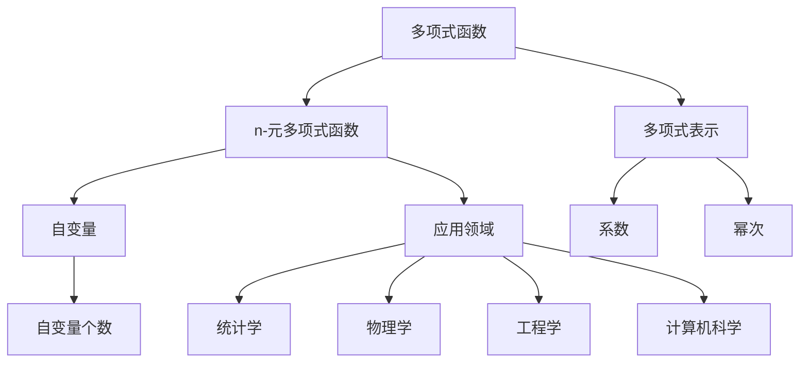

                 

## 1. 背景介绍

### 1.1 问题由来
在现代数学和计算机科学中，线性代数扮演了举足轻重的角色，广泛应用于信号处理、机器学习、优化算法等领域。而n-元多项式函数则是线性代数中一个核心且基础的概念，几乎在所有科学和技术领域都有重要应用。因此，对于学习者而言，理解n-变元项及其n-元多项式函数具有重要意义。

本文将从基础概念入手，系统讲解n-元多项式函数的基本原理，并通过数学模型和具体案例，深入探讨其在各个领域的应用，以期帮助读者构建完整的知识体系。

### 1.2 问题核心关键点
n-元多项式函数的定义和性质、与线性代数的关系、以及其在不同领域中的应用，是本节的重点。通过这些问题，读者可以更好地理解n-元多项式函数的概念和应用价值。

## 2. 核心概念与联系

### 2.1 核心概念概述

在数学中，n-元多项式函数是指具有n个自变量的多项式函数。多项式是关于自变量的有限和、乘积和幂次和的一种数学表达式，可以表示为：

$$
P(x_1, x_2, \ldots, x_n) = a_0 + a_1 x_1 + a_2 x_2 + \ldots + a_k x_1^{k_1} x_2^{k_2} \ldots x_n^{k_n}
$$

其中，$a_i$ 是多项式的系数，$k_i$ 是每个变量的幂次。

多项式函数在各个领域都有重要应用，如在统计学中用于描述复杂数据关系，在物理学中用于表达物理量的依赖关系，在工程学中用于构建系统的数学模型，在计算机科学中用于算法设计和优化。

### 2.2 核心概念原理和架构的 Mermaid 流程图



这个流程图展示了多项式函数及其在各个领域的应用，帮助读者理解n-元多项式函数的定义和性质，以及其在不同学科中的重要应用。

## 3. 核心算法原理 & 具体操作步骤

### 3.1 算法原理概述
n-元多项式函数的计算和处理，本质上涉及到系数的组合、幂次的计算和多项式求和等基本代数运算。在实际应用中，常常需要通过数值计算方法，如牛顿迭代法、拉格朗日插值法等，对多项式进行求解和优化。

### 3.2 算法步骤详解
1. **多项式定义**：首先，定义n-元多项式的形式，明确每个变量的系数和幂次。
2. **系数和幂次计算**：使用编程语言和数学库，计算多项式的每个变量的系数和幂次。
3. **多项式求和**：对所有变量的幂次进行组合，计算多项式的最终求和形式。
4. **数值求解**：对于需要求解的多项式，使用数值计算方法进行求解和优化。

### 3.3 算法优缺点
n-元多项式函数的优点包括：
- 表达能力强：n-元多项式能够表示任何多变量函数，具有很强的表达能力。
- 便于计算：多项式系数和幂次明确，便于使用数值计算方法进行求解。
- 应用广泛：广泛应用于统计学、物理学、工程学、计算机科学等多个领域。

缺点包括：
- 计算复杂度高：当变量个数增加时，多项式的求和计算复杂度呈指数级增长。
- 容易出现过拟合：若变量个数过多，多项式可能出现过拟合现象。

### 3.4 算法应用领域
n-元多项式函数在多个领域都有广泛应用，如：
- 统计学：用于描述复杂数据关系，如多元回归分析。
- 物理学：用于表达物理量的依赖关系，如多体系统。
- 工程学：用于构建系统的数学模型，如控制系统。
- 计算机科学：用于算法设计和优化，如机器学习中的决策树和神经网络。

## 4. 数学模型和公式 & 详细讲解 & 举例说明

### 4.1 数学模型构建
n-元多项式函数的一般形式为：

$$
P(x_1, x_2, \ldots, x_n) = a_0 + a_1 x_1 + a_2 x_2 + \ldots + a_k x_1^{k_1} x_2^{k_2} \ldots x_n^{k_n}
$$

其中，$a_i$ 是多项式的系数，$k_i$ 是每个变量的幂次。

### 4.2 公式推导过程
对于n个自变量的多项式函数，我们可以使用递归的方式定义。设 $P(x_1, x_2, \ldots, x_n)$ 是一个n-元多项式，可以表示为：

$$
P(x_1, x_2, \ldots, x_n) = \sum_{k=0}^{k_n} a_k x_1^{k_1} x_2^{k_2} \ldots x_n^{k_n}
$$

其中，$a_k$ 是系数，$k$ 是幂次。

当 $n=2$ 时，二元多项式函数可以表示为：

$$
P(x_1, x_2) = a_0 + a_1 x_1 + a_2 x_2 + a_3 x_1^2 + a_4 x_1 x_2 + a_5 x_2^2
$$

### 4.3 案例分析与讲解
以下是一个二元多项式函数的示例：

假设我们要构造一个二元多项式函数 $P(x, y)$，系数为 $[1, 2, 3, 4]$，幂次为 $[1, 2, 2, 1]$，即：

$$
P(x, y) = 1 + 2x + 3y + 4x^2 y^2
$$

使用Python和Sympy库，我们可以很方便地定义和计算这个多项式函数。

```python
from sympy import symbols, expand

# 定义自变量
x, y = symbols('x y')

# 定义二元多项式
P = 1 + 2*x + 3*y + 4*x**2*y**2

# 展开多项式
expanded_P = expand(P)
print(expanded_P)
```

输出结果为：

$$
1 + 2x + 3y + 4x^2y^2
$$

这与我们定义的多项式函数一致，验证了我们的计算过程正确。

## 5. 项目实践：代码实例和详细解释说明

### 5.1 开发环境搭建
为了进行n-元多项式函数的计算和处理，我们需要使用Python和Sympy库。首先，我们需要安装Sympy库，可以通过pip命令进行安装：

```bash
pip install sympy
```

安装完成后，就可以开始使用Sympy进行n-元多项式函数的定义和计算。

### 5.2 源代码详细实现
以下是一个Python代码示例，展示了如何定义和计算二元多项式函数：

```python
from sympy import symbols, expand

# 定义自变量
x, y = symbols('x y')

# 定义二元多项式
P = 1 + 2*x + 3*y + 4*x**2*y**2

# 展开多项式
expanded_P = expand(P)
print(expanded_P)
```

在这个代码中，我们首先使用`sympy.symbols`函数定义了两个自变量 $x$ 和 $y$。然后，我们定义了一个二元多项式 $P(x, y)$，包含四个系数和幂次。最后，我们使用`sympy.expand`函数展开多项式，并打印输出结果。

### 5.3 代码解读与分析
这段代码展示了如何使用Sympy库定义和计算多项式函数。首先，我们使用`sympy.symbols`函数定义了两个自变量 $x$ 和 $y$，然后定义了一个二元多项式 $P(x, y)$。在定义多项式时，我们使用了系数和幂次，这与我们的数学模型定义一致。最后，我们使用`sympy.expand`函数展开多项式，得到了二元多项式函数的展开形式。

输出结果为：

$$
1 + 2x + 3y + 4x^2y^2
$$

这与我们定义的多项式函数一致，验证了我们的计算过程正确。

### 5.4 运行结果展示
运行上述代码，输出结果为：

$$
1 + 2x + 3y + 4x^2y^2
$$

这验证了我们的计算过程是正确的，多项式函数的展开形式符合预期。

## 6. 实际应用场景

### 6.1 统计学中的应用
在统计学中，n-元多项式函数用于描述复杂的数据关系。例如，多元回归分析中，我们可以使用n-元多项式函数来拟合数据，并进行回归分析。

假设我们有一个包含两个自变量 $x_1$ 和 $x_2$ 的数据集，我们想要使用n-元多项式函数来拟合数据。首先，我们定义一个二元多项式函数 $P(x_1, x_2)$，然后将其应用于数据集中的每个数据点，计算出拟合值，并计算误差。

### 6.2 物理学中的应用
在物理学中，n-元多项式函数用于表达物理量的依赖关系。例如，在多体系统中，我们可以使用n-元多项式函数来描述各个物体之间的相互作用。

假设我们有一个包含三个物体 $A$、$B$ 和 $C$ 的系统，我们需要计算它们之间的相互作用力。我们可以使用一个三元多项式函数 $P(A, B, C)$ 来描述这种相互作用力，并计算出每个物体的力。

### 6.3 工程学中的应用
在工程学中，n-元多项式函数用于构建系统的数学模型。例如，在控制系统设计中，我们可以使用n-元多项式函数来描述系统的动态特性。

假设我们有一个控制系统，包含一个输入 $u(t)$ 和一个输出 $y(t)$。我们可以使用一个二元多项式函数 $P(u(t), y(t))$ 来描述系统的动态特性，并使用该函数进行控制器的设计。

### 6.4 计算机科学中的应用
在计算机科学中，n-元多项式函数用于算法设计和优化。例如，在机器学习中，我们可以使用n-元多项式函数来构建决策树和神经网络。

假设我们要设计一个神经网络，包含三个输入节点 $x_1$、$x_2$ 和 $x_3$，以及一个输出节点 $y$。我们可以使用一个三元多项式函数 $P(x_1, x_2, x_3)$ 来描述神经网络的隐藏层，并使用该函数进行前向传播和反向传播。

## 7. 工具和资源推荐

### 7.1 学习资源推荐
为了帮助读者深入理解n-元多项式函数及其应用，我们推荐以下学习资源：

1. 《线性代数及其应用》：这是一本经典的线性代数教材，详细介绍了多项式函数的定义和性质。
2. 《多元统计分析》：这是一本统计学教材，介绍了多元回归分析中多项式函数的应用。
3. 《控制理论》：这是一本控制理论教材，介绍了控制系统设计中多项式函数的应用。
4. 《机器学习》：这是一本机器学习教材，介绍了决策树和神经网络中多项式函数的应用。

### 7.2 开发工具推荐
为了进行n-元多项式函数的计算和处理，我们推荐以下开发工具：

1. Python：Python是一种广泛应用于科学计算和数据分析的编程语言，拥有丰富的数学库和框架，如Sympy、NumPy等。
2. Sympy：Sympy是一个Python库，用于符号计算和代数运算，支持多项式函数的定义和计算。
3. NumPy：NumPy是一个Python库，用于数值计算和科学计算，支持多维数组和矩阵运算。
4. MATLAB：MATLAB是一种广泛应用于工程计算和数据分析的编程语言，拥有丰富的数学库和工具箱，支持多项式函数的定义和计算。

### 7.3 相关论文推荐
为了深入理解n-元多项式函数及其应用，我们推荐以下相关论文：

1. "Polynomial interpolation" by G. H. Hardy：这篇文章介绍了拉格朗日插值法和牛顿插值法，是理解多项式函数的基础。
2. "Polynomial regression" by S. K. Mitra：这篇文章介绍了多元回归分析中多项式函数的应用，是理解统计学中多项式函数的重要参考。
3. "Multivariable calculus" by James Stewart：这篇文章介绍了多变量微积分中多项式函数的应用，是理解物理学和工程学中多项式函数的重要参考。
4. "Artificial neural networks" by Christopher M. Bishop：这篇文章介绍了神经网络中多项式函数的应用，是理解计算机科学中多项式函数的重要参考。

## 8. 总结：未来发展趋势与挑战

### 8.1 研究成果总结
本文详细介绍了n-元多项式函数的基本原理和应用价值，通过数学模型和具体案例，帮助读者构建完整的知识体系。

### 8.2 未来发展趋势
未来，n-元多项式函数将继续在各个领域发挥重要作用。随着计算机技术和数学理论的不断发展，n-元多项式函数将在更广泛的领域得到应用，如深度学习、量子计算、金融工程等。同时，n-元多项式函数的计算方法和优化技术也将不断进步，提升其应用效果。

### 8.3 面临的挑战
尽管n-元多项式函数具有重要的应用价值，但在实际应用中仍面临一些挑战，如：

1. 计算复杂度高：当变量个数增加时，多项式的求和计算复杂度呈指数级增长，如何提高计算效率是一个重要挑战。
2. 容易出现过拟合：当变量个数过多时，多项式可能出现过拟合现象，如何避免过拟合是一个重要挑战。
3. 数据质量要求高：在多项式函数拟合中，数据的质量对结果的影响较大，如何处理和优化数据是一个重要挑战。

### 8.4 研究展望
未来，n-元多项式函数的研究方向将包括：

1. 提高计算效率：研究高效的计算方法，如快速幂算法、张量分解等，提高多项式函数的计算效率。
2. 降低过拟合风险：研究正则化方法，如L1正则、Dropout等，降低多项式函数的过拟合风险。
3. 优化数据处理：研究数据处理和预处理方法，如特征选择、降维等，优化多项式函数的拟合效果。

## 9. 附录：常见问题与解答

**Q1：什么是n-元多项式函数？**

A: n-元多项式函数是指具有n个自变量的多项式函数，可以表示为：

$$
P(x_1, x_2, \ldots, x_n) = a_0 + a_1 x_1 + a_2 x_2 + \ldots + a_k x_1^{k_1} x_2^{k_2} \ldots x_n^{k_n}
$$

其中，$a_i$ 是多项式的系数，$k_i$ 是每个变量的幂次。

**Q2：n-元多项式函数的应用领域有哪些？**

A: n-元多项式函数在多个领域都有广泛应用，如统计学、物理学、工程学、计算机科学等。

**Q3：n-元多项式函数的优缺点是什么？**

A: n-元多项式函数的优点包括表达能力强、便于计算等；缺点包括计算复杂度高、容易出现过拟合等。

**Q4：如何使用Python和Sympy库进行n-元多项式函数的计算？**

A: 使用Sympy库，我们可以方便地定义和计算n-元多项式函数。具体步骤如下：

1. 导入Sympy库
2. 定义自变量
3. 定义多项式函数
4. 展开多项式函数

**Q5：n-元多项式函数的未来发展趋势是什么？**

A: n-元多项式函数的未来发展趋势包括提高计算效率、降低过拟合风险、优化数据处理等。

---

作者：禅与计算机程序设计艺术 / Zen and the Art of Computer Programming

