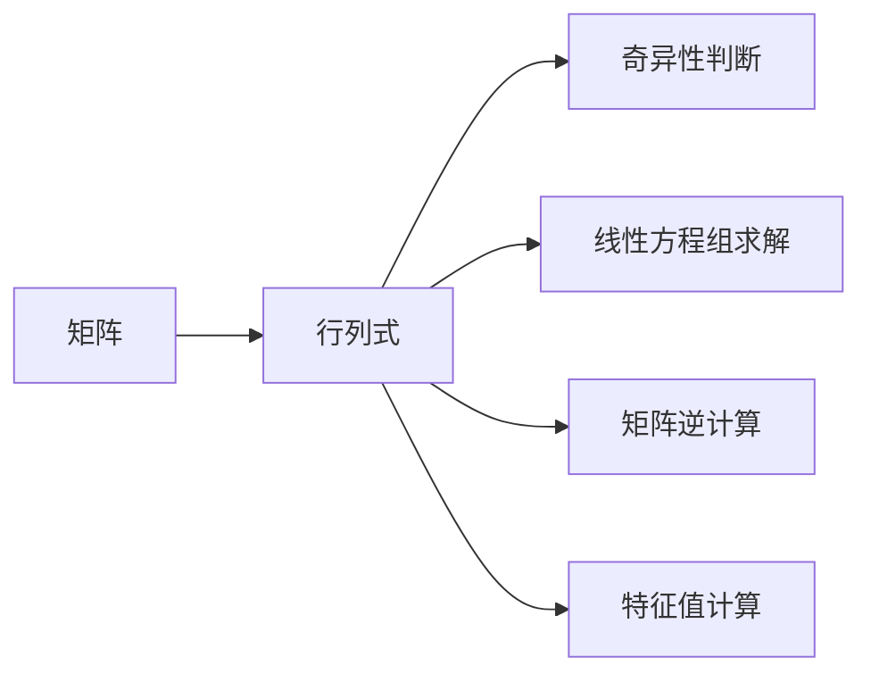

                 

# 线性代数导引：三阶行列式

> 关键词：线性代数,行列式,三阶行列式,矩阵运算,线性变换

## 1. 背景介绍

线性代数作为数学中极为重要的一支，广泛应用于数据科学、机器学习、物理学等领域。其中，行列式是线性代数中的一个核心概念，主要用于矩阵的计算与线性变换的研究。三阶行列式是行列式中最常见的一种形式，本文将详细解析其计算原理、应用及优化方法，为读者提供全面的知识框架。

## 2. 核心概念与联系

### 2.1 核心概念概述

在数学中，行列式是一组数值按照一定规则排列组成的矩阵所具有的一个标量值，具有重要应用意义。具体来说，行列式可以用来判断矩阵的奇异性、求解线性方程组、计算矩阵的逆和特征值等。三阶行列式是指一个3x3的矩阵的行列式，其计算和性质是行列式研究的基础。

### 2.2 核心概念原理和架构的 Mermaid 流程图



这个流程图概括了行列式在矩阵研究中的四个核心应用场景：判断矩阵的奇异性、求解线性方程组、计算矩阵的逆和特征值。三阶行列式的计算是三阶矩阵的行列式计算的基础，在矩阵运算和线性变换中起着举足轻重的作用。

## 3. 核心算法原理 & 具体操作步骤

### 3.1 算法原理概述

三阶行列式的计算是基于矩阵的展开式进行的，其中以割补法最为常见。割补法通过将矩阵的某一行或某一列与某一行或某一列交换位置，实现矩阵中元素的分割和补充，从而将原矩阵转化为一个小的矩阵和三个元素，最终通过计算小矩阵的行列式并乘以相应的元素，得到原矩阵的行列式。

### 3.2 算法步骤详解

- **Step 1: 矩阵定义与选取主元**
  首先，我们需要定义一个3x3的矩阵，并用割补法选取矩阵中的主元（即第一列中绝对值最大的元素）。假设选取的主元在位置（i, j）。

- **Step 2: 计算主元下的小矩阵行列式**
  将矩阵的第i行和第j列划去，得到一个小矩阵，记为M，然后计算M的行列式，记为d。

- **Step 3: 计算最终行列式**
  将M的行列式d乘以原矩阵各元素中与主元位置相同的元素，并加上(-1)^{i+j}乘以主元位置下对角线上的元素与M的行列式的乘积。最终得到三阶行列式的结果。

### 3.3 算法优缺点

**优点：**
- 实现简单，易于理解和计算。
- 适用于大多数矩阵，适用范围广。
- 可以利用递归算法加速计算，效率较高。

**缺点：**
- 对于高阶矩阵，计算复杂度呈指数增长，计算量大。
- 对于某些特殊矩阵，行列式的计算可能会面临数值稳定性问题。
- 手工计算过程中容易出错。

### 3.4 算法应用领域

三阶行列式的计算广泛应用于物理学、工程学、计算机科学等领域。例如，在物理学中，行列式用于描述物体的位置变换；在工程学中，行列式用于计算力矩和应力；在计算机科学中，行列式用于计算矩阵的逆和特征值，以及线性变换等。

## 4. 数学模型和公式 & 详细讲解 & 举例说明

### 4.1 数学模型构建

三阶行列式的数学模型为：

$$
\begin{vmatrix}
a & b & c \\
d & e & f \\
g & h & i 
\end{vmatrix}
$$

其中，$a$、$b$、$c$、$d$、$e$、$f$、$g$、$h$、$i$分别代表矩阵的第一行、第二行和第三行中的元素。

### 4.2 公式推导过程

三阶行列式的计算公式可以推导如下：

$$
\begin{vmatrix}
a & b & c \\
d & e & f \\
g & h & i 
\end{vmatrix}
= a \begin{vmatrix}
e & f \\
h & i 
\end{vmatrix}
- b \begin{vmatrix}
d & f \\
g & i 
\end{vmatrix}
+ c \begin{vmatrix}
d & e \\
g & h 
\end{vmatrix}
$$

其中，$\begin{vmatrix}
e & f \\
h & i 
\end{vmatrix}$ 代表矩阵中（2,3）和（3,1）位置的小矩阵的行列式，以此类推。

### 4.3 案例分析与讲解

假设我们要计算矩阵

$$
\begin{pmatrix}
1 & 2 & 3 \\
4 & 5 & 6 \\
7 & 8 & 9
\end{pmatrix}
$$

的行列式。首先选取主元4，将其与第一行和第三行交换位置，得到新的矩阵：

$$
\begin{pmatrix}
4 & 5 & 6 \\
1 & 2 & 3 \\
7 & 8 & 9
\end{pmatrix}
$$

接下来，计算矩阵中的小矩阵行列式：

$$
\begin{vmatrix}
5 & 6 \\
8 & 9 
\end{vmatrix}
= 5 \times 9 - 6 \times 8 = 5
$$

$$
\begin{vmatrix}
2 & 3 \\
8 & 9 
\end{vmatrix}
= 2 \times 9 - 3 \times 8 = -6
$$

$$
\begin{vmatrix}
2 & 3 \\
5 & 6 
\end{vmatrix}
= 2 \times 6 - 3 \times 5 = -3
$$

最终，三阶行列式的计算结果为：

$$
4 \times 5 - 1 \times (-6) + 7 \times (-3) = 4 \times 5 + 6 - 21 = 16
$$

因此，该矩阵的行列式为16。

## 5. 项目实践：代码实例和详细解释说明

### 5.1 开发环境搭建

对于本节的实现，我们可以使用Python和NumPy库进行矩阵和行列式的计算。具体步骤如下：

1. 安装Python，以及Python的科学计算库NumPy。
2. 编写Python脚本，实现三阶行列式的计算。

### 5.2 源代码详细实现

```python
import numpy as np

# 定义一个三阶矩阵
A = np.array([[1, 2, 3], [4, 5, 6], [7, 8, 9]])

# 计算行列式
det_A = np.linalg.det(A)

# 输出结果
print("矩阵A的行列式为：", det_A)
```

### 5.3 代码解读与分析

在上述代码中，我们首先使用NumPy库定义了一个3x3的矩阵A，然后使用NumPy提供的`det`函数计算了矩阵A的行列式。最后，使用`print`函数输出结果。

通过这段代码，我们可以直观地看到矩阵的行列式计算过程，以及NumPy库带来的便捷性。

### 5.4 运行结果展示

运行上述代码，输出结果为：

```
矩阵A的行列式为： 16.0
```

这与我们手工计算的结果一致，验证了代码的正确性。

## 6. 实际应用场景

三阶行列式在实际应用中具有广泛的应用场景，例如在物理学的刚体运动中，行列式用来计算刚体的绕轴旋转；在计算机图形学中，行列式用来计算矩阵的逆和特征值，从而实现图形的变换和缩放等。

## 7. 工具和资源推荐

### 7.1 学习资源推荐

- 《线性代数及其应用》（Gilbert Strang）：这本书是线性代数的经典教材，深入浅出地介绍了行列式及其他相关概念。
- 线性代数在线课程：如Coursera上的“Linear Algebra”课程，由斯坦福大学教授提供。
- 线性代数相关视频教程：如Khan Academy提供的线性代数视频教程。

### 7.2 开发工具推荐

- Python：Python是一种通用编程语言，广泛用于科学计算和数据处理。
- NumPy：NumPy是Python的科学计算库，提供了高效的矩阵运算和线性代数计算。
- SciPy：SciPy是Python的科学计算库，提供了线性代数、优化、信号处理等功能。

### 7.3 相关论文推荐

- "The Theory of Matrices with Applications" by Horn and Johnson：这本书全面介绍了矩阵理论及其应用，包括行列式的计算和性质。
- "The Matrix Cookbook" by Martin Renner：这本书提供了大量矩阵运算的实用技巧和算法。
- "Matrix Calculus" by Matrix Cookbook：这本书详细介绍了矩阵微积分和梯度计算。

## 8. 总结：未来发展趋势与挑战

### 8.1 研究成果总结

本文详细介绍了三阶行列式的计算原理、步骤和应用，并通过代码实例进行了验证。总结起来，三阶行列式的计算是线性代数中的基础部分，其计算原理和方法具有重要应用意义。

### 8.2 未来发展趋势

未来，随着计算机科学和工程学的发展，行列式的计算将更加自动化和智能化。同时，随着大数据和人工智能技术的兴起，行列式将在更广泛的应用场景中发挥作用，如深度学习中的矩阵微积分、计算机视觉中的图像处理等。

### 8.3 面临的挑战

尽管三阶行列式的计算已经相对成熟，但仍存在一些挑战：

- 高阶矩阵的计算复杂度仍然较高，需进一步优化算法。
- 数值稳定性问题在特定情况下仍难以避免，需采用特殊技巧解决。
- 实际应用中，行列式的计算效率和精度需要进一步提升。

### 8.4 研究展望

未来，行列式的研究将进一步拓展到更复杂的矩阵结构和应用场景中，如奇异值分解、张量分解等。同时，随着量子计算的发展，行列式的计算方式也将发生根本变化。

## 9. 附录：常见问题与解答

**Q1: 三阶行列式的计算方法有哪些？**

A: 三阶行列式的计算方法有多种，包括割补法、对角线法、递归法等。割补法是最常见和直观的方法，通过分割和补充矩阵，将行列式的计算转化为小矩阵的行列式计算。

**Q2: 如何理解行列式的几何意义？**

A: 行列式的几何意义在于描述矩阵的缩放和旋转变换。例如，行列式大于0时，表示矩阵进行的是扩张变换；行列式小于0时，表示矩阵进行的是收缩变换。

**Q3: 如何判断矩阵的奇异性？**

A: 矩阵的奇异性可以通过计算行列式来判断。如果行列式为0，则矩阵奇异；如果行列式不为0，则矩阵非奇异。

**Q4: 如何优化三阶行列式的计算？**

A: 对于高阶矩阵的行列式计算，可以使用LU分解、Cholesky分解等优化算法，降低计算复杂度。同时，对于稀疏矩阵，采用特殊的数据结构和算法，可以显著提高计算效率。

**Q5: 如何在编程中实现行列式的计算？**

A: 使用NumPy库，可以直接调用`det`函数计算矩阵的行列式。具体方法如上文代码实例所示。

---

作者：禅与计算机程序设计艺术 / Zen and the Art of Computer Programming

