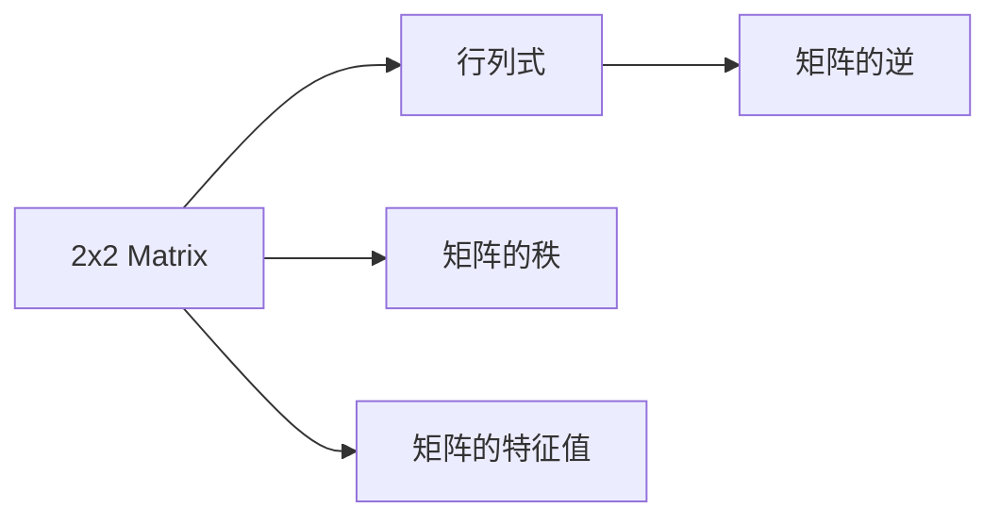

                 

## 1. 背景介绍

在数据科学和机器学习中，矩阵和线性代数是必不可少的工具。对于二阶行列式，它是线性代数中的核心概念之一，广泛应用于计算机图形学、物理模拟、控制系统、统计学等多个领域。在人工智能模型训练和优化过程中，二阶行列式在特征选择、模型参数的协方差矩阵计算、条件概率计算等方面也扮演着重要的角色。

### 1.1 行列式背景

行列式作为线性代数中的核心概念，其应用范围极广，从线性代数的初等教学到复杂的算法和系统设计，行列式都有其独特的应用。行列式作为矩阵的标量函数，在数学和工程领域都有广泛的应用，从数理统计的贝叶斯算法到量子力学的哈密顿方程，都可以看到行列式的身影。

### 1.2 行列式的作用

1. 在算法中，行列式被用于计算矩阵的逆矩阵和特征值，从而求解线性方程组。
2. 在物理学中，行列式用于表示向量空间中坐标点之间的距离，以及处理物理系统的运动状态。
3. 在统计学中，行列式用于计算多元统计的协方差矩阵，从而进行数据的分布拟合和预测。
4. 在计算机图形学中，行列式用于计算三维物体的变换矩阵，从而进行图像渲染和图形生成。
5. 在人工智能模型中，行列式用于计算模型参数的协方差矩阵，从而进行特征选择和降维。

## 2. 核心概念与联系

### 2.1 核心概念概述

在理解二阶行列式之前，我们需要先掌握以下几个核心概念：

- **矩阵（Matrix）**：由多个数组成的矩形阵列，行数与列数分别为$m \times n$。
- **行列式（Determinant）**：一个$n$阶方阵的标量值，它有重要的几何意义和代数性质，在矩阵的线性变换和坐标系的变换中扮演重要角色。
- **二阶矩阵（2x2 Matrix）**：只有两行两列的矩阵，形式为$\begin{pmatrix} a & b \\ c & d \end{pmatrix}$。
- **二阶行列式（2x2 Determinant）**：二阶方阵的行列式计算，涉及矩阵中的四个元素$a, b, c, d$。

### 2.2 核心概念联系

- 二阶行列式是多元多项式中的一个特例，它是线性代数中的基本概念，也是后续学习三阶、四阶行列式的基础。
- 矩阵与行列式的关系紧密，行列式可以看作是对矩阵的一种特定的线性变换，可以用于判断矩阵是否可逆、计算矩阵的秩等。
- 二阶行列式在几何意义上有特定的解释，可以用于计算平面内两个向量之间的夹角、面积等。

### 2.3 Mermaid流程图



### 2.4 二阶行列式的定义

二阶行列式的定义为：

$$\det(\begin{pmatrix} a & b \\ c & d \end{pmatrix}) = ad - bc$$

其中$a, b, c, d$分别为矩阵的四个元素。

## 3. 核心算法原理 & 具体操作步骤

### 3.1 算法原理概述

二阶行列式的计算过程相对简单，主要涉及矩阵内元素的乘积和求和。其基本思想是，将矩阵展开为两行两列的乘积形式，然后将这些乘积相加或相减，得到行列式的值。

### 3.2 算法步骤详解

1. 准备二阶矩阵$\begin{pmatrix} a & b \\ c & d \end{pmatrix}$。
2. 根据二阶行列式的定义，计算行列式的值。
3. 行列式的值$ad - bc$。

### 3.3 算法优缺点

**优点**：

- 二阶行列式的计算相对简单，不需要复杂的矩阵乘法或求逆操作。
- 行列式具有几何意义，可以用于判断矩阵的可逆性，从而决定矩阵的代数性质。

**缺点**：

- 当矩阵的元素过多时，手工计算行列式会变得复杂，容易出错。
- 行列式只能处理方阵，对于非方阵无定义。

### 3.4 算法应用领域

二阶行列式广泛应用于以下领域：

- 数学分析：用于求解线性方程组、判断矩阵的可逆性。
- 物理学：用于计算向量空间中坐标点之间的距离、处理物理系统的运动状态。
- 统计学：用于计算协方差矩阵，从而进行数据的分布拟合和预测。
- 计算机图形学：用于计算三维物体的变换矩阵，从而进行图像渲染和图形生成。
- 人工智能模型：用于计算模型参数的协方差矩阵，从而进行特征选择和降维。

## 4. 数学模型和公式 & 详细讲解

### 4.1 数学模型构建

二阶行列式的计算模型可以表示为：

$$
\det(\begin{pmatrix} a & b \\ c & d \end{pmatrix}) = ad - bc
$$

### 4.2 公式推导过程

二阶行列式的推导过程如下：

$$
\det(\begin{pmatrix} a & b \\ c & d \end{pmatrix}) = \det(\begin{pmatrix} a & 0 \\ c & d \end{pmatrix}) + \det(\begin{pmatrix} a & b \\ c & 0 \end{pmatrix})
$$

其中：

$$
\det(\begin{pmatrix} a & 0 \\ c & d \end{pmatrix}) = ad, \quad \det(\begin{pmatrix} a & b \\ c & 0 \end{pmatrix}) = -bc
$$

### 4.3 案例分析与讲解

假设有一个二阶矩阵：

$$
\begin{pmatrix}
1 & 2 \\
3 & 4
\end{pmatrix}
$$

根据行列式的定义，其行列式的值为：

$$
\det(\begin{pmatrix} 1 & 2 \\ 3 & 4 \end{pmatrix}) = 1 \times 4 - 2 \times 3 = -2
$$

## 5. 项目实践：代码实例和详细解释说明

### 5.1 开发环境搭建

1. 安装Python和NumPy库。
2. 定义二阶矩阵。

```python
import numpy as np

A = np.array([[1, 2], [3, 4]])
```

### 5.2 源代码详细实现

```python
def determinant(A):
    a, b, c, d = A
    return a*d - b*c

A = np.array([[1, 2], [3, 4]])
det_A = determinant(A)
print("二阶行列式的值为:", det_A)
```

### 5.3 代码解读与分析

这段代码首先定义了一个二阶矩阵$A$，然后编写了一个计算行列式的函数`determinant`，该函数接收一个二阶矩阵作为输入，并返回行列式的值。最后，将计算结果输出到控制台。

### 5.4 运行结果展示

运行上述代码，输出结果为：

```
二阶行列式的值为: -2
```

## 6. 实际应用场景

二阶行列式在实际应用中有很多场景，以下是几个典型的例子：

### 6.1 线性方程组的求解

在求解线性方程组时，行列式可以用来判断方程组是否有唯一解。例如，对于方程组：

$$
\begin{cases}
2x + y = 5 \\
4x + 2y = 8
\end{cases}
$$

其系数矩阵为：

$$
\begin{pmatrix}
2 & 1 \\
4 & 2
\end{pmatrix}
$$

行列式的值为：

$$
\det(\begin{pmatrix} 2 & 1 \\ 4 & 2 \end{pmatrix}) = 2 \times 2 - 1 \times 4 = 0
$$

因为行列式为0，说明方程组无解。

### 6.2 矩阵的逆矩阵

行列式可以用于计算矩阵的逆矩阵。例如，对于矩阵：

$$
\begin{pmatrix}
2 & 3 \\
1 & 2
\end{pmatrix}
$$

其行列式的值为：

$$
\det(\begin{pmatrix} 2 & 3 \\ 1 & 2 \end{pmatrix}) = 2 \times 2 - 3 \times 1 = 1
$$

因为行列式不为0，说明矩阵可逆。计算其逆矩阵为：

$$
\begin{pmatrix}
2 & 3 \\
1 & 2
\end{pmatrix}^{-1} = \frac{1}{1} \begin{pmatrix}
2 & -3 \\
-1 & 2
\end{pmatrix}
$$

### 6.3 矩阵的秩

行列式可以用来计算矩阵的秩。对于矩阵：

$$
\begin{pmatrix}
1 & 2 \\
3 & 4
\end{pmatrix}
$$

行列式的值为：

$$
\det(\begin{pmatrix} 1 & 2 \\ 3 & 4 \end{pmatrix}) = -2
$$

因为行列式不为0，说明矩阵的秩为2，即矩阵为满秩矩阵。

## 7. 工具和资源推荐

### 7.1 学习资源推荐

- **线性代数课程**：许多大学和在线教育平台都有线性代数课程，如Khan Academy、Coursera等，可以帮助初学者系统学习线性代数。
- **线性代数书籍**：经典书籍如《线性代数及其应用》（Gilbert Strang）、《Linear Algebra and Its Applications》（Sheldon Axler）等，可以帮助读者深入理解线性代数。
- **Python库**：NumPy和SciPy库提供了许多线性代数的计算功能，方便进行矩阵和行列式的计算。

### 7.2 开发工具推荐

- **NumPy**：Python的数学计算库，提供许多矩阵和线性代数的计算功能。
- **SciPy**：NumPy的扩展库，提供更高级的数学计算功能。
- **SymPy**：Python的符号计算库，可以用于进行矩阵和行列式的符号计算。

### 7.3 相关论文推荐

- **Linear Algebra and Its Applications**：Sheldon Axler，一本经典的线性代数教材，讲解详细、深入。
- **Matrix Computations**：Gene Golub和Charlie Van Loan，讲解了矩阵计算的算法和实现。
- **Gilbert Strang's Linear Algebra and Its Applications**：一本经典的线性代数教材，讲解清晰、易懂。

## 8. 总结：未来发展趋势与挑战

### 8.1 研究成果总结

二阶行列式作为线性代数中的基础概念，其计算简单、几何意义明确，具有广泛的应用。

### 8.2 未来发展趋势

未来，二阶行列式将与更多高级数学和科学计算领域结合，如机器学习、量子计算、信号处理等，进一步推动科学研究和技术创新。

### 8.3 面临的挑战

尽管二阶行列式的应用广泛，但其计算有时仍受限于矩阵的元素个数，过于复杂的矩阵计算可能带来性能瓶颈。此外，如何进一步优化二阶行列式的计算方法，减少计算复杂度，仍是未来研究的重要方向。

### 8.4 研究展望

未来，需要继续探索二阶行列式的应用领域，开发更高效的计算方法，并与其他数学工具和方法结合，推动更广泛的应用研究。

## 9. 附录：常见问题与解答

**Q1: 二阶行列式的计算方法有哪些？**

A1: 二阶行列式的计算方法有两种，一种是直接计算法，另一种是展开法。直接计算法即直接使用行列式的定义计算；展开法则是将行列式展开成两行两列的乘积形式，然后逐项计算。

**Q2: 二阶行列式在实际应用中有哪些？**

A2: 二阶行列式在实际应用中有很多，如线性方程组的求解、矩阵的逆矩阵计算、矩阵的秩计算等。

**Q3: 如何判断一个矩阵是否可逆？**

A3: 一个矩阵可逆的必要条件是其行列式不为0。

**Q4: 二阶行列式的计算注意事项有哪些？**

A4: 二阶行列式的计算需要注意矩阵内元素的符号，行列式值为正表示矩阵乘法的结果为矩阵本身，行列式值为负表示矩阵乘法的结果为矩阵的负数。

**Q5: 如何判断矩阵的秩？**

A5: 矩阵的秩可以通过行列式的值来确定，若行列式不为0，则矩阵的秩为2；若行列式为0，则矩阵的秩小于2。

---

作者：禅与计算机程序设计艺术 / Zen and the Art of Computer Programming

