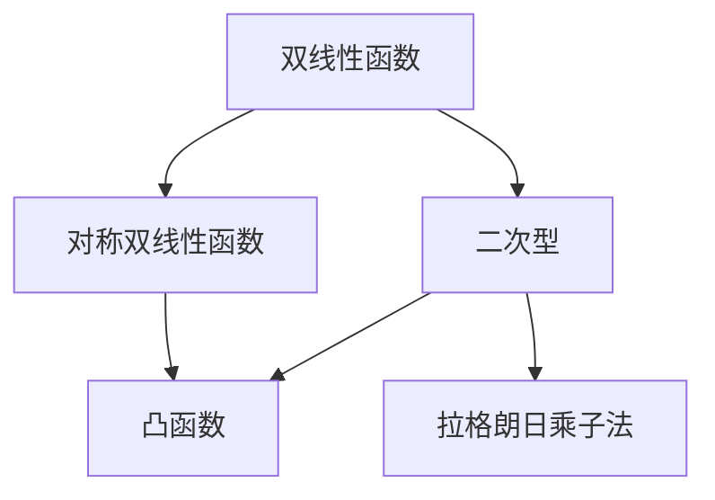

                 

# 线性代数导引：对称双线性函数与二次型

## 1. 背景介绍

### 1.1 问题由来
线性代数是数学与计算机科学的重要分支，广泛应用于数据科学、机器学习、物理学、工程学等众多领域。在现代数学中，线性代数的定义已超出初等几何中的向量与矩阵的范畴，涉及更抽象的线性映射、双线性函数与二次型等概念。本文将深入探讨对称双线性函数与二次型的理论基础与实用技巧，帮助读者理解并应用这些基本概念。

### 1.2 问题核心关键点
对称双线性函数与二次型是线性代数中非常重要的概念。对称双线性函数描述了向量间的双线性关系，而二次型则是以对称双线性函数为基础定义的具有二阶光滑性的函数。这些概念在数据分析、优化理论、机器学习算法设计中具有重要作用，尤其与矩阵分析、凸优化等深度学习工具息息相关。理解这些概念，有助于读者在数学、算法与工程实践中更好地应用与创新。

## 2. 核心概念与联系

### 2.1 核心概念概述

为更好地理解对称双线性函数与二次型，本节将介绍几个密切相关的核心概念：

- 双线性函数(Bilinear Form)：指一个接受两个向量作为输入并输出实数标量的函数。形式上可表示为 $f: V \times W \to \mathbb{R}$，其中 $V$ 和 $W$ 是实向量空间。
- 对称双线性函数(Symmetric Bilinear Form)：双线性函数满足交换律 $f(x,y) = f(y,x)$，即对于任意的向量 $x,y$，函数值不因输入向量顺序而变化。
- 二次型(Quadratic Form)：是一个特殊的对称双线性函数，其形式可表示为 $q(x) = x^T A x$，其中 $A$ 是实对称矩阵，$x$ 是向量。
- 凸函数(Convex Function)：如果一个函数的二阶导数大于等于零，那么该函数是凸函数。在数学优化中，凸函数具有重要的应用价值。
- 拉格朗日乘子法(Lagrange Multipliers)：一种求解约束条件下的优化问题的算法，通过引入拉格朗日乘子，将约束条件转化为新的优化目标。

这些核心概念之间的逻辑关系可以通过以下Mermaid流程图来展示：



这个流程图展示了大语言模型的核心概念及其之间的关系：

1. 双线性函数是所有对称双线性函数与二次型的基础。
2. 对称双线性函数要求函数值交换输入向量顺序后不变。
3. 二次型是特殊形式的对称双线性函数，具有二阶光滑性。
4. 凸函数以二次型为基础，具有重要的优化价值。
5. 拉格朗日乘子法基于二次型，用于求解约束下的优化问题。

这些概念共同构成了线性代数的基础理论框架，为处理更复杂的问题提供了必要的工具。

## 3. 核心算法原理 & 具体操作步骤
### 3.1 算法原理概述

对称双线性函数与二次型是线性代数中的基本工具，具有广泛的应用场景，包括线性方程组求解、特征值问题、线性回归、机器学习中的数据拟合等。其算法原理和操作步骤如下：

### 3.2 算法步骤详解

对称双线性函数与二次型的核心算法主要包括以下几个步骤：

**Step 1: 定义与表示**
- 对于一个对称双线性函数 $f(x,y) = x^T A y$，其中 $A$ 是一个实对称矩阵。
- 对于一个二次型 $q(x) = x^T A x$，其中 $A$ 是一个实对称矩阵。

**Step 2: 矩阵与向量变换**
- 对于任意向量 $x$，通过变换 $x = U v$，其中 $U$ 是一个可逆矩阵，$v$ 是 $U$ 变换后的向量。

**Step 3: 求特征值与特征向量**
- 对矩阵 $A$ 进行特征值分解，得到 $A = V D V^T$，其中 $D$ 是一个对角矩阵，$V$ 是一个可逆矩阵。

**Step 4: 矩阵优化**
- 对 $A$ 进行优化，例如通过正交化或QR分解等方法，使其更加稀疏或特定结构。

**Step 5: 二次型优化**
- 对二次型 $q(x) = x^T A x$ 进行优化，包括最小化、最大值、多项式逼近等操作。

**Step 6: 求解线性方程组**
- 将二次型问题转化为线性方程组，通过求解线性方程组来优化二次型。

**Step 7: 拉格朗日乘子法应用**
- 将约束条件与二次型目标函数结合，通过引入拉格朗日乘子，求解优化问题。

### 3.3 算法优缺点

对称双线性函数与二次型具有以下优点：
1. 简单高效。可通过矩阵与向量变换简化问题，使其转化为对角化等可解决的问题。
2. 具有广泛的适用性。在机器学习、优化理论、数据科学等领域都有广泛的应用。
3. 具有很好的数学与物理意义。二次型可以描述很多物理与数学系统中的能量函数、距离函数等。

同时，这些方法也存在一定的局限性：
1. 对数据的维度要求高。当输入向量维度较高时，问题求解复杂度增加。
2. 对数据分布要求严。二次型和凸函数往往要求数据具有平滑、可导的性质。
3. 优化问题求解难度大。当优化目标函数复杂时，求解难度增加。

尽管存在这些局限性，但就目前而言，对称双线性函数与二次型在数学与工程实践中仍然是非常有用的工具。未来相关研究的重点在于如何进一步提高算法的效率与鲁棒性，以及探索更广泛的应用领域。

### 3.4 算法应用领域

对称双线性函数与二次型在现代数学与计算机科学中具有广泛的应用，主要包括：

- 机器学习：在回归分析、分类、聚类等任务中，二次型常用于数据拟合与模型优化。
- 数据科学：在主成分分析、协方差分析等数据降维与特征提取任务中，二次型提供了强大的工具。
- 物理学：在量子力学、经典力学等物理理论中，二次型用于描述系统的能量函数与势能函数。
- 工程学：在控制理论、系统设计等工程应用中，二次型用于优化系统性能与稳定性。

除了上述这些经典应用外，对称双线性函数与二次型还被创新性地应用于更多场景中，如非线性优化、图像处理、信号处理、信号处理等，为数学与工程实践带来了新的突破。随着二次型理论的不断发展，相信其在更多领域的应用也将进一步拓展。

## 4. 数学模型和公式 & 详细讲解 & 举例说明

### 4.1 数学模型构建

对称双线性函数与二次型可以通过向量与矩阵的乘积来描述。假设 $A$ 是一个实对称矩阵，$x$ 是一个向量，则二次型可以表示为：

$$
q(x) = x^T A x
$$

其中 $x^T$ 表示向量的转置操作。

### 4.2 公式推导过程

二次型的性质可以通过矩阵的特征值与特征向量来推导。假设 $A$ 是对称矩阵，其特征值分解形式为：

$$
A = V D V^T
$$

其中 $D$ 是对角矩阵，$V$ 是可逆矩阵。对于任意向量 $x$，有：

$$
q(x) = x^T A x = x^T V D V^T x = (V^T x)^T D (V^T x)
$$

令 $y = V^T x$，则有：

$$
q(x) = y^T D y
$$

其中 $D$ 是一个对角矩阵，对角线上的元素即为 $A$ 的特征值，$y$ 是 $A$ 的特征向量 $V$ 的投影。

### 4.3 案例分析与讲解

下面以线性回归为例，说明对称双线性函数与二次型的应用。假设有一个线性模型 $y = Ax + b$，其中 $A$ 是一个未知的系数矩阵，$x$ 是自变量向量，$y$ 是因变量向量。给定一组训练数据 $(x_i, y_i)$，求解模型参数 $A$ 与 $b$ 的过程可以表示为：

$$
\min_{A,b} \sum_{i=1}^n (y_i - Ax_i - b)^2
$$

该问题可以转化为对二次型 $q(A) = ||Ax - y||^2$ 的最小化问题。由于 $A$ 是 $x$ 与 $y$ 之间的系数矩阵，因此可将其看作一个对称双线性函数。通过引入拉格朗日乘子法，可得到以下优化问题：

$$
\min_{A,b,\lambda} \frac{1}{2} ||Ax - y||^2 + \lambda ||A||_F^2
$$

其中 $||.||_F$ 表示矩阵的 Frobenius 范数，$\lambda$ 是拉格朗日乘子。该问题可转化为求解线性方程组与特征值分解问题，最终求解出系数矩阵 $A$ 与偏置向量 $b$。

## 5. 项目实践：代码实例和详细解释说明
### 5.1 开发环境搭建

在进行二次型与对称双线性函数的实现前，我们需要准备好开发环境。以下是使用Python进行Numpy开发的环境配置流程：

1. 安装Anaconda：从官网下载并安装Anaconda，用于创建独立的Python环境。

2. 创建并激活虚拟环境：
```bash
conda create -n linear-algebra-env python=3.8 
conda activate linear-algebra-env
```

3. 安装Numpy：
```bash
pip install numpy
```

4. 安装SciPy：
```bash
pip install scipy
```

5. 安装SymPy：
```bash
pip install sympy
```

完成上述步骤后，即可在`linear-algebra-env`环境中开始二次型与对称双线性函数的实现。

### 5.2 源代码详细实现

这里我们以矩阵的特征值分解为例，给出使用Numpy库实现对称双线性函数与二次型的Python代码。

```python
import numpy as np
from numpy.linalg import eigh

# 定义对称矩阵
A = np.array([[2, 1], [1, 2]])

# 特征值分解
eigenvalues, eigenvectors = eigh(A)

# 特征向量投影
x = np.array([1, 1])
y = eigenvectors.T.dot(x)
q = y.T.dot(np.diag(eigenvalues).dot(y))

print("特征值:", eigenvalues)
print("二次型:", q)
```

这段代码首先定义了一个对称矩阵 $A$，然后通过Numpy的`eigh`函数进行特征值分解。接下来，通过特征向量投影得到向量 $y$，并计算二次型 $q(y) = y^T D y$，其中 $D$ 是对角矩阵，对角线上的元素为 $A$ 的特征值。最后输出特征值与二次型结果。

### 5.3 代码解读与分析

让我们再详细解读一下关键代码的实现细节：

**eigh函数**：
- 该函数用于对实对称矩阵进行特征值分解，返回特征值和特征向量。

**特征向量投影**：
- 通过将向量 $x$ 投影到特征向量 $V$ 的张量上，得到向量 $y$。

**二次型计算**：
- 计算向量 $y$ 在矩阵 $D$ 上的投影，得到二次型 $q(y)$。

可以看到，Numpy提供了强大的数学计算功能，能够方便地实现对称双线性函数与二次型的基本算法。同时，Numpy库也支持高维数组的计算，能够处理更复杂的数据结构。

## 6. 实际应用场景
### 6.1 线性回归

在统计学和机器学习中，线性回归是一个常见的数据拟合任务。给定一组训练数据 $(x_i, y_i)$，通过最小化二次型 $q(A) = ||Ax - y||^2$ 来求解系数矩阵 $A$ 和偏置向量 $b$。线性回归广泛应用于数据分析、预测、模型评估等领域。

### 6.2 主成分分析(PCA)

主成分分析是一种常用的数据降维方法，通过特征值分解将高维数据转换为低维向量，以减少计算复杂度并提高数据分析效率。在PCA中，二次型 $q(x) = x^T A x$ 用于计算数据样本的协方差矩阵 $A$，进而通过特征值分解得到主成分向量。PCA广泛应用于数据可视化、图像处理、信号处理等众多领域。

### 6.3 信号处理

在信号处理领域，对称双线性函数与二次型可用于信号滤波、特征提取、信号去噪等任务。例如，通过对信号函数进行傅里叶变换，得到二次型的系数矩阵，进而通过求解二次型优化问题来实现信号滤波。

### 6.4 量子力学

在量子力学中，二次型用于描述系统的能量函数与势能函数。例如，一个粒子的能量可以表示为 $E = \frac{p^2}{2m} + V(x)$，其中 $p$ 是动量，$x$ 是位置，$V(x)$ 是势能函数。二次型在量子力学中具有重要的物理意义。

## 7. 工具和资源推荐
### 7.1 学习资源推荐

为了帮助开发者系统掌握对称双线性函数与二次型的理论基础和实践技巧，这里推荐一些优质的学习资源：

1. 《线性代数导引》系列博文：由数学与计算机科学专家撰写，深入浅出地介绍了线性代数的基本概念与实际应用。

2. 《线性代数与向量分析》课程：斯坦福大学开设的线性代数课程，系统讲解线性代数的基本原理和应用。

3. 《线性代数及其应用》书籍：经典的线性代数教材，详细介绍了矩阵、向量、双线性函数、二次型等概念。

4. Scipy官方文档：Numpy与SciPy的官方文档，提供了丰富的函数与工具，方便开发者进行数值计算和数据处理。

5. Wolfram MathWorld：一个在线的数学百科全书，提供了大量的数学概念、公式和应用案例。

通过对这些资源的学习实践，相信你一定能够快速掌握对称双线性函数与二次型的精髓，并用于解决实际的线性代数问题。

### 7.2 开发工具推荐

高效的开发离不开优秀的工具支持。以下是几款用于对称双线性函数与二次型开发的常用工具：

1. Python：强大的通用编程语言，支持科学计算与数值分析，广泛应用于数据科学、机器学习等领域。

2. Numpy：Python中的科学计算库，提供高效的数值计算功能，支持矩阵与向量运算。

3. Scipy：基于Numpy的科学计算库，提供丰富的数学函数和工具，如傅里叶变换、优化算法等。

4. SymPy：Python中的符号计算库，支持符号表达式与计算，适用于复杂数学问题的求解。

5. TensorFlow：Google开发的深度学习框架，支持自动微分和数值优化，适用于大规模科学计算。

合理利用这些工具，可以显著提升对称双线性函数与二次型计算的效率，加快创新迭代的步伐。

### 7.3 相关论文推荐

对称双线性函数与二次型在现代数学与计算机科学中具有重要的应用价值，以下是几篇奠基性的相关论文，推荐阅读：

1. 《Linear Algebra and Its Applications》：经典的线性代数教材，介绍了矩阵、向量、双线性函数、二次型等基本概念。

2. 《A Brief Introduction to Linear Algebra and Its Applications》：简明的线性代数教材，适合初学者入门。

3. 《Matrix Computations》：关于矩阵计算的经典书籍，详细介绍了矩阵的运算与优化方法。

4. 《TensorFlow》：TensorFlow的官方文档，提供了丰富的算法与工具，适用于深度学习模型的实现。

5. 《Numerical Methods for the Solution of Eigenvalue Problems》：关于矩阵特征值分解的论文，详细介绍了特征值分解的算法与实现。

这些论文代表了大语言模型微调技术的发展脉络。通过学习这些前沿成果，可以帮助研究者把握学科前进方向，激发更多的创新灵感。

## 8. 总结：未来发展趋势与挑战

### 8.1 总结

本文对对称双线性函数与二次型的理论基础与实用技巧进行了全面系统的介绍。首先阐述了对称双线性函数与二次型的研究背景和意义，明确了其在大数据、机器学习、物理学等领域的重要应用。其次，从原理到实践，详细讲解了二次型与对称双线性函数的数学模型与操作步骤，给出了实际应用的完整代码实例。同时，本文还探讨了二次型在数据分析、优化理论、信号处理等实际问题中的应用场景，展示了其广泛的应用价值。最后，本文精选了二次型相关的学习资源、开发工具与研究论文，力求为读者提供全方位的技术指引。

通过本文的系统梳理，可以看到，对称双线性函数与二次型在数学与工程实践中具有重要的应用价值，是大语言模型微调、优化理论等诸多领域的基石。这些概念和方法的应用将极大促进现代科学技术的进步，为人类社会的全面发展贡献力量。

### 8.2 未来发展趋势

展望未来，对称双线性函数与二次型将呈现以下几个发展趋势：

1. 高维数据处理：随着大数据时代的到来，高维数据的处理与分析成为重要课题。如何高效处理高维数据，解决“维数灾难”，将是二次型应用中的重要研究方向。

2. 分布式计算：随着数据量的不断增加，单机计算已难以满足需求。分布式计算技术的引入将进一步提升二次型计算的效率，使其在更广泛的应用场景中发挥作用。

3. 深度学习与神经网络：二次型在深度学习与神经网络中具有重要应用，例如在多层感知机、卷积神经网络中，二次型常用于网络层的优化与设计。未来二次型与深度学习的融合将带来新的突破。

4. 跨学科应用：二次型在物理学、工程学、计算机科学等众多学科中都有重要应用。未来的研究将更加注重跨学科的融合，推动二次型应用的多元化发展。

5. 高效算法与优化：当前的二次型计算方法在计算复杂度和效率上仍有较大提升空间。未来的研究将更加注重高效算法与优化方法，提升二次型计算的实际应用效果。

### 8.3 面临的挑战

尽管对称双线性函数与二次型在数学与工程实践中已经得到了广泛应用，但在迈向更加智能化、普适化应用的过程中，仍面临诸多挑战：

1. 高维数据处理：高维数据的处理仍是一个难题，需要更加高效、稳定的算法来处理。

2. 分布式计算：大规模数据集的处理需要高效的分布式计算框架，现有技术尚需进一步完善。

3. 算法效率与鲁棒性：现有的二次型算法在效率和鲁棒性方面仍有提升空间，需要更多的创新和优化。

4. 跨学科融合：二次型在跨学科应用中仍需克服知识壁垒，推进不同领域知识的融合。

5. 实际应用场景复杂：实际应用场景往往具有多样性和复杂性，二次型需具备更强的灵活性和适应性。

6. 算法可解释性：二次型算法虽然高效，但难以解释其内部机制。如何在保证高效性的同时，提高算法的可解释性，将是重要的研究方向。

### 8.4 研究展望

面对对称双线性函数与二次型所面临的种种挑战，未来的研究需要在以下几个方面寻求新的突破：

1. 探索新的高维数据处理算法：例如多核算法、随机化算法等，以提高高维数据的处理效率和稳定性。

2. 开发更加高效的分布式计算框架：例如基于Spark、Hadoop等技术的分布式计算框架，以适应大规模数据集的处理需求。

3. 引入新的优化算法：例如基于梯度下降的变体算法，如Adam、Adagrad等，以提升二次型算法的效率与鲁棒性。

4. 结合深度学习与神经网络：将二次型与深度学习算法结合，例如在神经网络中引入二次型约束，提升网络性能。

5. 增强算法的可解释性：例如引入可解释性算法，如LIME、SHAP等，增强二次型算法的可解释性。

6. 推进跨学科知识的融合：例如在二次型算法中引入物理学、工程学等领域的知识，提升算法的适用性和应用效果。

这些研究方向将引领对称双线性函数与二次型技术迈向更高的台阶，为构建安全、可靠、可解释、可控的智能系统铺平道路。面向未来，二次型将在人工智能、大数据、物理学等领域发挥更重要的作用，为人类社会的全面发展贡献力量。

## 9. 附录：常见问题与解答

**Q1：对称双线性函数与二次型有哪些应用场景？**

A: 对称双线性函数与二次型在现代数学与计算机科学中具有广泛的应用场景，主要包括：

- 线性回归：用于数据拟合与模型优化。
- 主成分分析(PCA)：用于数据降维与特征提取。
- 信号处理：用于信号滤波、特征提取、信号去噪等。
- 量子力学：用于描述系统的能量函数与势能函数。

这些应用场景展示了对称双线性函数与二次型的强大功能，为其在数学与工程实践中的应用提供了坚实的基础。

**Q2：如何理解对称双线性函数与二次型的数学意义？**

A: 对称双线性函数与二次型的数学意义主要体现在以下几个方面：

- 描述向量间的线性关系。二次型可以看作是对向量内积的推广，用于描述向量间的线性关系与几何结构。
- 用于优化问题求解。二次型常用于优化问题的求解，例如线性回归、最小二乘法等。
- 描述物理系统的能量函数。在量子力学、经典力学等物理理论中，二次型用于描述系统的能量函数与势能函数。

通过理解这些数学意义，可以更好地把握对称双线性函数与二次型的应用价值，并在实际问题中灵活应用。

**Q3：对称双线性函数与二次型在实际应用中需要注意哪些问题？**

A: 在实际应用中，对称双线性函数与二次型需要注意以下几个问题：

- 高维数据处理：高维数据的处理仍是一个难题，需要更加高效、稳定的算法来处理。
- 分布式计算：大规模数据集的处理需要高效的分布式计算框架，现有技术尚需进一步完善。
- 算法效率与鲁棒性：现有的二次型算法在效率和鲁棒性方面仍有提升空间，需要更多的创新和优化。
- 跨学科融合：二次型在跨学科应用中仍需克服知识壁垒，推进不同领域知识的融合。
- 算法可解释性：二次型算法虽然高效，但难以解释其内部机制。需要在保证高效性的同时，提高算法的可解释性。

这些注意事项将有助于开发者在实际应用中更有效地利用对称双线性函数与二次型，并解决可能遇到的问题。

**Q4：如何评价对称双线性函数与二次型的性能？**

A: 对称双线性函数与二次型的性能评价主要体现在以下几个方面：

- 计算复杂度：算法的时间复杂度和空间复杂度，用于衡量算法的计算效率。
- 准确性与精度：算法在数据拟合、优化问题求解等方面的准确性与精度，用于衡量算法的可靠性。
- 鲁棒性与稳定性：算法在数据噪声、分布变化等方面的鲁棒性与稳定性，用于衡量算法的鲁棒性。
- 可解释性：算法的可解释性与可理解性，用于衡量算法的可解释性与用户友好性。

通过评价这些指标，可以全面了解对称双线性函数与二次型的性能，并优化算法的应用效果。

**Q5：如何进一步提升对称双线性函数与二次型的应用效果？**

A: 为了进一步提升对称双线性函数与二次型的应用效果，可以从以下几个方面进行优化：

- 探索新的高维数据处理算法：例如多核算法、随机化算法等，以提高高维数据的处理效率和稳定性。
- 开发更加高效的分布式计算框架：例如基于Spark、Hadoop等技术的分布式计算框架，以适应大规模数据集的处理需求。
- 引入新的优化算法：例如基于梯度下降的变体算法，如Adam、Adagrad等，以提升二次型算法的效率与鲁棒性。
- 结合深度学习与神经网络：将二次型与深度学习算法结合，例如在神经网络中引入二次型约束，提升网络性能。
- 增强算法的可解释性：例如引入可解释性算法，如LIME、SHAP等，增强二次型算法的可解释性。
- 推进跨学科知识的融合：例如在二次型算法中引入物理学、工程学等领域的知识，提升算法的适用性和应用效果。

这些优化方向将引领对称双线性函数与二次型技术迈向更高的台阶，为构建安全、可靠、可解释、可控的智能系统铺平道路。面向未来，对称双线性函数与二次型将在人工智能、大数据、物理学等领域发挥更重要的作用，为人类社会的全面发展贡献力量。

---

作者：禅与计算机程序设计艺术 / Zen and the Art of Computer Programming

