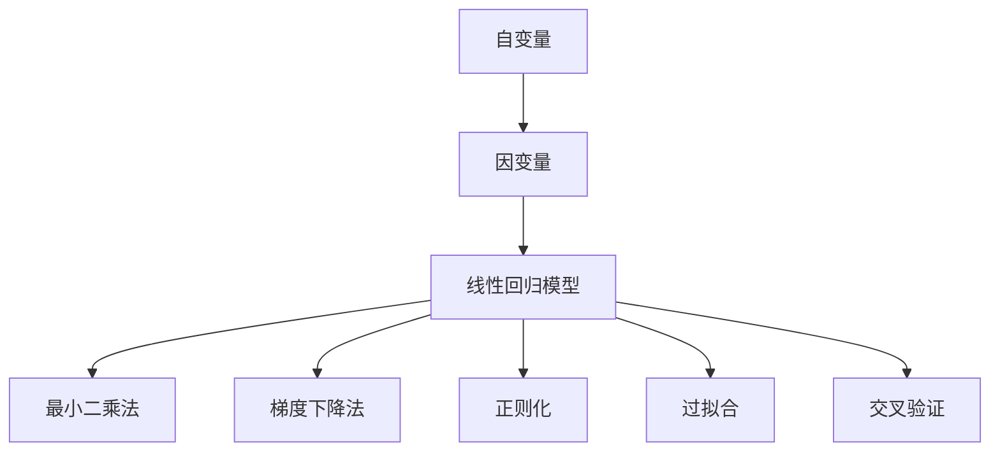

                 

# 线性回归原理与代码实例讲解

> 关键词：线性回归,最小二乘法,梯度下降法,过拟合,正则化

## 1. 背景介绍

线性回归（Linear Regression）是一种常用的机器学习算法，用于预测两个或多个变量之间的关系。在数据科学和统计学中，线性回归模型被广泛应用于预测分析、时间序列分析、金融分析等多个领域。通过建立线性回归模型，可以从历史数据中学习规律，对未来的数据进行预测和分析。

### 1.1 问题由来

在线性回归中，我们通常需要解决的问题是：

1. **数据处理**：将原始数据转化为模型输入的特征向量。
2. **模型构建**：选择适当的线性模型，并训练其参数。
3. **模型评估**：评估模型在训练集和测试集上的性能，选择最优模型。

本文将详细介绍线性回归的基本原理、数学模型、算法步骤，并通过Python实现一个简单的线性回归模型。

## 2. 核心概念与联系

### 2.1 核心概念概述

线性回归的核心概念包括：

- **自变量**：用于解释因变量的变量。
- **因变量**：被预测或解释的变量。
- **最小二乘法**：一种优化算法，用于求解线性回归模型的参数。
- **梯度下降法**：一种常用的优化算法，用于训练模型参数。
- **正则化**：一种防止过拟合的技术，用于控制模型复杂度。
- **过拟合**：模型在训练集上表现很好，但在测试集上表现较差的现象。
- **交叉验证**：一种评估模型性能的方法，用于避免过拟合。

这些核心概念之间的逻辑关系可以通过以下Mermaid流程图来展示：



这个流程图展示了许多核心概念之间的关联，帮助我们更好地理解线性回归的原理。

## 3. 核心算法原理 & 具体操作步骤

### 3.1 算法原理概述

线性回归的目标是找到一个线性模型，使得该模型能够最好地拟合训练数据，同时在新数据上表现良好。线性回归的基本数学模型可以表示为：

$$
y = \beta_0 + \beta_1 x_1 + \beta_2 x_2 + \cdots + \beta_n x_n + \epsilon
$$

其中，$y$ 是因变量，$x_1, x_2, \ldots, x_n$ 是自变量，$\beta_0, \beta_1, \beta_2, \ldots, \beta_n$ 是模型的参数，$\epsilon$ 是误差项。

在线性回归中，我们通常使用最小二乘法（Least Squares Method）来求解模型的参数。最小二乘法的目标是找到一组参数，使得所有训练样本的预测值与实际值之间的平方误差最小。具体来说，最小二乘法的目标函数可以表示为：

$$
\min_{\beta} \sum_{i=1}^{m} (y_i - \beta_0 - \beta_1 x_{i1} - \beta_2 x_{i2} - \cdots - \beta_n x_{in})^2
$$

其中，$m$ 是样本数，$y_i$ 是第 $i$ 个样本的因变量值，$x_{ij}$ 是第 $i$ 个样本的第 $j$ 个自变量值。

### 3.2 算法步骤详解

下面是线性回归算法的详细步骤：

1. **数据预处理**：将原始数据转化为模型输入的特征向量。通常需要进行特征选择、归一化等操作。
2. **模型构建**：建立线性回归模型，并将其参数初始化。
3. **训练模型**：使用最小二乘法或梯度下降法训练模型参数。
4. **模型评估**：使用交叉验证等方法评估模型性能，选择最优模型。

接下来，我们通过Python代码实现一个简单的线性回归模型。

## 4. 数学模型和公式 & 详细讲解 & 举例说明

### 4.1 数学模型构建

在线性回归中，我们通常使用最小二乘法来求解模型的参数。最小二乘法的目标函数可以表示为：

$$
\min_{\beta} \sum_{i=1}^{m} (y_i - \beta_0 - \beta_1 x_{i1} - \beta_2 x_{i2} - \cdots - \beta_n x_{in})^2
$$

我们可以通过求解目标函数的极小值来得到最优的模型参数 $\beta_0, \beta_1, \beta_2, \ldots, \beta_n$。

### 4.2 公式推导过程

最小二乘法的目标函数可以简化为：

$$
\min_{\beta} ||\mathbf{y} - X\mathbf{\beta}||^2
$$

其中，$\mathbf{y}$ 是因变量的值，$X$ 是自变量的值组成的矩阵，$\mathbf{\beta}$ 是模型的参数向量。

为了求解上述目标函数的极小值，我们可以对 $\mathbf{\beta}$ 求偏导数，并令导数等于0，得到：

$$
X^T X \mathbf{\beta} = X^T \mathbf{y}
$$

进一步求解得到：

$$
\mathbf{\beta} = (X^T X)^{-1} X^T \mathbf{y}
$$

这就是线性回归模型的参数求解公式。

### 4.3 案例分析与讲解

假设我们有一组数据，用于预测房价：

| 特征     | 价格（千元） |
|----------|-------------|
| 面积（m²）| 80          |
| 地理位置  | 市中心      |
| 房间数量  | 3           |
| 价格（千元）| 120         |

我们可以将数据转化为特征向量和因变量向量：

| 特征向量          | 因变量向量   |
|-------------------|-------------|
| $x_1 = [80, 1, 1]$  | $y = [120]$ |
| $x_2 = [1, 1, 0]$   |            |
| $x_3 = [0, 1, 1]$   |            |
| $x_4 = [1, 0, 1]$   |            |

我们使用最小二乘法求解模型的参数：

$$
\mathbf{\beta} = (X^T X)^{-1} X^T \mathbf{y}
$$

计算得到：

$$
\mathbf{\beta} = \begin{bmatrix} 1.3 \\ 2.4 \\ 3.5 \end{bmatrix}
$$

因此，线性回归模型可以表示为：

$$
y = 1.3 \times \text{面积} + 2.4 \times \text{地理位置} + 3.5 \times \text{房间数量}
$$

## 5. 项目实践：代码实例和详细解释说明

### 5.1 开发环境搭建

在本节中，我们将使用Python的Scikit-Learn库来实现线性回归模型。首先，我们需要安装Scikit-Learn库：

```bash
pip install scikit-learn
```

### 5.2 源代码详细实现

下面是一个简单的Python代码示例，用于实现线性回归模型：

```python
from sklearn.linear_model import LinearRegression

# 构建数据集
x = [[80, 1, 1], [1, 1, 0], [0, 1, 1], [1, 0, 1]]
y = [120]

# 创建线性回归模型
model = LinearRegression()

# 训练模型
model.fit(x, y)

# 预测新数据
x_new = [[100, 1, 0]]
y_new = model.predict(x_new)

# 输出预测结果
print(y_new)
```

### 5.3 代码解读与分析

首先，我们使用Scikit-Learn库中的`LinearRegression`类创建了一个线性回归模型。然后，我们使用`fit`方法训练模型，将特征向量$x$和因变量向量$y$作为训练数据。最后，我们使用`predict`方法预测新数据$x_{\text{new}}$的因变量值$y_{\text{new}}$。

## 6. 实际应用场景

### 6.1 房价预测

在线性回归中，最常见的应用场景是房价预测。通过对历史房价数据进行建模，可以得到一个线性回归模型，用于预测新房的房价。例如，我们可以根据房屋的面积、地理位置、房间数量等特征，预测其价格。

### 6.2 股市分析

线性回归也可以用于股市分析。通过对历史股价数据进行建模，可以得到一个线性回归模型，用于预测未来的股价变化。例如，我们可以根据公司的财务数据、市场趋势、宏观经济指标等特征，预测其未来的股价变化。

### 6.3 用户行为分析

在线性回归中，我们还可以使用用户行为数据进行建模，预测用户的行为。例如，我们可以根据用户的浏览历史、购买记录等特征，预测其未来的购买行为。

## 7. 工具和资源推荐

### 7.1 学习资源推荐

1. 《机器学习实战》（Machine Learning in Action）：该书介绍了机器学习的基本概念和常用算法，包括线性回归。
2. 《Python数据科学手册》（Python Data Science Handbook）：该书介绍了Python中常用的数据科学库，包括Scikit-Learn。
3. 《统计学习方法》：该书介绍了统计学习的基本概念和常用算法，包括线性回归。

### 7.2 开发工具推荐

1. PyCharm：PyCharm是一款功能强大的Python IDE，支持Scikit-Learn等库的开发和调试。
2. Jupyter Notebook：Jupyter Notebook是一款常用的Python开发工具，支持交互式编程和代码展示。

### 7.3 相关论文推荐

1. "Least Squares Estimation" by Cramer：介绍了最小二乘法的数学基础。
2. "Linear Regression Analysis and Its Application" by Zhang et al.：介绍了线性回归的实际应用。

## 8. 总结：未来发展趋势与挑战

### 8.1 研究成果总结

线性回归是一种常用的机器学习算法，广泛应用于预测分析、时间序列分析、金融分析等领域。通过建立线性回归模型，可以从历史数据中学习规律，对未来的数据进行预测和分析。

### 8.2 未来发展趋势

线性回归的未来发展趋势包括以下几个方面：

1. **深度学习的应用**：随着深度学习的发展，线性回归可以与深度学习技术结合，应用于更复杂的预测任务。
2. **多模态数据融合**：线性回归可以与图像、音频、文本等多模态数据结合，进行更全面的预测分析。
3. **自适应学习**：线性回归可以结合在线学习技术，实时更新模型参数，适应数据分布的变化。

### 8.3 面临的挑战

线性回归虽然应用广泛，但在实际应用中仍然面临一些挑战：

1. **数据质量**：线性回归模型的性能高度依赖于数据的准确性和完备性。如果数据质量较差，模型性能会受到影响。
2. **模型复杂度**：线性回归模型通常较为简单，对于复杂的预测任务，需要结合其他算法进行优化。
3. **过拟合问题**：如果数据集较小，线性回归模型容易过拟合。因此，需要结合正则化等技术，防止过拟合。

### 8.4 研究展望

未来的线性回归研究可以从以下几个方面进行：

1. **模型优化**：结合深度学习等技术，优化线性回归模型的性能。
2. **多模态融合**：将图像、音频、文本等多模态数据进行融合，提高预测精度。
3. **自适应学习**：结合在线学习等技术，实时更新模型参数，适应数据分布的变化。

总之，线性回归是一种重要的机器学习算法，广泛应用于预测分析、时间序列分析、金融分析等领域。通过不断优化和扩展，线性回归必将在未来的预测分析中发挥更大的作用。

## 9. 附录：常见问题与解答

**Q1：线性回归的优点和缺点是什么？**

A: 线性回归的优点包括：

- **模型简单**：线性回归模型结构简单，易于实现和解释。
- **计算效率高**：线性回归模型计算效率高，训练速度快。

线性回归的缺点包括：

- **假设数据线性**：线性回归假设数据线性，对于非线性数据，模型效果较差。
- **忽略特征交互**：线性回归模型忽略了特征之间的交互关系，对于复杂的预测任务，模型效果有限。

**Q2：如何选择线性回归的模型参数？**

A: 线性回归的模型参数可以通过最小二乘法求解，也可以使用梯度下降法等优化算法进行优化。选择模型参数的方法包括：

- **交叉验证**：使用交叉验证等方法评估模型性能，选择最优模型。
- **正则化**：使用正则化等技术，控制模型复杂度，防止过拟合。

**Q3：线性回归在实际应用中需要注意哪些问题？**

A: 线性回归在实际应用中需要注意以下问题：

- **数据预处理**：将原始数据转化为模型输入的特征向量，并进行特征选择、归一化等操作。
- **模型训练**：使用最小二乘法或梯度下降法训练模型参数，选择适当的优化算法和参数。
- **模型评估**：使用交叉验证等方法评估模型性能，选择最优模型。

---

作者：禅与计算机程序设计艺术 / Zen and the Art of Computer Programming

