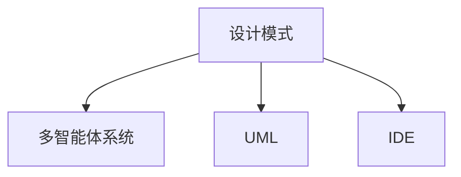

                 

# 综合设计模式的应用案例：反思、工具使用与多智能体协同

## 1. 背景介绍

### 1.1 问题由来

在当今快速变化的软件开发环境中，设计模式已成为构建高效、可扩展和可维护系统的关键工具。然而，尽管设计模式的使用广泛，但如何有效应用这些模式，尤其是在复杂多智能体系统中，仍是一个需要深入探讨的问题。本文旨在通过反思、工具使用和多智能体协同三个方面，展示设计模式的综合应用案例，探讨其在实际工程中的高效实施方法。

### 1.2 问题核心关键点

本文聚焦于以下几个核心关键点：
1. **设计模式的反思**：理解设计模式背后的原理和适用场景，选择最适合的设计模式。
2. **工具的使用**：利用现代软件开发工具，如UML、IDE等，辅助设计模式的应用。
3. **多智能体的协同**：在复杂系统中，通过设计模式实现多个智能体之间的有效协作，提升系统整体性能。

## 2. 核心概念与联系

### 2.1 核心概念概述

为更好地理解设计模式的应用，本节将介绍几个密切相关的核心概念：

- **设计模式(Design Pattern)**：一类通用的解决方案，用于解决在软件设计中经常遇到的问题。常见的设计模式包括单例模式、工厂模式、策略模式等。
- **多智能体系统(Multi-Agent System,MAS)**：由多个自治、半自治的智能体组成的系统，它们通过交互和合作完成共同目标。
- **UML**：Unified Modeling Language，用于可视化软件开发生命周期中的模型和模型元素的建模语言。
- **IDE**：Integrated Development Environment，提供编程、编译、调试等功能的集成开发环境。

这些核心概念之间的逻辑关系可以通过以下Mermaid流程图来展示：



这个流程图展示了几者之间的关系：

1. 设计模式是解决特定问题的一套通用策略。
2. 多智能体系统是由多个智能体组成的复杂系统，设计模式在其中起到关键作用。
3. UML和IDE是辅助设计模式应用的现代工具，用于可视化建模和开发。

## 3. 核心算法原理 & 具体操作步骤

### 3.1 算法原理概述

设计模式的应用原理基于软件设计的基本原则，如单一职责原则(SRP)、开闭原则(OCP)、里氏替换原则(LSP)等。其核心在于通过抽象、封装、继承和组合等机制，将复杂问题分解为更小、更易于管理的部分，并设计出灵活、可扩展的解决方案。

在设计模式的实际应用中，一般包括以下几个关键步骤：

- **识别问题**：分析问题本质，确定需要解决的具体问题。
- **选择模式**：根据问题特性，选择最适合的设计模式。
- **应用模式**：使用模式的基本结构和技术，在代码中实现解决方案。
- **评估效果**：对设计模式的应用效果进行评估，验证其是否满足需求。

### 3.2 算法步骤详解

#### 3.2.1 识别问题

问题识别是设计模式应用的首要步骤。开发者需要深入理解问题的本质，确定其关键特性和约束条件。例如，在需要创建多个相似对象时，可以考虑使用工厂模式；在需要支持多个算法时，可以考虑使用策略模式。

#### 3.2.2 选择模式

选择合适的设计模式是成功应用的关键。每种设计模式都有其特定的应用场景和问题解决方式。例如，单例模式适用于全局唯一对象的管理；观察者模式适用于一对多的事件通知机制。

#### 3.2.3 应用模式

设计模式的实际应用通常涉及代码结构和交互模式的改变。例如，工厂模式需要设计产品抽象类和具体工厂类，观察者模式需要定义观察者、主题接口和具体主题类。

#### 3.2.4 评估效果

应用设计模式后，需要对其进行效果评估，确保其满足需求且易于维护。常见的评估方法包括代码审查、单元测试、性能测试等。

### 3.3 算法优缺点

设计模式的应用具有以下优点：

- **可复用性**：设计模式提供了一种通用的解决方案，可以在不同项目和场景中复用。
- **可扩展性**：设计模式通过抽象和封装，提高了系统的灵活性和可扩展性。
- **可维护性**：设计模式通过分治和模块化，降低了代码复杂性，提高了维护性。

同时，设计模式也存在一些局限性：

- **过度设计**：过度使用设计模式可能导致系统复杂性增加，降低开发效率。
- **模式滥用**：不恰当地选择或应用设计模式可能导致问题解决效果不佳，甚至引入新的问题。
- **学习成本**：设计模式种类繁多，学习成本较高，需要一定的经验和理解。

### 3.4 算法应用领域

设计模式广泛应用于软件开发中的各个阶段，特别是在面向对象编程(OOP)、软件架构设计、微服务架构等方面。例如：

- 在OOP中，工厂模式、单例模式、策略模式等常用于解决创建、管理和控制对象的问题。
- 在软件架构设计中，观察者模式、发布/订阅模式、代理模式等常用于实现系统组件之间的交互和通信。
- 在微服务架构中，服务注册与发现、配置管理、断路器模式等常用于实现服务的自治和容错。

## 4. 数学模型和公式 & 详细讲解 & 举例说明

### 4.1 数学模型构建

设计模式的应用通常不涉及复杂的数学模型，但可以通过一些具体的场景来展示其基本原理和应用方法。例如，工厂模式可以通过对象创建过程中的抽象和封装，来提高系统的可扩展性和可维护性。

### 4.2 公式推导过程

设计模式的具体实现不依赖于数学公式，但其基本原理可以通过一些简单的模型和图示来解释。例如，工厂模式可以使用以下图示来表示其基本结构：

```
+---------------------+
|     Product         |
|       接口         |
+---------------------+
     |
     |
+---------------------+
|     Concrete        |
|   Factory          |
|     Product       |
|     interfaces    |
|       类         |
+---------------------+
     |
     |
+---------------------+
|     Client         |
+---------------------+
```

这个图示展示了工厂模式的基本结构，即客户端通过工厂类创建产品对象。

### 4.3 案例分析与讲解

以下以工厂模式为例，展示其具体应用和效果。

#### 案例背景

在软件开发中，经常需要创建多个相似对象，如不同尺寸的窗口、不同类型的数据库连接等。此时，传统的逐个创建对象的方法会导致代码冗余和维护困难。

#### 解决方案

工厂模式提供了一种通用的解决方案，通过定义产品接口和具体工厂类，可以动态地创建产品对象。例如，在Java中，可以定义一个抽象的Product接口，和多个具体的ConcreteProduct类，以及一个ConcreteFactory类，实现动态创建产品对象的工厂模式：

```java
public interface Product {
    void operation();
}

public class ConcreteProductA implements Product {
    public void operation() {
        System.out.println("ConcreteProductA operation");
    }
}

public class ConcreteProductB implements Product {
    public void operation() {
        System.out.println("ConcreteProductB operation");
    }
}

public class Factory {
    public Product createProduct(String type) {
        if ("A".equals(type)) {
            return new ConcreteProductA();
        } else if ("B".equals(type)) {
            return new ConcreteProductB();
        } else {
            return null;
        }
    }
}

public class Client {
    public static void main(String[] args) {
        Factory factory = new Factory();
        Product productA = factory.createProduct("A");
        productA.operation();
        Product productB = factory.createProduct("B");
        productB.operation();
    }
}
```

在这个示例中，客户端通过工厂类动态地创建了两个不同类型的产品对象，实现了产品的动态创建和管理。

## 5. 项目实践：代码实例和详细解释说明

### 5.1 开发环境搭建

在进行设计模式实践前，我们需要准备好开发环境。以下是使用Java和Eclipse开发工厂模式的环境配置流程：

1. 安装JDK：从官网下载并安装Java Development Kit。
2. 安装Eclipse：从官网下载并安装Eclipse IDE。
3. 配置开发环境：在Eclipse中安装Java插件，配置JDK路径等。
4. 导入项目：将项目代码导入Eclipse，建立工作空间。

### 5.2 源代码详细实现

这里我们以工厂模式为例，展示其具体实现过程。

#### 5.2.1 抽象类

定义Product抽象类，包含产品的公共方法：

```java
public abstract class Product {
    public abstract void operation();
}
```

#### 5.2.2 具体类

定义ConcreteProductA和ConcreteProductB两个具体类，实现Product接口：

```java
public class ConcreteProductA extends Product {
    public void operation() {
        System.out.println("ConcreteProductA operation");
    }
}

public class ConcreteProductB extends Product {
    public void operation() {
        System.out.println("ConcreteProductB operation");
    }
}
```

#### 5.2.3 工厂类

定义Factory类，实现创建产品对象的逻辑：

```java
public class Factory {
    public Product createProduct(String type) {
        if ("A".equals(type)) {
            return new ConcreteProductA();
        } else if ("B".equals(type)) {
            return new ConcreteProductB();
        } else {
            return null;
        }
    }
}
```

#### 5.2.4 客户端

定义Client类，使用工厂类创建产品对象：

```java
public class Client {
    public static void main(String[] args) {
        Factory factory = new Factory();
        Product productA = factory.createProduct("A");
        productA.operation();
        Product productB = factory.createProduct("B");
        productB.operation();
    }
}
```

### 5.3 代码解读与分析

让我们再详细解读一下关键代码的实现细节：

**Product抽象类**：
- 定义了产品对象的公共方法，所有具体产品类必须实现该方法。

**ConcreteProductA和ConcreteProductB具体类**：
- 继承Product抽象类，并实现其中的operation方法。

**Factory工厂类**：
- 根据传入的类型字符串，动态创建相应的产品对象，并返回。

**Client客户端**：
- 创建Factory对象，并使用它来创建具体的产品对象，调用其operation方法。

通过工厂模式，客户端代码无需关注具体的产品实现，只需通过工厂类创建对象，实现了产品的动态创建和管理。

## 6. 实际应用场景

### 6.1 智能电网管理系统

智能电网管理系统是一个复杂的多智能体系统，涉及电力生产、传输、分配等多个环节。设计模式在其中起到关键作用，通过工厂模式、观察者模式、策略模式等实现系统的各个组件之间的交互和协作。

例如，在智能电网中，可以使用工厂模式动态地创建不同的传感器和执行器，支持多种类型的传感器和执行器，提升系统的灵活性和可扩展性。同时，可以使用观察者模式实现事件驱动的交互机制，通过主题和观察者之间的松耦合，提高系统的解耦能力和可维护性。

### 6.2 供应链管理系统

供应链管理系统也是一个多智能体系统，涉及供应商、制造商、物流商、客户等多个角色。设计模式在其中同样起到关键作用，通过工厂模式、策略模式、适配器模式等实现系统的各个组件之间的交互和协作。

例如，在供应链管理中，可以使用工厂模式动态地创建不同的订单处理模块和配送模块，支持多种类型的订单和配送需求，提升系统的灵活性和可扩展性。同时，可以使用策略模式实现供应链管理的多种策略，如库存管理、供应商选择、物流优化等，提高系统的可配置性和可维护性。

### 6.3 智慧医疗系统

智慧医疗系统是一个高度集成和交互的系统，涉及医院、患者、医生、药品等多个角色。设计模式在其中同样起到关键作用，通过观察者模式、责任链模式、适配器模式等实现系统的各个组件之间的交互和协作。

例如，在智慧医疗中，可以使用观察者模式实现医生和患者之间的交互，通过主题和观察者之间的松耦合，提高系统的解耦能力和可维护性。同时，可以使用责任链模式实现多个医疗服务提供者之间的协作，通过链式调用，提高系统的可扩展性和可维护性。

## 7. 工具和资源推荐

### 7.1 学习资源推荐

为了帮助开发者系统掌握设计模式的应用，这里推荐一些优质的学习资源：

1. **《设计模式：可复用面向对象软件的基础》**：由Ernest RayLee和Elisabeth Liskov合著，详细介绍了23种设计模式的原理和应用。
2. **UML教程**：UML是设计模式可视化的重要工具，通过学习UML教程，可以掌握如何使用UML建模和设计。
3. **IDE插件**：在IDE中使用设计模式的插件，如Java插件、Eclipse插件等，可以快速实现设计模式的可视化建模和应用。

### 7.2 开发工具推荐

高效的开发离不开优秀的工具支持。以下是几款用于设计模式开发常用的工具：

1. **UML工具**：如MagicDraw、Rhapsody等，用于设计模式的可视化建模和文档生成。
2. **IDE工具**：如Eclipse、Visual Studio等，提供设计模式应用的环境和插件支持。
3. **版本控制工具**：如Git、SVN等，用于设计模式的版本管理和协作开发。

合理利用这些工具，可以显著提升设计模式的应用效率，加速创新迭代的步伐。

### 7.3 相关论文推荐

设计模式的研究源于学界的持续探索。以下是几篇奠基性的相关论文，推荐阅读：

1. **《软件工程：设计与分析》**：Richard Lad FP、Robert Lad FP等，介绍设计模式的理论基础和应用方法。
2. **《设计模式：可复用软件的基础》**：Eric Gamma等，详细介绍23种设计模式的原理和应用。
3. **《系统架构模式》**：George Odom、Richard Lad FP、Robert Lad FP等，介绍系统架构模式的设计和应用。

通过对这些资源的学习实践，相信你一定能够快速掌握设计模式的应用精髓，并用于解决实际的工程问题。

## 8. 总结：未来发展趋势与挑战

### 8.1 总结

本文对设计模式的应用进行了全面系统的介绍。首先阐述了设计模式的研究背景和应用意义，明确了设计模式在多智能体系统中的重要地位。其次，从原理到实践，详细讲解了设计模式的应用方法，给出了具体实现案例。同时，本文还探讨了设计模式在智能电网、供应链、智慧医疗等多个行业领域的应用前景，展示了设计模式的强大生命力和应用潜力。最后，本文精选了设计模式的相关学习资源和开发工具，力求为读者提供全方位的技术指引。

通过本文的系统梳理，可以看到，设计模式的应用不仅限于软件开发生命周期中的各个阶段，其核心思想和方法在新兴技术领域同样适用。未来，设计模式的应用将进一步拓展到更多复杂多智能体系统中，推动系统设计的科学化和工程化发展。

### 8.2 未来发展趋势

展望未来，设计模式的应用将呈现以下几个发展趋势：

1. **模型驱动架构(MDA)**：通过UML等建模语言，实现设计模式的自动化设计和验证，提升设计模式的可复用性和可扩展性。
2. **组件化设计**：将设计模式应用于组件化设计中，通过组件组合实现复杂系统的灵活和可扩展。
3. **云平台支持**：在设计模式的应用中，引入云平台支持，实现设计模式的自动化部署和运维，提高系统的可扩展性和可维护性。
4. **自适应设计**：在设计模式的应用中，引入自适应技术，实现系统的自适应和自优化，提升系统的灵活性和智能性。
5. **模型演进**：在设计模式的应用中，引入模型演进技术，实现设计模式的动态更新和进化，提升系统的灵活性和适应性。

以上趋势凸显了设计模式的应用前景和未来发展方向。这些方向的探索发展，将进一步提升设计模式的工程化和科学化水平，推动复杂多智能体系统的设计和应用。

### 8.3 面临的挑战

尽管设计模式的应用已经取得了显著成果，但在迈向更加智能化、普适化应用的过程中，它仍面临诸多挑战：

1. **复杂度增加**：设计模式在复杂系统中应用时，可能会导致系统复杂度增加，降低开发效率。
2. **模式冲突**：不同的设计模式之间可能存在冲突，需要在应用时进行权衡和取舍。
3. **学习成本高**：设计模式种类繁多，学习成本较高，需要一定的经验和理解。
4. **模式滥用**：不恰当地选择或应用设计模式可能导致问题解决效果不佳，甚至引入新的问题。
5. **可维护性不足**：设计模式在应用时，可能会引入额外的复杂性和维护成本，降低系统的可维护性。

正视设计模式面临的这些挑战，积极应对并寻求突破，将是大规模多智能体系统设计模式应用的重要方向。

### 8.4 研究展望

未来的研究需要在以下几个方面寻求新的突破：

1. **模式演进与动态设计**：探索设计模式的动态演变和更新机制，实现设计模式的自动化和自适应。
2. **多智能体协同**：研究设计模式在复杂多智能体系统中的协同机制，实现系统组件之间的协同交互和协作。
3. **模型驱动与自动验证**：探索设计模式在模型驱动架构(MDA)中的应用，实现设计模式的自动化设计和验证。
4. **云平台与自适应设计**：探索设计模式在云平台中的应用，实现设计模式的自动化部署和运维，提高系统的可扩展性和可维护性。
5. **数据驱动与智能设计**：探索设计模式在数据驱动架构中的应用，实现设计模式的自适应和自优化，提升系统的智能性和灵活性。

这些研究方向将引领设计模式的应用向更高的层次发展，推动复杂多智能体系统的设计和应用。

## 9. 附录：常见问题与解答

**Q1：设计模式是否适用于所有场景？**

A: 设计模式并非适用于所有场景。每种设计模式都有其特定的适用条件和应用场景。开发者需要根据具体问题的特点，选择最适合的设计模式。例如，单例模式适用于全局唯一对象的管理，而工厂模式适用于创建多个相似对象。

**Q2：设计模式如何与现代软件开发工具结合？**

A: 设计模式与现代软件开发工具的结合可以通过UML和IDE等工具实现。例如，UML工具可以用于可视化设计模式的建模和文档生成，IDE工具可以提供设计模式应用的环境和插件支持。通过这些工具，开发者可以更高效地实现设计模式的可视化建模和自动化应用。

**Q3：设计模式的应用是否会引入额外的复杂性？**

A: 设计模式的应用可能会引入一定的复杂性，但通过合理的管理和优化，可以有效地控制和降低复杂度。例如，在设计模式的应用中，可以采用模块化设计、松耦合设计等技术，提高系统的可维护性和可扩展性。

**Q4：设计模式的未来发展方向是什么？**

A: 设计模式的未来发展方向包括模型驱动架构、组件化设计、云平台支持、自适应设计和数据驱动设计等。这些方向的探索发展，将进一步提升设计模式的工程化和科学化水平，推动复杂多智能体系统的设计和应用。

这些研究方向将引领设计模式的应用向更高的层次发展，推动复杂多智能体系统的设计和应用。

---

作者：禅与计算机程序设计艺术 / Zen and the Art of Computer Programming

