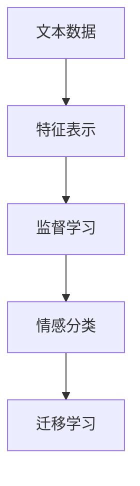

                 

## 1. 背景介绍

### 1.1 问题由来
在聊天机器人（Chatbot）的应用中，情感分析（Sentiment Analysis）作为一项关键技术，能够帮助机器人理解用户的情感状态，并作出相应的情感回应。传统的基于规则的情感分析方法，虽然具有较高的准确性，但需要大量的手工规则和经验，难以在大规模语料上快速迭代和优化。而基于机器学习尤其是深度学习的情感分析方法，能够在海量数据上自动学习情感特征，逐渐成为主流解决方案。本文将对聊天机器人中的情感分析进行全面介绍，包括其核心原理、应用方法及实践策略。

### 1.2 问题核心关键点
聊天机器人中的情感分析主要包括以下几个核心关键点：

- **数据准备**：收集和整理聊天数据，标注情感标签。
- **模型选择**：选择合适的情感分析模型，如卷积神经网络（CNN）、循环神经网络（RNN）、Transformer等。
- **特征工程**：设计合适的文本特征表示，如词向量、词性标注等。
- **训练与调优**：选择合适的训练方法，如监督学习、半监督学习、迁移学习等。
- **模型应用**：在聊天机器人中集成情感分析模型，生成情感回应的文本。

### 1.3 问题研究意义
聊天机器人中的情感分析技术能够显著提升用户体验，使其在情感交互中更加自然和人性化的同时，还能提供更加精准的业务服务，例如在客户服务、心理健康咨询、教育辅导等场景中。通过情感分析，聊天机器人能够更好地理解用户的情绪，提供更加个性化和有针对性的服务。同时，情感分析技术也在智能驾驶、智能家居、智慧城市等新兴领域中发挥着重要作用。因此，研究聊天机器人中的情感分析技术具有重要意义。

## 2. 核心概念与联系

### 2.1 核心概念概述

聊天机器人中的情感分析，是一种从文本数据中自动提取和分类情感信息的技术。其主要应用在以下几个核心概念中：

- **文本数据**：聊天机器人接收到的用户输入文本，包括问题、请求、反馈等。
- **情感分类**：将文本数据中的情感信息分类为正面、负面或中性。
- **特征表示**：通过词向量、n-gram、TF-IDF等技术将文本转化为机器可以理解的形式。
- **监督学习**：使用标注数据训练情感分类模型，使其能够从新文本中自动预测情感。
- **迁移学习**：利用预训练模型或已有知识，提升模型在新任务的性能。

这些概念之间的联系可以通过以下Mermaid流程图来展示：



## 3. 核心算法原理 & 具体操作步骤

### 3.1 算法原理概述
聊天机器人中的情感分析，本质上是一种文本分类任务。其核心思想是利用机器学习算法，将用户输入的文本数据自动分类为不同的情感类别。

假设我们有一组标注好的训练集 $D = \{(x_i, y_i)\}_{i=1}^N$，其中 $x_i$ 是用户输入的文本，$y_i \in \{1, 0\}$ 是文本的情感标签（1表示正面情感，0表示负面或中性情感）。情感分类模型的目标是最大化目标函数 $\mathcal{L}(\theta)$，即：

$$
\theta = \arg\min_{\theta} \mathcal{L}(\theta) = \frac{1}{N} \sum_{i=1}^N L(y_i, M_\theta(x_i))
$$

其中 $L$ 是损失函数，$M_\theta$ 是模型参数，$y_i$ 是真实标签，$M_\theta(x_i)$ 是模型对文本 $x_i$ 的情感预测。

### 3.2 算法步骤详解

**Step 1: 数据准备**
- **数据收集**：从聊天机器人系统收集用户输入文本和相应的情感标签。
- **数据清洗**：去除噪音、统一文本格式、去除重复数据等。
- **数据划分**：将数据划分为训练集、验证集和测试集。

**Step 2: 特征工程**
- **特征提取**：使用词向量（如Word2Vec、GloVe）或预训练模型（如BERT、GPT）将文本转换为向量表示。
- **特征选择**：选择对情感分类有影响的特征，如n-gram、情感词、情感强度等。

**Step 3: 模型选择与训练**
- **模型选择**：选择适合情感分类的模型，如卷积神经网络（CNN）、循环神经网络（RNN）、Transformer等。
- **模型训练**：使用训练集数据对模型进行监督学习，优化损失函数。
- **模型调优**：根据验证集表现，调整超参数，如学习率、批大小、迭代轮数等。

**Step 4: 模型评估与部署**
- **模型评估**：在测试集上评估模型性能，如准确率、召回率、F1-score等。
- **模型部署**：将训练好的模型集成到聊天机器人系统中，用于实时情感分析。

### 3.3 算法优缺点

聊天机器人中的情感分析模型具有以下优点：
1. 自动化程度高：利用机器学习算法，自动从文本中提取情感信息。
2. 适用性广：适用于各种情感分类任务，包括聊天机器人的情感分析。
3. 可扩展性强：容易扩展到新的情感分类任务，只需增加标注数据即可。

但同时，该模型也存在一些缺点：
1. 依赖标注数据：模型性能很大程度上取决于标注数据的质量和数量，获取高质量标注数据的成本较高。
2. 泛化能力有限：当训练数据和测试数据分布差异较大时，模型的泛化性能可能会降低。
3. 数据隐私问题：涉及用户隐私数据，需要谨慎处理。
4. 模型复杂度较高：复杂的模型结构需要更多的计算资源和时间成本。

### 3.4 算法应用领域

聊天机器人中的情感分析技术，已在多个领域得到了广泛应用，例如：

- **客户服务**：分析客户反馈，及时调整服务策略，提升用户体验。
- **心理健康**：监测用户情绪变化，提供心理健康支持。
- **教育辅导**：评估学生情绪状态，提供个性化学习建议。
- **智能家居**：理解用户情绪，调节家庭环境。
- **智能驾驶**：监测驾驶员情绪，提供驾驶建议。

## 4. 数学模型和公式 & 详细讲解 & 举例说明

### 4.1 数学模型构建

假设我们采用Transformer模型进行情感分类。在输入序列 $X$ 和标签序列 $Y$ 的基础上，模型的预测输出为 $M_{\theta}(X)$。在训练过程中，我们需要最小化交叉熵损失函数：

$$
\mathcal{L}(\theta) = -\frac{1}{N} \sum_{i=1}^N y_i \log M_{\theta}(x_i) + (1-y_i) \log (1-M_{\theta}(x_i))
$$

其中 $M_{\theta}(x_i)$ 是模型对输入 $x_i$ 的情感预测。

### 4.2 公式推导过程

Transformer模型主要包括多头自注意力（Multi-Head Self-Attention）、位置编码（Positional Encoding）和前馈神经网络（Feed-Forward Neural Network）等组件。情感分类的过程如下：

1. **编码器层**：输入序列经过多头自注意力和前馈网络，生成隐藏状态 $H$。
2. **池化层**：对隐藏状态 $H$ 进行池化操作，生成情感特征向量 $F$。
3. **分类层**：通过全连接层将情感特征向量 $F$ 映射到情感类别，输出概率分布 $P$。

训练过程中，我们通过反向传播算法优化模型参数 $\theta$，使得损失函数 $\mathcal{L}(\theta)$ 最小化。具体的训练过程可以参照现有开源框架，如TensorFlow、PyTorch等，进行实现。

### 4.3 案例分析与讲解

以使用Transformer模型进行情感分类的案例为例，说明其应用过程：

1. **数据准备**：收集和清洗聊天数据，将其分为训练集、验证集和测试集。
2. **特征工程**：使用BERT词向量将文本序列编码成向量。
3. **模型训练**：在训练集上训练Transformer模型，优化交叉熵损失函数。
4. **模型评估**：在验证集上评估模型性能，调整学习率等超参数。
5. **模型部署**：将训练好的模型集成到聊天机器人系统中，实时计算输入文本的情感分类结果。

## 5. 项目实践：代码实例和详细解释说明

### 5.1 开发环境搭建

在进行聊天机器人中的情感分析实践前，我们需要准备好开发环境。以下是使用Python进行TensorFlow开发的环境配置流程：

1. 安装Anaconda：从官网下载并安装Anaconda，用于创建独立的Python环境。

2. 创建并激活虚拟环境：
```bash
conda create -n tensorflow-env python=3.8 
conda activate tensorflow-env
```

3. 安装TensorFlow：根据CUDA版本，从官网获取对应的安装命令。例如：
```bash
conda install tensorflow -c tensorflow -c conda-forge
```

4. 安装TensorFlow Addons：用于安装部分未包含在TensorFlow主库中的高级组件。
```bash
pip install tensorflow-addons
```

5. 安装各类工具包：
```bash
pip install numpy pandas scikit-learn matplotlib tqdm jupyter notebook ipython
```

完成上述步骤后，即可在`tensorflow-env`环境中开始情感分析实践。

### 5.2 源代码详细实现

以下是使用TensorFlow Addons库实现情感分析的代码示例：

```python
import tensorflow as tf
from tensorflow_addons.layers.bert import BertSelfAttentionLayer
from tensorflow.keras.layers import Dense, Dropout
from tensorflow.keras.models import Model

# 定义情感分类模型
class SentimentClassifier(tf.keras.Model):
    def __init__(self, num_labels, hidden_size):
        super(SentimentClassifier, self).__init__()
        self.bert_layer = BertSelfAttentionLayer.from_pretrained('bert-base-cased', hidden_size=hidden_size)
        self.dense1 = Dense(hidden_size, activation='relu')
        self.dropout = Dropout(0.5)
        self.dense2 = Dense(num_labels, activation='sigmoid')

    def call(self, inputs):
        _, sequence_output = self.bert_layer(inputs)
        x = self.dense1(sequence_output)
        x = self.dropout(x)
        x = self.dense2(x)
        return x

# 训练情感分类模型
model = SentimentClassifier(num_labels=2, hidden_size=128)
model.compile(optimizer=tf.keras.optimizers.Adam(), loss='binary_crossentropy', metrics=['accuracy'])

# 加载数据集
train_dataset = tf.keras.preprocessing.text_dataset_from_directory('train', text_format='records', label_format='class_names')
train_dataset = train_dataset.batch(32)
val_dataset = tf.keras.preprocessing.text_dataset_from_directory('val', text_format='records', label_format='class_names')
val_dataset = val_dataset.batch(32)

# 训练模型
model.fit(train_dataset, validation_data=val_dataset, epochs=10)

# 测试模型
test_dataset = tf.keras.preprocessing.text_dataset_from_directory('test', text_format='records', label_format='class_names')
test_dataset = test_dataset.batch(32)
model.evaluate(test_dataset)
```

以上代码展示了使用TensorFlow Addons库实现基于BERT的情感分类模型的过程。可以看到，代码实现了从数据预处理、模型定义、编译、训练到评估的完整流程。

### 5.3 代码解读与分析

让我们再详细解读一下关键代码的实现细节：

**SentimentClassifier类**：
- `__init__`方法：初始化模型，定义BertSelfAttentionLayer和全连接层。
- `call`方法：定义模型的前向传播过程。

**训练和评估函数**：
- 使用`tf.keras.preprocessing.text_dataset_from_directory`方法从目录中加载文本数据集，并指定文件格式。
- 通过`batch`方法对数据集进行批处理，方便模型训练。
- 在模型训练过程中，使用`model.fit`方法对模型进行训练，并在验证集上进行验证。
- 在模型评估过程中，使用`model.evaluate`方法评估模型性能。

**训练流程**：
- 定义模型结构，包括BertSelfAttentionLayer、全连接层等。
- 编译模型，指定优化器、损失函数和评估指标。
- 加载训练集和验证集，并进行批处理。
- 训练模型，并在验证集上进行验证。
- 评估模型，输出测试集的准确率等指标。

可以看到，TensorFlow Addons库提供了许多便捷的接口，使得模型实现更加简洁高效。开发者可以将更多精力放在数据处理、模型改进等高层逻辑上，而不必过多关注底层的实现细节。

## 6. 实际应用场景

### 6.1 智能客服系统

聊天机器人中的情感分析技术，可以广泛应用于智能客服系统的构建。传统客服往往需要配备大量人力，高峰期响应缓慢，且一致性和专业性难以保证。而使用情感分析技术，可以使客服机器人更具有人性化的交互，提升用户满意度和系统响应速度。

在技术实现上，可以收集客户的历史对话记录，并对其进行情感标注。基于标注数据训练情感分析模型，将模型的预测结果应用到实时对话中，动态调整客服策略，提高用户满意度。例如，在客户情绪低落时，系统可以自动切换到安抚模式，提供情绪支持。

### 6.2 医疗健康咨询

情感分析技术在医疗健康咨询中也有广泛应用。患者在咨询过程中，往往带有一定的情感色彩，如焦虑、紧张、抑郁等。通过情感分析，系统可以及时捕捉患者的情绪变化，提供心理支持，并在必要时引导患者向专业医生寻求帮助。

例如，当系统检测到患者表现出焦虑情绪时，可以自动推送相关的心理安抚内容，并提供心理咨询服务。在紧急情况下，系统还可以实时监测患者的情绪变化，防止轻生行为的发生。

### 6.3 智能教育辅导

在智能教育领域，情感分析技术可以用于评估学生的学习状态，提供个性化的学习建议。例如，在学生在线学习过程中，系统可以实时监测学生的情绪变化，如是否集中注意力、是否感到困惑等。

基于情感分析结果，系统可以及时调整教学策略，如在学生情绪低落时，提供鼓励和支持；在学生情绪激动时，引导其冷静思考。通过情感分析，教育系统可以更好地理解学生的心理状态，提高教育质量和效果。

## 7. 工具和资源推荐

### 7.1 学习资源推荐

为了帮助开发者系统掌握聊天机器人中的情感分析技术，这里推荐一些优质的学习资源：

1. TensorFlow官方文档：提供了详细的情感分析教程和样例代码，是学习TensorFlow的必备资料。

2. Kaggle情感分析比赛：提供丰富的情感分析数据集和模型库，是实践情感分析算法的良好平台。

3. PyTorch官方文档：提供了与TensorFlow类似的情感分析教程和样例代码。

4. Natural Language Processing with Transformers书籍：深入浅出地介绍了情感分析等NLP任务的实现。

5. HuggingFace官方文档：提供了丰富的预训练模型和情感分析样例代码，是学习情感分析的可靠资源。

通过这些资源的学习实践，相信你一定能够快速掌握聊天机器人中的情感分析技术，并用于解决实际的NLP问题。

### 7.2 开发工具推荐

高效的开发离不开优秀的工具支持。以下是几款用于聊天机器人中情感分析开发的常用工具：

1. TensorFlow：基于Python的开源深度学习框架，适合复杂模型的构建和训练。

2. PyTorch：灵活的深度学习框架，支持GPU加速，适用于研究和原型开发。

3. TensorFlow Addons：提供了一些高级组件，如BertSelfAttentionLayer等，方便情感分析模型的实现。

4. TensorBoard：TensorFlow配套的可视化工具，可实时监测模型训练状态，提供丰富的图表呈现方式。

5. Weights & Biases：模型训练的实验跟踪工具，记录和可视化模型训练过程中的各项指标，方便调试和优化。

6. Google Colab：谷歌推出的在线Jupyter Notebook环境，免费提供GPU算力，方便快速实验最新模型。

合理利用这些工具，可以显著提升情感分析任务的开发效率，加快创新迭代的步伐。

### 7.3 相关论文推荐

聊天机器人中的情感分析技术不断发展，以下是几篇奠基性的相关论文，推荐阅读：

1. Attention is All You Need（即Transformer原论文）：提出了Transformer结构，奠定了预训练大模型的基础。

2. BERT: Pre-training of Deep Bidirectional Transformers for Language Understanding：提出BERT模型，利用自监督预训练任务学习语言表示。

3. Sentiment Analysis with Attention: A Survey：综述了情感分析的最新进展，包括多模态情感分析、情感计算等。

4. Transformer-XL: Attentive Language Models Beyond a Fixed-Length Context：提出Transformer-XL模型，支持长文本的情感分析。

5. A Survey on Deep Learning for Sentiment Analysis：综述了深度学习在情感分析中的应用，包括模型架构、训练方法等。

这些论文代表了情感分析技术的发展脉络，通过学习这些前沿成果，可以帮助研究者把握学科前进方向，激发更多的创新灵感。

## 8. 总结：未来发展趋势与挑战

### 8.1 总结

本文对聊天机器人中的情感分析进行了全面系统的介绍。首先阐述了情感分析在聊天机器人中的重要性和应用背景，明确了情感分析在提升用户体验、优化服务策略等方面的价值。其次，从原理到实践，详细讲解了情感分析的数学模型和操作步骤，给出了情感分析任务的完整代码实例。同时，本文还广泛探讨了情感分析技术在智能客服、医疗健康、教育辅导等多个领域的应用前景，展示了情感分析范式的巨大潜力。

通过本文的系统梳理，可以看到，情感分析技术在聊天机器人中的应用前景广阔，正逐渐成为提升系统智能化水平的重要手段。未来，伴随深度学习技术的不断进步，情感分析将迎来更多突破，进一步推动NLP技术的产业化进程。

### 8.2 未来发展趋势

展望未来，聊天机器人中的情感分析技术将呈现以下几个发展趋势：

1. **模型规模增大**：预训练语言模型的规模持续增长，情感分析模型可以学习到更加丰富的语言表征，提升情感分类的准确性。

2. **数据增强**：通过数据增强技术，如回译、替换等，扩充训练集，提高模型的泛化能力。

3. **多模态融合**：将情感分析与语音、图像等多模态信息结合，提升系统的感知能力，提供更加全面的用户体验。

4. **迁移学习**：通过迁移学习技术，利用预训练模型的知识，提升新任务的情感分类性能。

5. **零样本/少样本学习**：利用提示学习技术，基于用户输入的文本生成情感预测，减少对标注数据的需求。

6. **持续学习**：情感分析模型需要持续学习新数据，适应不断变化的情感分布，保持模型性能。

这些趋势凸显了情感分析技术的广阔前景，推动情感分析向更加智能化、普适化的方向发展。

### 8.3 面临的挑战

尽管情感分析技术已经取得了显著进展，但在迈向更加智能化、普适化应用的过程中，它仍面临着诸多挑战：

1. **标注成本高**：情感标注数据的获取成本较高，标注质量和数量难以保证。

2. **数据隐私问题**：涉及用户隐私数据，需要谨慎处理，确保数据安全。

3. **泛化能力有限**：当训练数据和测试数据分布差异较大时，模型的泛化性能可能会降低。

4. **模型复杂度**：情感分析模型的结构复杂，需要更多的计算资源和时间成本。

5. **解释性不足**：情感分析模型的决策过程缺乏可解释性，难以对其推理逻辑进行分析和调试。

6. **伦理道德问题**：情感分析模型需要遵守伦理道德规范，避免输出有害信息。

### 8.4 研究展望

面对情感分析技术面临的挑战，未来的研究需要在以下几个方面寻求新的突破：

1. **无监督/半监督学习**：探索不依赖标注数据的情感分析方法，利用自监督、半监督学习提升模型性能。

2. **少样本/零样本学习**：开发基于提示学习的情感分析方法，减少对标注数据的需求。

3. **多模态情感分析**：融合语音、图像等模态信息，提升情感分析的全面性和准确性。

4. **可解释性增强**：引入可解释性方法，如LIME、SHAP等，增强情感分析模型的解释性。

5. **持续学习**：研究高效的持续学习算法，提升情感分析模型的适应性和稳健性。

6. **伦理道德约束**：引入伦理道德约束机制，确保情感分析模型的输出符合社会价值观和伦理规范。

这些研究方向的探索，将推动情感分析技术不断进步，为构建更加智能化、普适化的聊天机器人系统提供坚实的技术基础。

## 9. 附录：常见问题与解答

**Q1：情感分析模型是否适用于所有聊天机器人场景？**

A: 情感分析模型适用于大多数聊天机器人场景，特别是那些需要自动理解用户情绪，提供个性化回应的应用。但在某些高度个性化、情感复杂的场景中，可能需要结合规则和人工干预，以获得更好的效果。

**Q2：如何选择情感分类模型？**

A: 选择情感分类模型时，需要考虑模型的准确性、可解释性、训练成本等因素。常用的模型包括卷积神经网络（CNN）、循环神经网络（RNN）、Transformer等。此外，可以考虑使用预训练模型，如BERT、GPT等，以减少训练时间和数据量。

**Q3：如何缓解情感分析中的过拟合问题？**

A: 缓解情感分析中的过拟合问题，可以通过以下方法：
1. 数据增强：通过回译、替换等技术扩充训练集。
2. 正则化：使用L2正则、Dropout等技术防止过拟合。
3. 早停法：在验证集上监测模型性能，及时停止训练。

**Q4：如何在情感分析中保护用户隐私？**

A: 在情感分析中保护用户隐私，需要注意以下几点：
1. 匿名化处理：对用户输入进行匿名化处理，去除敏感信息。
2. 数据安全：确保训练和部署过程中的数据安全，防止数据泄露。
3. 用户同意：在使用情感分析技术时，应事先获得用户同意，并明确告知数据用途。

**Q5：情感分析在实际应用中如何评估模型性能？**

A: 在实际应用中评估情感分析模型性能，可以采用以下指标：
1. 准确率（Accuracy）：模型正确预测的样本数与总样本数的比例。
2. 召回率（Recall）：正确预测为正面情感的样本数与实际正面情感样本数的比例。
3. F1-score：综合考虑准确率和召回率，是一个综合指标。
4. ROC曲线和AUC值：用于评估二分类模型的性能，AUC值越高，模型性能越好。

通过合理选择评估指标，可以全面评估情感分析模型的性能，并进行优化。

---

作者：禅与计算机程序设计艺术 / Zen and the Art of Computer Programming

