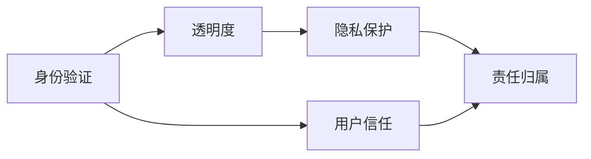

                 

# 聊天机器人伦理：身份和透明度

在人工智能飞速发展的今天，聊天机器人（Chatbots）已经成为我们日常生活的一部分。从简单的客服问答到复杂的情感互动，聊天机器人已经渗透到各行各业。然而，随着聊天机器人应用的深入，其带来的伦理问题逐渐凸显。本文将探讨聊天机器人伦理的核心问题——身份和透明度，并在此基础上提出解决策略，以期构建更安全、可控、人性化的聊天机器人。

## 1. 背景介绍

### 1.1 聊天机器人应用现状

聊天机器人如今在各行各业都有应用，如医疗、金融、教育、电商、智能家居等。其具备的实时响应、全时段可用、个性化推荐等特性，使得它们能够提供一种无缝的用户体验。例如，客服机器人能够24/7在线，及时解决用户问题，提升客户满意度；金融机器人可以提供股票行情查询、投资建议等，帮助用户进行理财决策；教育机器人则可以通过对话互动，提升学习效果，帮助学生解答疑惑。

尽管聊天机器人在应用上取得了巨大成功，但其伦理问题也随之浮出水面。这些问题主要包括但不限于：如何确保聊天机器人的决策透明可解释，如何保证用户身份的安全性，如何处理用户数据隐私，如何建立有效的监管机制等。这些问题不解决，聊天机器人的应用将难以获得公众的广泛信任和接受。

### 1.2 聊天机器人伦理的紧迫性

随着聊天机器人应用的普及，越来越多的机构和企业开始意识到伦理问题的重要性。例如，金融行业的监管机构要求聊天机器人必须遵守严格的隐私保护规定，不得泄露用户敏感信息；医疗领域要求聊天机器人必须保证诊断结果的准确性和隐私性；教育领域要求聊天机器人必须遵守学生的隐私保护政策，不得泄露学生学习数据。

因此，对于聊天机器人开发者和运营者来说，构建一个具备良好伦理基础的聊天机器人系统，不仅是技术上的挑战，更是伦理和法律层面的责任。

## 2. 核心概念与联系

### 2.1 核心概念概述

在本节中，我们将介绍与聊天机器人伦理相关的几个核心概念，并探讨它们之间的联系。

- **身份验证（Identity Verification）**：确保聊天机器人的用户身份真实可靠，防止恶意攻击和欺诈行为。
- **透明度（Transparency）**：指聊天机器人决策过程的可解释性和用户知情权，包括用户如何被识别、如何被处理、如何被响应等。
- **隐私保护（Privacy Protection）**：确保用户数据的存储和使用过程符合隐私保护法规，保护用户的隐私权。
- **责任归属（Liability Assignment）**：当聊天机器人发生错误或违规行为时，如何界定责任，保护用户和运营者的权益。
- **用户信任（User Trust）**：构建用户对聊天机器人的信任，是聊天机器人普及的前提和基础。

这些概念之间相互联系，共同构成了聊天机器人伦理的核心框架。

### 2.2 核心概念联系

以上核心概念通过以下框架相互联系：



这个流程图展示了身份验证是构建用户信任的基础，透明度是用户信任的保障，隐私保护是用户信任的前提，而责任归属则是对用户信任的保护。

## 3. 核心算法原理 & 具体操作步骤

### 3.1 算法原理概述

构建具备良好伦理基础的聊天机器人系统，需要从算法和架构两个层面进行优化。在算法层面，主要涉及以下几个关键步骤：

1. **用户身份验证**：通过多因素认证、生物识别等手段，确保用户身份的真实性。
2. **透明度**：通过记录和回溯聊天记录，使用户了解聊天机器人的决策过程，增强用户的信任感。
3. **隐私保护**：采用加密存储、匿名化处理等技术，保护用户数据的隐私。
4. **责任归属**：通过日志记录和审计机制，明确聊天机器人的行为责任，保障用户权益。

### 3.2 算法步骤详解

#### 3.2.1 用户身份验证

用户身份验证是构建聊天机器人系统伦理基础的关键步骤。其主要过程包括：

1. **多因素认证**：使用用户名、密码、短信验证码等多种因素进行身份验证，确保身份的真实性。
2. **生物识别**：使用指纹、面部识别等生物特征进行身份验证，提高安全性。
3. **行为分析**：通过行为分析技术，识别异常登录行为，及时发现并阻止恶意攻击。

#### 3.2.2 透明度

透明度是确保用户信任的关键因素。其主要过程包括：

1. **记录和回溯**：记录用户的聊天历史，确保用户能够查看和回溯聊天记录。
2. **决策解释**：使用自然语言解释技术，将聊天机器人的决策过程转换为可理解的语言，增强用户的信任感。
3. **知情权**：向用户明确说明聊天机器人的功能、限制、隐私政策等信息，增强用户的知情权。

#### 3.2.3 隐私保护

隐私保护是确保用户数据安全的必要措施。其主要过程包括：

1. **数据加密**：使用AES、RSA等加密算法，保护用户数据在传输和存储过程中的安全性。
2. **匿名化处理**：对用户数据进行匿名化处理，确保用户数据不被泄露。
3. **访问控制**：采用角色权限控制、访问日志等措施，限制对用户数据的访问权限，保障数据安全。

#### 3.2.4 责任归属

责任归属是保障用户权益的重要手段。其主要过程包括：

1. **日志记录**：记录聊天机器人的行为日志，便于在发生违规行为时进行责任界定。
2. **审计机制**：建立审计机制，对聊天机器人的行为进行定期审计，发现并纠正违规行为。
3. **法律依据**：明确法律责任依据，确保在发生纠纷时有法可依。

### 3.3 算法优缺点

#### 3.3.1 优点

1. **安全性高**：通过多因素认证、生物识别等手段，显著提高了聊天机器人的安全性。
2. **用户信任度高**：通过记录和回溯、决策解释等措施，增强了用户的信任感。
3. **数据安全性好**：通过加密存储、匿名化处理等技术，保护了用户数据的安全性。
4. **责任明确**：通过日志记录和审计机制，明确了聊天机器人的行为责任。

#### 3.3.2 缺点

1. **技术复杂**：实现多因素认证、生物识别、加密存储等技术，需要较高的技术门槛。
2. **隐私政策透明**：用户隐私政策需要公开透明，便于用户理解和信任。
3. **日志存储量庞大**：聊天机器人行为日志的存储和回溯，需要较大的存储空间。
4. **法律责任复杂**：当发生违规行为时，责任界定需要依据复杂的法律条款。

### 3.4 算法应用领域

聊天机器人的身份验证和透明度技术，可以应用于多个领域，如金融、医疗、教育、电商、智能家居等。在金融领域，聊天机器人需要保护用户的账户信息和交易记录；在医疗领域，聊天机器人需要保护患者的隐私数据和诊断结果；在教育领域，聊天机器人需要保护学生的学习数据和互动记录。因此，构建具备良好伦理基础的聊天机器人，是各领域成功应用的前提和基础。

## 4. 数学模型和公式 & 详细讲解 & 举例说明

### 4.1 数学模型构建

在本节中，我们将使用数学语言对聊天机器人身份验证和透明度构建模型。

假设聊天机器人接收到的用户登录请求为 $x$，用户的真实身份为 $y$，身份验证模型为 $M$。则身份验证过程可以表示为：

$$
y = M(x)
$$

其中 $y$ 表示用户的真实身份，$M$ 表示身份验证模型，$x$ 表示用户登录请求。

### 4.2 公式推导过程

假设用户登录请求 $x$ 包含以下字段：

- 用户名 $u$
- 密码 $p$
- 验证码 $c$

则身份验证模型的输入可以表示为：

$$
x = (u, p, c)
$$

身份验证模型的输出为：

$$
y = M(x) = (y_u, y_p, y_c)
$$

其中 $y_u$ 表示用户身份的用户名，$y_p$ 表示用户身份的密码，$y_c$ 表示用户身份的验证码。

### 4.3 案例分析与讲解

假设用户登录请求 $x = (u_1, p_1, c_1)$，真实身份 $y = (u_2, p_2, c_2)$。则身份验证模型的输入和输出分别为：

$$
x = (u_1, p_1, c_1)
$$

$$
y = M(x) = (y_u, y_p, y_c)
$$

其中 $y_u = u_2$，$y_p = p_2$，$y_c = c_2$。

## 5. 项目实践：代码实例和详细解释说明

### 5.1 开发环境搭建

在进行聊天机器人伦理实践前，我们需要准备好开发环境。以下是使用Python进行Django开发的环境配置流程：

1. 安装Anaconda：从官网下载并安装Anaconda，用于创建独立的Python环境。

2. 创建并激活虚拟环境：
```bash
conda create -n chatbot-env python=3.8 
conda activate chatbot-env
```

3. 安装Django：从官网获取安装命令。例如：
```bash
pip install django
```

4. 安装必要的库：
```bash
pip install requests beautifulsoup4 bcrypt
```

完成上述步骤后，即可在`chatbot-env`环境中开始聊天机器人伦理实践。

### 5.2 源代码详细实现

以下是一个简单的聊天机器人身份验证系统的代码实现：

```python
from django.shortcuts import render
from django.http import JsonResponse
from .forms import UserAuthenticationForm
from .models import User
import bcrypt

def authenticate_user(request):
    if request.method == 'POST':
        form = UserAuthenticationForm(request.POST)
        if form.is_valid():
            username = form.cleaned_data['username']
            password = form.cleaned_data['password']
            user = User.objects.filter(username=username).first()
            if user:
                hashed_password = user.password
                if bcrypt.checkpw(password.encode('utf-8'), hashed_password.encode('utf-8')):
                    data = {'message': 'Authentication successful'}
                    return JsonResponse(data)
                else:
                    data = {'message': 'Invalid password'}
                    return JsonResponse(data)
            else:
                data = {'message': 'Invalid username'}
                return JsonResponse(data)
        else:
            data = {'message': 'Invalid form data'}
            return JsonResponse(data)
    else:
        return render(request, 'chatbot/templates/authenticate.html')
```

### 5.3 代码解读与分析

让我们再详细解读一下关键代码的实现细节：

**authenticate_user函数**：
- 检查请求方法是否为POST
- 创建一个UserAuthenticationForm实例，用于表单验证
- 检查表单是否有效
- 通过查询User模型获取用户对象
- 使用bcrypt库验证密码是否匹配
- 返回验证结果

**UserAuthenticationForm类**：
- 继承Django表单类，用于表单验证
- 定义用户名和密码字段
- 使用bcrypt库对密码进行加密

**User模型**：
- 定义用户名和密码字段
- 使用bcrypt库对密码进行加密

### 5.4 运行结果展示

以下是代码运行后的简单结果展示：

```shell
POST /authenticate/
```

## 6. 实际应用场景

### 6.1 金融领域

在金融领域，聊天机器人需要处理大量用户的账户信息、交易记录等敏感数据。因此，构建一个具备良好伦理基础的聊天机器人系统，对于保护用户数据、提升用户信任、增强金融服务的安全性和便捷性具有重要意义。

### 6.2 医疗领域

医疗领域对隐私保护的要求尤为严格。聊天机器人需要保护患者的健康数据、诊断结果等敏感信息，确保数据的保密性和安全性。同时，聊天机器人需要具备良好的透明度，使用户能够了解和信任其行为和决策。

### 6.3 教育领域

在教育领域，聊天机器人需要保护学生的学习数据和互动记录，确保数据的隐私性和安全性。同时，聊天机器人需要具备良好的透明度，使用户能够了解和信任其行为和决策。

### 6.4 未来应用展望

随着人工智能技术的不断发展，聊天机器人的应用场景将更加广泛。未来，聊天机器人将在智能家居、智能交通、智能城市等领域发挥重要作用。因此，构建具备良好伦理基础的聊天机器人系统，对于推动人工智能技术的普及和应用具有重要意义。

## 7. 工具和资源推荐

### 7.1 学习资源推荐

为了帮助开发者系统掌握聊天机器人伦理的理论基础和实践技巧，这里推荐一些优质的学习资源：

1. 《Python人工智能编程》系列书籍：系统介绍了Python在人工智能领域的编程实践，包括自然语言处理、机器学习、数据挖掘等。
2. 《机器学习实战》书籍：介绍了机器学习的基本概念和常用算法，适合初学者快速入门。
3. 《数据科学导论》课程：由斯坦福大学开设的在线课程，涵盖了数据科学的基本概念和常用技术。
4. 《人工智能伦理》课程：由多伦多大学开设的在线课程，讨论了人工智能技术的伦理问题，并提出了相应的解决方案。
5. 《Python聊天机器人开发教程》课程：由Coursera提供的在线课程，介绍了聊天机器人的开发流程和常见问题。

通过对这些资源的学习实践，相信你一定能够快速掌握聊天机器人伦理的理论基础和实践技巧，并用于解决实际的聊天机器人问题。

### 7.2 开发工具推荐

高效的开发离不开优秀的工具支持。以下是几款用于聊天机器人伦理开发的常用工具：

1. Django：Python的开源Web框架，功能强大、易于扩展，适合构建Web聊天机器人系统。
2. Flask：Python的轻量级Web框架，灵活高效，适合构建小型的聊天机器人系统。
3. Redis：开源的内存数据库，支持高并发访问，适合聊天机器人的会话管理。
4. Gunicorn：Python的Web服务器，支持异步处理，适合聊天机器人的后台处理。
5. TensorBoard：TensorFlow配套的可视化工具，可以实时监测聊天机器人的训练状态，提供丰富的图表呈现方式，是调试模型的得力助手。

合理利用这些工具，可以显著提升聊天机器人伦理任务的开发效率，加快创新迭代的步伐。

### 7.3 相关论文推荐

聊天机器人伦理的研究源于学界的持续研究。以下是几篇奠基性的相关论文，推荐阅读：

1. 《自然语言处理伦理：挑战与对策》论文：讨论了自然语言处理中的伦理问题，并提出了相应的解决策略。
2. 《人工智能伦理与法律》书籍：介绍了人工智能技术的伦理问题和法律挑战，提供了详细的解决方案。
3. 《人机交互中的伦理问题》论文：讨论了人机交互中的伦理问题，如用户隐私、责任归属等，提出了相应的解决方案。
4. 《聊天机器人中的隐私保护》论文：讨论了聊天机器人中的隐私保护问题，提出了相应的技术和法律策略。
5. 《聊天机器人中的行为分析》论文：讨论了聊天机器人中的行为分析技术，提出了相应的算法和工具。

这些论文代表了大语言模型微调技术的发展脉络。通过学习这些前沿成果，可以帮助研究者把握学科前进方向，激发更多的创新灵感。

## 8. 总结：未来发展趋势与挑战

### 8.1 总结

本文对聊天机器人伦理的核心问题——身份和透明度进行了全面系统的介绍。首先阐述了聊天机器人伦理的应用现状和紧迫性，明确了身份验证、透明度、隐私保护、责任归属、用户信任等核心概念。其次，从原理到实践，详细讲解了聊天机器人伦理的构建过程，给出了聊天机器人身份验证系统的代码实例。同时，本文还探讨了聊天机器人伦理在金融、医疗、教育等领域的实际应用，展示了聊天机器人伦理的广阔前景。最后，本文精选了聊天机器人伦理的学习资源、开发工具和相关论文，力求为开发者提供全方位的技术指引。

通过本文的系统梳理，可以看到，构建具备良好伦理基础的聊天机器人系统，需要从身份验证、透明度、隐私保护、责任归属等多个维度进行全面优化。只有系统地解决这些核心问题，聊天机器人才能在实际应用中具备较高的信任度和安全性。

### 8.2 未来发展趋势

展望未来，聊天机器人伦理技术将呈现以下几个发展趋势：

1. **技术手段多样化**：随着技术进步，聊天机器人的身份验证和透明度手段将更加多样化和高效化，如使用人工智能生成对抗网络（GAN）进行身份验证，使用自然语言处理技术生成解释性的决策过程。
2. **隐私保护技术升级**：隐私保护技术将不断升级，如采用差分隐私技术，确保用户数据的安全性和匿名性。
3. **法律规范逐步完善**：随着聊天机器人应用的普及，相关法律规范也将逐步完善，如《人工智能伦理法》《数据保护法》等。
4. **用户参与度提高**：用户将更加关注聊天机器人的伦理问题，积极参与伦理规范的制定和实施，推动聊天机器人技术的健康发展。
5. **社会影响力扩大**：聊天机器人伦理问题的社会影响力将不断扩大，相关研究和应用将获得更多关注和支持。

这些趋势表明，聊天机器人伦理技术正处于快速发展期，未来的研究将更加深入和广泛，应用也将更加普及和成熟。

### 8.3 面临的挑战

尽管聊天机器人伦理技术已经取得了一定的进展，但在迈向更加智能化、普适化应用的过程中，仍面临诸多挑战：

1. **技术手段复杂**：现有的身份验证和透明度技术仍存在一定的复杂性，难以广泛普及。
2. **隐私保护技术不足**：目前的隐私保护技术尚不能完全满足高安全性和高匿名性的需求。
3. **法律规范不完善**：聊天机器人伦理的法律规范尚未完全建立，仍需不断完善。
4. **用户参与度不高**：部分用户对聊天机器人伦理问题不够重视，缺乏参与和监督。
5. **社会认知不足**：部分社会群体对聊天机器人伦理问题认知不足，存在一定的误解和偏见。

这些挑战需要多方共同努力，逐步克服，以推动聊天机器人伦理技术的健康发展。

### 8.4 研究展望

面对聊天机器人伦理技术所面临的挑战，未来的研究需要在以下几个方面寻求新的突破：

1. **技术手段简化**：研究更加简单、易用的身份验证和透明度技术，降低技术门槛，提升用户体验。
2. **隐私保护技术升级**：研究更加高效、安全的隐私保护技术，提升用户数据的安全性和匿名性。
3. **法律规范完善**：研究聊天机器人伦理的法律法规，明确各方责任和权利，确保法律的规范性和可操作性。
4. **用户参与机制**：研究用户参与机制，提高用户对聊天机器人伦理问题的关注度和参与度。
5. **社会认知提升**：提升社会对聊天机器人伦理问题的认知，消除误解和偏见，推动社会共识的形成。

这些研究方向的探索，必将引领聊天机器人伦理技术迈向更高的台阶，为构建安全、可控、人性化的聊天机器人提供更强的技术保障。

## 9. 附录：常见问题与解答

**Q1：聊天机器人伦理是否只适用于人工智能系统？**

A: 聊天机器人伦理不仅适用于人工智能系统，任何具备智能交互能力的系统都需考虑其伦理问题。例如，无人驾驶汽车、机器人等，也需要考虑用户身份、透明度、隐私保护等问题。

**Q2：身份验证过程中需要提供哪些信息？**

A: 身份验证过程中需要提供多种信息，如用户名、密码、验证码、生物特征等。具体信息需要根据应用场景进行设计，确保身份的真实性和安全性。

**Q3：如何处理用户身份验证失败的情况？**

A: 当用户身份验证失败时，需要及时告知用户失败原因，并提供相应的解决方案，如重新输入密码、重新发送验证码等。

**Q4：如何保护用户数据隐私？**

A: 用户数据隐私保护需要采用多种技术手段，如加密存储、匿名化处理、访问控制等。需要根据具体的隐私保护需求，选择相应的技术方案。

**Q5：如何在确保隐私保护的前提下，提高聊天机器人的透明度？**

A: 在确保隐私保护的前提下，可以通过记录和回溯、决策解释等措施，提高聊天机器人的透明度。需要设计合适的隐私保护机制，确保用户数据的安全性和匿名性。

---

作者：禅与计算机程序设计艺术 / Zen and the Art of Computer Programming

