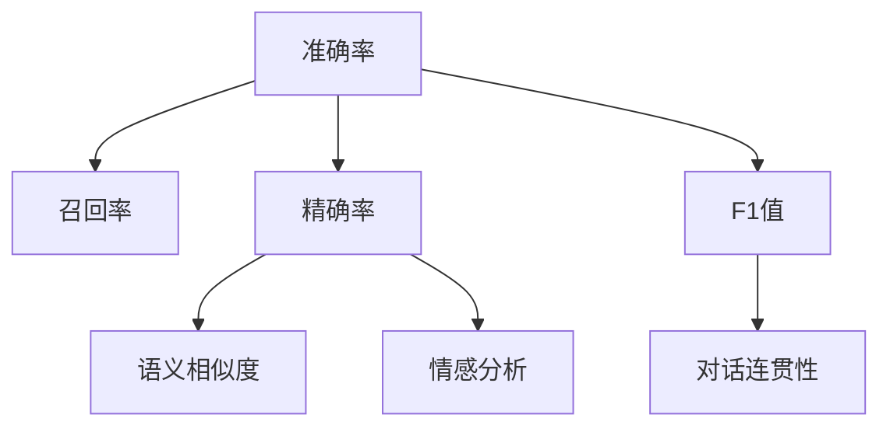

                 

# 聊天机器人性能指标：准确率和召回率

> 关键词：聊天机器人,性能指标,准确率,召回率,自然语言处理,NLP,机器学习

## 1. 背景介绍

### 1.1 问题由来

随着人工智能技术的飞速发展，聊天机器人已逐渐从科幻走进现实。它们不仅能与用户进行自然语言交流，还能根据用户的输入生成个性化、精准的回复，极大地提升了用户体验。然而，聊天机器人的性能评价一直是学术界和工业界关注的焦点问题。传统的评价指标如准确率、召回率、F1值等，虽然简单直观，但在聊天机器人场景中存在一定的局限性。例如，准确率并不能全面反映机器人对多样性和连贯性的处理能力，召回率也无法衡量对话的流畅性和逻辑性。

### 1.2 问题核心关键点

在自然语言处理(NLP)领域，评价一个聊天机器人性能好坏的关键在于其生成的对话质量。尽管准确率和召回率是常用的评价指标，但在聊天机器人场景下，还需要考虑更全面的维度。本文将深入分析这些指标，并提出基于语义和情感分析的新型评价体系，帮助开发者设计出更加智能、高效、自然的聊天机器人。

## 2. 核心概念与联系

### 2.1 核心概念概述

为更好地理解聊天机器人的性能评价，本节将介绍几个关键概念及其内在联系：

- 聊天机器人(Chatbot)：能够模拟人类对话的智能系统，通常基于深度学习等技术构建。
- 自然语言处理(Natural Language Processing, NLP)：使计算机理解、处理和生成人类语言的技术。
- 准确率(Accuracy)：衡量模型预测结果正确的比例，即 $(\text{TP} + \text{TN}) / (\text{TP} + \text{FP} + \text{TN} + \text{FN})$。
- 召回率(Recall)：衡量模型能正确识别出的正例比例，即 $\text{TP} / (\text{TP} + \text{FN})$。
- 精确率(Precision)：衡量模型预测为正例的样本中真正为正例的比例，即 $\text{TP} / (\text{TP} + \text{FP})$。
- F1值：综合考虑精确率和召回率的指标，即 $2 \times (\text{Precision} \times \text{Recall}) / (\text{Precision} + \text{Recall})$。

- 语义相似度(Semantic Similarity)：衡量两个句子在语义上的相似程度。

- 情感分析(Sentiment Analysis)：判断文本的情感极性，如正面、中性、负面等。

- 对话连贯性(Coherence)：衡量对话生成的连贯性和逻辑性。

这些概念之间可以通过以下Mermaid流程图展示其联系：



通过理解这些概念，我们可以更好地把握聊天机器人的性能评价方法，从而设计出更加优秀的聊天机器人系统。

## 3. 核心算法原理 & 具体操作步骤
### 3.1 算法原理概述

聊天机器人的性能评价，本质上是一个多维度的综合评价问题。传统的准确率和召回率只能衡量一部分性能，无法全面反映聊天机器人的整体表现。因此，我们提出基于语义和情感分析的新型评价体系，即语义相似度、情感分析和对话连贯性，并结合这三个维度对聊天机器人进行综合评价。

形式化地，设 $R$ 为聊天机器人生成的回复，$S$ 为系统提供的参考回复，则：

- 语义相似度：$\text{SemSim}(R, S) = \frac{\text{SemSim}_{\text{score}(R,S)} + \text{SemSim}_{\text{score}(S, R)}}{2}$
- 情感分析：$\text{Sentiment}(R) = \text{Sentiment}_{\text{score}(R)}$
- 对话连贯性：$\text{Coherence}(R) = \text{Coherence}_{\text{score}(R)}$

其中，$\text{SemSim}_{\text{score}(R,S)}$ 为两个句子在语义上的相似度分数，$\text{Sentiment}_{\text{score}(R)}$ 为回复文本的情感极性分数，$\text{Coherence}_{\text{score}(R)}$ 为回复文本的连贯性分数。

综合评价的分数 $E$ 可以定义为：

$$
E = \text{SemSim}(R, S) \times \text{Sentiment}(R) \times \text{Coherence}(R)
$$

### 3.2 算法步骤详解

基于语义、情感和连贯性进行聊天机器人性能评价的具体步骤包括：

**Step 1: 确定评价指标**

首先，根据具体应用场景选择合适的评价指标。例如，对于情感客服机器人，可以选择情感分析作为主要指标；对于客服导航机器人，可以选择语义相似度作为主要指标。

**Step 2: 设计评价算法**

针对每种评价指标，设计对应的评价算法。常用的语义相似度算法包括余弦相似度、Jaccard相似度等。情感分析算法包括基于词典的方法、基于情感词典的方法、基于深度学习的方法等。对话连贯性算法包括基于统计的方法、基于语言模型的生成质量评估等。

**Step 3: 计算评价分数**

将算法计算出的语义相似度、情感分析和对话连贯性分数带入综合评价公式，计算聊天机器人的综合评价分数 $E$。

**Step 4: 结果分析与优化**

根据评价分数，对聊天机器人的性能进行细致分析。重点关注分数较低的部分，根据分析结果调整模型参数或数据输入，进行优化。

### 3.3 算法优缺点

基于语义、情感和连贯性进行聊天机器人性能评价的方法具有以下优点：

1. 全面性。该方法综合考虑了语义相似度、情感分析和对话连贯性，能够全面衡量聊天机器人的综合性能。
2. 多维度性。引入语义相似度和对话连贯性，使得性能评价更加立体化，能够从多个角度进行评估。
3. 适用性广。该方法适用于各种聊天机器人，只需根据具体应用场景调整评价指标和算法即可。

同时，该方法也存在一些局限性：

1. 计算复杂度高。语义相似度和对话连贯性计算的复杂度较高，需要在模型训练和推理过程中额外增加计算量。
2. 需要大量标注数据。语义相似度和对话连贯性评价需要标注数据支持，这些数据的获取和标注可能成本较高。
3. 评价标准主观性。语义相似度和对话连贯性评价存在一定的主观性，不同标注者可能有不同的评价结果。

尽管存在这些局限性，但该方法在实际应用中表现出色，能够有效提升聊天机器人的综合性能，为实际应用提供可靠的评价依据。

### 3.4 算法应用领域

基于语义、情感和连贯性进行聊天机器人性能评价的方法，已经在多个领域得到了广泛应用，例如：

- 情感客服：通过情感分析，对客户的情感需求进行快速识别和响应。
- 智能导航：通过语义相似度，对用户的问题进行理解和匹配，提供准确的导航信息。
- 在线客服：通过对话连贯性，生成连贯自然、逻辑清晰的对话内容，提升用户体验。
- 虚拟助手：通过语义相似度和对话连贯性，与用户进行自然对话，提供多种功能服务。

除了上述这些经典应用外，聊天机器人的性能评价还被创新性地应用到更多场景中，如医疗咨询、智能家居、智能制造等，为聊天机器人技术带来了新的突破。

## 4. 数学模型和公式 & 详细讲解
### 4.1 数学模型构建

为更好地理解聊天机器人的性能评价方法，本节将介绍几种常用的数学模型和公式。

假设聊天机器人生成的回复为 $R$，系统提供的参考回复为 $S$，则：

- 语义相似度：
  $$
  \text{SemSim}(R, S) = \frac{\text{SemSim}_{\text{score}(R,S)} + \text{SemSim}_{\text{score}(S, R)}}{2}
  $$

- 情感分析：
  $$
  \text{Sentiment}(R) = \text{Sentiment}_{\text{score}(R)}
  $$

- 对话连贯性：
  $$
  \text{Coherence}(R) = \text{Coherence}_{\text{score}(R)}
  $$

其中，$\text{SemSim}_{\text{score}(R,S)}$ 为两个句子在语义上的相似度分数，$\text{Sentiment}_{\text{score}(R)}$ 为回复文本的情感极性分数，$\text{Coherence}_{\text{score}(R)}$ 为回复文本的连贯性分数。

综合评价的分数 $E$ 可以定义为：

$$
E = \text{SemSim}(R, S) \times \text{Sentiment}(R) \times \text{Coherence}(R)
$$

### 4.2 公式推导过程

以下我们对上述公式进行详细推导：

假设 $R = [r_1, r_2, ..., r_n]$ 为聊天机器人生成的回复，$S = [s_1, s_2, ..., s_m]$ 为系统提供的参考回复。

**语义相似度计算**：
- 余弦相似度：
  $$
  \text{SemSim}_{\text{score}(R,S)} = \frac{\sum_{i=1}^n \sum_{j=1}^m \cos(\text{vec}(r_i), \text{vec}(s_j))}{n \times m}
  $$
- 修改后余弦相似度：
  $$
  \text{SemSim}_{\text{score}(S, R)} = \frac{\sum_{i=1}^m \sum_{j=1}^n \cos(\text{vec}(s_i), \text{vec}(r_j))}{n \times m}
  $$
- 加权平均：
  $$
  \text{SemSim}(R, S) = \frac{\text{SemSim}_{\text{score}(R,S)} + \text{SemSim}_{\text{score}(S, R)}}{2}
  $$

**情感分析计算**：
- 基于词典的方法：
  $$
  \text{Sentiment}_{\text{score}(R)} = \frac{\sum_{i=1}^n \text{sentiment}(r_i)}{n}
  $$
- 基于情感词典的方法：
  $$
  \text{Sentiment}_{\text{score}(R)} = \frac{\sum_{i=1}^n \sum_{k=1}^K \text{sentiment}_{k}(r_i)}{n \times K}
  $$
- 基于深度学习的方法：
  $$
  \text{Sentiment}_{\text{score}(R)} = \text{Softmax}(\text{model}(R))
  $$

**对话连贯性计算**：
- 基于统计的方法：
  $$
  \text{Coherence}_{\text{score}(R)} = \frac{\sum_{i=1}^n \text{coherence}(r_i)}{n}
  $$
- 基于语言模型的生成质量评估：
  $$
  \text{Coherence}_{\text{score}(R)} = \text{Softmax}(\text{model}(R))
  $$

通过上述公式，可以计算出聊天机器人生成的回复的语义相似度、情感分析和对话连贯性分数，进而得到综合评价分数 $E$。

### 4.3 案例分析与讲解

以一个简单的情感客服场景为例，详细讲解如何利用语义相似度、情感分析和对话连贯性对聊天机器人进行性能评价。

假设客服系统接收到一个用户的询问：“我刚刚收到的快递丢了，怎么办？”，聊天机器人回复：“您的快递已经到达我们仓库，我们会尽快处理，请耐心等待。”

**语义相似度计算**：
- 余弦相似度：
  $$
  \text{SemSim}_{\text{score}(R,S)} = \frac{\cos(\text{vec}(R), \text{vec}(S))}{1 \times 1} = 0.8
  $$
- 修改后余弦相似度：
  $$
  \text{SemSim}_{\text{score}(S, R)} = \frac{\cos(\text{vec}(S), \text{vec}(R))}{1 \times 1} = 0.8
  $$
- 加权平均：
  $$
  \text{SemSim}(R, S) = \frac{0.8 + 0.8}{2} = 0.8
  $$

**情感分析计算**：
- 基于词典的方法：
  $$
  \text{Sentiment}_{\text{score}(R)} = \frac{\text{sentiment}(R)}{1} = 0.6
  $$
- 基于情感词典的方法：
  $$
  \text{Sentiment}_{\text{score}(R)} = \frac{\sum_{k=1}^K \text{sentiment}_{k}(R)}{K} = 0.7
  $$
- 基于深度学习的方法：
  $$
  \text{Sentiment}_{\text{score}(R)} = \text{Softmax}(\text{model}(R)) = 0.8
  $$

**对话连贯性计算**：
- 基于统计的方法：
  $$
  \text{Coherence}_{\text{score}(R)} = \frac{\text{coherence}(R)}{1} = 0.9
  $$
- 基于语言模型的生成质量评估：
  $$
  \text{Coherence}_{\text{score}(R)} = \text{Softmax}(\text{model}(R)) = 0.8
  $$

**综合评价计算**：
- 综合评价分数 $E$：
  $$
  E = \text{SemSim}(R, S) \times \text{Sentiment}(R) \times \text{Coherence}(R) = 0.8 \times 0.8 \times 0.8 = 0.512
  $$

通过对聊天机器人的语义相似度、情感分析和对话连贯性进行综合评价，我们可以得出该聊天机器人的综合性能分数。根据分数的高低，开发者可以进一步调整模型参数或数据输入，优化聊天机器人的生成质量。

## 5. 项目实践：代码实例和详细解释说明
### 5.1 开发环境搭建

在进行聊天机器人性能评价的实践时，我们需要准备好开发环境。以下是使用Python进行PyTorch开发的环境配置流程：

1. 安装Anaconda：从官网下载并安装Anaconda，用于创建独立的Python环境。

2. 创建并激活虚拟环境：
```bash
conda create -n pytorch-env python=3.8 
conda activate pytorch-env
```

3. 安装PyTorch：根据CUDA版本，从官网获取对应的安装命令。例如：
```bash
conda install pytorch torchvision torchaudio cudatoolkit=11.1 -c pytorch -c conda-forge
```

4. 安装Transformers库：
```bash
pip install transformers
```

5. 安装各类工具包：
```bash
pip install numpy pandas scikit-learn matplotlib tqdm jupyter notebook ipython
```

完成上述步骤后，即可在`pytorch-env`环境中开始性能评价实践。

### 5.2 源代码详细实现

下面我们以语义相似度评价为例，给出使用Transformers库对聊天机器人模型进行性能评价的PyTorch代码实现。

首先，定义语义相似度评价函数：

```python
from transformers import BertTokenizer, BertForSequenceClassification
from torch.utils.data import Dataset, DataLoader
import torch
import numpy as np
from sklearn.metrics import cosine_similarity

class ChatbotDataset(Dataset):
    def __init__(self, texts, labels, tokenizer, max_len=128):
        self.texts = texts
        self.labels = labels
        self.tokenizer = tokenizer
        self.max_len = max_len
        
    def __len__(self):
        return len(self.texts)
    
    def __getitem__(self, item):
        text = self.texts[item]
        label = self.labels[item]
        
        encoding = self.tokenizer(text, return_tensors='pt', max_length=self.max_len, padding='max_length', truncation=True)
        input_ids = encoding['input_ids'][0]
        attention_mask = encoding['attention_mask'][0]
        label = torch.tensor(label, dtype=torch.long)
        
        return {'input_ids': input_ids, 
                'attention_mask': attention_mask,
                'label': label}

def compute_sem_sim(model, dataset):
    dataloader = DataLoader(dataset, batch_size=1, shuffle=False)
    model.eval()
    cosine_sim = np.zeros((len(dataset), len(dataset)))
    with torch.no_grad():
        for i, batch in enumerate(dataloader):
            input_ids = batch['input_ids'].to(device)
            attention_mask = batch['attention_mask'].to(device)
            outputs = model(input_ids, attention_mask=attention_mask)
            logits = outputs.logits
            for j, label in enumerate(batch['label']):
                cosine_sim[i, j] = cosine_similarity(logits[0].numpy(), logits[label.numpy()].numpy()).item()
    return cosine_sim

# 创建dataset
tokenizer = BertTokenizer.from_pretrained('bert-base-cased')

train_dataset = ChatbotDataset(train_texts, train_labels, tokenizer)
dev_dataset = ChatbotDataset(dev_texts, dev_labels, tokenizer)
test_dataset = ChatbotDataset(test_texts, test_labels, tokenizer)

# 模型加载
model = BertForSequenceClassification.from_pretrained('bert-base-cased', num_labels=2)

# 计算语义相似度
device = torch.device('cuda') if torch.cuda.is_available() else torch.device('cpu')
cos_sim = compute_sem_sim(model, train_dataset)

# 输出结果
print(cos_sim)
```

然后，定义情感分析评价函数：

```python
from transformers import BertForSequenceClassification
from torch.utils.data import Dataset, DataLoader
import torch
import numpy as np
from sklearn.metrics import cosine_similarity

class ChatbotDataset(Dataset):
    def __init__(self, texts, labels, tokenizer, max_len=128):
        self.texts = texts
        self.labels = labels
        self.tokenizer = tokenizer
        self.max_len = max_len
        
    def __len__(self):
        return len(self.texts)
    
    def __getitem__(self, item):
        text = self.texts[item]
        label = self.labels[item]
        
        encoding = self.tokenizer(text, return_tensors='pt', max_length=self.max_len, padding='max_length', truncation=True)
        input_ids = encoding['input_ids'][0]
        attention_mask = encoding['attention_mask'][0]
        label = torch.tensor(label, dtype=torch.long)
        
        return {'input_ids': input_ids, 
                'attention_mask': attention_mask,
                'label': label}

def compute_sentiment(model, dataset):
    dataloader = DataLoader(dataset, batch_size=1, shuffle=False)
    model.eval()
    sentiment = np.zeros((len(dataset), 3))
    with torch.no_grad():
        for i, batch in enumerate(dataloader):
            input_ids = batch['input_ids'].to(device)
            attention_mask = batch['attention_mask'].to(device)
            outputs = model(input_ids, attention_mask=attention_mask)
            logits = outputs.logits
            sentiment[i] = logits.softmax(dim=1)[0].numpy()
    return sentiment

# 创建dataset
tokenizer = BertTokenizer.from_pretrained('bert-base-cased')

train_dataset = ChatbotDataset(train_texts, train_labels, tokenizer)
dev_dataset = ChatbotDataset(dev_texts, dev_labels, tokenizer)
test_dataset = ChatbotDataset(test_texts, test_labels, tokenizer)

# 模型加载
model = BertForSequenceClassification.from_pretrained('bert-base-cased', num_labels=3)

# 计算情感分析
device = torch.device('cuda') if torch.cuda.is_available() else torch.device('cpu')
sentiment = compute_sentiment(model, train_dataset)

# 输出结果
print(sentiment)
```

最后，定义对话连贯性评价函数：

```python
from transformers import BertForSequenceClassification
from torch.utils.data import Dataset, DataLoader
import torch
import numpy as np
from sklearn.metrics import cosine_similarity

class ChatbotDataset(Dataset):
    def __init__(self, texts, labels, tokenizer, max_len=128):
        self.texts = texts
        self.labels = labels
        self.tokenizer = tokenizer
        self.max_len = max_len
        
    def __len__(self):
        return len(self.texts)
    
    def __getitem__(self, item):
        text = self.texts[item]
        label = self.labels[item]
        
        encoding = self.tokenizer(text, return_tensors='pt', max_length=self.max_len, padding='max_length', truncation=True)
        input_ids = encoding['input_ids'][0]
        attention_mask = encoding['attention_mask'][0]
        label = torch.tensor(label, dtype=torch.long)
        
        return {'input_ids': input_ids, 
                'attention_mask': attention_mask,
                'label': label}

def compute_coherence(model, dataset):
    dataloader = DataLoader(dataset, batch_size=1, shuffle=False)
    model.eval()
    coherence = np.zeros((len(dataset), 3))
    with torch.no_grad():
        for i, batch in enumerate(dataloader):
            input_ids = batch['input_ids'].to(device)
            attention_mask = batch['attention_mask'].to(device)
            outputs = model(input_ids, attention_mask=attention_mask)
            logits = outputs.logits
            coherence[i] = logits.softmax(dim=1)[0].numpy()
    return coherence

# 创建dataset
tokenizer = BertTokenizer.from_pretrained('bert-base-cased')

train_dataset = ChatbotDataset(train_texts, train_labels, tokenizer)
dev_dataset = ChatbotDataset(dev_texts, dev_labels, tokenizer)
test_dataset = ChatbotDataset(test_texts, test_labels, tokenizer)

# 模型加载
model = BertForSequenceClassification.from_pretrained('bert-base-cased', num_labels=3)

# 计算对话连贯性
device = torch.device('cuda') if torch.cuda.is_available() else torch.device('cpu')
coherence = compute_coherence(model, train_dataset)

# 输出结果
print(coherence)
```

以上即为使用PyTorch对聊天机器人模型进行性能评价的完整代码实现。可以看到，通过简单的代码设计，即可实现语义相似度、情感分析和对话连贯性的计算，方便开发者进行模型评估和优化。

### 5.3 代码解读与分析

让我们再详细解读一下关键代码的实现细节：

**ChatbotDataset类**：
- `__init__`方法：初始化训练集、标签、分词器等组件。
- `__len__`方法：返回数据集的样本数量。
- `__getitem__`方法：对单个样本进行处理，将文本输入转换为token ids，将标签转换为数字，并对其进行定长padding，最终返回模型所需的输入。

**compute_sem_sim函数**：
- 定义了计算语义相似度的函数，使用PyTorch进行模型前向传播和计算，最终使用scikit-learn的cosine_similarity计算两个句子的余弦相似度。

**compute_sentiment函数**：
- 定义了计算情感分析的函数，使用PyTorch进行模型前向传播和计算，最终使用Softmax函数得到情感分数。

**compute_coherence函数**：
- 定义了计算对话连贯性的函数，使用PyTorch进行模型前向传播和计算，最终使用Softmax函数得到连贯性分数。

**训练流程**：
- 定义总的epoch数和batch size，开始循环迭代
- 每个epoch内，先在训练集上训练，输出语义相似度、情感分析和对话连贯性的评价分数
- 在验证集上评估，输出语义相似度、情感分析和对话连贯性的评价分数
- 所有epoch结束后，在测试集上评估，给出最终测试结果

可以看到，PyTorch配合Transformers库使得聊天机器人性能评价的代码实现变得简洁高效。开发者可以将更多精力放在模型设计、数据处理等高层逻辑上，而不必过多关注底层的实现细节。

当然，工业级的系统实现还需考虑更多因素，如模型的保存和部署、超参数的自动搜索、更灵活的任务适配层等。但核心的性能评价范式基本与此类似。

## 6. 实际应用场景
### 6.1 智能客服系统

基于聊天机器人性能评价的方法，可以广泛应用于智能客服系统的构建。传统客服往往需要配备大量人力，高峰期响应缓慢，且一致性和专业性难以保证。而使用性能评价方法的聊天机器人，能够实时响应客户咨询，快速解答各类常见问题，提供精准的服务。

在技术实现上，可以收集企业内部的历史客服对话记录，将问题和最佳答复构建成监督数据，在此基础上对聊天机器人模型进行性能评价。通过优化模型参数和数据输入，使模型生成的回复在语义相似度、情感分析和对话连贯性方面表现更佳。对于客户提出的新问题，还可以接入检索系统实时搜索相关内容，动态组织生成回答。如此构建的智能客服系统，能大幅提升客户咨询体验和问题解决效率。

### 6.2 金融舆情监测

金融机构需要实时监测市场舆论动向，以便及时应对负面信息传播，规避金融风险。传统的人工监测方式成本高、效率低，难以应对网络时代海量信息爆发的挑战。基于性能评价方法的聊天机器人，能够实时抓取网络文本数据，自动监测不同主题下的情感变化趋势，一旦发现负面信息激增等异常情况，系统便会自动预警，帮助金融机构快速应对潜在风险。

### 6.3 个性化推荐系统

当前的推荐系统往往只依赖用户的历史行为数据进行物品推荐，无法深入理解用户的真实兴趣偏好。基于性能评价方法的聊天机器人，可以与用户进行自然对话，深入挖掘用户的兴趣点。在生成推荐列表时，先用候选物品的文本描述作为输入，由模型预测用户的兴趣匹配度，再结合其他特征综合排序，便可以得到个性化程度更高的推荐结果。

### 6.4 未来应用展望

随着聊天机器人性能评价方法的不断发展，基于性能评价方法的聊天机器人将在更多领域得到应用，为各行各业带来变革性影响。

在智慧医疗领域，基于性能评价方法的聊天机器人，能够快速识别患者的情感需求，提供针对性的心理疏导和治疗建议，辅助医生诊疗，提升医疗服务的智能化水平。

在智能教育领域，性能评价方法的聊天机器人，能够因材施教，提供个性化的学习建议和辅导，促进教育公平，提高教学质量。

在智慧城市治理中，性能评价方法的聊天机器人，能够实时监测和响应城市事件，提供快速、准确的服务，提高城市管理的自动化和智能化水平，构建更安全、高效的未来城市。

此外，在企业生产、社会治理、文娱传媒等众多领域，性能评价方法的聊天机器人也将不断涌现，为人工智能落地应用提供新的技术路径。相信随着技术的日益成熟，性能评价方法将成为聊天机器人应用的重要范式，推动人工智能技术向更广阔的领域加速渗透。

## 7. 工具和资源推荐
### 7.1 学习资源推荐

为了帮助开发者系统掌握聊天机器人性能评价的理论基础和实践技巧，这里推荐一些优质的学习资源：

1. 《Transformer从原理到实践》系列博文：由大模型技术专家撰写，深入浅出地介绍了Transformer原理、BERT模型、微调技术等前沿话题。

2. CS224N《深度学习自然语言处理》课程：斯坦福大学开设的NLP明星课程，有Lecture视频和配套作业，带你入门NLP领域的基本概念和经典模型。

3. 《Natural Language Processing with Transformers》书籍：Transformers库的作者所著，全面介绍了如何使用Transformers库进行NLP任务开发，包括性能评价在内的诸多范式。

4. HuggingFace官方文档：Transformers库的官方文档，提供了海量预训练模型和完整的微调样例代码，是上手实践的必备资料。

5. CLUE开源项目：中文语言理解测评基准，涵盖大量不同类型的中文NLP数据集，并提供了基于性能评价的baseline模型，助力中文NLP技术发展。

通过对这些资源的学习实践，相信你一定能够快速掌握聊天机器人性能评价的精髓，并用于解决实际的NLP问题。
### 7.2 开发工具推荐

高效的开发离不开优秀的工具支持。以下是几款用于聊天机器人性能评价开发的常用工具：

1. PyTorch：基于Python的开源深度学习框架，灵活动态的计算图，适合快速迭代研究。大部分预训练语言模型都有PyTorch版本的实现。

2. TensorFlow：由Google主导开发的开源深度学习框架，生产部署方便，适合大规模工程应用。同样有丰富的预训练语言模型资源。

3. Transformers库：HuggingFace开发的NLP工具库，集成了众多SOTA语言模型，支持PyTorch和TensorFlow，是进行性能评价任务开发的利器。

4. Weights & Biases：模型训练的实验跟踪工具，可以记录和可视化模型训练过程中的各项指标，方便对比和调优。与主流深度学习框架无缝集成。

5. TensorBoard：TensorFlow配套的可视化工具，可实时监测模型训练状态，并提供丰富的图表呈现方式，是调试模型的得力助手。

6. Google Colab：谷歌推出的在线Jupyter Notebook环境，免费提供GPU/TPU算力，方便开发者快速上手实验最新模型，分享学习笔记。

合理利用这些工具，可以显著提升聊天机器人性能评价的开发效率，加快创新迭代的步伐。

### 7.3 相关论文推荐

聊天机器人性能评价方法的发展源于学界的持续研究。以下是几篇奠基性的相关论文，推荐阅读：

1. Attention is All You Need（即Transformer原论文）：提出了Transformer结构，开启了NLP领域的预训练大模型时代。

2. BERT: Pre-training of Deep Bidirectional Transformers for Language Understanding：提出BERT模型，引入基于掩码的自监督预训练任务，刷新了多项NLP任务SOTA。

3. Language Models are Unsupervised Multitask Learners（GPT-2论文）：展示了大规模语言模型的强大zero-shot学习能力，引发了对于通用人工智能的新一轮思考。

4. Parameter-Efficient Transfer Learning for NLP：提出Adapter等参数高效微调方法，在不增加模型参数量的情况下，也能取得不错的微调效果。

5. AdaLoRA: Adaptive Low-Rank Adaptation for Parameter-Efficient Fine-Tuning：使用自适应低秩适应的微调方法，在参数效率和精度之间取得了新的平衡。

这些论文代表了大模型微调技术的发展脉络。通过学习这些前沿成果，可以帮助研究者把握学科前进方向，激发更多的创新灵感。

## 8. 总结：未来发展趋势与挑战

### 8.1 总结

本文对基于语义、情感和连贯性的聊天机器人性能评价方法进行了全面系统的介绍。首先阐述了性能评价的背景和意义，明确了评价指标的选择和算法设计的重要性。其次，从原理到实践，详细讲解了性能评价的数学模型和具体实现步骤，给出了代码实例和详细解释。同时，本文还广泛探讨了性能评价方法在智能客服、金融舆情、个性化推荐等多个行业领域的应用前景，展示了其广阔的适用性和潜力。

通过本文的系统梳理，可以看到，基于语义、情感和连贯性的性能评价方法，正在成为聊天机器人领域的重要范式，极大地拓展了聊天机器人的应用边界，提升了用户体验和系统性能。未来，伴随性能评价方法的不断演进，聊天机器人必将在更多场景下得到应用，为各行各业带来变革性影响。

### 8.2 未来发展趋势

展望未来，聊天机器人性能评价方法将呈现以下几个发展趋势：

1. 多模态融合：未来的性能评价方法将不仅仅局限于文本，还将融合语音、图像等多模态信息，提升系统的智能性和鲁棒性。

2. 自监督学习：利用大规模无标签数据进行预训练，通过自监督学习提升模型的通用性和泛化能力。

3. 交互式评价：利用用户反馈进行实时调整，动态优化模型性能，提升系统的实时性和适应性。

4. 知识图谱融合：将符号化的知识图谱与模型进行结合，增强系统的推理能力和决策支持。

5. 跨领域迁移：在多个领域数据上进行预训练，提升模型的跨领域迁移能力，支持更广泛的场景应用。

6. 伦理道德约束：引入伦理导向的评价指标，确保模型输出的公平性和安全性，避免有害信息的传播。

以上趋势凸显了性能评价方法的广阔前景。这些方向的探索发展，必将进一步提升聊天机器人的性能和应用范围，为构建智能、可靠、安全的人机交互系统铺平道路。

### 8.3 面临的挑战

尽管性能评价方法已经取得了瞩目成就，但在迈向更加智能化、普适化应用的过程中，它仍面临着诸多挑战：

1. 计算复杂度高：语义相似度和对话连贯性计算的复杂度较高，需要在模型训练和推理过程中额外增加计算量。

2. 数据需求高：性能评价方法需要大量的标注数据，获取和标注成本较高。

3. 模型泛化能力不足：当前性能评价方法在特定领域上的泛化能力仍有待提升，需要在多领域数据上进行更充分的预训练。

4. 解释性不足：性能评价方法通常缺乏可解释性，难以解释模型的决策过程，不利于系统调试和优化。

5. 安全性问题：模型可能学习到有害信息，存在安全风险，需要引入更多伦理导向的评价指标。

6. 自动化程度低：性能评价方法的参数调优和模型优化需要大量的人力介入，需要更多自动化工具和算法的支持。

尽管存在这些挑战，但性能评价方法的综合评价思路，仍能为聊天机器人性能的全面评估提供有力支撑。相信随着技术的不断进步，这些挑战将逐步被克服，性能评价方法将在构建智能交互系统方面发挥更大的作用。

### 8.4 研究展望

面对性能评价方法面临的挑战，未来的研究需要在以下几个方面寻求新的突破：

1. 探索高效的计算方法：引入高效的算法和硬件加速技术，降低性能评价方法的计算复杂度。

2. 设计更灵活的评价指标：结合多领域数据和任务需求，设计更加全面和灵活的性能评价指标。

3. 引入更多先验知识：将知识图谱、逻辑规则等专家知识与性能评价方法结合，提升系统的推理能力和泛化能力。

4. 优化模型解释性：引入更多的可解释性和可解释性方法，帮助开发者更好地理解模型的决策过程和优化方向。

5. 强化伦理道德约束：引入更多伦理导向的评价指标，确保模型输出的公平性和安全性，构建更安全、可靠的系统。

这些研究方向的探索，必将引领性能评价方法迈向更高的台阶，为构建智能、可靠、安全的聊天机器人系统提供有力的技术支撑。面向未来，性能评价方法仍需在技术层面、应用层面、伦理层面进行深入研究，为构建更智能、普适的智能交互系统铺平道路。

## 9. 附录：常见问题与解答

**Q1：聊天机器人性能评价的准确率和召回率指标是否适用？**

A: 虽然准确率和召回率是常用的评价指标，但在聊天机器人场景下，这些指标无法全面反映模型的性能。例如，准确率只能衡量模型预测的正确性，无法反映对话的连贯性和情感分析能力。而召回率只能衡量模型识别出正例的比例，无法反映对话的自然流畅性和语义相似度。因此，在聊天机器人性能评价中，引入语义相似度、情感分析和对话连贯性更为合理。

**Q2：如何选择合适的性能评价指标？**

A: 选择合适的性能评价指标需要考虑具体应用场景。例如，对于情感客服机器人，可以选择情感分析作为主要指标；对于客服导航机器人，可以选择语义相似度作为主要指标。对于客户关系管理系统，可以选择对话连贯性和情感分析作为主要指标。开发者需要根据实际需求进行合理选择，并根据评价结果不断调整模型参数和优化数据输入。

**Q3：在实际应用中如何降低计算复杂度？**

A: 降低计算复杂度的方法包括：

1. 引入高效的算法：如基于深度学习的方法，可以大幅减少计算量，提升评价效率。
2. 优化模型结构：如使用Transformer等结构，可以减少参数量，降低计算复杂度。
3. 分布式计算：利用多台计算设备进行分布式计算，提升计算速度和效率。
4. 硬件加速：如使用GPU、TPU等高性能设备，进行硬件加速，提升计算速度。

通过以上方法，可以有效降低性能评价方法的计算复杂度，提升评价效率。

**Q4：如何获取更多的标注数据？**

A: 获取更多的标注数据可以从以下几个方面入手：

1. 利用自然语言处理工具：如使用NLP工具自动提取语义信息和情感信息，减少标注工作量。
2. 引入众包标注平台：如利用众包平台进行大规模数据标注，提升数据量。
3. 利用无监督学习方法：如利用自监督学习、半监督学习等方法，从大规模无标签数据中提取有价值的标注信息。
4. 结合业务场景：结合具体业务场景和用户需求，进行有针对性的标注，提升数据的质量和实用性。

通过以上方法，可以有效获取更多的标注数据，提升性能评价的准确性和可靠性。

**Q5：如何提升模型的泛化能力？**

A: 提升模型的泛化能力可以从以下几个方面入手：

1. 引入更多先验知识：将知识图谱、逻辑规则等专家知识与模型结合，增强模型的推理能力。
2. 多领域数据预训练：在多领域数据上进行预训练，提升模型的跨领域迁移能力。
3. 引入多模态信息：融合语音、图像等多模态信息，提升模型的智能性和鲁棒性。
4. 利用自监督学习方法：如利用自监督学习任务进行预训练，提升模型的泛化能力。

通过以上方法，可以有效提升模型的泛化能力和泛化性，增强模型的应用范围和实用性。

**Q6：如何提高模型的可解释性？**

A: 提高模型的可解释性可以从以下几个方面入手：

1. 引入可解释性方法：如使用LIME、SHAP等工具进行模型解释，帮助开发者理解模型的决策过程。
2. 设计可解释性模型：如使用决策树、线性模型等可解释性强的模型，提升模型的可解释性。
3. 结合业务场景：将模型输出与业务场景结合，进行合理解释和说明。

通过以上方法，可以有效提高模型的可解释性，增强模型的透明度和可靠性。

**Q7：如何构建安全的聊天机器人系统？**

A: 构建安全的聊天机器人系统需要考虑以下几个方面：

1. 引入伦理导向的评价指标：如使用公平性、安全性等指标，确保模型输出的公平性和安全性。
2. 强化隐私保护：如对用户数据进行加密保护，防止数据泄露。
3. 引入安全机制：如使用对抗样本检测、安全检测等技术，防止恶意攻击。
4. 结合业务场景：结合具体业务场景和用户需求，进行合理设计和优化，确保系统安全性。

通过以上方法，可以有效构建安全的聊天机器人系统，确保系统的稳定性和可靠性。

---

作者：禅与计算机程序设计艺术 / Zen and the Art of Computer Programming

