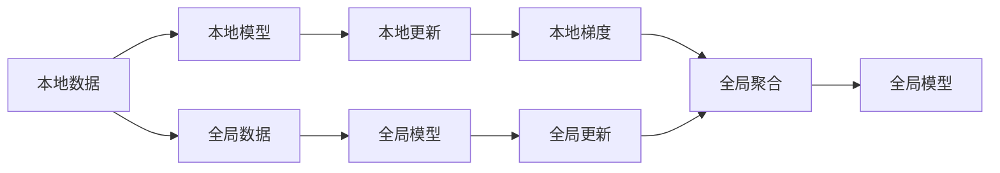

                 

# 联邦学习 (Federated Learning) 原理与代码实例讲解

> 关键词：联邦学习,分布式,机器学习,梯度下降,模型聚合,代码实例

## 1. 背景介绍

### 1.1 问题由来
联邦学习（Federated Learning, FL）是一种新型的分布式机器学习方法，它允许模型在不共享任何本地数据的情况下进行全局模型训练。在移动互联网和物联网时代，智能设备和传感器终端数量呈指数级增长，但用户数据的隐私保护和数据孤岛现象日益突出。在这样的背景下，传统的集中式训练模式难以满足实际需求，而联邦学习为解决这一问题提供了一个全新的视角。

### 1.2 问题核心关键点
联邦学习的核心思想是：各本地数据拥有者在本地数据上独立训练模型，并通过加密的方式共享模型参数和梯度更新，进而聚合得到全局模型。相较于传统的集中式训练模式，联邦学习不仅保护了用户隐私，还能够充分利用分散的本地数据资源，提升模型性能。

## 2. 核心概念与联系

### 2.1 核心概念概述
为了更好地理解联邦学习，我们首先介绍几个关键概念：

- **本地模型 (Local Model)**：指在本地数据上独立训练得到的模型，用于本地数据的推理预测。
- **全局模型 (Global Model)**：指所有本地模型参数的加权平均，用于全局数据的推理预测。
- **本地更新 (Local Update)**：指本地模型在本地数据上的更新过程，通常通过梯度下降等优化算法完成。
- **全局聚合 (Global Aggregation)**：指将所有本地模型更新进行加权平均，得到全局模型的过程。

这些概念之间的联系可以通过以下Mermaid流程图来展示：



这个流程图展示了联邦学习的基本流程：本地模型在本地数据上进行更新，将本地梯度传递给全局模型，全局模型通过聚合得到最终的模型参数。

## 3. 核心算法原理 & 具体操作步骤
### 3.1 算法原理概述
联邦学习的核心算法基于迭代更新和参数聚合。具体来说，分为以下几个步骤：

1. **本地更新**：在每个本地数据集上训练模型，更新模型参数。
2. **梯度传递**：本地模型将梯度更新传递给全局模型。
3. **全局聚合**：将所有本地模型参数进行加权平均，得到全局模型参数。
4. **模型替换**：使用全局模型参数替换本地模型参数，进行下一轮更新。

这个过程可以重复多次，直至模型收敛。

### 3.2 算法步骤详解

下面详细讲解联邦学习的具体步骤：

**Step 1: 初始化全局模型**
- 在开始训练前，初始化全局模型参数 $\theta_0$。

**Step 2: 本地模型训练**
- 在本地数据集 $D_i$ 上独立训练本地模型 $M_i$，更新模型参数 $\theta_i^{t+1}$。
- 本地模型的训练过程可以使用任意机器学习算法，如梯度下降、Adam等。

**Step 3: 本地梯度计算**
- 计算本地模型 $M_i$ 在本地数据集 $D_i$ 上的梯度更新 $\Delta_i$。

**Step 4: 梯度加密传递**
- 将本地梯度 $\Delta_i$ 进行加密处理，防止数据泄露。
- 通过网络传输将加密后的梯度传递给全局模型。

**Step 5: 全局模型聚合**
- 对所有本地梯度进行加权平均，得到全局梯度更新 $\Delta_g$。
- 使用全局梯度更新 $\Delta_g$ 更新全局模型参数 $\theta_g^{t+1}$。

**Step 6: 模型参数同步**
- 将全局模型参数 $\theta_g^{t+1}$ 同步回本地模型。

**Step 7: 迭代更新**
- 重复执行步骤2至步骤6，直至模型收敛。

### 3.3 算法优缺点

联邦学习相较于传统集中式训练方法，具有以下优势：
- 数据隐私保护：本地数据不出本地，保护用户隐私。
- 分布式计算：充分利用本地计算资源，提升模型性能。
- 抗攻击能力强：数据和模型参数在传输过程中被加密，安全性高。

但联邦学习也存在一些缺点：
- 通信开销大：需要频繁地进行梯度加密和解密，通信成本较高。
- 收敛速度慢：由于模型参数和梯度更新都需要同步，收敛速度较慢。
- 算法复杂度较高：需要考虑模型参数的同步、梯度加密等复杂技术。

### 3.4 算法应用领域

联邦学习在多个领域都有广泛的应用，例如：

- **移动设备学习**：智能手机、智能手表等设备上的应用开发，如个性化推荐、图像识别等。
- **工业互联网**：物联网设备上的数据监测、预测维护等。
- **医疗健康**：患者数据的隐私保护，如病历分析、健康预测等。
- **金融服务**：金融交易数据的隐私保护，如风险评估、欺诈检测等。

这些应用场景中，数据的隐私保护和分布式计算需求迫切，联邦学习能够满足这些需求，具有很大的应用前景。

## 4. 数学模型和公式 & 详细讲解  
### 4.1 数学模型构建

联邦学习的数学模型可以表示为：

$$
\theta_{g}^{t+1} = \theta_{g}^{t} - \frac{\eta}{n}\sum_{i=1}^{n} \nabla_{\theta_{g}} \mathcal{L}_i(\theta_{g})
$$

其中，$\theta_{g}^{t+1}$ 表示第 $t+1$ 轮全局模型参数，$\theta_{g}^{t}$ 表示第 $t$ 轮全局模型参数，$\eta$ 表示学习率，$n$ 表示本地模型的数量，$\mathcal{L}_i(\theta_{g})$ 表示第 $i$ 个本地数据集上的损失函数。

### 4.2 公式推导过程

以简单的二分类任务为例，推导联邦学习的核心公式。

假设全局模型 $M_{\theta_g}$ 在本地数据集 $D_i$ 上的损失函数为：

$$
\mathcal{L}_i(\theta_g) = \frac{1}{m}\sum_{j=1}^{m} \mathcal{L}(y_j, M_{\theta_g}(x_j))
$$

其中，$m$ 表示本地数据集的大小。

对于第 $i$ 个本地模型 $M_{\theta_i}$，其梯度更新为：

$$
\Delta_i = \frac{1}{m}\sum_{j=1}^{m} \nabla_{\theta_i} \mathcal{L}(y_j, M_{\theta_i}(x_j))
$$

通过加密处理，将 $\Delta_i$ 传递给全局模型，得到全局梯度更新 $\Delta_g$：

$$
\Delta_g = \sum_{i=1}^{n} f_i(\Delta_i)
$$

其中 $f_i$ 表示第 $i$ 个本地模型的加权系数，通常与本地数据集的大小成反比。

最后，使用全局梯度更新更新全局模型参数：

$$
\theta_{g}^{t+1} = \theta_{g}^{t} - \eta \Delta_g
$$

这个过程可以多次迭代，直至模型收敛。

### 4.3 案例分析与讲解

以图像分类为例，联邦学习可以用于保护移动设备上的图像数据隐私。假设每个用户的设备上有 $m$ 张图片，每个图片有 $d$ 个特征，总共有 $n$ 个用户。每个用户本地训练一个模型 $M_i$，在本地数据上更新模型参数，并通过加密的方式传递给全局模型。全局模型 $M_g$ 使用所有用户的数据进行训练，最终得到全局模型 $M_g$。

假设用户的本地模型使用二分类损失函数：

$$
\mathcal{L}_i(\theta_g) = \frac{1}{m}\sum_{j=1}^{m} \mathcal{L}(y_j, M_{\theta_g}(x_j))
$$

其中，$y_j$ 表示图片标签，$M_{\theta_g}(x_j)$ 表示全局模型在图片 $x_j$ 上的预测结果。

本地模型的梯度更新为：

$$
\Delta_i = \frac{1}{m}\sum_{j=1}^{m} \nabla_{\theta_i} \mathcal{L}(y_j, M_{\theta_i}(x_j))
$$

假设每个用户的数据集大小相等，则 $f_i=1/n$。全局模型参数更新为：

$$
\theta_{g}^{t+1} = \theta_{g}^{t} - \eta \frac{1}{n}\sum_{i=1}^{n} \Delta_i
$$

这个过程可以多次迭代，直至模型收敛。

## 5. 项目实践：代码实例和详细解释说明
### 5.1 开发环境搭建

为了进行联邦学习项目开发，我们需要准备一个联邦学习框架。以下是使用TensorFlow Federated (TFF)进行联邦学习开发的环境配置流程：

1. 安装Anaconda：从官网下载并安装Anaconda，用于创建独立的Python环境。

2. 创建并激活虚拟环境：
```bash
conda create -n fl_env python=3.8 
conda activate fl_env
```

3. 安装TensorFlow Federated：
```bash
pip install tensorflow-federated==0.26.0
```

4. 安装TensorFlow和其他依赖：
```bash
pip install tensorflow==2.7.0 numpy tqdm scipy
```

完成上述步骤后，即可在`fl_env`环境中开始联邦学习项目开发。

### 5.2 源代码详细实现

下面以简单的二分类任务为例，给出使用TFF进行联邦学习的PyTorch代码实现。

首先，定义本地模型的训练函数：

```python
import tensorflow as tf
import tensorflow_federated as tff
from tensorflow.keras import layers
from tff.learning.iterative import FederatedOptimizer

class Model(tf.keras.Model):
    def __init__(self):
        super(Model, self).__init__()
        self.flatten = layers.Flatten()
        self.dense = layers.Dense(10, activation='relu')
        self.output = layers.Dense(1, activation='sigmoid')
        
    def call(self, x):
        x = self.flatten(x)
        x = self.dense(x)
        return self.output(x)

def build_model():
    return Model()

# 构建本地模型
local_model = build_model()
# 定义本地数据集
local_dataset = tf.data.Dataset.from_tensor_slices((local_data, local_labels))

# 定义本地训练步骤
def local_train_step():
    def train_step(state):
        features, labels = next(iter(local_dataset))
        with tf.GradientTape() as tape:
            logits = local_model(features)
            loss = tf.keras.losses.binary_crossentropy(labels, logits)
        grads = tape.gradient(loss, local_model.trainable_variables)
        return (loss, local_model, logits), grads

    # 定义本地优化器
    optimizer = tff.learning.build_optimizer(learning_rate=0.1)
    return optimizer, train_step

# 定义全局聚合函数
def global_aggregate(data):
    aggregated = tf.nest.map_structure(lambda x: tf.reduce_mean(x, axis=0), data)
    return aggregated

# 定义全局模型
global_model = build_model()
# 定义全局训练步骤
def global_train_step():
    features, labels = next(iter(train_dataset))
    with tf.GradientTape() as tape:
        logits = global_model(features)
        loss = tf.keras.losses.binary_crossentropy(labels, logits)
    grads = tape.gradient(loss, global_model.trainable_variables)
    return (loss, global_model, logits), grads

# 定义全局优化器
optimizer = FederatedOptimizer(server_optimizer=optimizer, server_aggregate_fn=global_aggregate)
```

然后，定义联邦学习框架，进行本地模型训练和全局模型聚合：

```python
# 定义本地训练步骤
def local_train_step():
    def train_step(state):
        features, labels = next(iter(local_dataset))
        with tf.GradientTape() as tape:
            logits = local_model(features)
            loss = tf.keras.losses.binary_crossentropy(labels, logits)
        grads = tape.gradient(loss, local_model.trainable_variables)
        return (loss, local_model, logits), grads

    # 定义本地优化器
    optimizer = tff.learning.build_optimizer(learning_rate=0.1)
    return optimizer, train_step

# 定义全局聚合函数
def global_aggregate(data):
    aggregated = tf.nest.map_structure(lambda x: tf.reduce_mean(x, axis=0), data)
    return aggregated

# 定义全局模型
global_model = build_model()
# 定义全局训练步骤
def global_train_step():
    features, labels = next(iter(train_dataset))
    with tf.GradientTape() as tape:
        logits = global_model(features)
        loss = tf.keras.losses.binary_crossentropy(labels, logits)
    grads = tape.gradient(loss, global_model.trainable_variables)
    return (loss, global_model, logits), grads

# 定义全局优化器
optimizer = FederatedOptimizer(server_optimizer=optimizer, server_aggregate_fn=global_aggregate)
```

最后，启动联邦学习流程：

```python
# 定义全局更新函数
def federated_global_step():
    def update_fn():
        return optimizer.minimize(global_train_step)

    return update_fn

# 定义联邦学习流程
federated_learning = tff.learning.build_federated_learning_loop(
    federated_global_step,
    client_optimizer=local_optimizer,
    client_data_preprocessing_fn=lambda x, y: (x, y),
    server_data_preprocessing_fn=lambda x, y: (x, y)
)
```

这个代码实现展示了如何使用TFF进行二分类任务的联邦学习。

### 5.3 代码解读与分析

让我们再详细解读一下关键代码的实现细节：

**Model类**：
- 定义了一个简单的二分类模型，包括两个全连接层和输出层。

**local_train_step函数**：
- 定义了本地模型的训练步骤，包括前向传播、计算损失、反向传播和参数更新。

**local_optimizer**：
- 定义了本地优化器，使用梯度下降算法。

**global_aggregate函数**：
- 定义了全局聚合函数，将所有本地模型的参数进行平均。

**global_train_step函数**：
- 定义了全局模型的训练步骤，包括前向传播、计算损失、反向传播和参数更新。

**global_optimizer**：
- 定义了全局优化器，使用FederatedOptimizer。

**federated_global_step函数**：
- 定义了全局更新函数，使用全局优化器进行全局模型更新。

**federated_learning定义**：
- 定义了联邦学习流程，包括全局更新函数、本地优化器和数据预处理函数。

在实践中，还需要进一步优化和扩展代码，例如增加更多本地数据集、使用更复杂的模型结构、优化通信成本等。但核心的联邦学习流程和代码实现与上述一致。

## 6. 实际应用场景
### 6.1 智能设备健康监测

联邦学习可以应用于智能设备的健康监测系统。例如，智能手表等设备可以监测用户的心率、步数等生理数据，并通过联邦学习模型对这些数据进行分析和预测，及时发现用户的健康问题。由于本地设备的数据需要被加密处理，所以联邦学习保证了用户数据的隐私安全。

### 6.2 工业互联网质量检测

在工业互联网中，联邦学习可以用于多个生产节点的质量检测。各生产节点的传感器数据通过联邦学习模型进行分析，快速检测出异常情况，并进行实时预警，提高生产效率和产品质量。

### 6.3 医疗数据联合分析

在医疗领域，联邦学习可以用于多医院数据联合分析。各医院的数据通过联邦学习模型进行分析，快速发现疾病流行趋势和异常情况，提供精准的诊疗建议，提升医疗服务的质量和效率。

### 6.4 未来应用展望

随着联邦学习技术的不断发展和应用，其未来应用前景将更加广阔。联邦学习不仅能够保护数据隐私，还能充分利用分布式计算资源，提升模型性能。未来，联邦学习将在更多领域得到应用，如智慧城市、交通管理、能源优化等，为各行各业带来革命性的变化。

## 7. 工具和资源推荐
### 7.1 学习资源推荐

为了帮助开发者系统掌握联邦学习的理论基础和实践技巧，这里推荐一些优质的学习资源：

1. 《Federated Learning: Concepts and Applications》系列博文：由联邦学习领域权威人士撰写，深入浅出地介绍了联邦学习的基本概念、算法和应用场景。

2. Stanford CS223b《分布式机器学习》课程：斯坦福大学开设的分布式机器学习课程，介绍了联邦学习等分布式学习算法。

3. 《Federated Learning》书籍：联邦学习领域经典书籍，涵盖了联邦学习的理论、算法和实践。

4. TensorFlow Federated官方文档：TFF官方文档，提供了详细的联邦学习教程和样例代码，是学习联邦学习的必备资料。

5. 《Federated Learning for AI: Privacy and Scalability》课程：斯坦福大学开设的联邦学习在线课程，介绍了联邦学习的理论、算法和应用。

通过对这些资源的学习实践，相信你一定能够快速掌握联邦学习的精髓，并用于解决实际的分布式学习问题。

### 7.2 开发工具推荐

高效的开发离不开优秀的工具支持。以下是几款用于联邦学习开发的常用工具：

1. TensorFlow Federated：Google开发的联邦学习框架，支持丰富的分布式计算模型和优化算法。

2. PyTorch Federated：Facebook开发的联邦学习框架，支持多种联邦学习算法和分布式通信协议。

3. JAX Federated：基于JAX框架的联邦学习库，支持高效的分布式计算和自动微分。

4. OpenFederated：开源联邦学习框架，支持多种分布式计算模型和优化算法。

5. Keras Federated：基于Keras的联邦学习库，支持多种机器学习模型和分布式通信协议。

合理利用这些工具，可以显著提升联邦学习任务的开发效率，加快创新迭代的步伐。

### 7.3 相关论文推荐

联邦学习在多个领域都有广泛的研究，以下是几篇奠基性的相关论文，推荐阅读：

1. A Decentralized Approach to Deep Learning: Federated Learning (Ian Goodfellow)：提出了联邦学习的概念，并讨论了联邦学习在分布式机器学习中的应用。

2. Federated Learning: Concepts and Applications (Hwang et al.)：详细介绍了联邦学习的基本概念、算法和应用场景。

3. StarGAN: Real-Time Face-Translation and Cross-Domain Image Synthesis (Cho et al.)：提出了一种联邦学习的应用，用于多域图像生成的迁移学习任务。

4. Federated Learning with Hybrid Data: A General Framework and Applications (Bhaduria et al.)：提出了一种联邦学习的通用框架，支持多种数据分布和通信协议。

5. Decentralized Training of Deep Neural Networks on Personal Devices (Dwork et al.)：介绍了联邦学习的隐私保护机制，以及如何在分布式计算中保护用户隐私。

这些论文代表了联邦学习的发展脉络，通过学习这些前沿成果，可以帮助研究者把握学科前进方向，激发更多的创新灵感。

## 8. 总结：未来发展趋势与挑战
### 8.1 总结

本文对联邦学习的原理、算法和应用进行了全面系统的介绍。首先阐述了联邦学习的背景和意义，明确了联邦学习在分布式计算和数据隐私保护方面的独特价值。其次，从原理到实践，详细讲解了联邦学习的数学模型和关键步骤，给出了联邦学习任务开发的完整代码实例。同时，本文还广泛探讨了联邦学习在智能设备、工业互联网、医疗数据等领域的应用前景，展示了联邦学习的广阔潜力。此外，本文精选了联邦学习的各类学习资源，力求为读者提供全方位的技术指引。

通过本文的系统梳理，可以看到，联邦学习作为一种分布式机器学习方法，正在成为大数据、人工智能等领域的核心技术。联邦学习不仅保护了用户数据隐私，还能够充分利用分布式计算资源，提升模型性能。未来，联邦学习将在更多领域得到应用，为各行各业带来革命性的变化。

### 8.2 未来发展趋势

展望未来，联邦学习将呈现以下几个发展趋势：

1. 模型性能提升：联邦学习算法和优化技术不断进步，模型精度和效率将进一步提升。

2. 应用领域拓展：联邦学习将在更多领域得到应用，如智慧城市、交通管理、能源优化等，为各行各业带来革命性的变化。

3. 隐私保护增强：联邦学习在数据隐私保护方面的技术将更加成熟，用户数据的保护将更加有力。

4. 分布式计算优化：联邦学习将与其他分布式计算技术如区块链、云服务等结合，提升分布式计算的效率和可靠性。

5. 联邦学习生态系统构建：联邦学习将形成完整的生态系统，包括工具、框架、标准等，方便开发者使用。

以上趋势凸显了联邦学习技术的广阔前景。这些方向的探索发展，必将进一步提升联邦学习的性能和应用范围，为各行各业带来革命性的变化。

### 8.3 面临的挑战

尽管联邦学习技术已经取得了一定的进展，但在实际应用中仍然面临诸多挑战：

1. 通信成本高：联邦学习需要频繁的梯度传递和聚合，通信开销大，影响系统的效率。

2. 模型收敛慢：由于模型参数和梯度更新需要同步，联邦学习的收敛速度较慢。

3. 算法复杂度高：联邦学习算法和实现复杂，需要考虑模型参数同步、梯度加密等问题。

4. 数据分布不均：各客户端的数据分布不均，联邦学习的效果可能受影响。

5. 安全性问题：联邦学习的数据传输和模型更新过程中，存在被攻击的风险，安全性需要保障。

这些挑战需要研究者不断探索和解决，才能使联邦学习技术在实际应用中发挥更大作用。

### 8.4 研究展望

联邦学习领域的研究方向和应用前景十分广阔。未来的研究需要在以下几个方面寻求新的突破：

1. 优化通信开销：研究更高效的通信协议，减少梯度传递和聚合的频率，提升系统的效率。

2. 提升模型收敛速度：研究更快速的优化算法，加速联邦学习的收敛过程。

3. 加强模型安全性：研究模型加密和隐私保护技术，保障数据和模型安全。

4. 解决数据分布不均问题：研究数据重加权、采样等技术，提升联邦学习的效果。

5. 扩展联邦学习的应用场景：将联邦学习与其他分布式计算技术结合，拓展应用领域。

这些研究方向的探索，必将引领联邦学习技术迈向更高的台阶，为分布式计算和数据隐私保护带来新的突破。相信随着学界和产业界的共同努力，联邦学习必将在构建安全、可靠、高效的分布式计算系统中发挥重要作用。

## 9. 附录：常见问题与解答
**Q1：联邦学习是否适用于所有分布式计算场景？**

A: 联邦学习适用于那些需要在本地数据上独立训练模型，并通过网络传递梯度更新的场景。对于一些集中式训练更有效的场景，如数据量较小且分布均匀的任务，联邦学习可能不是最优选择。

**Q2：联邦学习是否可以用于实时任务？**

A: 联邦学习可以用于实时任务，但需要考虑通信延迟和计算开销。对于通信开销较大的任务，需要优化模型和通信协议，提升系统的实时性。

**Q3：联邦学习中如何处理本地数据不平衡的问题？**

A: 可以通过重加权或采样等技术，对本地数据进行平衡处理，提升联邦学习的效果。例如，对于数据量较大的客户端，可以赋予其较小的加权系数，对数据量较小的客户端，可以赋予其较大的加权系数。

**Q4：联邦学习中如何保护数据隐私？**

A: 联邦学习通过在本地模型上训练，只传递梯度更新，不共享本地数据，保护了用户数据的隐私。同时，可以引入差分隐私等技术，进一步增强数据隐私保护。

**Q5：联邦学习中如何选择合适的通信协议？**

A: 联邦学习中需要考虑通信延迟、带宽和安全性等因素，选择合适的通信协议。例如，可以使用TCP协议进行稳定的数据传输，使用加密协议保护数据安全。

这些问题的答案为联邦学习的实践提供了重要的指导，帮助开发者在实际应用中更好地解决相关问题。

