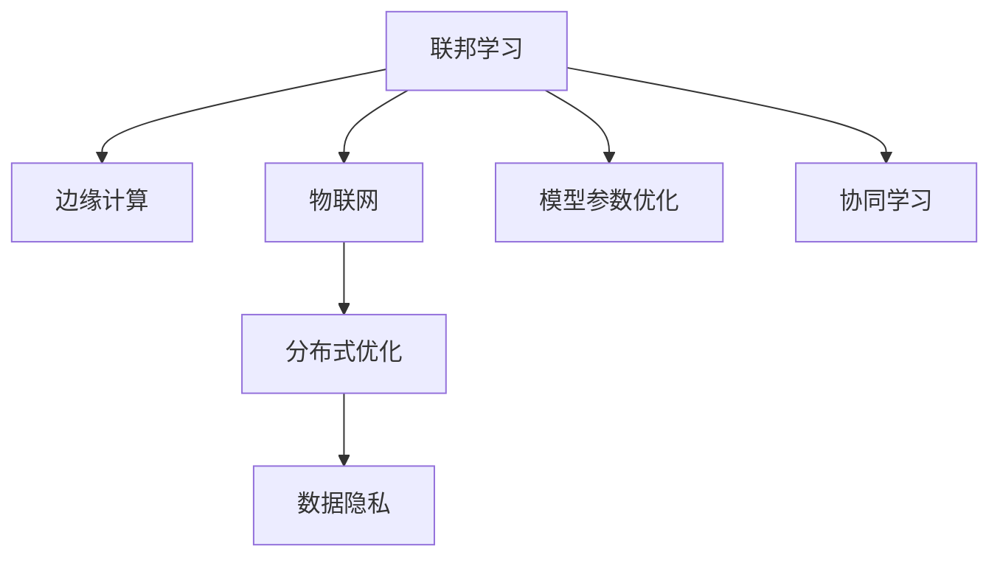

                 

# 联邦学习在物联网环境中的应用

> 关键词：联邦学习,物联网,边缘计算,数据隐私,分布式优化,实时性

## 1. 背景介绍

### 1.1 问题由来
物联网（IoT）作为连接万物的网络，正逐渐渗透到各个领域，包括智能家居、智能工厂、智慧城市等。与传统的集中式系统不同，物联网设备种类繁多，数量庞大，分布广泛，导致了传统集中式数据分析和处理方式难以适应。同时，物联网设备和数据往往涉及到用户的隐私信息，如何在保护隐私的同时进行有效的数据分析，也成为了一大挑战。联邦学习（Federated Learning, FL）应运而生，成为解决上述问题的关键技术。

联邦学习是一种分布式机器学习方法，允许多个本地设备或服务器在不共享原始数据的前提下，协作训练一个全局模型。该方法旨在最大化模型性能，同时最小化隐私泄露风险。联邦学习在物联网（IoT）环境中具有天然的优势，可满足实时性、数据隐私和安全性的要求。本文将系统介绍联邦学习的基本原理，分析其在物联网环境中的应用，探讨其面临的挑战，展望未来发展趋势。

## 2. 核心概念与联系

### 2.1 核心概念概述

为更好地理解联邦学习在物联网环境中的应用，本节将介绍几个密切相关的核心概念：

- 联邦学习：一种分布式机器学习方法，允许多个本地设备或服务器在不共享原始数据的前提下，协作训练一个全局模型。
- 边缘计算：一种分散式计算模式，在数据产生地附近进行计算和存储，减少数据传输时间和带宽消耗。
- 物联网（IoT）：通过互联网将传感器、设备、系统和用户连接起来，实现智能化的信息收集、传输和处理。
- 分布式优化：通过多个设备或服务器的协同工作，优化模型的参数，提高训练效率和模型性能。
- 数据隐私：在数据共享和使用过程中，保护用户隐私信息，防止数据泄露或滥用。

这些核心概念之间的逻辑关系可以通过以下Mermaid流程图来展示：



这个流程图展示了几组概念之间的关联关系：

1. 联邦学习与边缘计算相辅相成。边缘计算可以极大地提升联邦学习在物联网环境下的实时性和可扩展性。
2. 联邦学习与物联网密切相关。物联网设备的广泛分布性，使得联邦学习成为理想的解决方案。
3. 联邦学习与分布式优化高度相关。联邦学习通过多个设备的协同优化，提升模型的整体性能。
4. 数据隐私是联邦学习的核心价值。在联邦学习中，数据的隐私和安全得到了保障。

## 3. 核心算法原理 & 具体操作步骤
### 3.1 算法原理概述

联邦学习的核心思想是：多个本地设备或服务器各自拥有不同部分的数据，并且不共享原始数据，只交换模型参数更新信息。所有本地模型基于这些更新进行本地更新，最终通过聚合所有本地模型的参数，得到一个全局模型。这一过程可以迭代进行多次，直到达到全局最优。

联邦学习的算法流程大致可以分为以下几个步骤：

1. 初始化全局模型和本地模型参数。
2. 每个本地设备独立计算本地模型的梯度。
3. 本地设备计算全局模型参数的更新，并将更新后的参数发送给全局模型。
4. 全局模型接收本地更新，计算全局模型的梯度，并根据梯度更新全局模型。
5. 全局模型将更新后的模型参数发送给所有本地设备。

### 3.2 算法步骤详解

以下我们详细讲解联邦学习的数学原理和关键步骤：

#### 3.2.1 数学模型构建
设 $D_1, D_2, ..., D_m$ 为 $m$ 个本地设备的数据集，其中 $D_i$ 为第 $i$ 个设备的数据集，$x_{ij}$ 为 $D_i$ 中第 $j$ 个样本的特征向量，$y_{ij}$ 为对应的标签。假设全局模型为 $f_{\theta}$，本地模型为 $g_{\theta_i}$，其中 $\theta$ 和 $\theta_i$ 分别表示全局模型和本地模型的参数。联邦学习的目标是最小化全局损失函数：

$$
\min_{\theta} \frac{1}{m} \sum_{i=1}^{m} \sum_{j=1}^{|D_i|} \ell(f_{\theta}(x_{ij}), y_{ij})
$$

其中 $\ell(\cdot)$ 为损失函数，$|D_i|$ 为第 $i$ 个设备的数据量。

#### 3.2.2 公式推导过程
联邦学习的最优化问题可以转化为以下拉格朗日乘子问题：

$$
\min_{\theta} \max_{\alpha_i} \left\{ \frac{1}{m} \sum_{i=1}^{m} \frac{1}{|D_i|} \sum_{j=1}^{|D_i|} \ell(f_{\theta}(x_{ij}), y_{ij}) + \sum_{i=1}^{m} \alpha_i (\theta_i - \theta) \right\}
$$

其中 $\alpha_i$ 为拉格朗日乘子，$\theta_i$ 为第 $i$ 个设备本地模型的参数。该问题的约束条件为 $\theta_i = \theta$。

对该拉格朗日乘子问题求解，即可得到全局模型的最优参数 $\theta^*$。

#### 3.2.3 案例分析与讲解
以二分类任务为例，假设全局模型的损失函数为交叉熵损失，本地模型更新公式如下：

$$
\theta_i \leftarrow \theta_i - \eta \frac{1}{|D_i|} \sum_{j=1}^{|D_i|} \nabla_{\theta} f_{\theta_i}(x_{ij}) \nabla_{y_{ij}} \ell(f_{\theta_i}(x_{ij}), y_{ij})
$$

其中 $\eta$ 为学习率。全局模型的更新公式如下：

$$
\theta \leftarrow \theta - \eta \frac{1}{m} \sum_{i=1}^{m} \frac{1}{|D_i|} \sum_{j=1}^{|D_i|} \nabla_{\theta} f_{\theta_i}(x_{ij}) \nabla_{y_{ij}} \ell(f_{\theta_i}(x_{ij}), y_{ij})
$$

上述公式展示了联邦学习的模型参数更新流程。每个本地模型独立进行梯度计算和更新，全局模型基于所有本地模型的更新进行总体更新。这一过程可以循环迭代进行多次，直到达到全局最优。

## 4. 数学模型和公式 & 详细讲解 & 举例说明
### 4.1 数学模型构建

在本节中，我们将使用数学语言对联邦学习的基本原理进行严格刻画。

设 $D_1, D_2, ..., D_m$ 为 $m$ 个本地设备的数据集，其中 $D_i$ 为第 $i$ 个设备的数据集，$x_{ij}$ 为 $D_i$ 中第 $j$ 个样本的特征向量，$y_{ij}$ 为对应的标签。假设全局模型为 $f_{\theta}$，本地模型为 $g_{\theta_i}$，其中 $\theta$ 和 $\theta_i$ 分别表示全局模型和本地模型的参数。

定义全局损失函数 $L_{global}$ 为：

$$
L_{global}(\theta) = \frac{1}{m} \sum_{i=1}^{m} \sum_{j=1}^{|D_i|} \ell(f_{\theta}(x_{ij}), y_{ij})
$$

联邦学习的最优化问题可以转化为以下拉格朗日乘子问题：

$$
\min_{\theta} \max_{\alpha_i} \left\{ \frac{1}{m} \sum_{i=1}^{m} \frac{1}{|D_i|} \sum_{j=1}^{|D_i|} \ell(f_{\theta}(x_{ij}), y_{ij}) + \sum_{i=1}^{m} \alpha_i (\theta_i - \theta) \right\}
$$

其中 $\alpha_i$ 为拉格朗日乘子，$\theta_i$ 为第 $i$ 个设备本地模型的参数。该问题的约束条件为 $\theta_i = \theta$。

### 4.2 公式推导过程

接下来，我们将对联邦学习的数学公式进行详细的推导。

假设全局模型为 $f_{\theta}$，本地模型为 $g_{\theta_i}$，其中 $\theta$ 和 $\theta_i$ 分别表示全局模型和本地模型的参数。定义全局损失函数 $L_{global}$ 为：

$$
L_{global}(\theta) = \frac{1}{m} \sum_{i=1}^{m} \sum_{j=1}^{|D_i|} \ell(f_{\theta}(x_{ij}), y_{ij})
$$

联邦学习的最优化问题可以转化为以下拉格朗日乘子问题：

$$
\min_{\theta} \max_{\alpha_i} \left\{ \frac{1}{m} \sum_{i=1}^{m} \frac{1}{|D_i|} \sum_{j=1}^{|D_i|} \ell(f_{\theta}(x_{ij}), y_{ij}) + \sum_{i=1}^{m} \alpha_i (\theta_i - \theta) \right\}
$$

其中 $\alpha_i$ 为拉格朗日乘子，$\theta_i$ 为第 $i$ 个设备本地模型的参数。该问题的约束条件为 $\theta_i = \theta$。

对该拉格朗日乘子问题求解，即可得到全局模型的最优参数 $\theta^*$。

### 4.3 案例分析与讲解

以二分类任务为例，假设全局模型的损失函数为交叉熵损失，本地模型更新公式如下：

$$
\theta_i \leftarrow \theta_i - \eta \frac{1}{|D_i|} \sum_{j=1}^{|D_i|} \nabla_{\theta} f_{\theta_i}(x_{ij}) \nabla_{y_{ij}} \ell(f_{\theta_i}(x_{ij}), y_{ij})
$$

其中 $\eta$ 为学习率。全局模型的更新公式如下：

$$
\theta \leftarrow \theta - \eta \frac{1}{m} \sum_{i=1}^{m} \frac{1}{|D_i|} \sum_{j=1}^{|D_i|} \nabla_{\theta} f_{\theta_i}(x_{ij}) \nabla_{y_{ij}} \ell(f_{\theta_i}(x_{ij}), y_{ij})
$$

上述公式展示了联邦学习的模型参数更新流程。每个本地模型独立进行梯度计算和更新，全局模型基于所有本地模型的更新进行总体更新。这一过程可以循环迭代进行多次，直到达到全局最优。

## 5. 项目实践：代码实例和详细解释说明
### 5.1 开发环境搭建

在进行联邦学习项目实践前，我们需要准备好开发环境。以下是使用Python进行TensorFlow联邦学习开发的示例环境配置流程：

1. 安装Anaconda：从官网下载并安装Anaconda，用于创建独立的Python环境。

2. 创建并激活虚拟环境：
```bash
conda create -n federated_learning python=3.8 
conda activate federated_learning
```

3. 安装TensorFlow和TensorFlow Federated：
```bash
conda install tensorflow
conda install tensorflow-federated
```

4. 安装必要的依赖包：
```bash
pip install numpy scipy matplotlib tqdm torch
```

完成上述步骤后，即可在`federated_learning`环境中开始联邦学习实践。

### 5.2 源代码详细实现

下面我们将以联邦学习在图像分类任务中的应用为例，给出使用TensorFlow Federated进行联邦学习的代码实现。

首先，我们需要导入必要的库：

```python
import tensorflow as tf
import tensorflow_federated as tff
import numpy as np
import matplotlib.pyplot as plt
```

然后，定义数据生成器：

```python
def generate_data(num_epochs, batch_size):
    for _ in range(num_epochs):
        for i in range(batch_size):
            # 生成随机数据
            x = np.random.randn(784)
            y = np.random.randint(2)
            yield (x, y)
```

接着，定义模型和优化器：

```python
def create_model():
    # 定义模型
    model_fn = tf.keras.models.Sequential([
        tf.keras.layers.Dense(64, activation='relu'),
        tf.keras.layers.Dense(1, activation='sigmoid')
    ])
    return model_fn

def create_optimizer():
    # 定义优化器
    optimizer = tf.keras.optimizers.SGD(learning_rate=0.1)
    return optimizer
```

然后，定义联邦学习流程：

```python
def federated_learning_fn():
    # 定义本地数据集
    data_config = tff.data.ValueDatasetGenerator(generate_data, batch_size=32)

    # 定义本地模型
    model_fn = create_model()

    # 定义优化器
    optimizer_fn = create_optimizer()

    # 定义联邦平均模型
    federated_learning = tff.learning.build_federated_learning(
        model_fn=model_fn,
        optimizer_fn=optimizer_fn,
        server_update_fn=tff.learning.build_federated_adagrad_optimizer(
            num_groups=5, use_pressure=True),
        num_trial_per round=10)
    return federated_learning
```

最后，启动联邦学习流程：

```python
federated_learning_fn()
```

以上就是使用TensorFlow Federated进行联邦学习在图像分类任务中的完整代码实现。可以看到，TensorFlow Federated提供了简单易用的API，使得联邦学习模型的构建和训练变得轻而易举。

### 5.3 代码解读与分析

让我们再详细解读一下关键代码的实现细节：

**generate_data函数**：
- 该函数生成随机数据，用于模拟本地设备的数据集。在实际应用中，可以使用真实的本地数据集。

**create_model函数**：
- 定义了二分类任务的模型结构，包含两个全连接层，并使用ReLU和Sigmoid激活函数。

**create_optimizer函数**：
- 定义了优化器，使用随机梯度下降（SGD）作为全局优化算法。

**federated_learning_fn函数**：
- 定义了联邦学习的整个流程。首先生成本地数据集，然后定义本地模型和优化器。最后使用`build_federated_learning`函数构建联邦平均模型，并指定更新函数和轮次。在实际应用中，还需要考虑更多细节，如本地模型的存储和传输方式，模型的评估和监控等。

**联邦学习流程启动**：
- 通过调用`federated_learning_fn`函数，即可启动联邦学习流程。在实际应用中，还需要定义本地模型的参数更新方式，以及全局模型的聚合策略。

可以看出，TensorFlow Federated提供了简单易用的API，使得联邦学习模型的构建和训练变得轻而易举。开发者可以将更多精力放在数据处理、模型改进等高层逻辑上，而不必过多关注底层的实现细节。

## 6. 实际应用场景

### 6.1 智能家居监控

智能家居设备种类繁多，包括摄像头、传感器、控制器等。这些设备可以采集用户的家居活动信息，如开关状态、温度变化等。通过联邦学习，可以将这些设备采集的数据进行集中分析，实现对用户行为的理解和预测。

在实践中，可以将摄像头、传感器等设备采集的数据进行预处理和标注，然后通过联邦学习模型进行推理和预测。模型可以根据历史数据，预测用户是否在家，是否需要开启空调等行为，并据此进行智能控制，如自动调节温度、开关灯光等。

### 6.2 工业物联网监控

工业物联网设备广泛分布在工厂、车间等场景，可以实时监测设备运行状态，采集各种传感器数据。通过联邦学习，可以将这些数据进行集中分析和处理，实现对生产线的实时监控和预警。

在实践中，可以将各类传感器数据进行预处理和标注，然后通过联邦学习模型进行推理和预测。模型可以根据设备运行数据，预测设备故障的可能性，并及时进行维护，防止设备意外停机。

### 6.3 智慧城市交通监控

智慧城市交通系统通过部署各类传感器和摄像头，实时监测道路交通状况。通过联邦学习，可以将这些设备采集的数据进行集中分析和处理，实现对交通状况的实时监控和预测。

在实践中，可以将各类传感器和摄像头采集的数据进行预处理和标注，然后通过联邦学习模型进行推理和预测。模型可以根据实时数据，预测道路交通状况，并进行智能调度，优化交通流量，减少拥堵。

## 7. 工具和资源推荐
### 7.1 学习资源推荐

为了帮助开发者系统掌握联邦学习的基本原理和实践技巧，这里推荐一些优质的学习资源：

1. TensorFlow Federated官方文档：提供了联邦学习的基本概念、API和样例代码，是上手实践的必备资料。

2. 《TensorFlow Federated》书籍：作者为TensorFlow Federated的开发团队，详细介绍了联邦学习在TensorFlow中的实现方法和最佳实践。

3. Federated Learning and Wireless Edge Computing：介绍联邦学习在边缘计算中的应用，帮助开发者理解联邦学习在物联网环境中的实际应用。

4. 《Introduction to Federated Learning》博客系列：由联邦学习领域专家撰写，系统讲解联邦学习的理论基础和应用场景，适合初学者入门。

5. Federated Learning: Concepts and Foundations论文：论文介绍了联邦学习的概念和基础，是理解联邦学习的重要参考资料。

通过对这些资源的学习实践，相信你一定能够快速掌握联邦学习的基本原理和实践技巧，并用于解决实际的NLP问题。

### 7.2 开发工具推荐

高效的开发离不开优秀的工具支持。以下是几款用于联邦学习开发的常用工具：

1. TensorFlow Federated：谷歌开源的联邦学习工具，提供了丰富的API和样例代码，方便开发者快速实现联邦学习模型。

2. PySyft：Facebook开源的联邦学习工具，支持多种框架，提供了自动微分、模型优化等高级功能。

3. FederatedAI：IBM开源的联邦学习工具，提供了高效的分布式训练框架和优化算法。

4. OpenMindScale：OpenMindScale是Mozilla为联邦学习开发的项目，支持多种框架，提供简单易用的API和工具。

5. Federated Learning Toolkit：由英特尔公司开发的联邦学习工具，提供了高效的分布式训练和模型优化功能。

合理利用这些工具，可以显著提升联邦学习模型的开发效率，加快创新迭代的步伐。

### 7.3 相关论文推荐

联邦学习的研究已经取得了一系列重要进展，以下是几篇奠基性的相关论文，推荐阅读：

1. Federated Learning of Deep Neural Networks without Data Sharing：介绍联邦学习的基本概念和算法，是理解联邦学习的重要参考资料。

2. FedScal：介绍联邦学习在大规模数据集上的应用，提供了联邦学习在大数据场景下的实现方法和最佳实践。

3. Heterogeneous Federated Learning：介绍联邦学习在异构分布式系统上的应用，提出了基于参数空间投影的联邦学习算法。

4. Privacy-Preserving Collaborative Learning：介绍联邦学习在保护隐私方面的应用，提供了隐私保护算法的实现方法和性能评估。

5. MOFed：介绍联邦学习在联邦环境中的模型优化方法，提出了基于模型融合的联邦学习算法。

这些论文代表了大规模数据集和异构分布式系统中的联邦学习研究趋势，深入理解这些论文可以帮助研究者掌握联邦学习的关键技术。

## 8. 总结：未来发展趋势与挑战

### 8.1 总结

本文对联邦学习在物联网环境中的应用进行了系统介绍。首先阐述了联邦学习的核心思想和基本原理，介绍了其在边缘计算和数据隐私保护方面的优势。接着，从原理到实践，详细讲解了联邦学习的数学原理和关键步骤，给出了联邦学习任务开发的完整代码实例。同时，本文还广泛探讨了联邦学习在智能家居、工业物联网、智慧城市交通等多个行业领域的应用前景，展示了联邦学习范式的巨大潜力。此外，本文精选了联邦学习的各类学习资源，力求为读者提供全方位的技术指引。

通过本文的系统梳理，可以看到，联邦学习在物联网环境中的应用前景广阔，具有满足实时性、数据隐私和安全性的优势，正在成为智能系统的重要基础。联邦学习通过分布式协同优化，最大化模型性能，为物联网设备数据处理和分析提供了全新的解决方案。

### 8.2 未来发展趋势

展望未来，联邦学习在物联网环境中的应用将呈现以下几个发展趋势：

1. 联邦学习技术成熟度提升。随着联邦学习算法的不断优化，联邦学习在边缘计算环境下的实时性和可扩展性将进一步提升。

2. 联邦学习在数据隐私保护方面的应用扩展。联邦学习可以应用于更多数据隐私保护的领域，如医疗数据、金融数据等，帮助保护用户隐私。

3. 联邦学习与区块链技术的融合。区块链技术可以用于解决联邦学习中的数据信任和透明度问题，使得联邦学习更加可靠和安全。

4. 联邦学习模型的自动化部署。随着联邦学习模型的日益增多，模型部署的自动化和标准化将成为重要研究方向。

5. 联邦学习与边缘计算的深度融合。联邦学习将更加紧密地与边缘计算结合，提升边缘计算系统的智能化和自动化水平。

6. 联邦学习在异构分布式系统上的应用扩展。联邦学习将在更多的异构分布式系统中得到应用，提升系统的分布式优化能力。

这些趋势凸显了联邦学习在物联网环境下的广阔前景。联邦学习通过分布式协同优化，最大化模型性能，为物联网设备数据处理和分析提供了全新的解决方案，必将在未来物联网应用中发挥重要作用。

### 8.3 面临的挑战

尽管联邦学习在物联网环境中的应用前景广阔，但在迈向更加智能化、普适化应用的过程中，它仍面临以下挑战：

1. 数据传输开销。联邦学习需要在本地设备间进行频繁的数据传输，导致较高的网络延迟和带宽消耗，影响系统的实时性。

2. 模型收敛速度。由于本地数据量有限，联邦学习模型往往需要更多的迭代次数才能收敛，影响系统的训练效率。

3. 模型参数冗余。由于联邦学习模型需要同时训练多个本地模型，导致模型参数冗余，占用大量计算资源。

4. 模型安全性和鲁棒性。联邦学习模型可能面临分布式攻击和模型泄露风险，需要进一步加强模型的安全性和鲁棒性。

5. 模型可解释性和可调试性。联邦学习模型的训练过程较为复杂，模型的可解释性和可调试性需要进一步提升。

6. 数据分布不均衡。在异构分布式系统中，不同本地设备的数据分布可能存在不均衡问题，影响模型的训练效果。

正视联邦学习面临的这些挑战，积极应对并寻求突破，将使其在物联网环境中发挥更大的作用。相信随着技术不断进步和应用不断深入，联邦学习必将在构建智能物联网系统中扮演越来越重要的角色。

### 8.4 研究展望

面对联邦学习在物联网环境中的挑战，未来的研究需要在以下几个方面寻求新的突破：

1. 优化数据传输方式。采用压缩传输、分布式存储等技术，降低数据传输开销，提升系统的实时性。

2. 加速模型训练过程。采用模型剪枝、模型蒸馏等技术，减少模型参数冗余，提升模型的收敛速度。

3. 增强模型安全性和鲁棒性。采用差分隐私、联邦学习优化器等技术，提升联邦学习模型的安全性和鲁棒性。

4. 提高模型可解释性和可调试性。采用可视化工具、解释性模型等技术，提升联邦学习模型的可解释性和可调试性。

5. 处理数据分布不均衡。采用数据增强、联邦学习优化器等技术，处理不同本地设备的数据分布不均衡问题。

这些研究方向的探索，将推动联邦学习在物联网环境中的实际应用，使得联邦学习成为构建智能物联网系统的重要技术手段。

## 9. 附录：常见问题与解答

**Q1：联邦学习是否适用于所有物联网设备？**

A: 联邦学习适用于大多数物联网设备，特别是具有计算和存储能力的设备。对于一些计算能力和存储能力较弱的设备，需要考虑本地模型参数压缩和传输优化。

**Q2：联邦学习是否会导致数据隐私泄露？**

A: 联邦学习通过在本地设备上训练模型，不共享原始数据，因此可以在一定程度上保护数据隐私。但还需要在模型训练过程中进一步采用差分隐私等技术，进一步提升数据隐私保护能力。

**Q3：联邦学习在异构分布式系统上的应用效果如何？**

A: 联邦学习在异构分布式系统上的应用效果取决于系统的分布特性和网络拓扑。通过选择合适的分布式优化算法，可以提升联邦学习模型的性能和鲁棒性。

**Q4：联邦学习模型的部署方式有哪些？**

A: 联邦学习模型可以通过静态部署和动态部署两种方式进行部署。静态部署是指将模型固定化，不再进行更新。动态部署是指定期对模型进行更新和优化，以适应新数据和新任务。

**Q5：联邦学习与集中式机器学习有何区别？**

A: 联邦学习与集中式机器学习的区别在于数据处理和模型训练方式。集中式机器学习将所有数据集中存储和处理，联邦学习则将数据分布存储在多个本地设备上，并通过分布式协同优化进行模型训练。

以上是联邦学习在物联网环境中的系统介绍和应用展望。通过本文的系统梳理，可以看到联邦学习在物联网环境中的应用前景广阔，具有满足实时性、数据隐私和安全性的优势，正在成为智能系统的重要基础。未来，联邦学习将在物联网应用中发挥更大的作用，推动物联网技术的智能化和自动化进程。

