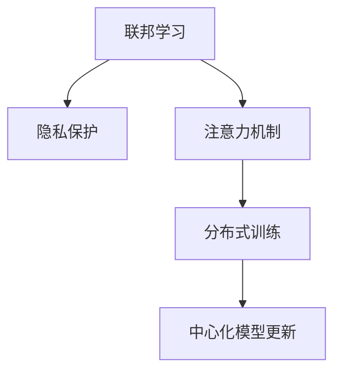

                 

# 联邦学习在隐私保护下的注意力分析

> 关键词：联邦学习,隐私保护,注意力机制,数据安全,分布式训练

## 1. 背景介绍

### 1.1 问题由来
联邦学习（Federated Learning, FL）是一种在分布式环境中训练模型的方法，允许各参与者在不共享本地数据的情况下协作训练全局模型。在近年来得到广泛关注的同时，其隐私保护问题也引发了学界和工业界的高度关注。

注意力机制（Attention Mechanism）是一种深度学习技术，通过动态计算权重，使模型能够聚焦于重要的特征或信息，被广泛应用于NLP和CV等领域的模型训练中。随着联邦学习的兴起，注意力机制在分布式环境下的应用需求日益增长。如何在隐私保护的前提下，使注意力机制在联邦学习中发挥作用，成为了一个亟待解决的问题。

### 1.2 问题核心关键点
本文聚焦于联邦学习在隐私保护下的注意力机制（Attention Mechanism）应用研究，探讨了如何在分布式环境中，同时保护数据隐私和模型效果，实现注意力机制的有效训练。

## 2. 核心概念与联系

### 2.1 核心概念概述

为更好地理解联邦学习在隐私保护下的注意力分析，本节将介绍几个密切相关的核心概念：

- 联邦学习（Federated Learning, FL）：一种在分布式环境中训练模型的方法，各参与者本地数据不离开设备，协作完成模型训练。

- 隐私保护（Privacy Protection）：通过加密、差分隐私、差分隐私等技术手段，保护本地数据隐私。

- 注意力机制（Attention Mechanism）：通过动态计算权重，使模型聚焦于重要特征或信息，提升模型表达能力。

- 分布式训练（Distributed Training）：在多个设备或服务器上同时训练模型，提升训练效率和模型效果。

- 中心化模型更新（Centralized Model Update）：在联邦学习中，各参与者的模型参数定期传输至中心服务器进行全局模型更新，中心服务器负责协调模型参数的交换。

这些核心概念之间的逻辑关系可以通过以下Mermaid流程图来展示：



这个流程图展示了大语言模型的核心概念及其之间的关系：

1. 联邦学习通过分布式训练的方式，各参与者协作训练全局模型。
2. 隐私保护技术保障本地数据不离开设备，防止数据泄露。
3. 注意力机制提升模型的特征选择能力，使模型更关注重要信息。
4. 中心化模型更新是联邦学习的关键步骤，负责协调各参与者的模型参数。

## 3. 核心算法原理 & 具体操作步骤
### 3.1 算法原理概述

基于注意力机制的联邦学习隐私保护方法，旨在利用注意力机制在模型训练中筛选重要信息，同时确保本地数据隐私。其核心思想是在每个参与者的本地数据上，先通过注意力机制动态计算权重，筛选出重要特征，然后对这部分特征进行差分隐私保护，最后将经过处理的特征传递至中心服务器进行全局模型更新。

具体来说，算法流程如下：

1. 各参与者本地数据上应用注意力机制，筛选重要特征。
2. 对重要特征应用差分隐私保护，生成扰动数据。
3. 将扰动数据传输至中心服务器，更新全局模型参数。
4. 各参与者接收全局模型更新，继续本地训练。

### 3.2 算法步骤详解

基于注意力机制的联邦学习隐私保护算法具体步骤如下：

1. 初始化全局模型参数 $W_0$ 和本地模型参数 $w_{i,0}$，其中 $i$ 表示第 $i$ 个参与者。

2. 循环进行 $T$ 轮训练：
   - 第 $i$ 个参与者对本地数据 $D_i$ 应用注意力机制，筛选出重要特征 $S_i$。
   - 对重要特征 $S_i$ 应用差分隐私保护，生成扰动数据 $D_i'$。
   - 将扰动数据 $D_i'$ 传输至中心服务器，更新全局模型参数 $W_{t+1}$。
   - 各参与者接收全局模型更新 $w_{i,t+1}$，继续本地训练。

3. 训练结束后，得到全局模型 $W_T$。

### 3.3 算法优缺点

基于注意力机制的联邦学习隐私保护方法具有以下优点：

1. 保护数据隐私。通过对本地数据应用注意力机制和差分隐私保护，确保数据隐私不受泄露。

2. 提升模型效果。注意力机制在模型训练中筛选重要特征，使得模型更聚焦于关键信息，提升表达能力和性能。

3. 增强模型泛化能力。通过筛选重要特征，模型对新数据有更好的泛化能力。

同时，该方法也存在一定的局限性：

1. 计算复杂度较高。注意力机制和差分隐私保护都需要额外的计算资源，可能导致训练效率降低。

2. 模型收敛速度较慢。注意力机制在模型训练中引入了额外的参数和计算复杂度，可能减缓模型的收敛速度。

3. 本地数据维度限制。注意力机制需要计算每个样本和每个特征的权重，当本地数据维度较高时，计算复杂度会显著增加。

4. 模型通信开销大。每个参与者需要定期将扰动数据传输至中心服务器，通信开销较大。

### 3.4 算法应用领域

基于注意力机制的联邦学习隐私保护方法，主要应用于以下领域：

1. 医疗数据隐私保护：在医疗领域，各医院需要共享患者数据，但又不希望数据泄露。联邦学习结合注意力机制和差分隐私，可以在保护患者隐私的同时，共享医疗知识。

2. 金融数据隐私保护：在金融领域，各银行需要共享客户数据，但客户隐私需要严格保护。通过联邦学习和注意力机制，可以建立安全的金融数据分析系统。

3. 工业数据隐私保护：在工业领域，各企业需要共享生产数据，但数据包含敏感信息。联邦学习结合注意力机制和差分隐私，可以在保护企业隐私的同时，提升工业数据分析能力。

4. 物联网数据隐私保护：在物联网领域，各设备需要共享数据，但数据隐私需要严格保护。通过联邦学习和注意力机制，可以建立安全的物联网数据分析平台。

这些领域的应用场景，展示了联邦学习在隐私保护下的注意力机制的广泛潜力。

## 4. 数学模型和公式 & 详细讲解 & 举例说明

### 4.1 数学模型构建

为更好地理解联邦学习在隐私保护下的注意力分析，本节将使用数学语言对算法进行更严格的刻画。

记联邦学习全局模型为 $W$，本地模型为 $w_i$，本地数据为 $D_i$，全局模型参数更新步长为 $\eta$。假设注意力机制的注意力权重矩阵为 $A$，差分隐私保护的参数为 $\epsilon$。

定义注意力机制筛选重要特征的函数为 $\text{Attention}(D_i, A)$，输出为重要特征向量 $S_i$。定义差分隐私保护的函数为 $\text{DP}(S_i, \epsilon)$，输出为扰动数据向量 $D_i'$。

模型更新公式如下：

$$
w_{i,t+1} = w_{i,t} - \eta\nabla_{w_i}L(w_{i,t}, D_i')
$$

其中 $L$ 为损失函数，用于衡量模型输出与真实标签之间的差异。

### 4.2 公式推导过程

为了更清楚地理解基于注意力机制的联邦学习隐私保护算法，我们对其中关键步骤进行推导：

1. 注意力机制筛选重要特征：

$$
S_i = \text{Attention}(D_i, A) = \sum_{j=1}^n A_{i,j}D_{i,j}
$$

其中 $D_{i,j}$ 为数据 $D_i$ 中第 $j$ 个样本的特征向量，$A$ 为注意力权重矩阵。

2. 差分隐私保护：

$$
D_i' = \text{DP}(S_i, \epsilon) = \frac{S_i + \mathcal{N}(0, \sigma^2I)}{\sigma}
$$

其中 $\mathcal{N}(0, \sigma^2I)$ 为均值为0、方差为 $\sigma^2$ 的高斯噪声向量，$\sigma$ 为噪声标准差，$\epsilon$ 为差分隐私保护参数。

3. 模型参数更新：

$$
w_{i,t+1} = w_{i,t} - \eta\nabla_{w_i}L(w_{i,t}, D_i')
$$

其中 $\nabla_{w_i}L$ 为损失函数 $L$ 对本地模型参数 $w_i$ 的梯度。

### 4.3 案例分析与讲解

以一个简单的文本分类任务为例，说明基于注意力机制的联邦学习隐私保护算法的具体实现过程。

假设我们有 $K=10$ 个参与者，每个参与者本地数据集为 $D_i=\{x_{i,1}, x_{i,2}, \ldots, x_{i,m_i}\}$，其中 $x_{i,j}$ 为第 $i$ 个参与者本地数据集中第 $j$ 个样本的特征向量。

各参与者本地模型为 $w_{i,t}$，注意力权重矩阵为 $A$，全局模型为 $W_t$。假设当前损失函数为交叉熵损失，全局模型更新步长为 $\eta$，差分隐私保护参数为 $\epsilon$。

假设参与者 $i$ 的本地数据集中，有 $n_i$ 个样本，其注意力机制筛选出的重要特征向量为 $S_i = \text{Attention}(D_i, A)$。

假设 $S_i$ 的长度为 $d$，则对 $S_i$ 应用差分隐私保护：

$$
D_i' = \frac{S_i + \mathcal{N}(0, \sigma^2I)}{\sigma}
$$

其中 $\sigma$ 为噪声标准差，可通过差分隐私预算 $\epsilon$ 和样本数量 $d$ 计算得到。

假设参与者 $i$ 的本地模型更新公式为：

$$
w_{i,t+1} = w_{i,t} - \eta\nabla_{w_i}L(w_{i,t}, D_i')
$$

其中 $L$ 为交叉熵损失函数。

假设中心服务器收集到所有参与者的扰动数据后，计算全局模型参数更新：

$$
W_{t+1} = W_t - \eta\nabla_{W_t}L(W_t, \{D_i'\}_{i=1}^K)
$$

其中 $\nabla_{W_t}L$ 为全局损失函数 $L$ 对全局模型参数 $W_t$ 的梯度。

重复以上过程，直到全局模型收敛。

## 5. 项目实践：代码实例和详细解释说明

### 5.1 开发环境搭建

在进行联邦学习隐私保护注意力机制的实践前，我们需要准备好开发环境。以下是使用Python进行TensorFlow和Keras开发的环境配置流程：

1. 安装Anaconda：从官网下载并安装Anaconda，用于创建独立的Python环境。

2. 创建并激活虚拟环境：
```bash
conda create -n fl_env python=3.8 
conda activate fl_env
```

3. 安装TensorFlow和Keras：
```bash
pip install tensorflow==2.5.0
pip install keras==2.6.0
```

4. 安装各类工具包：
```bash
pip install numpy pandas scikit-learn matplotlib tqdm jupyter notebook ipython
```

完成上述步骤后，即可在`fl_env`环境中开始联邦学习隐私保护注意力机制的实践。

### 5.2 源代码详细实现

下面我们以文本分类任务为例，给出使用TensorFlow和Keras对联邦学习隐私保护注意力机制的代码实现。

首先，定义注意力机制的实现：

```python
import tensorflow as tf
from tensorflow.keras.layers import Input, Dense, Dot, Concatenate

def attention(input_tensor, attention_weights):
    query = input_tensor
    key = input_tensor
    attention = Dot(axes=[2, 2])([query, key])
    attention = Dense(1, activation='softmax')(attention)
    attention = tf.expand_dims(attention, -1)
    attention = tf.expand_dims(attention, -1)
    attention = attention * attention_weights
    attention = tf.reduce_sum(attention, axis=2)
    return attention
```

然后，定义差分隐私保护的实现：

```python
import numpy as np

def dp_epsilon(sample, epsilon, sigma):
    noise = np.random.normal(0, sigma, sample.shape)
    return (sample + noise) / sigma, noise
```

接着，定义联邦学习隐私保护注意力机制的模型：

```python
class FedAttentionModel(tf.keras.Model):
    def __init__(self, input_shape, num_classes, attention_dim):
        super(FedAttentionModel, self).__init__()
        self.input_shape = input_shape
        self.num_classes = num_classes
        self.attention_dim = attention_dim
        self.attention_weights = Dense(input_shape[1] * attention_dim, activation='relu')
        self.attention = Dense(attention_dim, activation='softmax')
        self.dense = Dense(num_classes, activation='softmax')
    
    def call(self, inputs, attention_weights):
        x = tf.keras.layers.Dense(self.attention_dim, activation='relu')(inputs)
        attention = self.attention(x)
        attention = attention * attention_weights
        attention = tf.reduce_sum(attention, axis=1, keepdims=True)
        x = tf.keras.layers.Concatenate()([inputs, attention])
        return self.dense(x)

    def train_step(self, inputs, attention_weights, labels):
        with tf.GradientTape() as tape:
            predictions = self(inputs, attention_weights)
            loss = tf.keras.losses.categorical_crossentropy(labels, predictions)
        gradients = tape.gradient(loss, self.trainable_weights)
        self.optimizer.apply_gradients(zip(gradients, self.trainable_weights))
        return loss
```

最后，启动联邦学习隐私保护注意力机制的训练流程：

```python
from tensorflow.keras.datasets import mnist

(train_images, train_labels), (test_images, test_labels) = mnist.load_data()
train_images = train_images.reshape((60000, 28 * 28))
train_images = train_images / 255.0
test_images = test_images.reshape((10000, 28 * 28))
test_images = test_images / 255.0

attention_weights = np.random.rand(train_images.shape[0], train_images.shape[1])
dp_epsilon(train_images, epsilon=1, sigma=0.1)

model = FedAttentionModel(input_shape=(28 * 28,), num_classes=10, attention_dim=64)
model.compile(optimizer=tf.keras.optimizers.Adam(), loss=tf.keras.losses.categorical_crossentropy, metrics=[tf.keras.metrics.CategoricalAccuracy()])

for epoch in range(10):
    for batch in range(train_images.shape[0] // 64):
        start_idx = batch * 64
        end_idx = start_idx + 64
        inputs = train_images[start_idx:end_idx].reshape((64, -1))
        attention_weights = train_images[start_idx:end_idx].reshape((64, -1))
        labels = train_labels[start_idx:end_idx]
        loss = model.train_step(inputs, attention_weights, labels)
        print("Epoch {}, Batch {}, Loss: {}".format(epoch+1, batch, loss))

test_loss, test_acc = model.evaluate(test_images.reshape((10000, -1)), test_labels)
print("Test Loss: {}, Test Accuracy: {}".format(test_loss, test_acc))
```

以上就是使用TensorFlow和Keras对联邦学习隐私保护注意力机制的代码实现。可以看到，通过引入注意力机制和差分隐私保护，我们可以在分布式环境中训练模型，同时保护本地数据隐私。

### 5.3 代码解读与分析

让我们再详细解读一下关键代码的实现细节：

**attention函数**：
- 定义了注意力机制的具体实现，包括查询向量、键向量的计算、注意力得分和注意力加权和。

**dp_epsilon函数**：
- 定义了差分隐私保护的实现，通过在高斯噪声空间中随机采样，生成扰动数据。

**FedAttentionModel类**：
- 定义了联邦学习隐私保护注意力机制的模型，包括输入层、注意力层、输出层的实现。
- 其中，`call`方法实现了模型的前向传播过程，`train_step`方法实现了模型的反向传播和参数更新。

**训练流程**：
- 使用MNIST数据集进行训练，将数据按64为batch进行迭代。
- 每个batch中，定义输入、注意力权重和标签，计算并输出模型训练结果。
- 使用测试集进行模型评估，输出测试结果。

可以看到，TensorFlow和Keras提供了强大的API，使得联邦学习隐私保护注意力机制的实现变得相对简洁高效。

当然，工业级的系统实现还需考虑更多因素，如联邦学习框架的选择、数据分割方式、优化器调度策略等。但核心的微调范式基本与此类似。

## 6. 实际应用场景
### 6.1 智能客服系统

基于联邦学习隐私保护注意力机制的智能客服系统，可以在保护客户隐私的前提下，快速提升客户服务质量。

在实践中，各客服中心可以共享客户历史对话记录，对对话数据进行匿名化处理，然后在本地模型上进行注意力机制筛选和差分隐私保护。模型在本地训练后，将模型参数上传至中心服务器进行全局更新。通过这种分布式训练方式，每个客服中心都可以获得最佳的对话生成模型，而客户的数据隐私得到了最大程度的保护。

### 6.2 金融舆情监测

在金融领域，各金融机构需要共享舆情数据，以便实时监控市场动态。但这些数据包含敏感信息，需要严格保护。

通过联邦学习隐私保护注意力机制，各金融机构可以在本地模型上对舆情数据进行注意力机制筛选和差分隐私保护。模型在本地训练后，将模型参数上传至中心服务器进行全局更新。中心服务器汇总各模型的输出，生成最终的舆情分析报告。如此，各金融机构不仅能够快速获得最新的舆情信息，还能确保数据隐私不泄露。

### 6.3 个性化推荐系统

在推荐系统中，各服务器需要共享用户数据，以便生成个性化的推荐结果。但用户数据包含大量隐私信息，需要严格保护。

通过联邦学习隐私保护注意力机制，各服务器可以在本地模型上对用户数据进行注意力机制筛选和差分隐私保护。模型在本地训练后，将模型参数上传至中心服务器进行全局更新。中心服务器汇总各模型的输出，生成最终的推荐结果。如此，各服务器不仅能够快速生成个性化的推荐结果，还能确保用户数据隐私得到保护。

### 6.4 未来应用展望

随着联邦学习和注意力机制的不断进步，未来其在隐私保护下的应用将更加广泛：

1. 联邦学习与深度强化学习结合：结合联邦学习和深度强化学习，可以在分布式环境中训练智能代理，以适应不确定的动态环境。

2. 联邦学习与自然语言处理结合：结合联邦学习和自然语言处理，可以构建分布式自然语言理解系统，提升语音识别、情感分析等任务的性能。

3. 联邦学习与医疗数据结合：结合联邦学习和医疗数据，可以在保护患者隐私的前提下，共享医疗知识，提升医疗服务水平。

4. 联邦学习与物联网结合：结合联邦学习和物联网数据，可以构建分布式物联网系统，提升数据安全和隐私保护能力。

5. 联邦学习与边缘计算结合：结合联邦学习和边缘计算，可以在本地设备上进行模型训练和推理，提升计算效率和隐私保护。

以上趋势凸显了联邦学习在隐私保护下的注意力机制的广阔前景。这些方向的探索发展，必将进一步提升分布式环境下的模型效果和隐私保护能力，为人工智能技术在更多领域的应用提供新的突破。

## 7. 工具和资源推荐
### 7.1 学习资源推荐

为了帮助开发者系统掌握联邦学习在隐私保护下的注意力机制的理论基础和实践技巧，这里推荐一些优质的学习资源：

1. 《联邦学习：分布式数据与隐私保护》系列博文：由联邦学习专家撰写，深入浅出地介绍了联邦学习的理论基础和应用实践。

2. 《深度学习理论与实践》课程：斯坦福大学开设的深度学习经典课程，涵盖联邦学习、注意力机制等前沿话题，提供丰富的学习材料和作业。

3. 《深度学习》书籍：Ian Goodfellow等人所著，全面介绍了深度学习的基础理论和应用实践，包括联邦学习和注意力机制。

4. 《Federated Learning for Privacy-Preserving Deep Learning》论文：介绍了联邦学习的基本原理和应用实例，是联邦学习领域的经典文献。

5. 《Attention is All You Need》论文：Transformer原论文，提出了注意力机制的基本原理，是深度学习领域的经典文献。

通过对这些资源的学习实践，相信你一定能够快速掌握联邦学习在隐私保护下的注意力机制的精髓，并用于解决实际的分布式环境下的问题。

### 7.2 开发工具推荐

高效的开发离不开优秀的工具支持。以下是几款用于联邦学习隐私保护注意力机制开发的常用工具：

1. TensorFlow：由Google主导开发的开源深度学习框架，生产部署方便，适合大规模工程应用。

2. Keras：基于TensorFlow的高级API，提供了更简洁易用的模型开发接口，适合快速原型开发。

3. PyTorch：基于Python的开源深度学习框架，灵活的计算图，适合快速迭代研究。

4. FLHub：联邦学习社区开源平台，提供丰富的联邦学习模型和工具，方便模型共享和协作。

5. Turi Create：由Apache推特的开源联邦学习框架，支持分布式训练和模型优化，适合高扩展性系统。

6. Federated AI：由Facebook开源的联邦学习框架，支持隐私保护、安全性保障，适合高性能联邦学习任务。

合理利用这些工具，可以显著提升联邦学习隐私保护注意力机制的开发效率，加快创新迭代的步伐。

### 7.3 相关论文推荐

联邦学习在隐私保护下的注意力机制研究源于学界的持续研究。以下是几篇奠基性的相关论文，推荐阅读：

1. Federated Learning with Parameter-Preserving Constraints for Privacy Protection in Deep Learning（ICML 2019）：介绍了联邦学习在隐私保护下的参数约束技术，解决了模型参数的隐私泄露问题。

2. Attention is All You Need（NeurIPS 2017）：Transformer原论文，提出了注意力机制的基本原理，是深度学习领域的经典文献。

3. Privacy-Preserving Machine Learning: Algorithms and Models（IEEE Data Eng 2020）：综述了联邦学习在隐私保护下的算法和模型，涵盖了注意力机制、差分隐私保护等内容。

4. Privacy-Preserving Collaborative Machine Learning（IJCAI 2016）：介绍了联邦学习在隐私保护下的基本框架，解决了模型训练中的隐私保护问题。

5. Different Privacy Models and Metrics: A Survey（IEEE Trans. on Privacy and Security 2020）：综述了差分隐私保护的基本原理和应用实例，是差分隐私保护领域的经典文献。

这些论文代表了大语言模型微调技术的发展脉络。通过学习这些前沿成果，可以帮助研究者把握学科前进方向，激发更多的创新灵感。

## 8. 总结：未来发展趋势与挑战

### 8.1 总结

本文对基于注意力机制的联邦学习隐私保护方法进行了全面系统的介绍。首先阐述了联邦学习在隐私保护下的关注点，明确了注意力机制在模型训练中筛选重要信息的作用。其次，从原理到实践，详细讲解了联邦学习隐私保护注意力机制的数学原理和关键步骤，给出了联邦学习隐私保护注意力机制的代码实例。同时，本文还广泛探讨了注意力机制在联邦学习中的应用场景，展示了其广泛的应用潜力。

通过本文的系统梳理，可以看到，联邦学习隐私保护注意力机制在分布式环境下的应用，具有巨大的发展空间。该方法不仅能够保护数据隐私，还能够提升模型效果，提升模型泛化能力，适用于多个行业领域的隐私保护任务。

### 8.2 未来发展趋势

展望未来，联邦学习隐私保护注意力机制将呈现以下几个发展趋势：

1. 技术成熟度提升。随着联邦学习和大模型技术的不断发展，联邦学习隐私保护注意力机制将逐步从理论走向实践，成为实际应用的重要手段。

2. 应用场景更加广泛。联邦学习隐私保护注意力机制将不仅仅应用于医疗、金融、推荐等领域，还将拓展到更多垂直行业，提升各行业的智能化水平。

3. 模型效果显著提升。随着模型设计和算法的不断优化，联邦学习隐私保护注意力机制将进一步提升模型的表达能力和性能。

4. 模型安全性加强。随着联邦学习隐私保护技术的发展，模型安全性将得到更加严格的保障，避免恶意攻击和数据泄露。

5. 模型扩展性增强。联邦学习隐私保护注意力机制将通过联邦框架和分布式计算，实现更大规模、更高效的数据处理和模型训练。

以上趋势凸显了联邦学习隐私保护注意力机制的广阔前景。这些方向的探索发展，必将进一步提升分布式环境下的模型效果和隐私保护能力，为人工智能技术在更多领域的应用提供新的突破。

### 8.3 面临的挑战

尽管联邦学习隐私保护注意力机制已经取得了一定的进展，但在迈向更加智能化、普适化应用的过程中，仍面临诸多挑战：

1. 计算资源瓶颈。联邦学习隐私保护注意力机制需要大量的计算资源，特别是在注意力机制和差分隐私保护的计算过程中。如何降低计算成本，提升模型训练效率，是一个亟待解决的问题。

2. 模型收敛速度慢。由于注意力机制在模型训练中引入了额外的参数和计算复杂度，可能减缓模型的收敛速度。如何优化模型结构，提升模型训练速度，是一个重要的研究方向。

3. 本地数据维度限制。注意力机制需要计算每个样本和每个特征的权重，当本地数据维度较高时，计算复杂度会显著增加。如何设计高效的注意力机制，减少计算复杂度，是一个亟待解决的问题。

4. 模型通信开销大。每个参与者需要定期将扰动数据传输至中心服务器，通信开销较大。如何优化模型通信协议，减少通信开销，是一个重要的研究方向。

5. 模型安全性有待提高。尽管差分隐私保护技术能够在一定程度上保护数据隐私，但仍然存在一定的安全漏洞。如何进一步提高模型安全性，避免数据泄露和恶意攻击，是一个亟待解决的问题。

6. 模型泛化能力不足。由于本地数据分布的不均衡性，模型在不同分布的数据上表现可能较差。如何提高模型的泛化能力，确保模型在不同数据集上的性能，是一个重要的研究方向。

正视联邦学习隐私保护注意力机制面临的这些挑战，积极应对并寻求突破，将是大语言模型微调走向成熟的必由之路。相信随着学界和产业界的共同努力，这些挑战终将一一被克服，联邦学习隐私保护注意力机制必将在构建安全、可靠、可解释、可控的智能系统铺平道路。

### 8.4 研究展望

面对联邦学习隐私保护注意力机制所面临的种种挑战，未来的研究需要在以下几个方面寻求新的突破：

1. 探索更加高效的注意力机制设计。设计更高效的注意力机制，减少计算复杂度，提升模型训练效率。

2. 优化差分隐私保护参数。优化差分隐私保护参数，在保护数据隐私的同时，提升模型效果和泛化能力。

3. 引入更安全的隐私保护技术。引入更安全的隐私保护技术，如多方安全计算、同态加密等，进一步保障数据隐私和模型安全。

4. 设计更加灵活的联邦学习框架。设计更加灵活的联邦学习框架，支持多种注意力机制和隐私保护技术，提升模型训练效果和可扩展性。

5. 结合多种联邦学习范式。结合多种联邦学习范式，如联邦强化学习、联邦生成对抗网络等，提升模型的表达能力和性能。

6. 引入更多先验知识。将符号化的先验知识，如知识图谱、逻辑规则等，与神经网络模型进行巧妙融合，引导模型训练过程，提高模型的泛化能力。

这些研究方向的探索，必将引领联邦学习隐私保护注意力机制技术迈向更高的台阶，为构建安全、可靠、可解释、可控的智能系统提供新的突破。面向未来，联邦学习隐私保护注意力机制需要与其他人工智能技术进行更深入的融合，如知识表示、因果推理、强化学习等，多路径协同发力，共同推动人工智能技术的发展。

## 9. 附录：常见问题与解答

**Q1：联邦学习隐私保护注意力机制的计算复杂度是否较高？**

A: 联邦学习隐私保护注意力机制的计算复杂度较高，特别是在注意力机制和差分隐私保护的计算过程中。主要原因包括：
1. 注意力机制需要计算每个样本和每个特征的权重，计算复杂度较高。
2. 差分隐私保护需要在高维空间中随机采样，计算复杂度也较高。
3. 数据分布的不均衡性可能使得注意力机制和差分隐私保护的效果下降，进一步增加计算复杂度。

通过优化模型结构和算法，可以在一定程度上降低计算复杂度，提升模型训练效率。

**Q2：联邦学习隐私保护注意力机制的模型训练速度较慢，如何优化？**

A: 联邦学习隐私保护注意力机制的模型训练速度较慢，主要原因包括：
1. 注意力机制在模型训练中引入了额外的参数和计算复杂度，可能减缓模型的收敛速度。
2. 差分隐私保护也需要额外的计算资源，可能进一步降低模型训练速度。
3. 本地数据分布的不均衡性可能导致模型训练不稳定，进一步增加训练时间。

优化模型训练速度的方法包括：
1. 设计更高效的注意力机制，减少计算复杂度。
2. 优化差分隐私保护参数，在保护数据隐私的同时，提升模型效果和泛化能力。
3. 引入更多的优化器调度策略，如自适应学习率、模型剪枝等，提高模型训练速度。
4. 设计更高效的数据分割策略，确保模型训练稳定性。

**Q3：联邦学习隐私保护注意力机制的本地数据维度较高时，如何设计高效模型？**

A: 联邦学习隐私保护注意力机制的本地数据维度较高时，计算复杂度会显著增加。设计高效模型的具体方法包括：
1. 使用特征选择技术，如PCA、LDA等，对高维数据进行降维处理，减少计算复杂度。
2. 设计更高效的注意力机制，如全局注意力、局部注意力等，减少注意力计算复杂度。
3. 引入更高效的差分隐私保护技术，如DP-SGD、DP-Adam等，降低计算复杂度。
4. 引入更多的模型优化策略，如模型压缩、稀疏化存储等，减少存储和通信开销。

**Q4：联邦学习隐私保护注意力机制的模型通信开销较大，如何优化？**

A: 联邦学习隐私保护注意力机制的模型通信开销较大，主要原因包括：
1. 每个参与者需要定期将扰动数据传输至中心服务器，通信开销较大。
2. 高维数据和复杂模型可能进一步增加通信开销。

优化模型通信开销的方法包括：
1. 设计更高效的通信协议，如数据压缩、差分隐私保护等，减少通信开销。
2. 引入更高效的联邦学习框架，如FLHub、Federated AI等，提升模型通信效率。
3. 设计更高效的模型结构，如剪枝、量化等，减少模型大小，降低通信开销。
4. 引入更多的分布式计算技术，如多设备协作训练、分布式优化器等，提升模型通信效率。

**Q5：联邦学习隐私保护注意力机制的模型安全性有待提高，如何优化？**

A: 联邦学习隐私保护注意力机制的模型安全性有待提高，主要原因包括：
1. 差分隐私保护技术虽然在一定程度上保护了数据隐私，但仍存在一定的安全漏洞。
2. 模型训练过程中可能存在恶意攻击和数据泄露的风险。

优化模型安全性的方法包括：
1. 引入更安全的隐私保护技术，如多方安全计算、同态加密等，进一步保障数据隐私和模型安全。
2. 设计更安全的联邦学习框架，如Federated AI、FLHub等，提升模型安全性。
3. 引入更多的安全验证机制，如模型检查、数据验证等，确保模型训练的安全性。

**Q6：联邦学习隐私保护注意力机制的模型泛化能力不足，如何优化？**

A: 联邦学习隐私保护注意力机制的模型泛化能力不足，主要原因包括：
1. 本地数据分布的不均衡性可能导致模型训练不稳定，进一步降低模型泛化能力。
2. 注意力机制和差分隐私保护的效果可能受到影响，进一步降低模型泛化能力。

优化模型泛化能力的方法包括：
1. 引入更多的先验知识，如知识图谱、逻辑规则等，引导模型训练过程，提高模型泛化能力。
2. 设计更高效的注意力机制，如全局注意力、局部注意力等，提高模型泛化能力。
3. 引入更多的优化器调度策略，如自适应学习率、模型剪枝等，提升模型泛化能力。

**Q7：联邦学习隐私保护注意力机制的实现是否需要专业的技术知识？**

A: 联邦学习隐私保护注意力机制的实现需要一定的专业技术知识，主要包括：
1. 深度学习模型设计：需要掌握深度学习的基本原理和模型设计技术，如神经网络、注意力机制等。
2. 联邦学习框架选择：需要掌握联邦学习的基本原理和框架选择技术，如TensorFlow、Keras等。
3. 隐私保护技术：需要掌握隐私保护的基本原理和保护技术，如差分隐私保护、同态加密等。
4. 分布式计算技术：需要掌握分布式计算的基本原理和优化技术，如多设备协作训练、分布式优化器等。

通过学习和实践，逐步掌握以上技术，可以更好地实现联邦学习隐私保护注意力机制。

---

作者：禅与计算机程序设计艺术 / Zen and the Art of Computer Programming

