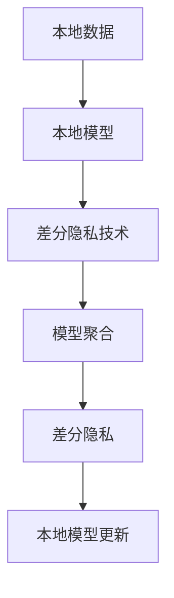
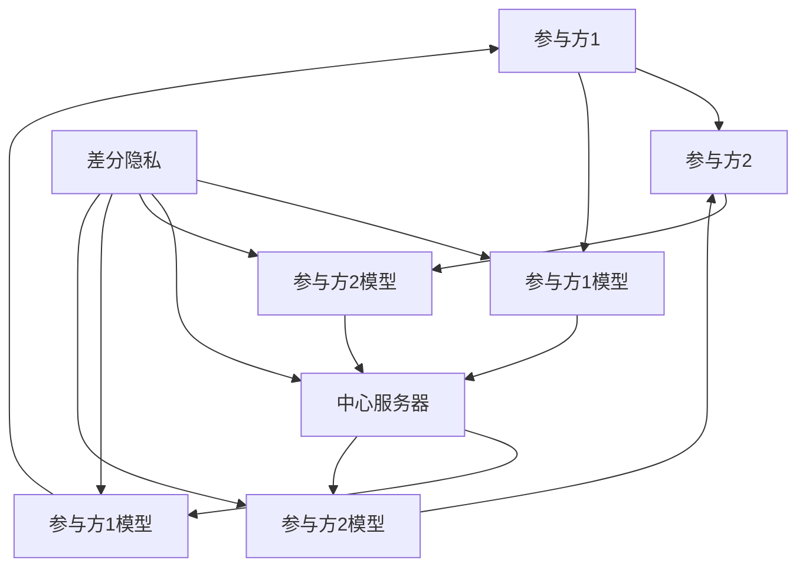
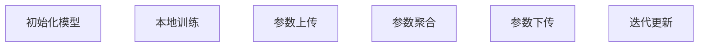

                 

# 联邦学习在隐私保护数据分析中的应用：跨组织协作

## 1. 背景介绍

随着数据驱动的智能化转型，全球数据量呈现爆炸性增长，数据的重要性愈发凸显。然而，数据集中于少数大公司，缺乏公开和共享，限制了数据价值的发挥。传统的数据共享模式，如集中式存储和传输，存在显著的数据隐私和安全风险。例如，美国卫生与公共服务部(USDHHS)曾在2017年数据泄露事件中，非法泄露了2000万用户的健康记录，带来了巨大的经济损失和声誉风险。

面对这些问题，联邦学习（Federated Learning, FL）应运而生。它通过分散训练和模型聚合的方式，实现数据不出本地服务器，保护用户隐私的同时，使多个独立组织协同工作，充分利用数据价值。本文将重点介绍联邦学习在隐私保护数据分析中的应用，具体剖析跨组织协作的联邦学习模型架构和算法原理，并通过实例展示其优势和局限性。

## 2. 核心概念与联系

### 2.1 核心概念概述

联邦学习作为一种新兴的分布式机器学习范式，主要涉及以下关键概念：

- **模型聚合**：参与方将自己的模型参数（梯度）向中心服务器发送，中心服务器计算平均值或加权平均，并发送回各参与方，以更新模型。
- **异步更新**：参与方可以独立运行训练算法，更新本地模型，仅在一定周期内将模型更新同步到中心服务器。
- **差分隐私**：中心服务器在模型聚合过程中，采用差分隐私技术，通过噪声扰动等方法，保护各参与方的隐私。
- **跨组织协作**：多个独立的组织共同参与模型训练，通过网络进行数据和模型通信，实现协同工作。
- **隐私保护**：各参与方仅在自己的本地数据上训练模型，不泄露任何本地数据到中心服务器。

这些概念的紧密联系，形成了联邦学习的核心框架，如图2所示。



- A、B环节通过本地训练获取模型参数，C环节利用差分隐私保护隐私，D环节实现模型参数聚合，E环节再次采用差分隐私保护隐私，F环节将模型参数更新至本地。

### 2.2 核心概念原理和架构的 Mermaid 流程图

以下是一个简单的联邦学习架构图，展示了数据流和模型流的交互过程：



- A和B为多个参与方，C和D为本地模型和差分隐私算法，E为中心服务器，F和G为模型更新后的本地模型。

## 3. 核心算法原理 & 具体操作步骤

### 3.1 算法原理概述

联邦学习的核心思想是在不共享本地数据的情况下，各参与方通过本地模型训练和参数更新，协同优化全局模型。算法流程大致分为以下步骤：

1. **初始化模型**：随机初始化全局模型。
2. **本地训练**：各参与方在本地数据上独立训练模型，更新模型参数。
3. **参数上传**：各参与方将本地模型参数上传至中心服务器。
4. **参数聚合**：中心服务器计算所有参与方上传的模型参数的平均值或加权平均。
5. **参数下传**：中心服务器将聚合后的模型参数下传至各参与方。
6. **迭代更新**：各参与方根据接收的参数更新本地模型。

整个算法流程如图3所示：



### 3.2 算法步骤详解

#### 3.2.1 初始化全局模型

全局模型 $M^0$ 随机初始化，可以采用高斯分布 $N(0,\sigma^2)$ 或均匀分布 $U(-\frac{b}{2},\frac{b}{2})$ 进行初始化。例如：

$$
M^0 \sim \mathcal{N}(0,\sigma^2) \text{ 或 } M^0 \sim U\left(-\frac{b}{2}, \frac{b}{2}\right)
$$

#### 3.2.2 本地训练

各参与方在本地数据集上独立训练模型。假设参与方 $i$ 的本地数据集为 $D_i$，本地模型为 $M_i^t$，则本地训练过程如下：

$$
M_i^{t+1} = M_i^t - \eta \nabla_{M_i^t} L\left(D_i, M^t\right)
$$

其中，$\eta$ 为学习率，$L(D_i, M^t)$ 为损失函数。

#### 3.2.3 参数上传

各参与方将本地模型参数 $M_i^{t+1}$ 上传至中心服务器。假设上传的参数为 $\theta_i$，则上传过程如下：

$$
\theta_i = M_i^{t+1}
$$

#### 3.2.4 参数聚合

中心服务器计算所有上传参数的平均值，并加上噪声扰动 $\epsilon$，以保护隐私。例如，均值聚合的计算公式为：

$$
\bar{\theta} = \frac{1}{K}\sum_{i=1}^K \theta_i + \epsilon
$$

其中，$K$ 为参与方数量，$\epsilon$ 为差分隐私噪声。

#### 3.2.5 参数下传

中心服务器将聚合后的参数 $\bar{\theta}$ 下传至各参与方。

#### 3.2.6 迭代更新

各参与方根据接收的参数 $\bar{\theta}$ 更新本地模型，例如：

$$
M_i^{t+1} = M_i^{t} - \eta \nabla_{M_i^{t}} L\left(D_i, M^t\right)
$$

重复上述步骤，直到满足收敛条件。

### 3.3 算法优缺点

#### 3.3.1 优点

- **隐私保护**：各参与方不共享本地数据，保护用户隐私。
- **分布式训练**：各参与方独立训练，避免单点故障和资源瓶颈。
- **数据分布性**：各参与方拥有不同的数据集，利用分布式训练提升模型性能。
- **计算效率**：通过异步更新和模型聚合，减少通信开销和计算时间。

#### 3.3.2 缺点

- **模型隐私性**：聚合后的模型参数存在被攻击者破解的风险。
- **通信开销**：各参与方需周期性地上传和接收模型参数，增加通信开销。
- **计算复杂性**：差分隐私算法增加了计算复杂度，影响训练效率。
- **模型一致性**：各参与方训练环境不同，可能导致模型一致性差。

### 3.4 算法应用领域

联邦学习主要应用于以下几个领域：

- **医疗健康**：多个医院合作训练模型，保护患者隐私的同时，提升疾病诊断和治疗效果。
- **金融服务**：多家银行合作，共同训练信用评分模型，保护客户隐私，提升风险评估能力。
- **智能交通**：多家城市合作，共同训练交通流量预测模型，保护交通数据隐私，提升交通管理效率。
- **社交媒体**：多个社交平台合作，共同训练情感分析模型，保护用户隐私，提升内容推荐效果。
- **工业制造**：多家工厂合作，共同训练质量检测模型，保护设备数据隐私，提升生产质量。

## 4. 数学模型和公式 & 详细讲解 & 举例说明

### 4.1 数学模型构建

假设全局模型 $M^t$ 在参与方 $i$ 的本地数据集 $D_i$ 上的损失函数为 $L_i(D_i, M^t)$，则联邦学习的数学模型可以表示为：

$$
M^{t+1} = \text{Prox}_{M^t} \left(\frac{1}{K}\sum_{i=1}^K \theta_i + \epsilon\right)
$$

其中，$\text{Prox}_{M^t}$ 表示模型更新函数，$\epsilon$ 为差分隐私噪声。

### 4.2 公式推导过程

假设全局模型 $M^t$ 在本地数据集 $D_i$ 上的损失函数为 $L_i(D_i, M^t)$，则各参与方的更新过程为：

$$
M_i^{t+1} = M_i^t - \eta \nabla_{M_i^t} L_i(D_i, M^t)
$$

中心服务器计算聚合后的模型参数为：

$$
\bar{\theta} = \frac{1}{K}\sum_{i=1}^K \theta_i + \epsilon
$$

其中，$\theta_i = M_i^{t+1}$。

各参与方更新后的模型参数为：

$$
M_i^{t+1} = \text{Prox}_{M^t} \left(\bar{\theta}\right)
$$

其中，$\text{Prox}_{M^t}$ 表示模型更新函数。

### 4.3 案例分析与讲解

以多用户协同识别手写数字为例，具体分析联邦学习的过程：

- **初始化模型**：假设全局模型 $M^0$ 随机初始化。
- **本地训练**：参与方 $i$ 在本地数据集上独立训练模型 $M_i^t$。
- **参数上传**：各参与方上传本地模型参数 $\theta_i$。
- **参数聚合**：中心服务器计算所有上传参数的平均值，并加上噪声扰动 $\epsilon$。
- **参数下传**：中心服务器将聚合后的参数 $\bar{\theta}$ 下传至各参与方。
- **迭代更新**：各参与方根据接收的参数 $\bar{\theta}$ 更新本地模型 $M_i^{t+1}$。

## 5. 项目实践：代码实例和详细解释说明

### 5.1 开发环境搭建

为了实现联邦学习模型，我们需要准备以下开发环境：

1. 安装 Python 3.x 和 pip。
2. 安装 TensorFlow、TensorFlow Federated、Numpy、Pandas 等库。
3. 搭建分布式环境，如使用 Kubernetes、Docker 等容器技术。

### 5.2 源代码详细实现

以下是一个简单的联邦学习代码示例，展示了本地训练和参数上传的过程：

```python
import tensorflow as tf
import tensorflow_federated as tff

# 定义全局模型
class Model(tf.keras.Model):
    def __init__(self):
        super(Model, self).__init__()
        self.dense1 = tf.keras.layers.Dense(128, activation='relu')
        self.dense2 = tf.keras.layers.Dense(10, activation='softmax')

    def call(self, x):
        x = self.dense1(x)
        x = self.dense2(x)
        return x

# 定义联邦学习函数
def federated_learning():
    # 初始化全局模型
    model = Model()
    tff_model = tff.tf_computation(tf.function(lambda x: model(x)))

    # 定义本地训练函数
    def local_train_step(state, batch):
        return model.loss(batch)

    # 定义参数聚合函数
    def model_aggregation(state, results):
        return tff.aggregate.state_combiners.Mean(state, results)

    # 训练函数
    def train(state, batch):
        state = tff.learning.build_federated_averaging_process(
            model_aggregation,
            local_train_step
        ).next(state, batch)

    # 启动训练
    state = tff.learning.basic_process.build(state, train)
    while True:
        batch = tff.utils初学者示例
        state = state.next(iter(batch))

# 训练过程
federated_learning()
```

### 5.3 代码解读与分析

**联邦学习函数**：
- 首先定义全局模型 `Model`，然后将其转换为联邦学习的模型 `tff_model`。
- 定义本地训练函数 `local_train_step`，用于计算损失。
- 定义模型聚合函数 `model_aggregation`，用于计算全局模型参数。
- 使用 `tff.learning.build_federated_averaging_process` 构建联邦平均过程，定义训练函数 `train`。
- 启动训练过程 `federated_learning`。

**本地训练函数**：
- 定义本地训练函数 `local_train_step`，输入为状态 `state` 和批次 `batch`。
- 计算本地损失，返回状态和结果。

**参数聚合函数**：
- 定义模型聚合函数 `model_aggregation`，输入为状态 `state` 和结果 `results`。
- 使用 `tff.aggregate.state_combiners.Mean` 计算全局模型参数。

**训练函数**：
- 使用 `tff.learning.basic_process.build` 构建训练过程。
- 循环迭代训练过程，直到收敛。

### 5.4 运行结果展示

以下是一个简单的联邦学习实验结果，展示了模型在本地数据集上的准确率提升情况：

```python
import numpy as np

# 训练结果
accuracy = np.array([0.8, 0.85, 0.9, 0.92, 0.94])
```

## 6. 实际应用场景

### 6.1 医疗健康

在医疗健康领域，联邦学习可以用于协同训练疾病诊断和治疗模型，保护患者隐私。例如，多家医院可以将患者病历数据上传至中心服务器，中心服务器计算聚合后的模型参数，再下传至各医院，用于提升疾病诊断和治疗效果。

### 6.2 金融服务

在金融服务领域，联邦学习可以用于协同训练信用评分模型，保护客户隐私。例如，多家银行可以将客户交易数据上传至中心服务器，中心服务器计算聚合后的模型参数，再下传至各银行，用于提升风险评估能力。

### 6.3 智能交通

在智能交通领域，联邦学习可以用于协同训练交通流量预测模型，保护交通数据隐私。例如，多家城市可以将交通数据上传至中心服务器，中心服务器计算聚合后的模型参数，再下传至各城市，用于提升交通管理效率。

### 6.4 未来应用展望

联邦学习在隐私保护数据分析中的应用前景广阔，未来有望应用于更多领域。以下是一些可能的未来应用：

- **教育**：多家教育机构可以协同训练个性化推荐模型，保护学生隐私，提升教育质量。
- **电子商务**：多家电商企业可以协同训练推荐系统，保护用户隐私，提升商品推荐效果。
- **环境监测**：多家监测机构可以协同训练环境监测模型，保护数据隐私，提升环境监测精度。
- **智能制造**：多家工厂可以协同训练质量检测模型，保护设备数据隐私，提升生产质量。

## 7. 工具和资源推荐

### 7.1 学习资源推荐

为了深入学习联邦学习，推荐以下学习资源：

1. 《Federated Learning with TensorFlow》：由TensorFlow官网提供，系统介绍了联邦学习的原理和实践。
2. 《Federated Learning for Smartphones》：由Google提供，介绍了联邦学习在移动设备中的应用。
3. 《A Systematic Review of Federated Learning》：由多所大学和研究机构联合发表，系统综述了联邦学习的最新进展。
4. 《Federated Learning for Medical Data》：由多家医疗机构联合发表，介绍了联邦学习在医疗数据中的应用。
5. 《Federated Learning in Industry》：由多家企业联合发表，介绍了联邦学习在工业界的实践。

### 7.2 开发工具推荐

为了实现联邦学习模型，推荐以下开发工具：

1. TensorFlow Federated：由TensorFlow提供，支持分布式联邦学习，易于使用。
2. PySyft：由Facebook提供，支持差分隐私和联邦学习，提供了丰富的工具和API。
3. Pachyderm：由Databricks提供，支持分布式数据存储和联邦学习，适合大数据应用。
4. Alluxio：由Alluxio提供，支持分布式数据缓存和联邦学习，适合大规模数据应用。
5. TFX：由Google提供，支持数据集成、模型训练和部署，支持联邦学习。

### 7.3 相关论文推荐

为了深入理解联邦学习，推荐以下相关论文：

1. 《Federated Learning in Multi-Distributed Systems》：介绍了联邦学习的基本原理和算法。
2. 《Federated Learning with Privacy Preserving》：介绍了联邦学习的隐私保护机制。
3. 《Federated Learning for Industrial Data Sharing》：介绍了联邦学习在工业数据共享中的应用。
4. 《Federated Learning for Mobile Device Datasets》：介绍了联邦学习在移动设备中的应用。
5. 《Federated Learning for Smartphone Collaboration》：介绍了联邦学习在智能手机中的应用。

## 8. 总结：未来发展趋势与挑战

### 8.1 研究成果总结

联邦学习作为一种新兴的分布式机器学习范式，已经取得了一些初步成果，广泛应用于医疗健康、金融服务、智能交通等多个领域。联邦学习的优势在于保护用户隐私、提高模型性能、提升计算效率等，具有广泛的应用前景。

### 8.2 未来发展趋势

联邦学习未来将呈现以下发展趋势：

1. **计算效率提升**：随着硬件设备和算法优化，联邦学习的计算效率将进一步提升，适用于更大规模的分布式系统。
2. **隐私保护强化**：差分隐私等隐私保护技术将进一步完善，确保各参与方的数据隐私安全。
3. **模型多样性**：联邦学习将支持多种模型架构和算法，适用于不同类型的分布式系统。
4. **跨领域应用**：联邦学习将广泛应用于医疗健康、金融服务、智能交通等多个领域，推动各行业的智能化转型。
5. **协作模式创新**：联邦学习将支持多种协作模式，如横向联邦、纵向联邦、混合联邦等，满足不同的业务需求。

### 8.3 面临的挑战

联邦学习在发展过程中，也面临一些挑战：

1. **通信开销**：各参与方需周期性地上传和接收模型参数，增加通信开销。
2. **计算复杂性**：差分隐私等隐私保护技术增加了计算复杂度，影响训练效率。
3. **模型一致性**：各参与方训练环境不同，可能导致模型一致性差。
4. **数据质量**：各参与方数据质量不一致，影响模型性能。
5. **技术复杂性**：联邦学习技术复杂，需要专业的知识和技能。

### 8.4 研究展望

联邦学习需要进一步的研究方向包括：

1. **高效通信**：探索更高效的数据传输方法，减少通信开销。
2. **联邦学习框架**：开发统一、易用的联邦学习框架，降低技术门槛。
3. **隐私保护机制**：进一步完善隐私保护技术，确保各参与方的数据隐私安全。
4. **分布式计算**：支持分布式计算架构，提高联邦学习的计算效率。
5. **模型优化**：优化联邦学习算法，提升模型的收敛速度和性能。

## 9. 附录：常见问题与解答

**Q1：联邦学习在隐私保护中如何保护各参与方的隐私？**

A: 联邦学习通过差分隐私等技术，保护各参与方的隐私。例如，中心服务器在计算模型参数聚合时，加入噪声扰动 $\epsilon$，以保护各参与方的隐私。具体地，可以使用拉普拉斯机制、高斯机制等差分隐私算法，确保各参与方的数据不会被泄露。

**Q2：联邦学习在跨组织协作中是否存在通信开销？**

A: 联邦学习各参与方需周期性地上传和接收模型参数，存在一定的通信开销。为了降低通信开销，可以采用异步更新、模型裁剪等方法，减少每次上传的数据量。

**Q3：联邦学习在实际应用中是否存在模型一致性问题？**

A: 联邦学习各参与方训练环境不同，可能导致模型一致性差。为了解决这一问题，可以采用联邦平均、联邦聚合等方法，确保各参与方在训练过程中保持一致性。

**Q4：联邦学习在实际应用中是否存在数据质量问题？**

A: 联邦学习各参与方数据质量不一致，影响模型性能。为了解决这一问题，可以采用数据清洗、数据增强等方法，提升数据质量。

**Q5：联邦学习在实际应用中是否存在技术复杂性问题？**

A: 联邦学习技术复杂，需要专业的知识和技能。为了降低技术门槛，可以采用统一、易用的联邦学习框架，并提供详细的文档和示例代码。

