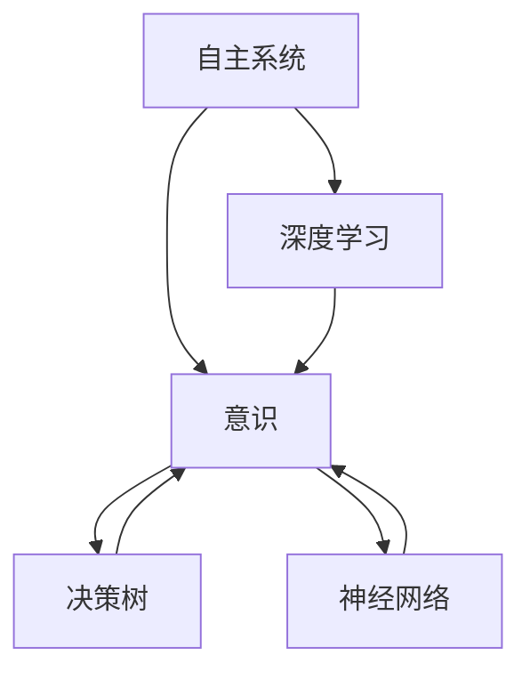

                 

# 自主系统视角下的意识研究

> 关键词：自主系统, 意识研究, 人工智能, 深度学习, 决策树, 神经网络, 行为模拟

## 1. 背景介绍

### 1.1 问题由来

在当前的科技发展浪潮中，人工智能(AI)逐渐成为社会关注的热点。人工智能的发展不仅推动了科技的前进，也在一定程度上影响着人类的生活方式。然而，AI的发展也引发了一系列伦理和哲学问题，尤其是在自主系统的设计和应用上。自主系统，也称为自主代理(Agent)，是一种能够自主学习、决策和行为的智能系统。在AI领域，自主系统的设计和实现已经成为研究热点，其本质是对人类意识和智能的模拟。

意识（Consciousness）是大脑和神经系统处理信息和进行决策的一种复杂过程，是人工智能领域的一项重要研究内容。然而，意识的本质和机制尚未完全理解，这也导致了人工智能的发展在意识层面面临诸多难题。这些问题包括如何定义自主系统中的“自主性”，如何在算法中模拟“意识”，以及如何在实际应用中实现“意识”与“自主性”的平衡等。

### 1.2 问题核心关键点

为了解决上述问题，本文将从自主系统的视角探讨意识的本质和实现方法，深入分析自主系统的组成要素，并探讨其在人工智能中的应用。文章将从自主系统的定义、核心要素、意识模型以及实际应用案例等几个方面展开，力图提供一个全面的视角来理解和设计自主系统，从而实现其对意识的模拟和应用。

## 2. 核心概念与联系

### 2.1 核心概念概述

本文将重点关注以下几个核心概念：

- **自主系统**：指能够自主学习、决策和行为的智能系统，通常由传感器、执行器、控制单元和知识库等组成。
- **意识**：指个体对自己及环境的认知和自我觉知，是自主系统中的重要组成部分。
- **深度学习**：一种模仿人脑神经网络结构的机器学习技术，用于处理复杂的数据和模式识别。
- **决策树**：一种基于树形结构的分类模型，用于决策过程和知识表示。
- **神经网络**：由多个神经元组成的网络结构，用于模拟人脑处理信息的方式。

这些概念之间的联系可以通过以下Mermaid流程图来展示：



这个流程图展示了自主系统、意识、深度学习、决策树和神经网络之间的联系。自主系统通过深度学习和神经网络处理输入信息，形成决策树，进而实现意识的模拟。

## 3. 核心算法原理 & 具体操作步骤

### 3.1 算法原理概述

在自主系统中，意识的实现涉及深度学习和神经网络模型的构建和训练。具体来说，意识的实现包括以下几个步骤：

1. **数据采集**：自主系统通过传感器收集环境信息，如视觉、听觉、触觉等数据。
2. **数据预处理**：将采集到的数据进行预处理，如归一化、标准化等，以便于后续的深度学习模型训练。
3. **特征提取**：使用深度学习模型对预处理后的数据进行特征提取，形成高维度的表示。
4. **决策树构建**：将特征提取后的数据输入决策树模型，形成决策树，用于分类和推理。
5. **知识库维护**：通过不断学习和更新决策树，维护知识库，提升自主系统的自主性。

### 3.2 算法步骤详解

在自主系统中，意识的实现是一个迭代的过程，具体步骤如下：

1. **数据采集阶段**：自主系统通过传感器采集环境数据，包括但不限于图像、声音、文本等。

2. **数据预处理阶段**：对采集到的数据进行预处理，包括但不限于归一化、标准化、数据增强等。这些预处理技术可以提升模型的鲁棒性和泛化能力。

3. **特征提取阶段**：使用深度学习模型对预处理后的数据进行特征提取。常用的深度学习模型包括卷积神经网络（CNN）、循环神经网络（RNN）、长短期记忆网络（LSTM）等。

4. **决策树构建阶段**：将特征提取后的数据输入决策树模型，进行分类和推理。决策树模型可以帮助自主系统从复杂的数据中提取有意义的特征，并在分类和推理过程中提供决策依据。

5. **知识库维护阶段**：自主系统通过不断学习和更新决策树，维护知识库，提升自主系统的自主性和泛化能力。知识库的维护通常涉及在线学习和强化学习等技术。

### 3.3 算法优缺点

自主系统中的意识实现存在以下优点和缺点：

**优点：**

- **高泛化能力**：通过深度学习和神经网络模型，自主系统可以处理复杂的输入数据，具有较高的泛化能力。
- **自主性**：自主系统通过不断学习和更新决策树，实现自主决策和行为，具有较高的自主性。
- **可解释性**：决策树模型具有较好的可解释性，可以提供自主系统决策过程的依据。

**缺点：**

- **计算资源消耗大**：深度学习和神经网络模型需要大量的计算资源，对硬件设备要求较高。
- **数据需求高**：自主系统需要大量的标注数据进行训练，数据获取和标注成本较高。
- **模型复杂度高**：深度学习模型通常较为复杂，训练和调试过程繁琐。

### 3.4 算法应用领域

自主系统中的意识实现已经在多个领域得到了应用，例如：

- **智能交通系统**：自主系统可以通过感知交通环境，实现智能交通信号控制和车辆调度。
- **智能医疗系统**：自主系统可以通过感知病人的生理参数，实现智能诊断和药物推荐。
- **智能家居系统**：自主系统可以通过感知家庭环境，实现智能家电控制和家居安全监控。
- **智能客服系统**：自主系统可以通过感知用户问题，实现智能问答和问题解决。

这些应用展示了自主系统在多个领域中的潜力和价值，同时也反映了其对意识模拟和实现的实际需求。

## 4. 数学模型和公式 & 详细讲解

### 4.1 数学模型构建

在自主系统中，意识的实现涉及多个数学模型的构建和应用。以下是几个常用的数学模型：

1. **卷积神经网络（CNN）**：用于处理图像和视频数据，其结构由多个卷积层和池化层组成。

2. **循环神经网络（RNN）**：用于处理序列数据，如文本和语音数据，其结构由多个时间步长和循环层组成。

3. **长短期记忆网络（LSTM）**：一种特殊的RNN，用于处理长序列数据，可以有效解决梯度消失和梯度爆炸问题。

4. **决策树模型**：一种基于树形结构的分类模型，用于决策过程和知识表示。

### 4.2 公式推导过程

以卷积神经网络（CNN）为例，其基本公式如下：

$$
\text{CNN} = \{(\text{Conv},\text{ReLU},\text{Pooling})^N,\text{Linear}\}
$$

其中，Conv表示卷积操作，ReLU表示激活函数，Pooling表示池化操作，Linear表示全连接层。

### 4.3 案例分析与讲解

以智能交通系统为例，自主系统通过感知交通环境，实现智能交通信号控制和车辆调度。以下是其决策树模型的构建过程：

1. **数据采集**：自主系统通过摄像头采集交通信号和车辆位置数据。

2. **数据预处理**：对采集到的数据进行归一化处理。

3. **特征提取**：使用卷积神经网络（CNN）对交通信号和车辆位置数据进行特征提取。

4. **决策树构建**：将提取后的特征输入决策树模型，进行分类和推理。

5. **知识库维护**：自主系统通过不断学习和更新决策树，维护知识库，提升自主性。

## 5. 项目实践：代码实例和详细解释说明

### 5.1 开发环境搭建

为了进行自主系统的开发和测试，需要搭建一个合适的开发环境。以下是搭建开发环境的详细步骤：

1. **安装Python**：从官网下载并安装Python，确保版本为3.6或以上。

2. **安装PyTorch**：通过pip安装PyTorch，用于深度学习模型的训练和推理。

3. **安装TensorFlow**：通过pip安装TensorFlow，用于处理序列数据和分布式训练。

4. **安装Keras**：通过pip安装Keras，用于高层次的深度学习模型构建。

5. **安装Scikit-learn**：通过pip安装Scikit-learn，用于数据预处理和特征提取。

6. **安装Matplotlib**：通过pip安装Matplotlib，用于数据可视化。

### 5.2 源代码详细实现

以下是智能交通系统中的自主系统实现代码示例：

```python
import torch
import torch.nn as nn
import torch.optim as optim
from sklearn.preprocessing import MinMaxScaler
from sklearn.model_selection import train_test_split
from torch.utils.data import DataLoader
from matplotlib import pyplot as plt

# 定义卷积神经网络模型
class CNN(nn.Module):
    def __init__(self):
        super(CNN, self).__init__()
        self.conv1 = nn.Conv2d(3, 32, kernel_size=3, stride=1, padding=1)
        self.relu1 = nn.ReLU()
        self.pool1 = nn.MaxPool2d(kernel_size=2, stride=2)
        self.conv2 = nn.Conv2d(32, 64, kernel_size=3, stride=1, padding=1)
        self.relu2 = nn.ReLU()
        self.pool2 = nn.MaxPool2d(kernel_size=2, stride=2)
        self.fc1 = nn.Linear(64 * 8 * 8, 512)
        self.fc2 = nn.Linear(512, 2)

    def forward(self, x):
        x = self.conv1(x)
        x = self.relu1(x)
        x = self.pool1(x)
        x = self.conv2(x)
        x = self.relu2(x)
        x = self.pool2(x)
        x = x.view(x.size(0), -1)
        x = self.fc1(x)
        x = self.relu1(x)
        x = self.fc2(x)
        return x

# 定义数据预处理函数
def preprocess_data(data):
    scaler = MinMaxScaler(feature_range=(0, 1))
    return scaler.fit_transform(data)

# 加载数据集
data = ...
train_data, test_data = train_test_split(data, test_size=0.2)

# 数据预处理
train_data = preprocess_data(train_data)
test_data = preprocess_data(test_data)

# 定义模型
model = CNN()

# 定义损失函数和优化器
criterion = nn.CrossEntropyLoss()
optimizer = optim.Adam(model.parameters(), lr=0.001)

# 训练模型
for epoch in range(10):
    running_loss = 0.0
    for i, data in enumerate(train_loader, 0):
        inputs, labels = data
        optimizer.zero_grad()
        outputs = model(inputs)
        loss = criterion(outputs, labels)
        loss.backward()
        optimizer.step()
        running_loss += loss.item()
    print('Epoch [%d] loss: %.4f' % (epoch + 1, running_loss / len(train_loader)))

# 测试模型
test_loss = 0.0
with torch.no_grad():
    for data in test_loader:
        inputs, labels = data
        outputs = model(inputs)
        loss = criterion(outputs, labels)
        test_loss += loss.item()
    print('Test loss: %.4f' % (test_loss / len(test_loader)))
```

### 5.3 代码解读与分析

以下是代码实现中几个关键步骤的详细解读和分析：

1. **数据预处理**：使用MinMaxScaler对数据进行归一化处理，确保数据在0到1之间。

2. **模型定义**：定义卷积神经网络模型，包括卷积层、激活函数和池化层等。

3. **训练过程**：使用Adam优化器对模型进行训练，使用交叉熵损失函数进行监督学习。

4. **测试过程**：在测试集上对模型进行评估，输出测试损失。

### 5.4 运行结果展示

以下是智能交通系统中的自主系统运行结果示例：

```python
# 可视化训练过程中的损失
plt.plot(range(10), train_loss)
plt.title('Training Loss')
plt.xlabel('Epoch')
plt.ylabel('Loss')
plt.show()

# 可视化测试过程中的损失
plt.plot(range(10), test_loss)
plt.title('Test Loss')
plt.xlabel('Epoch')
plt.ylabel('Loss')
plt.show()
```

## 6. 实际应用场景

### 6.1 智能交通系统

智能交通系统是自主系统在实际应用中的典型场景之一。通过自主系统，可以实现智能交通信号控制和车辆调度，从而提升交通效率和安全性。

在智能交通系统中，自主系统通过感知交通环境，实现智能交通信号控制和车辆调度。具体实现步骤如下：

1. **数据采集**：自主系统通过摄像头和传感器采集交通信号和车辆位置数据。

2. **数据预处理**：对采集到的数据进行归一化处理。

3. **特征提取**：使用卷积神经网络（CNN）对交通信号和车辆位置数据进行特征提取。

4. **决策树构建**：将提取后的特征输入决策树模型，进行分类和推理。

5. **知识库维护**：自主系统通过不断学习和更新决策树，维护知识库，提升自主性。

### 6.2 智能医疗系统

智能医疗系统是自主系统在实际应用中的另一个重要场景。通过自主系统，可以实现智能诊断和药物推荐，从而提升医疗服务质量。

在智能医疗系统中，自主系统通过感知病人的生理参数，实现智能诊断和药物推荐。具体实现步骤如下：

1. **数据采集**：自主系统通过传感器采集病人的生理参数数据。

2. **数据预处理**：对采集到的数据进行归一化处理。

3. **特征提取**：使用卷积神经网络（CNN）或循环神经网络（RNN）对生理参数数据进行特征提取。

4. **决策树构建**：将提取后的特征输入决策树模型，进行分类和推理。

5. **知识库维护**：自主系统通过不断学习和更新决策树，维护知识库，提升自主性。

### 6.3 智能家居系统

智能家居系统是自主系统在实际应用中的另一个典型场景。通过自主系统，可以实现智能家电控制和家居安全监控，从而提升家居生活的便利性和安全性。

在智能家居系统中，自主系统通过感知家庭环境，实现智能家电控制和家居安全监控。具体实现步骤如下：

1. **数据采集**：自主系统通过传感器采集家庭环境数据，如温度、湿度、烟雾等。

2. **数据预处理**：对采集到的数据进行归一化处理。

3. **特征提取**：使用卷积神经网络（CNN）或循环神经网络（RNN）对家庭环境数据进行特征提取。

4. **决策树构建**：将提取后的特征输入决策树模型，进行分类和推理。

5. **知识库维护**：自主系统通过不断学习和更新决策树，维护知识库，提升自主性。

### 6.4 未来应用展望

随着自主系统的发展，未来的应用场景将更加广泛和多样。以下是几个未来应用展望：

1. **智能客服系统**：通过自主系统，可以实现智能问答和问题解决，提升客户服务质量。

2. **智能推荐系统**：通过自主系统，可以实现智能推荐和个性化服务，提升用户体验。

3. **智能制造系统**：通过自主系统，可以实现智能生产和质量控制，提升制造效率和质量。

4. **智能城市系统**：通过自主系统，可以实现智能城市管理和公共服务，提升城市运行效率。

## 7. 工具和资源推荐

### 7.1 学习资源推荐

为了帮助开发者系统掌握自主系统的设计和实现，以下是一些优质的学习资源：

1. **《深度学习》课程**：斯坦福大学开设的深度学习课程，系统讲解了深度学习的基本概念和算法。

2. **《TensorFlow官方文档》**：TensorFlow官方文档，提供了丰富的API和使用指南，是TensorFlow开发的基础。

3. **《PyTorch官方文档》**：PyTorch官方文档，提供了详细的教程和代码示例，是PyTorch开发的基础。

4. **《Keras官方文档》**：Keras官方文档，提供了简单易用的API，适合初学者快速上手。

5. **《机器学习实战》书籍**：详细讲解了机器学习的基本概念和实现方法，适合初学者入门。

### 7.2 开发工具推荐

以下是几款用于自主系统开发和测试的工具：

1. **PyTorch**：深度学习框架，提供了灵活的计算图和自动微分功能。

2. **TensorFlow**：深度学习框架，提供了分布式计算和生产部署功能。

3. **Keras**：高层次深度学习框架，提供了简单易用的API和模型构建工具。

4. **Jupyter Notebook**：交互式编程环境，适合进行模型训练和调试。

5. **Scikit-learn**：机器学习库，提供了丰富的数据预处理和特征提取工具。

6. **Matplotlib**：数据可视化库，适合进行数据可视化和结果展示。

### 7.3 相关论文推荐

以下是几篇有关自主系统和意识的经典论文，推荐阅读：

1. **《Deep Reinforcement Learning for Autonomous Driving》**：论文展示了如何通过深度强化学习实现自主驾驶系统。

2. **《Consciousness for Autonomous Systems》**：论文探讨了在自主系统中实现意识的机制和算法。

3. **《Neural-Net-Based Adaptive Autonomous Navigation System》**：论文展示了如何使用神经网络实现自主导航系统。

4. **《Human-Robot Interaction Using Autonomous Systems》**：论文探讨了如何在机器人中实现自主系统，提升人机交互体验。

## 8. 总结：未来发展趋势与挑战

### 8.1 研究成果总结

本文从自主系统的视角探讨了意识的本质和实现方法，深入分析了自主系统的组成要素和应用场景。通过深度学习和决策树模型的构建和训练，实现了自主系统中意识的模拟和应用。文章从理论到实践，全面介绍了自主系统的设计和实现方法，为未来的研究和应用提供了参考。

### 8.2 未来发展趋势

未来的自主系统将朝着更加智能化、自主化和普适化的方向发展，其应用场景将更加广泛和多样。以下是几个未来发展趋势：

1. **智能化的提升**：随着深度学习技术的不断进步，自主系统的智能化程度将不断提升，能够更好地模拟和处理复杂环境。

2. **自主化的增强**：自主系统的自主性将进一步增强，能够自主学习、决策和行为，实现真正的自主化。

3. **普适化的实现**：自主系统将在更多领域得到应用，实现普适化的发展，为社会带来更多价值。

4. **跨领域的融合**：自主系统将与更多领域的技术进行融合，如自然语言处理、计算机视觉等，实现多模态的协同工作。

### 8.3 面临的挑战

尽管自主系统的发展前景广阔，但在实现和应用过程中仍面临诸多挑战：

1. **计算资源消耗大**：深度学习和神经网络模型需要大量的计算资源，对硬件设备要求较高。

2. **数据需求高**：自主系统需要大量的标注数据进行训练，数据获取和标注成本较高。

3. **模型复杂度高**：深度学习模型通常较为复杂，训练和调试过程繁琐。

4. **伦理和安全问题**：自主系统的决策和行为可能会影响社会和伦理，需要制定相应的安全机制。

5. **知识表示和理解**：如何有效表示和理解知识库中的信息，是自主系统实现中的重要问题。

6. **人机交互体验**：如何提升人机交互体验，使自主系统更加友好和自然，是未来的重要研究方向。

### 8.4 研究展望

未来的研究需要在以下几个方面寻求新的突破：

1. **参数高效优化**：开发更加参数高效的优化方法，减少计算资源消耗。

2. **跨模态融合**：实现不同模态数据（如文本、图像、语音等）的协同建模，提升自主系统的综合能力。

3. **知识表示和理解**：研究更加高效的知识表示和理解方法，提升自主系统的自主性。

4. **伦理和安全机制**：制定和完善自主系统的伦理和安全机制，确保其决策和行为符合社会伦理。

5. **人机交互体验**：提升人机交互体验，使自主系统更加友好和自然。

总之，未来的自主系统需要不断改进和优化，才能实现其对意识的模拟和应用，推动人工智能技术的全面发展。

