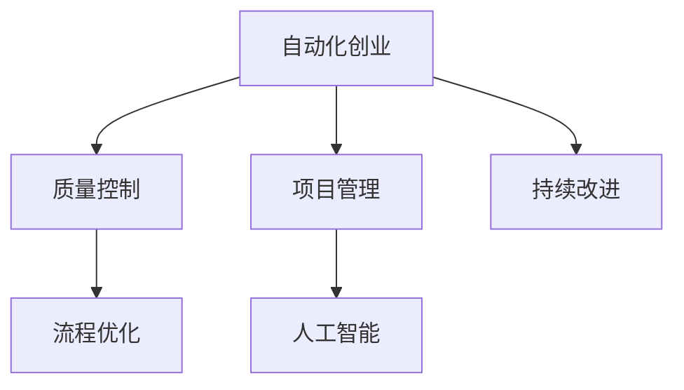

                 

# 自动化创业中的质量控制与管理

> 关键词：自动化创业,质量控制,项目管理,流程优化,人工智能

## 1. 背景介绍

### 1.1 问题由来

自动化创业在近年来迅速兴起，越来越多的企业开始采用自动化技术提升业务效率，降低运营成本，但同时也面临着质量控制和项目管理的严峻挑战。自动化项目不同于传统人工操作，对工具、流程、标准、团队能力等各方面都有更高的要求。如何在保证项目质量的同时，实现快速迭代和灵活应对变化，成为自动化创业中的关键问题。

### 1.2 问题核心关键点

自动化创业中的质量控制与管理，本质上是如何在采用自动化技术的同时，确保项目的高效稳定运行和产品质量。主要问题包括：

- **质量标准制定**：如何设定和实施质量标准，确保自动化系统的可靠性与安全性。
- **流程优化设计**：如何优化项目流程，提高自动化过程的效率和可维护性。
- **项目管理挑战**：如何管理自动化项目的进度、资源和风险，确保项目按时完成。
- **团队协作与沟通**：如何协调多学科团队成员的工作，确保项目顺利进行。
- **持续改进与优化**：如何持续监测项目运行情况，及时发现问题并加以改进。

### 1.3 问题研究意义

自动化创业的成功，依赖于高质量、高效能的自动化系统。质量控制与管理是实现这一目标的基础，决定了自动化项目的成功率和ROI。本文聚焦于自动化创业中的质量控制与管理，深入探讨如何通过科学的管理和流程优化，保障项目的顺利实施，提升企业竞争力。

## 2. 核心概念与联系

### 2.1 核心概念概述

为更好地理解自动化创业中的质量控制与管理，本节将介绍几个密切相关的核心概念：

- **自动化创业**：企业采用自动化技术实现业务流程自动化，提升效率和质量。
- **质量控制**：通过一系列标准和方法，对项目过程和产品进行监测，确保满足预定的质量要求。
- **项目管理**：通过计划、执行、监控、控制等过程，实现项目目标的达成。
- **流程优化**：通过改进和优化业务流程，提高效率、降低成本、提升质量。
- **人工智能**：利用机器学习、数据挖掘等技术，实现自动化过程的智能化决策和管理。

这些核心概念之间的逻辑关系可以通过以下Mermaid流程图来展示：



这个流程图展示了一些核心概念及其之间的关系：

1. 自动化创业通过技术手段实现业务流程自动化。
2. 质量控制确保自动化系统的质量和安全。
3. 项目管理通过标准化的流程实现项目目标。
4. 流程优化提高自动化过程的效率和质量。
5. 人工智能在质量控制、项目管理中提供智能决策支持。
6. 持续改进促进自动化系统的不断优化和升级。

这些概念共同构成了自动化创业的质量控制与管理框架，为企业提供了从规划到执行再到持续改进的全过程指导。

## 3. 核心算法原理 & 具体操作步骤

### 3.1 算法原理概述

自动化创业中的质量控制与管理，主要依赖于以下几个关键算法和流程：

- **统计过程控制(Statistical Process Control, SPC)**：通过统计方法和工具，监控自动化过程的稳定性和性能，及时发现和纠正偏差。
- **六西格玛(Six Sigma)**：以减少缺陷和提高质量为核心目标，通过DMAIC（定义、测量、分析、改进、控制）流程，实现系统优化。
- **敏捷开发(Agile Development)**：采用迭代和增量开发方式，灵活应对变化，快速交付高质量软件。
- **机器学习(Machine Learning)**：利用数据挖掘和模型训练，实现自动化过程的智能决策和优化。

这些算法和流程在自动化创业中的应用，通过数据驱动和智能化的手段，确保项目的高质量、高效率和高可靠性。

### 3.2 算法步骤详解

#### 3.2.1 统计过程控制(SPC)

1. **设定控制界限**：根据历史数据和标准流程，设定过程性能指标的上下限，如平均时间、缺陷率等。
2. **监控数据采集**：实时采集自动化过程的关键性能指标，如生产速度、准确率、错误率等。
3. **数据统计分析**：使用控制图等工具，绘制数据趋势，识别异常点和模式。
4. **异常处理和纠正**：对识别出的异常点进行根本原因分析，并采取纠正措施。
5. **持续监控和优化**：定期评估控制界限，根据新数据调整控制界限，持续优化过程。

#### 3.2.2 六西格玛(DMAIC)

1. **定义(Define)**：明确项目目标和范围，确定关键质量指标。
2. **测量(Measure)**：收集和分析过程数据，了解当前过程性能。
3. **分析(Analyze)**：使用统计工具和模型，识别过程改进的机会和瓶颈。
4. **改进(Improve)**：设计并实施改进方案，优化过程性能。
5. **控制(Control)**：建立标准操作程序，持续监控改进效果，防止回归。

#### 3.2.3 敏捷开发

1. **需求分析**：与客户和团队成员沟通，明确项目需求和优先级。
2. **迭代计划**：制定迭代计划，设定每次迭代的目标和任务。
3. **敏捷开发**：采用Scrum或Kanban等敏捷方法，灵活应对变化，快速交付产品。
4. **迭代评估和反馈**：在每个迭代结束时，评估进度和成果，获取客户反馈。
5. **持续集成和交付**：定期进行代码集成和测试，确保软件质量，及时交付可用的软件版本。

#### 3.2.4 机器学习

1. **数据收集**：收集自动化过程的数据，包括输入、输出、错误等。
2. **数据预处理**：清洗和转换数据，确保数据质量。
3. **模型训练**：选择和训练合适的模型，如回归、分类、聚类等。
4. **预测和优化**：使用训练好的模型，进行自动化过程的预测和优化。
5. **持续学习**：通过不断输入新数据，更新模型，提高预测和优化能力。

### 3.3 算法优缺点

自动化创业中的质量控制与管理算法具有以下优点：

- **科学性和系统性**：通过数据驱动和系统化的管理方法，提升质量控制的准确性和可靠性。
- **灵活性和适应性**：敏捷开发和持续改进方法，能够灵活应对项目变化和市场需求。
- **智能性和优化性**：机器学习技术，提供智能化的决策支持，优化自动化过程。

同时，这些算法也存在一定的局限性：

- **数据依赖**：质量控制和改进的效果依赖于数据的丰富性和质量，数据不足可能导致效果不佳。
- **复杂性**：系统设计和实施过程中，涉及的算法和流程较多，需要一定的专业知识。
- **资源投入**：实施这些方法需要额外的工具、培训和资源投入，短期内可能增加成本。

### 3.4 算法应用领域

自动化创业中的质量控制与管理算法，在以下领域得到了广泛的应用：

- **制造业**：通过SPC和六西格玛，优化生产流程，提高产品质量。
- **金融行业**：采用敏捷开发和机器学习，快速响应市场变化，优化金融产品和服务。
- **医疗保健**：通过质量控制和持续改进，提升医疗服务质量和患者满意度。
- **IT和软件开发**：利用敏捷开发和持续集成，提高软件交付速度和质量。
- **交通运输**：通过优化流程和预测模型，提高运输效率和安全性。

## 4. 数学模型和公式 & 详细讲解 & 举例说明

### 4.1 数学模型构建

本节将使用数学语言对自动化创业中的质量控制与管理方法进行更加严格的刻画。

假设自动化过程的性能指标为 $X$，历史数据为 $\{X_t\}_{t=1}^N$，其中 $X_t$ 为第 $t$ 次自动化过程的性能指标。根据历史数据，可以计算出性能指标的均值 $\mu$ 和标准差 $\sigma$，并根据这些参数设定控制界限 $L$ 和 $U$。

质量控制的目标是通过监控性能指标 $X$，识别和纠正异常点，确保过程稳定在控制界限内。

### 4.2 公式推导过程

- **均值和标准差计算**：
  $$
  \mu = \frac{1}{N}\sum_{t=1}^N X_t
  $$
  $$
  \sigma = \sqrt{\frac{1}{N}\sum_{t=1}^N (X_t - \mu)^2}
  $$

- **控制界限设定**：
  $$
  L = \mu - k\sigma
  $$
  $$
  U = \mu + k\sigma
  $$
  其中 $k$ 为控制界限的系数，一般取值为 $3$ 或 $2.58$。

- **控制图绘制**：使用 X 控制图绘制性能指标的趋势，识别异常点。

### 4.3 案例分析与讲解

**案例：制造业自动化生产线质量控制**

- **设定控制界限**：根据历史数据，计算出性能指标的均值和标准差，设定控制界限 $L$ 和 $U$。
- **监控数据采集**：实时采集生产线上的性能指标，如加工时间、合格率等。
- **数据统计分析**：使用控制图，绘制加工时间等性能指标的趋势，识别异常点。
- **异常处理和纠正**：对识别出的异常点进行根本原因分析，如设备故障、原材料问题等，并采取纠正措施。
- **持续监控和优化**：定期评估控制界限，根据新数据调整控制界限，持续优化生产过程。

## 5. 项目实践：代码实例和详细解释说明

### 5.1 开发环境搭建

在进行质量控制与管理实践前，我们需要准备好开发环境。以下是使用Python进行Scikit-learn开发的环境配置流程：

1. 安装Anaconda：从官网下载并安装Anaconda，用于创建独立的Python环境。

2. 创建并激活虚拟环境：
```bash
conda create -n qc-env python=3.8 
conda activate qc-env
```

3. 安装Scikit-learn：
```bash
pip install scikit-learn
```

4. 安装其他常用工具包：
```bash
pip install pandas numpy matplotlib seaborn
```

完成上述步骤后，即可在`qc-env`环境中开始质量控制与管理实践。

### 5.2 源代码详细实现

这里我们以制造业自动化生产线的质量控制为例，给出使用Scikit-learn进行控制图绘制的Python代码实现。

首先，定义控制图绘制函数：

```python
import numpy as np
from sklearn.metrics import mean, median
from sklearn.linear_model import LinearRegression
import matplotlib.pyplot as plt

def plot_x_control_chart(data, k=3, n=5):
    X = data[:, 0]
    Y = data[:, 1]
    
    X_mean = mean(X)
    X_std = np.std(X, ddof=1)
    
    plt.figure(figsize=(10, 6))
    plt.plot(X, label='Process Mean')
    plt.plot([X_mean - k*X_std, X_mean + k*X_std], [0, 0], 'r--', label='Control Limits')
    plt.axhline(0, color='k', linestyle='--', label='Baseline')
    plt.xlabel('Time')
    plt.ylabel('X')
    plt.title('X Control Chart')
    plt.legend()
    plt.show()

data = np.random.normal(loc=100, scale=5, size=(1000, 2))
plot_x_control_chart(data)
```

然后，定义性能指标监控函数：

```python
def monitor_performance(process_data, k=3, n=5):
    X = process_data[:, 0]
    Y = process_data[:, 1]
    
    X_mean = mean(X)
    X_std = np.std(X, ddof=1)
    
    X_control_limits = [X_mean - k*X_std, X_mean + k*X_std]
    
    monitor_data = []
    for i in range(len(X)-1, -1, -1):
        if abs(X[i] - X_mean) > k*X_std:
            monitor_data.append((X[i], Y[i]))
    
    return monitor_data
```

接着，启动监控流程并在发现异常时报警：

```python
process_data = np.random.normal(loc=100, scale=5, size=(1000, 2))
monitor_data = monitor_performance(process_data)
if len(monitor_data) > 0:
    print("Detection of Outliers:")
    for outlier in monitor_data:
        print(outlier)
```

以上代码实现了使用Scikit-learn绘制X控制图和监控性能指标的Python代码。可以看到，Scikit-learn提供了强大的统计分析和绘图工具，使得质量控制与管理更加便捷高效。

### 5.3 代码解读与分析

让我们再详细解读一下关键代码的实现细节：

**plot_x_control_chart函数**：
- `X` 和 `Y` 分别为数据集中的性能指标和时间。
- `X_mean` 和 `X_std` 分别为性能指标的均值和标准差。
- 使用 `plt.plot` 绘制性能指标的趋势，使用 `plt.plot` 绘制控制界限，使用 `plt.axhline` 绘制基线，使用 `plt.xlabel` 和 `plt.ylabel` 设置坐标轴标签，使用 `plt.title` 设置图表标题，使用 `plt.legend` 设置图例。
- 最后使用 `plt.show` 显示图表。

**monitor_performance函数**：
- `X` 和 `Y` 分别为数据集中的性能指标和时间。
- `X_mean` 和 `X_std` 分别为性能指标的均值和标准差。
- 计算控制界限 `X_control_limits`。
- 遍历数据集，找出超出控制界限的异常点，并存储在 `monitor_data` 中。
- 返回所有监控到的异常点。

**主函数**：
- 生成随机性能数据 `process_data`。
- 使用 `monitor_performance` 函数监控数据，发现异常点并输出。
- 如果存在异常点，输出警告信息。

代码中的核心逻辑是使用Scikit-learn进行性能指标的均值和标准差计算，以及控制界限的设定。通过绘制X控制图，实时监控性能指标的趋势，识别异常点，并及时报警。

## 6. 实际应用场景

### 6.1 智能制造

智能制造中的自动化生产线需要严格的质量控制，以确保产品的合格率和一致性。通过在自动化生产线上部署控制图，实时监控关键性能指标，如加工时间、尺寸公差等，可以及时发现异常，采取纠正措施，避免不合格品的产生。同时，利用机器学习对历史数据进行建模，可以预测生产过程中的潜在问题，提前采取预防措施，提升生产线的稳定性。

### 6.2 金融风控

金融行业中的自动化系统需要对交易数据进行实时监控和分析，以识别和防范风险。通过使用控制图和六西格玛方法，监控交易量、收益率等关键指标，可以及时发现异常交易行为，如洗钱、欺诈等，并进行风险预警。同时，利用机器学习模型，可以预测市场波动和欺诈行为，提供智能化的风险控制建议。

### 6.3 物流仓储

物流仓储中的自动化系统需要对货物进行快速、准确的分类和存储。通过监控自动化搬运机器人的位置、速度等关键指标，使用控制图和SPC方法，可以确保物流过程的稳定性和高效性。同时，利用机器学习对历史数据进行建模，可以预测货物到达时间、存储位置等，提升仓储管理的智能化水平。

### 6.4 未来应用展望

随着人工智能和大数据技术的发展，自动化创业中的质量控制与管理将迎来更多创新和突破。未来的发展趋势可能包括：

1. **大数据分析**：利用大数据技术，从更多维度分析自动化过程，提供更全面的质量控制和改进建议。
2. **智能决策系统**：通过深度学习和强化学习，构建智能决策系统，自动分析和优化自动化过程。
3. **实时监控与预警**：利用物联网技术，实现实时监控和预警，提高自动化系统的可靠性和安全性。
4. **持续改进与优化**：通过持续收集和分析数据，不断优化自动化系统的性能和效率。
5. **跨领域应用**：将质量控制与管理方法应用于更多领域，如医疗、交通等，实现跨领域的智能化管理。

这些趋势将进一步推动自动化创业的发展，为企业提供更加高效、智能、可靠的质量控制与管理解决方案。

## 7. 工具和资源推荐

### 7.1 学习资源推荐

为了帮助开发者系统掌握自动化创业中的质量控制与管理理论基础和实践技巧，这里推荐一些优质的学习资源：

1. **《质量控制与管理系统设计》**：经典的质量控制与管理教材，涵盖SPC、六西格玛、敏捷开发等核心概念。
2. **Coursera《质量控制与质量改进》课程**：由加州大学伯克利分校提供，系统讲解质量控制与管理的基本方法和工具。
3. **《Scikit-learn实战》**：详细讲解Scikit-learn库的使用方法，包括数据预处理、模型训练、结果分析等。
4. **《机器学习实战》**：通过案例分析，介绍机器学习在自动化创业中的应用，提供实战经验。
5. **Kaggle竞赛**：参加质量控制与管理相关的Kaggle竞赛，提升解决实际问题的能力。

通过对这些资源的学习实践，相信你一定能够快速掌握自动化创业中的质量控制与管理方法，并应用于实际的自动化系统开发。

### 7.2 开发工具推荐

高效的开发离不开优秀的工具支持。以下是几款用于自动化创业质量控制与管理的常用工具：

1. **Python**：通用编程语言，适用于数据分析、模型训练等任务。
2. **Jupyter Notebook**：交互式编程环境，支持代码编写、数据可视化、报告生成等。
3. **Scikit-learn**：Python中的机器学习库，提供丰富的统计分析和建模工具。
4. **Tableau**：数据可视化工具，支持复杂的数据分析和可视化需求。
5. **Tableau Public**：免费的可视化工具，支持发布和分享可视化图表。
6. **Trello**：项目管理工具，支持任务分配、进度跟踪、协作沟通等。

合理利用这些工具，可以显著提升自动化创业中的质量控制与管理任务的开发效率，加快创新迭代的步伐。

### 7.3 相关论文推荐

自动化创业中的质量控制与管理研究源于学界的持续研究。以下是几篇奠基性的相关论文，推荐阅读：

1. **《六西格玛：质量管理之道》**：经典的质量管理方法论，提供系统化的方法和工具。
2. **《敏捷开发原则与实践》**：敏捷开发方法论的详细介绍，涵盖Scrum、Kanban等核心概念。
3. **《统计过程控制》**：统计过程控制方法的系统性介绍，涵盖SPC、Cpk等核心概念。
4. **《大数据质量管理》**：利用大数据技术进行质量管理的创新思路。
5. **《机器学习在质量控制中的应用》**：机器学习在质量控制中的应用案例和算法研究。

这些论文代表了大数据时代质量控制与管理的最新研究进展，通过学习这些前沿成果，可以帮助研究者把握学科前进方向，激发更多的创新灵感。

## 8. 总结：未来发展趋势与挑战

### 8.1 研究成果总结

本文对自动化创业中的质量控制与管理方法进行了全面系统的介绍。首先阐述了质量控制与管理的核心概念和研究背景，明确了其在自动化创业中的重要性和应用场景。其次，从原理到实践，详细讲解了SPC、六西格玛、敏捷开发和机器学习等关键方法和工具。最后，通过代码实例和实际应用案例，展示了质量控制与管理方法在自动化创业中的具体应用。

通过本文的系统梳理，可以看到，自动化创业中的质量控制与管理，是实现自动化系统高效、稳定运行的基础，决定了自动化创业的成败。

### 8.2 未来发展趋势

展望未来，自动化创业中的质量控制与管理将呈现以下几个发展趋势：

1. **数据驱动的智能化**：利用大数据和机器学习技术，实现质量控制与管理的智能化和自动化。
2. **持续改进与优化**：通过持续收集和分析数据，不断优化自动化系统的性能和效率。
3. **跨领域应用**：将质量控制与管理方法应用于更多领域，如医疗、交通等，实现跨领域的智能化管理。
4. **自动化与人工智能融合**：将质量控制与管理与人工智能技术融合，实现更加智能和灵活的质量控制。
5. **实时监控与预警**：利用物联网和实时监控技术，实现质量控制的实时化和自动化。

### 8.3 面临的挑战

尽管自动化创业中的质量控制与管理技术已经取得了显著进展，但在迈向更加智能化、普适化应用的过程中，仍面临诸多挑战：

1. **数据质量和多样性**：质量控制和管理依赖于高质量和多样性的数据，数据不足或质量不佳可能导致效果不佳。
2. **复杂性和技术门槛**：质量控制与管理方法涉及的数据分析和建模过程复杂，需要一定的专业知识和技能。
3. **资源投入与成本**：实施这些方法需要额外的工具、培训和资源投入，短期内可能增加成本。
4. **算法和模型选择**：选择适合的算法和模型进行质量控制和管理，需要根据具体情况进行细致分析。
5. **跨学科协作**：质量控制与管理涉及多学科的协同工作，需要有效的沟通和协作机制。

### 8.4 研究展望

面对自动化创业中的质量控制与管理所面临的挑战，未来的研究需要在以下几个方面寻求新的突破：

1. **数据采集与处理**：开发高效的数据采集和处理工具，确保数据的丰富性和质量。
2. **智能决策系统**：利用深度学习和强化学习技术，构建智能决策系统，自动分析和优化自动化过程。
3. **跨学科协作**：建立有效的跨学科协作机制，促进质量控制与管理方法的推广和应用。
4. **开源与共享**：推动质量控制与管理方法的开源与共享，促进技术的普及和应用。
5. **持续学习与优化**：持续收集和分析数据，不断优化质量控制与管理方法，提升其应用效果。

这些研究方向的探索发展，必将引领自动化创业中的质量控制与管理技术迈向更高的台阶，为构建更加高效、智能、可靠的企业自动化系统提供有力支持。总之，质量控制与管理是自动化创业中不可或缺的重要环节，只有不断优化和提升，才能实现高质量、高效率的自动化系统。

## 9. 附录：常见问题与解答

**Q1：什么是自动化创业中的质量控制与管理？**

A: 自动化创业中的质量控制与管理，是指在采用自动化技术实现业务流程自动化的过程中，通过制定和实施质量标准、优化流程设计、进行项目管理等手段，确保自动化系统的可靠性、安全性和效率，从而提升企业竞争力。

**Q2：自动化创业中质量控制与管理的主要算法和工具有哪些？**

A: 主要算法包括统计过程控制(SPC)、六西格玛、敏捷开发、机器学习等。主要工具包括Scikit-learn、Python、Jupyter Notebook、Tableau等。

**Q3：如何应对自动化创业中的数据质量和多样性问题？**

A: 通过多渠道数据采集、数据清洗和预处理、数据标注等手段，确保数据的丰富性和质量。同时，利用大数据技术和机器学习模型，进行数据挖掘和特征提取，提升数据处理的效率和效果。

**Q4：自动化创业中的质量控制与管理如何进行团队协作和沟通？**

A: 通过项目管理工具如Trello、Asana等，制定项目计划、任务分配和进度跟踪。定期召开项目会议，确保团队成员之间的沟通和协作。使用协作工具如Slack、Microsoft Teams等，及时分享信息和反馈问题。

**Q5：自动化创业中的质量控制与管理如何进行持续改进和优化？**

A: 定期进行质量审计和性能评估，分析数据和指标，识别改进机会。通过敏捷开发方法，快速迭代和优化自动化系统。持续收集和分析数据，利用机器学习模型进行预测和优化，不断提升系统性能和效率。

---

作者：禅与计算机程序设计艺术 / Zen and the Art of Computer Programming

