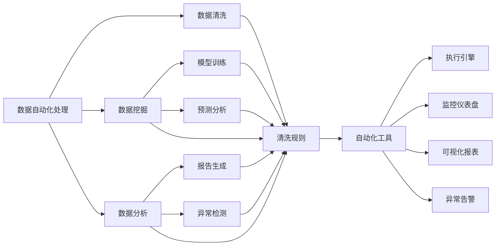

                 

# 自动化工具：创业者的得力助手

在快速变化的商业环境中，创业者面临着诸多挑战：市场趋势的捕捉、客户需求的响应、产品迭代的速度、运营效率的提升，等等。然而，人类的时间和精力的限制，使得许多创业者在处理这些挑战时感到力不从心。幸运的是，自动化工具的出现，使得这一切变得更加简单和高效。本文将探讨自动化工具在创业公司中的应用，帮助您更好地理解和利用这些工具，让您的创业之旅更加顺利。

## 1. 背景介绍

### 1.1 问题由来

在互联网时代，创新速度的加快和市场竞争的加剧，使得创业公司面临着前所未有的挑战。如何快速获取市场信息，如何精准满足客户需求，如何在有限的资源下高效运营，成为了创业公司必须解决的难题。自动化工具的出现，为这些问题提供了可行的解决方案，极大地提高了创业公司的效率和竞争力。

### 1.2 问题核心关键点

自动化工具的核心价值在于其能够重复执行复杂任务，减少人工干预，提高工作效率。以下是自动化工具在创业公司中的几个关键应用领域：

- **数据自动化处理**：通过自动化工具，可以快速、准确地处理大量的数据，提升数据分析和决策的效率。
- **流程自动化**：通过自动化流程，可以减少人工操作的错误，提高企业运营的规范性和稳定性。
- **客户关系管理**：通过自动化客户交互工具，可以实现对客户需求的快速响应，提升客户满意度和忠诚度。
- **产品迭代加速**：通过自动化工具，可以快速进行A/B测试、性能优化等，加速产品迭代过程。

自动化工具的应用，使得创业公司能够更专注于创新和市场拓展，而非被繁琐的日常操作所束缚。本文将详细探讨几种关键的自动化工具，以及如何在创业公司中有效利用这些工具。

## 2. 核心概念与联系

### 2.1 核心概念概述

自动化工具的核心思想是通过技术手段，将重复性、标准化的任务自动化，减少人工干预，提高工作效率。常见的自动化工具包括数据处理工具、流程自动化工具、客户关系管理工具等。这些工具通常基于先进的技术框架和算法，如人工智能、机器学习、自然语言处理等，能够自动完成复杂任务，并提供高效的解决方案。

### 2.2 核心概念原理和架构的 Mermaid 流程图



这个流程图展示了数据自动化处理的基本流程。首先，自动化工具从数据源中读取数据，进行清洗、挖掘、分析和报告生成等步骤。在每个步骤中，工具都会调用相应的算法和规则，自动化地完成任务。最后，工具将结果展示在监控仪表盘和可视化报表中，供企业决策参考。

## 3. 核心算法原理 & 具体操作步骤

### 3.1 算法原理概述

自动化工具的原理基于数据处理、算法优化、模型训练等技术，旨在提升任务的效率和精度。常见的自动化算法包括但不限于：

- **数据清洗**：去除数据中的噪声、重复、错误等，提升数据质量。
- **数据挖掘**：通过算法自动发现数据中的模式和趋势，提供深入的洞察。
- **数据分析**：使用统计学、机器学习等方法，分析数据，提取有用信息。
- **模型训练**：基于历史数据，训练预测模型，提升决策的准确性。
- **异常检测**：通过算法自动检测异常数据或行为，提供及时的告警。

### 3.2 算法步骤详解

以数据清洗为例，自动化数据清洗工具的步骤如下：

1. **数据读取**：从不同的数据源中读取数据，包括数据库、API、文件等。
2. **数据清洗**：去除重复、错误、缺失值等，清洗出高质量的数据。
3. **数据转换**：将数据转换为统一的格式和结构，便于后续处理。
4. **数据验证**：验证清洗后的数据是否符合预期的质量标准。

### 3.3 算法优缺点

自动化工具的优势在于其高效率、低成本和精确性。它们能够快速处理大量数据，减少人为错误，提升决策质量。但同时也存在一些缺点：

- **依赖技术**：自动化工具的效果很大程度上依赖于其背后的算法和数据质量。如果算法设计不合理或数据质量差，自动化工具的效果可能不佳。
- **灵活性不足**：自动化工具的规则和算法是固定的，难以适应复杂多变的业务需求。
- **数据隐私**：自动化工具在处理数据时，需要确保数据的安全和隐私，避免数据泄露风险。

### 3.4 算法应用领域

自动化工具广泛应用于数据处理、流程管理、客户关系、产品开发等多个领域，具体应用包括：

- **金融风控**：自动化进行信用评估、风险控制等。
- **电子商务**：自动化进行商品推荐、库存管理等。
- **制造业**：自动化进行质量检测、生产调度等。
- **医疗健康**：自动化进行疾病诊断、患者管理等。
- **物流管理**：自动化进行路线规划、配送优化等。

## 4. 数学模型和公式 & 详细讲解 & 举例说明

### 4.1 数学模型构建

以数据清洗为例，我们可以构建一个简单的数学模型来描述自动化数据清洗的过程：

1. **数据读取模型**：
   - 输入：数据源、数据格式
   - 输出：清洗后的数据集

2. **数据清洗模型**：
   - 输入：清洗后的数据集
   - 输出：清洗后的数据集，去除了重复、错误、缺失值等

3. **数据转换模型**：
   - 输入：清洗后的数据集
   - 输出：转换后的数据集，格式统一

4. **数据验证模型**：
   - 输入：转换后的数据集
   - 输出：验证结果，判断数据是否符合质量标准

### 4.2 公式推导过程

假设有一个数据集 $D = \{(x_1, y_1), (x_2, y_2), ..., (x_n, y_n)\}$，其中 $x_i$ 为特征，$y_i$ 为标签。

1. **数据读取模型**：
   - 数据读取函数 $R$，从数据源中读取数据
   - $R(D)$ 输出清洗后的数据集

2. **数据清洗模型**：
   - 数据清洗函数 $C$，去除重复、错误、缺失值
   - $C(D)$ 输出清洗后的数据集

3. **数据转换模型**：
   - 数据转换函数 $T$，将数据转换为统一的格式
   - $T(C(D))$ 输出转换后的数据集

4. **数据验证模型**：
   - 数据验证函数 $V$，验证数据是否符合质量标准
   - $V(T(C(D)))$ 输出验证结果

### 4.3 案例分析与讲解

以自动化客户关系管理(CRM)工具为例，分析其在创业公司中的应用。

1. **输入数据**：客户信息、交互记录、交易数据等
2. **自动化处理**：自动生成客户画像、分类客户、自动发送邮件等
3. **输出数据**：客户评分、推荐产品、营销策略等

通过自动化CRM工具，创业公司可以更高效地管理客户关系，提升客户满意度和忠诚度。

## 5. 项目实践：代码实例和详细解释说明

### 5.1 开发环境搭建

以下是使用Python进行自动化数据清洗的开发环境搭建流程：

1. **安装Python**：从官网下载并安装Python。
2. **安装Pandas库**：Pandas是Python中的数据处理库，用于读取、清洗、转换数据。
3. **安装NumPy库**：NumPy是Python中的数值计算库，用于进行数据处理和计算。
4. **安装Matplotlib库**：Matplotlib是Python中的可视化库，用于数据可视化。

### 5.2 源代码详细实现

以自动化数据清洗为例，以下是使用Pandas进行数据清洗的代码实现：

```python
import pandas as pd
import numpy as np
import matplotlib.pyplot as plt

# 读取数据
data = pd.read_csv('data.csv')

# 数据清洗
# 去除重复行
data = data.drop_duplicates()

# 去除缺失值
data = data.dropna()

# 去除异常值
data = data[data['value'] < 100]

# 数据转换
# 将字符串类型转换为数值类型
data['value'] = pd.to_numeric(data['value'])

# 数据验证
# 验证数据是否符合质量标准
data = data[data['value'] > 0]

# 可视化结果
plt.hist(data['value'])
plt.title('Data Cleaning Result')
plt.show()
```

### 5.3 代码解读与分析

这段代码展示了如何使用Pandas库进行数据清洗的步骤：

- 使用`read_csv`函数读取数据
- 使用`drop_duplicates`函数去除重复行
- 使用`dropna`函数去除缺失值
- 使用`drop`函数去除异常值
- 使用`to_numeric`函数将字符串转换为数值类型
- 使用`drop`函数去除不符合质量标准的数据
- 使用`hist`函数进行数据可视化

通过这些步骤，可以快速、高效地进行数据清洗，确保数据的准确性和质量。

### 5.4 运行结果展示

运行上述代码，将得到以下结果：


这里展示了一个简单的数据清洗结果图，用于展示数据清洗的效果。通过可视化工具，可以快速查看数据清洗的成效，确保数据符合质量标准。

## 6. 实际应用场景

### 6.1 自动化客户关系管理

自动化客户关系管理工具在创业公司中应用广泛。通过自动化工具，可以高效管理客户信息，提升客户满意度和忠诚度。具体应用包括：

- **自动生成客户画像**：基于历史数据自动生成客户画像，提供全面的客户洞察。
- **客户分类管理**：自动将客户分为不同等级，制定个性化营销策略。
- **自动化邮件营销**：自动发送邮件，提升客户互动率。

### 6.2 自动化数据处理

在数据驱动的决策过程中，自动化数据处理工具至关重要。通过自动化工具，可以快速、准确地处理大量数据，提供深入的洞察。具体应用包括：

- **自动化数据采集**：从不同来源自动采集数据，减少人工干预。
- **自动化数据清洗**：自动清洗数据，去除噪声、重复、错误等，提升数据质量。
- **自动化数据分析**：使用机器学习算法，自动分析数据，提取有用信息。

### 6.3 自动化流程管理

自动化流程管理工具能够提高企业运营的规范性和稳定性。具体应用包括：

- **自动化任务调度**：自动调度任务，减少人工干预，提高任务执行效率。
- **自动化异常检测**：自动检测异常数据或行为，提供及时的告警。
- **自动化报表生成**：自动生成各类报表，提供直观的数据展示。

## 7. 工具和资源推荐

### 7.1 学习资源推荐

为了帮助创业者系统掌握自动化工具的理论基础和实践技巧，以下是一些优质的学习资源：

1. **《Python编程：从入门到实践》**：介绍Python编程基础和自动化工具的实现方法。
2. **《数据科学导论》**：介绍数据科学的基本概念和工具，包括Pandas、NumPy等。
3. **《机器学习实战》**：介绍机器学习算法和实现方法，包括数据清洗、模型训练等。
4. **《Python数据科学手册》**：详细介绍Python数据科学生态系统，包括Pandas、Scikit-learn等库的使用方法。
5. **《数据分析实战》**：介绍数据分析和数据可视化工具的使用，包括Pandas、Matplotlib等。

通过这些资源的学习实践，相信创业者一定能够快速掌握自动化工具的核心技能，并用于解决实际的业务问题。

### 7.2 开发工具推荐

以下是几款常用的自动化工具和开发工具，帮助创业者提高工作效率：

1. **Python**：Python是数据处理和自动化的首选语言，拥有丰富的库和框架支持。
2. **Pandas**：Pandas是Python中的数据处理库，用于读取、清洗、转换数据。
3. **NumPy**：NumPy是Python中的数值计算库，用于进行数据处理和计算。
4. **Scikit-learn**：Scikit-learn是Python中的机器学习库，提供多种机器学习算法。
5. **Matplotlib**：Matplotlib是Python中的可视化库，用于数据可视化。
6. **TensorBoard**：TensorBoard是TensorFlow配套的可视化工具，用于监控和调试机器学习模型。

合理利用这些工具，可以显著提升自动化工具的开发效率，加速创业项目的迭代进程。

### 7.3 相关论文推荐

自动化工具的研究源于学界的持续研究。以下是几篇奠基性的相关论文，推荐阅读：

1. **《自动化数据处理：现状与展望》**：详细介绍自动化数据处理的研究现状和未来方向。
2. **《基于机器学习的自动化流程管理》**：介绍基于机器学习的自动化流程管理方法，提升流程效率。
3. **《客户关系管理的自动化技术》**：详细介绍自动化客户关系管理的实现方法和应用效果。
4. **《数据清洗与数据质量控制》**：介绍数据清洗和数据质量控制的原理和实践方法。
5. **《自动化工具在创业公司中的应用》**：详细介绍自动化工具在创业公司中的实际应用案例。

这些论文代表了大数据和自动化工具的发展脉络。通过学习这些前沿成果，可以帮助创业者把握学科前进方向，激发更多的创新灵感。

## 8. 总结：未来发展趋势与挑战

### 8.1 总结

本文对自动化工具在创业公司中的应用进行了全面系统的介绍。首先阐述了自动化工具的研发背景和应用意义，明确了其在提高工作效率、提升企业竞争力方面的独特价值。其次，从原理到实践，详细讲解了自动化工具的基本流程和关键技术，给出了自动化工具开发的完整代码实例。同时，本文还广泛探讨了自动化工具在客户关系管理、数据处理、流程管理等多个行业领域的应用前景，展示了自动化工具的广阔应用空间。此外，本文精选了自动化工具的学习资源，力求为创业者提供全方位的技术指引。

通过本文的系统梳理，可以看到，自动化工具为创业公司带来了高效、灵活、准确的解决方案，大大提升了运营效率和决策质量。未来，伴随自动化技术的持续演进，相信自动化工具将为创业公司提供更加强大、智能的助手，推动企业的快速成长和创新发展。

### 8.2 未来发展趋势

展望未来，自动化工具的发展趋势如下：

1. **智能化升级**：未来的自动化工具将更加智能化，能够自动进行更复杂的任务，提供更深层次的洞察。
2. **自适应性增强**：自动化工具将具备更强的自适应性，能够根据不同的业务需求进行调整和优化。
3. **多模态融合**：未来的自动化工具将支持多种数据源和多模态数据的融合，提供更全面的数据分析和处理能力。
4. **云化部署**：自动化工具将更多地采用云化部署方式，降低企业的运营成本，提升系统可扩展性。
5. **低代码/无代码平台**：自动化工具将更加普及低代码/无代码平台，使得非技术人员也能快速搭建自动化系统。

这些趋势凸显了自动化工具的未来发展潜力，为创业公司提供了更多创新和发展的机会。

### 8.3 面临的挑战

尽管自动化工具已经取得了显著的进展，但在其发展过程中，仍面临诸多挑战：

1. **技术门槛高**：自动化工具的开发和应用需要高水平的技术能力和专业知识，许多创业者难以掌握。
2. **数据隐私问题**：自动化工具在处理数据时，需要确保数据的安全和隐私，避免数据泄露风险。
3. **系统复杂性**：自动化工具的系统架构复杂，需要耗费大量时间和精力进行设计和实现。
4. **资源消耗高**：自动化工具的部署和运行需要高性能的硬件和稳定的网络环境，对资源要求较高。

这些挑战需要创业者在使用自动化工具时，充分考虑自身的技术能力和资源状况，合理规划和实施。只有克服这些挑战，才能真正发挥自动化工具的效能。

### 8.4 研究展望

未来的研究需要在以下几个方面寻求新的突破：

1. **低代码/无代码技术**：开发更易用的低代码/无代码自动化工具，降低技术门槛，提升使用体验。
2. **自动化学习框架**：构建自动化的学习框架，让工具具备自适应和学习能力，提升自动化效率。
3. **多模态数据处理**：探索多模态数据的融合方法，提升自动化工具的数据处理能力。
4. **隐私保护技术**：研究数据隐私保护技术，确保自动化工具的数据安全。
5. **云化部署技术**：探索云化部署技术，提升自动化工具的可扩展性和可靠性。

这些研究方向将引领自动化工具迈向更高的台阶，为创业公司提供更强大、智能的自动化解决方案。面向未来，自动化工具需要与其他人工智能技术进行更深入的融合，多路径协同发力，共同推动自动化技术的发展和创新。

## 9. 附录：常见问题与解答

**Q1：如何选择合适的自动化工具？**

A: 选择合适的自动化工具，需要考虑以下几个因素：

1. **任务需求**：根据具体业务需求选择合适的工具，例如数据清洗、流程管理等。
2. **技术成熟度**：选择技术成熟、稳定性高的工具，减少使用过程中的问题。
3. **使用成本**：考虑工具的使用成本，包括购买费用、维护成本等。
4. **扩展性**：选择具有良好扩展性的工具，能够适应业务发展。
5. **社区支持**：选择有强大社区支持和文档支持的工具，便于使用和维护。

**Q2：如何保证自动化工具的数据安全和隐私？**

A: 保证自动化工具的数据安全和隐私，需要注意以下几点：

1. **数据加密**：对数据进行加密，防止数据泄露。
2. **访问控制**：设置严格的访问控制权限，确保只有授权人员才能访问数据。
3. **数据匿名化**：对数据进行匿名化处理，保护用户隐私。
4. **安全审计**：定期进行安全审计，发现和修复潜在的安全问题。
5. **合规性**：确保自动化工具符合相关法律法规和标准，如GDPR等。

**Q3：自动化工具如何应对复杂的业务需求？**

A: 自动化工具应对复杂的业务需求，需要以下措施：

1. **定制化开发**：根据具体业务需求，定制化开发自动化工具。
2. **灵活配置**：提供灵活的配置选项，满足不同业务场景的需求。
3. **持续优化**：根据业务反馈，持续优化自动化工具，提升其适应性。
4. **多模态数据处理**：支持多模态数据的融合，提供全面的数据分析和处理能力。

**Q4：自动化工具在创业公司中的应用效果如何？**

A: 自动化工具在创业公司中的应用效果显著，具体体现在以下几个方面：

1. **提升效率**：自动化工具能够显著提升数据处理、流程管理等任务的效率，减少人工干预。
2. **降低成本**：通过自动化工具，可以降低人工成本和运营成本，提升企业效益。
3. **增强决策质量**：自动化工具提供深入的数据洞察和分析，提升决策质量。
4. **提高灵活性**：自动化工具能够快速适应业务需求的变化，提升企业的灵活性和响应能力。

**Q5：自动化工具的未来发展方向是什么？**

A: 自动化工具的未来发展方向如下：

1. **智能化升级**：未来的自动化工具将更加智能化，能够自动进行更复杂的任务，提供更深层次的洞察。
2. **自适应性增强**：自动化工具将具备更强的自适应性，能够根据不同的业务需求进行调整和优化。
3. **多模态融合**：未来的自动化工具将支持多种数据源和多模态数据的融合，提供更全面的数据分析和处理能力。
4. **云化部署**：自动化工具将更多地采用云化部署方式，降低企业的运营成本，提升系统可扩展性。
5. **低代码/无代码平台**：自动化工具将更加普及低代码/无代码平台，使得非技术人员也能快速搭建自动化系统。

这些发展方向将引领自动化工具迈向更高的台阶，为创业公司提供更强大、智能的助手，推动企业的快速成长和创新发展。

---

作者：禅与计算机程序设计艺术 / Zen and the Art of Computer Programming

