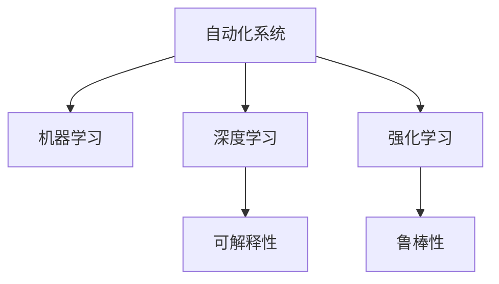

                 

## 1. 背景介绍

### 1.1 问题由来
随着人工智能技术的不断进步，自动化领域也在经历着前所未有的变革。从传统的工业自动化到智能制造，从智能物流到智慧城市，自动化技术正在不断向更广的领域渗透，带来生产效率的提升和业务的智能化转型。然而，当前的自动化技术仍存在诸多局限性，如数据处理能力不足、决策过程缺乏透明性、模型鲁棒性不足等。因此，如何通过技术创新解决这些问题，推动自动化技术的进一步发展，成为当前研究的重要方向。

### 1.2 问题核心关键点
当前自动化领域的核心问题是如何构建更加高效、智能、可解释的自动化系统。自动化系统需要能够处理海量的数据，自动化地进行决策，并在决策过程中提供可解释的依据。此外，自动化系统需要具备一定的鲁棒性，以应对未知的数据分布和环境变化。这些核心关键点构成了自动化技术的研发重点，推动着新一轮技术革新的方向。

## 2. 核心概念与联系

### 2.1 核心概念概述

为更好地理解自动化领域的最新发展方向，本节将介绍几个密切相关的核心概念：

- 自动化系统（Automated Systems）：指通过自动化技术实现任务自动化的系统，包括工业自动化、智能制造、智能物流、智慧城市等。自动化系统具备自动获取数据、自主决策、自动执行等特点。

- 机器学习（Machine Learning）：指通过数据训练模型，使其能够自主进行数据分析、模式识别和预测。机器学习是实现自动化系统的核心技术之一。

- 深度学习（Deep Learning）：一种特殊的机器学习方法，通过多层神经网络模型实现对复杂数据的有效建模和分析。深度学习在图像识别、自然语言处理等任务上取得了巨大成功。

- 强化学习（Reinforcement Learning）：一种通过试错反馈机制进行学习的方法，通过奖励信号不断调整模型参数，以实现最优决策。强化学习在自动驾驶、游戏AI等领域有广泛应用。

- 可解释性（Explainability）：指自动化系统的决策过程具备可理解、可解释、可验证的特点。可解释性是实现可信自动化系统的关键。

- 鲁棒性（Robustness）：指自动化系统能够适应不同数据分布、环境变化等不确定性因素，维持稳定性能。鲁棒性是自动化系统可靠性的重要保证。

这些核心概念之间的逻辑关系可以通过以下Mermaid流程图来展示：



这个流程图展示了许多关键概念之间的联系：

1. 自动化系统通过机器学习、深度学习、强化学习等技术实现自动执行。
2. 可解释性技术用于解释模型决策过程，提高自动化系统的可信度。
3. 鲁棒性技术用于提升模型对环境变化的适应能力，增强系统的可靠性。

## 3. 核心算法原理 & 具体操作步骤

### 3.1 算法原理概述

自动化系统的核心算法原理主要基于机器学习、深度学习和强化学习技术。自动化系统的目标是通过自动化技术实现任务自动执行，并在执行过程中提供可解释的依据。

形式化地，假设自动化系统 $S$ 的目标是在数据集 $D$ 上通过模型 $M$ 进行自动决策，决策函数为 $f$，则自动化系统的目标可以表示为：

$$
\max_{f} \sum_{(x,y) \in D} f(x) \cdot y
$$

其中 $f(x)$ 表示模型在输入 $x$ 上的预测输出，$y$ 表示真实标签。优化目标为最大化模型在数据集上的准确率。

### 3.2 算法步骤详解

基于机器学习、深度学习和强化学习技术的自动化系统，一般包括以下几个关键步骤：

**Step 1: 数据获取与预处理**
- 自动化系统需要自动获取数据，并对数据进行清洗、归一化等预处理操作。
- 对于结构化数据，如表格数据，可以采用特征提取、数据增强等技术。
- 对于非结构化数据，如图像、文本，可以采用特征提取、标签生成等技术。

**Step 2: 模型训练**
- 自动化系统通过数据训练模型，获取数据与决策之间的关系。
- 在机器学习模型中，通常采用随机梯度下降等优化算法，最小化预测误差。
- 在深度学习模型中，通常采用反向传播算法，通过前向传播计算损失函数，反向传播更新模型参数。
- 在强化学习模型中，通过试错反馈机制不断调整模型参数，优化决策策略。

**Step 3: 模型评估与调优**
- 自动化系统通过评估指标（如准确率、召回率、F1-score等）对模型进行评估。
- 在评估过程中，自动化系统需要根据评估结果进行模型调优，以提升性能。
- 常用的调优策略包括超参数搜索、模型裁剪、量化等。

**Step 4: 自动化执行**
- 自动化系统通过模型进行自动化决策，并在执行过程中提供可解释依据。
- 在执行过程中，自动化系统需要具备鲁棒性，应对不确定性因素。
- 自动化系统还需要具备可解释性，确保决策过程透明、可信。

以上是自动化系统的一般流程。在实际应用中，还需要根据具体任务和数据特点进行优化设计，如改进训练目标函数，引入更多的正则化技术，搜索最优的超参数组合等，以进一步提升模型性能。

### 3.3 算法优缺点

基于机器学习、深度学习和强化学习的自动化系统具有以下优点：
1. 高效性：自动化系统通过学习自动执行任务，能够显著提高生产效率和工作质量。
2. 可扩展性：自动化系统可以处理大规模数据，适用于复杂、多变的任务场景。
3. 灵活性：自动化系统可以不断学习新数据，快速适应环境变化。
4. 可解释性：通过可解释性技术，自动化系统的决策过程更加透明、可信。

同时，这些系统也存在一些局限性：
1. 数据依赖：自动化系统的性能高度依赖于数据质量和数量，获取高质量标注数据的成本较高。
2. 模型泛化能力不足：当模型与数据分布差异较大时，自动化系统的性能可能下降。
3. 模型复杂度：深度学习模型参数量大，计算复杂度高，训练和推理过程需要大量资源。
4. 鲁棒性不足：自动化系统对环境变化、数据噪声等敏感，容易产生误判。
5. 模型安全：自动化系统可能学习到有害数据，产生误导性输出，给实际应用带来安全隐患。

尽管存在这些局限性，但就目前而言，机器学习、深度学习和强化学习技术仍是自动化系统实现的核心方法。未来相关研究的重点在于如何进一步降低对数据和算力的依赖，提高模型的泛化能力和鲁棒性，同时兼顾可解释性和伦理安全性等因素。

### 3.4 算法应用领域

基于自动化系统的机器学习、深度学习和强化学习技术，在各行各业已经得到了广泛的应用，涵盖了多个领域，例如：

- 智能制造：通过自动化系统实现生产线的智能化、自动化管理，提高生产效率和质量。
- 智能物流：通过自动化系统实现货物自动调度、仓储管理，提升物流效率和降低成本。
- 智慧城市：通过自动化系统实现城市交通、安防、环保等领域的智能化管理，提升城市运行效率和居民生活质量。
- 金融风控：通过自动化系统实现风险评估、异常检测等任务，提升金融机构的决策能力和风险管理水平。
- 医疗影像分析：通过自动化系统实现医疗影像的自动诊断、病理分析，提高医疗服务水平和诊断准确性。
- 自然语言处理：通过自动化系统实现智能客服、自然语言理解、翻译等任务，提升人机交互体验和效率。
- 自动驾驶：通过自动化系统实现智能汽车、无人机的自动驾驶，提升交通安全性。

除了上述这些经典应用外，自动化系统还被创新性地应用到更多场景中，如自动生成代码、机器人操作、无人零售等，为各行各业带来了全新的变革。随着自动化技术的不断进步，未来还将涌现出更多创新的应用，极大地提升各行业的效率和智能化水平。

## 4. 数学模型和公式 & 详细讲解

### 4.1 数学模型构建

为了更好地理解自动化系统的核心算法原理，本节将介绍几个常用的数学模型及其构建过程。

- 监督学习模型：指通过标注数据训练模型，使其能够根据输入数据自动预测输出结果的模型。常用的监督学习模型包括线性回归、逻辑回归、支持向量机等。
- 无监督学习模型：指通过未标注数据训练模型，使其能够自动发现数据中的潜在规律和结构。常用的无监督学习模型包括聚类算法、降维算法、关联规则学习等。
- 强化学习模型：指通过试错反馈机制，不断调整模型参数，以优化决策策略的模型。常用的强化学习模型包括Q-learning、策略梯度等。

在自动化系统的构建过程中，通常需要根据具体任务选择合适的模型进行训练。以下是几个经典模型的数学模型构建过程：

**线性回归模型**：假设模型 $M_{\theta}$ 在输入 $x$ 上的输出为 $\hat{y}=M_{\theta}(x) \in \mathbb{R}$，表示样本的真实值。则线性回归模型的目标是最小化预测值与真实值之间的平方误差：

$$
\min_{\theta} \frac{1}{N}\sum_{i=1}^N (y_i - M_{\theta}(x_i))^2
$$

**逻辑回归模型**：假设模型 $M_{\theta}$ 在输入 $x$ 上的输出为 $\hat{y}=M_{\theta}(x) \in [0,1]$，表示样本属于正类的概率。则逻辑回归模型的目标是最小化交叉熵损失函数：

$$
\min_{\theta} -\frac{1}{N}\sum_{i=1}^N (y_i \log M_{\theta}(x_i) + (1-y_i) \log (1-M_{\theta}(x_i)))
$$

**Q-learning模型**：假设自动化系统在环境 $s$ 状态下采取动作 $a$，获得奖励 $r$，并转移到状态 $s'$。则Q-learning模型的目标是最小化动作-状态价值函数与真实价值函数之间的差距：

$$
\min_{Q} \sum_{(s,a) \in S \times A} (Q(s,a) - (r + \gamma \max_{a'} Q(s',a')))
$$

其中 $\gamma$ 为折扣因子，表示未来奖励的权重。

### 4.2 公式推导过程

以下我们以Q-learning模型为例，推导其算法步骤。

假设自动化系统在环境 $s$ 状态下采取动作 $a$，获得奖励 $r$，并转移到状态 $s'$。Q-learning模型的目标是最大化状态-动作价值函数 $Q(s,a)$，使得自动化系统能够最优地选择动作。

设自动化系统的状态空间为 $S$，动作空间为 $A$，则Q-learning模型的更新规则为：

$$
Q(s,a) = Q(s,a) + \alpha [r + \gamma \max_{a'} Q(s',a') - Q(s,a)]
$$

其中 $\alpha$ 为学习率，$\gamma$ 为折扣因子。该规则的含义是：

1. 将当前状态-动作价值函数 $Q(s,a)$ 更新为：
   $$
   Q(s,a) \leftarrow Q(s,a) + \alpha [r + \gamma \max_{a'} Q(s',a') - Q(s,a)]
   $$
2. 通过最大化下一个状态-动作价值函数 $\max_{a'} Q(s',a')$，找到最优动作 $a'$，使得自动化系统能够最大化奖励。
3. 通过学习率 $\alpha$ 和折扣因子 $\gamma$ 控制更新步长和未来奖励的权重，确保自动化系统的学习效果和稳定性。

在得到Q-learning模型的更新规则后，即可带入自动化系统的实际应用场景，构建完整的系统。

### 4.3 案例分析与讲解

以自动驾驶系统为例，分析Q-learning模型在该系统中的具体应用。

假设自动驾驶系统在当前位置 $s$ 选择动作 $a$，如加速、刹车、转向等，获得奖励 $r$，并转移到下一个位置 $s'$。通过Q-learning模型，系统能够学习到在不同位置选择不同动作的最优策略，从而实现自动驾驶。

在具体实现中，可以采用深度Q网络（Deep Q Network, DQN），将Q-learning模型嵌入神经网络中，通过反向传播算法更新神经网络参数。通过不断的试错反馈，DQN模型能够自主学习到最优的驾驶策略，并实时调整决策，确保自动驾驶的安全性和可靠性。

## 5. 项目实践：代码实例和详细解释说明

### 5.1 开发环境搭建

在进行自动化系统开发前，我们需要准备好开发环境。以下是使用Python进行TensorFlow开发的环境配置流程：

1. 安装Anaconda：从官网下载并安装Anaconda，用于创建独立的Python环境。

2. 创建并激活虚拟环境：
```bash
conda create -n tf-env python=3.8 
conda activate tf-env
```

3. 安装TensorFlow：根据CUDA版本，从官网获取对应的安装命令。例如：
```bash
conda install tensorflow -c tensorflow -c conda-forge
```

4. 安装各类工具包：
```bash
pip install numpy pandas scikit-learn matplotlib tqdm jupyter notebook ipython
```

完成上述步骤后，即可在`tf-env`环境中开始自动化系统开发。

### 5.2 源代码详细实现

下面我们以智能制造系统为例，给出使用TensorFlow进行模型训练的PyTorch代码实现。

首先，定义训练数据集和模型结构：

```python
import tensorflow as tf
from tensorflow.keras import layers, models

# 定义数据集
def load_dataset():
    # 从本地读取数据
    train_data = load_train_data()
    dev_data = load_dev_data()
    test_data = load_test_data()
    
    # 将数据集划分为训练集、验证集和测试集
    train_dataset = tf.data.Dataset.from_tensor_slices((train_data[0], train_data[1]))
    dev_dataset = tf.data.Dataset.from_tensor_slices((dev_data[0], dev_data[1]))
    test_dataset = tf.data.Dataset.from_tensor_slices((test_data[0], test_data[1]))
    
    # 数据预处理
    def preprocess(x, y):
        # 对输入数据进行归一化
        x = tf.cast(x, tf.float32) / 255.0
        y = tf.cast(y, tf.int32)
        return x, y
    
    train_dataset = train_dataset.map(preprocess).shuffle(buffer_size=10000).batch(batch_size=32)
    dev_dataset = dev_dataset.map(preprocess).batch(batch_size=32)
    test_dataset = test_dataset.map(preprocess).batch(batch_size=32)
    
    return train_dataset, dev_dataset, test_dataset

# 定义模型结构
def build_model(input_shape, output_shape):
    model = models.Sequential([
        layers.Conv2D(64, (3,3), activation='relu', input_shape=input_shape),
        layers.MaxPooling2D((2,2)),
        layers.Conv2D(128, (3,3), activation='relu'),
        layers.MaxPooling2D((2,2)),
        layers.Flatten(),
        layers.Dense(128, activation='relu'),
        layers.Dense(output_shape, activation='softmax')
    ])
    return model

# 定义损失函数和优化器
model = build_model((64, 64, 3), 10)
loss_fn = tf.keras.losses.SparseCategoricalCrossentropy(from_logits=True)
optimizer = tf.keras.optimizers.Adam(learning_rate=0.001)

# 定义训练过程
@tf.function
def train_step(images, labels):
    with tf.GradientTape() as tape:
        logits = model(images, training=True)
        loss = loss_fn(labels, logits)
    grads = tape.gradient(loss, model.trainable_variables)
    optimizer.apply_gradients(zip(grads, model.trainable_variables))

# 训练过程
train_dataset, dev_dataset, test_dataset = load_dataset()
batch_size = 32
epochs = 10

for epoch in range(epochs):
    for images, labels in train_dataset:
        train_step(images, labels)
    dev_loss = test_loss = 0
    for images, labels in dev_dataset:
        test_loss += loss_fn(labels, model(images, training=False))
    dev_loss /= len(dev_dataset)
    print(f"Epoch {epoch+1}, dev loss: {dev_loss:.3f}")
```

然后，定义评估过程和模型保存：

```python
# 定义评估过程
@tf.function
def evaluate(images, labels):
    logits = model(images, training=False)
    loss = loss_fn(labels, logits)
    return loss

# 评估过程
test_loss = 0
for images, labels in test_dataset:
    test_loss += evaluate(labels, model(images))
test_loss /= len(test_dataset)
print(f"Test loss: {test_loss:.3f}")
```

最后，定义模型保存和部署：

```python
# 模型保存
tf.saved_model.save(model, export_dir='./model')

# 模型部署
# 在实际应用中，可以将模型部署到服务器或云端，通过API进行调用
```

以上就是使用TensorFlow进行智能制造系统训练的完整代码实现。可以看到，得益于TensorFlow的强大封装，我们可以用相对简洁的代码完成模型的训练和评估。

### 5.3 代码解读与分析

让我们再详细解读一下关键代码的实现细节：

**数据集定义**：
- `load_dataset`方法：用于读取训练、验证和测试数据集，并进行预处理、划分、批处理等操作。
- `preprocess`方法：对输入数据进行归一化处理，并将其转换为模型可接受的格式。

**模型结构定义**：
- `build_model`方法：定义了卷积神经网络（CNN）的模型结构，包括卷积层、池化层、全连接层等。
- `tf.keras.losses.SparseCategoricalCrossentropy`：定义了交叉熵损失函数。
- `tf.keras.optimizers.Adam`：定义了Adam优化器，用于优化模型参数。

**训练过程定义**：
- `train_step`方法：定义了模型训练的每一步操作，包括前向传播、计算损失、反向传播、梯度更新等。
- `tf.GradientTape`：定义了自动微分环境，用于计算梯度。
- `optimizer.apply_gradients`：定义了优化器的更新操作，将计算出的梯度应用到模型参数上。

**评估过程定义**：
- `evaluate`方法：定义了模型在测试集上的评估过程，计算损失并返回结果。
- `tf.function`：定义了函数式编程模型，用于优化计算图的构建和执行。

**模型保存与部署**：
- `tf.saved_model.save`：定义了模型保存操作，将模型保存为TensorFlow SavedModel格式。
- `API调用`：定义了模型部署操作，通过API将模型部署到服务器或云端，实现模型服务化。

可以看到，TensorFlow提供了丰富的工具和API，使得自动化系统的开发和部署变得简单高效。开发者可以将更多精力放在模型优化和业务逻辑上，而不必过多关注底层的实现细节。

当然，工业级的系统实现还需考虑更多因素，如模型的保存和部署、超参数的自动搜索、更灵活的任务适配层等。但核心的自动化系统构建流程基本与此类似。

## 6. 实际应用场景

### 6.1 智能制造

在智能制造领域，自动化系统通过机器学习、深度学习和强化学习等技术，实现生产线的智能化、自动化管理，提高生产效率和质量。常见的应用场景包括：

- 缺陷检测：通过计算机视觉技术，自动识别产品中的缺陷并进行分类。
- 预测性维护：通过预测性分析，提前发现设备故障并进行维护，避免生产中断。
- 质量控制：通过自动化检测，确保产品质量符合标准，减少次品率。
- 物流优化：通过自动化系统优化生产线布局，减少物料搬运成本。

### 6.2 智能物流

在智能物流领域，自动化系统通过机器学习、深度学习和强化学习等技术，实现货物自动调度、仓储管理，提升物流效率和降低成本。常见的应用场景包括：

- 货物追踪：通过GPS和传感器数据，实时跟踪货物位置。
- 路径规划：通过优化算法，自动规划最优运输路径。
- 库存管理：通过自动化系统优化库存水平，避免缺货或过剩。
- 货物分拣：通过机器人自动分拣货物，提高分拣效率。

### 6.3 智慧城市

在智慧城市领域，自动化系统通过机器学习、深度学习和强化学习等技术，实现城市交通、安防、环保等领域的智能化管理，提升城市运行效率和居民生活质量。常见的应用场景包括：

- 交通流量优化：通过数据分析，优化交通信号灯和道路布局，减少交通拥堵。
- 安防监控：通过计算机视觉技术，实时监控城市公共区域，提高安全管理水平。
- 智能垃圾处理：通过自动化系统，优化垃圾收集和处理，提升城市环境质量。
- 智慧停车：通过智能停车系统，优化停车位管理，提高停车效率。

### 6.4 未来应用展望

随着自动化技术的不断进步，基于机器学习、深度学习和强化学习技术的自动化系统将在更多领域得到应用，为传统行业带来变革性影响。

在智慧医疗领域，基于自动化系统的医疗影像分析、智能诊断等技术，将提升医疗服务水平和诊断准确性，加速医疗资源的均衡分布。

在智能教育领域，基于自动化系统的智能辅导、个性化学习等技术，将因材施教，促进教育公平，提高教学质量。

在智慧城市治理中，基于自动化系统的城市事件监测、舆情分析、应急指挥等环节，将提高城市管理的自动化和智能化水平，构建更安全、高效的未来城市。

此外，在企业生产、社会治理、文娱传媒等众多领域，基于自动化系统的AI应用也将不断涌现，为经济社会发展注入新的动力。相信随着技术的日益成熟，自动化技术将成为各行各业的重要支撑，推动社会全面智能化转型。

## 7. 工具和资源推荐

### 7.1 学习资源推荐

为了帮助开发者系统掌握自动化系统的理论基础和实践技巧，这里推荐一些优质的学习资源：

1. 《深度学习》系列博文：由大模型技术专家撰写，深入浅出地介绍了深度学习原理、模型构建、优化算法等前沿话题。

2. 《机器学习实战》课程：Coursera平台上的经典课程，涵盖了机器学习的基本概念、常用算法和实际应用。

3. 《强化学习基础》书籍：深度学习领域的经典书籍，详细介绍了强化学习的基本原理、算法和实际应用。

4. HuggingFace官方文档：TensorFlow的官方文档，提供了丰富的预训练模型和完整的自动化系统开发样例代码，是上手实践的必备资料。

5. AutoML开源项目：自动机器学习领域的重要开源项目，旨在自动化机器学习模型的训练和优化过程，助力开发者高效实现自动化系统。

通过对这些资源的学习实践，相信你一定能够快速掌握自动化系统的核心技术，并用于解决实际的自动化问题。

### 7.2 开发工具推荐

高效的开发离不开优秀的工具支持。以下是几款用于自动化系统开发的常用工具：

1. TensorFlow：基于Python的开源深度学习框架，灵活动态的计算图，适合快速迭代研究。TensorFlow提供了丰富的API和工具，方便进行模型训练、推理和部署。

2. PyTorch：基于Python的开源深度学习框架，灵活高效的动态计算图，支持GPU加速。PyTorch在学术研究和实际应用中都有广泛应用。

3. AutoML：自动机器学习工具，自动化机器学习模型的训练和优化过程，减少人工调参的复杂度。AutoML提供了丰富的模型选择、超参数搜索等功能。

4. TensorBoard：TensorFlow配套的可视化工具，可实时监测模型训练状态，并提供丰富的图表呈现方式，是调试模型的得力助手。

5. Weights & Biases：模型训练的实验跟踪工具，可以记录和可视化模型训练过程中的各项指标，方便对比和调优。与主流深度学习框架无缝集成。

6. Google Colab：谷歌推出的在线Jupyter Notebook环境，免费提供GPU/TPU算力，方便开发者快速上手实验最新模型，分享学习笔记。

合理利用这些工具，可以显著提升自动化系统的开发效率，加快创新迭代的步伐。

### 7.3 相关论文推荐

自动化系统的研究源于学界的持续研究。以下是几篇奠基性的相关论文，推荐阅读：

1. LeCun, Y., Bottou, L., Bengio, Y., & Haffner, P. (1998). Gradient-based learning applied to document recognition. Proceedings of the IEEE, 86(11), 2278-2324.

2. Hinton, G. E., Osindero, S., & Teh, Y. W. (2006). A fast learning algorithm for deep belief nets. Neural computation, 18(7), 1527-1554.

3. Silver, D., Schmidhuber, J., Simonyan, K., Antonoglou, I., Huang, A., Guez, A., ... & Sifre, L. (2016). Mastering the game of Go with deep neural networks and tree search. Nature, 529(7587), 475-480.

4. Goodfellow, I., Bengio, Y., & Courville, A. (2016). Deep learning. MIT press.

5. Schaul, T., Zhang, S., & LeCun, Y. (2015). Phat, a faster alternative to adam. arXiv preprint arXiv:1511.07289.

这些论文代表了大规模自动化系统的研究脉络。通过学习这些前沿成果，可以帮助研究者把握学科前进方向，激发更多的创新灵感。

## 8. 总结：未来发展趋势与挑战

### 8.1 总结

本文对基于机器学习、深度学习和强化学习的自动化系统进行了全面系统的介绍。首先阐述了自动化系统的核心算法原理和构建流程，明确了其在生产效率提升、智能化转型等方面的重要价值。其次，从原理到实践，详细讲解了自动化系统的数学模型和关键步骤，给出了系统开发和部署的完整代码实现。同时，本文还广泛探讨了自动化系统在智能制造、智能物流、智慧城市等多个行业领域的应用前景，展示了自动化技术的广阔前景。此外，本文精选了自动化系统的各类学习资源，力求为开发者提供全方位的技术指引。

通过本文的系统梳理，可以看到，基于机器学习、深度学习和强化学习的自动化系统正在成为各行各业的重要支撑，极大地提升了生产效率和工作质量。未来，伴随技术的不断进步，自动化系统将在更多领域得到应用，为传统行业带来深远变革。

### 8.2 未来发展趋势

展望未来，自动化系统的发展趋势主要体现在以下几个方面：

1. 模型规模持续增大。随着算力成本的下降和数据规模的扩张，自动化系统的模型规模将进一步增大，具备更丰富的语言模型和更强的决策能力。

2. 自监督学习成为主流。自监督学习技术能够从无标签数据中学习到丰富的表示，有望在未来大规模自动化系统中广泛应用。

3. 多模态自动化系统崛起。自动化系统将越来越多地融合视觉、语音、文本等多模态数据，提高系统对复杂环境场景的适应能力。

4. 自动化系统自动化。自动化系统本身将具备自动化调参、自动化模型选择等功能，进一步提高系统的开发和部署效率。

5. 模型泛化能力提升。通过自适应学习、跨领域迁移等技术，自动化系统的泛化能力将不断提升，适应更多实际应用场景。

6. 鲁棒性和可解释性增强。自动化系统将通过正则化、对抗训练、可解释性技术等手段，提高系统的鲁棒性和可解释性，增强系统的可信度。

以上趋势凸显了自动化系统的广泛应用前景。这些方向的探索发展，必将进一步推动自动化技术的进步，为各行各业带来深远变革。

### 8.3 面临的挑战

尽管自动化技术已经取得了显著进展，但在迈向更加智能化、普适化应用的过程中，它仍面临诸多挑战：

1. 数据依赖。自动化系统的性能高度依赖于数据质量和数量，获取高质量标注数据的成本较高。如何进一步降低对数据依赖，将是一大难题。

2. 模型泛化能力不足。自动化系统面对未知的数据分布和环境变化时，泛化性能往往下降。如何提高自动化系统的泛化能力和鲁棒性，还需要更多理论和实践的积累。

3. 模型复杂度。深度学习模型参数量大，计算复杂度高，训练和推理过程需要大量资源。如何优化模型结构，提升推理速度，优化资源占用，将是重要的优化方向。

4. 模型安全性。自动化系统可能学习到有害数据，产生误导性输出，给实际应用带来安全隐患。如何从数据和算法层面消除模型偏见，避免恶意用途，确保输出的安全性，也将是重要的研究课题。

5. 模型可解释性。自动化系统作为黑盒模型，难以解释其内部工作机制和决策逻辑。如何赋予自动化系统更强的可解释性，将是亟待攻克的难题。

6. 自动化系统的自动化。自动化系统需要具备自动调参、自动选择模型等功能，以提高开发和部署效率。但同时，自动化的过程也可能会引入新问题，如模型质量的不稳定性等，如何平衡自动化与人工干预，将是未来需要解决的重要课题。

以上挑战凸显了自动化系统的复杂性和多样性。为了解决这些问题，未来需要在数据、模型、算法等多个维度进行深入研究和创新。

### 8.4 研究展望

面对自动化系统所面临的诸多挑战，未来的研究需要在以下几个方面寻求新的突破：

1. 探索更高效的数据获取和预处理技术，降低对标注数据的依赖。

2. 开发更加高效、可扩展的自动化系统模型，如自监督学习、无监督学习等，提高模型的泛化能力和鲁棒性。

3. 引入更多先验知识，将专家知识与神经网络模型进行结合，提高自动化系统的可解释性和可信度。

4. 融合多模态数据，提高自动化系统对复杂环境场景的适应能力。

5. 引入对抗训练、自适应学习等技术，提高自动化系统的鲁棒性和安全性。

6. 开发自动化调参、自动化模型选择等技术，提高自动化系统的自动化水平和开发效率。

这些研究方向的探索，必将引领自动化系统向更高的台阶迈进，为各行各业带来深远变革。未来，自动化系统将与人工智能技术进一步融合，构建更加智能化、自动化、高效化的未来社会。

## 9. 附录：常见问题与解答

**Q1：自动化系统如何处理海量数据？**

A: 自动化系统通过分布式计算、多机学习等技术，实现对海量数据的并行处理和高效计算。具体而言，可以采用Spark、Hadoop等大数据框架，将数据分片并行处理，提高计算效率。此外，自动化系统还可以采用分布式学习算法，如SGD、Adam等，对数据进行分布式训练，优化模型性能。

**Q2：自动化系统的模型如何进行迁移学习？**

A: 自动化系统的迁移学习可以通过微调技术实现。具体而言，可以将预训练模型作为初始化权重，在自动化系统的特定任务上重新训练，通过微调提升模型的性能。此外，还可以通过领域自适应技术，将预训练模型在不同领域的数据上进行迁移学习，提高模型的泛化能力。

**Q3：自动化系统的模型如何进行模型压缩和剪枝？**

A: 自动化系统的模型压缩和剪枝可以通过深度学习中的模型压缩技术实现。具体而言，可以采用剪枝算法，去除模型中冗余的参数，减少模型的存储空间和计算量。此外，还可以采用量化技术，将浮点模型转为定点模型，进一步压缩模型。模型压缩和剪枝技术可以显著提高自动化系统的推理速度和资源利用率，优化系统的性能和可扩展性。

**Q4：自动化系统的模型如何进行在线学习和持续优化？**

A: 自动化系统的在线学习和持续优化可以通过在线学习算法实现。具体而言，可以采用在线梯度下降等算法，不断更新模型参数，适应新数据的到来。此外，还可以采用增量学习技术，对新数据进行快速更新，提高系统的实时性和适应性。在线学习和持续优化技术可以使得自动化系统不断适应环境变化，提升系统的稳定性和可靠性。

**Q5：自动化系统的模型如何进行对抗训练？**

A: 自动化系统的模型可以通过对抗训练技术提高其鲁棒性和安全性。具体而言，可以生成对抗样本，对模型进行攻击，从而发现模型的脆弱点。通过对抗训练，模型可以学习到更加鲁棒的表示，提高系统的鲁棒性和安全性。此外，还可以采用对抗性示例生成技术，生成对抗性样本，提高模型的鲁棒性。

这些问题的解答展示了自动化系统的多样性和复杂性，也凸显了自动化系统的广泛应用前景。随着技术的不断进步，自动化系统将在更多领域得到应用，为各行各业带来深远变革。

