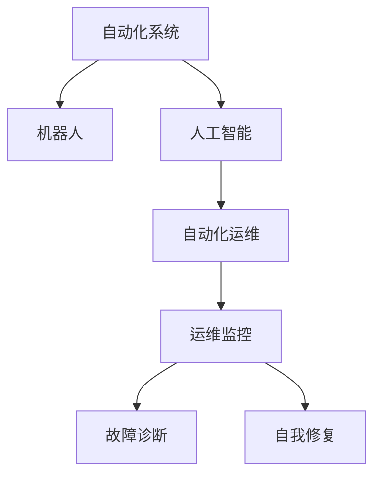

                 

# 自动化领域的最新发展趋势

## 1. 背景介绍

### 1.1 问题由来
随着信息技术的不断进步，自动化技术在各行各业中的应用日益普及，极大地提升了生产效率和企业管理水平。然而，随着自动化系统规模的扩大，管理和维护自动化系统的复杂度也随之增加。在面对快速变化的业务需求和不确定的外部环境时，如何高效、安全地维护和部署自动化系统，成为了一个重要挑战。

## 2. 核心概念与联系

### 2.1 核心概念概述

为了更好地理解自动化领域的最新发展趋势，我们首先需要掌握几个核心概念：

- **自动化系统(Autonomous Systems)**：指能够自主运行、自主决策的系统，如工业自动化生产线、自动驾驶车辆、智能家居系统等。
- **机器人(Robots)**：指可以执行复杂任务的智能机器，通常由传感器、执行器、控制器等组成。
- **人工智能(AI)**：通过计算机算法和模型，模拟人类智能行为的技术，包括机器学习、深度学习等。
- **自动化运维(Automated Operations and Maintenance, AOM)**：指利用自动化工具和AI技术，对自动化系统进行运维和管理的过程。

这些核心概念之间的关系可以用以下Mermaid流程图来表示：



这个流程图展示了自动化系统中的关键组件及其相互关系：

1. 自动化系统通常由机器人等智能设备构成。
2. 人工智能技术为机器人提供了高级的决策能力。
3. 自动化运维系统则负责监控、诊断和修复自动化系统的运行问题。

## 3. 核心算法原理 & 具体操作步骤

### 3.1 算法原理概述

自动化系统的运维主要依赖于自动化运维系统(AOM)。AOM系统利用自动化工具和AI技术，对自动化系统的运行状态进行监控、诊断、预测和维护，以保障系统的稳定运行。其核心算法包括：

- **监控算法**：实时监控自动化系统的性能指标，如运行速度、能耗、设备状态等。
- **故障诊断算法**：通过分析历史数据和实时数据，预测自动化系统的故障点，并确定故障原因。
- **自我修复算法**：根据诊断结果，自动执行修复操作，以恢复系统的正常运行。

### 3.2 算法步骤详解

自动化运维系统的运维过程主要包括以下几个关键步骤：

1. **数据采集**：通过传感器、日志文件等方式收集自动化系统的运行数据。
2. **数据分析**：利用统计分析、机器学习等方法，对数据进行预处理和特征提取。
3. **故障预测**：使用时间序列分析、深度学习等技术，对系统故障进行预测。
4. **故障诊断**：通过特征比对和模式识别，确定故障的具体位置和原因。
5. **自我修复**：根据诊断结果，执行相应的修复操作，如重启、更换设备等。
6. **反馈优化**：将修复结果和故障信息反馈到系统模型中，优化故障预测和诊断模型。

### 3.3 算法优缺点

自动化运维系统具有以下优点：

- **高效率**：自动化运维系统可以全天候无间断地运行，快速响应系统故障，减少人工干预。
- **高精度**：利用AI技术进行故障预测和诊断，准确性高，能够及时发现潜在问题。
- **低成本**：自动化运维系统可以减少人工运维成本，提高企业经济效益。

同时，自动化运维系统也存在一些缺点：

- **依赖数据质量**：故障预测和诊断的准确性高度依赖于数据的完整性和质量。
- **系统复杂性**：自动化运维系统需要处理大量复杂数据，对硬件和软件要求较高。
- **自适应性不足**：在面对未知故障和复杂系统环境时，自动化运维系统的适应性较弱。

### 3.4 算法应用领域

自动化运维系统已经在多个领域得到了广泛应用，例如：

- **工业自动化**：监控生产设备的运行状态，预测设备故障，进行自我修复，提高生产效率。
- **智能电网**：监控电力设备的运行状态，预测故障，进行自我修复，保障电力供应稳定。
- **智能交通**：监控交通系统的运行状态，预测交通故障，进行自我修复，提高交通安全。
- **智慧城市**：监控城市基础设施的运行状态，预测故障，进行自我修复，提高城市管理水平。

## 4. 数学模型和公式 & 详细讲解 & 举例说明

### 4.1 数学模型构建

自动化运维系统的核心模型包括：

- **时间序列模型**：用于预测系统的运行状态和故障。
- **故障树模型**：用于分析故障的因果关系。
- **决策树模型**：用于故障诊断和自我修复。

### 4.2 公式推导过程

以时间序列模型为例，其基本公式为：

$$
y_t = \sum_{i=1}^{p} \alpha_i y_{t-i} + \epsilon_t
$$

其中，$y_t$ 表示第 $t$ 个时间点的运行状态，$\alpha_i$ 表示滞后因子，$y_{t-i}$ 表示 $t-i$ 时间点的运行状态，$\epsilon_t$ 表示随机误差。

### 4.3 案例分析与讲解

考虑一个工业自动化生产线上的传感器数据，使用ARIMA模型进行时间序列分析。假设传感器数据为 $y_1, y_2, \dots, y_n$，则模型的参数估计过程如下：

1. **模型选择**：选择ARIMA模型，确定滞后阶数 $p$ 和差分阶数 $d$。
2. **参数估计**：使用最小二乘法或最大似然估计法，求解 $\alpha_i$ 和随机误差 $\epsilon_t$。
3. **模型验证**：使用交叉验证或独立数据集测试模型预测效果。

## 5. 项目实践：代码实例和详细解释说明

### 5.1 开发环境搭建

在进行自动化运维系统的开发时，我们需要准备好开发环境。以下是使用Python进行TensorFlow开发的环境配置流程：

1. 安装Anaconda：从官网下载并安装Anaconda，用于创建独立的Python环境。
2. 创建并激活虚拟环境：
```bash
conda create -n pytorch-env python=3.8 
conda activate pytorch-env
```
3. 安装TensorFlow：根据CUDA版本，从官网获取对应的安装命令。例如：
```bash
conda install tensorflow -c tf
```
4. 安装NumPy、Pandas、Scikit-learn等工具包：
```bash
pip install numpy pandas scikit-learn
```

完成上述步骤后，即可在`pytorch-env`环境中开始开发实践。

### 5.2 源代码详细实现

下面以工业自动化生产线监控系统为例，给出使用TensorFlow进行时间序列分析和故障预测的PyTorch代码实现。

```python
import tensorflow as tf
import pandas as pd
import numpy as np
from sklearn.model_selection import train_test_split
from sklearn.metrics import mean_squared_error

# 读取传感器数据
data = pd.read_csv('sensor_data.csv')
data = data.dropna()

# 特征选择
features = data.drop(['target'], axis=1)
target = data['target']

# 数据预处理
features = np.array(features)
target = np.array(target)
scaler = MinMaxScaler()
features = scaler.fit_transform(features)

# 时间序列模型训练
X_train, X_test, y_train, y_test = train_test_split(features, target, test_size=0.2, random_state=42)
model = tf.keras.models.Sequential([
    tf.keras.layers.LSTM(50, return_sequences=True),
    tf.keras.layers.LSTM(50),
    tf.keras.layers.Dense(1)
])
model.compile(optimizer='adam', loss='mse')
model.fit(X_train, y_train, epochs=100, batch_size=32)

# 模型评估
y_pred = model.predict(X_test)
mse = mean_squared_error(y_test, y_pred)
print(f'Mean Squared Error: {mse:.2f}')
```

以上就是使用TensorFlow进行时间序列分析和故障预测的完整代码实现。可以看到，TensorFlow的灵活性和易用性使得时间序列模型的开发变得简单高效。

### 5.3 代码解读与分析

让我们再详细解读一下关键代码的实现细节：

**数据读取与预处理**：
- `pd.read_csv`：使用Pandas读取传感器数据，使用`dropna`去除缺失值。
- `MinMaxScaler`：使用`MinMaxScaler`对数据进行归一化处理。

**模型训练**：
- `tf.keras.models.Sequential`：使用Keras构建LSTM模型，包括两个LSTM层和一个全连接层。
- `model.compile`：定义优化器和损失函数。
- `model.fit`：使用训练数据训练模型。

**模型评估**：
- `model.predict`：使用测试数据预测目标值。
- `mean_squared_error`：计算预测值与真实值之间的均方误差。

## 6. 实际应用场景

### 6.1 智能电网

智能电网是未来电网发展的方向，自动化运维系统在其中扮演着重要角色。通过实时监控电网设备的运行状态，预测故障，进行自我修复，智能电网可以保障电力供应的稳定性和可靠性。

在技术实现上，可以收集电网设备的历史运行数据，建立时间序列模型，预测设备故障。同时利用故障树模型分析故障原因，进行自我修复。具体应用场景包括：

- **状态监控**：监控电力设备的温度、电压、电流等参数，预测设备异常。
- **故障诊断**：分析设备运行状态，确定故障点，进行故障诊断。
- **自我修复**：根据诊断结果，自动执行修复操作，如重启设备、更换部件等。

### 6.2 智能交通

智能交通系统通过自动化运维系统，可以实时监控交通设施的运行状态，预测交通故障，进行自我修复，提高交通管理水平。

具体应用场景包括：

- **交通信号灯监控**：监控交通信号灯的运行状态，预测设备故障。
- **交通流量预测**：分析交通流量数据，预测交通拥堵情况。
- **道路维护**：根据预测结果，进行道路维护和自我修复，避免交通事故。

### 6.3 智慧城市

智慧城市是未来城市管理的重要方向，自动化运维系统在其中具有广泛应用前景。通过实时监控城市基础设施的运行状态，预测故障，进行自我修复，智慧城市可以提高管理效率，提升居民生活质量。

具体应用场景包括：

- **智能照明系统**：监控路灯的运行状态，预测设备故障，进行自我修复。
- **智能交通系统**：监控交通设施的运行状态，预测交通故障，进行自我修复。
- **智能垃圾回收系统**：监控垃圾回收设施的运行状态，预测设备故障，进行自我修复。

## 7. 工具和资源推荐

### 7.1 学习资源推荐

为了帮助开发者掌握自动化运维系统的理论基础和实践技巧，这里推荐一些优质的学习资源：

1. **《深入理解机器学习》系列博文**：由机器学习专家撰写，深入浅出地介绍了机器学习、深度学习等核心概念和算法。
2. **Coursera《机器学习》课程**：由斯坦福大学教授Andrew Ng开设的机器学习课程，系统讲解了机器学习的基本原理和算法。
3. **Udacity《自动驾驶》课程**：介绍了自动驾驶系统的核心技术，包括传感器融合、路径规划、故障诊断等。
4. **IEEE TNSC《智能电网》专题**：介绍了智能电网的核心技术和应用，包括智能监控、故障诊断、自我修复等。
5. **《自动控制原理》书籍**：经典控制理论书籍，介绍了自动控制系统的基础理论和设计方法。

通过这些资源的学习实践，相信你一定能够快速掌握自动化运维系统的精髓，并用于解决实际的自动化问题。

### 7.2 开发工具推荐

高效的开发离不开优秀的工具支持。以下是几款用于自动化运维系统开发的常用工具：

1. **TensorFlow**：由Google主导开发的开源深度学习框架，生产部署方便，适合大规模工程应用。
2. **Keras**：基于TensorFlow的高级API，简单易用，适合快速迭代研究。
3. **Jupyter Notebook**：用于编写和分享Jupyter Notebook格式的学习笔记和代码实现。
4. **Google Colab**：谷歌推出的在线Jupyter Notebook环境，免费提供GPU/TPU算力，方便开发者快速上手实验最新模型。

合理利用这些工具，可以显著提升自动化运维系统的开发效率，加快创新迭代的步伐。

### 7.3 相关论文推荐

自动化运维系统的发展离不开学界的持续研究。以下是几篇奠基性的相关论文，推荐阅读：

1. **《自动控制系统理论》**：介绍了自动控制系统的基本理论和设计方法，是自动化系统开发的经典教材。
2. **《机器学习基础》**：介绍了机器学习的基本概念和算法，适合初学者学习。
3. **《深度学习》**：由深度学习专家Goodfellow等人编写，系统讲解了深度学习的原理和应用。
4. **《智能电网技术》**：介绍了智能电网的核心技术和应用，包括智能监控、故障诊断、自我修复等。
5. **《自动驾驶技术》**：介绍了自动驾驶系统的核心技术和应用，包括传感器融合、路径规划、故障诊断等。

这些论文代表了大语言模型微调技术的发展脉络。通过学习这些前沿成果，可以帮助研究者把握学科前进方向，激发更多的创新灵感。

## 8. 总结：未来发展趋势与挑战

### 8.1 总结

本文对自动化运维系统的最新发展趋势进行了全面系统的介绍。首先阐述了自动化系统、机器人、人工智能和自动化运维系统的核心概念及其相互关系，明确了自动化运维系统在自动化系统中的重要作用。其次，从原理到实践，详细讲解了自动化运维系统的核心算法原理和具体操作步骤，给出了自动化运维系统开发的完整代码实例。同时，本文还广泛探讨了自动化运维系统在智能电网、智能交通、智慧城市等各个领域的实际应用场景，展示了自动化运维系统的广阔前景。最后，本文精选了自动化运维系统的各类学习资源，力求为读者提供全方位的技术指引。

通过本文的系统梳理，可以看到，自动化运维系统在自动化领域中的应用日益广泛，极大地提升了自动化系统的运行效率和管理水平。未来，伴随自动化运维系统的持续演进，必将为自动化系统带来更高效、更智能的运维和管理方式。

### 8.2 未来发展趋势

展望未来，自动化运维系统将呈现以下几个发展趋势：

1. **智能化水平提升**：未来的自动化运维系统将更加智能化，能够自主进行故障预测、自我修复等操作，减少人工干预。
2. **跨领域融合**：未来的自动化运维系统将更加广泛地应用于各个领域，如智能交通、智慧城市、智能制造等。
3. **边缘计算普及**：未来的自动化运维系统将更加依赖于边缘计算技术，实现实时数据处理和决策。
4. **自适应学习能力**：未来的自动化运维系统将具备更强的自适应学习能力，能够不断学习和优化自身的运维策略。
5. **模型集成**：未来的自动化运维系统将更加注重模型集成，利用多种模型和方法进行综合决策，提高系统可靠性。

以上趋势凸显了自动化运维系统在自动化领域的重要性和广阔前景。这些方向的探索发展，必将进一步提升自动化系统的运行效率和管理水平，为各行各业带来更加智能化、高效化的管理方式。

### 8.3 面临的挑战

尽管自动化运维系统已经取得了显著进展，但在迈向更加智能化、普适化应用的过程中，它仍面临诸多挑战：

1. **数据质量和获取成本**：自动化运维系统高度依赖于数据质量，但获取高质量数据成本较高。如何在保证数据质量的同时，降低数据获取成本，将是重要课题。
2. **系统复杂性和维护成本**：自动化运维系统需要处理大量复杂数据，对硬件和软件要求较高。如何提高系统的易用性和可维护性，降低维护成本，还需进一步优化。
3. **自适应性和鲁棒性不足**：在面对未知故障和复杂系统环境时，自动化运维系统的适应性较弱。如何提高系统的自适应性和鲁棒性，避免系统崩溃，将是关键研究方向。
4. **安全性和隐私保护**：自动化运维系统涉及大量的数据和模型，需要保证数据安全和隐私保护。如何在系统设计和应用过程中，防范数据泄露和恶意攻击，还需进一步加强。

### 8.4 研究展望

面对自动化运维系统面临的这些挑战，未来的研究需要在以下几个方面寻求新的突破：

1. **数据增强和自动化数据采集**：探索新的数据增强和自动化数据采集方法，提高数据获取效率和数据质量。
2. **模型集成和融合**：研究模型集成和融合方法，提高系统的综合决策能力和鲁棒性。
3. **自适应学习和自监督学习**：研究自适应学习和自监督学习方法，提高系统的自适应能力和鲁棒性。
4. **安全性和隐私保护**：研究数据安全和隐私保护技术，确保系统数据和模型安全。
5. **跨领域应用和模型泛化**：研究跨领域应用的自动化运维系统模型，提高模型的泛化能力和适应性。

这些研究方向的研究突破，必将引领自动化运维系统迈向更高的台阶，为自动化系统带来更高效、更智能的运维和管理方式。未来，自动化运维系统需要与其他人工智能技术进行更深入的融合，如知识表示、因果推理、强化学习等，多路径协同发力，共同推动自动化系统向更高智能化水平迈进。

## 9. 附录：常见问题与解答

**Q1: 如何提高自动化运维系统的数据质量？**

A: 提高自动化运维系统的数据质量可以从以下几个方面入手：

1. **数据清洗**：对原始数据进行清洗，去除噪声和异常值。
2. **数据增强**：使用数据增强技术，如插值、旋转、平移等，丰富数据集。
3. **数据标注**：对数据进行标注，提高标注数据的质量和多样性。
4. **自动化数据采集**：采用传感器、日志文件等方式，自动获取数据，减少人工干预。

通过这些方法，可以提高自动化运维系统的数据质量，进而提高系统的预测准确性和故障诊断效果。

**Q2: 自动化运维系统的故障预测和自我修复策略有哪些？**

A: 自动化运维系统的故障预测和自我修复策略主要包括以下几种：

1. **时间序列预测**：通过时间序列模型，预测设备故障和运行状态。
2. **异常检测**：使用统计方法和机器学习算法，检测设备异常和故障。
3. **故障树分析**：通过故障树模型，分析设备故障的因果关系。
4. **模型集成**：集成多种模型和方法，提高故障预测和自我修复的准确性和鲁棒性。

这些策略通常需要结合实际应用场景，根据数据特点和系统需求进行优化和组合。

**Q3: 如何设计自动化运维系统的自适应学习能力？**

A: 自动化运维系统的自适应学习能力设计可以从以下几个方面入手：

1. **在线学习**：使用在线学习算法，实时更新模型参数，适应新数据和新环境。
2. **迁移学习**：从历史数据和新数据中学习通用知识，提高模型的泛化能力。
3. **元学习**：使用元学习算法，学习模型训练过程中的最佳参数和学习策略。
4. **自监督学习**：使用自监督学习算法，从无标注数据中学习模型知识。

这些方法结合实际应用场景，可以有效提高自动化运维系统的自适应学习能力。

**Q4: 如何保障自动化运维系统的安全性和隐私保护？**

A: 保障自动化运维系统的安全性和隐私保护可以从以下几个方面入手：

1. **数据加密**：使用数据加密技术，保护数据传输和存储的安全性。
2. **访问控制**：使用访问控制技术，限制对系统和数据的访问权限。
3. **匿名化处理**：对数据进行匿名化处理，保护用户隐私。
4. **安全监控**：使用安全监控技术，实时监测系统安全状况。

这些方法可以有效保障自动化运维系统的安全性和隐私保护，避免数据泄露和恶意攻击。

**Q5: 如何设计自动化运维系统的跨领域应用？**

A: 设计自动化运维系统的跨领域应用可以从以下几个方面入手：

1. **领域知识整合**：将领域知识与自动化运维系统模型进行整合，提高模型的领域适应性。
2. **多模态数据融合**：融合视觉、语音、文本等多种模态数据，提高模型的综合决策能力。
3. **通用模型设计**：设计通用模型，适应不同领域的数据和任务。
4. **跨领域迁移学习**：使用跨领域迁移学习方法，将知识从特定领域迁移到新领域。

这些方法可以有效设计出适用于不同领域的自动化运维系统，提高系统的泛化能力和适应性。

---

作者：禅与计算机程序设计艺术 / Zen and the Art of Computer Programming

