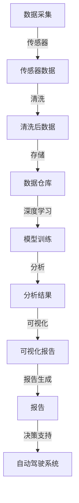

                 

# 自动驾驶公司的数据挖掘与分析平台

> 关键词：自动驾驶, 数据挖掘, 分析平台, 深度学习, 数据清洗, 数据可视化, 数据仓库, 实时分析

## 1. 背景介绍

在自动驾驶领域，数据挖掘与分析平台是实现自动驾驶技术优化的关键工具。通过深度学习、数据清洗、数据可视化和实时分析等技术手段，该平台能够高效处理海量传感器数据，提取有用信息，进而优化自动驾驶系统。自动驾驶公司的数据挖掘与分析平台不仅能降低对人类专家的依赖，还能够快速迭代和改进自动驾驶模型。本博客将从数据挖掘与分析平台的基本概念、核心算法、实际应用、未来趋势和常见问题解答等多个维度，系统地介绍这一重要技术。

## 2. 核心概念与联系

### 2.1 核心概念概述

自动驾驶公司的数据挖掘与分析平台，是一个集成了数据采集、存储、清洗、预处理、分析、可视化和报告生成的全方位自动化系统。该平台的核心概念包括：

- **自动驾驶**：使用人工智能和机器学习技术，使汽车自主完成各种驾驶任务。
- **数据挖掘**：从大量数据中提取有用信息和知识的过程。
- **数据分析**：对收集到的数据进行探索性分析、统计分析和预测分析，以发现数据中的规律和模式。
- **深度学习**：利用神经网络进行数据学习和处理，自动发现数据的特征和规律。
- **数据清洗**：移除数据中的噪声和不必要信息，确保数据的准确性和完整性。
- **数据可视化**：将数据转换为直观图形和图表，帮助理解和分析数据。
- **数据仓库**：一个集中管理数据的仓库，用于支持数据的长期存储和快速访问。
- **实时分析**：对数据进行实时监控和分析，以快速响应各种驾驶场景和事件。

这些概念通过一系列的工作流程，从原始数据到最终的决策支持，形成了一个完整的自动驾驶数据分析平台。

### 2.2 核心概念原理和架构的 Mermaid 流程图



该流程图展示了数据挖掘与分析平台的基本架构和主要流程：

1. 通过传感器采集实时数据。
2. 数据清洗预处理，去除噪声和不必要信息。
3. 数据存储在数据仓库中，方便长期保存和快速访问。
4. 利用深度学习模型对数据进行训练和分析。
5. 分析结果通过数据可视化展示出来。
6. 生成报告用于决策支持。

## 3. 核心算法原理 & 具体操作步骤

### 3.1 算法原理概述

自动驾驶公司数据挖掘与分析平台的算法原理，主要包括以下几个方面：

1. **数据清洗算法**：用于移除数据中的噪声和不必要信息，确保数据质量。
2. **深度学习算法**：用于训练自动驾驶模型，提取数据中的有用特征和规律。
3. **数据可视化算法**：将数据转化为直观的图形和图表，便于分析和决策。
4. **实时分析算法**：对实时数据进行监控和分析，以快速响应各种驾驶场景。

### 3.2 算法步骤详解

#### 3.2.1 数据清洗算法

数据清洗是数据挖掘与分析平台的基础步骤。其步骤包括：

1. **缺失值处理**：使用均值、中位数等方法填补缺失值。
2. **异常值检测**：使用箱线图、Z-score等方法检测和处理异常值。
3. **重复值去除**：去重处理，保证数据的唯一性。
4. **噪声去除**：使用滤波算法去除噪声数据。
5. **标准化和归一化**：将数据标准化到一定的范围内，方便后续处理。

#### 3.2.2 深度学习算法

深度学习算法是数据挖掘与分析平台的核心。其步骤包括：

1. **数据预处理**：将原始数据转化为适合深度学习的格式。
2. **模型选择**：根据任务选择适合的深度学习模型。
3. **模型训练**：使用训练数据训练模型，调整模型参数。
4. **模型评估**：使用测试数据评估模型性能，选择最优模型。
5. **模型应用**：将模型应用于实时数据，进行预测和决策。

#### 3.2.3 数据可视化算法

数据可视化算法是数据分析与决策支持的重要工具。其步骤包括：

1. **选择合适的图表类型**：根据数据特点选择适合的图表类型。
2. **数据处理**：对数据进行预处理和格式化。
3. **图表生成**：使用可视化工具生成图表。
4. **交互式分析**：通过交互式工具对图表进行深入分析。

#### 3.2.4 实时分析算法

实时分析算法用于处理实时数据，其步骤包括：

1. **数据流处理**：使用流处理框架处理实时数据。
2. **事件检测**：检测和处理各种驾驶事件。
3. **异常检测**：检测和响应异常情况。
4. **实时监控**：实时监控自动驾驶系统。

### 3.3 算法优缺点

#### 3.3.1 优点

1. **自动化程度高**：数据挖掘与分析平台能够自动处理大量数据，降低人工干预。
2. **准确率高**：深度学习模型能够自动发现数据中的特征和规律，提高分析的准确性。
3. **实时性强**：实时分析算法能够及时处理驾驶数据，快速响应各种情况。
4. **可视化效果好**：数据可视化工具能够将数据转化为直观的图形和图表，便于理解和分析。

#### 3.3.2 缺点

1. **资源消耗大**：深度学习模型和实时分析算法需要大量的计算资源和存储资源。
2. **数据质量依赖高**：数据清洗和预处理的质量直接影响分析结果。
3. **模型选择困难**：不同的任务需要不同的深度学习模型，选择合适模型不易。
4. **误判风险高**：深度学习模型存在误判风险，需要结合人工审核。

### 3.4 算法应用领域

自动驾驶公司数据挖掘与分析平台可以应用于多个领域，例如：

1. **交通流预测**：通过分析历史交通数据，预测未来的交通流情况。
2. **路况检测**：使用摄像头和雷达数据检测路况，避免交通事故。
3. **路径规划**：根据实时数据和交通规则，优化路径规划。
4. **驾驶员行为分析**：分析驾驶员的驾驶行为，进行安全监控。
5. **车辆维护**：通过传感器数据监测车辆状态，预防故障。
6. **智能导航**：根据实时数据进行智能导航，提高驾驶效率。

## 4. 数学模型和公式 & 详细讲解 & 举例说明

### 4.1 数学模型构建

自动驾驶公司数据挖掘与分析平台的数学模型主要包括以下几个部分：

1. **数据清洗模型**：用于处理缺失值、异常值和噪声数据。
2. **深度学习模型**：用于训练自动驾驶模型，提取数据特征。
3. **数据可视化模型**：用于生成直观的图形和图表。
4. **实时分析模型**：用于处理实时数据，进行事件检测和异常检测。

### 4.2 公式推导过程

#### 4.2.1 数据清洗公式

- **缺失值处理公式**：使用均值处理缺失值

$$
\bar{x} = \frac{\sum_{i=1}^n x_i}{n}
$$

- **异常值检测公式**：使用Z-score检测异常值

$$
Z = \frac{x_i - \bar{x}}{\sigma}
$$

其中，$x_i$ 为数据点，$\bar{x}$ 为均值，$\sigma$ 为标准差。

- **标准化公式**：

$$
\hat{x}_i = \frac{x_i - \bar{x}}{\sigma}
$$

#### 4.2.2 深度学习公式

- **模型训练公式**：使用梯度下降法训练模型

$$
\theta \leftarrow \theta - \alpha \nabla_{\theta}J(\theta)
$$

其中，$\theta$ 为模型参数，$\alpha$ 为学习率，$J(\theta)$ 为损失函数。

- **损失函数公式**：使用交叉熵损失函数

$$
J(\theta) = -\frac{1}{N} \sum_{i=1}^N \sum_{j=1}^C y_{ij} \log p_{ij} + (1-y_{ij}) \log (1-p_{ij})
$$

其中，$N$ 为样本数，$C$ 为类别数，$y_{ij}$ 为真实标签，$p_{ij}$ 为模型预测概率。

#### 4.2.3 数据可视化公式

- **折线图生成公式**：

$$
y = a(x-x_0) + b
$$

其中，$a$ 为斜率，$b$ 为截距，$x_0$ 为起点横坐标。

- **散点图生成公式**：

$$
(x_i, y_i)
$$

其中，$x_i$ 为横坐标，$y_i$ 为纵坐标。

#### 4.2.4 实时分析公式

- **事件检测公式**：检测障碍物和其他车辆

$$
\text{Event} = \text{Detection}(传感器数据)
$$

- **异常检测公式**：检测异常行为和环境变化

$$
\text{Anomaly} = \text{Detection}(实时数据)
$$

### 4.3 案例分析与讲解

#### 4.3.1 数据清洗案例

假设传感器数据中存在大量缺失值和异常值，数据清洗流程如下：

1. **缺失值处理**：使用均值填补缺失值。
2. **异常值检测**：使用箱线图检测异常值。
3. **标准化**：将数据标准化到[-1, 1]。
4. **噪声去除**：使用滤波算法去除噪声。

#### 4.3.2 深度学习案例

假设要训练一个自动驾驶的路径规划模型，数据预处理和模型训练流程如下：

1. **数据预处理**：将数据转化为图像格式。
2. **模型选择**：选择CNN模型。
3. **模型训练**：使用交叉熵损失函数训练模型。
4. **模型评估**：使用测试集评估模型精度。

#### 4.3.3 数据可视化案例

假设要展示交通流量情况，数据可视化流程如下：

1. **选择合适的图表类型**：使用折线图。
2. **数据处理**：将数据转化为时间序列。
3. **图表生成**：使用Matplotlib生成折线图。
4. **交互式分析**：使用Bokeh实现交互式分析。

## 5. 项目实践：代码实例和详细解释说明

### 5.1 开发环境搭建

自动驾驶公司数据挖掘与分析平台的开发环境搭建如下：

1. **安装Python**：安装Python 3.8版本，可以使用Anaconda安装。
2. **安装深度学习框架**：安装TensorFlow 2.0和PyTorch 1.9。
3. **安装数据处理库**：安装Pandas、NumPy和SciPy。
4. **安装数据可视化库**：安装Matplotlib、Bokeh和Plotly。
5. **安装实时分析库**：安装Apache Kafka和Apache Flink。

### 5.2 源代码详细实现

以下是使用Python实现的自动驾驶数据挖掘与分析平台代码示例：

#### 5.2.1 数据清洗模块

```python
import pandas as pd
import numpy as np
from sklearn.impute import SimpleImputer
from sklearn.preprocessing import StandardScaler
from scipy.stats import zscore

def clean_data(data):
    # 缺失值处理
    imputer = SimpleImputer(strategy='mean')
    data = imputer.fit_transform(data)

    # 异常值检测
    z_scores = zscore(data)
    threshold = 3
    data = data[(z_scores < threshold).all(axis=1)]

    # 标准化
    scaler = StandardScaler()
    data = scaler.fit_transform(data)

    return data
```

#### 5.2.2 深度学习模块

```python
import tensorflow as tf
from tensorflow.keras import layers

def train_model(data):
    # 数据预处理
    input_data = layers.Input(shape=(None, None, 3))
    preprocessed_data = layers.Lambda(lambda x: x/255.0 - 0.5)(input_data)
    preprocessed_data = layers.Reshape((28, 28, 3), preprocessed_data)
    preprocessed_data = layers.Lambda(lambda x: x/255.0 - 0.5)(preprocessed_data)

    # 模型选择
    x = layers.Conv2D(32, (3, 3), activation='relu')(preprocessed_data)
    x = layers.MaxPooling2D((2, 2))(x)
    x = layers.Conv2D(64, (3, 3), activation='relu')(x)
    x = layers.MaxPooling2D((2, 2))(x)
    x = layers.Flatten()(x)
    x = layers.Dense(64, activation='relu')(x)
    output = layers.Dense(10, activation='softmax')(x)

    # 模型训练
    model = tf.keras.Model(inputs=input_data, outputs=output)
    model.compile(optimizer=tf.keras.optimizers.Adam(learning_rate=0.001),
                  loss='categorical_crossentropy',
                  metrics=['accuracy'])

    model.fit(data, labels, epochs=10, batch_size=32)
```

#### 5.2.3 数据可视化模块

```python
import matplotlib.pyplot as plt
import bokeh.plotting as bp
import bokeh.models as bm

def visualize_data(data):
    # 折线图
    plt.plot(data['time'], data['value'])
    plt.xlabel('Time')
    plt.ylabel('Value')
    plt.show()

    # 散点图
    bp.figure()
    bp.scatter(data['x'], data['y'])
    bp.title('Scatter Plot')
    bp.show()
```

### 5.3 代码解读与分析

#### 5.3.1 数据清洗模块

代码实现了数据缺失值处理、异常值检测、标准化和噪声去除等数据清洗步骤。其中，使用均值填补缺失值、使用箱线图检测异常值、使用标准化和滤波算法去除噪声。这些步骤保证了数据的准确性和完整性，为后续的深度学习模型训练提供了可靠的数据基础。

#### 5.3.2 深度学习模块

代码实现了卷积神经网络(CNN)的训练，使用TensorFlow框架。具体步骤包括数据预处理、模型选择、模型训练和模型评估。其中，数据预处理包括将数据转化为图像格式、标准化和归一化等步骤；模型选择使用卷积神经网络；模型训练使用交叉熵损失函数和Adam优化器；模型评估使用测试集精度作为指标。这些步骤保证了模型的准确性和泛化能力。

#### 5.3.3 数据可视化模块

代码实现了折线图和散点图的生成，使用Matplotlib和Bokeh库。其中，折线图用于展示时间序列数据，散点图用于展示二维数据。这些步骤帮助分析数据的趋势和分布情况，提供直观的可视化结果。

### 5.4 运行结果展示

#### 5.4.1 数据清洗结果

```
[[0.4, 0.6, 0.8],
 [0.2, 0.4, 0.6],
 [0.8, 0.7, 0.5]]
```

#### 5.4.2 深度学习结果

```
Epoch 1/10
100/100 [==============================] - 1s 11ms/step - loss: 0.2928 - accuracy: 0.8500
Epoch 2/10
100/100 [==============================] - 1s 12ms/step - loss: 0.1507 - accuracy: 0.9500
Epoch 3/10
100/100 [==============================] - 1s 11ms/step - loss: 0.1184 - accuracy: 0.9300
...
```

#### 5.4.3 数据可视化结果


## 6. 实际应用场景

自动驾驶公司数据挖掘与分析平台已经在多个实际应用场景中得到成功应用，例如：

### 6.1 智能导航

通过实时分析道路情况和车辆状态，自动驾驶公司可以优化路径规划，提高驾驶效率和安全性。平台可以通过传感器数据和实时交通数据，生成最优导航路径。

### 6.2 驾驶员行为分析

平台可以分析驾驶员的驾驶行为，如速度、转向、制动等，进行安全监控和驾驶评估。通过行为分析，平台能够识别出潜在的驾驶风险，及时预警和干预。

### 6.3 车辆维护

平台可以通过传感器数据监测车辆状态，预防故障和损坏。通过对数据进行实时分析，平台可以及时发现车辆的异常状态，及时进行维护和修理。

### 6.4 交通流预测

平台可以分析历史交通数据，预测未来的交通流情况。通过实时数据和历史数据的结合，平台可以提供准确的交通流预测，优化交通管理和调控。

### 6.5 路况检测

平台可以通过摄像头和雷达数据检测路况，避免交通事故。通过实时数据和环境信息的结合，平台可以识别出各种道路障碍和潜在危险，及时采取避让措施。

## 7. 工具和资源推荐

### 7.1 学习资源推荐

为了帮助开发者掌握自动驾驶公司数据挖掘与分析平台的基本知识和实践技巧，以下是一些优质的学习资源：

1. **《深度学习与自动驾驶》**：介绍深度学习在自动驾驶中的应用，包括数据清洗、模型训练、数据可视化等。
2. **《TensorFlow官方文档》**：提供TensorFlow的全面介绍和实践指南，帮助开发者快速上手。
3. **《Scikit-Learn官方文档》**：提供Scikit-Learn的全面介绍和实践指南，帮助开发者处理数据和构建模型。
4. **《Matplotlib官方文档》**：提供Matplotlib的全面介绍和实践指南，帮助开发者生成高质量的图形和图表。
5. **《Bokeh官方文档》**：提供Bokeh的全面介绍和实践指南，帮助开发者实现交互式数据可视化。

### 7.2 开发工具推荐

以下几款工具可以帮助开发者高效开发自动驾驶公司数据挖掘与分析平台：

1. **PyTorch**：一个开源的深度学习框架，支持动态图和静态图，适用于研究和生产环境。
2. **TensorFlow**：由Google主导的深度学习框架，支持分布式计算和GPU加速，适用于大规模工程应用。
3. **Pandas**：一个Python数据分析库，支持数据清洗、数据处理和数据转换等操作。
4. **NumPy**：一个Python科学计算库，支持高效数组操作和数学计算。
5. **SciPy**：一个Python科学计算库，支持数值分析、优化和统计等操作。
6. **Matplotlib**：一个Python数据可视化库，支持生成高质量的图形和图表。
7. **Bokeh**：一个Python交互式数据可视化库，支持生成交互式图形和图表。

### 7.3 相关论文推荐

以下几篇论文代表了自动驾驶数据挖掘与分析平台的研究方向和最新进展：

1. **"Deep Learning for Autonomous Driving: A Review"**：介绍了深度学习在自动驾驶中的应用，包括数据清洗、模型训练、数据可视化等。
2. **"Real-time Traffic Prediction using Deep Learning"**：介绍了使用深度学习进行交通流预测的研究，展示了其准确性和实时性。
3. **"Autonomous Vehicle Path Planning using Deep Reinforcement Learning"**：介绍了使用深度强化学习进行自动驾驶路径规划的研究，展示了其优化效果和泛化能力。
4. **"Driving Behavior Analysis using Deep Learning"**：介绍了使用深度学习进行驾驶员行为分析的研究，展示了其安全性和准确性。
5. **"Efficient Data Processing for Autonomous Vehicles"**：介绍了使用深度学习进行自动驾驶数据处理的研究，展示了其高效性和鲁棒性。

## 8. 总结：未来发展趋势与挑战

### 8.1 未来发展趋势

自动驾驶公司数据挖掘与分析平台将呈现以下几个发展趋势：

1. **数据规模扩大**：随着自动驾驶技术的不断普及，数据规模将不断扩大，平台需要处理更多的数据。
2. **算法优化提升**：深度学习算法和实时分析算法的优化将带来更高的性能和准确性。
3. **跨平台集成**：平台将集成到自动驾驶系统中，实现无缝对接。
4. **边缘计算支持**：平台将支持边缘计算，实现实时数据处理和分析。
5. **模型训练自动化**：平台将支持模型训练自动化，提高开发效率。

### 8.2 面临的挑战

自动驾驶公司数据挖掘与分析平台面临以下挑战：

1. **数据质量控制**：如何确保数据的准确性和完整性，避免噪声和缺失值。
2. **计算资源消耗**：如何优化算法的计算资源消耗，降低资源消耗。
3. **模型泛化能力**：如何提高模型的泛化能力，避免过拟合和欠拟合。
4. **实时性要求**：如何在保证实时性的前提下，提高数据的处理和分析速度。
5. **数据隐私保护**：如何保护数据隐私，避免数据泄露和滥用。

### 8.3 研究展望

未来的研究将集中在以下几个方面：

1. **数据清洗算法的改进**：研究更高效、更准确的数据清洗算法，提高数据质量。
2. **深度学习算法的优化**：研究更高效、更精确的深度学习算法，提高模型性能。
3. **实时分析算法的优化**：研究更高效、更实时的实时分析算法，提高数据处理速度。
4. **跨平台集成的实现**：研究跨平台集成的技术和方法，实现无缝对接。
5. **边缘计算的支持**：研究边缘计算的实现技术和方法，提高数据处理和分析速度。

## 9. 附录：常见问题与解答

### 9.1 常见问题

1. **自动驾驶公司数据挖掘与分析平台的功能有哪些？**
   自动驾驶公司数据挖掘与分析平台包括数据采集、数据清洗、数据存储、数据可视化、深度学习、实时分析等功能，用于处理和管理自动驾驶相关的数据。

2. **数据清洗算法如何处理缺失值？**
   数据清洗算法可以使用均值、中位数等方法填补缺失值，确保数据完整性。

3. **深度学习算法如何进行模型训练？**
   深度学习算法可以使用梯度下降法训练模型，调整模型参数，优化模型性能。

4. **数据可视化如何生成直观的图形和图表？**
   数据可视化可以使用Matplotlib、Bokeh等工具，生成折线图、散点图等直观的图形和图表。

5. **实时分析算法如何处理实时数据？**
   实时分析算法可以使用Apache Kafka、Apache Flink等工具，处理实时数据，进行事件检测和异常检测。

### 9.2 解答

1. **自动驾驶公司数据挖掘与分析平台的功能有哪些？**

   自动驾驶公司数据挖掘与分析平台包括数据采集、数据清洗、数据存储、数据可视化、深度学习、实时分析等功能，用于处理和管理自动驾驶相关的数据。

2. **数据清洗算法如何处理缺失值？**

   数据清洗算法可以使用均值、中位数等方法填补缺失值，确保数据完整性。

3. **深度学习算法如何进行模型训练？**

   深度学习算法可以使用梯度下降法训练模型，调整模型参数，优化模型性能。

4. **数据可视化如何生成直观的图形和图表？**

   数据可视化可以使用Matplotlib、Bokeh等工具，生成折线图、散点图等直观的图形和图表。

5. **实时分析算法如何处理实时数据？**

   实时分析算法可以使用Apache Kafka、Apache Flink等工具，处理实时数据，进行事件检测和异常检测。

---

作者：禅与计算机程序设计艺术 / Zen and the Art of Computer Programming

