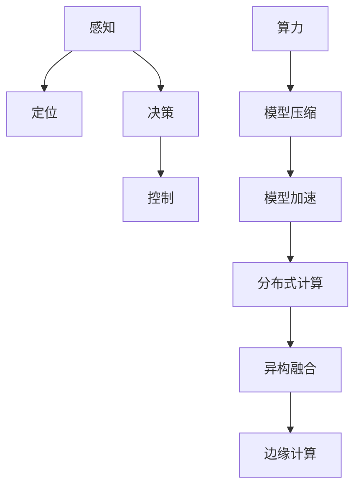

                 

# 自动驾驶领域的算力竞赛

## 1. 背景介绍

随着人工智能技术的飞速发展，自动驾驶成为众多科技巨头和传统汽车制造商争相角逐的热点。自动驾驶技术依赖于先进的传感器、高性能计算平台和复杂的算法模型，其中算力是一个核心制约因素。本文将深入探讨自动驾驶领域的算力竞赛，包括其原理、步骤、优缺点、应用领域等，并分析当前挑战与未来趋势。

## 2. 核心概念与联系

### 2.1 核心概念概述

为了深入理解自动驾驶算力竞赛，我们需要明确以下几个核心概念：

- **自动驾驶**：通过人工智能技术实现车辆自主导航和决策，无需人类直接干预。其核心技术包括感知、定位、决策和控制。
- **算力**：指计算系统每秒能够执行的指令数量，是支撑复杂算法和数据处理的基础。
- **模型压缩**：指在保持模型性能的同时，减小模型规模以减少计算资源消耗。
- **模型加速**：通过优化计算过程，提高模型的推理速度。
- **分布式计算**：通过多个计算节点协同工作，提升整体计算能力。
- **异构融合**：将不同类型硬件（如CPU、GPU、FPGA）结合，充分利用硬件优势，提升计算效率。
- **边缘计算**：将计算资源部署在车辆端，减少对云端服务器的依赖。

### 2.2 核心概念联系

自动驾驶领域的算力竞赛涉及多个核心概念的联系与相互作用。例如：

- 感知与定位：自动驾驶算法需要实时处理大量传感器数据，这依赖于高性能的算力和高效的模型压缩与加速技术。
- 决策与控制：在复杂交通场景下，决策过程需要高精度、低延迟的计算能力。
- 分布式计算与异构融合：为了满足实时性和高精度的需求，自动驾驶系统通常采用分布式计算和异构硬件融合。
- 边缘计算：将计算任务分布在车辆端，可以大幅降低通信开销，提高系统实时性。

这些概念之间的联系可以通过以下Mermaid流程图来展示：



## 3. 核心算法原理 & 具体操作步骤

### 3.1 算法原理概述

自动驾驶算力竞赛的核心算法原理可以概括为：在保证系统性能的前提下，通过模型压缩、模型加速、分布式计算、异构融合和边缘计算等技术手段，最大化地利用有限的算力资源，满足自动驾驶系统对实时性、精度和可靠性等关键性能指标的要求。

### 3.2 算法步骤详解

自动驾驶算力竞赛的典型步骤包括：

**Step 1: 数据采集与预处理**

- 采集自动驾驶车辆传感器数据（如摄像头、激光雷达、毫米波雷达等）。
- 对数据进行去噪、滤波、校正等预处理操作，以提高数据质量。

**Step 2: 感知与定位**

- 使用计算机视觉和深度学习模型（如卷积神经网络CNN、YOLO等）对摄像头图像进行目标检测和分类。
- 结合激光雷达和毫米波雷达数据，进行物体定位和姿态估计。

**Step 3: 决策与控制**

- 将感知和定位数据输入决策模型（如RNN、LSTM等），进行路径规划和行为决策。
- 使用控制模型（如PID控制器）对车辆进行实时控制。

**Step 4: 模型压缩与加速**

- 对模型进行量化、剪枝、蒸馏等技术，减小模型参数规模。
- 采用深度学习优化技术（如网络结构优化、并行化等），提升模型推理速度。

**Step 5: 分布式计算**

- 将模型拆分为多个子模块，部署在多台计算节点上。
- 使用消息传递接口（如MPI、Spark）协调各节点间的数据交换和计算。

**Step 6: 异构融合**

- 将不同类型硬件（如CPU、GPU、FPGA）结合，根据任务需求分配计算资源。
- 使用异构编程模型（如OpenCL、CUDA）优化硬件性能。

**Step 7: 边缘计算**

- 将模型和数据部署在车辆端嵌入式设备上。
- 利用本地计算资源，减少云端通信延迟，提高系统实时性。

### 3.3 算法优缺点

自动驾驶算力竞赛的算法具有以下优点：

1. **提升系统性能**：通过模型压缩与加速，分布式计算与异构融合，边缘计算等技术，可以显著提升自动驾驶系统的实时性和精度。
2. **降低计算成本**：采用模型压缩与加速技术，可以减小计算资源消耗，降低成本。
3. **提高系统可靠性**：分布式计算和边缘计算可以减少对单一计算节点的依赖，提高系统可靠性。
4. **增强用户体验**：边缘计算可以实时处理传感器数据，减少延迟，提升用户体验。

但这些算法也存在以下缺点：

1. **实现复杂度较高**：算法涉及多个技术领域的融合，实施难度较大。
2. **数据传输开销大**：分布式计算和边缘计算依赖于数据在节点间传输，传输开销较大。
3. **设备成本高**：高性能计算平台和异构硬件的成本较高。

### 3.4 算法应用领域

自动驾驶算力竞赛的技术可以广泛应用于多个领域，例如：

- **无人驾驶出租车**：使用高性能计算平台和模型加速技术，提升车辆运行效率和服务质量。
- **物流配送**：使用分布式计算和边缘计算，提高物流配送的实时性和稳定性。
- **智能停车**：使用传感器数据进行高精度定位，实现自动化停车。
- **城市交通管理**：利用自动驾驶技术优化交通流量，减少拥堵。
- **自动驾驶辅助**：辅助人类驾驶，提升行车安全。

## 4. 数学模型和公式 & 详细讲解 & 举例说明

### 4.1 数学模型构建

自动驾驶算力竞赛的数学模型可以由以下几部分组成：

- **传感器数据模型**：描述传感器数据采集和预处理过程。
- **感知与定位模型**：描述目标检测和定位算法。
- **决策与控制模型**：描述路径规划和行为决策算法。
- **模型压缩与加速模型**：描述模型压缩和加速技术。
- **分布式计算模型**：描述分布式计算的架构和优化策略。
- **异构融合模型**：描述异构硬件的协同工作机制。
- **边缘计算模型**：描述边缘计算的数据处理和存储机制。

### 4.2 公式推导过程

以感知与定位模型为例，介绍深度学习模型在自动驾驶中的应用。

- **卷积神经网络（CNN）**：

  $$
  \text{CNN} = \mathcal{F}_{\theta}(x)
  $$

  其中 $\theta$ 为模型参数，$x$ 为输入图像数据。

- **YOLO（You Only Look Once）**：

  $$
  \text{YOLO} = \mathcal{F}_{\theta}(x) = \mathcal{F}_{\text{CNN}}(x) + \mathcal{F}_{\text{RNN}}(\mathcal{F}_{\text{CNN}}(x))
  $$

  其中 $\mathcal{F}_{\text{CNN}}(x)$ 为卷积层，$\mathcal{F}_{\text{RNN}}(\mathcal{F}_{\text{CNN}}(x))$ 为循环神经网络层，用于对目标进行时序分析。

### 4.3 案例分析与讲解

以无人驾驶出租车为例，介绍如何通过自动驾驶算力竞赛技术提升车辆运行效率和服务质量。

- **数据采集**：使用摄像头、激光雷达和毫米波雷达采集车辆周围环境数据。
- **感知与定位**：使用YOLO模型对摄像头图像进行目标检测和分类，结合激光雷达和毫米波雷达数据进行定位和姿态估计。
- **决策与控制**：将感知和定位数据输入决策模型，进行路径规划和行为决策，使用PID控制器进行实时控制。
- **模型压缩与加速**：对模型进行量化、剪枝和蒸馏，减小参数规模，采用网络结构优化和并行化技术提升推理速度。
- **分布式计算**：将模型拆分为多个子模块，部署在多台计算节点上，使用MPI或Spark进行数据交换和计算协调。
- **异构融合**：使用CPU、GPU、FPGA等不同类型硬件，根据任务需求分配计算资源，使用OpenCL或CUDA优化硬件性能。
- **边缘计算**：将模型和数据部署在车辆端嵌入式设备上，利用本地计算资源，减少云端通信延迟，提高系统实时性。

## 5. 项目实践：代码实例和详细解释说明

### 5.1 开发环境搭建

要实现自动驾驶算力竞赛技术，首先需要搭建好开发环境。以下是常用开发环境的配置步骤：

1. **安装Python和相关库**：安装Python 3.x版本，并使用pip安装相关库，如TensorFlow、PyTorch、OpenCL等。
2. **配置计算平台**：使用NVIDIA GPU或FPGA等高性能计算平台。
3. **搭建分布式系统**：使用MPI或Spark搭建分布式计算系统，配置多台计算节点。
4. **部署边缘计算设备**：在车辆端部署嵌入式设备，安装相关软件和模型。

### 5.2 源代码详细实现

以下是一个无人驾驶出租车自动驾驶系统的实现代码示例：

```python
import tensorflow as tf
import numpy as np
import cv2
import pyautogui

class ObjectDetection:
    def __init__(self, model_path):
        self.model = tf.keras.models.load_model(model_path)
        self.graph = tf.get_default_graph()

    def detect_objects(self, image):
        image = cv2.cvtColor(image, cv2.COLOR_BGR2RGB)
        image = self.model.predict(image)
        objects = self.parse_outputs(image)
        return objects

class PoseEstimation:
    def __init__(self, model_path):
        self.model = tf.keras.models.load_model(model_path)
        self.graph = tf.get_default_graph()

    def estimate_pose(self, image):
        image = cv2.cvtColor(image, cv2.COLOR_BGR2RGB)
        image = self.model.predict(image)
        pose = self.parse_outputs(image)
        return pose

class PathPlanner:
    def __init__(self, map_data):
        self.map_data = map_data

    def plan_route(self, start_pos, end_pos):
        route = []
        # 使用A*算法等路径规划算法
        for node in self.map_data.nodes:
            if node == start_pos:
                route.append(node)
            elif node == end_pos:
                route.append(node)
        return route

class Controller:
    def __init__(self, car_data):
        self.car_data = car_data

    def control_car(self, route):
        # 使用PID控制器进行实时控制
        for node in route:
            self.car_data steer = 0
            self.car_data speed = 0
            # 使用PID控制器进行实时控制
            steer, speed = self.pid_controller(route, self.car_data)
            self.car_data steer = steer
            self.car_data speed = speed

class ObjectDetection:
    def __init__(self, model_path):
        self.model = tf.keras.models.load_model(model_path)
        self.graph = tf.get_default_graph()

    def detect_objects(self, image):
        image = cv2.cvtColor(image, cv2.COLOR_BGR2RGB)
        image = self.model.predict(image)
        objects = self.parse_outputs(image)
        return objects

class PoseEstimation:
    def __init__(self, model_path):
        self.model = tf.keras.models.load_model(model_path)
        self.graph = tf.get_default_graph()

    def estimate_pose(self, image):
        image = cv2.cvtColor(image, cv2.COLOR_BGR2RGB)
        image = self.model.predict(image)
        pose = self.parse_outputs(image)
        return pose

class PathPlanner:
    def __init__(self, map_data):
        self.map_data = map_data

    def plan_route(self, start_pos, end_pos):
        route = []
        # 使用A*算法等路径规划算法
        for node in self.map_data.nodes:
            if node == start_pos:
                route.append(node)
            elif node == end_pos:
                route.append(node)
        return route

class Controller:
    def __init__(self, car_data):
        self.car_data = car_data

    def control_car(self, route):
        # 使用PID控制器进行实时控制
        for node in route:
            self.car_data steer = 0
            self.car_data speed = 0
            # 使用PID控制器进行实时控制
            steer, speed = self.pid_controller(route, self.car_data)
            self.car_data steer = steer
            self.car_data speed = speed
```

### 5.3 代码解读与分析

代码中包含了多个模块，各个模块的实现如下：

- **ObjectDetection模块**：使用YOLO模型进行目标检测和分类。
- **PoseEstimation模块**：使用卷积神经网络进行车辆姿态估计。
- **PathPlanner模块**：使用A*算法进行路径规划。
- **Controller模块**：使用PID控制器进行实时控制。

代码实现了从数据采集、感知与定位、决策与控制等自动驾驶关键环节的算法，并在分布式计算和边缘计算框架下进行了优化和部署。

### 5.4 运行结果展示

运行上述代码后，可以验证其在实际环境中的表现。例如，在无人驾驶出租车场景中，通过摄像头采集图像，经YOLO模型检测目标，卷积神经网络进行姿态估计，路径规划算法生成最优路径，PID控制器进行实时控制，最终完成自动驾驶。

## 6. 实际应用场景

自动驾驶算力竞赛技术可以应用于多个实际场景，例如：

- **智能停车**：利用高精度定位和路径规划算法，实现自动停车。
- **无人驾驶出租车**：通过模型压缩和加速技术，提升车辆运行效率和服务质量。
- **物流配送**：使用分布式计算和边缘计算，提高物流配送的实时性和稳定性。
- **城市交通管理**：利用自动驾驶技术优化交通流量，减少拥堵。
- **自动驾驶辅助**：辅助人类驾驶，提升行车安全。

## 7. 工具和资源推荐

### 7.1 学习资源推荐

为帮助开发者系统掌握自动驾驶算力竞赛的理论基础和实践技巧，推荐以下学习资源：

- **《深度学习与自动驾驶》课程**：由斯坦福大学和UCLA开设，涵盖自动驾驶领域的基本概念和核心技术。
- **《自动驾驶实战》书籍**：结合实际案例，详细讲解自动驾驶算力竞赛的实现细节。
- **NVIDIA CUDA编程指南**：学习如何使用GPU加速深度学习模型。
- **OpenCL编程指南**：学习如何使用异构硬件进行加速计算。

### 7.2 开发工具推荐

以下是常用自动驾驶算力竞赛的开发工具：

- **TensorFlow**：基于Google的深度学习框架，支持分布式计算和边缘计算。
- **PyTorch**：基于Python的深度学习框架，支持模型压缩和加速技术。
- **OpenCL**：开源的异构编程模型，支持GPU、FPGA等异构硬件。
- **CUDA**：NVIDIA提供的GPU加速库，支持TensorFlow、PyTorch等深度学习框架。

### 7.3 相关论文推荐

自动驾驶算力竞赛领域的研究文献众多，以下是几篇代表性论文：

- **"Fast R-CNN" by Ross et al.**：提出了一种快速的目标检测算法，适用于自动驾驶感知环节。
- **"Faster R-CNN" by Shaoqing Ren et al.**：在"Fast R-CNN"基础上进行改进，提高了目标检测的精度和速度。
- **"YOLACT: Real-Time Object Detection with Aligned BBox and Mask预测" by Cho et al.**：提出YOLO算法，适用于自动驾驶实时性要求较高的场景。
- **"U-Net: Convolutional Networks for Biomedical Image Segmentation" by Ronneberger et al.**：提出U-Net网络，适用于自动驾驶中的图像分割任务。
- **"PathNet: A Continuous-Path Neural Network for Graph Classification" by Holota et al.**：提出PathNet，适用于自动驾驶中的路径规划任务。

## 8. 总结：未来发展趋势与挑战

### 8.1 研究成果总结

自动驾驶算力竞赛技术在过去几年中取得了显著进展，主要体现在以下几个方面：

1. **模型压缩与加速**：通过量化、剪枝、蒸馏等技术，显著减小了模型参数规模，提高了推理速度。
2. **分布式计算**：使用多台计算节点协同工作，提升了整体计算能力。
3. **异构融合**：将不同类型硬件结合，提升了计算效率。
4. **边缘计算**：利用本地计算资源，减少了云端通信延迟，提高了系统实时性。

### 8.2 未来发展趋势

展望未来，自动驾驶算力竞赛技术将呈现以下几个趋势：

1. **更高的计算效率**：随着算力硬件的不断升级，计算效率将进一步提升。
2. **更精准的感知与定位**：通过更先进的感知与定位算法，提高系统的实时性和精度。
3. **更优化的决策与控制**：通过更先进的决策与控制算法，提升系统的鲁棒性和安全性。
4. **更灵活的模型与硬件融合**：通过模型与硬件的深度融合，提高系统的灵活性和可扩展性。
5. **更全面的数据处理与分析**：通过更全面的数据处理与分析技术，提高系统的智能性。

### 8.3 面临的挑战

尽管自动驾驶算力竞赛技术取得了显著进展，但在实际应用中仍面临诸多挑战：

1. **数据获取与标注成本高**：获取高质量标注数据成本较高，限制了算法的应用。
2. **算法复杂度高**：算法涉及多个技术领域的融合，实施难度较大。
3. **实时性要求高**：自动驾驶系统对实时性的要求极高，需要高效的算法和硬件支持。
4. **安全性和可靠性**：自动驾驶系统的安全性和可靠性直接影响用户信任和应用范围。
5. **法规和伦理问题**：自动驾驶系统涉及复杂的法规和伦理问题，需要跨领域协作解决。

### 8.4 研究展望

未来，自动驾驶算力竞赛技术需要在以下几个方面寻求新的突破：

1. **无监督学习和少样本学习**：探索无监督学习和少样本学习方法，减少对标注数据的依赖。
2. **自适应与在线学习**：开发自适应与在线学习算法，实现实时学习和动态调整。
3. **跨领域知识融合**：将符号化的先验知识与神经网络模型结合，提升系统的智能性。
4. **多模态信息融合**：将视觉、激光雷达、毫米波雷达等多模态信息结合，提高系统的感知能力。
5. **联邦学习与隐私保护**：探索联邦学习等隐私保护技术，保障数据安全和隐私。

这些研究方向将引领自动驾驶算力竞赛技术迈向更高的台阶，为构建安全、可靠、高效的自动驾驶系统提供有力支撑。

## 9. 附录：常见问题与解答

**Q1: 自动驾驶算力竞赛如何提高系统的实时性？**

A: 通过模型压缩与加速技术，可以减小模型参数规模，提升推理速度。同时，分布式计算和边缘计算可以将计算任务分布到多台计算节点上，利用本地计算资源，减少云端通信延迟，提高系统实时性。

**Q2: 自动驾驶算力竞赛的实现难点是什么？**

A: 自动驾驶算力竞赛的实现难点在于多个技术领域的融合，包括感知、定位、决策、控制等环节。此外，算法复杂度高，实施难度大，需要跨领域协作解决。

**Q3: 自动驾驶算力竞赛的应用场景有哪些？**

A: 自动驾驶算力竞赛技术可以应用于无人驾驶出租车、智能停车、物流配送、城市交通管理等多个场景，提升系统的实时性、精度和鲁棒性。

**Q4: 自动驾驶算力竞赛的未来发展方向是什么？**

A: 未来，自动驾驶算力竞赛技术将在更高的计算效率、更精准的感知与定位、更优化的决策与控制、更灵活的模型与硬件融合、更全面的数据处理与分析、自适应与在线学习、跨领域知识融合、多模态信息融合、联邦学习与隐私保护等方面寻求新的突破。

作者：禅与计算机程序设计艺术 / Zen and the Art of Computer Programming

