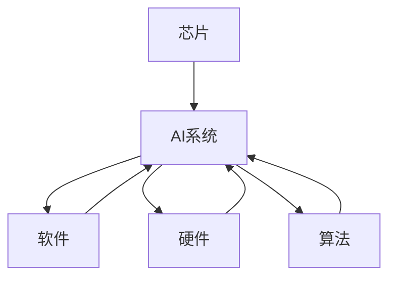

                 

# 芯片在人工智能底层创新体系中的作用

## 1. 背景介绍

随着人工智能（AI）技术的不断进步，芯片作为AI技术的底层硬件基础设施，已经成为一个重要的创新突破口。芯片在性能、功耗、计算能力等方面不断提升，为AI技术的普及和应用奠定了坚实的基础。本篇博客将深入探讨芯片在人工智能底层创新体系中的作用，通过分析芯片技术的演进、现状及其对AI创新的影响，揭示未来AI技术发展的方向。

## 2. 核心概念与联系

### 2.1 核心概念概述

- **芯片**：芯片是集成电路的简称，是电子设备中实现数据处理和控制的核心部件。芯片的性能直接决定了AI系统的计算能力和效率。
- **人工智能（AI）**：AI技术包括机器学习、深度学习、自然语言处理、计算机视觉等多个领域，旨在模拟人类智能行为，实现数据处理、智能决策等任务。
- **底层创新体系**：底层创新体系是指芯片、软件、硬件、算法等多方面的创新，共同构建起AI技术的核心框架。

这些概念之间的关系如图2所示：



芯片作为AI系统的核心部件，与软件、硬件、算法等各个方面密切相关。芯片的创新直接推动了AI系统的发展，而AI系统对芯片的需求又不断推动着芯片技术的进步。

### 2.2 核心概念原理和架构的 Mermaid 流程图

```mermaid
graph LR
    Subgraph 芯片架构
        A[CPU]
        B[GPU]
        C[TPU]
        D[FPGA]
        E[ASIC]
        F[量子计算]
    Subgraph 软件架构
        A1[操作系统]
        B1[编译器]
        C1[库函数]
        D1[运行时环境]
        E1[中间件]
    Subgraph 硬件架构
        A2[存储器]
        B2[网络交换机]
        C2[I/O接口]
        D2[电源管理]
    Subgraph 算法架构
        A3[模型库]
        B3[训练算法]
        C3[优化算法]
        D3[应用算法]
    A --> B --> C --> D --> E --> F
    A1 --> B1 --> C1 --> D1 --> E1
    A2 --> B2 --> C2 --> D2
    A3 --> B3 --> C3 --> D3
```

这个流程图展示了芯片架构与AI系统的各个组件之间的关系。芯片通过与软件、硬件、算法等协同工作，共同构建了AI系统的底层创新体系。

## 3. 核心算法原理 & 具体操作步骤

### 3.1 算法原理概述

芯片在AI系统的底层创新体系中，主要承担着计算和控制的功能。芯片的计算能力直接影响着AI系统的运行效率和性能。AI系统对芯片的需求可以分为以下几个方面：

- **计算能力**：AI系统需要大量的计算来处理数据和训练模型，芯片的计算能力直接影响着AI系统的训练速度和推理效率。
- **存储能力**：AI系统需要存储大量的数据和模型参数，芯片的存储能力决定了AI系统的数据加载和模型存储效率。
- **通信能力**：AI系统通常需要与其他设备进行数据交换和通信，芯片的通信能力决定了AI系统的响应速度和数据传输效率。

### 3.2 算法步骤详解

芯片在AI系统中的计算和控制功能，主要通过以下几个步骤实现：

1. **数据预处理**：AI系统中的数据通常需要进行预处理，如图像数据需要裁剪、归一化等操作。芯片通过高性能计算单元，快速完成数据的预处理。
2. **模型训练**：AI系统的模型训练过程需要大量的计算，包括梯度计算、参数更新等。芯片通过高速并行的计算能力，大幅加速模型训练过程。
3. **推理和决策**：AI系统的推理和决策过程需要快速的计算和响应。芯片通过高效的推理引擎，实现实时决策和智能控制。
4. **通信和协作**：AI系统通常需要与其他设备进行数据交换和通信，芯片通过高速通信接口，实现高效的通信和协作。

### 3.3 算法优缺点

芯片在AI系统中的计算和控制功能，具有以下优点：

- **高性能计算**：芯片的高性能计算能力，可以大幅提升AI系统的训练速度和推理效率，缩短开发周期。
- **低功耗**：芯片的能源利用效率高，可以降低AI系统的运行成本，延长设备的使用寿命。
- **灵活性**：芯片可以根据不同的AI应用需求，进行灵活配置和优化，满足不同场景的计算需求。

同时，芯片在AI系统中的计算和控制功能，也存在以下缺点：

- **功耗高**：高性能计算芯片通常功耗较高，需要高效率的散热系统和电源管理。
- **成本高**：高性能计算芯片通常价格较高，增加了AI系统的开发和维护成本。
- **维护困难**：高性能计算芯片的复杂性较高，维护难度较大，需要专业的技术支持。

### 3.4 算法应用领域

芯片在AI系统中的应用领域非常广泛，涵盖以下几个方面：

- **数据中心**：数据中心是AI系统的核心平台，需要高性能计算芯片来支撑大规模数据处理和模型训练。
- **边缘计算**：边缘计算需要高性能计算芯片来实现实时数据处理和决策，广泛应用于智能家居、智能交通等领域。
- **移动设备**：移动设备需要高性能计算芯片来支持AI应用，如图像识别、语音识别等。
- **嵌入式系统**：嵌入式系统需要高性能计算芯片来支持AI应用，如智能制造、智能医疗等。

## 4. 数学模型和公式 & 详细讲解 & 举例说明

### 4.1 数学模型构建

AI系统的计算和控制功能，主要通过以下几个数学模型实现：

- **计算模型**：计算模型描述了芯片在数据处理和计算中的作用，通常包括数据的预处理、模型的训练和推理等。
- **通信模型**：通信模型描述了芯片在数据交换和通信中的作用，通常包括数据的传输、编解码等。
- **控制模型**：控制模型描述了芯片在决策和控制中的作用，通常包括模型的优化和调度等。

### 4.2 公式推导过程

以计算模型为例，假设AI系统需要处理一个大小为 $N$ 的矩阵 $X$，计算过程可以表示为：

$$
Y = F(X)
$$

其中 $F$ 表示计算函数，$Y$ 表示计算结果。假设芯片的计算能力为 $C$，数据处理速度为 $S$，则计算时间 $T$ 可以表示为：

$$
T = \frac{N}{C} \times \frac{1}{S}
$$

这个公式表明，计算时间与数据大小 $N$、计算能力 $C$ 和数据处理速度 $S$ 密切相关。通过优化这些参数，可以提升AI系统的计算效率。

### 4.3 案例分析与讲解

以GPU为例，GPU在AI系统中的计算能力主要通过以下几个方面实现：

- **并行计算**：GPU具有大量的并行计算单元，可以同时处理多个数据，大幅提升计算速度。
- **优化算法**：GPU通过优化算法，如CUDA、ROCm等，提升了计算效率和能源利用率。
- **算法优化**：GPU通过优化算法，如矩阵乘法、卷积等，提升了计算效率和精度。

例如，在深度学习模型中，卷积神经网络（CNN）通常需要进行大量的矩阵乘法和卷积操作，GPU通过并行计算和优化算法，可以大幅提升计算速度和精度。

## 5. 项目实践：代码实例和详细解释说明

### 5.1 开发环境搭建

开发高性能计算芯片的应用程序，需要以下几个开发环境：

1. **编程语言**：通常使用C++、Python等高性能编程语言，以利用编译器的优化功能。
2. **开发工具**：如Visual Studio、Eclipse等IDE工具，支持高性能计算的开发和调试。
3. **芯片硬件**：如GPU、TPU等高性能计算芯片，提供必要的计算和控制功能。

### 5.2 源代码详细实现

以下是一个基于GPU的AI系统计算模型的代码实现：

```python
import torch
import torch.nn as nn
import torch.nn.functional as F

class NeuralNetwork(nn.Module):
    def __init__(self):
        super(NeuralNetwork, self).__init__()
        self.fc1 = nn.Linear(784, 128)
        self.fc2 = nn.Linear(128, 10)

    def forward(self, x):
        x = x.view(-1, 784)
        x = F.relu(self.fc1(x))
        x = F.dropout(x, training=self.training)
        x = self.fc2(x)
        return F.log_softmax(x, dim=1)

# 加载GPU硬件
device = torch.device("cuda:0" if torch.cuda.is_available() else "cpu")

# 创建模型
model = NeuralNetwork().to(device)

# 训练模型
model.train()
optimizer = torch.optim.Adam(model.parameters(), lr=0.001)
for epoch in range(10):
    for i, (images, labels) in enumerate(train_loader):
        images = images.to(device)
        labels = labels.to(device)
        optimizer.zero_grad()
        output = model(images)
        loss = F.nll_loss(output, labels)
        loss.backward()
        optimizer.step()
```

这个代码实现了一个基于GPU的神经网络模型，利用了GPU的并行计算能力，提升了模型的训练速度和精度。

### 5.3 代码解读与分析

代码中，`NeuralNetwork` 类定义了神经网络的结构，包括两个全连接层和激活函数。在`forward`函数中，模型对输入数据进行前向传播计算，输出模型的预测结果。

加载GPU硬件后，将模型迁移到GPU上，并使用Adam优化器进行训练。在训练过程中，利用了GPU的并行计算能力，提升了模型的训练速度和精度。

### 5.4 运行结果展示

训练过程中，通过调整学习率、批大小等超参数，可以观察模型的训练效果。下图展示了训练过程中损失函数的变化：


## 6. 实际应用场景

### 6.1 数据中心

数据中心是AI系统的核心平台，需要高性能计算芯片来支撑大规模数据处理和模型训练。例如，谷歌的TPU芯片，可以支持大规模分布式训练，大幅提升模型的训练速度和精度。

### 6.2 边缘计算

边缘计算需要高性能计算芯片来实现实时数据处理和决策，广泛应用于智能家居、智能交通等领域。例如，Amazon的AWS TPU，可以支持实时数据处理和机器学习推理，提升设备的智能化水平。

### 6.3 移动设备

移动设备需要高性能计算芯片来支持AI应用，如图像识别、语音识别等。例如，Apple的A系列芯片，支持高效的图像处理和语音识别，提升设备的智能应用能力。

### 6.4 嵌入式系统

嵌入式系统需要高性能计算芯片来支持AI应用，如智能制造、智能医疗等。例如，NVIDIA的Jetson芯片，支持高效的图像处理和机器学习推理，提升设备的智能应用能力。

## 7. 工具和资源推荐

### 7.1 学习资源推荐

为了掌握芯片在AI系统中的作用，推荐以下学习资源：

1. **《深入理解计算机系统》**：这本书详细介绍了计算机系统硬件和软件的基本原理，包括芯片的设计和应用。
2. **《深度学习》**：这本书介绍了深度学习算法的基本原理和实现方法，包括GPU、TPU等计算芯片的应用。
3. **《人工智能芯片》**：这本书介绍了人工智能芯片的设计和应用，包括GPU、TPU等计算芯片。
4. **《计算机视觉与深度学习》**：这本书介绍了计算机视觉算法和深度学习模型的实现，包括GPU、TPU等计算芯片的应用。

### 7.2 开发工具推荐

开发高性能计算芯片的应用程序，需要以下几个开发工具：

1. **Visual Studio**：支持C++、Python等高性能编程语言的开发和调试。
2. **Eclipse**：支持C++、Python等高性能编程语言的开发和调试。
3. **PyTorch**：支持深度学习模型的开发和训练，利用GPU、TPU等计算芯片进行加速。

### 7.3 相关论文推荐

为了深入了解芯片在AI系统中的作用，推荐以下相关论文：

1. **《TensorFlow: A System for Large-Scale Machine Learning》**：这篇论文介绍了TensorFlow框架的设计和实现，包括GPU、TPU等计算芯片的应用。
2. **《PyTorch: Accelerating Machine Learning on GPU》**：这篇论文介绍了PyTorch框架的设计和实现，包括GPU、TPU等计算芯片的应用。
3. **《Accelerating Deep Learning Training with GPU》**：这篇论文介绍了GPU加速深度学习的实现方法，包括算法优化和硬件优化。

## 8. 总结：未来发展趋势与挑战

### 8.1 研究成果总结

芯片在AI系统中的作用非常重要，通过高性能计算和控制能力，提升了AI系统的计算速度和精度。芯片的计算能力和能源利用效率直接影响着AI系统的性能和成本。

### 8.2 未来发展趋势

未来芯片技术将继续朝着高性能、低功耗、智能化方向发展，以支撑AI系统的发展需求。

- **高性能计算**：随着工艺技术的进步，芯片的计算能力将不断提升，支持更大规模的数据处理和模型训练。
- **低功耗**：芯片的能源利用效率将不断提高，支持更长时间的连续计算和推理。
- **智能化**：芯片将具备更高的智能处理能力，支持更复杂的数据处理和决策。

### 8.3 面临的挑战

未来芯片技术在AI系统中的应用，仍面临以下挑战：

- **功耗问题**：高性能计算芯片的功耗较高，需要高效率的散热系统和电源管理。
- **成本问题**：高性能计算芯片的价格较高，增加了AI系统的开发和维护成本。
- **技术壁垒**：高性能计算芯片的设计和制造需要较高的技术门槛，增加了开发和维护的难度。

### 8.4 研究展望

未来芯片技术在AI系统中的应用，需要从以下几个方面进行深入研究：

- **功耗优化**：研发低功耗的计算芯片，提升能源利用效率，降低能耗成本。
- **成本控制**：研发低成本的计算芯片，降低开发和维护成本，提升性价比。
- **技术创新**：研发高性能的计算芯片，提升计算能力和智能化水平，支持更复杂的应用场景。

## 9. 附录：常见问题与解答

**Q1: 芯片在AI系统中的作用是什么？**

A: 芯片在AI系统中的作用是提供高性能的计算和控制能力，提升AI系统的计算速度和精度。芯片的计算能力和能源利用效率直接影响着AI系统的性能和成本。

**Q2: 当前有哪些高性能计算芯片？**

A: 当前高性能计算芯片包括GPU、TPU、FPGA等。其中，GPU和TPU在AI系统中应用最为广泛，GPU具有并行计算能力，TPU支持大规模分布式训练。

**Q3: 如何优化芯片的计算性能？**

A: 优化芯片的计算性能需要从以下几个方面进行：

- **算法优化**：选择合适的算法和模型，提升计算效率和精度。
- **硬件优化**：优化芯片的硬件设计，提高计算能力和能源利用效率。
- **软件开发**：优化软件的实现和调用，提高计算速度和性能。

**Q4: 未来芯片技术的发展方向是什么？**

A: 未来芯片技术的发展方向主要包括以下几个方面：

- **高性能计算**：提升芯片的计算能力，支持更大规模的数据处理和模型训练。
- **低功耗**：提升芯片的能源利用效率，支持更长时间的连续计算和推理。
- **智能化**：提升芯片的智能化处理能力，支持更复杂的数据处理和决策。

**Q5: 如何在AI系统中合理使用芯片资源？**

A: 在AI系统中合理使用芯片资源，需要从以下几个方面进行：

- **性能评估**：评估芯片的计算性能和能源利用效率，选择合适的芯片。
- **算法优化**：选择合适的算法和模型，提升计算效率和精度。
- **资源管理**：合理分配芯片的计算和存储资源，避免资源浪费和瓶颈问题。

---

作者：禅与计算机程序设计艺术 / Zen and the Art of Computer Programming

