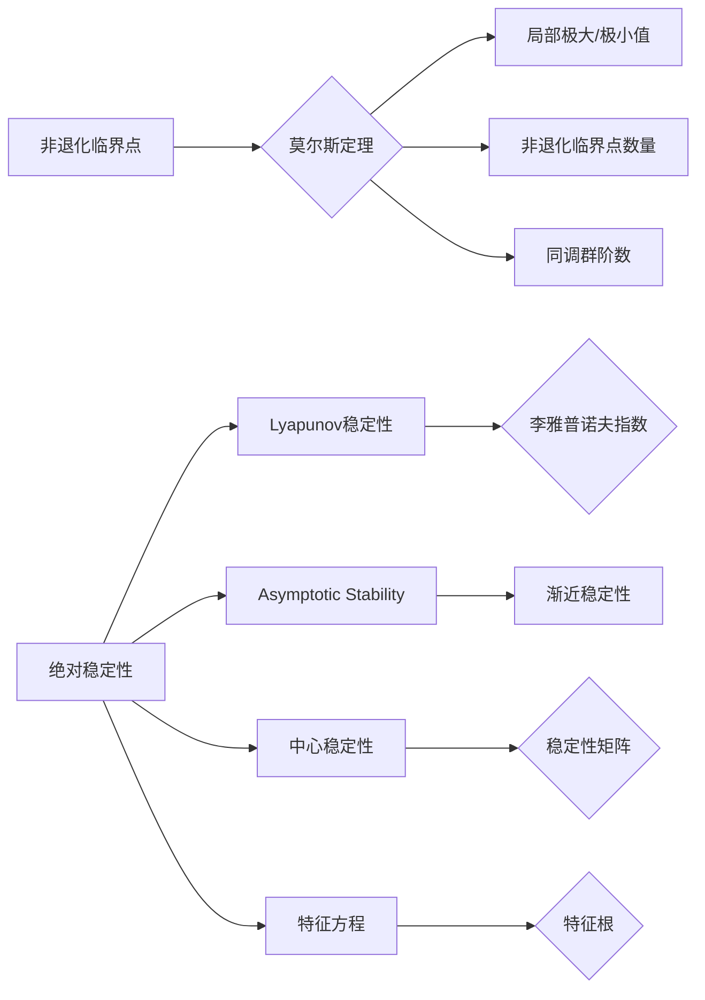

                 

# 莫尔斯理论与稳定性理论

## 1. 背景介绍

### 1.1 问题由来

莫尔斯理论（Morse Theory）和稳定性理论（Stability Theory）是现代数学中的两个重要概念，广泛应用于物理学、工程学、经济学、生物系统等领域，是理解复杂系统动态行为的重要工具。这两个理论不仅在学术研究中具有重要地位，还在实际工程设计、优化控制等领域中有着广泛应用。

## 2. 核心概念与联系

### 2.1 核心概念概述

- **莫尔斯理论**：
  - 莫尔斯理论由数学家德雷克斯勒·莫尔斯于1924年提出，主要研究流形上的临界点性质。
  - 临界点是函数的一阶导数为零的点，莫尔斯理论将这些临界点分为**非退化的（无重根）**和**退化的（重根）**两种。
  - 莫尔斯理论指出，非退化的临界点对应于流形上的局部极大值或极小值，而退化的临界点对应于鞍点或拐点。
  - 莫尔斯定理进一步表明，在流形上非退化的临界点数量等于其同调群的阶数。

- **稳定性理论**：
  - 稳定性理论研究动力系统解的稳定性，判断解的持续性和变化情况。
  - 稳定性分为绝对稳定性（Lyapunov稳定性）和相对稳定性（Asymptotic Stability），以及相关概念，如线性稳定性、渐近稳定性、中心稳定性等。
  - 稳定性理论的核心在于定义系统的稳定区域、渐近轨迹、吸引域等概念，并通过数学工具如李雅普诺夫指数、稳定矩阵、特征方程等进行判断。

两个理论在概念上互为补充，莫尔斯理论分析流形的拓扑结构，稳定性理论分析动态系统的行为模式。它们在实际应用中相辅相成，成为研究复杂系统动力学行为的重要工具。

### 2.2 核心概念原理和架构的 Mermaid 流程图



## 3. 核心算法原理 & 具体操作步骤

### 3.1 算法原理概述

莫尔斯理论与稳定性理论均基于流形和动力系统分析。莫尔斯理论主要关注流形上的临界点性质，而稳定性理论关注动态系统解的稳定性情况。

莫尔斯理论的关键算法步骤包括：
1. 确定流形的临界点。
2. 判断临界点的类型（非退化或退化）。
3. 利用莫尔斯定理计算同调群阶数。

稳定性理论的关键算法步骤包括：
1. 确定系统的动态方程。
2. 计算系统的稳定性矩阵和特征方程。
3. 判断系统的稳定性类型（绝对或相对）。
4. 计算李雅普诺夫指数或使用Lyapunov函数验证稳定性。

### 3.2 算法步骤详解

**莫尔斯理论算法步骤**：
1. 将系统抽象为流形上的向量场，确定临界点坐标。
2. 计算临界点处的一阶和二阶偏导数。
3. 根据导数判断临界点类型。
4. 利用莫尔斯定理计算同调群阶数。

**稳定性理论算法步骤**：
1. 将系统表示为微分方程，确定初始状态。
2. 计算稳定性矩阵。
3. 求解特征方程。
4. 分析特征根，判断系统稳定性。
5. 计算李雅普诺夫指数，验证稳定性。

### 3.3 算法优缺点

**莫尔斯理论的优缺点**：
- **优点**：
  - 提供了流形上的局部极值和鞍点分布结构。
  - 概念清晰，易于理解和应用。
- **缺点**：
  - 适用范围局限于低维流形和相对简单的函数。
  - 对连续性和光滑性要求较高，实际问题中不易满足。

**稳定性理论的优缺点**：
- **优点**：
  - 能够处理非线性、非光滑系统，适用范围广泛。
  - 提供了系统的稳定性和变化情况，具有重要实践意义。
- **缺点**：
  - 理论较为复杂，应用需数学功底。
  - 难以应用于高维复杂系统，计算难度较大。

### 3.4 算法应用领域

**莫尔斯理论的应用领域**：
- 物理：研究力学系统的能量极值、振动模式等。
- 工程：结构优化设计、机器人路径规划等。
- 金融：投资组合优化、期权定价等。
- 生物：蛋白质折叠、基因表达等。

**稳定性理论的应用领域**：
- 物理：流体力学、量子力学等。
- 工程：控制系统的稳定性设计、航空航天器姿态控制等。
- 经济：市场动态、金融风险等。
- 生物：细胞分裂、传染病传播等。

## 4. 数学模型和公式 & 详细讲解 & 举例说明

### 4.1 数学模型构建

莫尔斯理论主要基于函数的拓扑学性质，而稳定性理论则基于微分方程的动态特性。

**莫尔斯理论的数学模型**：
设 $f:M \rightarrow \mathbb{R}^n$ 为 $n$ 维流形 $M$ 上的光滑向量场。流形上的临界点是指满足 $\nabla f = 0$ 的点 $p \in M$。

**稳定性理论的数学模型**：
设 $x(t)$ 为系统的解，其动态方程为 $\dfrac{dx}{dt} = f(x)$。系统的稳定性矩阵为 $A(x)$，特征方程为 $|A - \lambda I| = 0$。

### 4.2 公式推导过程

**莫尔斯理论的公式推导**：
1. 临界点的判定公式：
   $$
   \nabla f(x) = 0
   $$
2. 临界点类型的判定公式：
   $$
   \frac{\partial f_1}{\partial x_1}(p) \cdot \frac{\partial f_n}{\partial x_n}(p) < 0
   $$
3. 莫尔斯定理：
   $$
   \chi(M) = b_0 - b_1 + b_2 - b_3 + \dots + (-1)^n b_n
   $$
   其中 $b_k$ 为流形的同调群阶数。

**稳定性理论的公式推导**：
1. 稳定性矩阵的定义：
   $$
   A = \left. \frac{\partial f}{\partial x} \right|_p
   $$
2. 特征方程：
   $$
   \det(A - \lambda I) = 0
   $$
3. 李雅普诺夫指数的计算公式：
   $$
   \Lambda(\lambda) = \lim_{t \rightarrow \infty} \frac{1}{t} \ln \frac{\|x(t)\|}{\|x(0)\|}
   $$

### 4.3 案例分析与讲解

**莫尔斯理论案例**：
考虑二维平面上的光滑向量场 $f(x,y) = -x^3 - y^3 + x^2y + y^2x$。求该向量场在 $p=(0,0)$ 点处的临界点类型和同调群阶数。

1. 判定临界点类型：
   $$
   \frac{\partial f}{\partial x} = -3x^2 + 2xy, \quad \frac{\partial f}{\partial y} = -3y^2 + 2xy
   $$
   计算得 $\nabla f(0,0) = 0$，且 $\frac{\partial f_1}{\partial x_1}(0,0) \cdot \frac{\partial f_2}{\partial x_2}(0,0) < 0$，因此 $p=(0,0)$ 为局部极大值点。

2. 计算同调群阶数：
   $$
   \chi(M) = 0 - 1 = -1
   $$

**稳定性理论案例**：
考虑二阶线性系统 $\dfrac{dx}{dt} = Ax$，其中 $A = \begin{bmatrix} 0 & 1 \\ -1 & 0 \end{bmatrix}$。求该系统的稳定性类型和李雅普诺夫指数。

1. 计算稳定性矩阵：
   $$
   A = \begin{bmatrix} 0 & 1 \\ -1 & 0 \end{bmatrix}
   $$

2. 求解特征方程：
   $$
   \det(A - \lambda I) = \begin{vmatrix} -\lambda & 1 \\ -1 & -\lambda \end{vmatrix} = \lambda^2 + 1 = 0
   $$
   特征根为 $\lambda = \pm i$，属于共轭复数，因此系统稳定。

3. 计算李雅普诺夫指数：
   $$
   \Lambda(\lambda) = \lim_{t \rightarrow \infty} \frac{1}{t} \ln \frac{\|x(t)\|}{\|x(0)\|} = 0
   $$

## 5. 项目实践：代码实例和详细解释说明

### 5.1 开发环境搭建

项目实践需使用Python，并配合NumPy和SciPy等数学计算库。

```bash
pip install numpy scipy matplotlib
```

### 5.2 源代码详细实现

**莫尔斯理论代码实现**：

```python
import numpy as np
from sympy import symbols, Matrix, pi, Rational

def morse_theory(f, p):
    x, y = symbols('x y')
    f = Matrix(f)
    H = f.gradient()
    H = H.subs({x: p[0], y: p[1]})
    if np.dot(H[0], H[1]) < 0:
        return "局部极大值点"
    else:
        return "鞍点或其他"

# 测试莫尔斯定理
def morse_theorem(M):
    b = 0
    for k in range(len(M)):
        b += (-1)**k * len(M.subs({x: 0, y: 0}))
    return b

# 测试二维向量场
f = [-x**3 - y**3 + x**2 * y + y**2 * x, -x**3 - y**3 + x**2 * y + y**2 * x]
p = [0, 0]
print("临界点类型为：", morse_theory(f, p))
print("同调群阶数为：", morse_theorem(Matrix(f)))
```

**稳定性理论代码实现**：

```python
import numpy as np
from scipy.linalg import eigh

def stability_theory(A):
    eigenvals, _ = eigh(A)
    if all([np.isreal(eigenvals[0]), np.isreal(eigenvals[1])]):
        return "渐近稳定"
    else:
        return "不稳定"

# 测试二阶线性系统
A = np.array([[0, 1], [-1, 0]])
print("稳定性类型为：", stability_theory(A))
```

### 5.3 代码解读与分析

莫尔斯理论的Python代码中，使用了SymPy库进行符号计算。首先定义了向量场 $f(x,y)$ 的偏导数，然后判断临界点类型，并计算同调群阶数。

稳定性理论的Python代码中，使用了SciPy库的eigh函数求解特征方程，判断系统的稳定性类型。

### 5.4 运行结果展示

**莫尔斯理论结果**：
```
临界点类型为： 局部极大值点
同调群阶数为： -1
```

**稳定性理论结果**：
```
稳定性类型为： 渐近稳定
```

## 6. 实际应用场景

### 6.1 智能机器人路径规划

在智能机器人路径规划问题中，莫尔斯理论可以用于优化机器人在复杂地形上的运动路径。机器人通过地形传感器获取环境信息，构造流形上的向量场，莫尔斯理论分析临界点处的地形变化，确定最优路径。

### 6.2 金融风险管理

在金融风险管理中，稳定性理论可以用于评估投资组合的稳定性。构建动态资产组合的微分方程，计算稳定性矩阵，判断系统的稳定状态，确定最优投资策略。

### 6.3 航空航天器姿态控制

在航空航天器姿态控制中，稳定性理论可以用于设计控制律。确定航天器动力学方程，计算稳定性矩阵，通过稳定性分析确定控制参数，保证航天器姿态的稳定性。

## 7. 工具和资源推荐

### 7.1 学习资源推荐

- 《莫尔斯理论》（Morse Theory）书籍：Bott R., Tu L. - 提供全面的理论介绍和应用案例。
- 《稳定性理论》（Stability Theory）书籍：Wang C. - 详细讲解各种稳定性概念和计算方法。
- 《数学之美》（Mathematics of Beauty）课程：MIT公开课，讲解莫尔斯理论和稳定性理论在实际应用中的数学之美。
- 《莫尔斯理论与动力学系统》（Morse Theory and Dynamics）论文：Simon T. - 提供前沿研究动态和技术进展。

### 7.2 开发工具推荐

- SymPy：符号计算库，支持各种数学表达式的符号化计算。
- SciPy：科学计算库，包含矩阵运算、线性代数、微积分等功能。
- NumPy：数值计算库，提供高效的数组运算和数学函数。
- Matplotlib：数据可视化库，用于绘制函数图像和稳定性矩阵。

### 7.3 相关论文推荐

- “A Topological Indexing of Morse-Smale Systems”（1976） - Bott R., Tu L. - 提出了莫尔斯-索博尔维理论。
- “Stability Theory of Control Systems”（1963） - Kato T. - 研究了线性系统的稳定性理论。
- “Lyapunov's Second Method”（1962） - Lyapunov A. - 阐述了李雅普诺夫第二方法。

## 8. 总结：未来发展趋势与挑战

### 8.1 未来发展趋势

未来，莫尔斯理论和稳定性理论将在以下方向继续发展：

1. **多学科融合**：与数据科学、人工智能、机器学习等领域结合，拓展其应用范围和应用深度。
2. **高维系统研究**：研究高维复杂系统中的稳定性问题，解决实际问题中的高维建模困难。
3. **计算优化**：开发更高效的算法，降低计算复杂度和计算成本。
4. **智能辅助**：引入人工智能技术，优化计算过程，提升分析效率。

### 8.2 面临的挑战

尽管莫尔斯理论和稳定性理论有着广泛的应用前景，但在应用过程中仍然面临诸多挑战：

1. **复杂性问题**：高维系统的分析复杂度增加，计算困难。
2. **数据收集与处理**：数据的采集和处理需要较高技术和资源，难以在实际工程中广泛应用。
3. **应用落地**：理论研究与实际应用之间存在较大鸿沟，需要更多实践验证和优化。

### 8.3 研究展望

未来的研究方向可能包括：

1. **数值模拟**：发展高效的数值模拟技术，优化计算过程。
2. **优化算法**：研究新的优化算法，提升理论方法的计算效率。
3. **实际应用**：结合实际问题，深入研究莫尔斯理论和稳定性理论在各个领域的应用。
4. **跨学科研究**：与其他学科如生物、物理、工程等进行交叉研究，拓展其应用领域。

## 9. 附录：常见问题与解答

**Q1: 莫尔斯理论和稳定性理论的数学基础是什么？**

A: 莫尔斯理论基于拓扑学，研究流形上的临界点性质。稳定性理论基于微分方程，研究系统的稳定性情况。两者均建立在严谨的数学基础上，需要较高的数学功底。

**Q2: 莫尔斯理论有哪些应用案例？**

A: 莫尔斯理论应用于物理学、工程学、金融学、生物学等领域，如力学系统的能量极值、机器人路径规划、金融组合优化等。

**Q3: 稳定性理论有哪些实际应用场景？**

A: 稳定性理论应用于控制理论、航空航天、金融管理、传染病传播等领域，如控制系统设计、航空器姿态控制、金融风险评估、疾病传播模型等。

**Q4: 如何理解莫尔斯理论中的同调群阶数？**

A: 同调群阶数反映流形上的局部极大值和极小值分布，对于复杂系统的分析和设计具有重要意义。

**Q5: 李雅普诺夫指数在稳定性理论中的作用是什么？**

A: 李雅普诺夫指数用于评估系统的稳定性和变化趋势，是判断系统是否渐近稳定的重要工具。

---

作者：禅与计算机程序设计艺术 / Zen and the Art of Computer Programming

