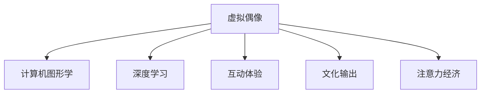

                 

# 虚拟偶像在注意力经济中的崛起

## 1. 背景介绍

### 1.1 问题由来
在互联网快速发展的今天，注意力经济成为一种新的商业模式，即通过争夺用户的注意力来获取商业价值。传统的注意力获取方式包括社交媒体广告、搜索引擎优化、内容付费等。但这些方式在竞争日益激烈的市场环境中逐渐失效，如何创新地吸引和保持用户注意力成为一个重要议题。

虚拟偶像（Virtual Idol），作为近些年兴起的数字文化新形态，以其独特的魅力成为新的注意力经济增长点。虚拟偶像是由计算机技术生成的虚拟角色，通常具备人类的外貌、声音和个性，通过音乐、舞蹈、演讲、直播等形式进行互动和表演，具有高度的互动性和个性化，能满足不同用户群体的需求。

### 1.2 问题核心关键点
虚拟偶像的崛起主要基于以下几个关键点：
1. **技术革新**：计算机图形学、深度学习等技术的发展，使得虚拟偶像具备高度的拟真性和互动性。
2. **用户需求**：现代社会追求个性化、自由化、高度互动的用户体验，虚拟偶像的出现正符合这一趋势。
3. **市场需求**：流量和广告收益成为品牌竞争的重要手段，虚拟偶像成为新的广告和品牌推广工具。
4. **文化输出**：虚拟偶像能够传递独特的文化价值，并影响年轻一代的文化认同和消费行为。

### 1.3 问题研究意义
研究虚拟偶像在注意力经济中的崛起，对理解新兴数字文化产业具有重要意义：
1. **技术进步**：分析虚拟偶像的技术基础和创新点，促进计算机图形学和人工智能等技术的发展。
2. **市场趋势**：通过虚拟偶像的崛起，揭示注意力经济的发展趋势，为品牌和广告公司提供新的思路。
3. **文化影响**：探索虚拟偶像对文化输出的影响，推动文化产业的数字化转型。

## 2. 核心概念与联系

### 2.1 核心概念概述

为更好地理解虚拟偶像在注意力经济中的崛起，本节将介绍几个核心概念及其相互关系：

- **虚拟偶像（Virtual Idol）**：由计算机生成的虚拟角色，具备人类的外貌、声音和个性，通过互动和表演吸引用户注意力。
- **注意力经济（Attention Economy）**：通过争夺用户的注意力来获取商业价值的新型经济模式。
- **计算机图形学（Computer Graphics）**：研究计算机生成图像和动画的技术。
- **深度学习（Deep Learning）**：基于人工神经网络的学习算法，可以生成高度拟真的虚拟偶像。
- **互动体验（Interactive Experience）**：通过虚拟偶像的表演和互动，提升用户参与度，满足个性化需求。
- **文化输出（Cultural Output）**：虚拟偶像传递文化价值，影响年轻一代的消费和价值观。

这些概念之间通过互动和表演这一核心环节，构建了一个完整的虚拟偶像生态系统，如图：



## 3. 核心算法原理 & 具体操作步骤
### 3.1 算法原理概述

虚拟偶像的生成和互动过程，本质上是计算机图形学和深度学习的结合。具体来说，虚拟偶像的生成流程包括三个主要步骤：

1. **3D建模**：利用计算机图形学技术，创建虚拟偶像的3D模型，包括人体、脸部、衣物等细节。
2. **动画生成**：通过深度学习算法，如生成对抗网络（GAN），生成虚拟偶像的动画视频，实现自然流畅的互动。
3. **互动体验**：通过自然语言处理（NLP）技术，使虚拟偶像具备对话和互动能力，提升用户参与度。

### 3.2 算法步骤详解

**Step 1: 3D建模**

1. **基础建模**：使用Blender等软件，创建虚拟偶像的基本3D模型。
2. **纹理贴图**：通过Photoshop等工具，为模型添加纹理和材质，增强视觉真实感。
3. **光照与渲染**：设置光照和材质参数，使用Arnold等渲染器进行渲染，得到最终图像。

**Step 2: 动画生成**

1. **动作捕捉**：使用动作捕捉系统，记录真人演员的表演动作。
2. **姿态估计**：通过深度学习算法，如姿态估计网络（PoseNet），将动作数据转换为虚拟偶像的骨骼姿态。
3. **动画生成**：使用GAN等生成模型，将骨骼姿态映射为动画帧，生成自然流畅的动画视频。

**Step 3: 互动体验**

1. **自然语言处理**：使用GPT-3等模型，训练虚拟偶像的对话和互动能力，使其能够理解用户输入并作出回应。
2. **声音合成**：通过声音合成技术，如WaveNet，生成虚拟偶像的声音，实现与用户的语音交互。
3. **多模态互动**：结合图像、声音、文本等多模态数据，实现更加丰富和多样的互动体验。

### 3.3 算法优缺点

虚拟偶像生成和互动算法的优缺点如下：
1. **优点**：
   - **高拟真性**：通过深度学习和图形学技术，虚拟偶像具备高度的拟真性和互动性。
   - **个性化定制**：用户可以根据自己的喜好定制虚拟偶像的外观和性格，满足个性化需求。
   - **成本较低**：相较于真人偶像，虚拟偶像的制作成本较低，且不受时间和空间限制。
2. **缺点**：
   - **技术复杂**：虚拟偶像的生成和互动涉及多个技术领域，实现难度较大。
   - **互动深度有限**：尽管可以通过NLP技术提升互动效果，但与真人互动仍有一定差距。
   - **文化认同**：虚拟偶像缺乏人类情感和价值观，可能难以获得广泛的文化认同。

### 3.4 算法应用领域

虚拟偶像在多个领域有广泛的应用：

1. **音乐和舞蹈**：虚拟偶像可以成为音乐和舞蹈表演者，吸引大量观众关注。
2. **广告和营销**：虚拟偶像成为新的广告和营销工具，提升品牌知名度和用户参与度。
3. **教育和培训**：虚拟偶像可以用于虚拟现实（VR）教学和模拟培训，提供沉浸式学习体验。
4. **游戏和娱乐**：虚拟偶像参与游戏和娱乐项目，提供互动和娱乐内容。
5. **社交和互动**：虚拟偶像与用户进行社交和互动，建立虚拟社区。

## 4. 数学模型和公式 & 详细讲解 & 举例说明（备注：数学公式请使用latex格式，latex嵌入文中独立段落使用 $$，段落内使用 $)
### 4.1 数学模型构建

虚拟偶像的生成和互动过程可以通过数学模型来描述。下面以生成对抗网络（GAN）为例，介绍其基本模型结构：

**Generator（生成器）**：
$$
G(z) = \mathcal{W}_{GAN} \left( w_1, w_2, \ldots, w_n \right)
$$
其中 $z$ 为随机噪声向量，$w_i$ 为生成器网络参数。

**Discriminator（判别器）**：
$$
D(x) = \mathcal{D}_{GAN} \left( v_1, v_2, \ldots, v_m \right)
$$
其中 $x$ 为输入图像，$v_i$ 为判别器网络参数。

**训练目标**：
$$
\min_G \max_D V(G, D) = \mathbb{E}_{x \sim p_{data}(x)} \log D(x) + \mathbb{E}_{z \sim p_z(z)} \log (1 - D(G(z)))
$$

通过最小化生成器的损失和最大化判别器的损失，GAN能够生成高度逼真的虚拟偶像动画。

### 4.2 公式推导过程

GAN的训练过程可以分为两个步骤：
1. **生成器的损失函数**：
$$
L_G = \mathbb{E}_{z \sim p_z(z)} \log (1 - D(G(z)))
$$
2. **判别器的损失函数**：
$$
L_D = \mathbb{E}_{x \sim p_{data}(x)} \log D(x) + \mathbb{E}_{z \sim p_z(z)} \log (1 - D(G(z)))
$$

### 4.3 案例分析与讲解

以虚拟偶像生成为例，假设我们要生成一个站立的虚拟偶像，可以按照以下步骤进行：

1. **基础建模**：使用Blender创建虚拟偶像的3D模型，并进行纹理贴图和光照渲染。
2. **动作捕捉**：使用动作捕捉系统，记录真人演员的站立动作，并进行骨骼姿态估计。
3. **动画生成**：通过GAN网络，将骨骼姿态转换为动画帧，生成站立的虚拟偶像动画。
4. **互动体验**：使用NLP模型，训练虚拟偶像的对话和互动能力，并通过WaveNet生成声音。

## 5. 项目实践：代码实例和详细解释说明
### 5.1 开发环境搭建

在进行虚拟偶像项目开发前，我们需要准备好开发环境。以下是使用Python进行PyTorch开发的环境配置流程：

1. 安装Anaconda：从官网下载并安装Anaconda，用于创建独立的Python环境。

2. 创建并激活虚拟环境：
```bash
conda create -n pytorch-env python=3.8 
conda activate pytorch-env
```

3. 安装PyTorch：根据CUDA版本，从官网获取对应的安装命令。例如：
```bash
conda install pytorch torchvision torchaudio cudatoolkit=11.1 -c pytorch -c conda-forge
```

4. 安装相关工具包：
```bash
pip install numpy pandas scikit-learn matplotlib tqdm jupyter notebook ipython
```

5. 安装Blender和Python脚本：确保Blender和Python能够协同工作。

### 5.2 源代码详细实现

这里我们以虚拟偶像动画生成为例，使用Blender和PyTorch实现。

**Step 1: 3D建模**

1. 使用Blender创建虚拟偶像的3D模型，并进行纹理贴图和光照渲染。
2. 导出模型数据，供后续动画生成使用。

**Step 2: 动画生成**

1. 使用Blender打开模型数据，并在其中添加骨骼动画。
2. 使用Blender内置的动画生成工具，导出动画帧序列。

**Step 3: 互动体验**

1. 使用NLP模型，如GPT-3，训练虚拟偶像的对话和互动能力。
2. 使用WaveNet等声音合成模型，生成虚拟偶像的声音。

### 5.3 代码解读与分析

**3D建模代码**：
```python
import bpy

# 导入模型数据
bpy.ops.import_scene.obj(filepath='path/to/model.obj')
# 纹理贴图和光照渲染
# 导出模型数据
bpy.ops.export_scene.obj(filepath='path/to/exported.obj')
```

**动画生成代码**：
```python
import bpy

# 打开模型数据
bpy.ops.open(filepath='path/to/model.blend')
# 添加骨骼动画
bpy.ops.object.select_by_name('Armature')
bpy.ops.object.parent_set(type='bone')
# 导出动画帧序列
bpy.ops.render.render(animation=True)
```

**互动体验代码**：
```python
import torch
import numpy as np
from transformers import GPT3Model, GPT3Tokenizer

# 初始化NLP模型
tokenizer = GPT3Tokenizer.from_pretrained('gpt3')
model = GPT3Model.from_pretrained('gpt3')

# 定义虚拟偶像的对话功能
def interact(user_input):
    user_input = tokenizer.encode(user_input, return_tensors='pt')
    output = model.generate(user_input)
    response = tokenizer.decode(output[0], skip_special_tokens=True)
    return response

# 使用虚拟偶像进行对话
response = interact("你好，你叫什么名字？")
print(response)
```

通过上述代码，我们可以实现虚拟偶像的3D建模、动画生成和互动体验。代码通过Python与Blender进行协同工作，实现了虚拟偶像的复杂生成过程。

### 5.4 运行结果展示

运行以上代码后，即可生成虚拟偶像的3D模型和动画，并通过NLP模型实现互动对话。

## 6. 实际应用场景

### 6.1 音乐和舞蹈

虚拟偶像可以成为音乐和舞蹈表演者，吸引大量观众关注。例如，日本虚拟偶像初音未来（Hatsune Miku）就是通过音乐和舞蹈视频在网络上走红，成为全球知名的虚拟偶像。

### 6.2 广告和营销

虚拟偶像成为新的广告和营销工具，提升品牌知名度和用户参与度。例如，法国奢侈品牌Dior就推出了虚拟偶像“Lady Diana”，通过视频广告和互动活动，提升品牌形象和用户互动。

### 6.3 教育和培训

虚拟偶像可以用于虚拟现实（VR）教学和模拟培训，提供沉浸式学习体验。例如，Khan Academy就使用虚拟偶像进行科学教学，通过互动和表演，激发学生的学习兴趣。

### 6.4 游戏和娱乐

虚拟偶像参与游戏和娱乐项目，提供互动和娱乐内容。例如，虚拟偶像Akiro于2020年在游戏《Halo Infinite》中首次亮相，成为游戏中的主要角色之一。

### 6.5 社交和互动

虚拟偶像与用户进行社交和互动，建立虚拟社区。例如，虚拟偶像Kara由知名游戏公司Bluehole推出，通过社交平台与用户互动，建立庞大的粉丝群体。

## 7. 工具和资源推荐
### 7.1 学习资源推荐

为了帮助开发者系统掌握虚拟偶像的开发技术，这里推荐一些优质的学习资源：

1. **Blender官方文档**：Blender的官方文档提供了全面的3D建模和动画生成指南，适合初学者快速上手。

2. **PyTorch官方文档**：PyTorch的官方文档详细介绍了深度学习模型的实现，适合进行复杂的虚拟偶像互动体验开发。

3. **NLP模型教程**：Google和OpenAI提供的NLP模型教程，介绍了NLP模型的基本原理和应用，适合进行虚拟偶像的对话和互动功能开发。

4. **虚拟偶像开发社区**：如Vidyo.org和IdolAI.org，提供丰富的虚拟偶像开发资源和社区支持，适合学习交流。

5. **虚拟偶像案例集**：如初音未来和Lady Diana的开发案例，详细介绍了虚拟偶像的生成和互动过程，适合学习和借鉴。

通过对这些资源的学习实践，相信你一定能够快速掌握虚拟偶像的开发技术，并用于解决实际的NLP问题。

### 7.2 开发工具推荐

高效的开发离不开优秀的工具支持。以下是几款用于虚拟偶像开发的常用工具：

1. **Blender**：Blender是一款功能强大的3D建模和动画生成工具，支持Python脚本开发。

2. **PyTorch**：基于Python的开源深度学习框架，适合复杂的虚拟偶像互动体验开发。

3. **Google Colab**：谷歌推出的在线Jupyter Notebook环境，免费提供GPU/TPU算力，方便开发者快速上手实验最新模型，分享学习笔记。

4. **NLP模型库**：如HuggingFace的Transformers库，提供丰富的NLP模型，适合进行虚拟偶像的对话和互动功能开发。

5. **音频处理工具**：如WaveNet，用于声音合成和处理，提升虚拟偶像的语音互动效果。

6. **虚拟现实平台**：如Unity和Unreal Engine，支持虚拟偶像的多模态互动体验开发，适合进行VR教学和模拟培训。

合理利用这些工具，可以显著提升虚拟偶像开发的效率，加快创新迭代的步伐。

### 7.3 相关论文推荐

虚拟偶像的开发涉及多个技术领域，以下是几篇奠基性的相关论文，推荐阅读：

1. **Generative Adversarial Networks**：Ian Goodfellow等人在NIPS 2014年发表的论文，提出了生成对抗网络的基本思想，为虚拟偶像的动画生成提供了理论基础。

2. **Text-to-Speech Synthesis**：John S. Garofolo等人在JASA 1985年发表的论文，介绍了语音合成的基本方法，为虚拟偶像的语音互动提供了理论支持。

3. **Natural Language Processing**：Yann LeCun等人在JMLR 2014年发表的论文，介绍了NLP的基本方法，为虚拟偶像的对话和互动功能提供了理论支持。

4. **Virtual Reality**：John S. Garofolo等人在IEEE 1996年发表的论文，介绍了VR的基本方法，为虚拟偶像的互动体验提供了理论支持。

这些论文代表了大规模语言模型微调技术的发展脉络。通过学习这些前沿成果，可以帮助研究者把握学科前进方向，激发更多的创新灵感。

## 8. 总结：未来发展趋势与挑战
### 8.1 研究成果总结

虚拟偶像在注意力经济中的崛起，展示了计算机图形学和深度学习技术的强大潜力。通过3D建模、动画生成、互动体验等技术，虚拟偶像能够满足用户的个性化需求，成为新的注意力经济增长点。

### 8.2 未来发展趋势

展望未来，虚拟偶像技术将呈现以下几个发展趋势：

1. **技术进步**：虚拟偶像的技术将不断进步，实现更高拟真性和互动性的表现。
2. **市场拓展**：虚拟偶像将拓展到更多领域，如教育、医疗、娱乐等，成为多行业的工具。
3. **文化影响**：虚拟偶像将输出更多的文化价值，影响年轻一代的价值观和消费行为。
4. **多模态互动**：虚拟偶像将实现多模态互动，提供更加丰富的用户体验。

### 8.3 面临的挑战

尽管虚拟偶像技术取得了一定的成果，但在迈向更加智能化、普适化应用的过程中，它仍面临以下挑战：

1. **技术复杂度**：虚拟偶像的生成和互动涉及多个技术领域，实现难度较大。
2. **用户体验**：尽管虚拟偶像具备高度的互动性，但与真人互动仍有一定差距，用户体验有待提升。
3. **文化认同**：虚拟偶像缺乏人类情感和价值观，可能难以获得广泛的文化认同。
4. **隐私保护**：虚拟偶像的数据处理涉及用户隐私保护，需要采取相应措施。

### 8.4 研究展望

面对虚拟偶像技术面临的挑战，未来的研究需要在以下几个方面寻求新的突破：

1. **技术创新**：开发更加高效、易用的虚拟偶像生成和互动技术，提升用户体验。
2. **多模态融合**：实现视觉、声音、文本等多模态信息的融合，提供更加丰富的互动体验。
3. **文化价值输出**：加强虚拟偶像的文化价值输出，提升其在社会中的认同感和影响力。
4. **隐私保护**：采取更加严格的隐私保护措施，确保用户数据安全。

这些研究方向的探索，必将引领虚拟偶像技术迈向更高的台阶，为构建人机协同的智能系统铺平道路。面向未来，虚拟偶像技术还需要与其他人工智能技术进行更深入的融合，如知识表示、因果推理、强化学习等，多路径协同发力，共同推动自然语言理解和智能交互系统的进步。只有勇于创新、敢于突破，才能不断拓展虚拟偶像的边界，让智能技术更好地造福人类社会。

## 9. 附录：常见问题与解答

**Q1：虚拟偶像是否会替代真人偶像？**

A: 虚拟偶像不会替代真人偶像，而是与真人偶像共存。虚拟偶像可以弥补真人偶像在时间、空间、成本等方面的不足，成为一种新的娱乐形式。

**Q2：虚拟偶像生成的技术难点在哪里？**

A: 虚拟偶像生成的技术难点在于3D建模和动画生成，需要掌握复杂的计算机图形学和深度学习算法。此外，实现多模态互动和实时互动也面临一定的技术挑战。

**Q3：虚拟偶像如何提升广告效果？**

A: 虚拟偶像通过互动和表演，能够吸引更多用户的注意力，提升广告的互动性和用户参与度，从而提升广告效果。

**Q4：虚拟偶像在教育中的应用前景如何？**

A: 虚拟偶像可以用于虚拟现实（VR）教学和模拟培训，提供沉浸式学习体验，提升教育效果和用户体验。

**Q5：虚拟偶像的发展前景如何？**

A: 虚拟偶像在多领域具有广泛的应用前景，随着技术的不断进步和市场需求的增长，虚拟偶像将逐渐成为新的注意力经济增长点。

---

作者：禅与计算机程序设计艺术 / Zen and the Art of Computer Programming

