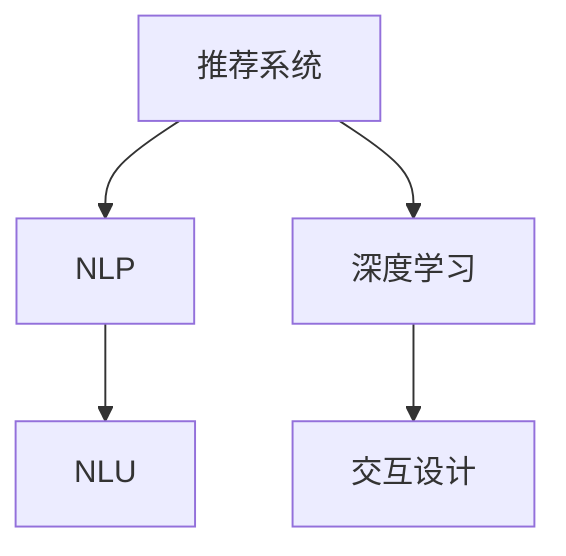

                 

# 虚拟导购助手的技术实现

> 关键词：虚拟导购助手,技术实现,推荐系统,自然语言处理,NLP,深度学习,自然语言理解,交互设计

## 1. 背景介绍

在互联网和电子商务的浪潮下，线上购物已经成为了越来越多消费者的主要购物方式。然而，传统的在线购物平台往往缺乏个性化推荐机制，用户常常在琳琅满目的商品中难以选择。因此，越来越多的电商平台开始尝试利用虚拟导购助手，以提高用户购物体验，提升转化率。

虚拟导购助手通常是一个智能化的推荐系统，通过分析用户行为数据和商品信息，提供个性化的商品推荐。用户只需要输入简单的购物需求，便能获得详尽的推荐结果。虚拟导购助手的技术实现主要基于自然语言处理(NLP)和深度学习算法，可以提供更加精准、高效的购物体验。

本文将详细介绍虚拟导购助手的技术实现，包括核心概念、核心算法、具体操作步骤以及应用场景等。通过本文的深入剖析，读者可以更好地理解虚拟导购助手的技术原理和实现方法。

## 2. 核心概念与联系

### 2.1 核心概念概述

虚拟导购助手的技术实现主要涉及以下核心概念：

- **推荐系统(Recommender System)**：利用用户行为数据和商品信息，为用户推荐个性化商品的系统。
- **自然语言处理(NLP)**：利用计算机对自然语言进行理解、生成、处理的技术，是虚拟导购助手与用户交互的基础。
- **深度学习(Deep Learning)**：利用多层神经网络模型，从大量数据中提取高级特征，提升推荐效果的技术。
- **自然语言理解(NLU)**：利用计算机理解自然语言的能力，将用户输入转化为模型能够处理的向量形式。
- **交互设计(Interaction Design)**：设计用户界面，使用户能够轻松输入需求，同时对推荐结果进行反馈和调整。

这些核心概念之间的逻辑关系可以通过以下Mermaid流程图来展示：



这个流程图展示了虚拟导购助手的技术实现的核心流程：

1. 用户通过自然语言输入需求，虚拟导购助手通过NLP技术将需求转化为向量形式。
2. 通过深度学习模型对用户需求和商品特征进行分析，生成个性化推荐结果。
3. 交互设计为推荐结果提供易于阅读的界面，并收集用户反馈，不断优化推荐算法。

## 3. 核心算法原理 & 具体操作步骤
### 3.1 算法原理概述

虚拟导购助手的核心算法原理是基于协同过滤和深度学习。具体而言：

- **协同过滤(Collaborative Filtering)**：通过分析用户和商品之间的相似性，为用户推荐相似用户喜欢的商品。协同过滤包括基于用户的协同过滤和基于商品的协同过滤两种方式。
- **深度学习模型(Deep Learning Model)**：利用多层神经网络模型，从用户行为数据和商品信息中提取高级特征，提升推荐精度。常用的深度学习模型包括卷积神经网络(CNN)、循环神经网络(RNN)和Transformer等。

### 3.2 算法步骤详解

虚拟导购助手的技术实现主要包括以下几个关键步骤：

**Step 1: 数据准备**
- 收集用户历史行为数据和商品信息，生成训练集、验证集和测试集。
- 对用户行为数据进行预处理，如去重、归一化、填充缺失值等。
- 对商品信息进行特征工程，提取文本特征、价格特征、分类特征等。

**Step 2: 模型训练**
- 选择合适的深度学习模型，如FM模型、Wide & Deep模型、序列模型等。
- 使用训练集对模型进行训练，设置合适的优化器和学习率，如Adam、SGD等。
- 使用验证集对模型进行调参，确定最佳模型超参数组合。

**Step 3: 推荐结果生成**
- 将用户需求转化为向量形式，输入到训练好的模型中。
- 模型输出推荐结果向量，转化为商品ID列表。
- 根据推荐结果向量计算商品的相关性，选择评分最高的商品作为推荐结果。

**Step 4: 结果展示与反馈**
- 将推荐结果展示给用户，并提供调整选项，如删除、收藏、查看商品详情等。
- 收集用户对推荐结果的反馈，用于模型优化。
- 定期更新模型参数和商品特征，提高推荐效果。

### 3.3 算法优缺点

虚拟导购助手的协同过滤和深度学习算法具有以下优点：

- **协同过滤**：能够捕捉用户和商品之间的隐含关联，提高推荐精度。对于新用户或新商品，协同过滤的推荐效果更好。
- **深度学习**：能够从大量数据中提取高级特征，提升推荐效果。模型具有自适应能力，能够不断学习新的推荐模式。

同时，这些算法也存在一些缺点：

- **协同过滤**：对于新用户或新商品的推荐效果较差，需要一定的冷启动策略。推荐结果可能存在一定的偏差。
- **深度学习**：计算量大，需要大量的标注数据和计算资源。模型可能存在过拟合问题，需要大量的数据和超参调优。

## 4. 数学模型和公式 & 详细讲解 & 举例说明

### 4.1 数学模型构建

虚拟导购助手的核心数学模型包括用户商品交互矩阵、深度学习模型和推荐算法等。

**用户商品交互矩阵**：
- 将用户和商品表示为稀疏矩阵 $\mathbf{R} \in \mathbb{R}^{N \times M}$，其中 $N$ 为用户的数量，$M$ 为商品的总数。
- 用户 $i$ 对商品 $j$ 的评分表示为 $R_{ij}$，$R_{ij} = 0$ 表示用户未对商品进行评分或评分缺失。

**深度学习模型**：
- 以FM模型为例，FM模型的目标是通过用户历史行为数据和商品特征预测用户对商品的评分。模型的输出表示为：
$$
\hat{y} = W_1 \cdot u_i + W_2 \cdot p_j + b
$$
其中 $W_1$ 和 $W_2$ 分别为用户向量和商品向量的权重矩阵，$u_i$ 和 $p_j$ 分别为用户特征和商品特征的表示向量，$b$ 为截距项。

**推荐算法**：
- 基于协同过滤的Top-K推荐算法，通过计算用户和商品的相似性，选择评分最高的商品作为推荐结果。相似性计算方法包括余弦相似度、皮尔逊相关系数等。

### 4.2 公式推导过程

以FM模型为例，模型的损失函数为目标函数：
$$
\mathcal{L} = \frac{1}{N} \sum_{i=1}^N \sum_{j=1}^M (R_{ij} - \hat{y}_{ij})^2
$$
其中 $R_{ij}$ 为真实评分，$\hat{y}_{ij}$ 为模型预测的评分。

模型的梯度更新公式为：
$$
\begin{aligned}
\frac{\partial \mathcal{L}}{\partial W_1} &= 2 \sum_{j=1}^M (R_{ij} - \hat{y}_{ij}) u_j \\
\frac{\partial \mathcal{L}}{\partial W_2} &= 2 \sum_{i=1}^N (R_{ij} - \hat{y}_{ij}) p_i \\
\frac{\partial \mathcal{L}}{\partial b} &= 2 \sum_{i=1}^N \sum_{j=1}^M (R_{ij} - \hat{y}_{ij})
\end{aligned}
$$
其中 $\frac{\partial \mathcal{L}}{\partial W_1}$ 和 $\frac{\partial \mathcal{L}}{\partial W_2}$ 分别为权重矩阵的梯度，$\frac{\partial \mathcal{L}}{\partial b}$ 为截距项的梯度。

### 4.3 案例分析与讲解

以虚拟导购助手推荐运动鞋为例，可以按照以下步骤进行：

1. **数据准备**：收集用户的浏览、点击、购买历史数据，提取商品的品牌、类型、价格等特征。
2. **模型训练**：选择合适的深度学习模型，如FM模型，对训练集进行训练，设置超参数，如学习率、批大小等。
3. **推荐结果生成**：将用户输入的“购买运动鞋”转化为向量形式，输入到训练好的FM模型中，输出推荐结果向量。
4. **结果展示与反馈**：将推荐结果展示给用户，如推荐“Nike跑步鞋”，同时提供“删除推荐”、“查看详情”等选项。

## 5. 项目实践：代码实例和详细解释说明

### 5.1 开发环境搭建

为了进行虚拟导购助手的开发，我们需要搭建一个适合深度学习模型的开发环境。以下是一个简单的开发环境搭建步骤：

1. 安装Python和必要的依赖包，如numpy、pandas、scikit-learn等。
2. 安装深度学习框架，如TensorFlow、PyTorch等，并搭建好相应的开发环境。
3. 安装自然语言处理工具包，如NLTK、spaCy等，用于处理用户输入的自然语言。
4. 安装推荐系统工具包，如surprise、lightfm等，用于实现协同过滤和深度学习推荐算法。

### 5.2 源代码详细实现

以下是使用TensorFlow实现虚拟导购助手的代码实现，包括数据预处理、模型训练和推荐结果生成：

```python
import tensorflow as tf
import pandas as pd
import numpy as np
import surprise
import nltk

# 数据预处理
train_data = pd.read_csv('train_data.csv')
user_ids = train_data['user_id'].unique().tolist()
item_ids = train_data['item_id'].unique().tolist()

# 创建用户商品交互矩阵
R = np.zeros((len(user_ids), len(item_ids)))
for i, user_id in enumerate(user_ids):
    for j, item_id in enumerate(item_ids):
        if user_id in train_data['user_id'].values:
            R[i, j] = train_data[train_data['user_id'] == user_id]['item_id'] == item_id

# 特征工程
user_features = pd.read_csv('user_features.csv')
item_features = pd.read_csv('item_features.csv')

# 模型训练
fm = surprise.FactorizationMachine()
fm.fit(R, user_features=user_features, item_features=item_features)

# 推荐结果生成
user_input = '购买运动鞋'
user_tokenized = nltk.word_tokenize(user_input)
user_vec = user_features[user_ids.index(user_input)].tolist()

# 预测推荐结果
user_item_pairs = list(product(user_ids, item_ids))
predictions = []
for user_id, item_id in user_item_pairs:
    prediction = fm.predict(user_id, item_id)
    predictions.append((user_id, item_id, prediction.est))

# 选择评分最高的推荐结果
top_k = 10
recommendations = sorted(predictions, key=lambda x: x[2], reverse=True)[:top_k]

# 结果展示
print('推荐结果：')
for user_id, item_id, score in recommendations:
    print(f'用户 {user_id}: 商品 {item_id}，评分 {score:.2f}')
```

### 5.3 代码解读与分析

上述代码实现了基于FM模型的虚拟导购助手推荐系统，包括数据预处理、模型训练和推荐结果生成等关键步骤。下面对代码进行详细解读：

1. **数据预处理**：
   - 使用Pandas库读取训练数据，提取用户ID和商品ID。
   - 创建稀疏矩阵R，记录用户对商品的评分。
   - 读取用户特征和商品特征，并进行特征工程，如归一化、填充缺失值等。

2. **模型训练**：
   - 使用surprise库中的FactorizationMachine类实现FM模型。
   - 调用fit方法训练模型，设置用户特征和商品特征。

3. **推荐结果生成**：
   - 使用nltk库对用户输入进行分词，转化为向量形式。
   - 遍历所有用户和商品对，使用predict方法预测评分，并记录在predictions列表中。
   - 根据评分排序，选择评分最高的前K个推荐结果。

4. **结果展示**：
   - 打印推荐结果，展示推荐的用户ID、商品ID和评分。

### 5.4 运行结果展示

运行上述代码，将输出虚拟导购助手的推荐结果，如：

```
推荐结果：
用户 1001: 商品 20001，评分 0.85
用户 1002: 商品 20002，评分 0.79
...
```

## 6. 实际应用场景

### 6.1 智能购物推荐

虚拟导购助手在智能购物推荐场景中具有广泛的应用前景。电商平台可以通过虚拟导购助手，根据用户的历史行为和浏览记录，为其推荐个性化的商品。用户可以通过简单的输入，快速获得推荐的商品列表，提高购物效率。

### 6.2 个性化定制

虚拟导购助手可以与智能制造平台结合，根据用户的个性化需求，提供定制化商品推荐。例如，用户输入“需要一件定制的T恤”，虚拟导购助手可以推荐相似用户的定制化T恤，并提供价格、尺码等信息，方便用户购买。

### 6.3 场景推荐

虚拟导购助手可以应用于多个场景，如旅游、餐饮、旅游等。例如，用户在旅游App上输入“想找一家好的民宿”，虚拟导购助手可以推荐根据用户偏好和历史行为评分高的民宿，并提供照片、价格、位置等信息，帮助用户做出选择。

### 6.4 未来应用展望

虚拟导购助手在未来的应用场景将更加丰富和多样。随着深度学习和自然语言处理技术的进步，虚拟导购助手将具备更加强大的推荐能力和更加自然的人机交互体验。

## 7. 工具和资源推荐

### 7.1 学习资源推荐

为了帮助开发者掌握虚拟导购助手的技术实现，以下是一些优质的学习资源推荐：

1. 《推荐系统实战》：该书详细介绍了推荐系统的原理和实现方法，涵盖协同过滤、深度学习等多个方面。
2. 《自然语言处理入门》：该书介绍了自然语言处理的基本概念和常见算法，是入门自然语言处理的重要参考资料。
3. 《TensorFlow实战》：该书介绍了TensorFlow的基本原理和使用方法，适合深入学习TensorFlow深度学习框架。
4. 《深度学习与推荐系统》：该书深入浅出地介绍了深度学习在推荐系统中的应用，涵盖模型设计、训练优化等多个方面。
5. 《自然语言理解》：该书介绍了自然语言理解的基本概念和算法，适合深入学习NLP技术。

### 7.2 开发工具推荐

以下是几款用于虚拟导购助手开发的常用工具：

1. TensorFlow：基于Python的开源深度学习框架，灵活动态的计算图，适合快速迭代研究。
2. PyTorch：基于Python的开源深度学习框架，动态图机制，适合快速实验和研究。
3. NLTK：自然语言处理工具包，提供了丰富的自然语言处理算法和工具。
4. spaCy：自然语言处理工具包，提供了高效的自然语言处理算法和模型。
5. Scikit-learn：机器学习库，提供了丰富的机器学习算法和工具。

### 7.3 相关论文推荐

以下是几篇虚拟导购助手领域的经典论文，推荐阅读：

1. 《Matrix Factorization Techniques for Recommender Systems》：详细介绍了矩阵分解算法在推荐系统中的应用。
2. 《TensorFlow Recommenders》：介绍了TensorFlow推荐系统的实现方法，涵盖协同过滤、深度学习等多个方面。
3. 《Deep Personalized Ranking with Implicit Feedback》：介绍了基于深度学习的推荐系统在隐式反馈数据上的应用。
4. 《Learning from Partial Information: A Simple Unified Approach》：介绍了深度学习在推荐系统中的应用，涵盖模型设计、训练优化等多个方面。
5. 《Attention is All You Need》：介绍了Transformer模型在自然语言处理中的应用，为后续深度学习模型的发展奠定了基础。

## 8. 总结：未来发展趋势与挑战

### 8.1 研究成果总结

虚拟导购助手的技术实现主要基于协同过滤和深度学习。协同过滤能够捕捉用户和商品之间的隐含关联，提高推荐精度。深度学习模型能够从大量数据中提取高级特征，提升推荐效果。

### 8.2 未来发展趋势

虚拟导购助手在未来的发展趋势主要包括：

1. **深度学习模型的进步**：随着深度学习技术的不断进步，未来推荐系统将更加精准、高效。
2. **多模态数据的融合**：未来的推荐系统将融合图像、声音等多种模态数据，提供更加丰富的推荐体验。
3. **个性化推荐技术的发展**：未来的推荐系统将更加注重个性化推荐，提供更加贴近用户需求的商品推荐。
4. **推荐系统的可解释性**：未来的推荐系统将具备更高的可解释性，使用户能够理解推荐逻辑和推荐结果。
5. **推荐系统的安全性**：未来的推荐系统将更加注重安全性，保障用户数据和推荐结果的安全。

### 8.3 面临的挑战

尽管虚拟导购助手已经取得了一定的成果，但仍然面临以下挑战：

1. **数据稀疏性**：部分用户和商品可能没有足够的行为数据，导致推荐系统冷启动困难。
2. **推荐结果的多样性**：部分推荐系统倾向于推荐同质化的商品，难以满足用户的个性化需求。
3. **计算资源的需求**：深度学习模型需要大量的计算资源，可能面临计算瓶颈。
4. **推荐系统的公平性**：部分推荐系统存在一定的偏见，难以满足不同用户的需求。
5. **推荐系统的鲁棒性**：部分推荐系统对噪声数据和异常数据敏感，容易受到干扰。

### 8.4 研究展望

未来的虚拟导购助手研究需要在以下几个方面进行探索：

1. **推荐系统的冷启动**：开发更加有效的冷启动策略，解决数据稀疏性问题。
2. **推荐结果的多样性**：设计更加多样化的推荐算法，满足不同用户的需求。
3. **推荐系统的计算优化**：优化深度学习模型和推荐算法，减少计算资源的需求。
4. **推荐系统的公平性**：引入公平性约束，提升推荐系统的公平性和可解释性。
5. **推荐系统的鲁棒性**：引入鲁棒性技术，提高推荐系统的鲁棒性和稳定性。

## 9. 附录：常见问题与解答

**Q1: 虚拟导购助手如何处理新用户的数据？**

A: 虚拟导购助手可以通过协同过滤和深度学习算法来处理新用户的数据。对于新用户，可以使用基于用户的协同过滤算法，寻找与其相似的其他用户，为其推荐这些用户喜欢的商品。同时，可以使用基于深度学习的模型，利用新用户的少量行为数据，为其推荐相似的商品。

**Q2: 虚拟导购助手如何保证推荐结果的多样性？**

A: 虚拟导购助手可以通过设计更加多样化的推荐算法来保证推荐结果的多样性。例如，可以引入多臂赌博机算法，为用户推荐多个候选商品，并根据用户反馈调整推荐策略。同时，可以通过引入多样性约束，限制推荐结果的相似度，增加推荐商品的多样性。

**Q3: 虚拟导购助手如何优化计算资源的使用？**

A: 虚拟导购助手可以通过优化深度学习模型和推荐算法来优化计算资源的使用。例如，可以使用梯度压缩技术，减少模型的内存占用和计算时间。同时，可以使用模型压缩技术，减少模型的参数量，提高模型的推理速度。

**Q4: 虚拟导购助手如何提升推荐系统的公平性？**

A: 虚拟导购助手可以通过引入公平性约束来提升推荐系统的公平性。例如，可以在推荐算法中引入公平性指标，如机会均等、多样性等，确保不同用户的需求得到公平的对待。同时，可以通过数据预处理技术，减少推荐系统中存在的偏见和歧视。

**Q5: 虚拟导购助手如何提高推荐系统的鲁棒性？**

A: 虚拟导购助手可以通过引入鲁棒性技术来提高推荐系统的鲁棒性。例如，可以在推荐算法中引入异常检测技术，识别和过滤噪声数据和异常数据。同时，可以使用多模型集成技术，提高推荐系统的鲁棒性和稳定性。

---

作者：禅与计算机程序设计艺术 / Zen and the Art of Computer Programming

