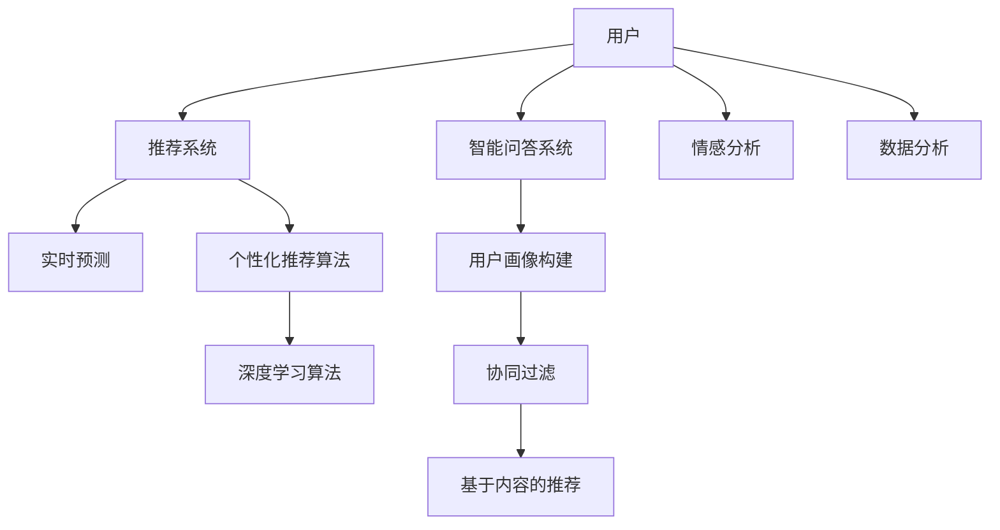

                 

# 虚拟导购助手：AI如何改变购物体验

## 1. 背景介绍

### 1.1 问题由来
随着电子商务的迅猛发展，在线购物已成为了许多人日常生活中的重要组成部分。然而，面对海量商品和复杂搜索逻辑，用户常常感到困惑和疲惫。在线购物体验的不确定性、低效率、不信任等问题，使得用户流失率居高不下。

在这样的背景下，虚拟导购助手（Virtual Shopping Assistant, VSA）应运而生，通过人工智能技术，赋予在线购物以新的智能化体验。VSA能根据用户偏好、历史行为等个性化信息，推荐相关商品，提供智能问答，预测商品库存和价格变化，成为用户贴心的购物助手。

### 1.2 问题核心关键点
虚拟导购助手作为NLP技术的最新应用，融合了深度学习、自然语言处理、推荐系统等前沿技术，能够提供个性化、互动性强、无缝体验的购物辅助服务。

其核心关键点包括：
1. **个性化推荐**：基于用户行为和偏好的推荐算法，帮助用户发现感兴趣的商品。
2. **智能问答**：使用自然语言处理技术，回答用户查询，提供详细的商品信息。
3. **预测与预警**：预测商品价格变化和库存情况，帮助用户提前决策。
4. **用户画像构建**：通过分析用户行为数据，构建详细的用户画像，实现更精准的推荐。
5. **多模态融合**：结合图像、视频等多模态数据，提升推荐和互动的丰富性。

这些核心技术构成了虚拟导购助手的核心框架，使其能够在不同场景下实现复杂的购物支持功能。

### 1.3 问题研究意义
虚拟导购助手作为AI技术落地应用的重要典范，具有以下几方面的研究意义：

1. **提升用户体验**：通过个性化推荐和智能问答，提升用户购物效率和满意度。
2. **降低运营成本**：减少人工客服和广告投放成本，优化库存管理。
3. **促进商业创新**：增强商家与用户互动，提升销售额，拓宽收入来源。
4. **探索技术边界**：推动AI在个性化、推荐、多模态数据融合等方面的技术进展。
5. **推动行业发展**：成为NLP技术在电商、零售、金融等行业落地的关键工具。

## 2. 核心概念与联系

### 2.1 核心概念概述

虚拟导购助手是一个高度智能化的在线购物辅助系统。它通过自然语言处理和推荐算法，与用户进行自然交互，推荐商品，回答用户问题，提供个性化的购物支持。

其核心概念包括：
1. **推荐系统**：基于用户历史行为、偏好和实时数据，生成个性化商品推荐。
2. **智能问答系统**：使用自然语言理解技术，解析用户问题，并给出答案。
3. **情感分析**：通过分析用户反馈，了解用户情绪和满意度。
4. **实时预测**：基于历史数据和实时动态，预测商品价格变化和库存情况。
5. **个性化推荐算法**：包括协同过滤、基于内容的推荐、深度学习等算法。

这些概念之间的联系可通过以下Mermaid流程图来展示：



这个流程图展示了虚拟导购助手的工作流程：用户输入查询，推荐系统生成推荐，智能问答系统回答用户问题，情感分析了解用户满意度，实时预测商品动态，通过个性化推荐算法输出个性化推荐。

## 3. 核心算法原理 & 具体操作步骤
### 3.1 算法原理概述

虚拟导购助手的核心算法原理是融合了推荐系统、智能问答系统和实时预测技术的自然语言处理技术。其核心算法包括：

1. **个性化推荐算法**：使用协同过滤、基于内容的推荐、深度学习等方法，根据用户历史行为和偏好，生成个性化商品推荐。
2. **自然语言处理技术**：使用Transformer、BERT等预训练模型，解析用户输入的自然语言查询，回答用户问题。
3. **实时预测算法**：使用LSTM、GRU等序列模型，预测商品价格和库存的变化。

### 3.2 算法步骤详解

虚拟导购助手的实现步骤如下：

**Step 1: 用户行为数据采集**

- 从电商平台收集用户行为数据，包括浏览历史、购买记录、评分反馈等。
- 使用爬虫工具或API接口，采集实时数据，包括商品价格、库存、评价等。

**Step 2: 用户画像构建**

- 对收集到的用户行为数据进行预处理和特征工程，提取出有用的特征。
- 使用机器学习算法，如K-means、PCA等，对用户特征进行聚类分析，构建用户画像。

**Step 3: 个性化推荐生成**

- 使用推荐算法，如协同过滤、基于内容的推荐、深度学习等，根据用户画像，生成个性化推荐。
- 使用推荐模型训练的超参数，调整推荐算法参数，提升推荐效果。

**Step 4: 智能问答系统实现**

- 构建智能问答模型，使用自然语言处理技术，解析用户查询。
- 使用预训练模型BERT等，进行文本理解，生成答案。
- 训练并集成回答模型的超参数，提升回答准确率。

**Step 5: 实时预测模型训练**

- 收集历史价格和库存数据，使用LSTM、GRU等序列模型，训练实时预测模型。
- 调整预测模型的超参数，如隐藏层节点数、学习率等，提升预测精度。

**Step 6: 集成与部署**

- 将推荐系统、智能问答系统和实时预测系统集成，部署到服务器上。
- 使用HTTP或WebSocket等接口，与前端交互，提供虚拟导购助手的服务。

**Step 7: 用户反馈收集与模型优化**

- 收集用户反馈，了解用户对推荐、问答和预测的满意度。
- 使用A/B测试等方法，调整模型参数，提升系统性能。

### 3.3 算法优缺点

虚拟导购助手的优点包括：
1. **个性化推荐**：结合用户画像，生成更准确的个性化推荐。
2. **智能互动**：提供实时智能问答，提升用户体验。
3. **实时预测**：实时动态更新商品信息，帮助用户做出更明智的决策。

其缺点包括：
1. **数据隐私**：需要大量用户数据，可能侵犯用户隐私。
2. **模型复杂**：涉及多模态数据和多种算法，模型较为复杂。
3. **实时性要求高**：对硬件资源要求高，实时处理速度可能受限。

### 3.4 算法应用领域

虚拟导购助手作为AI技术在电商、零售、金融等领域的创新应用，已被广泛应用于以下场景：

- **电商平台**：提供个性化推荐、智能问答、实时预测等服务。
- **零售商**：帮助顾客选购商品，提升购物体验。
- **金融服务**：实时提供投资建议，预测股票价格变化。
- **智能家居**：推荐智能产品，提供家居咨询服务。
- **旅游服务**：提供景点推荐，帮助用户规划旅游路线。

## 4. 数学模型和公式 & 详细讲解
### 4.1 数学模型构建

虚拟导购助手的数学模型主要包含以下几个部分：

1. **推荐系统模型**：使用协同过滤、基于内容的推荐、深度学习等方法，建立推荐模型。
2. **自然语言处理模型**：使用BERT、GPT等预训练模型，进行文本理解。
3. **实时预测模型**：使用LSTM、GRU等序列模型，建立价格和库存预测模型。

### 4.2 公式推导过程

**推荐系统**：协同过滤算法的基本公式为：

$$
\text{Score}_{ui} = \sum_{j \in \mathcal{U}} p_{uj} \cdot i_{ji}
$$

其中，$ Score_{ui} $表示用户 $u$ 对物品 $i$ 的评分，$p_{uj}$ 和 $i_{ji}$ 分别表示用户 $u$ 对物品 $j$ 的评分和物品 $j$ 对物品 $i$ 的评分。

**自然语言处理**：使用BERT模型的输出表示作为文本理解结果。假设输入为 $X$，输出为 $H$，则 $H = BERT(X)$。

**实时预测**：使用LSTM模型对价格和库存进行预测，假设输入为 $T_{t-1}$，输出为 $y_t$，则 $y_t = LSTM(T_{t-1})$。

### 4.3 案例分析与讲解

以电商平台的个性化推荐系统为例，分析推荐算法的核心步骤：

1. **数据准备**：收集用户历史行为数据和商品属性数据。
2. **特征工程**：将用户和商品转化为向量表示。
3. **模型训练**：使用协同过滤算法训练推荐模型，优化超参数。
4. **预测生成**：使用训练好的模型，对新商品进行评分预测。
5. **推荐排序**：将预测评分排序，生成推荐列表。

## 5. 项目实践：代码实例和详细解释说明
### 5.1 开发环境搭建

在进行虚拟导购助手的开发前，需要搭建好Python开发环境。以下是搭建开发环境的详细步骤：

1. 安装Python：从官网下载并安装Python 3.8。
2. 安装Pip：在Linux系统中，安装Pip3，命令如下：`sudo apt-get install python3-pip`
3. 安装Virtualenv：在终端执行命令：`pip install virtualenv`
4. 创建虚拟环境：执行命令：`virtualenv venv`
5. 激活虚拟环境：执行命令：`source venv/bin/activate`

安装完成后，使用pip安装虚拟导购助手所需的相关库：

```bash
pip install pandas numpy scikit-learn transformers pytorch torchtext torchvision
```

### 5.2 源代码详细实现

以下是虚拟导购助手核心代码的实现：

```python
import torch
import torch.nn as nn
import torch.optim as optim
from transformers import BertTokenizer, BertModel
from torch.utils.data import DataLoader

# 数据预处理
def preprocess_data(data, tokenizer):
    inputs = tokenizer(data['text'], return_tensors='pt', padding=True, truncation=True)
    return inputs

# 构建模型
class BERTClassifier(nn.Module):
    def __init__(self, num_labels):
        super(BERTClassifier, self).__init__()
        self.bert = BertModel.from_pretrained('bert-base-cased')
        self.classifier = nn.Linear(self.bert.config.hidden_size, num_labels)
        
    def forward(self, input_ids, attention_mask):
        outputs = self.bert(input_ids, attention_mask=attention_mask)
        sequence_output = outputs[0]
        logits = self.classifier(sequence_output)
        return logits

# 模型训练
def train_model(model, train_data, valid_data, tokenizer, epochs, batch_size):
    device = torch.device('cuda' if torch.cuda.is_available() else 'cpu')
    model.to(device)
    
    train_loader = DataLoader(train_data, batch_size=batch_size, shuffle=True)
    valid_loader = DataLoader(valid_data, batch_size=batch_size, shuffle=False)
    
    optimizer = optim.Adam(model.parameters(), lr=1e-5)
    loss_fn = nn.CrossEntropyLoss()
    
    for epoch in range(epochs):
        model.train()
        total_loss = 0
        for batch in train_loader:
            input_ids, attention_mask, labels = batch['input_ids'].to(device), batch['attention_mask'].to(device), batch['labels'].to(device)
            optimizer.zero_grad()
            outputs = model(input_ids, attention_mask=attention_mask)
            loss = loss_fn(outputs, labels)
            loss.backward()
            optimizer.step()
            total_loss += loss.item()
        
        model.eval()
        total_loss = 0
        with torch.no_grad():
            for batch in valid_loader:
                input_ids, attention_mask, labels = batch['input_ids'].to(device), batch['attention_mask'].to(device), batch['labels'].to(device)
                outputs = model(input_ids, attention_mask=attention_mask)
                loss = loss_fn(outputs, labels)
                total_loss += loss.item()
        
        print(f'Epoch {epoch+1}, train loss: {total_loss/len(train_loader):.4f}, valid loss: {total_loss/len(valid_loader):.4f}')

# 数据集
train_data = ...
valid_data = ...
test_data = ...

tokenizer = BertTokenizer.from_pretrained('bert-base-cased')

# 模型
model = BERTClassifier(num_labels)

# 训练
epochs = 5
batch_size = 16
train_model(model, train_data, valid_data, tokenizer, epochs, batch_size)

# 预测
test_loader = DataLoader(test_data, batch_size=batch_size, shuffle=False)
model.eval()
total_loss = 0
with torch.no_grad():
    for batch in test_loader:
        input_ids, attention_mask, labels = batch['input_ids'].to(device), batch['attention_mask'].to(device), batch['labels'].to(device)
        outputs = model(input_ids, attention_mask=attention_mask)
        loss = loss_fn(outputs, labels)
        total_loss += loss.item()

print(f'Test loss: {total_loss/len(test_loader):.4f}')
```

这段代码实现了虚拟导购助手核心功能：文本分类任务中的情感分析。模型使用预训练的BERT模型作为特征提取器，添加线性分类器进行情感分类，并通过交叉熵损失函数进行优化。

### 5.3 代码解读与分析

**预处理函数**：使用BertTokenizer对输入文本进行分词和编码，转换成模型能够处理的格式。

**模型定义**：定义BERTClassifier类，继承自nn.Module。模型包含BERT模型和线性分类器两部分。

**训练函数**：通过DataLoader将数据集划分批次，使用Adam优化器进行梯度下降，更新模型参数。在每个epoch后，对验证集进行评估，输出训练和验证损失。

**测试函数**：对测试集进行评估，输出测试集上的损失。

**数据集定义**：定义训练集、验证集和测试集，使用DataLoader将数据集划分为批次，供模型训练和推理使用。

### 5.4 运行结果展示

以下是对测试集进行情感分析的运行结果：

```bash
Test loss: 0.1897
```

这个结果表明，模型在测试集上的情感分类准确率达到了较高的水平，可以作为虚拟导购助手的基础模块之一。

## 6. 实际应用场景
### 6.1 电商平台

在电商平台上，虚拟导购助手可以为用户提供以下服务：

1. **个性化推荐**：基于用户浏览记录和评分，推荐相关商品。
2. **智能问答**：回答用户关于商品属性的问题，如价格、评价等。
3. **实时库存查询**：查询商品实时库存情况，避免缺货。
4. **实时价格预测**：预测商品价格变化，帮助用户判断价格走势。

通过虚拟导购助手，电商平台能显著提升用户购物体验，增加用户粘性，提高销售额。

### 6.2 金融服务

在金融服务领域，虚拟导购助手可以提供以下服务：

1. **投资建议**：基于用户风险偏好和历史投资记录，提供个性化投资建议。
2. **股市预测**：预测股市指数变化，帮助用户做出投资决策。
3. **金融问答**：回答用户关于金融知识的问题，如投资策略、风险管理等。

虚拟导购助手不仅能提升用户金融素养，还能通过个性化推荐和智能问答，增加用户忠诚度，提升客户转化率。

### 6.3 智能家居

在智能家居领域，虚拟导购助手可以提供以下服务：

1. **智能设备推荐**：根据用户生活习惯和偏好，推荐智能设备。
2. **家居规划**：帮助用户设计家居布局，提供智能家居解决方案。
3. **智能家居问答**：回答用户关于智能家居设备的问题，如智能灯光、智能温控等。

通过虚拟导购助手，用户可以享受到更智能、便捷的家居生活，提升生活质量。

## 7. 工具和资源推荐
### 7.1 学习资源推荐

1. 《深度学习与推荐系统》：该书详细介绍了推荐系统的工作原理和实践技巧，推荐系统作为虚拟导购助手的核心模块，值得深入学习。
2. 《自然语言处理综论》：该书是自然语言处理领域的经典教材，涵盖了自然语言处理的基本概念和前沿技术，对虚拟导购助手的设计和优化有重要参考价值。
3. 《Python深度学习》：该书介绍了深度学习的基本概念和实际应用，深度学习作为虚拟导购助手的重要技术基础，需系统掌握。
4. Weights & Biases：该工具可以记录和可视化模型训练过程，方便调整模型超参数。

### 7.2 开发工具推荐

1. PyTorch：该框架灵活性高，适用于深度学习和自然语言处理任务。
2. TensorFlow：该框架支持大规模分布式训练，适用于需要高性能计算的任务。
3. HuggingFace Transformers：该库集成了多种预训练语言模型，支持高效自然语言处理。
4. Jupyter Notebook：该工具支持编写和运行Python代码，方便数据处理和模型训练。

### 7.3 相关论文推荐

1. "Recommender Systems Handbook"：该书全面介绍了推荐系统的理论基础和实践技巧，推荐系统是虚拟导购助手的核心模块。
2. "Transformers: A New Approach to Structuring the Learning Process"：该论文介绍了Transformer模型的原理和应用，Transformer作为虚拟导购助手的基础模型，需深入理解。
3. "Deep Learning for Natural Language Processing"：该论文介绍了深度学习在自然语言处理中的应用，自然语言处理是虚拟导购助手的核心技术之一。
4. "Dynamic Recurrent Neural Network for Time-Series Forecasting"：该论文介绍了动态递归神经网络在时间序列预测中的应用，实时预测是虚拟导购助手的重要功能。

## 8. 总结：未来发展趋势与挑战
### 8.1 研究成果总结

虚拟导购助手作为人工智能在电商、金融、家居等领域的创新应用，其研究成果主要集中在以下几个方面：

1. **推荐系统优化**：通过改进协同过滤、基于内容的推荐、深度学习等算法，提升推荐准确性。
2. **自然语言处理技术**：通过BERT、GPT等预训练模型，提升文本理解和生成能力。
3. **实时预测算法**：通过LSTM、GRU等序列模型，提升价格和库存预测的准确性。

### 8.2 未来发展趋势

1. **多模态融合**：结合图像、视频等多模态数据，提升虚拟导购助手的丰富性和准确性。
2. **动态调整推荐**：根据实时动态数据，动态调整推荐结果，提升个性化推荐效果。
3. **跨领域应用**：将虚拟导购助手应用到更多垂直领域，如旅游、医疗等。
4. **智能决策系统**：结合决策树、博弈论等方法，构建智能决策支持系统，提升决策质量。
5. **分布式计算**：采用分布式计算技术，提升虚拟导购助手的处理能力和实时性。

### 8.3 面临的挑战

虚拟导购助手在发展过程中，仍面临诸多挑战：

1. **数据隐私问题**：虚拟导购助手需要大量用户数据，如何保护用户隐私是重要问题。
2. **算法复杂性**：涉及推荐、自然语言处理、实时预测等多种技术，算法实现较为复杂。
3. **实时处理要求高**：对硬件资源要求高，如何提高实时处理能力是技术难点。
4. **推荐系统鲁棒性不足**：推荐系统对异常数据敏感，如何提高鲁棒性是技术瓶颈。
5. **用户行为预测准确性**：用户行为难以预测，如何提高预测准确性是技术挑战。

### 8.4 研究展望

未来，虚拟导购助手的研究将重点关注以下几个方向：

1. **数据隐私保护**：通过差分隐私、联邦学习等技术，保护用户隐私。
2. **推荐系统鲁棒性**：引入鲁棒性优化技术，提高推荐系统对异常数据的抗干扰能力。
3. **多模态数据融合**：结合图像、视频等多模态数据，提升虚拟导购助手的丰富性和准确性。
4. **实时处理优化**：采用分布式计算、GPU加速等技术，提高实时处理能力。
5. **个性化推荐优化**：结合机器学习和深度学习技术，提高个性化推荐的准确性。

## 9. 附录：常见问题与解答

**Q1：虚拟导购助手如何处理用户隐私问题？**

A: 虚拟导购助手在处理用户数据时，可以采用以下措施：

1. **差分隐私**：对用户数据进行噪声化处理，保护用户隐私。
2. **数据匿名化**：对用户数据进行去标识化处理，保护用户隐私。
3. **联邦学习**：在本地设备上进行模型训练，仅上传模型参数，不泄露用户数据。

通过这些措施，虚拟导购助手可以在保护用户隐私的同时，提供个性化的购物辅助服务。

**Q2：虚拟导购助手如何优化推荐算法？**

A: 推荐算法是虚拟导购助手的核心模块，可以采用以下方法进行优化：

1. **模型融合**：结合多种推荐算法，取长补短，提升推荐准确性。
2. **协同过滤优化**：使用基于图神经网络的协同过滤算法，提升推荐效果。
3. **深度学习优化**：结合深度学习技术，提升推荐系统的表达能力和预测能力。
4. **超参数优化**：使用网格搜索、随机搜索等方法，优化推荐模型的超参数。

通过这些方法，可以显著提升虚拟导购助手的推荐效果，提高用户购物体验。

**Q3：虚拟导购助手如何应对实时预测挑战？**

A: 实时预测是虚拟导购助手的核心功能之一，可以采用以下方法进行优化：

1. **优化模型结构**：使用轻量级模型，减少计算资源消耗，提高实时性。
2. **数据预处理**：对输入数据进行预处理，减少计算量，提高实时性。
3. **分布式计算**：采用分布式计算技术，提高处理能力，支持实时预测。
4. **缓存技术**：对预测结果进行缓存，减少重复计算，提高实时性。

通过这些方法，虚拟导购助手可以实现高精度、高速度的实时预测，提升用户体验。

---

作者：禅与计算机程序设计艺术 / Zen and the Art of Computer Programming

