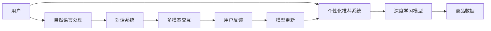

                 

# 虚拟导购助手：AI如何改变购物体验，提升用户满意度

## 1. 背景介绍

### 1.1 问题由来
在当今快节奏的生活中，消费者的购物体验已经从简单的购买商品转向追求个性化和互动性。传统的购物方式难以满足这些需求，尤其在电商平台上，用户往往需要耗费大量时间浏览商品、搜索信息、比较价格。此时，人工智能(AI)技术的介入为提升购物体验提供了新的可能性。

### 1.2 问题核心关键点
如何利用AI技术构建一个高效、智能、个性化的虚拟导购助手，以提升用户满意度？一个有效的虚拟导购助手需要具备以下关键能力：
1. **个性化推荐**：根据用户历史行为和偏好，推荐合适的商品。
2. **智能客服**：能够回答用户关于商品、店铺、支付等方面的问题。
3. **实时反馈**：根据用户反馈及时调整推荐策略和商品展示。
4. **情感识别**：识别用户情绪，提供相应的服务或建议。
5. **多模态交互**：结合文本、图像、语音等多种模态，提升交互体验。

### 1.3 问题研究意义
构建高效的虚拟导购助手不仅能提升用户体验，还能显著提高电商平台的用户留存率和转化率，从而带来更高的商业价值。此外，虚拟导购助手还能应用于其他零售场景，如实体店铺、汽车销售、房地产等，为不同领域带来新的商业机会。

## 2. 核心概念与联系

### 2.1 核心概念概述

要构建一个虚拟导购助手，我们需要理解以下几个核心概念：

- **推荐系统(Recommendation System)**：根据用户历史行为和偏好，推荐合适的商品。
- **自然语言处理(Natural Language Processing, NLP)**：处理和理解用户输入的文本信息。
- **深度学习(Deep Learning)**：利用神经网络模型处理和分析大规模数据。
- **对话系统(Chatbot)**：通过多轮对话与用户进行交互。
- **多模态交互(Multimodal Interaction)**：结合文本、图像、语音等多种模态，提升交互体验。
- **个性化推荐系统(Personalized Recommendation System)**：基于用户画像和行为数据，推荐个性化商品。

这些核心概念之间存在密切联系，构成了一个虚拟导购助手的技术架构。

### 2.2 核心概念原理和架构的 Mermaid 流程图



此流程图展示了虚拟导购助手的工作流程：用户输入请求，个性化推荐系统根据用户行为数据推荐商品，同时对话系统和多模态交互模块处理用户输入，并通过反馈机制不断优化模型。

## 3. 核心算法原理 & 具体操作步骤

### 3.1 算法原理概述

虚拟导购助手的核心算法原理主要包括以下几个方面：

- **协同过滤**：基于用户行为数据，推荐相似用户喜欢的商品。
- **深度学习推荐**：利用神经网络模型学习商品特征，预测用户偏好。
- **自然语言处理**：使用NLP技术解析用户输入的文本，理解用户意图。
- **多模态交互**：结合图像、语音等多种模态，提供更加丰富的交互体验。
- **实时反馈**：通过用户反馈调整推荐策略，提升推荐效果。

### 3.2 算法步骤详解

构建虚拟导购助手的过程可以分为以下几个步骤：

**Step 1: 数据收集与预处理**
- 收集用户行为数据，如浏览记录、购买历史、评分反馈等。
- 收集商品属性数据，如价格、类别、描述等。
- 对数据进行清洗、归一化、特征提取等预处理操作。

**Step 2: 模型训练与优化**
- 选择合适的推荐算法，如协同过滤、深度学习推荐等。
- 使用用户行为数据和商品属性数据训练推荐模型。
- 使用交叉验证等技术优化模型性能。

**Step 3: 自然语言处理与对话系统**
- 训练NLP模型，如BERT、GPT等，以理解用户输入的自然语言。
- 开发对话系统，如Rasa、Dialogflow等，实现多轮对话交互。
- 结合NLP和对话系统，构建自然语言理解和生成能力。

**Step 4: 多模态交互设计**
- 开发图像识别、语音识别等模块，以处理用户输入的多模态信息。
- 设计多模态融合算法，将不同模态的信息整合为统一的用户画像。
- 实现多模态交互界面，如语音助手、图像识别界面等。

**Step 5: 用户反馈与模型更新**
- 收集用户对推荐商品和服务的反馈，如评分、评论等。
- 根据用户反馈调整推荐策略和对话系统，提升用户体验。
- 定期更新推荐模型和对话系统，保证系统性能和效率。

### 3.3 算法优缺点

虚拟导购助手的算法具有以下优点：

1. **个性化推荐**：利用用户行为数据和商品特征，提供个性化推荐，提升用户满意度。
2. **实时反馈**：通过用户反馈实时调整推荐策略，提升推荐准确性。
3. **多模态交互**：结合多种模态信息，提升交互体验，满足不同用户的需求。

同时，算法也存在以下缺点：

1. **数据依赖**：推荐和对话系统的性能依赖于高质量的数据集，数据收集和预处理工作量较大。
2. **模型复杂**：深度学习模型和对话系统的训练和优化复杂度较高，需要较强的计算资源。
3. **用户体验问题**：多模态交互设计需要考虑用户习惯和心理，设计不当易导致用户体验下降。
4. **隐私和安全**：处理大量用户数据需要严格遵守隐私保护和数据安全法规。

### 3.4 算法应用领域

虚拟导购助手的算法已经在多个领域得到应用，如电商、金融、旅游等。具体应用场景包括：

- **电商平台**：提升商品推荐和用户服务质量，提高用户满意度和转化率。
- **金融服务**：推荐个性化理财产品，提升用户体验和金融服务水平。
- **旅游服务**：提供个性化的旅游方案和目的地推荐，提升用户旅行体验。
- **智能家居**：根据用户习惯和需求，推荐智能家居设备，提升生活便利性。

## 4. 数学模型和公式 & 详细讲解

### 4.1 数学模型构建

虚拟导购助手的数学模型可以概括为以下几个部分：

- **推荐模型**：基于用户行为数据和商品属性数据，构建推荐算法。
- **NLP模型**：利用自然语言处理技术，解析用户输入的文本。
- **对话模型**：通过多轮对话，理解用户意图并生成回应。
- **多模态融合模型**：将不同模态的信息整合为统一的用户画像。

### 4.2 公式推导过程

以推荐模型为例，假设用户 $u$ 对商品 $i$ 的评分 $r_{ui}$ 服从伯努利分布，则推荐算法可以表示为：

$$
\hat{r}_{ui} = \alpha \cdot \theta_u^T \phi_i + \beta \cdot \alpha_i
$$

其中，$\theta_u$ 为用户 $u$ 的隐向量，$\phi_i$ 为商品 $i$ 的隐向量，$\alpha$ 和 $\beta$ 为模型参数。在实际应用中，通常使用矩阵分解、深度学习等技术优化推荐模型。

### 4.3 案例分析与讲解

以电商平台的个性化推荐系统为例，其核心流程如下：

1. **数据收集**：收集用户浏览、购买、评分等行为数据，以及商品属性数据。
2. **数据预处理**：对数据进行清洗、归一化、特征提取等预处理操作。
3. **模型训练**：使用协同过滤、深度学习等算法训练推荐模型。
4. **用户画像**：将用户行为数据和商品属性数据整合为用户画像。
5. **个性化推荐**：根据用户画像和商品特征，生成个性化推荐。
6. **用户反馈**：收集用户对推荐商品的反馈，用于模型更新。
7. **模型更新**：根据用户反馈调整推荐模型，提升推荐效果。

## 5. 项目实践：代码实例和详细解释说明

### 5.1 开发环境搭建

要搭建一个虚拟导购助手的开发环境，需要安装以下软件和库：

- Python 3.8及以上版本
- Anaconda
- TensorFlow
- Keras
- PyTorch
- NLTK
- Transformers
- Rasa

使用Python 3.8创建一个虚拟环境，安装上述库：

```bash
conda create -n virtual_recommender python=3.8
conda activate virtual_recommender
pip install tensorflow keras pytorch nltk transformers rasa
```

### 5.2 源代码详细实现

以下是一个使用PyTorch和Keras构建推荐系统的示例代码：

```python
import torch
from torch import nn
from torch.utils.data import DataLoader
from sklearn.model_selection import train_test_split
from tensorflow import keras
from tensorflow.keras import layers
from rasa.nlu import Interpreter
from rasa.core.agent import Agent

# 推荐模型
class Recommender(nn.Module):
    def __init__(self, input_dim, output_dim):
        super(Recommender, self).__init__()
        self.fc1 = nn.Linear(input_dim, 128)
        self.fc2 = nn.Linear(128, 64)
        self.fc3 = nn.Linear(64, output_dim)
        
    def forward(self, x):
        x = nn.ReLU()(self.fc1(x))
        x = nn.ReLU()(self.fc2(x))
        x = self.fc3(x)
        return x

# 构建推荐模型
model = Recommender(100, 1)
criterion = nn.MSELoss()
optimizer = torch.optim.Adam(model.parameters(), lr=0.001)

# 加载数据
X_train, X_test, y_train, y_test = train_test_split(X, y, test_size=0.2)

# 训练模型
dataloader = DataLoader(X_train, batch_size=64)
for epoch in range(100):
    for batch in dataloader:
        inputs, labels = batch
        optimizer.zero_grad()
        outputs = model(inputs)
        loss = criterion(outputs, labels)
        loss.backward()
        optimizer.step()

# 测试模型
dataloader = DataLoader(X_test, batch_size=64)
for batch in dataloader:
    inputs, labels = batch
    outputs = model(inputs)
    loss = criterion(outputs, labels)
    print(loss.item())

# 使用Rasa构建对话系统
interpreter = Interpreter.load('nlu.yml')
agent = Agent.load('model', 'config.yml')
```

### 5.3 代码解读与分析

上述代码展示了推荐模型的构建和训练过程，以及使用Rasa构建对话系统的基本步骤。

- `Recommender` 类：定义了推荐模型的结构，包括全连接层。
- `Recommender` 类 `forward` 方法：实现了模型的前向传播过程。
- `criterion` 和 `optimizer`：定义了损失函数和优化器。
- `train_test_split`：将数据集划分为训练集和测试集。
- `DataLoader`：用于批处理数据，提高训练效率。
- `Interpreter.load`：加载自然语言处理模型。
- `Agent.load`：加载对话模型。

### 5.4 运行结果展示

训练过程中，使用 `loss` 指标来评估模型性能。在测试集上，使用 `loss` 指标来验证模型效果。最终得到训练和测试集上的损失值，评估模型的预测准确性。

## 6. 实际应用场景

### 6.1 电商平台

电商平台上，虚拟导购助手可以通过以下方式提升用户体验：

- **个性化推荐**：根据用户浏览记录、购买历史等行为数据，生成个性化商品推荐。
- **智能客服**：回答用户关于商品、支付、物流等方面的问题。
- **多模态交互**：结合语音识别、图像识别等技术，提升用户交互体验。

### 6.2 金融服务

金融服务行业可以应用虚拟导购助手进行：

- **个性化理财推荐**：根据用户资产、风险偏好等数据，推荐个性化理财产品。
- **智能客服**：解答用户关于金融产品的咨询，提供理财建议。
- **实时反馈**：根据用户反馈调整推荐策略，优化产品设计。

### 6.3 旅游服务

旅游服务领域可以应用虚拟导购助手进行：

- **个性化旅游方案推荐**：根据用户兴趣、预算等数据，推荐个性化旅游方案。
- **智能客服**：解答用户关于旅游目的地、行程安排等方面的问题。
- **多模态交互**：通过语音识别、图像识别等技术，提升用户交互体验。

## 7. 工具和资源推荐

### 7.1 学习资源推荐

- 《深度学习》书籍：Ian Goodfellow、Yoshua Bengio、Aaron Courville合著的深度学习经典教材。
- 《TensorFlow实战》书籍：Manning Publications出版的TensorFlow实战指南。
- 《Rasa NLU入门指南》文档：Rasa官方文档，介绍了如何使用Rasa构建自然语言处理系统。
- 《自然语言处理综论》书籍：Stanford大学课程讲义，介绍了自然语言处理的各个方面。

### 7.2 开发工具推荐

- PyTorch：灵活的深度学习框架，适合快速迭代研究。
- TensorFlow：生产部署方便的深度学习框架，适合大规模工程应用。
- Rasa：开源的对话系统，支持构建多轮对话系统。
- Keras：简单易用的深度学习框架，适合快速原型开发。

### 7.3 相关论文推荐

- 《深度学习推荐系统》论文：收集了深度学习在推荐系统中的应用案例。
- 《多模态交互学习》论文：介绍了如何通过多模态数据提升推荐系统性能。
- 《对话系统设计》论文：探讨了对话系统的设计和实现方法。

## 8. 总结：未来发展趋势与挑战

### 8.1 总结

虚拟导购助手通过个性化推荐、智能客服、实时反馈等技术，极大地提升了用户体验，也为电商平台带来了更高的商业价值。未来，虚拟导购助手将向更加智能化、个性化、多模态交互的方向发展。

### 8.2 未来发展趋势

- **个性化推荐**：随着深度学习和大数据技术的发展，推荐系统将更加精准，能够提供更加个性化的商品和服务。
- **实时反馈**：通过用户实时反馈，推荐系统可以不断优化推荐策略，提升用户体验。
- **多模态交互**：结合语音、图像、触觉等多种模态，提升用户交互体验。
- **情感识别**：通过情感识别技术，提供更加人性化的服务。
- **跨领域应用**：虚拟导购助手将应用于更多领域，如医疗、旅游、金融等。

### 8.3 面临的挑战

- **数据隐私**：收集用户数据需要严格遵守隐私保护法规。
- **模型复杂度**：深度学习模型和对话系统的训练和优化复杂度较高。
- **用户体验**：多模态交互设计需要考虑用户习惯和心理，设计不当易导致用户体验下降。
- **安全性**：虚拟导购助手需要保证数据和模型安全，防止恶意攻击。

### 8.4 研究展望

未来，虚拟导购助手的研究将集中在以下几个方面：

- **隐私保护**：开发更加安全的隐私保护技术，保护用户数据隐私。
- **模型优化**：优化推荐模型和对话系统的计算效率，降低资源消耗。
- **多模态融合**：将不同模态的信息更好地融合，提升用户体验。
- **情感识别**：开发更加高效的情感识别技术，提升用户满意度。
- **跨领域应用**：将虚拟导购助手应用到更多领域，如医疗、旅游、金融等。

## 9. 附录：常见问题与解答

**Q1: 虚拟导购助手与传统的推荐系统有何不同？**

A: 虚拟导购助手不仅提供推荐，还具备智能客服和多模态交互能力。传统的推荐系统侧重于商品推荐，忽略了用户的交互体验。

**Q2: 虚拟导购助手是否适用于所有用户？**

A: 虚拟导购助手需要考虑用户的行为和偏好，因此对于有特殊需求的用户，如老年人、残疾人等，需要提供相应的辅助功能。

**Q3: 虚拟导购助手如何处理用户隐私问题？**

A: 虚拟导购助手需要遵守数据保护法规，如GDPR等，确保用户数据的安全性和隐私性。

**Q4: 虚拟导购助手是否可以应用于实体店铺？**

A: 虚拟导购助手可以应用于实体店铺，提供个性化的商品推荐和服务，提升店铺的客户体验和销售额。

**Q5: 虚拟导购助手是否存在偏见？**

A: 虚拟导购助手需要通过公平性评估，避免模型中的偏见，确保服务公平公正。

**Q6: 虚拟导购助手如何处理用户的多样化需求？**

A: 虚拟导购助手需要设计多样化的交互方式和响应策略，满足不同用户的需求。

**Q7: 虚拟导购助手是否可以与其他AI技术结合使用？**

A: 虚拟导购助手可以与自然语言生成、情感识别、图像识别等AI技术结合使用，提升系统的智能化水平。

**Q8: 虚拟导购助手如何优化推荐效果？**

A: 虚拟导购助手需要不断收集用户反馈，优化推荐策略，提升推荐效果。

**Q9: 虚拟导购助手是否可以应用于多语言环境？**

A: 虚拟导购助手需要支持多语言环境，提供不同语言的个性化推荐和服务。

**Q10: 虚拟导购助手如何处理用户的多样化需求？**

A: 虚拟导购助手需要设计多样化的交互方式和响应策略，满足不同用户的需求。

---

作者：禅与计算机程序设计艺术 / Zen and the Art of Computer Programming

