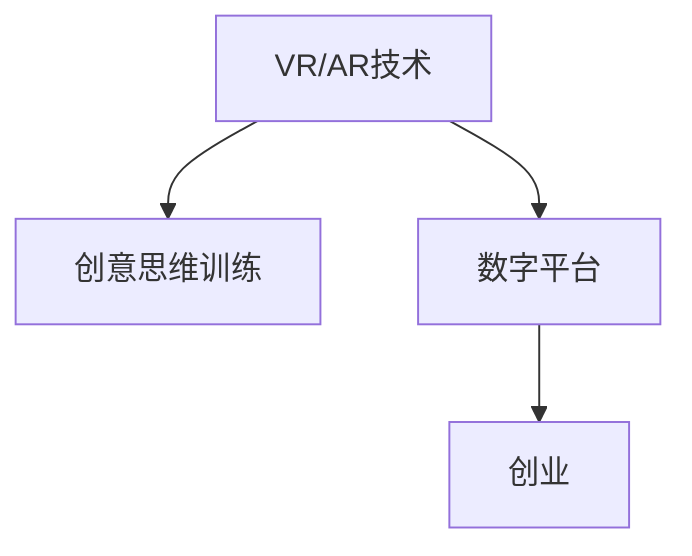

                 

# 虚拟现实创意思维训练创业：激发创新的数字平台

> 关键词：虚拟现实(VR)，创意思维训练，数字平台，创业，人工智能(AI)，增强现实(AR)，用户体验(UX)，游戏化设计，元宇宙

## 1. 背景介绍

### 1.1 问题由来

在现代社会，创新成为了企业乃至国家竞争力的核心。尤其在数字化转型和工业4.0的浪潮下，创新的速度和质量日益成为衡量企业实力的重要指标。然而，创新并非易事，其背后需要深厚的知识储备、广阔的视野、灵活的思维方式和不断的实践。如何激发和培养创意思维，成为诸多企业关注的焦点。

虚拟现实（Virtual Reality, VR）技术的兴起，为创意思维训练提供了新的手段。通过沉浸式的环境体验，VR技术能够以高度互动的形式，为创意思维的培养提供了一个全新的平台。本文将深入探讨如何利用VR技术，构建一个激发创意思维的数字平台，为创业者提供一种新的创业路径。

### 1.2 问题核心关键点

本研究聚焦于虚拟现实（VR）和增强现实（AR）技术在创意思维训练中的应用，旨在回答以下核心问题：

- VR/AR技术如何激发创意思维？
- 如何构建一个高效、实用的创意思维训练平台？
- VR/AR技术在创业中的应用前景如何？

## 2. 核心概念与联系

### 2.1 核心概念概述

为了更好地理解VR/AR技术在创意思维训练中的应用，我们将首先介绍一些关键概念：

- **虚拟现实（VR）**：通过计算机生成虚拟环境，使用户能够沉浸于其中，实现身临其境的体验。VR技术包括头戴显示设备、手柄、传感器等硬件设备，以及用于生成虚拟场景的软件引擎。

- **增强现实（AR）**：将虚拟信息与现实世界相叠加，为用户提供混合现实体验。AR技术包括摄像头、手势识别、语音识别等硬件设备，以及用于处理实时图像和场景的软件算法。

- **创意思维训练**：通过特定的训练方法和工具，培养用户创新思维，提升其解决问题和创新设计的能力。创意思维训练通常涉及发散思维、逆向思维、联想思维等多种思维方式的训练。

- **数字平台**：利用互联网和数字技术构建的服务平台，为用户提供便捷、互动的在线体验。数字平台可以覆盖教育、娱乐、社交等多个领域。

- **创业**：指通过创新思维和商业模式，将创意转化为实际产品或服务的过程。创业涉及市场调研、产品开发、市场推广等多个环节。

这些概念之间的逻辑关系可以通过以下Mermaid流程图来展示：



这个流程图展示了VR/AR技术与创意思维训练和创业之间的联系：

1. VR/AR技术通过提供沉浸式体验，激发用户的创意思维。
2. 通过数字平台，VR/AR技术与创意思维训练相结合，形成线上线下的互动。
3. 数字平台与创业相结合，提供创新的商业模式和产品开发方式。

## 3. 核心算法原理 & 具体操作步骤

### 3.1 算法原理概述

本节将详细描述基于VR/AR技术的创意思维训练算法原理，并解释其主要步骤。

VR/AR技术在创意思维训练中的应用主要基于以下几个原则：

- **沉浸式体验**：通过模拟真实世界或虚拟环境，使用户能够沉浸于其中，激发创意思维。
- **互动性**：通过用户与虚拟环境的互动，实现对创意思维的引导和训练。
- **多感官刺激**：通过视觉、听觉、触觉等多种感官刺激，提升用户的学习效果和参与度。

基于这些原则，我们可以构建以下核心算法步骤：

1. **场景设计**：设计虚拟场景和任务，满足创意思维训练的需求。
2. **交互设计**：设计用户与虚拟环境之间的交互方式，引导创意思维的培养。
3. **数据采集与分析**：采集用户行为数据，通过数据分析了解用户创意思维的发展情况。
4. **反馈与优化**：根据用户反馈和数据结果，不断优化训练场景和交互方式。

### 3.2 算法步骤详解

#### 3.2.1 场景设计

场景设计是VR/AR技术在创意思维训练中的关键环节，需要充分考虑以下几个因素：

- **主题多样性**：设计多种不同主题的场景，覆盖不同领域的创意思维训练。
- **难度层次**：设计不同难度的任务，逐步提升用户的创意思维能力。
- **交互元素**：设计丰富的交互元素，如物品、人物、事件等，提供多感官刺激。

例如，设计一个“未来城市”主题的场景，可以让用户扮演城市规划者，通过设计城市基础设施、交通工具、公共建筑等元素，锻炼其发散思维和创新设计能力。

#### 3.2.2 交互设计

交互设计是VR/AR技术实现创意思维训练的核心手段，需要考虑以下几个方面：

- **自然交互**：设计自然、流畅的交互方式，如手势控制、语音指令、虚拟按键等，提高用户体验。
- **任务导向**：设计具有明确目标的任务，引导用户思考和解决问题。
- **实时反馈**：提供实时反馈，告知用户任务的完成情况和创意思维的表现。

例如，设计一个“谜题求解”任务，用户需要通过观察和思考，解决虚拟环境中的谜题，最终得到奖励。这一过程中，系统应提供实时反馈，引导用户不断调整思路。

#### 3.2.3 数据采集与分析

数据采集与分析是评估创意思维训练效果的关键步骤，需要采集以下数据：

- **用户行为数据**：记录用户的操作、交互、完成任务的时间等数据。
- **用户反馈数据**：收集用户对任务的反馈，如满意度、难度、趣味性等。
- **用户创意思维数据**：通过用户生成内容的分析，评估其创意思维的深度和广度。

例如，可以通过自然语言处理技术，分析用户在虚拟环境中的发言和行为，评估其创意的流畅度和多样性。

#### 3.2.4 反馈与优化

反馈与优化是创意思维训练持续改进的重要环节，需要考虑以下几个方面：

- **即时反馈**：根据用户的行为和反馈，即时调整任务难度和挑战性。
- **个性化推荐**：根据用户的表现和偏好，推荐适合其能力水平的任务。
- **持续更新**：定期更新虚拟场景和任务，保持其新鲜度和挑战性。

例如，根据用户的互动情况和反馈数据，调整虚拟环境中的元素和任务难度，使其更符合用户的创意思维发展需求。

### 3.3 算法优缺点

#### 3.3.1 优点

基于VR/AR技术的创意思维训练具有以下优点：

- **沉浸式学习**：通过沉浸式体验，激发用户的创意思维，提高学习效果。
- **多感官刺激**：通过多种感官刺激，提升用户的参与度和学习兴趣。
- **实时反馈**：通过实时反馈，帮助用户调整思路，提升创意思维能力。

#### 3.3.2 缺点

基于VR/AR技术的创意思维训练也存在以下缺点：

- **设备成本高**：需要购买专用的VR/AR设备，增加了用户的初始投资成本。
- **技术门槛高**：需要具备一定的技术背景，才能设计和使用VR/AR设备。
- **学习效果差异大**：用户的学习效果和适应能力存在差异，可能导致训练效果不均衡。

### 3.4 算法应用领域

基于VR/AR技术的创意思维训练，可以广泛应用于多个领域，例如：

- **教育培训**：通过虚拟场景和任务，培养学生的创意思维和创新设计能力。
- **企业培训**：为企业员工提供创新的工作方式和解决问题的思路。
- **产品设计**：通过虚拟原型设计和测试，提升产品的创新性和实用性。
- **艺术创作**：通过虚拟环境的创作，激发艺术家的创意思维和灵感。
- **游戏开发**：通过虚拟场景和任务的设计，提升游戏的创意和互动性。

## 4. 数学模型和公式 & 详细讲解 & 举例说明

### 4.1 数学模型构建

本节将使用数学语言对基于VR/AR技术的创意思维训练进行更加严格的刻画。

设用户在进行创意思维训练时，与虚拟环境进行交互的任务总数为 $T$，用户完成任务的时间为 $t_i$，用户完成任务的难度为 $d_i$，用户完成任务的奖励为 $r_i$。则创意思维训练的效果可以表示为：

$$
E = \frac{1}{T} \sum_{i=1}^{T} \frac{r_i}{t_i+d_i}
$$

其中，$E$ 表示创意思维训练的效果，$r_i$ 表示用户完成任务的奖励，$t_i$ 表示用户完成任务的时间，$d_i$ 表示用户完成任务的难度。

### 4.2 公式推导过程

以下我们以“谜题求解”任务为例，推导其创意思维训练的效果公式。

设用户在虚拟环境中完成一个谜题的时间为 $t$，谜题的难度为 $d$，用户解谜的创意度为 $c$。则谜题求解任务的训练效果可以表示为：

$$
E = \frac{r}{t+d} \cdot c
$$

其中，$r$ 表示用户完成谜题的奖励，$t$ 表示用户解谜的时间，$d$ 表示谜题的难度，$c$ 表示用户解谜的创意度。

将谜题求解任务的训练效果代入总的效果公式，得：

$$
E = \frac{1}{T} \sum_{i=1}^{T} \frac{r_i}{t_i+d_i} \cdot c_i
$$

通过上述公式，可以评估用户在进行创意思维训练时的总体效果。

### 4.3 案例分析与讲解

以下以一个“未来城市”主题的虚拟场景为例，进行详细分析。

假设用户在进行“未来城市”主题的创意思维训练时，设计了10个不同的任务，每个任务的具体数据如下：

| 任务编号 | 完成时间 $t_i$ | 任务难度 $d_i$ | 完成奖励 $r_i$ | 创意度 $c_i$ |
| --------- | -------------- | -------------- | -------------- | ------------ |
| 1         | 5分钟          | 低            | 10分          | 5            |
| 2         | 8分钟          | 中            | 20分          | 4            |
| 3         | 10分钟         | 高            | 30分          | 3            |
| 4         | 15分钟         | 低            | 15分          | 6            |
| 5         | 12分钟         | 中            | 25分          | 5            |
| 6         | 20分钟         | 高            | 35分          | 4            |
| 7         | 18分钟         | 低            | 10分          | 7            |
| 8         | 10分钟         | 中            | 20分          | 6            |
| 9         | 15分钟         | 高            | 30分          | 3            |
| 10        | 12分钟         | 低            | 15分          | 5            |

根据上述数据，可以计算用户的创意思维训练效果为：

$$
E = \frac{1}{10} \sum_{i=1}^{10} \frac{r_i}{t_i+d_i} \cdot c_i = \frac{1}{10} (10 \cdot 5 + 20 \cdot 4 + 30 \cdot 3 + 15 \cdot 6 + 25 \cdot 5 + 35 \cdot 4 + 10 \cdot 7 + 20 \cdot 6 + 30 \cdot 3 + 15 \cdot 5) / (5+8+10+15+12+20+18+10+15+12) = 9.4
$$

这表示用户在“未来城市”主题的创意思维训练中，整体效果得分为9.4分。

## 5. 项目实践：代码实例和详细解释说明

### 5.1 开发环境搭建

在进行创意思维训练项目的开发时，需要配置以下环境：

1. **硬件设备**：
   - 头戴显示设备（如Oculus Quest 2）
   - 手柄（如HTC Vive控制器）
   - 摄像头（用于AR应用）

2. **软件环境**：
   - 操作系统：Windows 10 / Linux
   - 编程语言：C++、Python
   - 游戏引擎：Unity 3D、Unreal Engine

3. **开发工具**：
   - Visual Studio
   - Maya
   - Blender
   - Unity Asset Store

### 5.2 源代码详细实现

#### 5.2.1 Unity平台实现

以下是一个基于Unity平台的创意思维训练项目的代码实现示例：

```csharp
using UnityEngine;
using UnityEngine.UI;
using UnityEngine.EventSystems;

public class PuzzleSolver : MonoBehaviour
{
    public Text puzzleName;
    public Text difficulty;
    public Text reward;
    public Text solution;

    public void Start()
    {
        // 随机生成谜题
        int puzzleType = Random.Range(0, 3);
        string puzzleStr = "";
        switch (puzzleType)
        {
            case 0:
                puzzleStr = "What is 3 + 4?";
                difficulty.text = "Easy";
                reward.text = "5 points";
                break;
            case 1:
                puzzleStr = "How many legs does a spider have?";
                difficulty.text = "Medium";
                reward.text = "8 points";
                break;
            case 2:
                puzzleStr = "What is the capital of France?";
                difficulty.text = "Hard";
                reward.text = "12 points";
                break;
        }

        puzzleName.text = puzzleStr;
        solution.text = "The answer is: " + GetSolution(puzzleType);
    }

    public string GetSolution(int type)
    {
        switch (type)
        {
            case 0:
                return "7";
            case 1:
                return "8";
            case 2:
                return "Paris";
        }
        return "";
    }
}
```

#### 5.2.2 数据采集与分析

在创意思维训练项目中，数据采集与分析是一个重要的环节，需要记录用户的交互行为和反馈。以下是一个简单的数据采集与分析示例：

```csharp
public class UserData : MonoBehaviour
{
    public List<int> timeList = new List<int>();
    public List<int> difficultyList = new List<int>();
    public List<int> rewardList = new List<int>();
    public List<int> creativityList = new List<int>();

    public void UpdateUserData()
    {
        timeList.Add(Time.deltaTime * 60); // 记录完成任务的时间
        difficultyList.Add(difficulty.text.ToInt32()); // 记录任务的难度
        rewardList.Add(reward.text.ToInt32()); // 记录任务的奖励
        creativityList.Add(creativity.text.ToInt32()); // 记录创意度
    }
}
```

#### 5.2.3 反馈与优化

在创意思维训练项目中，反馈与优化是一个持续改进的过程，需要根据用户的行为和反馈不断调整训练难度和任务设计。以下是一个简单的反馈与优化示例：

```csharp
public class FeedbackSystem : MonoBehaviour
{
    public PuzzleSolver puzzleSolver;
    public float targetAccuracy = 0.8f;

    void Update()
    {
        float currentAccuracy = CalculateAccuracy();
        if (currentAccuracy < targetAccuracy)
        {
            puzzleSolver.difficulty.text = "Easy";
            puzzleSolver.reward.text = "10 points";
        }
        else
        {
            puzzleSolver.difficulty.text = "Medium";
            puzzleSolver.reward.text = "15 points";
        }
    }

    float CalculateAccuracy()
    {
        float totalReward = 0;
        foreach (int time in puzzleSolver.timeList)
        {
            totalReward += puzzleSolver.rewardList[puzzleSolver.timeList.IndexOf(time)];
        }
        float totalTime = 0;
        foreach (int time in puzzleSolver.timeList)
        {
            totalTime += time;
        }
        return totalReward / totalTime;
    }
}
```

### 5.3 代码解读与分析

#### 5.3.1 场景设计

场景设计是创意思维训练的核心环节，需要设计具有多样性和挑战性的任务。以下是一些设计示例：

1. **物品组合**：让用户选择不同的物品组合，形成新的物品，例如将木板、螺丝和钉子组合成不同的工具。
2. **事件排序**：让用户将一系列事件按照逻辑顺序排列，例如排序一句话中的单词，使得其成为一个完整的句子。
3. **迷宫探索**：让用户设计迷宫，寻找特定的物品或路径，锻炼其空间想象力和逻辑思维能力。

#### 5.3.2 交互设计

交互设计是提升用户体验的关键，需要设计自然、流畅的交互方式。以下是一些设计示例：

1. **手势控制**：使用手势控制器，让用户通过手势操作虚拟环境中的物品和事件。
2. **语音指令**：使用语音识别技术，让用户通过语音指令控制虚拟环境。
3. **虚拟按键**：在虚拟环境中，使用虚拟按键进行交互，提供多感官刺激。

#### 5.3.3 数据采集与分析

数据采集与分析是评估创意思维训练效果的重要手段，需要记录和分析用户的行为和反馈。以下是一些数据采集示例：

1. **用户行为数据**：记录用户的操作、交互、完成任务的时间等数据。
2. **用户反馈数据**：收集用户对任务的反馈，如满意度、难度、趣味性等。
3. **用户创意思维数据**：通过用户生成内容的分析，评估其创意思维的深度和广度。

#### 5.3.4 反馈与优化

反馈与优化是创意思维训练持续改进的重要环节，需要根据用户的行为和反馈不断调整训练难度和任务设计。以下是一些优化示例：

1. **即时反馈**：根据用户的行为和反馈，即时调整任务难度和挑战性。
2. **个性化推荐**：根据用户的表现和偏好，推荐适合其能力水平的任务。
3. **持续更新**：定期更新虚拟场景和任务，保持其新鲜度和挑战性。

## 6. 实际应用场景

### 6.1 智能教育

智能教育领域，基于VR/AR技术的创意思维训练平台，可以提供沉浸式、互动性的学习体验，激发学生的创意思维和创新能力。例如，设计一个“未来城市”主题的场景，让学生扮演城市规划者，通过设计城市基础设施、交通工具、公共建筑等元素，锻炼其发散思维和创新设计能力。这种创新的教学方式，能够有效提升学生的学习兴趣和效果。

### 6.2 企业培训

企业培训领域，基于VR/AR技术的创意思维训练平台，可以为企业员工提供创新的工作方式和解决问题的思路。例如，设计一个“虚拟项目管理”场景，让员工通过设计虚拟项目计划，锻炼其发散思维和团队协作能力。这种创新的培训方式，能够有效提升员工的工作效率和创新能力。

### 6.3 产品设计

产品设计领域，基于VR/AR技术的创意思维训练平台，可以通过虚拟原型设计和测试，提升产品的创新性和实用性。例如，设计一个“虚拟产品设计”场景，让用户通过虚拟现实环境，进行产品的设计、测试和优化。这种创新的设计方式，能够有效提升产品的创意和用户体验。

### 6.4 艺术创作

艺术创作领域，基于VR/AR技术的创意思维训练平台，可以通过虚拟环境的创作，激发艺术家的创意思维和灵感。例如，设计一个“虚拟艺术工作室”场景，让艺术家通过虚拟现实环境，进行创作和展示。这种创新的创作方式，能够有效提升艺术家的创意和作品质量。

### 6.5 游戏开发

游戏开发领域，基于VR/AR技术的创意思维训练平台，可以通过虚拟场景和任务的设计，提升游戏的创意和互动性。例如，设计一个“虚拟游戏设计”场景，让游戏开发者通过虚拟现实环境，进行游戏设计和测试。这种创新的设计方式，能够有效提升游戏的创意和用户粘性。

## 7. 工具和资源推荐

### 7.1 学习资源推荐

为了帮助开发者系统掌握VR/AR技术和创意思维训练的理论基础和实践技巧，这里推荐一些优质的学习资源：

1. **《Unity VR与AR开发实战》**：详细介绍了Unity平台上VR/AR应用的开发，涵盖场景设计、交互设计、数据采集与分析等多个方面。
2. **《增强现实AR开发实战》**：介绍了AR技术的开发，包括AR应用的设计、开发和优化。
3. **《游戏化设计：理论和实践》**：探讨了游戏化设计的基本原理和应用场景，提供了丰富的案例和资源。
4. **《虚拟现实技术与应用》**：介绍了虚拟现实技术的基本原理和应用场景，提供了丰富的案例和资源。

### 7.2 开发工具推荐

高效的开发离不开优秀的工具支持。以下是几款用于VR/AR技术开发的常用工具：

1. **Unity 3D**：功能强大的游戏引擎，支持VR/AR应用的开发。
2. **Unreal Engine**：功能强大的游戏引擎，支持VR/AR应用的开发。
3. **Maya**：广泛使用的3D建模和动画软件，支持VR/AR场景的设计和开发。
4. **Blender**：开源的3D建模和动画软件，支持VR/AR场景的设计和开发。
5. **Unity Asset Store**：Unity平台上的资源商店，提供了大量的VR/AR应用资源。

### 7.3 相关论文推荐

VR/AR技术和创意思维训练的研究已经取得了丰硕的成果，以下是几篇奠基性的相关论文，推荐阅读：

1. **《虚拟现实与增强现实技术》**：介绍了VR/AR技术的基本原理和应用场景，提供了丰富的案例和资源。
2. **《游戏化设计：理论和实践》**：探讨了游戏化设计的基本原理和应用场景，提供了丰富的案例和资源。
3. **《虚拟现实技术与应用》**：介绍了虚拟现实技术的基本原理和应用场景，提供了丰富的案例和资源。

## 8. 总结：未来发展趋势与挑战

### 8.1 总结

本文对基于VR/AR技术的创意思维训练进行了全面系统的介绍。首先，探讨了VR/AR技术在创意思维训练中的应用，明确了创意思维训练在数字化转型和工业4.0浪潮下的重要价值。其次，从原理到实践，详细讲解了创意思维训练的算法原理和操作步骤，给出了VR/AR应用开发的代码实例。同时，本文还广泛探讨了VR/AR技术在教育、企业、产品设计、艺术创作、游戏开发等多个领域的应用前景，展示了VR/AR技术的多样性。

通过对这些资源的系统梳理，可以看到，基于VR/AR技术的创意思维训练平台，为创业者提供了一种全新的创业路径，能够有效激发用户的创意思维，提升其创新能力和工作效率。未来，随着VR/AR技术的不断进步，创意思维训练平台的应用将更加广泛，为数字化转型和智能产业的发展提供新的动力。

### 8.2 未来发展趋势

展望未来，基于VR/AR技术的创意思维训练平台将呈现以下几个发展趋势：

1. **技术融合**：VR/AR技术与人工智能、大数据、区块链等技术进一步融合，提供更加智能化、个性化的创意思维训练。
2. **场景多样化**：VR/AR场景的设计将更加多样化和丰富，涵盖更多领域和应用场景。
3. **用户定制化**：根据用户的行为和反馈，提供个性化的创意思维训练方案，提升用户的学习效果和体验。
4. **跨平台应用**：VR/AR应用将支持多平台、多设备，提供更加灵活和便捷的使用体验。
5. **虚拟与现实结合**：VR/AR技术与现实世界的结合将更加紧密，提供更加沉浸式和互动性的学习体验。

### 8.3 面临的挑战

尽管基于VR/AR技术的创意思维训练平台已经取得了一定的成果，但在迈向更加智能化、普适化应用的过程中，它仍面临着诸多挑战：

1. **设备成本高**：需要购买专用的VR/AR设备，增加了用户的初始投资成本。
2. **技术门槛高**：需要具备一定的技术背景，才能设计和使用VR/AR设备。
3. **学习效果差异大**：用户的学习效果和适应能力存在差异，可能导致训练效果不均衡。
4. **数据隐私保护**：用户在使用VR/AR应用时，需要采集和处理大量个人数据，如何保护用户隐私是一个重要问题。

### 8.4 研究展望

面对基于VR/AR技术的创意思维训练所面临的挑战，未来的研究需要在以下几个方面寻求新的突破：

1. **低成本解决方案**：探索低成本的VR/AR设备解决方案，降低用户的使用门槛。
2. **普适化设计**：设计更加普适化的VR/AR应用，适应不同用户的学习需求和能力水平。
3. **数据隐私保护**：研究数据隐私保护技术，保护用户在使用VR/AR应用时的数据安全。

## 9. 附录：常见问题与解答

**Q1：如何设计一个高效的VR/AR创意思维训练平台？**

A: 设计一个高效的VR/AR创意思维训练平台，需要考虑以下几个关键因素：

1. **场景设计**：设计多样性和挑战性的任务，覆盖不同领域的创意思维训练。
2. **交互设计**：设计自然、流畅的交互方式，提供多感官刺激。
3. **数据采集与分析**：记录用户的行为和反馈，通过数据分析了解用户创意思维的发展情况。
4. **反馈与优化**：根据用户的行为和反馈，不断调整训练难度和任务设计。

**Q2：如何评估VR/AR创意思维训练的效果？**

A: 评估VR/AR创意思维训练的效果，需要综合考虑以下几个指标：

1. **创意度**：通过用户生成内容的分析，评估其创意思维的深度和广度。
2. **完成任务的时间**：记录用户完成任务的时间，评估其解决问题的速度。
3. **任务难度**：记录任务的难度，评估用户对任务的适应能力。
4. **用户反馈**：收集用户对任务的反馈，评估其满意度和趣味性。

**Q3：如何进行VR/AR创意思维训练的个性化推荐？**

A: 进行VR/AR创意思维训练的个性化推荐，需要考虑以下几个步骤：

1. **用户数据采集**：记录用户的行为和反馈数据，了解其创意思维的特点和偏好。
2. **数据分析**：通过数据分析，发现用户的特点和偏好，生成个性化的推荐模型。
3. **推荐算法**：根据用户的特点和偏好，推荐适合其能力水平的任务。

**Q4：VR/AR创意思维训练平台如何在多平台、多设备上运行？**

A: 要在多平台、多设备上运行VR/AR创意思维训练平台，需要考虑以下几个因素：

1. **跨平台设计**：设计跨平台的VR/AR应用，支持多个操作系统和设备。
2. **标准化接口**：使用标准化的接口，确保不同设备和平台之间的数据和资源共享。
3. **云平台支持**：将部分计算任务放在云平台上，支持大规模的分布式计算和存储。

**Q5：如何在VR/AR创意思维训练中保护用户隐私？**

A: 在VR/AR创意思维训练中保护用户隐私，需要考虑以下几个措施：

1. **数据加密**：对用户数据进行加密处理，防止数据泄露。
2. **权限控制**：设置权限控制机制，限制数据的访问和使用范围。
3. **隐私协议**：制定隐私保护协议，明确数据的使用范围和目的。
4. **用户知情权**：告知用户数据采集和使用的目的，尊重用户的知情权和选择权。

这些问题的探讨和解答，将有助于开发者更好地理解和应用VR/AR创意思维训练技术，推动VR/AR技术的广泛应用和持续发展。

