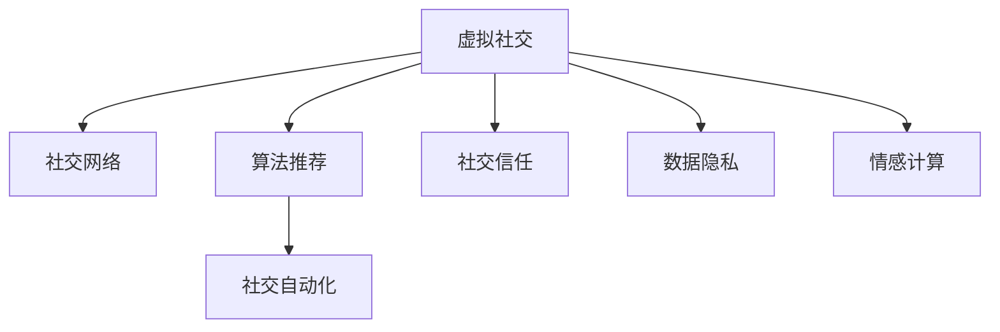

                 

# 虚拟社交：AI时代的人际关系

> 关键词：虚拟社交,人工智能,人际网络,社交媒体,算法推荐,社交自动化,社交信任,数据隐私,情感计算

## 1. 背景介绍

### 1.1 问题由来
随着科技的迅猛发展，人类社会的方方面面都发生了深刻变化。特别是人工智能技术的广泛应用，正在塑造全新的社交模式。人们越来越多地通过虚拟社交平台与他人进行交流，传统的面对面互动逐渐被数字化的文本、图片、视频所取代。AI技术不仅在改变我们的社交方式，还在影响我们的心理、社会结构和人际关系。

### 1.2 问题核心关键点
本文旨在探讨AI时代虚拟社交的影响，分析人际网络与AI技术的深度融合，并提出应对策略，以期构建更加健康、高效的社交关系。

### 1.3 问题研究意义
虚拟社交与AI技术的结合，为人类提供了前所未有的连接和交流机会，同时也带来了诸多挑战。研究虚拟社交背后的算法原理、应用效果及潜在问题，将有助于我们更好地理解和利用AI技术，促进社交关系的良性发展。

## 2. 核心概念与联系

### 2.1 核心概念概述

为更好地理解虚拟社交中的AI技术应用，本节将介绍几个关键概念：

- **虚拟社交(Virtual Social)**：通过互联网、社交媒体等平台，以文本、图片、视频等形式进行人与人之间的交流和互动。虚拟社交打破了时间和空间的限制，使得人们能够随时随地进行沟通。

- **社交网络(Social Network)**：由个人或实体之间通过线上互动形成的连接图。社交网络分析用于研究网络结构、关系演变和群体行为等。

- **算法推荐(Algorithm Recommendation)**：使用机器学习、深度学习等算法，根据用户的行为和偏好，为其推荐个性化的内容或连接。

- **社交自动化(Social Automation)**：使用AI技术自动化执行社交任务，如信息过滤、内容生成、情感分析等。

- **社交信任(Social Trust)**：用户在虚拟社交环境中建立的对其他用户或平台的安全感和依赖感。

- **数据隐私(Data Privacy)**：用户在虚拟社交平台上产生的个人信息和行为数据的保护。

- **情感计算(Affective Computing)**：通过计算和分析用户的情感状态，提升虚拟社交的互动效果和用户体验。

这些核心概念之间的逻辑关系可以通过以下Mermaid流程图来展示：



这个流程图展示了几大核心概念之间的关联：

1. **虚拟社交**：通过平台连接，与社交网络、算法推荐、社交自动化、社交信任、数据隐私和情感计算等多个方面紧密相关。
2. **社交网络**：是虚拟社交的基础结构，通过用户互动形成复杂的网络关系。
3. **算法推荐**：用于个性化内容或连接的推荐，增强用户体验。
4. **社交自动化**：简化用户互动流程，提高效率。
5. **社交信任**：用户对社交平台和连接对象的信任，直接影响虚拟社交的质量。
6. **数据隐私**：用户数据的保护，对虚拟社交的持续发展至关重要。
7. **情感计算**：通过分析用户情感，提升互动质量和用户满意度。

## 3. 核心算法原理 & 具体操作步骤

### 3.1 算法原理概述

虚拟社交中的AI技术主要通过以下算法实现：

- **协同过滤(Collaborative Filtering)**：基于用户行为数据，预测用户可能感兴趣的内容或连接。
- **深度学习(Deep Learning)**：通过神经网络模型，分析用户的历史互动和内容偏好，生成个性化的推荐结果。
- **强化学习(Reinforcement Learning)**：通过与用户的互动，不断调整推荐策略，提升推荐的准确性和用户满意度。
- **自然语言处理(Natural Language Processing, NLP)**：分析用户的文本内容，理解情感、主题等信息，为推荐和互动提供依据。
- **图神经网络(Graph Neural Networks, GNNs)**：处理社交网络的结构和关系，推断用户间的连接强度和影响力。

### 3.2 算法步骤详解

#### 3.2.1 协同过滤算法

1. **数据收集**：收集用户的历史互动数据，如浏览、点赞、评论等。
2. **用户画像建立**：通过统计分析，构建每个用户的行为特征向量。
3. **相似性计算**：计算不同用户间的相似性，形成用户画像的相似度矩阵。
4. **推荐生成**：根据相似性矩阵，预测用户可能感兴趣的新内容或连接，生成推荐列表。

#### 3.2.2 深度学习算法

1. **数据准备**：将用户的互动数据转化为神经网络可处理的格式。
2. **模型构建**：设计多层神经网络，包含嵌入层、全连接层、输出层等，用于学习用户行为和偏好。
3. **模型训练**：使用监督学习或无监督学习算法，训练模型参数，优化推荐结果。
4. **预测输出**：通过训练好的模型，预测用户可能感兴趣的内容或连接，生成推荐列表。

#### 3.2.3 强化学习算法

1. **环境定义**：定义虚拟社交环境，包括用户、内容和连接等。
2. **策略设计**：设计推荐策略，如奖励机制、惩罚机制等。
3. **策略学习**：通过与用户互动，调整推荐策略，优化用户体验。
4. **反馈机制**：收集用户的反馈信息，更新策略，提升推荐效果。

#### 3.2.4 自然语言处理算法

1. **文本预处理**：清洗、分词、词性标注等，将文本转化为结构化数据。
2. **情感分析**：通过情感词典或深度学习模型，分析文本的情感极性和强度。
3. **主题建模**：使用LDA等算法，提取文本的主题信息，用于推荐和互动。

#### 3.2.5 图神经网络算法

1. **网络构建**：将社交网络转化为图结构，包含节点和边。
2. **图卷积**：使用图卷积神经网络(Graph Convolutional Network, GCN)等算法，学习节点特征。
3. **关系推断**：推断用户间的连接强度和影响力，生成推荐列表。

### 3.3 算法优缺点

#### 3.3.1 协同过滤算法

**优点**：
- 能较好地处理稀疏数据。
- 简单易实现，计算效率高。

**缺点**：
- 冷启动问题严重。新用户的推荐效果差。
- 数据稀疏性问题。小样本难以准确预测。

#### 3.3.2 深度学习算法

**优点**：
- 准确性高，能捕捉复杂模式。
- 自适应能力强，适合大规模数据。

**缺点**：
- 计算资源消耗大。需要高性能设备支持。
- 过拟合风险高。需精心设计优化策略。

#### 3.3.3 强化学习算法

**优点**：
- 动态调整策略，提高推荐效果。
- 自适应性强，适合复杂环境。

**缺点**：
- 学习过程较慢，计算成本高。
- 策略设计复杂，需要大量实验验证。

#### 3.3.4 自然语言处理算法

**优点**：
- 文本分析能力强，能提取丰富信息。
- 用户互动真实，反馈信息可靠。

**缺点**：
- 计算复杂度高，处理时间长。
- 数据噪音大，分析结果易受干扰。

#### 3.3.5 图神经网络算法

**优点**：
- 能捕捉复杂网络关系，提升推荐效果。
- 自适应性强，适合多种社交场景。

**缺点**：
- 计算复杂度高，计算资源消耗大。
- 网络结构复杂，实现难度大。

## 4. 数学模型和公式 & 详细讲解 & 举例说明

### 4.1 数学模型构建

假设用户数为 $U$，物品数为 $I$，用户与物品间的互动矩阵为 $R$。设用户 $u$ 对物品 $i$ 的评分（互动行为）为 $R_{ui}$，利用协同过滤算法，为每个用户 $u$ 生成推荐列表 $X_u$。协同过滤的目标是最小化用户与物品的真实评分与预测评分的差距，即：

$$
\min_{R_{ui}} \sum_{u} \sum_{i} (R_{ui} - \hat{R}_{ui})^2
$$

其中 $\hat{R}_{ui}$ 为协同过滤算法生成的预测评分。

### 4.2 公式推导过程

在协同过滤中，用户与物品的相似度矩阵 $S_{ui}$ 通过余弦相似性计算得到：

$$
S_{ui} = \frac{\sum_{i,j} R_{ui} R_{uj}}{\sqrt{\sum_{i} R_{ui}^2} \sqrt{\sum_{j} R_{uj}^2}}
$$

用户 $u$ 对物品 $i$ 的预测评分 $\hat{R}_{ui}$ 为：

$$
\hat{R}_{ui} = \sum_j S_{uj} R_{ij}
$$

### 4.3 案例分析与讲解

#### 案例一：电影推荐系统

某在线视频平台利用协同过滤算法为每位用户生成个性化电影推荐列表。平台收集用户观看电影的数据，构建用户画像和电影画像，通过计算用户间的相似性和电影间的相似性，生成推荐列表。用户对电影的评分反馈，进一步优化协同过滤模型，提升推荐效果。

#### 案例二：新闻内容推荐

某新闻聚合平台使用深度学习算法为用户推荐个性化新闻内容。平台通过爬虫收集用户点击新闻的行为数据，训练深度神经网络模型，学习用户偏好。用户对新闻内容的点击反馈，用于更新模型参数，生成新的推荐列表。

## 5. 项目实践：代码实例和详细解释说明

### 5.1 开发环境搭建

在进行虚拟社交AI技术的开发实践前，我们需要准备好开发环境。以下是使用Python进行PyTorch开发的环境配置流程：

1. 安装Anaconda：从官网下载并安装Anaconda，用于创建独立的Python环境。

2. 创建并激活虚拟环境：
```bash
conda create -n pytorch-env python=3.8 
conda activate pytorch-env
```

3. 安装PyTorch：根据CUDA版本，从官网获取对应的安装命令。例如：
```bash
conda install pytorch torchvision torchaudio cudatoolkit=11.1 -c pytorch -c conda-forge
```

4. 安装各类工具包：
```bash
pip install numpy pandas scikit-learn matplotlib tqdm jupyter notebook ipython
```

完成上述步骤后，即可在`pytorch-env`环境中开始AI技术开发。

### 5.2 源代码详细实现

接下来，我们以电影推荐系统为例，给出使用PyTorch实现协同过滤算法的完整代码实现。

首先，定义电影和用户画像的数据结构：

```python
import torch
from torch.utils.data import TensorDataset, DataLoader

class MovieUserProfile:
    def __init__(self, user, movie, ratings):
        self.user = user
        self.movie = movie
        self.ratings = ratings
        
    def __len__(self):
        return len(self.ratings)
        
    def __getitem__(self, item):
        return {'user': self.user[item], 'movie': self.movie[item], 'rating': self.ratings[item]}
        
movie_user_profiles = [MovieUserProfile(user, movie, ratings) for user, movie, ratings in zip(users, movies, ratings)]
dataset = TensorDataset(torch.tensor([profile.user for profile in movie_user_profiles]), 
                       torch.tensor([profile.movie for profile in movie_user_profiles]), 
                       torch.tensor([profile.rating for profile in movie_user_profiles]))
dataloader = DataLoader(dataset, batch_size=16)
```

然后，实现协同过滤算法的神经网络模型：

```python
from torch.nn import Embedding, Linear, BCELoss

class CollaborativeFilteringModel(torch.nn.Module):
    def __init__(self, num_users, num_movies, embedding_dim):
        super(CollaborativeFilteringModel, self).__init__()
        self.user_embedding = Embedding(num_users, embedding_dim)
        self.movie_embedding = Embedding(num_movies, embedding_dim)
        self.dot_product = Linear(embedding_dim * 2, 1)
        self.loss = BCELoss()
        
    def forward(self, user_ids, movie_ids):
        user_embed = self.user_embedding(user_ids)
        movie_embed = self.movie_embedding(movie_ids)
        dot_product = self.dot_product(torch.cat([user_embed, movie_embed], dim=1))
        prediction = torch.sigmoid(dot_product)
        return prediction, self.loss(prediction, target)
        
model = CollaborativeFilteringModel(num_users, num_movies, embedding_dim)
optimizer = torch.optim.Adam(model.parameters(), lr=0.01)
```

接着，定义训练和评估函数：

```python
from tqdm import tqdm

def train_epoch(model, dataloader, optimizer):
    model.train()
    total_loss = 0
    for batch in tqdm(dataloader):
        user_ids = batch['user']
        movie_ids = batch['movie']
        target = batch['rating']
        prediction, loss = model(user_ids, movie_ids)
        optimizer.zero_grad()
        loss.backward()
        optimizer.step()
        total_loss += loss.item()
    return total_loss / len(dataloader)

def evaluate(model, dataloader):
    model.eval()
    total_loss = 0
    total_correct = 0
    for batch in dataloader:
        user_ids = batch['user']
        movie_ids = batch['movie']
        target = batch['rating']
        prediction, loss = model(user_ids, movie_ids)
        total_loss += loss.item()
        total_correct += (prediction >= 0.5).sum().item()
    return total_correct / len(dataloader), total_loss / len(dataloader)
```

最后，启动训练流程并在测试集上评估：

```python
epochs = 10
embedding_dim = 50

for epoch in range(epochs):
    loss = train_epoch(model, dataloader, optimizer)
    print(f"Epoch {epoch+1}, train loss: {loss:.3f}")
    
    print(f"Epoch {epoch+1}, test accuracy: {evaluate(model, dataloader)[0]:.2f}, test loss: {evaluate(model, dataloader)[1]:.2f}")
    
print("Final test accuracy: {evaluate(model, dataloader)[0]:.2f}, final test loss: {evaluate(model, dataloader)[1]:.2f}")
```

以上就是使用PyTorch实现协同过滤算法的完整代码实现。可以看到，通过简单的数据结构定义和模型搭建，即可实现协同过滤算法的训练和评估。

### 5.3 代码解读与分析

让我们再详细解读一下关键代码的实现细节：

**MovieUserProfile类**：
- `__init__`方法：初始化用户、电影和评分数据。
- `__len__`方法：返回数据集的长度。
- `__getitem__`方法：对单个样本进行处理，返回用户、电影和评分。

**train_epoch函数**：
- 使用`model.train()`将模型设置为训练模式。
- 遍历数据集，计算模型预测值和损失值。
- 使用`optimizer.zero_grad()`清除梯度。
- 反向传播更新模型参数，最小化损失。

**evaluate函数**：
- 使用`model.eval()`将模型设置为评估模式。
- 遍历数据集，计算模型预测值和损失值。
- 统计预测准确率和损失值。

**训练流程**：
- 定义总的epoch数和嵌入维度。
- 循环迭代，每个epoch内先训练，再评估。
- 输出训练和测试的准确率和损失值。
- 最后输出最终的测试结果。

可以看到，PyTorch的简洁高效特性，使得协同过滤算法的实现变得简单便捷。开发者可以快速迭代实验，探索最优的模型和参数配置。

## 6. 实际应用场景

### 6.1 智能客服

智能客服系统利用AI技术，自动处理客户咨询和问题解答。通过收集和分析用户的历史互动数据，系统能够智能推荐常见问题，提供个性化回复。这不仅提升了客服效率，还提高了用户满意度。

### 6.2 在线教育

在线教育平台利用AI技术，为学生推荐个性化学习资源，提供智能辅导和作业批改。通过分析学生的学习行为和反馈，系统能够动态调整教学策略，提升学习效果。

### 6.3 金融理财

金融理财平台利用AI技术，为投资者推荐个性化投资组合，提供市场分析和风险预警。通过分析用户的投资偏好和行为，系统能够动态调整投资策略，提升理财收益。

### 6.4 健康医疗

健康医疗平台利用AI技术，为患者推荐个性化治疗方案，提供医疗咨询和健康管理。通过分析患者的病历和健康数据，系统能够动态调整治疗策略，提升治疗效果。

### 6.5 电子商务

电子商务平台利用AI技术，为消费者推荐个性化商品，提供智能搜索和购物辅助。通过分析消费者的浏览和购买行为，系统能够动态调整推荐策略，提升购物体验。

### 6.6 社交媒体

社交媒体平台利用AI技术，为用户推荐个性化内容，提供智能推送和互动分析。通过分析用户的社交行为和兴趣，系统能够动态调整推荐策略，提升用户体验。

## 7. 工具和资源推荐

### 7.1 学习资源推荐

为了帮助开发者系统掌握虚拟社交中的AI技术应用，这里推荐一些优质的学习资源：

1. **《深度学习》课程**：由斯坦福大学Andrew Ng教授主讲，涵盖深度学习基础和应用，适合入门学习。
2. **《Python数据科学手册》**：由Jake VanderPlas编写，全面介绍Python在数据科学中的应用，包括NLP和社交网络分析。
3. **《TensorFlow实战》**：由Google官方编写，详细介绍TensorFlow框架的使用，包括深度学习和强化学习。
4. **《NLP实战》**：由Stanford NLP团队编写，涵盖自然语言处理的基础和应用，包括文本分类、情感分析等。
5. **Kaggle竞赛**：参与NLP和社交网络分析相关的Kaggle竞赛，实战提升NLP技能。

通过对这些资源的学习实践，相信你一定能够快速掌握虚拟社交中的AI技术应用，并用于解决实际的NLP问题。

### 7.2 开发工具推荐

高效的开发离不开优秀的工具支持。以下是几款用于虚拟社交AI技术开发的常用工具：

1. **PyTorch**：基于Python的开源深度学习框架，灵活动态的计算图，适合快速迭代研究。大部分NLP预训练模型都有PyTorch版本的实现。
2. **TensorFlow**：由Google主导开发的开源深度学习框架，生产部署方便，适合大规模工程应用。同样有丰富的预训练语言模型资源。
3. **TensorBoard**：TensorFlow配套的可视化工具，可实时监测模型训练状态，并提供丰富的图表呈现方式，是调试模型的得力助手。
4. **Weights & Biases**：模型训练的实验跟踪工具，可以记录和可视化模型训练过程中的各项指标，方便对比和调优。

合理利用这些工具，可以显著提升虚拟社交AI技术的开发效率，加快创新迭代的步伐。

### 7.3 相关论文推荐

虚拟社交与AI技术的结合，为研究者提供了新的研究方向和挑战。以下是几篇奠基性的相关论文，推荐阅读：

1. **《协同过滤推荐系统》**：由Liu et al.发表在SIGIR'02，介绍了协同过滤算法的原理和实现方法。
2. **《深度学习在推荐系统中的应用》**：由He et al.发表在KDD'19，介绍了深度学习在推荐系统中的广泛应用。
3. **《图神经网络在社交网络中的应用》**：由Defferrard et al.发表在ICML'18，介绍了图神经网络在社交网络中的表现和效果。
4. **《社交网络中的情感计算》**：由Olmstead et al.发表在IJCAI'09，介绍了社交网络中的情感计算方法和应用。

这些论文代表了大数据时代AI技术在虚拟社交中的应用前沿，通过学习这些前沿成果，可以帮助研究者把握学科前进方向，激发更多的创新灵感。

## 8. 总结：未来发展趋势与挑战

### 8.1 总结

本文对虚拟社交中的AI技术进行了全面系统的介绍。首先阐述了AI时代虚拟社交的影响，分析了人际网络与AI技术的深度融合，并提出应对策略，以期构建更加健康、高效的社交关系。通过详细讲解协同过滤、深度学习、强化学习、自然语言处理和图神经网络等算法原理和具体操作步骤，结合实际应用场景，展示了AI技术在虚拟社交中的广泛应用。

### 8.2 未来发展趋势

展望未来，虚拟社交中的AI技术将呈现以下几个发展趋势：

1. **算法融合**：更多算法融合技术将出现，结合深度学习、强化学习、自然语言处理等多模态信息，提升推荐和互动效果。
2. **实时性提升**：通过分布式计算和流计算技术，实现更高效的实时推荐和互动。
3. **隐私保护**：通过差分隐私和联邦学习等技术，保护用户隐私，提升数据安全性。
4. **用户定制**：通过个性化推荐和定制化服务，提升用户满意度和粘性。
5. **社交信任**：通过AI技术分析用户互动行为，增强社交信任，提升用户互动体验。
6. **跨平台协同**：实现跨平台、跨应用的社交互动，提升用户综合体验。

以上趋势凸显了虚拟社交中AI技术的广阔前景。这些方向的探索发展，必将进一步提升虚拟社交的质量和用户体验，构建更加智能、安全、可信的社交关系。

### 8.3 面临的挑战

尽管虚拟社交中的AI技术已经取得了瞩目成就，但在迈向更加智能化、普适化应用的过程中，它仍面临着诸多挑战：

1. **冷启动问题**：新用户、新物品的推荐效果差，需要更多数据支持。
2. **数据隐私**：用户数据的收集和分析，涉及隐私保护和伦理问题。
3. **算法公平性**：推荐算法可能带有偏见，需要保证公平性。
4. **系统稳定性**：AI系统容易出现误推荐和误解读，需要提升稳定性。
5. **人机交互**：AI系统与用户交互的方式需要更具人性化，提升用户体验。

面对这些挑战，未来的研究需要在数据、算法、工程、伦理等多个方面进行深入探索和改进。

### 8.4 研究展望

1. **数据增强技术**：通过数据增强技术，生成更多虚拟数据，缓解冷启动问题。
2. **隐私保护技术**：通过差分隐私、联邦学习等技术，保护用户隐私，提升数据安全性。
3. **算法公平性**：通过公平性约束和算法设计，提升推荐算法的公平性。
4. **系统稳定性**：通过模型验证、实时监控等手段，提升系统稳定性。
5. **人机交互**：通过情感计算和自然语言处理技术，提升AI系统与用户的交互质量。

这些研究方向将引领虚拟社交中的AI技术迈向更加成熟和完善，为构建更加智能、安全、可信的社交关系提供有力支撑。

## 9. 附录：常见问题与解答

**Q1：虚拟社交中的AI技术如何确保推荐结果的公平性？**

A: 虚拟社交中的AI技术需要确保推荐结果的公平性，可以采用以下策略：
1. **数据采集多样化**：收集多样化的数据，避免单一数据源导致的偏见。
2. **模型设计公平性约束**：在模型设计中引入公平性约束，避免偏见产生。
3. **用户反馈机制**：引入用户反馈机制，及时调整推荐策略，纠正偏见。
4. **多模型融合**：通过多模型融合，分散单模型偏见，提升推荐公平性。

**Q2：虚拟社交中的AI技术如何保护用户隐私？**

A: 虚拟社交中的AI技术需要保护用户隐私，可以采用以下策略：
1. **差分隐私技术**：在数据收集和分析中引入差分隐私技术，保护用户隐私。
2. **联邦学习**：通过联邦学习技术，在本地设备上进行模型训练，避免数据集中存储。
3. **匿名化处理**：对用户数据进行匿名化处理，降低隐私泄露风险。
4. **访问控制**：通过访问控制技术，限制模型和数据的访问权限。

**Q3：虚拟社交中的AI技术如何提升用户满意度？**

A: 虚拟社交中的AI技术需要提升用户满意度，可以采用以下策略：
1. **个性化推荐**：通过个性化推荐，满足用户多样化需求。
2. **实时互动**：通过实时互动，提升用户参与度和粘性。
3. **用户反馈**：通过用户反馈机制，及时调整推荐策略，优化用户体验。
4. **情感计算**：通过情感计算，提升系统对用户情感的感知和理解。

**Q4：虚拟社交中的AI技术如何保证系统的稳定性？**

A: 虚拟社交中的AI技术需要保证系统的稳定性，可以采用以下策略：
1. **模型验证**：在模型训练和部署前进行充分验证，避免模型过拟合和误推荐。
2. **实时监控**：通过实时监控，及时发现和纠正系统异常。
3. **容错设计**：在模型和系统设计中引入容错机制，保证系统的鲁棒性。
4. **负载均衡**：通过负载均衡技术，提升系统的可扩展性和稳定性。

**Q5：虚拟社交中的AI技术如何实现跨平台协同？**

A: 虚拟社交中的AI技术需要实现跨平台协同，可以采用以下策略：
1. **数据标准化**：在数据收集和处理中，实现数据标准化，支持跨平台数据共享。
2. **模型迁移**：通过模型迁移技术，实现不同平台间的模型共享和适配。
3. **API接口设计**：设计统一的API接口，支持跨平台交互。
4. **微服务架构**：通过微服务架构，实现不同平台间的服务协同。

这些策略将帮助AI技术在虚拟社交中实现跨平台协同，提升用户体验和系统稳定性。

---

作者：禅与计算机程序设计艺术 / Zen and the Art of Computer Programming

