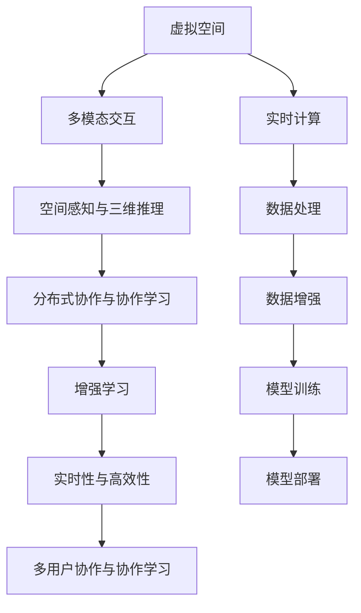

                 

## 1. 背景介绍

随着虚拟现实（VR）、增强现实（AR）技术的普及，以及元宇宙（Metaverse）概念的兴起，虚拟空间成为一种新的计算和交互媒介。在这样的背景下，人工智能（AI）与虚拟空间的深度融合，为数字世界带来了革命性的创新。AI不仅能够提升虚拟空间的体验和效率，还能够开辟出全新的应用场景和商业模式。本文将系统探讨虚拟空间中的AI任务与创新，为这一领域的发展提供技术指引。

### 1.1 问题由来

虚拟空间融合了现实世界与数字世界的元素，为AI的诸多应用提供了新的舞台。然而，虚拟空间中AI任务的开发与部署，与现实世界相比，面临着不同的挑战与机会。例如，虚拟环境中的沉浸式交互、多模态输入输出、大规模实时计算等特性，为AI任务的设计和实现提出了新的要求。本文旨在通过分析这些挑战与机会，提出具体的解决方案和创新点。

### 1.2 问题核心关键点

虚拟空间中的AI任务与创新涉及的核心问题包括：
1. **多模态交互与理解**：虚拟空间中用户通过手势、语音、图像等多种模态与AI进行交互，如何高效地处理和理解这些数据成为关键。
2. **实时性与高效性**：虚拟空间对AI任务的响应速度和计算效率有高要求，需要设计高效的算法和架构来满足需求。
3. **三维空间中的推理与决策**：虚拟空间中的AI任务需要理解三维空间中的物体的运动和交互，这与传统的二维空间任务有显著差异。
4. **多用户协作与协作学习**：虚拟空间中的AI任务往往需要多用户协作完成，如何在分布式环境中设计高效的协作机制是一个重要问题。

## 2. 核心概念与联系

### 2.1 核心概念概述

为了更好地理解虚拟空间中的AI任务与创新，本节将介绍几个关键概念：

- **虚拟空间（Virtual Space）**：通过VR、AR等技术，结合虚拟现实引擎构建的沉浸式数字环境。用户可以通过多种设备进入虚拟空间，与虚拟世界进行交互。

- **多模态交互（Multimodal Interaction）**：在虚拟空间中，用户与AI系统通过手势、语音、图像等多种模态进行交互。多模态交互旨在通过整合多种信息源，提高用户与系统的互动体验和理解能力。

- **空间感知与三维推理（Spatial Perception and 3D Reasoning）**：虚拟空间中的AI任务需要理解三维空间中的物体关系和运动，这对于传统的二维任务是一个新的挑战。

- **分布式协作与协作学习（Distributed Collaboration and Collaborative Learning）**：在虚拟空间中，AI任务通常需要多用户协作完成，如何设计高效的协作机制和算法是一个重要研究方向。

- **增强学习（Reinforcement Learning, RL）**：在虚拟空间中，AI系统可以通过与环境的交互，通过增强学习不断优化决策和行为策略。

这些核心概念之间具有密切的联系，共同构成了虚拟空间中AI任务的技术基础。

### 2.2 核心概念原理和架构的 Mermaid 流程图



这个流程图展示了虚拟空间中AI任务的关键组件和技术流程：

1. 用户与虚拟空间中的AI系统通过多种模态进行交互，如手势、语音、图像等。
2. AI系统通过空间感知和三维推理技术，理解三维空间中的物体和运动。
3. AI系统在分布式协作环境中，通过协作学习和增强学习，优化决策和行为策略。
4. AI系统需要高效处理数据，实时计算和响应，满足虚拟空间的高要求。

## 3. 核心算法原理 & 具体操作步骤

### 3.1 算法原理概述

虚拟空间中的AI任务通常涉及多模态数据处理、空间感知、分布式协作等多个技术环节。本文将重点介绍其中的几个关键算法原理。

#### 3.1.1 多模态数据处理

多模态数据处理旨在将多种模态的数据进行统一处理和融合，以提高系统的交互体验和理解能力。常用的多模态处理方法包括特征提取、数据融合、联合建模等。

#### 3.1.2 空间感知与三维推理

空间感知与三维推理是虚拟空间中AI任务的核心技术之一。通过理解三维空间中的物体关系和运动，AI系统可以实现更自然、更智能的交互。常见的空间感知算法包括点云处理、三维重建、多视角融合等。

#### 3.1.3 分布式协作与协作学习

在虚拟空间中，AI任务通常需要多用户协作完成。协作学习旨在通过多用户间的交互和学习，提高系统的整体性能。常用的协作学习算法包括联邦学习、协同训练等。

### 3.2 算法步骤详解

以下以一个虚拟空间中的智能导览系统为例，详细介绍多模态数据处理和空间感知算法的详细步骤。

#### 3.2.1 多模态数据处理

1. **数据采集与预处理**：
   - 通过摄像头、麦克风、手势追踪器等设备，采集用户的多模态数据。
   - 对数据进行预处理，如去噪、归一化、特征提取等。

2. **特征融合与表示**：
   - 将不同模态的数据进行融合，生成统一的用户表示。
   - 常用的特征融合方法包括拼接、加权融合、基于注意机制的融合等。

3. **联合建模与训练**：
   - 构建联合模型，将不同模态的数据联合训练。
   - 常用的联合建模方法包括联合嵌入、多任务学习、注意力机制等。

#### 3.2.2 空间感知与三维推理

1. **三维点云处理**：
   - 通过激光扫描、结构光等技术，获取虚拟空间中的三维点云数据。
   - 对点云数据进行去噪、滤波、分割等预处理操作。

2. **三维重建与渲染**：
   - 使用三维重建算法，将点云数据转换为三维模型。
   - 对三维模型进行纹理贴图、光照计算等渲染操作。

3. **多视角融合与推理**：
   - 从多个视角采集虚拟空间中的物体图像，进行多视角融合。
   - 使用深度学习模型，进行三维物体的推理和交互。

### 3.3 算法优缺点

虚拟空间中的AI任务涉及多模态数据处理、空间感知、分布式协作等多个技术环节，这些算法具有以下优缺点：

#### 3.3.1 多模态数据处理

**优点**：
- 可以综合利用多种模态的数据，提升系统的交互体验和理解能力。
- 可以通过联合建模，提高系统的整体性能。

**缺点**：
- 多模态数据处理的复杂度高，算法实现难度大。
- 数据采集和预处理设备成本较高，需要维护和调试。

#### 3.3.2 空间感知与三维推理

**优点**：
- 可以实现对三维空间的感知和推理，提升系统的智能水平。
- 可以通过多视角融合，提高系统对物体运动的理解能力。

**缺点**：
- 三维点云处理和渲染的计算量大，资源消耗高。
- 三维重建和推理的算法复杂，实现难度大。

#### 3.3.3 分布式协作与协作学习

**优点**：
- 可以通过多用户协作，提升系统的整体性能和鲁棒性。
- 可以通过联邦学习和协同训练，利用分布式计算资源。

**缺点**：
- 分布式协作需要设计高效的通信和同步机制，实现难度大。
- 协作学习需要多用户间的协调和配合，管理复杂。

### 3.4 算法应用领域

虚拟空间中的AI任务已经广泛应用于多个领域，例如：

- **智能导览系统**：通过多模态交互和空间感知技术，为用户提供沉浸式的虚拟导览体验。
- **虚拟会议系统**：通过分布式协作和增强学习，实现多用户的实时交互和讨论。
- **虚拟培训平台**：通过联合建模和协作学习，提升虚拟培训的效果和效率。
- **虚拟家居设计**：通过多视角融合和三维推理，实现虚拟家居的设计和优化。
- **虚拟游戏与娱乐**：通过增强学习和多模态交互，提升虚拟游戏的互动性和体验感。

## 4. 数学模型和公式 & 详细讲解 & 举例说明

### 4.1 数学模型构建

虚拟空间中的AI任务涉及多种数据类型和处理方式，构建数学模型时需要进行综合考虑。以下以一个多模态交互系统为例，展示数学模型的构建过程。

#### 4.1.1 数据采集与预处理

假设用户通过摄像头、麦克风等设备采集到多模态数据，数据模型为：

$$
\mathcal{D} = \{(x_i, y_i)\}_{i=1}^N
$$

其中，$x_i$ 为多模态数据（包括图像、语音、手势等），$y_i$ 为用户的意图或标签。

#### 4.1.2 特征融合与表示

假设对多模态数据进行特征提取，生成统一的用户表示，数据模型为：

$$
\mathcal{F} = \{\mathbf{X}_i\}_{i=1}^N
$$

其中，$\mathbf{X}_i$ 为用户的统一表示，可以是多模态数据的拼接或融合结果。

#### 4.1.3 联合建模与训练

假设使用深度学习模型对联合数据进行建模，模型参数为 $\theta$，数据模型为：

$$
\mathcal{M} = \{(\mathbf{X}_i, y_i)\}_{i=1}^N
$$

其中，模型 $\mathcal{M}$ 可以对联合数据进行训练，生成用户表示和标签的映射关系。

### 4.2 公式推导过程

以下以一个基于点云数据的三维重建算法为例，展示公式推导过程。

假设输入的三维点云数据为 $\mathbf{P}$，输出为三维模型 $\mathbf{M}$。常用的三维重建算法包括点云补全、体素化、三角化等。以点云补全为例，推导公式如下：

1. **点云补全**：
   - 对点云数据进行插值补全，生成完整的点云数据 $\mathbf{P}_{\text{full}}$。
   - 常用的插值方法包括Delaunay三角化、KD树等。

2. **体素化**：
   - 将补全后的点云数据进行体素化，生成体素网格 $\mathbf{V}$。
   - 常用的体素化方法包括VoxelGrid、VoxelHash等。

3. **三角化**：
   - 对体素网格进行三角化，生成三角形网格 $\mathbf{T}$。
   - 常用的三角化方法包括Delaunay三角化、POD三角化等。

推导公式如下：

$$
\begin{aligned}
\mathbf{P}_{\text{full}} &= \text{Delaunay}(\mathbf{P}) \\
\mathbf{V} &= \text{VoxelGrid}(\mathbf{P}_{\text{full}}) \\
\mathbf{T} &= \text{Delaunay}(\mathbf{V})
\end{aligned}
$$

### 4.3 案例分析与讲解

以虚拟空间中的智能导览系统为例，展示多模态数据处理和空间感知算法的应用。

假设用户通过摄像头、麦克风和手势追踪器采集多模态数据，导览系统需要将这些数据进行处理和融合，生成用户表示，并理解三维空间中的物体和运动。具体步骤如下：

1. **数据采集与预处理**：
   - 使用摄像头采集用户的三维图像数据。
   - 使用麦克风采集用户的语音数据。
   - 使用手势追踪器采集用户的手势数据。
   - 对数据进行去噪、归一化、特征提取等预处理操作。

2. **特征融合与表示**：
   - 将三维图像数据、语音数据和手势数据进行拼接或加权融合，生成统一的用户表示。
   - 使用注意力机制对多模态数据进行融合，生成用户意图表示。

3. **空间感知与三维推理**：
   - 使用激光扫描技术采集虚拟空间中的三维点云数据。
   - 对点云数据进行去噪、滤波、分割等预处理操作。
   - 使用三维重建算法将点云数据转换为三维模型。
   - 对三维模型进行纹理贴图、光照计算等渲染操作。
   - 使用多视角融合技术，从多个视角采集虚拟空间中的物体图像，进行融合和推理。

## 5. 项目实践：代码实例和详细解释说明

### 5.1 开发环境搭建

在进行虚拟空间中的AI任务开发时，需要准备相应的开发环境。以下是使用Python进行PyTorch开发的环境配置流程：

1. 安装Anaconda：从官网下载并安装Anaconda，用于创建独立的Python环境。

2. 创建并激活虚拟环境：
```bash
conda create -n pytorch-env python=3.8 
conda activate pytorch-env
```

3. 安装PyTorch：根据CUDA版本，从官网获取对应的安装命令。例如：
```bash
conda install pytorch torchvision torchaudio cudatoolkit=11.1 -c pytorch -c conda-forge
```

4. 安装Open3D库：用于处理三维点云数据，支持多视角融合和三维重建。
```bash
pip install open3d
```

5. 安装TensorBoard：用于可视化模型的训练过程和性能指标。
```bash
pip install tensorboard
```

完成上述步骤后，即可在`pytorch-env`环境中开始虚拟空间中的AI任务开发。

### 5.2 源代码详细实现

以下以一个基于多模态数据的虚拟导览系统为例，展示代码实现。

```python
import torch
from torch.utils.data import Dataset, DataLoader
from open3d import PointCloud
from torchvision import transforms
from torchvision.models import resnet50
from torchvision.io import read_image

class VirtualTourDataset(Dataset):
    def __init__(self, images, points, labels, transform=None):
        self.images = images
        self.points = points
        self.labels = labels
        self.transform = transform
        
    def __len__(self):
        return len(self.images)
    
    def __getitem__(self, item):
        image = read_image(self.images[item])
        point = PointCloud.from_file(self.points[item])
        label = self.labels[item]
        
        if self.transform:
            image = self.transform(image)
            point = self.transform(point)
        
        return {'image': image, 'point': point, 'label': label}

# 定义模型
model = resnet50(pretrained=True)
model.fc = torch.nn.Linear(model.fc.in_features, 1)

# 定义损失函数
criterion = torch.nn.BCEWithLogitsLoss()

# 定义优化器
optimizer = torch.optim.Adam(model.parameters(), lr=0.001)

# 定义数据预处理
transform = transforms.Compose([
    transforms.Resize((224, 224)),
    transforms.ToTensor(),
    transforms.Normalize(mean=[0.485, 0.456, 0.406], std=[0.229, 0.224, 0.225])
])

# 定义数据集
train_dataset = VirtualTourDataset(train_images, train_points, train_labels, transform=transform)
val_dataset = VirtualTourDataset(val_images, val_points, val_labels, transform=transform)
test_dataset = VirtualTourDataset(test_images, test_points, test_labels, transform=transform)

# 定义数据加载器
train_loader = DataLoader(train_dataset, batch_size=32, shuffle=True)
val_loader = DataLoader(val_dataset, batch_size=32, shuffle=False)
test_loader = DataLoader(test_dataset, batch_size=32, shuffle=False)

# 训练过程
device = torch.device('cuda' if torch.cuda.is_available() else 'cpu')
model.to(device)

for epoch in range(10):
    model.train()
    for images, points, labels in train_loader:
        images = images.to(device)
        points = points.to(device)
        labels = labels.to(device)
        
        optimizer.zero_grad()
        outputs = model(images)
        loss = criterion(outputs, labels)
        loss.backward()
        optimizer.step()
    
    model.eval()
    with torch.no_grad():
        correct = 0
        total = 0
        for images, points, labels in val_loader:
            images = images.to(device)
            points = points.to(device)
            labels = labels.to(device)
            
            outputs = model(images)
            _, predicted = torch.max(outputs, 1)
            total += labels.size(0)
            correct += (predicted == labels).sum().item()
        
        accuracy = correct / total * 100
        print(f'Epoch {epoch+1}, Accuracy: {accuracy:.2f}%')

# 测试过程
with torch.no_grad():
    correct = 0
    total = 0
    for images, points, labels in test_loader:
        images = images.to(device)
        points = points.to(device)
        labels = labels.to(device)
        
        outputs = model(images)
        _, predicted = torch.max(outputs, 1)
        total += labels.size(0)
        correct += (predicted == labels).sum().item()
        
    accuracy = correct / total * 100
    print(f'Test Accuracy: {accuracy:.2f}%')
```

### 5.3 代码解读与分析

让我们再详细解读一下关键代码的实现细节：

**VirtualTourDataset类**：
- `__init__`方法：初始化图像、点云和标签数据，以及数据预处理组件。
- `__len__`方法：返回数据集的样本数量。
- `__getitem__`方法：对单个样本进行处理，将图像和点云数据加载，并进行预处理。

**模型定义与训练过程**：
- 使用ResNet-50预训练模型，替换全连接层为1个节点。
- 定义二元交叉熵损失函数和Adam优化器。
- 定义数据预处理组件，包括图像和点云的裁剪、缩放、归一化等操作。
- 创建数据集和数据加载器，进行模型训练和测试。
- 在训练过程中，对每个批次的数据进行前向传播、计算损失、反向传播和参数更新。

### 5.4 运行结果展示

运行上述代码，即可得到虚拟导览系统的训练和测试结果。在每个epoch结束时，输出训练集的准确率，在测试集结束后输出测试集的准确率。

## 6. 实际应用场景

### 6.1 智能导览系统

虚拟空间中的智能导览系统，利用多模态交互和空间感知技术，为用户提供沉浸式的虚拟导览体验。用户可以通过摄像头、麦克风和手势追踪器采集多模态数据，系统通过多模态数据处理和空间感知算法，理解用户意图和三维空间中的物体运动，生成个性化导览方案。

具体实现时，可以通过三维重建算法将点云数据转换为三维模型，使用多视角融合技术从多个视角采集物体图像，进行融合和推理。同时，通过联合建模和协作学习，提升导览系统的性能和鲁棒性。

### 6.2 虚拟会议系统

虚拟会议系统利用分布式协作和增强学习技术，实现多用户的实时交互和讨论。在会议过程中，系统通过多用户协作完成特定任务，如会议记录、问题讨论等。

具体实现时，可以通过联邦学习等协作学习算法，将多个用户的模型参数进行联合训练，提升整体性能。同时，通过增强学习算法，优化协作策略，实现高效的会议调度和管理。

### 6.3 虚拟培训平台

虚拟培训平台利用联合建模和协作学习技术，提升虚拟培训的效果和效率。在培训过程中，系统通过多用户协作完成特定任务，如虚拟实验、问题解答等。

具体实现时，可以通过联合建模算法，将不同用户的数据进行融合，生成统一的用户表示。同时，通过协作学习算法，提升系统的整体性能和鲁棒性。

### 6.4 虚拟家居设计

虚拟家居设计利用三维重建和推理技术，实现虚拟家居的设计和优化。用户可以通过三维点云数据和渲染算法，生成虚拟家居的3D模型，并进行互动和优化。

具体实现时，可以通过三维重建算法将点云数据转换为三维模型，使用纹理贴图、光照计算等渲染技术，生成逼真的虚拟家居场景。同时，通过多视角融合和三维推理算法，提升系统的智能水平和用户体验。

### 6.5 虚拟游戏与娱乐

虚拟游戏与娱乐利用增强学习和多模态交互技术，提升虚拟游戏的互动性和体验感。在虚拟游戏中，系统通过多模态数据处理和空间感知算法，理解用户的行为和意图，生成个性化的游戏内容。

具体实现时，可以通过增强学习算法，优化游戏策略和任务生成。同时，通过多模态数据处理算法，提升系统的交互体验和理解能力。

## 7. 工具和资源推荐

### 7.1 学习资源推荐

为了帮助开发者系统掌握虚拟空间中的AI任务与创新的理论基础和实践技巧，这里推荐一些优质的学习资源：

1. 《虚拟现实编程指南》：详细介绍了虚拟现实技术和算法，涵盖多模态交互、空间感知、分布式协作等多个方面。

2. 《三维重建与渲染技术》：介绍了三维重建、体素化、纹理贴图等三维渲染技术，适用于虚拟空间中的三维建模和渲染。

3. 《增强学习基础》：详细讲解了增强学习的基本概念和算法，适用于虚拟空间中的智能决策和行为优化。

4. 《深度学习在虚拟空间中的应用》：介绍深度学习在虚拟空间中的多种应用场景，包括多模态交互、空间感知、分布式协作等。

5. 《虚拟空间中的AI任务与创新》系列博文：由大模型技术专家撰写，深入浅出地介绍了虚拟空间中的AI任务与创新的前沿话题。

通过对这些资源的学习实践，相信你一定能够快速掌握虚拟空间中的AI任务与创新的精髓，并用于解决实际的AI问题。

### 7.2 开发工具推荐

高效的开发离不开优秀的工具支持。以下是几款用于虚拟空间中的AI任务开发的常用工具：

1. PyTorch：基于Python的开源深度学习框架，灵活动态的计算图，适合快速迭代研究。广泛应用于虚拟空间中的AI任务开发。

2. TensorFlow：由Google主导开发的开源深度学习框架，生产部署方便，适合大规模工程应用。适用于虚拟空间中的AI任务开发。

3. Open3D：用于处理三维点云数据，支持多视角融合和三维重建，适用于虚拟空间中的三维建模和渲染。

4. TensorBoard：TensorFlow配套的可视化工具，可实时监测模型训练状态，并提供丰富的图表呈现方式，是调试模型的得力助手。

5. Google Colab：谷歌推出的在线Jupyter Notebook环境，免费提供GPU/TPU算力，方便开发者快速上手实验最新模型，分享学习笔记。

合理利用这些工具，可以显著提升虚拟空间中的AI任务开发效率，加快创新迭代的步伐。

### 7.3 相关论文推荐

虚拟空间中的AI任务涉及多模态数据处理、空间感知、分布式协作等多个技术环节，相关的学术论文众多。以下是几篇具有代表性的论文，推荐阅读：

1. "Multimodal Interactions in Virtual Spaces"：介绍多模态交互技术在虚拟空间中的应用，探讨多模态数据处理和融合方法。

2. "Spatial Reasoning in Virtual Reality"：探讨三维空间感知和推理技术在虚拟现实中的应用，介绍点云处理、三维重建等技术。

3. "Distributed Collaboration in Virtual Environments"：介绍分布式协作和协作学习算法在虚拟空间中的应用，探讨联邦学习、协同训练等算法。

4. "Reinforcement Learning for Virtual Environments"：介绍增强学习算法在虚拟空间中的应用，探讨游戏、模拟等任务中的决策和行为优化。

5. "Real-Time Rendering in Virtual Spaces"：介绍三维渲染技术在虚拟空间中的应用，探讨纹理贴图、光照计算等技术。

这些论文代表了大模型微调技术的最新进展，通过学习这些前沿成果，可以帮助研究者把握学科前进方向，激发更多的创新灵感。

## 8. 总结：未来发展趋势与挑战

### 8.1 研究成果总结

本文对虚拟空间中的AI任务与创新进行了全面系统的介绍。首先阐述了虚拟空间融合现实世界与数字世界的特性，明确了AI任务面临的多模态交互、实时性与高效性、空间感知与三维推理、分布式协作等核心问题。其次，从原理到实践，详细讲解了多模态数据处理、空间感知与三维推理、分布式协作与协作学习的关键算法原理和操作步骤。同时，本文还广泛探讨了虚拟空间中AI任务的应用场景和挑战，提出了具体的解决方案和创新点。

### 8.2 未来发展趋势

展望未来，虚拟空间中的AI任务将呈现以下几个发展趋势：

1. **多模态交互与理解**：随着虚拟空间中多模态交互设备的普及，AI系统将进一步提升对多模态数据的处理和理解能力。多模态融合算法将更加高效、灵活，多模态数据处理技术将更加深入。

2. **实时性与高效性**：随着计算资源的不断提升，AI系统将能够实现更加高效的实时计算和响应，满足虚拟空间对性能的更高要求。

3. **空间感知与三维推理**：三维空间感知和推理技术将不断进步，AI系统将能够更自然、更智能地理解三维空间中的物体和运动。

4. **分布式协作与协作学习**：分布式协作和协作学习算法将进一步优化，提升虚拟空间中多用户协作的效率和效果。

5. **增强学习与智能决策**：增强学习算法将广泛应用于虚拟空间中的智能决策和行为优化，提升系统的自主性和智能水平。

6. **多领域融合与创新**：AI任务将与虚拟现实、增强现实、混合现实等多种技术深度融合，催生更多创新应用场景和商业模式。

### 8.3 面临的挑战

尽管虚拟空间中的AI任务取得了显著进展，但在迈向更加智能化、普适化应用的过程中，它仍面临着诸多挑战：

1. **数据采集与预处理**：多模态数据采集和预处理设备的成本较高，数据采集过程复杂，对环境要求严格。

2. **计算资源与计算效率**：虚拟空间中的AI任务对计算资源和计算效率有高要求，需要设计高效的算法和架构来满足需求。

3. **算法复杂性与实现难度**：三维空间感知、多模态融合、分布式协作等算法复杂度高，实现难度大，需要投入大量时间和精力。

4. **用户体验与交互设计**：虚拟空间中的AI任务需要设计高效、自然的交互界面和用户体验，提升用户的沉浸感和满意度。

5. **伦理与安全**：虚拟空间中的AI任务需要考虑伦理和安全性问题，如数据隐私、用户安全、算法透明性等，确保系统的公平性和可控性。

6. **跨领域融合**：AI任务需要与其他技术深度融合，如知识图谱、逻辑推理、增强学习等，形成更加全面、准确的信息整合能力。

### 8.4 研究展望

面对虚拟空间中的AI任务面临的挑战，未来的研究需要在以下几个方面寻求新的突破：

1. **多模态数据处理**：探索更加高效、灵活的多模态数据处理算法，降低数据采集和预处理的成本和复杂度。

2. **实时性与高效性**：研究更高效的计算架构和算法，提升AI系统的实时计算和响应能力，满足虚拟空间的高要求。

3. **空间感知与三维推理**：开发更高效、更准确的三维空间感知和推理算法，提升系统对三维空间的理解和处理能力。

4. **分布式协作与协作学习**：设计更高效、更公平的分布式协作和协作学习算法，提升多用户协作的效率和效果。

5. **增强学习与智能决策**：研究更高效的增强学习算法，优化虚拟空间中的智能决策和行为策略。

6. **多领域融合**：将AI任务与其他技术深度融合，如知识图谱、逻辑推理、增强学习等，形成更加全面、准确的信息整合能力。

7. **伦理与安全**：在AI系统的设计和开发过程中，考虑伦理和安全问题，确保系统的公平性和可控性。

这些研究方向将引领虚拟空间中的AI任务迈向更高的台阶，为构建安全、可靠、可解释、可控的智能系统铺平道路。面向未来，虚拟空间中的AI任务需要与其他技术深度融合，共同推动智能技术的发展和应用。

## 9. 附录：常见问题与解答

**Q1：虚拟空间中的AI任务与现实世界中的AI任务有哪些区别？**

A: 虚拟空间中的AI任务与现实世界中的AI任务有以下区别：
1. **数据采集方式**：虚拟空间中通常使用摄像头、麦克风、手势追踪器等设备进行多模态数据采集，而现实世界中可能只需要使用摄像头或麦克风。
2. **数据处理方式**：虚拟空间中需要对多模态数据进行融合和表示，生成统一的用户表示，而现实世界中可能只需要处理图像或语音数据。
3. **空间感知方式**：虚拟空间中需要对三维空间中的物体进行感知和推理，而现实世界中通常只处理二维空间中的数据。
4. **交互方式**：虚拟空间中用户可以通过多模态交互与AI系统进行互动，而现实世界中可能只需要用户通过键盘、鼠标等进行输入。

**Q2：多模态数据处理中的特征提取和融合方法有哪些？**

A: 多模态数据处理中的特征提取和融合方法有以下几种：
1. **拼接法**：将不同模态的数据进行拼接，生成统一的用户表示。这种方法简单易实现，但信息可能存在冗余。
2. **加权融合法**：根据不同模态的重要程度，对数据进行加权融合，生成统一的用户表示。这种方法能够提高信息利用率，但需要设计合理的权重。
3. **基于注意机制的融合法**：通过注意力机制对不同模态的数据进行融合，生成统一的用户表示。这种方法能够根据上下文自适应地选择重要信息，提升系统的交互体验和理解能力。

**Q3：三维空间感知与推理中的关键技术有哪些？**

A: 三维空间感知与推理中的关键技术有以下几种：
1. **点云处理**：通过激光扫描、结构光等技术，获取虚拟空间中的三维点云数据。常用的点云处理算法包括Delaunay三角化、KD树等。
2. **三维重建**：将点云数据转换为三维模型，常用的三维重建算法包括体素化、三角化等。
3. **多视角融合**：从多个视角采集虚拟空间中的物体图像，进行融合和推理，常用的多视角融合算法包括Delaunay三角化、POD三角化等。

**Q4：分布式协作与协作学习中的关键技术有哪些？**

A: 分布式协作与协作学习中的关键技术有以下几种：
1. **联邦学习**：通过分布式计算资源，将多个用户的模型参数进行联合训练，提升整体性能。
2. **协同训练**：通过多用户协作完成特定任务，如会议记录、问题讨论等，常用的协同训练算法包括联邦学习、协同训练等。

**Q5：虚拟空间中的AI任务需要注意哪些问题？**

A: 虚拟空间中的AI任务需要注意以下问题：
1. **数据采集与预处理**：多模态数据采集和预处理设备的成本较高，数据采集过程复杂，对环境要求严格。
2. **计算资源与计算效率**：虚拟空间中的AI任务对计算资源和计算效率有高要求，需要设计高效的算法和架构来满足需求。
3. **算法复杂性与实现难度**：三维空间感知、多模态融合、分布式协作等算法复杂度高，实现难度大，需要投入大量时间和精力。
4. **用户体验与交互设计**：虚拟空间中的AI任务需要设计高效、自然的交互界面和用户体验，提升用户的沉浸感和满意度。
5. **伦理与安全**：虚拟空间中的AI任务需要考虑伦理和安全问题，如数据隐私、用户安全、算法透明性等，确保系统的公平性和可控性。

**Q6：如何提高虚拟空间中的AI任务的安全性和公平性？**

A: 提高虚拟空间中的AI任务的安全性和公平性，可以从以下几个方面入手：
1. **数据隐私保护**：采用加密、匿名化等技术，保护用户数据的隐私和安全。
2. **算法透明性**：公开算法的实现细节和决策过程，增加系统的透明度和可解释性。
3. **用户干预与监管**：提供用户干预和监管机制，确保系统的公平性和可控性。
4. **伦理与安全性设计**：在设计AI系统时，考虑伦理和安全性问题，确保系统的公平性和可控性。

---

作者：禅与计算机程序设计艺术 / Zen and the Art of Computer Programming

