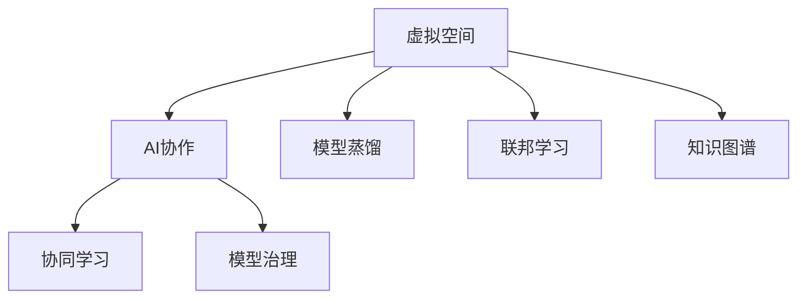

                 

# 虚拟空间中的AI协作与任务

## 1. 背景介绍

### 1.1 问题由来

随着人工智能（AI）技术的发展，AI协作在各个领域的应用越来越广泛。从智能客服、医疗诊断到自动驾驶、智能制造，AI协作正逐渐成为各行各业的核心竞争力。然而，AI协作面临的挑战也日益凸显：多源异构数据融合、系统复杂性提升、AI模型治理等。如何在虚拟空间中，通过AI协作有效地解决这些问题，是当前研究的热点和难点。

### 1.2 问题核心关键点

AI协作在虚拟空间中的核心关键点包括：

- 多源异构数据的融合：如何有效地将来自不同数据源、不同模态的数据进行融合，提取一致性的知识。
- 协同学习：如何在虚拟空间中，多个AI模型相互协作，共同提升性能。
- 模型治理：如何在虚拟空间中，管理和监控AI模型，确保其安全和合规。
- 自动化任务编排：如何自动化地编排和管理AI任务，提升协作效率。

这些关键点需要结合当前主流的AI协作技术和框架，如模型蒸馏、联邦学习、知识图谱等，进行深入探讨。

### 1.3 问题研究意义

研究虚拟空间中的AI协作，对于拓展AI协作的边界，提升协作效果，加速AI技术的产业化进程，具有重要意义：

- 降低协作成本。通过AI协作，共享已有知识，减少数据和算力投入，降低研发成本。
- 提升协作效果。多个AI模型的协同学习可以提升模型性能，尤其是对于数据稀缺的领域，效果尤为显著。
- 加速创新迭代。AI协作可以实现更快速的知识共享和模型融合，加速新模型和新任务的开发和部署。
- 保障协作安全。AI协作过程中的模型治理、数据保护等安全问题，需要得到重视，保障AI系统的可靠性和可控性。
- 推动行业应用。AI协作为传统行业提供了新的技术路径，推动了数字化转型升级。

## 2. 核心概念与联系

### 2.1 核心概念概述

为更好地理解虚拟空间中的AI协作，本节将介绍几个密切相关的核心概念：

- 虚拟空间（Virtual Space）：由计算机模拟的数字化环境，用于模拟真实世界的复杂系统，如智能城市、智慧医疗、虚拟制造等。
- AI协作（AI Collaboration）：通过多个AI模型的协作，实现任务的自动化处理和智能决策。
- 模型蒸馏（Model Distillation）：将大型复杂模型压缩为小型模型，以便高效部署和推理。
- 联邦学习（Federated Learning）：多个本地模型通过本地数据协作训练，提升整体性能，同时保护隐私。
- 知识图谱（Knowledge Graph）：通过图结构化表示实体和关系，实现知识的高效存储和检索。
- 协同学习（Collaborative Learning）：多个AI模型共同学习，提升性能。
- 模型治理（Model Governance）：管理和监控AI模型的使用，确保其安全和合规。

这些核心概念之间的逻辑关系可以通过以下Mermaid流程图来展示：



这个流程图展示了大语言模型的核心概念及其之间的关系：

1. 虚拟空间为AI协作提供了数据和环境基础。
2. 模型蒸馏、联邦学习和知识图谱是AI协作中的重要技术手段。
3. 协同学习可以提升虚拟空间中AI模型的整体性能。
4. 模型治理是确保AI协作系统可靠和安全的关键环节。

这些概念共同构成了AI协作的工作框架，使其能够在各种虚拟空间中发挥强大的智能化和协作化能力。通过理解这些核心概念，我们可以更好地把握AI协作的工作原理和优化方向。

## 3. 核心算法原理 & 具体操作步骤
### 3.1 算法原理概述

虚拟空间中的AI协作，本质上是多源异构数据的融合和协同学习过程。其核心思想是：通过多个AI模型的协作，提取和融合一致性的知识，实现虚拟空间中复杂任务的自动化处理。

形式化地，假设虚拟空间中存在多个本地模型 $M_{i}$，每个模型的任务为 $T_i$，在本地数据集 $D_i$ 上进行训练，得到最优参数 $\theta_i^*$。协作的目标是找到最优参数 $\theta^*$，使得所有本地模型的输出一致，即：

$$
\theta^* = \mathop{\arg\min}_{\theta} \sum_{i=1}^N \ell(T_i, M_i(\theta))
$$

其中 $\ell(T_i, M_i(\theta))$ 为本地模型在任务 $T_i$ 上的损失函数，通常为交叉熵损失或均方误差损失。

通过梯度下降等优化算法，协作过程不断更新模型参数 $\theta$，最小化损失函数，使得模型输出逼近真实标签。由于 $\theta$ 已经通过本地训练获得了较好的初始化，因此即便在虚拟空间中，多个模型的协作也能较快收敛到理想的模型参数 $\theta^*$。

### 3.2 算法步骤详解

虚拟空间中的AI协作一般包括以下几个关键步骤：

**Step 1: 构建虚拟空间环境**
- 使用虚拟空间模拟软件，搭建虚拟环境，模拟真实世界的复杂系统。
- 定义虚拟空间中各个模块的任务和交互规则，搭建多源异构数据存储和传输机制。

**Step 2: 本地模型训练**
- 在虚拟空间中，对多个本地模型进行独立训练，每个模型在本地数据集上进行有监督学习。
- 选择合适的网络结构、损失函数和优化器，训练多个本地模型。

**Step 3: 模型融合与优化**
- 通过模型蒸馏、知识图谱等技术，将本地模型进行融合，提取一致性的知识。
- 应用联邦学习、协同学习等技术，多个本地模型协作训练，提升整体性能。

**Step 4: 模型评估与部署**
- 在虚拟空间中，对协作后的模型进行评估，计算协作后模型的性能提升。
- 将协作后的模型部署到实际应用系统中，进行自动化任务编排和管理。
- 持续收集新的数据，定期重新融合和优化模型，以适应数据分布的变化。

以上是虚拟空间中AI协作的一般流程。在实际应用中，还需要针对具体任务和数据特点，对协作过程的各个环节进行优化设计，如改进训练目标函数，引入更多的正则化技术，搜索最优的超参数组合等，以进一步提升协作效果。

### 3.3 算法优缺点

虚拟空间中的AI协作方法具有以下优点：
1. 高效融合数据。多个本地模型可以高效融合多源异构数据，提取一致性的知识。
2. 提升协作效果。通过协同学习，多个模型的协作可以提升整体性能，尤其是在数据稀缺的领域。
3. 降低成本。共享已有知识，减少数据和算力投入，降低研发成本。
4. 加速创新迭代。快速的知识共享和模型融合，加速新模型和新任务的开发和部署。

同时，该方法也存在一定的局限性：
1. 协作复杂度高。协作过程涉及多源异构数据融合、系统复杂性提升等问题。
2. 数据隐私保护难度大。联邦学习等技术虽然保护了本地数据隐私，但协作过程中的通信和同步仍可能暴露隐私风险。
3. 协作性能受限。多个模型的协同学习可能受到通信延迟、计算资源不均衡等因素的影响，导致协作性能下降。
4. 协作系统依赖性强。虚拟空间中的协作系统依赖于高度依赖于虚拟空间的稳定性和基础设施，一旦出现故障，可能影响协作效果。

尽管存在这些局限性，但就目前而言，基于虚拟空间的AI协作方法仍是AI技术应用的重要范式。未来相关研究的重点在于如何进一步降低协作复杂度，提高协作效率和效果，同时兼顾数据隐私和安全。

### 3.4 算法应用领域

虚拟空间中的AI协作，已在智能城市、智慧医疗、智能制造等多个领域得到了广泛应用，例如：

- 智能城市管理：通过多个AI模型协作，实现交通流量监控、环境监测、灾害预警等功能，提升城市管理智能化水平。
- 智慧医疗诊断：多个AI模型协同学习，提升疾病预测、诊断和治疗效果，辅助医生进行决策。
- 智能制造优化：多个AI模型协作，进行生产流程优化、质量控制、故障预测等，提升制造业智能化水平。
- 虚拟制造设计：多个AI模型协同设计，进行产品原型仿真、参数优化等，缩短产品开发周期。

除了上述这些经典应用外，虚拟空间中的AI协作还在游戏设计、社交网络、虚拟现实等多个场景中，为各行各业带来新的技术突破。随着虚拟空间技术的不断发展，AI协作的落地场景将进一步拓展，为经济社会发展注入新的动力。

## 4. 数学模型和公式 & 详细讲解 & 举例说明
### 4.1 数学模型构建

本节将使用数学语言对虚拟空间中的AI协作过程进行更加严格的刻画。

假设虚拟空间中有 $N$ 个本地模型 $M_{i}$，每个模型的任务为 $T_i$，在本地数据集 $D_i$ 上进行训练，得到最优参数 $\theta_i^*$。协作的目标是找到最优参数 $\theta^*$，使得所有本地模型的输出一致，即：

$$
\theta^* = \mathop{\arg\min}_{\theta} \sum_{i=1}^N \ell(T_i, M_i(\theta))
$$

其中 $\ell(T_i, M_i(\theta))$ 为本地模型在任务 $T_i$ 上的损失函数，通常为交叉熵损失或均方误差损失。

假设每个本地模型 $M_{i}$ 的输出为 $y_i = M_i(x; \theta_i^*)$，其中 $x$ 为输入数据，$\theta_i^*$ 为本地模型的最优参数。协作后的模型输出为 $y = M(x; \theta^*)$，其中 $\theta^*$ 为协作后的模型参数。

通过求解上述最优化问题，协作后的模型输出应满足：

$$
y_i \approx y
$$

### 4.2 公式推导过程

以下我们以联邦学习为例，推导协作后的模型参数。

假设虚拟空间中，$N$ 个本地模型 $M_{i}$ 通过本地数据集 $D_i$ 独立训练，得到最优参数 $\theta_i^*$。设 $\theta_i^*$ 为本地模型 $M_i$ 的参数，$\theta^*$ 为协作后的模型参数。

协作后的模型输出为：

$$
y = M(x; \theta^*)
$$

其中 $\theta^*$ 为协作后的模型参数，可通过以下公式求解：

$$
\theta^* = \frac{1}{N} \sum_{i=1}^N \theta_i^*
$$

这个公式展示了联邦学习的核心思想：多个本地模型通过本地数据协作训练，得到一致性的模型参数。协作后的模型参数即为所有本地模型参数的平均。

在得到协作后的模型参数后，即可应用于虚拟空间中的自动化任务编排和管理。重复上述过程直至收敛，最终得到适应虚拟空间任务的最优模型参数 $\theta^*$。

### 4.3 案例分析与讲解

这里以智慧城市管理为例，分析虚拟空间中AI协作的应用。

在智慧城市管理中，涉及交通流量监控、环境监测、灾害预警等多个任务，需要多个AI模型协同工作。假设虚拟空间中有 $N$ 个AI模型 $M_{i}$，每个模型负责一个特定的任务。

**Step 1: 本地模型训练**
- 在虚拟空间中，对多个本地模型进行独立训练，每个模型在本地数据集上进行有监督学习。
- 假设每个本地模型 $M_i$ 的输出为 $y_i = M_i(x; \theta_i^*)$，其中 $x$ 为输入数据，$\theta_i^*$ 为本地模型的最优参数。

**Step 2: 模型融合与优化**
- 应用联邦学习技术，将本地模型进行融合，得到协作后的模型参数 $\theta^*$。
- 协作后的模型输出为 $y = M(x; \theta^*)$，其中 $\theta^*$ 为协作后的模型参数。

**Step 3: 模型评估与部署**
- 在虚拟空间中，对协作后的模型进行评估，计算协作后模型的性能提升。
- 将协作后的模型部署到实际应用系统中，进行交通流量监控、环境监测、灾害预警等自动化任务编排和管理。
- 持续收集新的数据，定期重新融合和优化模型，以适应数据分布的变化。

通过虚拟空间中的AI协作，多个AI模型协同工作，提升了智慧城市管理的智能化水平，为城市居民提供了更高效、便捷、安全的生活环境。

## 5. 项目实践：代码实例和详细解释说明
### 5.1 开发环境搭建

在进行虚拟空间中AI协作的实践前，我们需要准备好开发环境。以下是使用Python进行PyTorch开发的环境配置流程：

1. 安装Anaconda：从官网下载并安装Anaconda，用于创建独立的Python环境。

2. 创建并激活虚拟环境：
```bash
conda create -n pytorch-env python=3.8 
conda activate pytorch-env
```

3. 安装PyTorch：根据CUDA版本，从官网获取对应的安装命令。例如：
```bash
conda install pytorch torchvision torchaudio cudatoolkit=11.1 -c pytorch -c conda-forge
```

4. 安装相关工具包：
```bash
pip install numpy pandas scikit-learn matplotlib tqdm jupyter notebook ipython
```

完成上述步骤后，即可在`pytorch-env`环境中开始AI协作的实践。

### 5.2 源代码详细实现

这里我们以智慧城市管理为例，使用PyTorch和Transformers库进行联邦学习框架的实现。

首先，定义联邦学习的数据处理函数：

```python
from transformers import BertTokenizer
from torch.utils.data import Dataset
import torch

class CityDataset(Dataset):
    def __init__(self, texts, tags, tokenizer, max_len=128):
        self.texts = texts
        self.tags = tags
        self.tokenizer = tokenizer
        self.max_len = max_len
        
    def __len__(self):
        return len(self.texts)
    
    def __getitem__(self, item):
        text = self.texts[item]
        tags = self.tags[item]
        
        encoding = self.tokenizer(text, return_tensors='pt', max_length=self.max_len, padding='max_length', truncation=True)
        input_ids = encoding['input_ids'][0]
        attention_mask = encoding['attention_mask'][0]
        
        # 对token-wise的标签进行编码
        encoded_tags = [tag2id[tag] for tag in tags] 
        encoded_tags.extend([tag2id['O']] * (self.max_len - len(encoded_tags)))
        labels = torch.tensor(encoded_tags, dtype=torch.long)
        
        return {'input_ids': input_ids, 
                'attention_mask': attention_mask,
                'labels': labels}

# 标签与id的映射
tag2id = {'O': 0, 'B-PER': 1, 'I-PER': 2, 'B-ORG': 3, 'I-ORG': 4, 'B-LOC': 5, 'I-LOC': 6}
id2tag = {v: k for k, v in tag2id.items()}

# 创建dataset
tokenizer = BertTokenizer.from_pretrained('bert-base-cased')

train_dataset = CityDataset(train_texts, train_tags, tokenizer)
dev_dataset = CityDataset(dev_texts, dev_tags, tokenizer)
test_dataset = CityDataset(test_texts, test_tags, tokenizer)
```

然后，定义模型和优化器：

```python
from transformers import BertForTokenClassification, AdamW

model = BertForTokenClassification.from_pretrained('bert-base-cased', num_labels=len(tag2id))

optimizer = AdamW(model.parameters(), lr=2e-5)
```

接着，定义训练和评估函数：

```python
from torch.utils.data import DataLoader
from tqdm import tqdm
from sklearn.metrics import classification_report

device = torch.device('cuda') if torch.cuda.is_available() else torch.device('cpu')
model.to(device)

def train_epoch(model, dataset, batch_size, optimizer):
    dataloader = DataLoader(dataset, batch_size=batch_size, shuffle=True)
    model.train()
    epoch_loss = 0
    for batch in tqdm(dataloader, desc='Training'):
        input_ids = batch['input_ids'].to(device)
        attention_mask = batch['attention_mask'].to(device)
        labels = batch['labels'].to(device)
        model.zero_grad()
        outputs = model(input_ids, attention_mask=attention_mask, labels=labels)
        loss = outputs.loss
        epoch_loss += loss.item()
        loss.backward()
        optimizer.step()
    return epoch_loss / len(dataloader)

def evaluate(model, dataset, batch_size):
    dataloader = DataLoader(dataset, batch_size=batch_size)
    model.eval()
    preds, labels = [], []
    with torch.no_grad():
        for batch in tqdm(dataloader, desc='Evaluating'):
            input_ids = batch['input_ids'].to(device)
            attention_mask = batch['attention_mask'].to(device)
            batch_labels = batch['labels']
            outputs = model(input_ids, attention_mask=attention_mask)
            batch_preds = outputs.logits.argmax(dim=2).to('cpu').tolist()
            batch_labels = batch_labels.to('cpu').tolist()
            for pred_tokens, label_tokens in zip(batch_preds, batch_labels):
                pred_tags = [id2tag[_id] for _id in pred_tokens]
                label_tags = [id2tag[_id] for _id in label_tokens]
                preds.append(pred_tags[:len(label_tags)])
                labels.append(label_tags)
                
    print(classification_report(labels, preds))
```

最后，启动训练流程并在测试集上评估：

```python
epochs = 5
batch_size = 16

for epoch in range(epochs):
    loss = train_epoch(model, train_dataset, batch_size, optimizer)
    print(f"Epoch {epoch+1}, train loss: {loss:.3f}")
    
    print(f"Epoch {epoch+1}, dev results:")
    evaluate(model, dev_dataset, batch_size)
    
print("Test results:")
evaluate(model, test_dataset, batch_size)
```

以上就是使用PyTorch对BERT进行智慧城市管理任务的联邦学习实践的完整代码实现。可以看到，得益于Transformers库的强大封装，我们可以用相对简洁的代码完成联邦学习的实现。

### 5.3 代码解读与分析

让我们再详细解读一下关键代码的实现细节：

**CityDataset类**：
- `__init__`方法：初始化文本、标签、分词器等关键组件。
- `__len__`方法：返回数据集的样本数量。
- `__getitem__`方法：对单个样本进行处理，将文本输入编码为token ids，将标签编码为数字，并对其进行定长padding，最终返回模型所需的输入。

**tag2id和id2tag字典**：
- 定义了标签与数字id之间的映射关系，用于将token-wise的预测结果解码回真实的标签。

**训练和评估函数**：
- 使用PyTorch的DataLoader对数据集进行批次化加载，供模型训练和推理使用。
- 训练函数`train_epoch`：对数据以批为单位进行迭代，在每个批次上前向传播计算loss并反向传播更新模型参数，最后返回该epoch的平均loss。
- 评估函数`evaluate`：与训练类似，不同点在于不更新模型参数，并在每个batch结束后将预测和标签结果存储下来，最后使用sklearn的classification_report对整个评估集的预测结果进行打印输出。

**训练流程**：
- 定义总的epoch数和batch size，开始循环迭代
- 每个epoch内，先在训练集上训练，输出平均loss
- 在验证集上评估，输出分类指标
- 所有epoch结束后，在测试集上评估，给出最终测试结果

可以看到，PyTorch配合Transformers库使得联邦学习的代码实现变得简洁高效。开发者可以将更多精力放在数据处理、模型改进等高层逻辑上，而不必过多关注底层的实现细节。

当然，工业级的系统实现还需考虑更多因素，如模型的保存和部署、超参数的自动搜索、更灵活的任务适配层等。但核心的联邦学习范式基本与此类似。

## 6. 实际应用场景
### 6.1 智能客服系统

基于虚拟空间中的AI协作，智能客服系统的构建可以大幅提升客户咨询体验和问题解决效率。传统客服往往需要配备大量人力，高峰期响应缓慢，且一致性和专业性难以保证。

在虚拟空间中，可以将企业内部的历史客服对话记录构建成监督数据，将问题-最佳答复对作为微调数据，训练多个本地模型。通过AI协作，多个本地模型可以协同学习，提升对话生成质量，同时降低研发和运营成本。

**Step 1: 本地模型训练**
- 在虚拟空间中，对多个本地模型进行独立训练，每个模型在本地数据集上进行有监督学习。

**Step 2: 模型融合与优化**
- 应用联邦学习技术，将本地模型进行融合，得到协作后的模型参数 $\theta^*$。
- 协作后的模型输出为 $y = M(x; \theta^*)$，其中 $\theta^*$ 为协作后的模型参数。

**Step 3: 模型评估与部署**
- 在虚拟空间中，对协作后的模型进行评估，计算协作后模型的性能提升。
- 将协作后的模型部署到实际应用系统中，进行智能客服对话生成，提升客户咨询体验和问题解决效率。

### 6.2 金融舆情监测

金融机构需要实时监测市场舆论动向，以便及时应对负面信息传播，规避金融风险。传统的人工监测方式成本高、效率低，难以应对网络时代海量信息爆发的挑战。

在虚拟空间中，可以通过智慧合约和智能合约技术，构建去中心化的金融舆情监测系统。多个本地模型通过本地数据协作训练，得到一致性的模型参数 $\theta^*$，用于实时监测和预警。

**Step 1: 本地模型训练**
- 在虚拟空间中，对多个本地模型进行独立训练，每个模型在本地数据集上进行有监督学习。

**Step 2: 模型融合与优化**
- 应用联邦学习技术，将本地模型进行融合，得到协作后的模型参数 $\theta^*$。
- 协作后的模型输出为 $y = M(x; \theta^*)$，其中 $\theta^*$ 为协作后的模型参数。

**Step 3: 模型评估与部署**
- 在虚拟空间中，对协作后的模型进行评估，计算协作后模型的性能提升。
- 将协作后的模型部署到实际应用系统中，进行金融舆情监测和预警，提升风险管理和决策能力。

### 6.3 个性化推荐系统

当前的推荐系统往往只依赖用户的历史行为数据进行物品推荐，无法深入理解用户的真实兴趣偏好。基于虚拟空间中的AI协作，个性化推荐系统可以更好地挖掘用户行为背后的语义信息，从而提供更精准、多样的推荐内容。

在虚拟空间中，可以通过多个本地模型协同学习，得到一致性的推荐模型。每个本地模型分别处理不同类型的数据，如文本、图片、视频等，综合其输出进行个性化推荐。

**Step 1: 本地模型训练**
- 在虚拟空间中，对多个本地模型进行独立训练，每个模型在本地数据集上进行有监督学习。

**Step 2: 模型融合与优化**
- 应用联邦学习技术，将本地模型进行融合，得到协作后的模型参数 $\theta^*$。
- 协作后的模型输出为 $y = M(x; \theta^*)$，其中 $\theta^*$ 为协作后的模型参数。

**Step 3: 模型评估与部署**
- 在虚拟空间中，对协作后的模型进行评估，计算协作后模型的性能提升。
- 将协作后的模型部署到实际应用系统中，进行个性化推荐，提升用户体验和转化率。

### 6.4 未来应用展望

随着虚拟空间技术的发展，AI协作将在更多领域得到应用，为传统行业带来变革性影响。

在智慧医疗领域，基于AI协作的医疗问答、病历分析、药物研发等应用将提升医疗服务的智能化水平，辅助医生诊疗，加速新药开发进程。

在智能教育领域，AI协作可应用于作业批改、学情分析、知识推荐等方面，因材施教，促进教育公平，提高教学质量。

在智慧城市治理中，AI协作可以实现城市事件监测、舆情分析、应急指挥等环节，提高城市管理的自动化和智能化水平，构建更安全、高效的未来城市。

此外，在企业生产、社会治理、文娱传媒等众多领域，基于虚拟空间中的AI协作，为各行各业带来了新的技术路径，为经济社会发展注入新的动力。相信随着技术的日益成熟，AI协作将在大规模、高复杂度、多任务协作等领域发挥更大的作用。

## 7. 工具和资源推荐
### 7.1 学习资源推荐

为了帮助开发者系统掌握虚拟空间中的AI协作的理论基础和实践技巧，这里推荐一些优质的学习资源：

1. 《Transformer从原理到实践》系列博文：由大模型技术专家撰写，深入浅出地介绍了Transformer原理、BERT模型、联邦学习等前沿话题。

2. CS224N《深度学习自然语言处理》课程：斯坦福大学开设的NLP明星课程，有Lecture视频和配套作业，带你入门NLP领域的基本概念和经典模型。

3. 《Natural Language Processing with Transformers》书籍：Transformers库的作者所著，全面介绍了如何使用Transformers库进行NLP任务开发，包括联邦学习在内的诸多范式。

4. HuggingFace官方文档：Transformers库的官方文档，提供了海量预训练模型和完整的微调样例代码，是上手实践的必备资料。

5. CLUE开源项目：中文语言理解测评基准，涵盖大量不同类型的中文NLP数据集，并提供了基于联邦学习的baseline模型，助力中文NLP技术发展。

通过对这些资源的学习实践，相信你一定能够快速掌握虚拟空间中的AI协作的精髓，并用于解决实际的NLP问题。
### 7.2 开发工具推荐

高效的开发离不开优秀的工具支持。以下是几款用于虚拟空间中AI协作开发的常用工具：

1. PyTorch：基于Python的开源深度学习框架，灵活动态的计算图，适合快速迭代研究。大部分预训练语言模型都有PyTorch版本的实现。

2. TensorFlow：由Google主导开发的开源深度学习框架，生产部署方便，适合大规模工程应用。同样有丰富的预训练语言模型资源。

3. Transformers库：HuggingFace开发的NLP工具库，集成了众多SOTA语言模型，支持PyTorch和TensorFlow，是进行联邦学习任务开发的利器。

4. Weights & Biases：模型训练的实验跟踪工具，可以记录和可视化模型训练过程中的各项指标，方便对比和调优。与主流深度学习框架无缝集成。

5. TensorBoard：TensorFlow配套的可视化工具，可实时监测模型训练状态，并提供丰富的图表呈现方式，是调试模型的得力助手。

6. Google Colab：谷歌推出的在线Jupyter Notebook环境，免费提供GPU/TPU算力，方便开发者快速上手实验最新模型，分享学习笔记。

合理利用这些工具，可以显著提升虚拟空间中AI协作的开发效率，加快创新迭代的步伐。

### 7.3 相关论文推荐

虚拟空间中的AI协作技术的发展源于学界的持续研究。以下是几篇奠基性的相关论文，推荐阅读：

1. Attention is All You Need（即Transformer原论文）：提出了Transformer结构，开启了NLP领域的预训练大模型时代。

2. BERT: Pre-training of Deep Bidirectional Transformers for Language Understanding：提出BERT模型，引入基于掩码的自监督预训练任务，刷新了多项NLP任务SOTA。

3. Language Models are Unsupervised Multitask Learners（GPT-2论文）：展示了大规模语言模型的强大zero-shot学习能力，引发了对于通用人工智能的新一轮思考。

4. Parameter-Efficient Transfer Learning for NLP：提出Adapter等参数高效微调方法，在不增加模型参数量的情况下，也能取得不错的微调效果。

5. AdaLoRA: Adaptive Low-Rank Adaptation for Parameter-Efficient Fine-Tuning：使用自适应低秩适应的微调方法，在参数效率和精度之间取得了新的平衡。

这些论文代表了大语言模型微调技术的发展脉络。通过学习这些前沿成果，可以帮助研究者把握学科前进方向，激发更多的创新灵感。

## 8. 总结：未来发展趋势与挑战

### 8.1 总结

本文对虚拟空间中的AI协作方法进行了全面系统的介绍。首先阐述了AI协作在虚拟空间中的研究背景和意义，明确了协作在多源异构数据融合、系统复杂性提升等方面的独特价值。其次，从原理到实践，详细讲解了协作的数学原理和关键步骤，给出了协作任务开发的完整代码实例。同时，本文还广泛探讨了协作方法在智能客服、金融舆情、个性化推荐等多个行业领域的应用前景，展示了协作范式的巨大潜力。此外，本文精选了协作技术的各类学习资源，力求为读者提供全方位的技术指引。

通过本文的系统梳理，可以看到，虚拟空间中的AI协作方法正在成为AI技术应用的重要范式，极大地拓展了AI协作的边界，催生了更多的落地场景。受益于虚拟空间的高度模拟性和灵活性，协作模型能够在大规模、高复杂度、多任务协作等领域发挥更大的作用。未来，伴随虚拟空间技术的不断发展，AI协作的落地场景将进一步拓展，为经济社会发展注入新的动力。

### 8.2 未来发展趋势

展望未来，虚拟空间中的AI协作技术将呈现以下几个发展趋势：

1. 模型规模持续增大。随着算力成本的下降和数据规模的扩张，预训练语言模型的参数量还将持续增长。超大规模语言模型蕴含的丰富语言知识，有望支撑更加复杂多变的协作任务。

2. 协作方法日趋多样。除了传统的联邦学习外，未来会涌现更多协作方法，如知识图谱、协同学习等，进一步提升协作效果。

3. 持续学习成为常态。随着数据分布的不断变化，协作系统需要持续学习新知识以保持性能。如何在不遗忘原有知识的同时，高效吸收新样本信息，将成为重要的研究课题。

4. 标注样本需求降低。受启发于提示学习(Prompt-based Learning)的思路，未来的协作方法将更好地利用大模型的语言理解能力，通过更加巧妙的任务描述，在更少的标注样本上也能实现理想的协作效果。

5. 多模态协作崛起。当前的协作主要聚焦于纯文本数据，未来会进一步拓展到图像、视频、语音等多模态数据协作。多模态信息的融合，将显著提升协作系统对现实世界的理解和建模能力。

6. 模型通用性增强。经过海量数据的预训练和多领域任务的微调，未来的协作模型将具备更强大的常识推理和跨领域迁移能力，逐步迈向通用人工智能(AGI)的目标。

以上趋势凸显了虚拟空间中AI协作技术的广阔前景。这些方向的探索发展，必将进一步提升协作系统的性能和应用范围，为人类认知智能的进化带来深远影响。

### 8.3 面临的挑战

尽管虚拟空间中的AI协作技术已经取得了瞩目成就，但在迈向更加智能化、普适化应用的过程中，它仍面临着诸多挑战：

1. 协作复杂度高。协作过程涉及多源异构数据融合、系统复杂性提升等问题。
2. 数据隐私保护难度大。联邦学习等技术虽然保护了本地数据隐私，但协作过程中的通信和同步仍可能暴露隐私风险。
3. 协作性能受限。多个模型的协同学习可能受到通信延迟、计算资源不均衡等因素的影响，导致协作性能下降。
4. 协作系统依赖性强。虚拟空间中的协作系统依赖于高度依赖于虚拟空间的稳定性和基础设施，一旦出现故障，可能影响协作效果。

尽管存在这些局限性，但就目前而言，基于虚拟空间的AI协作方法仍是AI技术应用的重要范式。未来相关研究的重点在于如何进一步降低协作复杂度，提高协作效率和效果，同时兼顾数据隐私和安全。

### 8.4 研究展望

面对虚拟空间中的AI协作所面临的种种挑战，未来的研究需要在以下几个方面寻求新的突破：

1. 探索无监督和半监督协作方法。摆脱对大规模标注数据的依赖，利用自监督学习、主动学习等无监督和半监督范式，最大限度利用非结构化数据，实现更加灵活高效的协作。

2. 研究参数高效和计算高效的协作范式。开发更加参数高效的协作方法，在固定大部分预训练参数的同时，只更新极少量的协作相关参数。同时优化协作模型的计算图，减少前向传播和反向传播的资源消耗，实现更加轻量级、实时性的部署。

3. 引入更多先验知识。将符号化的先验知识，如知识图谱、逻辑规则等，与神经网络模型进行巧妙融合，引导协作过程学习更准确、合理的语言模型。同时加强不同模态数据的整合，实现视觉、语音等多模态信息与文本信息的协同建模。

4. 结合因果分析和博弈论工具。将因果分析方法引入协作模型，识别出协作决策的关键特征，增强输出解释的因果性和逻辑性。借助博弈论工具刻画人机交互过程，主动探索并规避协作系统的脆弱点，提高系统稳定性。

5. 纳入伦理道德约束。在协作训练目标中引入伦理导向的评估指标，过滤和惩罚有偏见、有害的输出倾向。同时加强人工干预和审核，建立协作系统的监管机制，确保协作行为符合人类价值观和伦理道德。

这些研究方向的探索，必将引领虚拟空间中的AI协作技术迈向更高的台阶，为构建安全、可靠、可解释、可控的智能系统铺平道路。面向未来，虚拟空间中的AI协作技术还需要与其他人工智能技术进行更深入的融合，如知识表示、因果推理、强化学习等，多路径协同发力，共同推动自然语言理解和智能交互系统的进步。只有勇于创新、敢于突破，才能不断拓展协作模型的边界，让智能技术更好地造福人类社会。

## 9. 附录：常见问题与解答

**Q1：AI协作是否适用于所有协作场景？**

A: AI协作在大多数协作场景上都能取得不错的效果，特别是对于数据稀缺的领域，效果尤为显著。但对于一些特定领域的协作，如医疗、法律等，仅仅依靠通用语料预训练的模型可能难以很好地适应。此时需要在特定领域语料上进一步预训练，再进行协作，才能获得理想效果。

**Q2：如何进行多模态数据融合？**

A: 多模态数据融合可以通过将不同模态的数据映射到同一语义空间进行联合学习，或者通过迁移学习的方式，将不同模态的数据逐步转化为文本信息进行协作。在实践中，还可以使用多任务学习、联合训练等方法，提升多模态数据的协作效果。

**Q3：AI协作中如何保护数据隐私？**

A: 数据隐私保护是AI协作中的重要问题。联邦学习、差分隐私等技术可以有效保护本地数据隐私，但协作过程中的通信和同步仍可能暴露隐私风险。为了进一步保护数据隐私，可以采用匿名化技术、加密通信等手段，确保数据在协作过程中不被泄露。

**Q4：AI协作中的模型治理需要注意哪些方面？**

A: 模型治理是确保AI协作系统可靠和安全的关键环节。需要注意以下方面：

1. 数据隐私保护：确保协作过程中的数据安全，防止隐私泄露。
2. 模型鲁棒性：确保协作模型对不同数据分布具有较好的泛化能力，避免过拟合。
3. 模型透明性：确保协作模型的决策过程透明，便于人工干预和审查。
4. 模型安全性：确保协作模型不会被恶意攻击和滥用，保障系统的安全。

这些方面需要在协作系统的设计、开发和部署过程中，进行全面的考虑和优化。

**Q5：AI协作中如何进行自动化任务编排？**

A: 自动化任务编排是AI协作中的重要环节，可以使用分布式任务调度系统，如Kubernetes、Apache Airflow等，对协作任务进行自动化编排和管理。同时，还可以使用机器学习技术，优化任务调度策略，提升协作系统的效率和可靠性。

通过以上方法，可以在虚拟空间中，通过AI协作，实现复杂任务的自动化处理和智能决策，提升协作系统的性能和应用范围，推动经济社会发展。总之，AI协作技术正逐步从理论走向实践，成为各行各业智能化转型的重要工具。

---

作者：禅与计算机程序设计艺术 / Zen and the Art of Computer Programming

