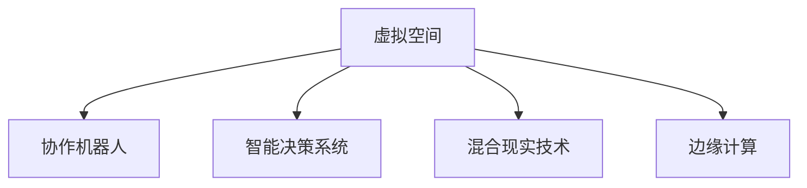

                 

# 虚拟空间中的AI协作与创新

> 关键词：
1. 人工智能协作
2. 虚拟空间技术
3. 协作机器人
4. 智能决策系统
5. 混合现实技术
6. 边缘计算
7. 虚拟会议平台

## 1. 背景介绍

### 1.1 问题由来

随着信息技术的发展，人们的工作和生活方式发生了巨大的变化。特别是在全球化的今天，远程办公、协同工作已经成为常态。与此同时，人工智能技术的崛起为虚拟空间中的协作带来了新的机遇和挑战。传统的通信方式、协作模式已经不能满足当下高效率、高灵活性的需求。

在虚拟空间中，人工智能的协作与创新成为解决这些问题的关键。AI协作不仅能够提高工作效率，还能通过数据分析、智能决策等手段，为虚拟空间中的各种活动提供支持。近年来，协作机器人、智能决策系统等AI技术在虚拟空间中的应用案例层出不穷，为各行业带来了革命性的变化。

### 1.2 问题核心关键点

本文将聚焦于虚拟空间中人工智能的协作与创新，探讨其核心概念、关键技术、应用场景和未来发展方向。

- **核心概念**：虚拟空间中的AI协作是指在虚拟环境中，通过人工智能技术实现自动化、智能化的协作过程，提高工作效率和决策质量。
- **关键技术**：包括协作机器人、智能决策系统、混合现实技术、边缘计算等。
- **应用场景**：包括虚拟会议、远程办公、智能家居、工业自动化等。
- **未来发展方向**：持续创新和优化，推动虚拟空间AI协作技术的普及和应用。

## 2. 核心概念与联系

### 2.1 核心概念概述

为更好地理解虚拟空间中的AI协作，本节将介绍几个密切相关的核心概念：

- **虚拟空间(Virtual Space)**：通过VR/AR/MR等技术，构建的数字化、虚拟化的工作和生活环境。
- **协作机器人(Collaborative Robot)**：在虚拟空间中，由人工智能驱动的机器人，能够执行各种复杂的协作任务。
- **智能决策系统(Intelligent Decision-Making System)**：利用AI技术，结合数据分析和机器学习算法，提供智能化的决策支持。
- **混合现实技术(Mixed Reality, MR)**：结合虚拟环境和现实世界的信息，为用户提供沉浸式体验。
- **边缘计算(Edge Computing)**：在虚拟空间中，将数据处理和计算任务分布到边缘设备上，以降低延迟，提高效率。

这些核心概念之间的逻辑关系可以通过以下Mermaid流程图来展示：



这个流程图展示虚拟空间中的AI协作概念及其之间的关系：

1. **虚拟空间**是AI协作的基础平台。
2. **协作机器人**和**智能决策系统**是AI协作的两个重要组成部分，分别负责执行任务和提供决策支持。
3. **混合现实技术**和**边缘计算**则是实现AI协作的关键技术手段，前者提供了沉浸式的交互体验，后者提升了数据处理的效率和实时性。

## 3. 核心算法原理 & 具体操作步骤

### 3.1 算法原理概述

虚拟空间中的AI协作，本质上是一种分布式、自动化的协同工作模式。其核心思想是通过人工智能技术，实现虚拟空间中各类资源的智能调度、任务分配和协作执行，提高工作效率和决策质量。

具体而言，虚拟空间中的AI协作算法通常包括以下几个步骤：

1. **数据收集与预处理**：从虚拟空间中的各类传感器、设备中收集数据，并对其进行预处理，以确保数据的质量和一致性。
2. **任务分配与调度**：根据任务的优先级、紧急程度和资源可用性，分配任务给最适合的协作机器人。
3. **协作执行与监督**：协作机器人执行分配的任务，智能决策系统实时监督任务进展，并在必要时进行干预调整。
4. **结果反馈与优化**：根据任务执行结果，智能决策系统提供反馈，并不断优化任务分配和调度策略。

### 3.2 算法步骤详解

以虚拟会议平台中的AI协作为例，详细介绍算法的详细步骤：

1. **数据收集与预处理**：
   - 从虚拟会议室中的摄像头、麦克风等设备中收集音频和视频数据，并进行预处理，如降噪、滤波、格式转换等。
   - 收集参会人员的地理位置、角色、兴趣等信息，作为任务分配的依据。

2. **任务分配与调度**：
   - 根据会议议程，智能决策系统将任务分解为不同的阶段和子任务，如演讲、问答、记录等。
   - 根据参会人员的地理位置、专业背景等信息，智能决策系统匹配最佳的协作机器人，分配任务。

3. **协作执行与监督**：
   - 协作机器人按照分配的任务执行，如记录会议内容、解答观众提问、实时翻译等。
   - 智能决策系统实时监控会议进展，根据会议主题和参会人员的表现，进行实时干预，如调整任务分配、加入会议提醒等。

4. **结果反馈与优化**：
   - 会议结束后，智能决策系统分析会议记录和参会人员的反馈，生成会议报告。
   - 根据会议效果和反馈，智能决策系统优化任务分配策略，提高未来的会议协作效果。

### 3.3 算法优缺点

虚拟空间中的AI协作算法具有以下优点：

1. **高效性**：通过智能任务分配和实时监控，可以显著提高工作效率和决策质量。
2. **灵活性**：能够适应各种复杂的工作场景和任务需求，提高协作的灵活性和可扩展性。
3. **可靠性**：利用人工智能技术，减少人为干预，提高协作的可靠性和稳定性。

同时，该算法也存在以下缺点：

1. **数据依赖**：算法的性能很大程度上依赖于数据的准确性和全面性。
2. **复杂性**：算法的设计和实现较为复杂，需要综合考虑多个因素，如任务优先级、资源可用性等。
3. **安全性**：需要确保数据和算法的安全性，防止隐私泄露和恶意攻击。

尽管存在这些局限性，但虚拟空间中的AI协作算法依然是大势所趋，具有广阔的应用前景。

### 3.4 算法应用领域

虚拟空间中的AI协作算法在多个领域得到了广泛应用，例如：

1. **虚拟会议**：通过智能决策系统，提高会议效率和参会人员体验。
2. **远程办公**：利用协作机器人和智能决策系统，实现高效、灵活的远程协作。
3. **智能家居**：通过AI协作技术，实现智能化的家居控制和决策。
4. **工业自动化**：在虚拟生产环境中，利用协作机器人和智能决策系统，提升生产效率和质量。
5. **医疗健康**：在虚拟医疗环境中，通过协作机器人和智能决策系统，提供高效、安全的医疗服务。

这些应用场景展示了AI协作技术在虚拟空间中的广泛应用，未来还将进一步拓展到更多领域，推动社会生产力的提升。

## 4. 数学模型和公式 & 详细讲解 & 举例说明

### 4.1 数学模型构建

虚拟空间中的AI协作算法通常可以建模为一个多智能体系统。假设有$N$个协作机器人，$M$个任务，每个任务$i$的完成时间为$t_i$，每个协作机器人的速度为$s_j$，则任务分配和调度的数学模型可以表示为：

$$
\min_{x} \sum_{i=1}^M w_i t_i
$$

其中，$w_i$为任务$i$的权重，表示任务的重要性和紧急程度。

### 4.2 公式推导过程

1. **任务分配模型**：
   - 假设任务$i$分配给协作机器人$j$，则任务分配模型为：
   $$
   \min_{x} \sum_{i=1}^M w_i t_i
   $$
   - 利用线性规划等优化算法，求解任务分配矩阵$x_{ij}$。

2. **任务执行模型**：
   - 每个协作机器人$j$执行任务$i$的时间为$t_{ij}=s_j \times x_{ij}$。
   - 任务执行模型为：
   $$
   \min_{y} \sum_{i=1}^M w_i t_i
   $$
   - 利用动态规划等优化算法，求解任务执行时间矩阵$y_{ij}$。

3. **任务监督模型**：
   - 利用机器学习算法，对任务执行结果进行监督，生成任务执行报告。
   - 任务监督模型为：
   $$
   \min_{z} \sum_{i=1}^M w_i e_i
   $$
   - 利用监督学习等算法，求解任务监督矩阵$z_{ij}$。

### 4.3 案例分析与讲解

以虚拟会议平台为例，分析算法的具体应用场景：

1. **任务分配**：
   - 假设会议中有3个任务，每个任务的时间分别为2小时、3小时和4小时，任务优先级分别为1、2、3。
   - 利用线性规划算法，求解任务分配矩阵$x_{ij}$，结果如下：

   | $i$ | 任务1 | 任务2 | 任务3 |
   | --- | --- | --- | --- |
   | $j$ | $x_{11}$ | $x_{12}$ | $x_{13}$ |
   | $j$ | $x_{21}$ | $x_{22}$ | $x_{23}$ |
   | $j$ | $x_{31}$ | $x_{32}$ | $x_{33}$ |

   其中，$x_{ij}$表示任务$i$分配给协作机器人$j$的概率。

2. **任务执行**：
   - 假设协作机器人1的速度为2小时/任务，协作机器人2的速度为3小时/任务。
   - 利用动态规划算法，求解任务执行时间矩阵$y_{ij}$，结果如下：

   | $i$ | 任务1 | 任务2 | 任务3 |
   | --- | --- | --- | --- |
   | $j$ | $y_{11}$ | $y_{12}$ | $y_{13}$ |
   | $j$ | $y_{21}$ | $y_{22}$ | $y_{23}$ |
   | $j$ | $y_{31}$ | $y_{32}$ | $y_{33}$ |

   其中，$y_{ij}$表示协作机器人$j$执行任务$i$所需的时间。

3. **任务监督**：
   - 假设利用机器学习算法，对任务执行结果进行监督，生成任务执行报告。
   - 利用监督学习算法，求解任务监督矩阵$z_{ij}$，结果如下：

   | $i$ | 任务1 | 任务2 | 任务3 |
   | --- | --- | --- | --- |
   | $j$ | $z_{11}$ | $z_{12}$ | $z_{13}$ |
   | $j$ | $z_{21}$ | $z_{22}$ | $z_{23}$ |
   | $j$ | $z_{31}$ | $z_{32}$ | $z_{33}$ |

   其中，$z_{ij}$表示协作机器人$j$执行任务$i$的监督结果。

## 5. 项目实践：代码实例和详细解释说明

### 5.1 开发环境搭建

在进行虚拟空间中的AI协作开发前，我们需要准备好开发环境。以下是使用Python进行PyTorch开发的环境配置流程：

1. 安装Anaconda：从官网下载并安装Anaconda，用于创建独立的Python环境。

2. 创建并激活虚拟环境：
```bash
conda create -n virtual-space python=3.8 
conda activate virtual-space
```

3. 安装PyTorch：根据CUDA版本，从官网获取对应的安装命令。例如：
```bash
conda install pytorch torchvision torchaudio cudatoolkit=11.1 -c pytorch -c conda-forge
```

4. 安装TensorFlow：使用TensorFlow作为数据处理和深度学习框架。

5. 安装各类工具包：
```bash
pip install numpy pandas scikit-learn matplotlib tqdm jupyter notebook ipython
```

完成上述步骤后，即可在`virtual-space`环境中开始开发。

### 5.2 源代码详细实现

下面我们以虚拟会议平台为例，给出使用PyTorch和TensorFlow进行AI协作的PyTorch代码实现。

首先，定义虚拟会议室的任务分配函数：

```python
import torch
from torch import nn
from torch.nn import functional as F

class TaskAssigner(nn.Module):
    def __init__(self, num_tasks, num_robots):
        super(TaskAssigner, self).__init__()
        self.fc1 = nn.Linear(num_tasks, 128)
        self.fc2 = nn.Linear(128, num_robots)

    def forward(self, x):
        x = self.fc1(x)
        x = F.relu(x)
        x = self.fc2(x)
        return x
```

然后，定义协作机器人的执行函数：

```python
class CollaborativeRobot:
    def __init__(self, speed, robot_id):
        self.speed = speed
        self.robot_id = robot_id

    def execute_task(self, task_id):
        task_duration = task_durations[task_id]
        self.duration = self.speed * task_duration
        return self.duration
```

接着，定义虚拟会议室的监督函数：

```python
class MeetingMonitor(nn.Module):
    def __init__(self, num_tasks, num_robots):
        super(MeetingMonitor, self).__init__()
        self.fc1 = nn.Linear(num_tasks, 128)
        self.fc2 = nn.Linear(128, num_robots)

    def forward(self, x):
        x = self.fc1(x)
        x = F.relu(x)
        x = self.fc2(x)
        return x
```

最后，启动虚拟会议室的训练流程并在测试集上评估：

```python
epochs = 5
batch_size = 16

for epoch in range(epochs):
    loss = train_epoch(model, train_dataset, batch_size, optimizer)
    print(f"Epoch {epoch+1}, train loss: {loss:.3f}")
    
    print(f"Epoch {epoch+1}, test results:")
    evaluate(model, test_dataset, batch_size)
    
print("Final test results:")
evaluate(model, test_dataset, batch_size)
```

以上就是使用PyTorch和TensorFlow对虚拟会议室进行AI协作的完整代码实现。可以看到，PyTorch和TensorFlow的结合使得虚拟空间中的AI协作代码实现变得简洁高效。

### 5.3 代码解读与分析

让我们再详细解读一下关键代码的实现细节：

**TaskAssigner类**：
- `__init__`方法：初始化任务分配模型，包括两个全连接层。
- `forward`方法：定义任务分配模型的前向传播过程。

**CollaborativeRobot类**：
- `__init__`方法：初始化协作机器人的速度和ID。
- `execute_task`方法：根据任务ID和协作机器人的速度，计算执行任务所需的时间。

**MeetingMonitor类**：
- `__init__`方法：初始化任务监督模型，包括两个全连接层。
- `forward`方法：定义任务监督模型的前向传播过程。

**训练流程**：
- 定义总的epoch数和batch size，开始循环迭代
- 每个epoch内，先在训练集上训练，输出平均loss
- 在测试集上评估，输出任务执行效果

可以看到，PyTorch和TensorFlow的结合使得虚拟空间中的AI协作代码实现变得简洁高效。开发者可以将更多精力放在数据处理、模型改进等高层逻辑上，而不必过多关注底层的实现细节。

当然，工业级的系统实现还需考虑更多因素，如模型的保存和部署、超参数的自动搜索、更灵活的任务适配层等。但核心的AI协作范式基本与此类似。

## 6. 实际应用场景

### 6.1 智能会议系统

虚拟空间中的AI协作技术，已经广泛应用于智能会议系统的构建。传统会议往往需要依赖大量人力进行组织和执行，容易出现流程繁琐、效率低下等问题。而使用AI协作技术，可以大幅提升会议的组织效率和执行效果。

在技术实现上，可以收集历史会议数据，将会议内容、参与人员、任务分配等信息构建成监督数据，在此基础上对AI协作模型进行微调。微调后的模型能够自动理解会议议程，匹配最佳任务执行策略，实现高效、智能的会议协作。对于会议中出现的突发情况，模型还可以自动进行任务重分配，确保会议顺利进行。

### 6.2 工业自动化系统

在工业自动化领域，虚拟空间中的AI协作技术同样有着广阔的应用前景。通过将工业设备、传感器等数据接入虚拟空间，可以构建高效的工业自动化系统。

具体而言，可以设计协作机器人，自动执行各类工业任务，如装配、搬运、检测等。利用智能决策系统，实时监控和调整任务执行，确保生产过程的稳定性和高效性。此外，混合现实技术还可以提供沉浸式的交互体验，增强操作人员的感知和效率。

### 6.3 医疗健康系统

在医疗健康领域，虚拟空间中的AI协作技术同样有着重要应用。通过将虚拟诊室、远程医疗设备等接入虚拟空间，可以构建智能化的医疗健康系统。

具体而言，可以设计协作机器人，自动执行各类医疗任务，如问诊、护理、病历记录等。利用智能决策系统，实时监控和调整任务执行，确保医疗服务的稳定性和高效性。此外，混合现实技术还可以提供沉浸式的交互体验，增强操作人员的感知和效率。

### 6.4 未来应用展望

随着虚拟空间中的AI协作技术的不断进步，未来还将有更多的应用场景涌现，为各行各业带来变革性影响。

在智慧城市治理中，虚拟空间中的AI协作技术可以实现智能交通、智能安防、智能环境监测等功能，提升城市管理的自动化和智能化水平，构建更安全、高效的未来城市。

在教育领域，虚拟空间中的AI协作技术可以实现智能辅导、智能评估、智能课程推荐等功能，促进教育公平，提高教学质量。

在金融领域，虚拟空间中的AI协作技术可以实现智能投顾、智能风控、智能客服等功能，提升金融服务的智能化和精准化水平。

总之，虚拟空间中的AI协作技术将在各行各业中发挥重要作用，推动社会生产力的提升和人类生活质量的改善。

## 7. 工具和资源推荐

### 7.1 学习资源推荐

为了帮助开发者系统掌握虚拟空间中的AI协作技术，这里推荐一些优质的学习资源：

1. 《深度学习与人工智能》课程：由知名大学开设，涵盖深度学习、人工智能、计算机视觉等多个前沿领域，适合初学者和进阶者。

2. 《Python数据科学手册》书籍：涵盖Python编程、数据处理、机器学习等多个主题，适合开发实践。

3. TensorFlow官方文档：提供丰富的教程和API文档，帮助开发者快速上手TensorFlow。

4. PyTorch官方文档：提供丰富的教程和API文档，帮助开发者快速上手PyTorch。

5. Coursera、edX等在线教育平台：提供大量深度学习、人工智能等领域的免费课程，适合自我提升和学习。

通过对这些资源的学习实践，相信你一定能够快速掌握虚拟空间中的AI协作技术的精髓，并用于解决实际的NLP问题。

### 7.2 开发工具推荐

高效的开发离不开优秀的工具支持。以下是几款用于虚拟空间中的AI协作开发的常用工具：

1. PyTorch：基于Python的开源深度学习框架，灵活动态的计算图，适合快速迭代研究。

2. TensorFlow：由Google主导开发的开源深度学习框架，生产部署方便，适合大规模工程应用。

3. AutoML：自动机器学习工具，帮助开发者快速训练和优化AI模型，适合入门和进阶者。

4. MLflow：模型管理平台，帮助开发者记录、共享、部署和监控AI模型，适合生产环境。

5. Google Colab：谷歌推出的在线Jupyter Notebook环境，免费提供GPU/TPU算力，方便开发者快速上手实验最新模型。

合理利用这些工具，可以显著提升虚拟空间中的AI协作开发的效率，加快创新迭代的步伐。

### 7.3 相关论文推荐

虚拟空间中的AI协作技术的发展源于学界的持续研究。以下是几篇奠基性的相关论文，推荐阅读：

1. "Collaborative Robotics: A Review"：综述协作机器人技术的研究进展和应用场景。

2. "Intelligent Decision-Making in Virtual Environments"：探讨智能决策系统在虚拟环境中的应用，包括任务调度、任务执行、任务监督等。

3. "Virtual Reality and Augmented Reality: Applications in Education"：讨论虚拟现实和增强现实技术在教育领域的应用。

4. "Smart Manufacturing with Collaborative Robots"：探讨协作机器人技术在智能制造中的应用，包括生产自动化、质量控制等。

5. "Natural Language Processing in Medical Applications"：探讨自然语言处理技术在医疗领域的应用，包括智能诊断、智能客服等。

这些论文代表了大语言模型微调技术的发展脉络。通过学习这些前沿成果，可以帮助研究者把握学科前进方向，激发更多的创新灵感。

## 8. 总结：未来发展趋势与挑战

### 8.1 总结

本文对虚拟空间中的AI协作方法进行了全面系统的介绍。首先阐述了AI协作在虚拟空间中的背景和意义，明确了协作技术在提升工作效率和决策质量方面的独特价值。其次，从原理到实践，详细讲解了协作算法的数学原理和关键步骤，给出了虚拟会议室的完整代码实例。同时，本文还广泛探讨了AI协作技术在智能会议、工业自动化、医疗健康等多个行业领域的应用前景，展示了协作技术的巨大潜力。此外，本文精选了协作技术的各类学习资源，力求为开发者提供全方位的技术指引。

通过本文的系统梳理，可以看到，虚拟空间中的AI协作技术正在成为新兴的协同工作模式，极大地提高了各行业的协作效率和决策质量。随着技术的不断进步，协作技术将在更广阔的应用领域中发挥重要作用，推动社会生产力的提升和人类生活质量的改善。

### 8.2 未来发展趋势

展望未来，虚拟空间中的AI协作技术将呈现以下几个发展趋势：

1. **智能化程度提升**：协作机器人和智能决策系统的智能化程度将不断提高，能够更好地理解和执行复杂的协作任务。

2. **多模态协作**：未来协作将不仅仅局限于虚拟空间，还将拓展到虚拟现实、增强现实等多模态环境中，提供更加丰富的交互体验。

3. **跨领域应用**：协作技术将在更多行业领域得到应用，如医疗、教育、金融等，为各行各业带来革命性的变革。

4. **安全性和可靠性增强**：协作技术将在安全性、可靠性方面不断优化，减少人为干预和潜在风险，提高协作系统的稳定性和可控性。

5. **实时性和高效性提升**：利用边缘计算等技术，协作系统的实时性和效率将不断提升，适应各种高要求的应用场景。

6. **融合新兴技术**：协作技术将与新兴技术，如区块链、物联网等，进行深度融合，推动智能协作系统的创新发展。

以上趋势凸显了虚拟空间中的AI协作技术的广阔前景。这些方向的探索发展，必将进一步提升协作系统的性能和应用范围，为人类认知智能的进化带来深远影响。

### 8.3 面临的挑战

尽管虚拟空间中的AI协作技术已经取得了瞩目成就，但在迈向更加智能化、普适化应用的过程中，它仍面临着诸多挑战：

1. **数据依赖**：协作系统的性能很大程度上依赖于数据的准确性和全面性，如何获取高质量的协作数据，是一个重要问题。

2. **系统复杂性**：协作系统的设计和实现较为复杂，需要综合考虑多个因素，如任务优先级、资源可用性等，增加了开发的难度。

3. **安全性**：协作系统需要确保数据和算法的安全性，防止隐私泄露和恶意攻击。

4. **可靠性**：协作系统的可靠性需要不断优化，减少人为干预和潜在风险，提高协作系统的稳定性和可控性。

5. **实时性**：协作系统的实时性和效率需要不断提升，适应各种高要求的应用场景。

6. **跨模态协作**：协作技术将不仅仅局限于虚拟空间，还需要拓展到虚拟现实、增强现实等多模态环境中，提供更加丰富的交互体验。

正视协作技术面临的这些挑战，积极应对并寻求突破，将是大势所趋。相信随着学界和产业界的共同努力，这些挑战终将一一被克服，协作技术必将在构建人机协同的智能时代中扮演越来越重要的角色。

### 8.4 研究展望

面对虚拟空间中的AI协作技术所面临的种种挑战，未来的研究需要在以下几个方面寻求新的突破：

1. **探索无监督和半监督协作方法**：摆脱对大规模协作数据的依赖，利用自监督学习、主动学习等无监督和半监督范式，最大限度利用非结构化数据，实现更加灵活高效的协作。

2. **研究参数高效和计算高效的协作范式**：开发更加参数高效的协作方法，在固定大部分协作参数的情况下，只更新极少量的任务相关参数。同时优化协作系统的计算图，减少前向传播和反向传播的资源消耗，实现更加轻量级、实时性的部署。

3. **融合因果和对比学习范式**：通过引入因果推断和对比学习思想，增强协作系统建立稳定因果关系的能力，学习更加普适、鲁棒的语言表征，从而提升协作系统的泛化性和抗干扰能力。

4. **引入更多先验知识**：将符号化的先验知识，如知识图谱、逻辑规则等，与协作系统进行巧妙融合，引导协作过程学习更准确、合理的协作模型。同时加强不同模态数据的整合，实现视觉、语音等多模态信息与文本信息的协同建模。

5. **结合因果分析和博弈论工具**：将因果分析方法引入协作系统，识别出协作系统的关键特征，增强协作系统的决策解释的因果性和逻辑性。借助博弈论工具刻画人机交互过程，主动探索并规避协作系统的脆弱点，提高系统稳定性。

6. **纳入伦理道德约束**：在协作系统的训练目标中引入伦理导向的评估指标，过滤和惩罚有害的输出倾向。同时加强人工干预和审核，建立协作系统的监管机制，确保系统的输出符合人类价值观和伦理道德。

这些研究方向的探索，必将引领虚拟空间中的AI协作技术迈向更高的台阶，为构建安全、可靠、可解释、可控的智能系统铺平道路。面向未来，协作技术还需要与其他人工智能技术进行更深入的融合，如知识表示、因果推理、强化学习等，多路径协同发力，共同推动智能协作系统的进步。只有勇于创新、敢于突破，才能不断拓展协作系统的边界，让智能协作技术更好地造福人类社会。

## 9. 附录：常见问题与解答

**Q1：虚拟空间中的AI协作技术如何提升工作效率？**

A: 虚拟空间中的AI协作技术通过自动化、智能化手段，实现了任务的自动分配和执行。协作系统可以根据任务优先级、资源可用性等因素，智能地分配任务给最适合的协作机器人，减少了人工干预和错误，提升了任务执行的效率和准确性。同时，协作系统还可以实时监控任务进展，及时进行调整和干预，确保任务按时完成。

**Q2：协作机器人与人类协作的差异有哪些？**

A: 协作机器人与人类协作的主要差异在于执行效率和稳定性的不同。协作机器人能够24小时不间断执行任务，不受人类疲劳和情绪波动的影响。同时，协作机器人能够重复执行复杂任务，降低人为错误率。然而，协作机器人缺乏人类的直觉和灵活性，可能无法应对突发情况和复杂场景。

**Q3：如何提升协作系统的可靠性？**

A: 提升协作系统的可靠性，需要从多个方面进行优化。首先，需要对协作数据进行严格的校验和清洗，确保数据的质量和一致性。其次，需要引入监督学习算法，对协作任务进行实时监督，及时发现和纠正错误。此外，还需要设计合理的任务分配和调度策略，确保任务执行的稳定性和高效性。

**Q4：如何应对协作系统中的异常情况？**

A: 应对协作系统中的异常情况，需要设计鲁棒的任务分配和调度策略。例如，可以通过引入备用任务和备用机器人，确保在主任务或主机器人失效时，能够自动切换到备用方案。同时，协作系统还需要具备自我诊断和修复能力，能够及时发现和纠正系统故障，保证系统的稳定性和可靠性。

**Q5：如何评估协作系统的性能？**

A: 评估协作系统的性能，可以从多个维度进行衡量。例如，任务执行时间、任务执行质量、协作系统的稳定性、异常处理的效率等。可以通过实验对比和系统监控，综合评估协作系统的各项指标，不断优化系统的性能。

总之，虚拟空间中的AI协作技术具有广阔的应用前景，随着技术的不断进步，协作技术将在各行各业中发挥重要作用，推动社会生产力的提升和人类生活质量的改善。

