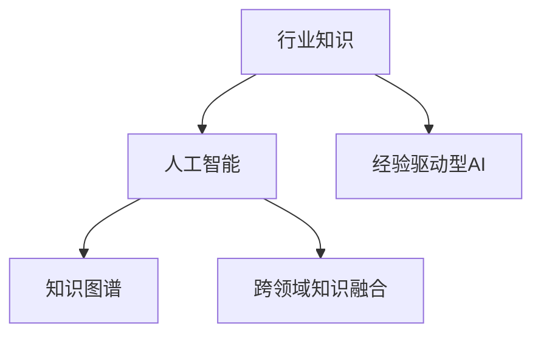

                 

# 行业Know-how在AI时代的重要性

## 1. 背景介绍

在AI技术的迅猛发展下，各行各业正经历着深刻的变革。AI的应用已经从传统的技术领域，扩展到医疗、金融、制造、教育等各个行业。这种跨领域的普及，使得AI技术的应用不仅在专业性上提出了更高的要求，还在多个层面上催生了新的挑战与机遇。在这个过程中，行业知识（Industry Know-how）的重要性日益凸显。

**行业知识（Industry Know-how）**，简称为“行业知识”，是指特定行业领域的专业知识、工作流程、经验积累以及相关的行业规范和标准。它在AI时代的作用不可忽视，尤其是在涉及到技术落地和行业应用时。AI技术的成功应用不仅需要强大的算法和模型，更需要行业知识作为支撑，以确保技术的正确理解和有效应用。

## 2. 核心概念与联系

### 2.1 核心概念概述

为了更好地理解行业知识在AI时代的重要性，本节将介绍几个关键概念：

- **行业知识（Industry Know-how）**：指特定行业领域的专业知识、工作流程、经验积累以及相关的行业规范和标准。行业知识通过持续的学习、实践和积累，逐步形成行业内的共识和标准。
- **人工智能（AI）**：利用算法和数据驱动的计算，实现任务自动化和智能化的技术。AI技术能够处理大量数据，并通过学习提高决策和预测的准确性。
- **知识图谱（Knowledge Graph）**：一种结构化的数据表示方法，用于描述和关联实体与属性之间的复杂关系。知识图谱能够整合结构化与非结构化数据，辅助AI系统理解语义信息。
- **跨领域知识融合（Cross-domain Knowledge Integration）**：指将不同领域的专业知识进行整合，形成更全面的知识体系，以支持AI系统在多个行业的应用。
- **经验驱动型AI（Experience-Driven AI）**：利用行业专家的知识和经验，指导AI模型的训练和优化，增强模型的鲁棒性和适应性。

这些概念之间的逻辑关系可以通过以下Mermaid流程图来展示：



这个流程图展示了行业知识与人工智能技术之间的联系：

1. 行业知识是人工智能的基础，通过提供行业特定领域的知识，帮助AI系统理解和处理特定任务。
2. 知识图谱和跨领域知识融合进一步丰富了行业知识，使其能够更好地整合和应用到不同的AI系统中。
3. 经验驱动型AI则是利用行业专家经验来指导AI模型的训练，提升模型的实际应用效果。

## 3. 核心算法原理 & 具体操作步骤

### 3.1 算法原理概述

在AI系统中，行业知识与算法和模型紧密结合，形成了一套完整的知识驱动型AI解决方案。具体来说，AI系统通过以下步骤将行业知识融入模型训练和推理：

1. **数据预处理**：将行业特定的数据进行预处理，包括清洗、转换和标注等步骤，以便于AI系统理解和使用。
2. **知识提取与编码**：利用知识图谱和跨领域知识融合技术，将行业知识编码为模型可以理解和处理的结构化形式。
3. **模型训练**：在行业知识的指导下，使用数据和模型进行训练，优化模型的参数，使其能够适应特定行业的任务。
4. **模型推理与评估**：利用训练好的模型对新的行业数据进行推理，并根据行业标准进行评估和反馈，进一步优化模型。

### 3.2 算法步骤详解

基于上述原理，行业知识在AI系统中的应用可以分为以下几个关键步骤：

**Step 1: 数据收集与标注**
- 收集行业内的数据，包括文本、图像、视频等各类数据源。
- 对数据进行清洗和预处理，去除噪音和无效数据。
- 对数据进行标注，确保标注数据与行业标准和规范一致。

**Step 2: 知识图谱构建**
- 利用知识图谱技术，将行业知识进行结构化表示。
- 将知识图谱与数据进行融合，构建面向AI的行业知识库。

**Step 3: 模型训练与优化**
- 选择合适的算法和模型，如卷积神经网络（CNN）、循环神经网络（RNN）等。
- 利用行业知识库进行模型训练，优化模型参数。
- 使用经验驱动型AI方法，引入行业专家的知识和经验，指导模型训练。

**Step 4: 模型部署与应用**
- 将训练好的模型部署到实际应用环境中。
- 在实际应用中，根据行业标准和规范，对模型的输出进行评估和优化。
- 根据反馈，对模型进行迭代和更新，不断提升模型的性能。

### 3.3 算法优缺点

行业知识与AI的结合，具有以下优点：
1. **提高模型准确性**：通过融入行业知识，AI模型能够更好地理解特定领域的任务，从而提高模型的准确性和鲁棒性。
2. **降低开发成本**：行业知识可以作为模型的指导，减少从头开始开发和训练的成本。
3. **提升应用效果**：在实际应用中，结合行业知识，模型能够提供更加贴合行业需求的输出。

同时，这种结合也存在一些缺点：
1. **数据获取难度大**：行业知识往往需要长期积累和专家经验，获取高质量的数据和知识库成本较高。
2. **知识融合复杂**：不同行业的知识体系可能存在差异，如何有效整合和融合这些知识是一个复杂的问题。
3. **模型依赖性强**：模型的性能依赖于行业知识的丰富度和准确性，如果行业知识不完整或不准确，模型的性能可能受到影响。

尽管存在这些缺点，但行业知识与AI的结合仍然是当前AI技术落地的重要方向。通过合理利用行业知识，AI系统能够在多个行业取得更加显著的成效。

### 3.4 算法应用领域

行业知识与AI的结合，已经在多个领域得到了应用，包括但不限于：

- **医疗领域**：利用医疗知识图谱和临床数据，构建医疗AI系统，辅助医生进行疾病诊断和治疗决策。
- **金融领域**：结合金融市场知识和交易数据，构建金融AI系统，进行风险评估和投资分析。
- **制造领域**：利用生产流程和设备数据，构建智能制造AI系统，优化生产流程和提高设备利用率。
- **教育领域**：结合教育知识图谱和学生数据，构建个性化学习AI系统，提供个性化推荐和辅导。
- **交通领域**：利用交通规则和实时数据，构建智能交通AI系统，优化交通流量和减少交通事故。

## 4. 数学模型和公式 & 详细讲解 & 举例说明

### 4.1 数学模型构建

在AI系统中，行业知识与模型的结合通常通过以下数学模型来表示：

- **数据表示**：利用向量表示法（Vector Representation）将数据转换为数值形式，以便于模型进行处理。
- **知识融合**：利用知识图谱和跨领域知识融合技术，将行业知识进行结构化表示。
- **模型训练**：使用优化算法（如梯度下降）对模型进行训练，优化模型的参数。

### 4.2 公式推导过程

以下是一个简单的数学模型推导示例：

假设我们有一个医疗领域的数据集 $D = \{(x_i, y_i)\}_{i=1}^N$，其中 $x_i$ 为患者的症状描述，$y_i$ 为疾病的诊断结果。我们希望构建一个医疗AI系统，通过输入症状描述，输出疾病诊断。

首先，我们将症状描述转换为向量表示 $x_i = \{x_{i1}, x_{i2}, ..., x_{im}\}$，其中 $m$ 为症状的维度。

然后，利用知识图谱，将疾病的诊断结果 $y_i$ 与症状 $x_i$ 进行关联，形成一个基于图谱的知识库 $K = (V, E)$，其中 $V$ 为节点（症状和疾病），$E$ 为边（关联关系）。

最后，我们利用神经网络模型 $M_{\theta}$ 进行训练，其中 $\theta$ 为模型的参数。模型的目标函数为最小化交叉熵损失：

$$
\min_{\theta} \sum_{i=1}^N -y_i \log M_{\theta}(x_i) - (1-y_i) \log(1-M_{\theta}(x_i))
$$

其中 $M_{\theta}(x_i)$ 为模型对症状 $x_i$ 的预测概率。

### 4.3 案例分析与讲解

以下是一个具体的案例分析：

假设我们有一个用于识别人脸表情的AI系统。该系统需要结合面部表情的特征和情感知识，通过输入面部图像，输出相应的情感标签（如高兴、悲伤、愤怒等）。

1. **数据收集与标注**：收集大量面部表情的图像数据，并对其进行标注，确保标注数据与情感标签的一致性。
2. **知识提取与编码**：利用面部表情的知识图谱，将情感标签与面部特征进行关联，形成结构化的知识库。
3. **模型训练与优化**：选择卷积神经网络（CNN）作为模型，利用标注数据和知识库进行训练，优化模型的参数。
4. **模型推理与评估**：将训练好的模型部署到实际应用环境中，利用新的面部图像进行推理，并根据情感标签进行评估和优化。

通过这种方式，AI系统可以更好地理解面部表情与情感之间的关系，提高情感识别的准确性和鲁棒性。

## 5. 项目实践：代码实例和详细解释说明

### 5.1 开发环境搭建

在进行AI项目实践时，首先需要搭建好开发环境。以下是使用Python进行TensorFlow开发的环境配置流程：

1. 安装Anaconda：从官网下载并安装Anaconda，用于创建独立的Python环境。

2. 创建并激活虚拟环境：
```bash
conda create -n tf-env python=3.8 
conda activate tf-env
```

3. 安装TensorFlow：根据CUDA版本，从官网获取对应的安装命令。例如：
```bash
conda install tensorflow -c pytorch
```

4. 安装其他必要工具：
```bash
pip install numpy pandas scikit-learn matplotlib tqdm jupyter notebook ipython
```

完成上述步骤后，即可在`tf-env`环境中开始AI项目实践。

### 5.2 源代码详细实现

下面我们以人脸表情识别为例，给出使用TensorFlow对CNN模型进行训练的Python代码实现。

首先，定义数据处理函数：

```python
import tensorflow as tf
from tensorflow.keras.preprocessing.image import ImageDataGenerator
from tensorflow.keras.applications import VGG16
from tensorflow.keras.layers import Dense, Flatten, Dropout
from tensorflow.keras.models import Model

def prepare_data(data_dir, img_size, batch_size):
    train_datagen = ImageDataGenerator(rescale=1./255,
                                      shear_range=0.2,
                                      zoom_range=0.2,
                                      horizontal_flip=True)
    test_datagen = ImageDataGenerator(rescale=1./255)
    
    train_generator = train_datagen.flow_from_directory(
        data_dir,
        target_size=(img_size, img_size),
        batch_size=batch_size,
        class_mode='categorical')
    
    test_generator = test_datagen.flow_from_directory(
        data_dir,
        target_size=(img_size, img_size),
        batch_size=batch_size,
        class_mode='categorical')
    
    return train_generator, test_generator
```

然后，定义模型和优化器：

```python
base_model = VGG16(weights='imagenet', include_top=False, input_shape=(img_size, img_size, 3))
base_model.trainable = False

x = base_model.output
x = Flatten()(x)
x = Dense(128, activation='relu')(x)
x = Dropout(0.5)(x)
predictions = Dense(num_classes, activation='softmax')(x)

model = Model(inputs=base_model.input, outputs=predictions)
optimizer = tf.keras.optimizers.Adam(lr=0.001)
```

接着，定义训练和评估函数：

```python
def train_epoch(model, train_generator, validation_generator, optimizer, epochs):
    model.compile(optimizer=optimizer, loss='categorical_crossentropy', metrics=['accuracy'])
    
    for epoch in range(epochs):
        model.fit(train_generator, validation_data=validation_generator, epochs=1, verbose=1)
        model.evaluate(validation_generator)
```

最后，启动训练流程并在测试集上评估：

```python
epochs = 50
batch_size = 32

train_generator, test_generator = prepare_data(data_dir, img_size, batch_size)

model = Model(inputs=base_model.input, outputs=predictions)
model.compile(optimizer=optimizer, loss='categorical_crossentropy', metrics=['accuracy'])

train_epoch(model, train_generator, test_generator, optimizer, epochs)
```

以上就是使用TensorFlow对人脸表情识别模型进行训练的完整代码实现。可以看到，TensorFlow的Keras API使得模型构建和训练变得简洁高效。

### 5.3 代码解读与分析

让我们再详细解读一下关键代码的实现细节：

**prepare_data函数**：
- 定义了数据增强器和图像数据生成器，对输入数据进行预处理。
- 使用VGG16预训练模型作为特征提取器，提取输入图像的特征。
- 添加全连接层和Dropout层进行分类，并返回训练和测试数据生成器。

**train_epoch函数**：
- 定义了模型，并使用Adam优化器进行编译。
- 在每个epoch内，使用训练数据生成器和验证数据生成器进行训练和验证。
- 输出每个epoch的损失和精度，并在验证集上评估模型性能。

**训练流程**：
- 定义总的epoch数和batch size，开始循环迭代
- 每个epoch内，先在训练集上训练，并在验证集上评估模型性能
- 所有epoch结束后，输出最终测试结果

可以看到，TensorFlow的Keras API使得AI项目的实现变得简洁高效。开发者可以将更多精力放在数据处理、模型改进等高层逻辑上，而不必过多关注底层的实现细节。

## 6. 实际应用场景

### 6.1 医疗领域

在医疗领域，行业知识与AI的结合可以显著提高疾病的诊断和治疗效率。传统医疗手段依赖于医生经验，不仅耗时耗力，还容易受到个体差异的影响。通过结合医学知识图谱和临床数据，AI系统可以辅助医生进行疾病诊断和治疗决策。

具体而言，可以收集医疗领域的电子病历、影像数据和实验室检测结果等数据，构建医学知识图谱，利用AI系统对新病例进行诊断和治疗推荐。AI系统能够综合利用多个来源的数据，提供更为全面和准确的诊断和治疗建议。

### 6.2 金融领域

在金融领域，AI系统可以结合市场知识和交易数据，进行风险评估和投资分析。传统的金融分析依赖于分析师的经验，但难以应对市场数据的快速变化和海量的信息。通过结合金融知识图谱和交易数据，AI系统可以实时监测市场动态，提供精准的投资建议和风险预警。

具体而言，可以收集金融市场的历史数据和实时数据，构建金融知识图谱，利用AI系统对股票、基金等金融资产进行分析和预测。AI系统能够根据市场动态，实时调整投资策略，避免潜在的金融风险。

### 6.3 制造领域

在制造领域，AI系统可以结合生产流程和设备数据，进行生产优化和设备维护。传统的制造管理依赖于经验丰富的工程师，但难以应对复杂的多变环境。通过结合生产知识图谱和设备数据，AI系统可以优化生产流程，提高设备利用率和产品质量。

具体而言，可以收集制造领域的生产数据和设备数据，构建生产知识图谱，利用AI系统进行生产调度和设备维护。AI系统能够实时监测生产状态，预测设备故障，并根据生产情况进行优化，提高生产效率和产品质量。

## 7. 工具和资源推荐

### 7.1 学习资源推荐

为了帮助开发者系统掌握AI技术的应用，这里推荐一些优质的学习资源：

1. **《TensorFlow 2.0实战》**：是一本涵盖TensorFlow 2.0的实战教程，详细讲解了TensorFlow的使用和优化技巧。
2. **《深度学习入门与实践》**：是一本深度学习入门教程，介绍了深度学习的理论和实践方法，适合初学者学习。
3. **Kaggle官方文档**：提供了丰富的数据集和竞赛项目，适合数据驱动型学习和实践。
4. **Google AI博文**：谷歌AI团队定期发布的博客，涵盖最新的AI技术和应用，适合跟踪前沿进展。
5. **《Python机器学习》**：是一本Python机器学习经典教程，讲解了机器学习的理论和实践方法。

通过对这些资源的学习实践，相信你一定能够快速掌握AI技术的精髓，并用于解决实际的行业问题。

### 7.2 开发工具推荐

高效的开发离不开优秀的工具支持。以下是几款用于AI项目开发的常用工具：

1. **Jupyter Notebook**：是一个交互式的Web平台，适合进行数据分析和模型训练，支持多种编程语言。
2. **TensorFlow**：由谷歌主导开发的开源深度学习框架，生产部署方便，适合大规模工程应用。
3. **Keras**：一个高级神经网络API，基于TensorFlow，提供了简洁的API接口，适合快速原型设计和模型构建。
4. **PyTorch**：由Facebook主导开发的开源深度学习框架，灵活动态的计算图，适合研究型应用。
5. **Weights & Biases**：模型训练的实验跟踪工具，可以记录和可视化模型训练过程中的各项指标，方便对比和调优。

合理利用这些工具，可以显著提升AI项目的开发效率，加快创新迭代的步伐。

### 7.3 相关论文推荐

AI技术的不断发展得益于学界的持续研究。以下是几篇奠基性的相关论文，推荐阅读：

1. **《深度学习》**：由Goodfellow等著，全面介绍了深度学习的理论和实践方法。
2. **《TensorFlow 2.0深度学习实战》**：介绍了TensorFlow 2.0的实战技巧和应用，适合实际开发。
3. **《深度学习入门》**：介绍了深度学习的入门知识和实践方法，适合初学者学习。
4. **《强化学习》**：由Sutton等著，介绍了强化学习的理论和实践方法。

这些论文代表了大语言模型微调技术的发展脉络。通过学习这些前沿成果，可以帮助研究者把握学科前进方向，激发更多的创新灵感。

## 8. 总结：未来发展趋势与挑战

### 8.1 总结

本文对行业知识与AI技术的结合进行了全面系统的介绍。首先阐述了行业知识在AI时代的重要性，明确了行业知识作为AI技术基础的核心价值。其次，从原理到实践，详细讲解了行业知识在AI系统中的应用，给出了AI项目开发的完整代码实例。同时，本文还广泛探讨了行业知识在医疗、金融、制造等多个行业领域的应用前景，展示了行业知识与AI技术的巨大潜力。最后，本文精选了行业知识与AI技术结合的各类学习资源，力求为读者提供全方位的技术指引。

通过本文的系统梳理，可以看到，行业知识与AI技术的结合是大势所趋，在多个行业取得了显著成效。未来，伴随AI技术的不断发展，行业知识与AI技术的结合将更加深入，为各行各业带来更深层次的变革和创新。

### 8.2 未来发展趋势

展望未来，行业知识与AI技术的结合将呈现以下几个发展趋势：

1. **知识图谱的普及**：随着知识图谱技术的成熟和普及，更多的行业知识将被结构化表示，进一步推动AI系统的发展。
2. **跨领域知识融合**：不同领域的知识图谱将被整合，形成更全面、更丰富的知识体系，提升AI系统的综合能力。
3. **经验驱动型AI**：利用行业专家的知识和经验，指导AI模型的训练和优化，增强模型的实际应用效果。
4. **智能决策系统**：结合行业知识，构建智能决策系统，辅助决策和优化。
5. **自动化学习**：通过自动化学习和知识融合，提高AI系统对新任务的适应性和泛化能力。

以上趋势凸显了行业知识与AI技术的结合将在未来AI技术的发展中扮演越来越重要的角色。这些方向的探索发展，必将进一步提升AI系统在各个行业的性能和应用范围，为人类社会带来更深刻的变革。

### 8.3 面临的挑战

尽管行业知识与AI技术的结合已经取得了显著成效，但在迈向更加智能化、普适化应用的过程中，它仍面临着诸多挑战：

1. **数据获取难度**：高质量的行业数据获取成本较高，如何高效地收集和标注数据，是行业知识与AI技术结合的瓶颈。
2. **知识融合复杂**：不同行业的知识体系可能存在差异，如何有效整合和融合这些知识，是一个复杂的问题。
3. **模型依赖性**：模型的性能依赖于行业知识的丰富度和准确性，如果行业知识不完整或不准确，模型的性能可能受到影响。
4. **知识表示困难**：行业知识的表示需要结构化和形式化，对于非结构化的知识，如何有效表示和处理，是一个重要问题。
5. **模型鲁棒性不足**：AI系统在面对新的行业场景时，可能缺乏鲁棒性，无法有效应对变化。

尽管存在这些挑战，但行业知识与AI技术的结合仍然是当前AI技术落地的重要方向。通过合理利用行业知识，AI系统能够在多个行业取得更加显著的成效。

### 8.4 研究展望

未来的研究需要在以下几个方面寻求新的突破：

1. **知识图谱的构建与优化**：构建高效、准确的知识图谱，利用知识图谱技术，提升AI系统的推理和决策能力。
2. **跨领域知识的融合**：探索不同领域的知识图谱融合方法，构建更全面、更丰富的知识体系，提升AI系统的综合能力。
3. **经验驱动型AI方法**：利用行业专家的知识和经验，指导AI模型的训练和优化，增强模型的实际应用效果。
4. **智能决策系统的构建**：结合行业知识，构建智能决策系统，辅助决策和优化。
5. **自动化学习方法的探索**：通过自动化学习和知识融合，提高AI系统对新任务的适应性和泛化能力。

这些研究方向的探索，必将引领行业知识与AI技术结合向更高的台阶，为各个行业的AI应用带来新的突破和创新。

## 9. 附录：常见问题与解答

**Q1：行业知识与AI技术结合的难点是什么？**

A: 行业知识与AI技术结合的难点主要在于数据获取和知识表示。高质量的行业数据获取成本较高，且不同行业的知识体系可能存在差异，如何有效整合和融合这些知识是一个复杂的问题。

**Q2：如何提高行业知识库的质量？**

A: 提高行业知识库的质量，可以从以下几个方面入手：
1. 收集全面、准确的数据，确保数据的质量和完整性。
2. 利用专家知识进行知识图谱的构建和优化，提升知识库的准确性和丰富度。
3. 定期更新和维护知识库，确保知识库的时效性和适用性。

**Q3：如何处理非结构化的行业知识？**

A: 对于非结构化的行业知识，可以采用文本挖掘和自然语言处理技术，将其转换为结构化的知识表示。具体方法包括文本分类、命名实体识别、情感分析等。

**Q4：如何提升AI系统的鲁棒性？**

A: 提升AI系统的鲁棒性，可以从以下几个方面入手：
1. 增加数据的多样性，提升模型的泛化能力。
2. 引入对抗样本和对抗训练技术，提高模型的鲁棒性。
3. 利用集成学习和多模型融合技术，增强系统的稳定性和鲁棒性。

**Q5：如何平衡模型复杂度和性能？**

A: 平衡模型复杂度和性能，可以从以下几个方面入手：
1. 利用知识图谱和跨领域知识融合技术，构建高效的知识库，提升模型的准确性和鲁棒性。
2. 利用经验驱动型AI方法，利用行业专家的知识和经验，指导模型的训练和优化，提升模型的实际应用效果。
3. 利用自动化学习和知识融合技术，提高模型对新任务的适应性和泛化能力。

通过合理利用行业知识，AI系统能够在各个行业取得更加显著的成效，推动行业创新和智能化进程。总之，行业知识与AI技术的结合是大势所趋，需要我们不断探索和优化，才能最大化发挥其潜力。

---

作者：禅与计算机程序设计艺术 / Zen and the Art of Computer Programming

