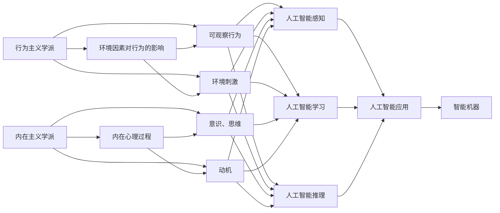

                 

# 行为主义学派与内在主义学派

## 1. 背景介绍

### 1.1 问题由来
心理学作为研究人类行为和心理活动的科学，其理论和研究方法经历了多次变革。在心理学史上，形成了两大主要学派：行为主义学派和内在主义学派。这两大学派在研究对象、研究方法、理论观点等方面存在显著差异，分别代表了对心理现象的不同理解和处理方式。本文将系统介绍这两大学派的基本理论框架和核心观点，并探讨它们在人工智能领域的应用和影响。

### 1.2 问题核心关键点
本文将重点围绕以下关键问题展开：
- 行为主义学派的基本原理和核心观点。
- 内在主义学派的基本原理和核心观点。
- 行为主义学派和内在主义学派在人工智能领域的应用和影响。
- 行为主义学派与内在主义学派的优缺点比较。

## 2. 核心概念与联系

### 2.1 核心概念概述

为更好地理解行为主义学派与内在主义学派，本节将介绍几个密切相关的核心概念：

- **行为主义学派**：以约翰·B·华生（John B. Watson）为代表，认为心理学应专注于可观察的行为，而非不可观察的意识和内在状态。行为主义学派强调环境因素对行为的影响，认为一切行为都是环境和刺激的结果。

- **内在主义学派**：以威廉·詹姆斯（William James）和让-皮埃尔·巴特勒罗伊（Jean Piaget）为代表，强调意识、思维和内在体验在心理学研究中的重要性。内在主义学派认为，人类的行为受到内在心理过程的驱动，如知觉、记忆、动机等。

- **心理学**：研究人类行为和心理活动的科学，旨在探索心理现象的规律和机制，为解决人类面临的各种问题提供理论支持和应用工具。

- **人工智能**：模拟人类智能的机器系统，通过学习和推理实现智能化的任务，涵盖感知、学习、推理、规划等多个方面。

- **行为主义学派与内在主义学派的联系**：两大学派虽然在研究方法和理论观点上存在分歧，但都致力于理解人类行为和心理活动的内在机制和外部环境的影响。在人工智能领域，两大学派的理论和方法被广泛应用，推动了人工智能技术的发展和应用。

这些核心概念之间的逻辑关系可以通过以下Mermaid流程图来展示：



这个流程图展示了两大学派的基本概念及其之间的联系：

1. 行为主义学派通过研究环境因素和刺激对行为的影响，强调外在的、可观察的行为。
2. 内在主义学派通过研究内在心理过程，如意识、思维和动机，强调内在的、不可观察的体验。
3. 两大学派的理论和方法在人工智能领域得到了广泛应用，推动了智能感知、学习和推理等技术的发展。
4. 最终，两大学派的理论和方法通过人工智能技术转化为智能机器的应用。

## 3. 核心算法原理 & 具体操作步骤
### 3.1 算法原理概述

行为主义学派与内在主义学派在算法原理上存在显著差异，本节将详细介绍两者的基本原理和操作步骤。

#### 3.1.1 行为主义学派算法原理

行为主义学派的核心思想是，所有行为都是由环境因素和刺激引起的。在算法上，行为主义学派强调通过观察和实验，理解环境和刺激如何影响行为。其基本原理包括以下几个方面：

1. **观察和实验**：通过观察和实验，收集和分析行为数据，理解行为与环境因素之间的关系。
2. **强化学习**：行为主义学派认为，行为是通过不断强化和弱化获得的。通过正负强化，调整行为的发生频率。
3. **环境建模**：构建环境模型，模拟和预测环境因素对行为的影响。
4. **反馈控制**：根据行为结果的反馈，调整行为策略，实现最优行为。

#### 3.1.2 内在主义学派算法原理

内在主义学派的核心思想是，人类的行为受到内在心理过程的驱动，如知觉、记忆、动机等。在算法上，内在主义学派强调通过研究内在心理过程，理解行为的内在机制。其基本原理包括以下几个方面：

1. **心理模型**：构建心理模型，模拟和预测内在心理过程对行为的影响。
2. **认知建模**：研究认知过程，如感知、记忆、思维等，理解行为的内部机制。
3. **动机分析**：分析动机的驱动作用，理解行为的动因和目标。
4. **行为生成**：通过内在心理过程的交互和反馈，生成行为。

### 3.2 算法步骤详解

#### 3.2.1 行为主义学派算法步骤

1. **数据收集**：通过观察和实验，收集行为数据，记录环境和刺激因素。
2. **行为分析**：分析行为数据，理解行为与环境因素之间的关系。
3. **强化设计**：设计正负强化策略，调整行为的发生频率。
4. **环境建模**：构建环境模型，模拟和预测环境因素对行为的影响。
5. **反馈控制**：根据行为结果的反馈，调整行为策略，实现最优行为。

#### 3.2.2 内在主义学派算法步骤

1. **心理模型构建**：构建心理模型，模拟和预测内在心理过程对行为的影响。
2. **认知建模**：研究认知过程，如感知、记忆、思维等，理解行为的内部机制。
3. **动机分析**：分析动机的驱动作用，理解行为的动因和目标。
4. **行为生成**：通过内在心理过程的交互和反馈，生成行为。

### 3.3 算法优缺点

#### 3.3.1 行为主义学派算法优缺点

**优点**：
- 强调环境和刺激对行为的影响，具有较强的可操作性和实用性。
- 通过强化学习机制，可以灵活调整行为策略，实现最优行为。
- 适用于环境复杂多变、行为目标明确的任务。

**缺点**：
- 忽略了内在心理过程对行为的影响，难以解释行为的内部机制。
- 强化学习需要大量的实验数据，存在数据稀疏和过拟合的风险。
- 难以处理内在心理过程复杂的任务，如情感和认知。

#### 3.3.2 内在主义学派算法优缺点

**优点**：
- 强调内在心理过程对行为的影响，具有较强的理论深度和解释力。
- 通过心理模型和认知建模，理解行为的内部机制，具有较高的解释性。
- 适用于内在心理过程复杂的任务，如情感和认知。

**缺点**：
- 强调内在心理过程，难以观察和量化，存在较大的理论难度。
- 心理模型和认知建模需要大量先验知识和理论支持，难以广泛应用。
- 难以处理外部环境复杂多变、行为目标不明确的任务。

### 3.4 算法应用领域

#### 3.4.1 行为主义学派应用领域

- **智能控制系统**：通过强化学习算法，优化控制策略，实现最优控制行为。例如，机器人避障、自动驾驶等。
- **人机交互**：通过行为分析算法，理解用户行为，优化人机交互体验。例如，语音识别、自然语言处理等。
- **游戏设计**：通过行为分析算法，设计玩家行为模型，实现游戏动态调整。例如，玩家行为预测、游戏难度调整等。

#### 3.4.2 内在主义学派应用领域

- **认知计算**：通过认知建模算法，理解认知过程，模拟人类智能。例如，知识图谱、符号推理等。
- **情感计算**：通过心理模型算法，理解情感过程，实现情感驱动的行为。例如，情感生成、情感识别等。
- **人机协作**：通过动机分析算法，理解动机驱动，优化人机协作效果。例如，任务分配、目标对齐等。

## 4. 数学模型和公式 & 详细讲解 & 举例说明（备注：数学公式请使用latex格式，latex嵌入文中独立段落使用 $$，段落内使用 $)
### 4.1 数学模型构建

#### 4.1.1 行为主义学派数学模型

在行为主义学派中，常用强化学习算法来模拟和预测行为。以Q-learning算法为例，其数学模型如下：

1. **状态表示**：将环境状态表示为$S$，行为表示为$A$。
2. **奖励函数**：定义奖励函数$R(S,A)$，表示行为在状态$S$下获得的奖励。
3. **Q值函数**：定义$Q$函数，表示在状态$S$下，行为$A$的期望奖励：

$$
Q(S,A) = \mathbb{E}[\sum_{t=0}^{\infty} \gamma^t R(S_t, A_t)] \tag{1}
$$

其中，$\gamma$为折扣因子，$S_t$和$A_t$分别表示第$t$时刻的状态和行为。

4. **Q-learning算法**：通过不断迭代更新$Q$函数，实现最优行为策略。其更新公式为：

$$
Q(S,A) \leftarrow Q(S,A) + \alpha [R(S,A) + \gamma \max_{A'} Q(S',A')] \tag{2}
$$

其中，$\alpha$为学习率，$S'$表示下一个状态，$A'$表示在$S'$下的最优行为。

#### 4.1.2 内在主义学派数学模型

在内在主义学派中，常用认知模型和心理模型来模拟和预测行为。以符号推理为例，其数学模型如下：

1. **知识表示**：将知识表示为符号串，定义符号$x$和$y$，表示知识集合中的元素。
2. **推理规则**：定义推理规则，如$x \rightarrow y$，表示从$x$推导出$y$的规则。
3. **推理过程**：根据推理规则，生成新的知识集合。例如，$x$推导出$y$，则$y$加入知识集合中。
4. **行为生成**：根据知识集合和推理规则，生成行为。例如，在知识集合中查找特定符号，执行相关行为。

### 4.2 公式推导过程

#### 4.2.1 行为主义学派公式推导

以Q-learning算法为例，其更新公式的推导过程如下：

1. **期望值计算**：根据$Q$函数的定义，计算$Q(S,A)$的期望值：

$$
Q(S,A) = \mathbb{E}[\sum_{t=0}^{\infty} \gamma^t R(S_t, A_t)] \tag{3}
$$

2. **期望值分解**：将期望值分解为当前状态和行为下，下一时刻的期望值：

$$
Q(S,A) = \mathbb{E}[R(S,A)] + \gamma \mathbb{E}[Q(S',A')] \tag{4}
$$

3. **更新公式推导**：根据$Q(S,A)$的更新公式，推导Q-learning算法的更新公式：

$$
Q(S,A) \leftarrow Q(S,A) + \alpha [R(S,A) + \gamma \max_{A'} Q(S',A')] \tag{2}
$$

#### 4.2.2 内在主义学派公式推导

以符号推理为例，其推理过程的推导过程如下：

1. **知识表示**：将知识表示为符号串，定义符号$x$和$y$，表示知识集合中的元素。
2. **推理规则**：定义推理规则，如$x \rightarrow y$，表示从$x$推导出$y$的规则。
3. **推理过程**：根据推理规则，生成新的知识集合。例如，$x$推导出$y$，则$y$加入知识集合中。
4. **行为生成**：根据知识集合和推理规则，生成行为。例如，在知识集合中查找特定符号，执行相关行为。

### 4.3 案例分析与讲解

#### 4.3.1 行为主义学派案例分析

以自动驾驶中的避障算法为例：

1. **数据收集**：通过摄像头和传感器，收集车辆周围的环境数据，如障碍物位置、车辆速度等。
2. **行为分析**：分析环境数据，理解障碍物的威胁等级。
3. **强化设计**：设计正负强化策略，如靠近障碍物时减速，远离障碍物时加速。
4. **环境建模**：构建环境模型，模拟障碍物的位置和移动。
5. **反馈控制**：根据车辆行为结果的反馈，调整控制策略，实现最优避障行为。

#### 4.3.2 内在主义学派案例分析

以情感识别算法为例：

1. **心理模型构建**：构建心理模型，模拟情感生成过程。例如，根据情绪状态和情感触发事件，生成情感表达。
2. **认知建模**：研究认知过程，如情绪识别、情感记忆等。例如，通过表情识别算法，理解用户的情绪状态。
3. **动机分析**：分析动机驱动，理解情感表达的动因和目标。例如，用户感到快乐时，表达积极的情感。
4. **行为生成**：根据情感状态和动机分析，生成情感表达。例如，用户感到愤怒时，表达消极的情感。

## 5. 项目实践：代码实例和详细解释说明
### 5.1 开发环境搭建

在进行行为主义学派与内在主义学派算法实践前，我们需要准备好开发环境。以下是使用Python进行强化学习和认知计算开发的Python环境配置流程：

1. 安装Anaconda：从官网下载并安装Anaconda，用于创建独立的Python环境。

2. 创建并激活虚拟环境：
```bash
conda create -n rllab-env python=3.8 
conda activate rllab-env
```

3. 安装Reinforcement Learning Toolkit (RLlib)：
```bash
conda install ray[default] rljax gym retro -c pypi
```

4. 安装SymPy：用于符号计算。
```bash
pip install sympy
```

5. 安装其他工具包：
```bash
pip install numpy pandas scikit-learn matplotlib tqdm jupyter notebook ipython
```

完成上述步骤后，即可在`rllab-env`环境中开始开发。

### 5.2 源代码详细实现

下面我们以Q-learning算法和符号推理算法为例，给出强化学习和认知计算的Python代码实现。

#### 5.2.1 Q-learning算法实现

```python
import numpy as np

class QLearning:
    def __init__(self, num_states, num_actions, learning_rate=0.1, discount_factor=0.9):
        self.num_states = num_states
        self.num_actions = num_actions
        self.learning_rate = learning_rate
        self.discount_factor = discount_factor
        self.q_values = np.zeros((num_states, num_actions))
        
    def select_action(self, state):
        return np.random.choice(np.where(self.q_values[state] == np.max(self.q_values[state]))[0])
    
    def update_q_value(self, state, action, reward, next_state):
        self.q_values[state, action] += self.learning_rate * (reward + self.discount_factor * np.max(self.q_values[next_state]) - self.q_values[state, action])
        
# 构建环境
import gym

env = gym.make('CartPole-v0')

# 初始化Q-learning算法
q_learning = QLearning(env.observation_space.n, env.action_space.n)

# 训练Q-learning算法
for episode in range(1000):
    state = env.reset()
    done = False
    while not done:
        action = q_learning.select_action(state)
        next_state, reward, done, _ = env.step(action)
        q_learning.update_q_value(state, action, reward, next_state)
        state = next_state

# 测试Q-learning算法
for episode in range(10):
    state = env.reset()
    done = False
    while not done:
        action = q_learning.select_action(state)
        state, reward, done, _ = env.step(action)
```

#### 5.2.2 符号推理算法实现

```python
import sympy

# 定义符号
x, y = sympy.symbols('x y')

# 定义推理规则
rule = {x: y}

# 推理过程
def symbolic_inference(x):
    if x in rule:
        return rule[x]
    else:
        return None

# 测试符号推理算法
result = symbolic_inference(x)
print(result)
```

### 5.3 代码解读与分析

让我们再详细解读一下关键代码的实现细节：

#### 5.3.1 Q-learning算法代码解读

**QLearning类**：
- `__init__`方法：初始化Q值表，设置学习率和折扣因子。
- `select_action`方法：根据Q值表选择最优动作。
- `update_q_value`方法：根据奖励和下一状态更新Q值。

**训练过程**：
- 构建环境，初始化Q-learning算法。
- 循环迭代，在每个回合中，选择动作，更新Q值表，直到回合结束。

#### 5.3.2 符号推理算法代码解读

**符号推理算法**：
- 定义符号$x$和$y$，表示知识集合中的元素。
- 定义推理规则$x \rightarrow y$，表示从$x$推导出$y$的规则。
- `symbolic_inference`函数：根据推理规则，生成新的知识集合。例如，$x$推导出$y$，则$y$加入知识集合中。

**测试过程**：
- 测试符号推理算法，输出结果。

## 6. 实际应用场景
### 6.1 智能控制系统

#### 6.1.1 行为主义学派应用场景

行为主义学派在智能控制系统中得到广泛应用，如自动驾驶、机器人导航等。这些系统需要通过观察和实验，理解环境和刺激对行为的影响，从而实现最优控制策略。例如，自动驾驶系统需要根据交通信号、车辆位置等环境因素，动态调整车速和方向，实现安全驾驶。

#### 6.1.2 内在主义学派应用场景

内在主义学派在情感计算和认知计算中得到应用，如情感识别、认知推理等。这些系统需要通过研究内在心理过程，理解情感和认知的驱动机制，从而实现情感驱动的行为和认知推理。例如，情感识别系统可以通过分析用户的表情和语音，识别其情感状态，并根据情感状态进行适当的响应。

### 6.2 人机交互

#### 6.2.1 行为主义学派应用场景

行为主义学派在人机交互中得到应用，如自然语言处理、语音识别等。这些系统需要通过观察和实验，理解用户行为，从而优化人机交互体验。例如，自然语言处理系统需要根据用户输入的语句，分析其意图和情感，生成相应的回复。

#### 6.2.2 内在主义学派应用场景

内在主义学派在人机协作和情感计算中得到应用，如任务分配、情感生成等。这些系统需要通过研究内在心理过程，理解动机和情感的驱动机制，从而优化人机协作效果和情感表达。例如，任务分配系统可以根据员工的技能和情感状态，动态分配任务，提高工作效率。

### 6.3 游戏设计

#### 6.3.1 行为主义学派应用场景

行为主义学派在游戏设计中得到应用，如玩家行为预测、游戏难度调整等。这些系统需要通过行为分析算法，理解玩家行为，从而优化游戏设计和调整游戏难度。例如，游戏系统可以根据玩家的行为数据，预测其游戏策略，动态调整游戏难度。

#### 6.3.2 内在主义学派应用场景

内在主义学派在游戏设计中得到应用，如情感生成、认知推理等。这些系统需要通过心理模型算法，理解玩家情感和认知过程，从而优化游戏体验和游戏设计。例如，游戏系统可以根据玩家的情感状态，生成相应的游戏情境，提高游戏沉浸感。

## 7. 工具和资源推荐
### 7.1 学习资源推荐

为了帮助开发者系统掌握行为主义学派与内在主义学派的基本理论和实践技巧，这里推荐一些优质的学习资源：

1. 《行为主义学派与内在主义学派》系列博文：由人工智能领域专家撰写，深入浅出地介绍了行为主义学派与内在主义学派的基本理论、核心观点及其在人工智能中的应用。

2. 《认知心理学》课程：由斯坦福大学开设的心理学课程，深入讲解认知过程和认知模型，为理解内在主义学派提供理论基础。

3. 《强化学习基础》书籍：深度学习领域的经典教材，详细介绍了强化学习的理论基础和实际应用，为行为主义学派提供理论支持。

4. 《符号计算与人工智能》论文：介绍了符号计算在人工智能中的应用，包括认知推理、知识图谱等，为内在主义学派提供理论支持。

5. 《人工智能理论与实践》课程：由清华大学开设的交叉学科课程，涵盖行为主义学派与内在主义学派的基本理论和实践技巧，适合初学者系统学习。

通过对这些资源的学习实践，相信你一定能够快速掌握行为主义学派与内在主义学派的基本理论和实践技巧，并将其应用于人工智能开发中。

### 7.2 开发工具推荐

高效的开发离不开优秀的工具支持。以下是几款用于行为主义学派与内在主义学派算法开发的常用工具：

1. PyTorch：基于Python的开源深度学习框架，灵活动态的计算图，适合快速迭代研究。

2. TensorFlow：由Google主导开发的开源深度学习框架，生产部署方便，适合大规模工程应用。

3. RLlib：Reinforcement Learning Toolkit，提供了丰富的强化学习算法，支持多种环境和任务。

4. SymPy：Python中的符号计算库，支持符号计算、代数运算等数学功能。

5. Weights & Biases：模型训练的实验跟踪工具，可以记录和可视化模型训练过程中的各项指标，方便对比和调优。

6. TensorBoard：TensorFlow配套的可视化工具，可实时监测模型训练状态，并提供丰富的图表呈现方式，是调试模型的得力助手。

合理利用这些工具，可以显著提升行为主义学派与内在主义学派算法的开发效率，加快创新迭代的步伐。

### 7.3 相关论文推荐

行为主义学派与内在主义学派的研究源于学界的持续研究。以下是几篇奠基性的相关论文，推荐阅读：

1. 《行为主义学派与内在主义学派》：系统总结了行为主义学派与内在主义学派的基本理论和方法，为理解两大学派提供理论基础。

2. 《认知心理学基础》：介绍了认知过程和认知模型的基本理论，为理解内在主义学派提供理论基础。

3. 《强化学习基础》：详细介绍了强化学习的理论基础和实际应用，为行为主义学派提供理论支持。

4. 《符号计算与人工智能》：介绍了符号计算在人工智能中的应用，为内在主义学派提供理论支持。

5. 《人工智能理论与实践》：涵盖行为主义学派与内在主义学派的基本理论和实践技巧，适合初学者系统学习。

这些论文代表了大行为主义学派与内在主义学派的发展脉络。通过学习这些前沿成果，可以帮助研究者把握学科前进方向，激发更多的创新灵感。

## 8. 总结：未来发展趋势与挑战

### 8.1 总结

本文对行为主义学派与内在主义学派的基本理论、核心观点及其在人工智能中的应用进行了系统介绍。通过对比两大学派的方法和观点，展示了行为主义学派与内在主义学派在人工智能领域的广泛应用和深远影响。通过本文的介绍，相信你能够更好地理解行为主义学派与内在主义学派的基本理论和应用场景，为未来的研究和实践提供理论基础和实践指导。

### 8.2 未来发展趋势

展望未来，行为主义学派与内在主义学派将继续在人工智能领域发挥重要作用，推动人工智能技术的不断进步。

1. **强化学习与认知计算的融合**：未来，强化学习将更多地借鉴认知计算的思想，理解行为的内在机制，实现更加智能化的决策。
2. **多模态信息融合**：行为主义学派与内在主义学派将更多地融合多模态信息，实现更加全面和准确的行为理解。例如，将视觉、听觉、触觉等多模态数据与文本数据结合，实现更加复杂的行为理解。
3. **深度学习与符号推理的结合**：行为主义学派与内在主义学派将更多地结合深度学习与符号推理，实现更加高效和准确的推理和计算。例如，使用深度学习模型提取特征，使用符号推理进行逻辑推理和决策。
4. **人机协作的强化**：行为主义学派与内在主义学派将更多地关注人机协作，实现更加自然和高效的交互。例如，通过理解用户的动机和情感，优化人机协作的效果。

### 8.3 面临的挑战

尽管行为主义学派与内在主义学派在人工智能领域已经取得了显著成就，但在迈向更加智能化、普适化应用的过程中，仍面临诸多挑战：

1. **数据稀疏和过拟合**：行为主义学派与内在主义学派在数据稀疏和过拟合的情况下，难以取得理想的效果。如何解决数据稀疏和过拟合的问题，是一个重要的研究方向。
2. **复杂多变环境**：行为主义学派与内在主义学派在复杂多变的环境中，难以建立稳定的模型。如何构建更加鲁棒和稳定的模型，是一个重要的研究方向。
3. **内在心理过程的建模**：内在主义学派在理解内在心理过程时，面临模型复杂和计算量大的问题。如何简化模型，提高计算效率，是一个重要的研究方向。
4. **跨模态数据的融合**：行为主义学派与内在主义学派在融合多模态数据时，面临数据不一致和融合方法复杂的问题。如何实现跨模态数据的有效融合，是一个重要的研究方向。
5. **伦理与安全**：行为主义学派与内在主义学派在实际应用中，面临伦理和安全问题。如何确保模型的公平性、透明性和安全性，是一个重要的研究方向。

### 8.4 研究展望

面对行为主义学派与内在主义学派所面临的挑战，未来的研究需要在以下几个方面寻求新的突破：

1. **数据增强与数据合成**：通过数据增强和数据合成技术，提高数据质量和多样性，缓解数据稀疏和过拟合的问题。
2. **模型压缩与高效计算**：通过模型压缩和高效计算技术，简化模型结构，提高计算效率，解决内在心理过程的建模问题。
3. **多模态数据融合**：通过多模态数据融合技术，实现跨模态数据的有效融合，解决复杂多变环境中的建模问题。
4. **伦理与安全保障**：通过伦理和安全保障技术，确保模型的公平性、透明性和安全性，解决伦理和安全问题。
5. **智能与普适化**：通过智能与普适化技术，实现更加智能和普适化的行为主义学派与内在主义学派模型，推动人工智能技术的广泛应用。

这些研究方向的探索，必将引领行为主义学派与内在主义学派技术迈向更高的台阶，为构建安全、可靠、可解释、可控的智能系统铺平道路。面向未来，行为主义学派与内在主义学派需要与其他人工智能技术进行更深入的融合，多路径协同发力，共同推动人工智能技术的进步。只有勇于创新、敢于突破，才能不断拓展人工智能技术的边界，让智能技术更好地造福人类社会。

## 9. 附录：常见问题与解答

**Q1：行为主义学派与内在主义学派的主要区别是什么？**

A: 行为主义学派与内在主义学派的主要区别在于研究对象和方法的不同：
- 行为主义学派研究可观察的行为，强调环境和刺激对行为的影响，忽略内在心理过程。
- 内在主义学派研究内在心理过程，如知觉、记忆、动机等，强调内在心理过程对行为的影响，忽略外部环境。

**Q2：行为主义学派与内在主义学派在人工智能领域的应用有哪些？**

A: 行为主义学派与内在主义学派在人工智能领域的应用非常广泛：
- 行为主义学派应用于智能控制系统、人机交互、游戏设计等领域，通过观察和实验理解环境和刺激对行为的影响，实现最优控制和交互。
- 内在主义学派应用于认知计算、情感计算、人机协作等领域，通过研究内在心理过程，理解情感和认知的驱动机制，优化认知推理和情感表达。

**Q3：如何理解和应用行为主义学派与内在主义学派的理论？**

A: 理解和应用行为主义学派与内在主义学派的理论，需要从以下几个方面入手：
- 理论基础：深入学习行为主义学派与内在主义学派的基本理论和核心观点，理解其思想和方法。
- 实践技巧：掌握行为主义学派与内在主义学派的具体实现方法，如强化学习算法、认知建模技术等。
- 应用场景：结合具体应用场景，理解和应用行为主义学派与内在主义学派的基本理论和方法，解决实际问题。
- 交叉融合：将行为主义学派与内在主义学派与其他人工智能技术进行融合，实现更加智能和普适化的应用。

**Q4：行为主义学派与内在主义学派在人工智能发展中的应用前景如何？**

A: 行为主义学派与内在主义学派在人工智能发展中的应用前景非常广阔：
- 随着技术的不断进步，行为主义学派与内在主义学派在智能控制系统、人机交互、认知计算等领域将发挥越来越重要的作用。
- 通过融合多模态数据和跨领域知识，行为主义学派与内在主义学派将实现更加全面和准确的行为理解，推动人工智能技术的广泛应用。
- 未来，行为主义学派与内在主义学派将在人机协作、情感计算、智能推荐等领域取得更多的突破，推动人工智能技术的普适化发展。

**Q5：行为主义学派与内在主义学派在实际应用中需要注意哪些问题？**

A: 在实际应用中，行为主义学派与内在主义学派需要注意以下问题：
- 数据稀疏和过拟合：数据稀疏和过拟合是行为主义学派与内在主义学派面临的主要问题，需要通过数据增强和模型压缩技术缓解。
- 模型鲁棒性和泛化能力：模型鲁棒性和泛化能力是行为主义学派与内在主义学派的主要挑战，需要通过鲁棒训练和迁移学习技术提升。
- 计算效率和资源消耗：计算效率和资源消耗是行为主义学派与内在主义学派面临的重要问题，需要通过高效计算和资源优化技术解决。
- 伦理和安全问题：伦理和安全问题是行为主义学派与内在主义学派面临的重要挑战，需要通过伦理和安全保障技术确保模型的公平性、透明性和安全性。

---

作者：禅与计算机程序设计艺术 / Zen and the Art of Computer Programming

