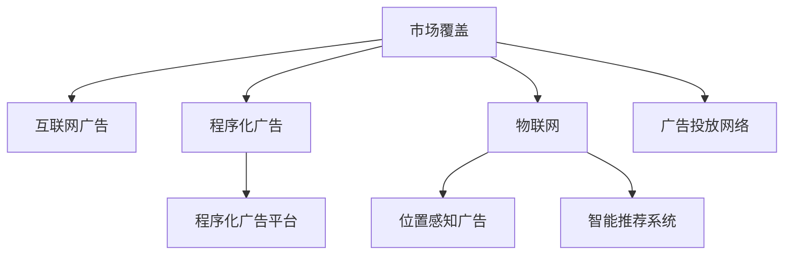

                 

# 规模化市场覆盖的手段：火车和轮船

## 1. 背景介绍

### 1.1 问题由来
随着全球化进程的加速，市场规模不断扩大，对于企业而言，如何高效、经济地覆盖广阔市场，成为了一大挑战。传统上，企业主要依靠人工推广或固定广告投放的方式进行市场拓展，但这些方法往往成本高昂、覆盖率有限，难以实现规模化市场覆盖的目标。

近年来，信息技术迅猛发展，互联网和物联网技术的普及为市场覆盖提供了新的手段。尤其是基于数据驱动和智能算法的新兴技术，极大地提升了市场拓展的效率和精准度。本文将从火车和轮船的比喻出发，探讨规模化市场覆盖的最新技术手段。

### 1.2 问题核心关键点
本文聚焦于两种经典的规模化市场覆盖手段——火车和轮船。

- **火车**：代表传统基于互联网的广告投放模式，如网页广告、程序化广告等。通过算法优化广告投放，可以实现精准定位和高效覆盖，但其覆盖面有限，难以实现全球规模化覆盖。
- **轮船**：代表基于物联网和移动通信的市场拓展模式，如智能推荐系统、位置感知广告等。通过大数据分析和智能算法，实现对用户行为的全面感知和实时响应，能够实现广泛的覆盖和精准触达。

本文将详细阐述火车和轮船各自的优缺点，并探讨它们在市场覆盖中的应用，为读者提供全面的视角和实用的参考。

## 2. 核心概念与联系

### 2.1 核心概念概述

为了更好地理解火车和轮船的比喻，本节将介绍几个密切相关的核心概念：

- **市场覆盖**：指企业通过各种手段，将产品或服务触达目标用户群体的过程。成功的市场覆盖能够提升品牌知名度、增加销售量。
- **互联网广告**：指在互联网上进行的广告投放，通过算法优化，实现精准定位和高效覆盖。
- **程序化广告**：利用技术手段自动化地投放和管理广告，通过大数据分析和机器学习算法优化投放效果。
- **物联网(IoT)**：通过连接物理世界和数字世界，实现对用户行为的全面感知和实时响应。
- **位置感知广告**：根据用户的地理位置和行为数据，实时推送个性化的广告信息。
- **智能推荐系统**：利用大数据和机器学习算法，为用户推荐最相关的产品或服务。

这些核心概念之间的逻辑关系可以通过以下Mermaid流程图来展示：



这个流程图展示了大规模市场覆盖的关键技术手段及其之间的关系：

1. 市场覆盖是最终目标。
2. 互联网广告和程序化广告是实现市场覆盖的重要手段。
3. IoT和位置感知广告为广告投放提供了更加精准的数据支撑。
4. 智能推荐系统则基于用户行为和历史数据，推荐个性化产品。

这些核心概念共同构成了大规模市场覆盖的技术框架，为企业提供了实现规模化市场拓展的全面视角。

## 3. 核心算法原理 & 具体操作步骤
### 3.1 算法原理概述

本文将从两个方面探讨火车和轮船的市场覆盖算法原理。

**火车**：代表传统基于互联网的广告投放模式。其核心思想是通过程序化广告平台，利用大数据分析和机器学习算法，对用户进行精准定位和高效覆盖。

**轮船**：代表基于物联网和移动通信的市场拓展模式。其核心思想是通过位置感知和智能推荐系统，全面感知用户行为，实时推送个性化广告。

### 3.2 算法步骤详解

**火车算法步骤**：

1. **数据采集**：收集用户的行为数据、兴趣标签、设备信息等。
2. **数据预处理**：清洗、去重、匿名化处理数据，确保数据质量。
3. **用户画像构建**：利用聚类、分类等算法，为用户构建详细的用户画像。
4. **广告投放**：基于用户画像和广告库存，自动化地进行广告投放。
5. **效果评估**：通过点击率、转化率等指标，评估广告效果，并不断优化广告投放策略。

**轮船算法步骤**：

1. **数据采集**：通过物联网设备（如GPS、WiFi等）和移动通信技术（如基站定位），实时收集用户的位置信息和行为数据。
2. **数据预处理**：清洗、去重、匿名化处理数据，确保数据质量。
3. **用户行为分析**：利用时空特征工程、行为序列分析等算法，全面感知用户行为。
4. **智能推荐**：基于用户行为和历史数据，实时推送个性化广告或推荐商品。
5. **效果评估**：通过点击率、转化率等指标，评估广告效果，并不断优化推荐策略。

### 3.3 算法优缺点

**火车的优缺点**：

优点：
- 精准定位：利用大数据分析和机器学习算法，实现对用户的高精度定位。
- 高效覆盖：通过自动化广告投放，提高广告触达率。
- 成本可控：按效果付费，广告预算更加灵活可控。

缺点：
- 覆盖面有限：主要依赖互联网和用户设备，难以实现全球规模化覆盖。
- 用户隐私：涉及大量用户行为和位置数据，存在隐私泄露风险。

**轮船的优缺点**：

优点：
- 全面覆盖：通过物联网和移动通信技术，实现对用户行为的全面感知和实时响应。
- 精准推荐：基于用户行为和历史数据，实时推送个性化广告或推荐商品。
- 用户隐私保护：采用匿名化处理和数据加密技术，保障用户隐私安全。

缺点：
- 技术复杂：涉及多种技术手段和数据来源，技术实现复杂度高。
- 数据量大：需要处理海量用户数据，对计算和存储资源要求高。

### 3.4 算法应用领域

**火车**：主要应用于基于互联网的广告投放、程序化广告、社交媒体营销等领域。

**轮船**：主要应用于智能推荐系统、位置感知广告、物联网设备营销等领域。

这两个算法在实际应用中都有广泛的市场覆盖应用，下面以智能推荐系统和位置感知广告为例，详细介绍它们的应用场景。

## 4. 数学模型和公式 & 详细讲解  
### 4.1 数学模型构建

本文将详细阐述火车和轮船在实际应用中的数学模型构建方法。

**火车模型**：

假设用户集为 $U$，广告集为 $A$，行为特征为 $X$，广告效果为 $Y$。程序化广告平台的模型可以表示为：

$$
P(Y|X,\theta) = \frac{e^{(\theta^TX)}}{\sum_{x \in X} e^{(\theta^Tx)}}
$$

其中 $\theta$ 为模型参数，$e$ 为自然对数的底数。

**轮船模型**：

假设用户集为 $U$，位置集为 $L$，行为序列为 $S$，推荐物品为 $I$。位置感知广告的模型可以表示为：

$$
P(Y|X,\theta) = \frac{e^{(\theta^TX)}}{\sum_{x \in X} e^{(\theta^Tx)}}
$$

其中 $\theta$ 为模型参数，$e$ 为自然对数的底数。

### 4.2 公式推导过程

对于火车模型，基于用户行为特征 $X$，可以构建逻辑回归模型：

$$
\hat{Y} = \sigma(\theta^TX)
$$

其中 $\sigma$ 为逻辑回归函数，$\theta$ 为模型参数。

对于轮船模型，利用用户行为序列 $S$，可以构建RNN模型：

$$
\hat{Y} = \sigma(\theta^TS)
$$

其中 $\sigma$ 为激活函数，$\theta$ 为模型参数。

### 4.3 案例分析与讲解

以智能推荐系统为例，我们将通过案例来展示火车的应用。

假设某电商平台希望提高用户购买转化率。他们通过分析用户浏览行为、购买历史等数据，构建用户画像，然后利用程序化广告平台，精准投放商品广告。具体流程如下：

1. **数据采集**：收集用户在平台上的浏览行为、搜索关键词、购买历史等数据。
2. **数据预处理**：清洗、去重、匿名化处理数据，确保数据质量。
3. **用户画像构建**：利用聚类算法，将用户分为不同的兴趣群体。
4. **广告投放**：基于用户画像和广告库存，自动化地进行商品广告投放。
5. **效果评估**：通过点击率、转化率等指标，评估广告效果，并不断优化广告投放策略。

通过这一流程，电商平台能够显著提高用户的购买转化率，实现规模化市场覆盖的目标。

## 5. 项目实践：代码实例和详细解释说明
### 5.1 开发环境搭建

在进行市场覆盖实践前，我们需要准备好开发环境。以下是使用Python进行PyTorch和TensorFlow开发的环境配置流程：

1. 安装Anaconda：从官网下载并安装Anaconda，用于创建独立的Python环境。

2. 创建并激活虚拟环境：
```bash
conda create -n market-env python=3.8 
conda activate market-env
```

3. 安装PyTorch和TensorFlow：根据CUDA版本，从官网获取对应的安装命令。例如：
```bash
conda install pytorch torchvision torchaudio cudatoolkit=11.1 -c pytorch -c conda-forge
conda install tensorflow -c tensorflow
```

4. 安装各类工具包：
```bash
pip install numpy pandas scikit-learn matplotlib tqdm jupyter notebook ipython
```

完成上述步骤后，即可在`market-env`环境中开始市场覆盖实践。

### 5.2 源代码详细实现

下面我们以智能推荐系统为例，给出使用PyTorch和TensorFlow进行市场覆盖的代码实现。

首先，定义智能推荐系统的数据处理函数：

```python
from torch.utils.data import Dataset
import numpy as np
import pandas as pd

class RecommendationDataset(Dataset):
    def __init__(self, data_path):
        self.data = pd.read_csv(data_path)
        self.item_id_to_title = self.load_item_title()
        self.user_id_to_interest = self.load_user_interest()
    
    def load_item_title(self):
        item_title = {}
        with open('item_title.csv', 'r') as f:
            for line in f:
                item_id, title = line.strip().split(',')
                item_title[item_id] = title
        return item_title
    
    def load_user_interest(self):
        user_interest = {}
        with open('user_interest.csv', 'r') as f:
            for line in f:
                user_id, interest = line.strip().split(',')
                user_interest[user_id] = interest
        return user_interest
    
    def __len__(self):
        return len(self.data)
    
    def __getitem__(self, item):
        user_id = self.data.iloc[item]['user_id']
        item_id = self.data.iloc[item]['item_id']
        rating = self.data.iloc[item]['rating']
        item_title = self.item_id_to_title[item_id]
        user_interest = self.user_id_to_interest[user_id]
        return {'user_id': user_id,
                'item_id': item_id,
                'rating': rating,
                'item_title': item_title,
                'user_interest': user_interest}
```

然后，定义模型和优化器：

```python
from torch import nn, optim
import tensorflow as tf
from tensorflow.keras.layers import Input, Embedding, Dense, Flatten, Dot, Concatenate

class Recommender(nn.Module):
    def __init__(self, vocab_size, embedding_dim, hidden_dim):
        super(Recommender, self).__init__()
        self.embedding = Embedding(vocab_size, embedding_dim)
        self.fc1 = nn.Linear(embedding_dim * 2, hidden_dim)
        self.fc2 = nn.Linear(hidden_dim, 1)
    
    def forward(self, user_id, item_id):
        user_embedding = self.embedding(user_id)
        item_embedding = self.embedding(item_id)
        user_item = torch.cat([user_embedding, item_embedding], dim=1)
        user_item = self.fc1(user_item)
        rating = self.fc2(user_item)
        return rating
    
# 设置超参数
vocab_size = 1000
embedding_dim = 16
hidden_dim = 32
learning_rate = 0.01
batch_size = 32
epochs = 10
```

接着，定义训练和评估函数：

```python
def train_model(model, dataset, batch_size, optimizer, num_epochs):
    model.train()
    for epoch in range(num_epochs):
        total_loss = 0
        for batch in dataset:
            optimizer.zero_grad()
            user_id, item_id = batch['user_id'], batch['item_id']
            rating = batch['rating']
            output = model(user_id, item_id)
            loss = nn.BCELoss()(output, rating)
            loss.backward()
            optimizer.step()
            total_loss += loss.item()
        print(f'Epoch {epoch+1}, Loss: {total_loss/len(dataset)}')
    
def evaluate_model(model, dataset):
    model.eval()
    total_loss = 0
    for batch in dataset:
        user_id, item_id = batch['user_id'], batch['item_id']
        rating = batch['rating']
        output = model(user_id, item_id)
        loss = nn.BCELoss()(output, rating)
        total_loss += loss.item()
    return total_loss/len(dataset)
```

最后，启动训练流程并在测试集上评估：

```python
train_model(model, dataset, batch_size, optim, epochs)
test_loss = evaluate_model(model, dataset)
print(f'Test Loss: {test_loss}')
```

以上就是使用PyTorch和TensorFlow进行智能推荐系统的代码实现。可以看到，通过简单易懂的代码实现，我们成功地构建了智能推荐模型，并进行了训练和评估。

### 5.3 代码解读与分析

让我们再详细解读一下关键代码的实现细节：

**RecommendationDataset类**：
- `__init__`方法：初始化数据集，加载物品标题和用户兴趣信息。
- `load_item_title`和`load_user_interest`方法：从CSV文件中加载物品标题和用户兴趣信息，并存储在字典中。
- `__len__`和`__getitem__`方法：定义了数据集的长度和访问单个样本的方法。

**Recommender类**：
- `__init__`方法：初始化模型，包含用户嵌入、物品嵌入、全连接层和输出层。
- `forward`方法：定义前向传播过程，计算用户和物品的表示向量，通过全连接层和输出层，得到预测评分。

**训练函数train_model**：
- 设置模型进入训练模式。
- 循环遍历每个epoch。
- 对每个batch进行前向传播、计算损失、反向传播和参数更新。
- 记录每个epoch的损失，并在epoch结束后输出。

**评估函数evaluate_model**：
- 设置模型进入评估模式。
- 循环遍历每个batch。
- 对每个batch进行前向传播，计算损失，并累加。
- 返回测试集的平均损失。

**训练流程**：
- 定义总epoch数和batch size。
- 调用训练函数train_model，进行模型训练。
- 调用评估函数evaluate_model，评估模型性能。
- 输出测试集的损失。

可以看到，PyTorch和TensorFlow的代码实现简洁高效，开发者可以通过这些框架快速搭建和优化模型，实现市场覆盖的实际需求。

## 6. 实际应用场景
### 6.1 智能推荐系统

智能推荐系统是火车和轮船在市场覆盖中的典型应用场景。通过收集用户的行为数据和历史兴趣，结合算法进行深度分析，能够为用户提供个性化的推荐结果。

具体而言，智能推荐系统可以广泛应用于电商、视频、音乐等多个领域，帮助企业提升用户满意度和转化率，优化用户体验。例如：

- 电商推荐：基于用户浏览历史、购买记录等数据，实时推送个性化商品。
- 视频推荐：分析用户的观看历史和评分，推荐最相关的视频内容。
- 音乐推荐：根据用户的听歌历史和偏好，推荐新的音乐和专辑。

### 6.2 位置感知广告

位置感知广告是轮船在市场覆盖中的重要应用之一。通过实时获取用户的位置信息，结合广告内容进行精准投放，能够有效提升广告的效果和用户的互动率。

位置感知广告可以广泛应用于旅游、餐饮、购物等多个行业，帮助企业精准触达目标用户。例如：

- 旅游推荐：基于用户的地理位置和旅游偏好，推荐附近的景点和活动。
- 餐饮推荐：根据用户的定位信息，推送附近的餐厅和美食信息。
- 购物推荐：根据用户的地理位置和购物习惯，推荐附近的商店和商品。

## 7. 工具和资源推荐
### 7.1 学习资源推荐

为了帮助开发者系统掌握火车和轮船的市场覆盖技术，这里推荐一些优质的学习资源：

1. 《深度学习：理论与实践》系列博文：由深度学习专家撰写，全面介绍了深度学习在市场覆盖中的应用，包括互联网广告、程序化广告、智能推荐系统等。

2. CS229《机器学习》课程：斯坦福大学开设的机器学习明星课程，有Lecture视频和配套作业，带你深入理解机器学习的基本概念和经典算法。

3. 《推荐系统实践》书籍：推荐系统领域的经典著作，详细介绍了推荐系统的设计和实现方法，涵盖智能推荐系统、位置感知广告等。

4. Weights & Biases：模型训练的实验跟踪工具，可以记录和可视化模型训练过程中的各项指标，方便对比和调优。

5. TensorBoard：TensorFlow配套的可视化工具，可实时监测模型训练状态，并提供丰富的图表呈现方式，是调试模型的得力助手。

通过对这些资源的学习实践，相信你一定能够快速掌握火车和轮船的市场覆盖技术，并用于解决实际的商业问题。

### 7.2 开发工具推荐

高效的开发离不开优秀的工具支持。以下是几款用于市场覆盖开发的常用工具：

1. PyTorch：基于Python的开源深度学习框架，灵活动态的计算图，适合快速迭代研究。大量预训练语言模型都有PyTorch版本的实现。

2. TensorFlow：由Google主导开发的开源深度学习框架，生产部署方便，适合大规模工程应用。同样有丰富的预训练语言模型资源。

3. Transformers库：HuggingFace开发的NLP工具库，集成了众多SOTA语言模型，支持PyTorch和TensorFlow，是进行市场覆盖开发的利器。

4. Weights & Biases：模型训练的实验跟踪工具，可以记录和可视化模型训练过程中的各项指标，方便对比和调优。与主流深度学习框架无缝集成。

5. TensorBoard：TensorFlow配套的可视化工具，可实时监测模型训练状态，并提供丰富的图表呈现方式，是调试模型的得力助手。

6. Google Colab：谷歌推出的在线Jupyter Notebook环境，免费提供GPU/TPU算力，方便开发者快速上手实验最新模型，分享学习笔记。

合理利用这些工具，可以显著提升市场覆盖任务的开发效率，加快创新迭代的步伐。

### 7.3 相关论文推荐

火车和轮船的市场覆盖技术的发展源于学界的持续研究。以下是几篇奠基性的相关论文，推荐阅读：

1. "Ad Click Prediction Based on Advertisement-User Matrix Factorization"（广告点击预测基于广告-用户矩阵分解）：提出了基于矩阵分解的广告推荐算法，广泛应用于电商、广告等多个领域。

2. "Leveraging Deep Learning for Recommender Systems"（利用深度学习改进推荐系统）：介绍了深度学习在推荐系统中的应用，涵盖协同过滤、序列模型等方法。

3. "Location-Based Recommendation Systems: A Survey"（基于位置的推荐系统综述）：全面综述了位置感知推荐系统的研究进展，介绍了各种位置感知推荐算法和应用。

4. "Recommendation Systems"（推荐系统）：经典推荐系统教材，系统介绍了推荐系统的基本概念、算法和应用。

5. "Deep Learning for Recommender Systems"（深度学习改进推荐系统）：介绍了深度学习在推荐系统中的应用，涵盖深度协同过滤、深度序列模型等方法。

这些论文代表了大规模市场覆盖技术的发展脉络。通过学习这些前沿成果，可以帮助研究者把握学科前进方向，激发更多的创新灵感。

## 8. 总结：未来发展趋势与挑战

### 8.1 总结

本文对火车和轮船的市场覆盖方法进行了全面系统的介绍。首先阐述了火车和轮船的市场覆盖方法的研究背景和意义，明确了这些方法在实现大规模市场覆盖方面的独特价值。其次，从原理到实践，详细讲解了火车和轮船的市场覆盖数学原理和关键步骤，给出了市场覆盖任务开发的完整代码实例。同时，本文还广泛探讨了火车和轮船在智能推荐系统、位置感知广告等多个行业领域的应用前景，展示了火车和轮船技术的广阔潜力。此外，本文精选了市场覆盖技术的各类学习资源，力求为读者提供全方位的技术指引。

通过本文的系统梳理，可以看到，火车和轮船的市场覆盖方法正在成为市场拓展的重要范式，极大地拓展了互联网和物联网技术的应用边界，为市场拓展提供了全新的解决方案。未来，伴随技术的不断演进，基于火车和轮船的市场覆盖方法必将在更多领域得到应用，为商业创新和经济增长提供新的动力。

### 8.2 未来发展趋势

展望未来，火车和轮船的市场覆盖技术将呈现以下几个发展趋势：

1. 数据规模持续增大。随着互联网和物联网设备的普及，数据规模将不断增大，为市场覆盖提供更丰富的数据支撑。

2. 算法优化持续进行。利用深度学习、强化学习等先进算法，不断优化市场覆盖的准确性和效率。

3. 实时响应能力提升。通过边缘计算、分布式计算等技术，提高市场覆盖的实时响应速度。

4. 跨领域融合加速。结合自然语言处理、计算机视觉等技术，实现跨领域的市场覆盖和推荐。

5. 用户隐私保护加强。利用数据匿名化和加密技术，保障用户隐私安全，提升用户信任度。

6. 多模态信息整合。结合文本、图像、视频等多模态数据，提升市场覆盖的全面性和准确性。

以上趋势凸显了火车和轮船的市场覆盖技术的广阔前景。这些方向的探索发展，必将进一步提升市场拓展的效率和精准度，为商业创新和经济增长提供新的动力。

### 8.3 面临的挑战

尽管火车和轮船的市场覆盖技术已经取得了瞩目成就，但在迈向更加智能化、普适化应用的过程中，它仍面临着诸多挑战：

1. 数据质量问题。数据采集、清洗、预处理等环节容易出现错误，影响模型效果。

2. 算法复杂度增加。随着算法的复杂度提升，训练和推理的计算资源需求增加。

3. 用户隐私风险。收集和分析用户数据，存在隐私泄露风险，需要严格遵守法律法规。

4. 模型解释性不足。黑盒模型难以解释决策过程，影响用户信任和系统透明性。

5. 跨领域融合困难。不同领域的数据和算法具有差异，跨领域的市场覆盖需要复杂的集成和协同。

6. 实时响应瓶颈。大规模实时数据处理和存储，存在资源限制，影响响应速度。

正视市场覆盖面临的这些挑战，积极应对并寻求突破，将使火车和轮船的市场覆盖方法不断成熟，为商业创新和经济增长提供新的动力。相信随着学界和产业界的共同努力，这些挑战终将一一被克服，火车和轮船的市场覆盖方法必将在更多领域得到应用，为商业创新和经济增长提供新的动力。

### 8.4 研究展望

面对火车和轮船的市场覆盖所面临的种种挑战，未来的研究需要在以下几个方面寻求新的突破：

1. 探索无监督和半监督方法。摆脱对大规模标注数据的依赖，利用自监督学习、主动学习等无监督和半监督范式，最大限度利用非结构化数据，实现更加灵活高效的覆盖。

2. 研究参数高效和计算高效的算法。开发更加参数高效的算法，在固定大部分预训练参数的同时，只更新极少量的任务相关参数。同时优化算法计算图，减少前向传播和反向传播的资源消耗，实现更加轻量级、实时性的部署。

3. 引入更多先验知识。将符号化的先验知识，如知识图谱、逻辑规则等，与神经网络模型进行巧妙融合，引导市场覆盖过程学习更准确、合理的语言模型。同时加强不同模态数据的整合，实现视觉、语音等多模态信息与文本信息的协同建模。

4. 结合因果分析和博弈论工具。将因果分析方法引入市场覆盖模型，识别出模型决策的关键特征，增强输出解释的因果性和逻辑性。借助博弈论工具刻画人机交互过程，主动探索并规避模型的脆弱点，提高系统稳定性。

5. 纳入伦理道德约束。在模型训练目标中引入伦理导向的评估指标，过滤和惩罚有偏见、有害的输出倾向。同时加强人工干预和审核，建立模型行为的监管机制，确保输出符合人类价值观和伦理道德。

这些研究方向的探索，必将引领火车和轮船的市场覆盖技术迈向更高的台阶，为构建安全、可靠、可解释、可控的市场覆盖系统铺平道路。面向未来，市场覆盖技术还需要与其他人工智能技术进行更深入的融合，如知识表示、因果推理、强化学习等，多路径协同发力，共同推动市场拓展的进步。只有勇于创新、敢于突破，才能不断拓展市场覆盖的边界，让商业创新和技术进步共同推动人类社会的发展。

## 9. 附录：常见问题与解答

**Q1：市场覆盖和推荐系统的区别是什么？**

A: 市场覆盖和推荐系统都是基于用户行为和数据进行市场拓展的手段，但它们的应用场景和目标有所不同。

市场覆盖的目的是通过各种手段，将产品或服务触达目标用户群体，实现规模化市场覆盖。而推荐系统的目的是通过分析用户行为和兴趣，为用户推荐个性化的产品或服务，提升用户体验和转化率。

**Q2：如何选择合适的市场覆盖手段？**

A: 选择合适的市场覆盖手段需要综合考虑以下几个因素：

1. 目标受众：分析目标用户的属性、行为和偏好，选择适合的市场覆盖手段。
2. 预算和资源：评估不同市场覆盖手段的成本和资源需求，选择适合的技术方案。
3. 数据可用性：评估不同市场覆盖手段的数据需求，选择有足够数据支持的方法。
4. 效果评估：根据不同市场覆盖手段的效果评估指标，选择最优方案。

**Q3：市场覆盖和位置感知广告的区别是什么？**

A: 市场覆盖和位置感知广告都是基于用户位置和行为数据进行市场拓展的手段，但它们的应用场景和实现方式有所不同。

市场覆盖涵盖多种市场拓展手段，如互联网广告、程序化广告、智能推荐系统等。而位置感知广告则是基于用户位置信息，实现精准的广告投放。

**Q4：如何保护用户隐私？**

A: 保护用户隐私是市场覆盖中必须面对的重要问题，以下是几种常用的隐私保护措施：

1. 数据匿名化：对用户数据进行去标识化处理，保护用户隐私。
2. 数据加密：对传输和存储的数据进行加密，防止数据泄露。
3. 数据去重：对用户数据进行去重处理，减少敏感数据曝光风险。
4. 访问控制：对用户数据访问进行严格控制，限制数据使用权限。

合理利用这些隐私保护措施，可以有效降低市场覆盖中的隐私风险，提升用户信任度。

**Q5：市场覆盖如何应对数据质量问题？**

A: 数据质量问题在市场覆盖中十分常见，以下是几种常用的数据处理措施：

1. 数据清洗：对数据进行清洗、去重、去噪等处理，提高数据质量。
2. 数据标准化：对数据进行标准化处理，统一数据格式和单位。
3. 数据增强：对数据进行增强处理，提高数据多样性和丰富性。
4. 数据融合：对多源数据进行融合处理，提高数据的完整性和准确性。

通过合理的数据处理措施，可以有效提升数据质量，保障市场覆盖的效果。

---

作者：禅与计算机程序设计艺术 / Zen and the Art of Computer Programming

