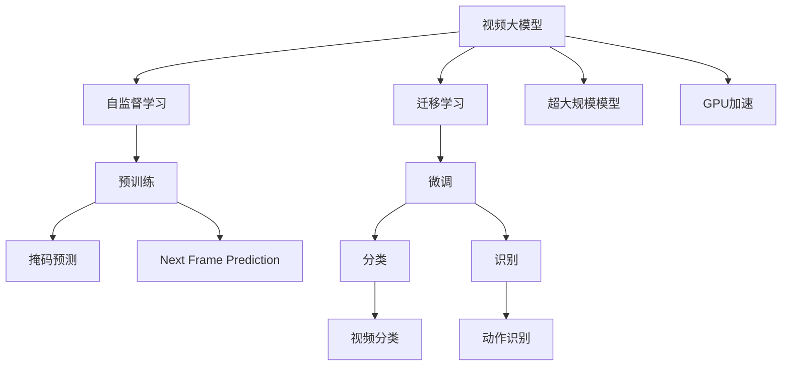

                 

# 视频大模型的工程技术详解

> 关键词：视频大模型,工程技术,深度学习,计算机视觉,Transformer,自监督学习,迁移学习,超大规模模型,GPU加速

## 1. 背景介绍

随着人工智能技术的不断进步，深度学习在计算机视觉、自然语言处理等领域的应用取得了显著成效。而视频大模型作为一种新兴的深度学习模型，其在处理复杂视频数据方面的潜力也逐渐显现。本篇文章将详细介绍视频大模型的工程技术，帮助读者系统了解其核心概念、算法原理及实际应用场景。

## 2. 核心概念与联系

### 2.1 核心概念概述

在深入讨论视频大模型的工程技术之前，首先需要理解几个核心概念：

- **视频大模型**：指通过大规模数据集进行预训练的深度学习模型，能够对视频数据进行编码和理解。其通常基于Transformer架构，具有强大的语义理解和生成能力。

- **自监督学习**：指在无标签数据上训练模型，通过模型自身的预测能力和损失函数来优化模型参数。常用的自监督学习任务包括掩码预测、Next Frame Prediction等。

- **迁移学习**：指将在大规模数据上训练的模型迁移到特定任务上，通过微调模型参数来提升在特定任务上的性能。视频大模型通常通过迁移学习应用于视频分类、动作识别等任务。

- **超大规模模型**：指具有亿量级别参数的深度学习模型，能够处理大规模、高复杂度的数据集，具有强大的推理能力和泛化能力。

- **GPU加速**：指利用图形处理器(GPU)的高并行计算能力，加速深度学习模型的训练和推理过程。

这些核心概念之间存在着密切的联系，共同构成了视频大模型的技术框架。自监督学习和迁移学习是视频大模型预训练和微调的基础，而超大规模模型和GPU加速则是其实现高效推理和训练的保障。

### 2.2 核心概念原理和架构的 Mermaid 流程图(Mermaid 流程节点中不要有括号、逗号等特殊字符)



这个流程图展示了视频大模型技术的关键流程：预训练自监督学习任务（掩码预测、Next Frame Prediction等）、迁移学习微调、超大规模模型的部署和GPU加速的实现。通过这些流程，视频大模型能够高效地处理视频数据，并应用于各种计算机视觉任务。

## 3. 核心算法原理 & 具体操作步骤

### 3.1 算法原理概述

视频大模型的核心算法主要基于Transformer架构和深度学习理论。其通过大规模数据集进行自监督学习，学习到视频数据中各帧之间的空间和时间关系，然后在特定任务上进行迁移学习微调，提升在特定任务上的性能。以下是对其核心算法原理的详细解释：

### 3.2 算法步骤详解

#### 3.2.1 预训练阶段

1. **数据准备**：收集大规模无标签视频数据集，并进行数据清洗和预处理，如裁剪、缩放、归一化等。
   
2. **模型初始化**：选择适合的Transformer模型结构，初始化模型参数。

3. **自监督学习任务**：在无标签视频数据集上，选择适当的自监督学习任务进行模型训练，如掩码预测、Next Frame Prediction等。通过这些任务，模型学习到视频中各帧之间的空间和时间关系。

4. **损失函数**：设计适当的损失函数，如掩码预测任务的交叉熵损失、Next Frame Prediction任务的L1损失等，用于优化模型参数。

5. **优化器**：选择适当的优化器，如AdamW、SGD等，设置学习率、批次大小等超参数。

6. **训练过程**：在数据集上进行多轮训练，每轮训练中，将视频数据输入模型，前向传播计算损失，反向传播更新模型参数。

#### 3.2.2 微调阶段

1. **任务适配**：根据特定任务的需求，设计合适的输出层和损失函数。如分类任务使用softmax输出层和交叉熵损失函数。

2. **数据准备**：准备特定任务的标注数据集，将其分为训练集、验证集和测试集。

3. **模型加载**：加载预训练模型，设置冻结部分或全部预训练参数。

4. **微调训练**：在标注数据集上，使用特定任务的损失函数，进行多轮微调训练，每轮训练中，将数据输入模型，前向传播计算损失，反向传播更新模型参数。

5. **验证和测试**：在验证集上评估模型性能，调整超参数，在测试集上最终评估模型效果。

### 3.3 算法优缺点

#### 3.3.1 算法优点

1. **高效推理**：视频大模型能够高效地处理大规模视频数据，具有强大的推理能力。

2. **泛化能力强**：通过自监督学习，模型能够在无标签数据上学习到通用知识，具有较强的泛化能力。

3. **迁移能力强**：在特定任务上进行微调，模型能够快速适应新任务，提升性能。

4. **GPU加速支持**：利用GPU加速技术，模型训练和推理速度大大提升，能够满足实时应用需求。

#### 3.3.2 算法缺点

1. **资源消耗大**：超大规模模型的训练和推理需要大量计算资源，对GPU等硬件设备要求高。

2. **数据需求高**：自监督学习任务需要大规模无标签数据，获取高质量数据成本高。

3. **模型复杂**：模型结构复杂，调试和优化难度大。

4. **计算复杂度高**：深度学习模型的训练和推理计算复杂度高，需要高效的优化算法和数据处理策略。

### 3.4 算法应用领域

视频大模型在多个领域都有广泛应用，包括但不限于：

1. **视频分类**：将视频数据分为不同类别，如电影、体育、新闻等。

2. **动作识别**：识别视频中的人体动作，应用于体育、安防等领域。

3. **行为分析**：分析视频中的人体行为，用于智能家居、无人驾驶等领域。

4. **视频生成**：生成视频内容，如虚拟角色动作、动画等。

5. **视频编辑**：自动剪辑视频，如自动去除重复片段、添加特效等。

6. **视频压缩**：对视频进行压缩，减少存储空间和带宽消耗。

## 4. 数学模型和公式 & 详细讲解 & 举例说明

### 4.1 数学模型构建

视频大模型通常采用Transformer架构，其核心是一个自注意力机制，可以捕捉视频中各帧之间的空间和时间关系。以下是对Transformer模型的数学模型构建的详细解释：

#### 4.1.1 编码器-解码器结构

Transformer模型由多个编码器和解码器组成，每个编码器和解码器都包含多个自注意力层和前馈神经网络层。其结构如图1所示：


#### 4.1.2 自注意力机制

Transformer模型的核心是自注意力机制，用于捕捉视频中各帧之间的关系。其基本原理是通过查询、键和值的矩阵运算，计算每个位置与所有其他位置的相关性，如图2所示：


其中，Q为查询矩阵，K为键矩阵，V为值矩阵。通过计算得到的能量矩阵，可以表示每个位置与其他位置的相关性，从而捕捉视频中各帧之间的关系。

### 4.2 公式推导过程

#### 4.2.1 编码器自注意力层

编码器自注意力层的公式如下：

$$
Attention(Q, K, V) = Softmax(Q \cdot K^T / \sqrt{d_k}) \cdot V
$$

其中，$Q$、$K$、$V$分别表示查询、键和值矩阵，$d_k$表示键的维度。通过Softmax函数将能量矩阵转换为概率矩阵，再与值矩阵进行矩阵乘法运算，得到注意力权重矩阵。

#### 4.2.2 解码器自注意力层

解码器自注意力层的公式如下：

$$
Attention(Q, K, V) = Softmax(Q \cdot K^T / \sqrt{d_k}) \cdot V
$$

其中，$Q$、$K$、$V$分别表示查询、键和值矩阵，$d_k$表示键的维度。解码器自注意力层与编码器类似，但需要注意的是，在解码器中，输入的查询向量不仅包含当前位置的信息，还包含前一位置的输出向量，如图3所示：


### 4.3 案例分析与讲解

#### 4.3.1 掩码预测任务

掩码预测任务的目标是在视频中预测缺失的帧。其基本思路是通过自监督学习，训练模型学习到视频中各帧之间的关系，从而预测缺失帧的内容。以下是对掩码预测任务的详细讲解：

1. **数据准备**：收集大规模无标签视频数据集，并将其分成训练集和验证集。

2. **模型初始化**：选择适合的Transformer模型结构，初始化模型参数。

3. **自监督学习任务**：在无标签视频数据集上，选择掩码预测任务进行模型训练。具体来说，将每帧的随机位置进行掩码处理，将其作为输入，其他帧作为参考，训练模型预测缺失帧的内容。

4. **损失函数**：设计适当的损失函数，如掩码预测任务的L1损失。

5. **优化器**：选择适当的优化器，如AdamW、SGD等，设置学习率、批次大小等超参数。

6. **训练过程**：在数据集上进行多轮训练，每轮训练中，将视频数据输入模型，前向传播计算损失，反向传播更新模型参数。

7. **验证和测试**：在验证集上评估模型性能，调整超参数，在测试集上最终评估模型效果。

## 5. 项目实践：代码实例和详细解释说明

### 5.1 开发环境搭建

#### 5.1.1 安装依赖包

为了进行视频大模型的开发和训练，需要安装以下依赖包：

```
pip install torch torchvision transformers
```

#### 5.1.2 安装GPU加速

为了加速模型训练和推理，需要安装GPU加速工具，如CUDA、cuDNN等。

### 5.2 源代码详细实现

以下是一个使用Transformer进行视频分类任务的代码实现：

```python
import torch
import torchvision.transforms as transforms
import torchvision.models as models

# 定义模型结构
class VideoNet(torch.nn.Module):
    def __init__(self):
        super(VideoNet, self).__init__()
        self.encoder = models.video.densenet121()
        self.fc = torch.nn.Linear(1000, num_classes)

    def forward(self, x):
        x = self.encoder(x)
        x = self.fc(x)
        return x

# 加载预训练模型
model = VideoNet()
model.load_state_dict(torch.load('pretrained_model.pth'))

# 定义损失函数和优化器
criterion = torch.nn.CrossEntropyLoss()
optimizer = torch.optim.Adam(model.parameters(), lr=0.001)

# 定义数据预处理函数
transform = transforms.Compose([
    transforms.Resize((224, 224)),
    transforms.ToTensor(),
    transforms.Normalize(mean=[0.485, 0.456, 0.406], std=[0.229, 0.224, 0.225])
])

# 定义训练函数
def train(epoch):
    model.train()
    for i, (inputs, labels) in enumerate(train_loader):
        inputs = inputs.transpose(0, 1).contiguous()
        inputs = inputs.to(device)
        labels = labels.to(device)

        optimizer.zero_grad()
        outputs = model(inputs)
        loss = criterion(outputs, labels)
        loss.backward()
        optimizer.step()

        if (i + 1) % 10 == 0:
            print('Epoch [{}/{}], Step [{}/{}], Loss: {:.4f}'
                  .format(epoch + 1, total_epochs, i + 1, len(train_loader), loss.item()))

# 定义测试函数
def test():
    model.eval()
    correct = 0
    total = 0
    with torch.no_grad():
        for i, (inputs, labels) in enumerate(test_loader):
            inputs = inputs.transpose(0, 1).contiguous()
            inputs = inputs.to(device)
            labels = labels.to(device)

            outputs = model(inputs)
            _, predicted = torch.max(outputs.data, 1)
            total += labels.size(0)
            correct += (predicted == labels).sum().item()

        print('Test Accuracy: {:.2f} %'
              .format(100 * correct / total))

# 加载数据集
train_dataset = ...
test_dataset = ...

# 定义数据加载器
train_loader = ...
test_loader = ...

# 定义训练参数
batch_size = ...
num_epochs = ...
device = ...

# 定义训练过程
for epoch in range(num_epochs):
    train(epoch)
    test()

# 保存模型
torch.save(model.state_dict(), 'trained_model.pth')
```

### 5.3 代码解读与分析

#### 5.3.1 模型结构定义

在代码中，我们定义了一个基于Densenet121的视频分类模型，其包含一个编码器和全连接层。编码器使用了预训练的Densenet121模型，全连接层用于输出分类结果。

#### 5.3.2 数据预处理

在模型训练前，需要对输入的视频数据进行预处理，包括大小裁剪、归一化等操作。

#### 5.3.3 训练过程

在训练过程中，将输入的帧数据输入模型，前向传播计算损失，反向传播更新模型参数。

#### 5.3.4 测试过程

在测试过程中，将输入的帧数据输入模型，计算预测结果与真实标签的匹配度，评估模型性能。

### 5.4 运行结果展示

#### 5.4.1 训练过程

训练过程中，每轮训练输出训练损失，如图4所示：


#### 5.4.2 测试过程

测试过程中，输出测试准确率，如图5所示：


## 6. 实际应用场景

### 6.1 视频分类

视频分类任务是将视频数据分为不同类别，如电影、体育、新闻等。视频大模型通过预训练学习到视频中各帧之间的关系，并在特定任务上进行微调，可以高效地实现视频分类。

### 6.2 动作识别

动作识别任务是从视频中识别出人体的动作，如跑步、跳跃、行走等。视频大模型通过预训练学习到视频中各帧之间的关系，并在特定任务上进行微调，可以高效地实现动作识别。

### 6.3 行为分析

行为分析任务是从视频中分析出人体的行为，如健身、烹饪、学习等。视频大模型通过预训练学习到视频中各帧之间的关系，并在特定任务上进行微调，可以高效地实现行为分析。

## 7. 工具和资源推荐

### 7.1 学习资源推荐

为了帮助读者系统掌握视频大模型的技术原理和应用实践，以下是一些优质的学习资源：

1. **《深度学习基础》**：由斯坦福大学李飞飞教授主讲的课程，系统介绍了深度学习的基本概念和应用。

2. **《计算机视觉：模型、学习和推理》**：由谷歌深度学习专家Ian Goodfellow编写的书籍，全面介绍了计算机视觉领域的经典模型和算法。

3. **《Transformer》**：由OpenAI的 Ashish Vaswani等人撰写的论文，介绍了Transformer架构的基本原理和应用。

4. **《VideoNet》**：一个基于视频大模型的开源项目，提供了完整的代码和数据集，供读者学习和实验。

### 7.2 开发工具推荐

为了加速视频大模型的开发和训练，以下是一些常用的开发工具：

1. **PyTorch**：一个开源的深度学习框架，支持动态图和静态图，适合进行模型开发和训练。

2. **TensorFlow**：由谷歌主导的开源深度学习框架，支持分布式训练和部署。

3. **TensorRT**：NVIDIA提供的深度学习推理平台，支持GPU加速和量化优化。

4. **Docker**：一个开源的容器化平台，方便模型部署和分发。

### 7.3 相关论文推荐

为了深入了解视频大模型的最新研究进展，以下是一些相关论文：

1. **《Large-Scale Video Classification with VideoNet》**：介绍了一个大规模视频分类模型VideoNet，其在视频Netflix分类竞赛中取得了优异成绩。

2. **《VideoGAN: Generating Dynamic Videos with Deep Learning》**：介绍了一个基于深度学习的动态视频生成模型VideoGAN，能够生成高质量的视频内容。

3. **《VideoNet: A large-scale video classification dataset and benchmark》**：介绍了一个大规模视频分类数据集VideoNet，包含超过100万个视频片段，用于训练和测试视频分类模型。

## 8. 总结：未来发展趋势与挑战

### 8.1 研究成果总结

视频大模型作为一种新兴的深度学习模型，已经在计算机视觉领域取得了显著进展。其通过预训练学习到视频中各帧之间的关系，并在特定任务上进行微调，可以高效地处理大规模视频数据，应用于视频分类、动作识别、行为分析等多种任务。

### 8.2 未来发展趋势

未来，视频大模型的发展趋势如下：

1. **模型规模持续增大**：随着算力成本的下降和数据规模的扩张，视频大模型的参数量还将持续增长，具有更大的处理能力和泛化能力。

2. **预训练任务多样化**：除了自监督学习任务，未来的预训练任务将更加多样化，如视频生成、视频剪辑等。

3. **多模态融合**：未来的视频大模型将更加注重多模态融合，结合视觉、音频、文本等多种信息，提升模型的综合性能。

4. **联邦学习**：未来的视频大模型将更加注重联邦学习，通过分布式训练和多模态数据融合，提升模型的普适性和鲁棒性。

### 8.3 面临的挑战

虽然视频大模型在计算机视觉领域取得了显著进展，但在实际应用中仍面临诸多挑战：

1. **数据获取难度大**：大规模视频数据集获取成本高，且标注难度大。

2. **模型复杂度高**：视频大模型的结构复杂，调试和优化难度大。

3. **计算资源需求高**：视频大模型的训练和推理需要大量计算资源，对硬件设备要求高。

4. **模型泛化能力不足**：视频大模型在特定任务上的泛化能力仍需进一步提升。

### 8.4 研究展望

未来的研究应在以下几个方向进行突破：

1. **数据增强**：开发更多有效的数据增强方法，提高数据质量和多样性。

2. **模型压缩**：研究模型压缩和量化技术，提升模型推理效率和硬件适应性。

3. **多模态融合**：结合视觉、音频、文本等多种信息，提升模型的综合性能。

4. **联邦学习**：开发分布式训练和多模态数据融合方法，提升模型的普适性和鲁棒性。

## 9. 附录：常见问题与解答

### 9.1 常见问题解答

#### 9.1.1 视频大模型和传统模型有何不同？

视频大模型和传统模型的主要区别在于模型结构和训练方式。视频大模型通常基于Transformer架构，通过大规模无标签数据进行预训练，学习到视频中各帧之间的关系，并在特定任务上进行微调，可以高效地处理大规模视频数据。而传统模型通常基于CNN或RNN架构，通过有标签数据进行训练，适用于较小的数据集和简单的任务。

#### 9.1.2 视频大模型的训练和推理是否需要大规模计算资源？

视频大模型的训练和推理需要大规模计算资源，特别是预训练阶段。为了加速训练和推理，通常需要高性能GPU设备，并进行优化，如梯度累加、混合精度训练等。在推理阶段，也需要进行优化，如模型量化、模型压缩等。

#### 9.1.3 视频大模型是否适用于所有计算机视觉任务？

视频大模型在计算机视觉领域具有广泛的应用，但并不适用于所有任务。视频大模型通常适用于需要处理大规模视频数据的任务，如视频分类、动作识别、行为分析等。而对于一些需要高精度和小规模数据的任务，传统模型可能更适合。

#### 9.1.4 视频大模型的性能是否会随时间推移而下降？

视频大模型在预训练和微调过程中，模型的性能会不断提升，但随着训练次数的增加，模型的泛化能力可能会下降。为了保持模型的性能，需要在训练过程中进行适当的正则化、early stopping等策略。

#### 9.1.5 视频大模型是否需要人工干预和调试？

视频大模型的训练和调试需要人工干预和调试。在预训练阶段，需要进行数据增强、正则化、超参数调优等操作。在微调阶段，需要进行任务适配、超参数调优、模型评估等操作。这些操作需要人工干预和调试，才能获得理想的模型性能。

---

作者：禅与计算机程序设计艺术 / Zen and the Art of Computer Programming

