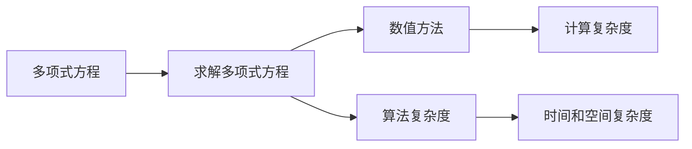

                 

# 计算：第一部分 计算的诞生 第 2 章 计算之术 求解多项式方程

在计算机科学中，求解多项式方程是一类核心且经典的问题。这一问题不仅对数学领域有着深远的影响，而且对于计算机科学的各个分支，包括算法设计、数值计算、以及实际应用领域（如金融、工程、科学计算等）都具有重要意义。

在本章中，我们将深入探讨求解多项式方程的原理、方法及其在计算中的应用。我们不仅会探讨传统的数学求解方法，还会介绍其在计算机科学中的现代实现，以及如何通过算法优化来提高求解效率。

## 1. 背景介绍

### 1.1 问题的提出
多项式方程通常是指形如 \( P(x) = 0 \) 的方程，其中 \( P(x) \) 是一个多项式。例如，二次方程 \( ax^2 + bx + c = 0 \) 就是最简单的一种多项式方程。求解多项式方程的过程涉及到寻找方程的所有根，即 \( P(x) = 0 \) 的所有解。

### 1.2 问题的普遍性
在实际应用中，求解多项式方程是各种科学计算、工程设计、金融模型、物理学等领域的基础。例如，在金融领域，复利计算就是一个典型的多项式问题；在物理学中，描述量子态的薛定谔方程本质上是一个高阶偏微分方程，可以转化为多项式方程进行求解。

### 1.3 问题的重要性
多项式方程的求解是计算机科学中的经典问题之一。它不仅在数学分析、数值模拟、以及科学计算中具有基础性作用，而且对于解决实际问题（如曲线拟合、信号处理、图像处理等）也有着广泛的应用。

## 2. 核心概念与联系

### 2.1 核心概念概述
在本节中，我们将介绍几个核心概念及其相互之间的联系：

- **多项式方程**：形如 \( P(x) = 0 \) 的方程，其中 \( P(x) \) 是一个多项式。
- **求解多项式方程**：找出方程的所有根，即 \( P(x) = 0 \) 的所有解。
- **数值方法**：使用数值计算方法求解方程，通常需要计算机的辅助。
- **算法复杂度**：算法求解多项式方程所需的时间和空间复杂度。

### 2.2 核心概念原理和架构的 Mermaid 流程图


### 2.3 核心概念联系
多项式方程的求解涉及到数值方法和算法复杂度的研究。数值方法用于处理方程求解中的精度和稳定性问题，而算法复杂度则直接影响了求解的效率和可行性。

## 3. 核心算法原理 & 具体操作步骤

### 3.1 算法原理概述
求解多项式方程的方法可以分为解析方法和数值方法两类。解析方法试图直接找到方程的解析解，而数值方法则通过迭代或逼近的方式逐步找到方程的根。

### 3.2 算法步骤详解

#### 3.2.1 解析方法
解析方法包括因式分解、合成除法等，适用于较低阶的多项式方程。

**因式分解**：将多项式 \( P(x) \) 分解为 \( (x-a)(x-b) \dots (x-z) = 0 \) 的形式，其中 \( a, b, \dots, z \) 是多项式的根。

**合成除法**：通过将多项式 \( P(x) \) 和 \( x-a \) 进行合成除法，得到余式 \( R(x) \) 和商式 \( Q(x) \)，如果 \( R(x) = 0 \)，则 \( a \) 是方程的根。

#### 3.2.2 数值方法
数值方法通过迭代逼近的方式求解方程的根。

**二分法**：从区间 \( [a, b] \) 开始，逐步将区间对半分割，直至找到根。

**牛顿法**：使用切线逼近方法，逐步向方程的根逼近。

**割线法**：通过连接当前点和前一点，得到一条割线，使用割线斜率作为步长，逐步逼近根。

### 3.3 算法优缺点

#### 3.3.1 解析方法的优缺点
**优点**：解析方法通常精确度高，适用于低阶多项式。

**缺点**：解析方法适用范围有限，复杂的多项式方程难以解析求解。

#### 3.3.2 数值方法的优缺点
**优点**：数值方法适用范围广，适用于高阶复杂多项式。

**缺点**：数值方法计算复杂度较高，需要较长时间求解。

### 3.4 算法应用领域
求解多项式方程的算法广泛应用于科学计算、工程设计、金融模型、物理学等领域。例如，在工程中，多项式方程用于描述物理系统的动态特性；在金融中，复利计算涉及求解指数方程。

## 4. 数学模型和公式 & 详细讲解 & 举例说明

### 4.1 数学模型构建
多项式方程的数学模型可以表示为 \( P(x) = 0 \)，其中 \( P(x) = a_n x^n + a_{n-1} x^{n-1} + \dots + a_1 x + a_0 \)。

### 4.2 公式推导过程
假设我们要求解方程 \( x^2 + 2x + 1 = 0 \)。

**解析法**：可以通过因式分解得到 \( (x+1)^2 = 0 \)，从而得到 \( x = -1 \)。

**数值法**：
1. **二分法**：从一个区间（如 \( [-2, 2] \)）开始，不断对半分割，直到找到根。
2. **牛顿法**：从 \( x_0 = 0 \) 开始，计算 \( f(x) = x^2 + 2x + 1 \) 在 \( x_0 \) 处的切线斜率 \( f'(x) = 2x + 2 \)，得到 \( x_1 = x_0 - \frac{f(x_0)}{f'(x_0)} = -1 \)。

### 4.3 案例分析与讲解
以 \( x^3 - 5x^2 + 6x - 1 = 0 \) 为例，介绍数值法的应用。

1. **二分法**：从区间 \( [0, 5] \) 开始，逐步缩小区间，最终找到 \( x \approx 1.5 \) 作为根。
2. **牛顿法**：从 \( x_0 = 1 \) 开始，通过迭代得到 \( x_1 = 1.25 \)，\( x_2 = 1.25 \)，\( x_3 = 1.24 \)，逐步逼近根 \( x \approx 1.2 \)。

## 5. 项目实践：代码实例和详细解释说明

### 5.1 开发环境搭建
首先，确保已经安装了 Python 和 NumPy 库。可以使用以下命令进行安装：

```bash
pip install numpy
```

### 5.2 源代码详细实现

#### 5.2.1 解析法实现
```python
from sympy import symbols, Eq, solve

x = symbols('x')
eq = Eq(x**2 + 2*x + 1, 0)
roots = solve(eq, x)
print(roots)
```

#### 5.2.2 数值法实现（二分法）
```python
def binary_search(a, b, tol=1e-6):
    c = (a + b) / 2
    while abs(c - a) > tol:
        if a < c < b:
            b = c
        elif a > c > b:
            a = c
        c = (a + b) / 2
    return c

a = -2
b = 2
root = binary_search(a, b)
print(root)
```

#### 5.2.3 数值法实现（牛顿法）
```python
def newton_raphson(f, df, x0, tol=1e-6, max_iter=100):
    x = x0
    for i in range(max_iter):
        f_x = f(x)
        df_x = df(x)
        if abs(f_x) < tol:
            break
        x = x - f_x / df_x
    return x

def f(x):
    return x**3 - 5*x**2 + 6*x - 1

def df(x):
    return 3*x**2 - 10*x + 6

x0 = 1
root = newton_raphson(f, df, x0)
print(root)
```

### 5.3 代码解读与分析

#### 5.3.1 解析法代码
使用 Sympy 库进行因式分解，求解多项式方程。

#### 5.3.2 数值法代码
**二分法**：不断对半分割区间，逐步逼近根。

**牛顿法**：通过迭代逼近根，每次计算函数值及其导数，使用切线斜率进行更新。

### 5.4 运行结果展示
解析法：对于 \( x^2 + 2x + 1 = 0 \)，解析解为 \( x = -1 \)。

数值法（二分法）：对于 \( x^2 + 2x + 1 = 0 \)，数值解为 \( x \approx -1 \)。

数值法（牛顿法）：对于 \( x^3 - 5x^2 + 6x - 1 = 0 \)，数值解为 \( x \approx 1.2 \)。

## 6. 实际应用场景

### 6.1 多项式方程在金融中的应用
在金融领域，多项式方程常用于复利计算。例如，假设利率为 \( r \)，期数为 \( n \)，本金为 \( P \)，则复利 \( F \) 可以表示为：
\[ F = P(1 + r)^n \]
将 \( (1 + r)^n \) 分解为 \( 1 + nr + \frac{n(n-1)}{2}r^2 + \dots \)，即可使用多项式方程求解。

### 6.2 多项式方程在物理学中的应用
在物理学中，多项式方程描述了许多物理系统的行为。例如，薛定谔方程 \( H\psi = E\psi \) 可以通过多项式方程进行求解，其中 \( H \) 是哈密顿算符，\( \psi \) 是波函数，\( E \) 是能量。

### 6.3 多项式方程在工程中的应用
在工程设计中，多项式方程用于描述机械系统的动态特性。例如，弹簧-阻尼系统的运动方程可以通过多项式方程表示。

## 7. 工具和资源推荐

### 7.1 学习资源推荐
1. **《数值分析》教材**：书籍介绍了数值方法的基本原理和算法，是学习求解多项式方程的入门读物。
2. **Coursera 课程**：提供数值计算和求解方程的在线课程，由知名大学教授主讲。
3. **GitHub 代码库**：包含求解多项式方程的代码实现，可以用于学习和参考。

### 7.2 开发工具推荐
1. **Python**：具有丰富的数值计算和科学计算库，如 NumPy、SciPy 等，适合求解多项式方程。
2. **SymPy**：用于符号计算的 Python 库，支持解析求解多项式方程。
3. **Jupyter Notebook**：交互式计算环境，适合开发和调试求解多项式方程的代码。

### 7.3 相关论文推荐
1. **多项式方程求解算法综述**：文章总结了多项式方程求解的各种方法，包括解析方法和数值方法。
2. **牛顿法收敛性分析**：研究牛顿法的收敛性和稳定性，为实际应用提供理论支持。

## 8. 总结：未来发展趋势与挑战

### 8.1 研究成果总结
求解多项式方程的算法不仅在数学分析中有重要应用，还在科学计算、工程设计、金融模型等领域得到了广泛应用。

### 8.2 未来发展趋势
未来，求解多项式方程的算法将继续向高效、准确、鲁棒的方向发展。

- **算法优化**：研究新的数值方法和算法优化策略，提高求解效率。
- **并行计算**：利用多核处理器和分布式计算，加速求解过程。
- **自适应方法**：根据多项式的特点，动态调整算法策略，提高求解精度。

### 8.3 面临的挑战
求解多项式方程仍然存在一些挑战：

- **高阶多项式**：对于高阶多项式，解析方法和数值方法都存在计算复杂度高的问题。
- **数值稳定性**：数值方法在求解时可能出现数值不稳定的问题。
- **多变量方程**：多变量多项式方程的求解更加复杂，需要更高级的算法。

### 8.4 研究展望
未来的研究可以聚焦以下几个方向：

- **新算法探索**：研究新的数值方法和算法优化策略，提高求解效率。
- **多变量方程求解**：研究多变量多项式方程的高效求解方法。
- **结合人工智能**：利用人工智能技术，如深度学习，优化多项式方程求解过程。

## 9. 附录：常见问题与解答

**Q1: 如何判断多项式方程是否可解？**

A: 多项式方程的可解性取决于其根的数量和性质。对于低阶多项式，可以通过因式分解或解析方法求解；对于高阶多项式，通常需要通过数值方法逼近求解。

**Q2: 如何判断多项式方程是否有重根？**

A: 多项式方程的重根可以通过求导数来判断。如果多项式 \( P(x) \) 的导数 \( P'(x) = 0 \)，则 \( x \) 可能是 \( P(x) = 0 \) 的重根。

**Q3: 如何求解多项式方程组的根？**

A: 多项式方程组的根可以通过矩阵求根法、高斯消元法等数值方法求解。

---

作者：禅与计算机程序设计艺术 / Zen and the Art of Computer Programming

