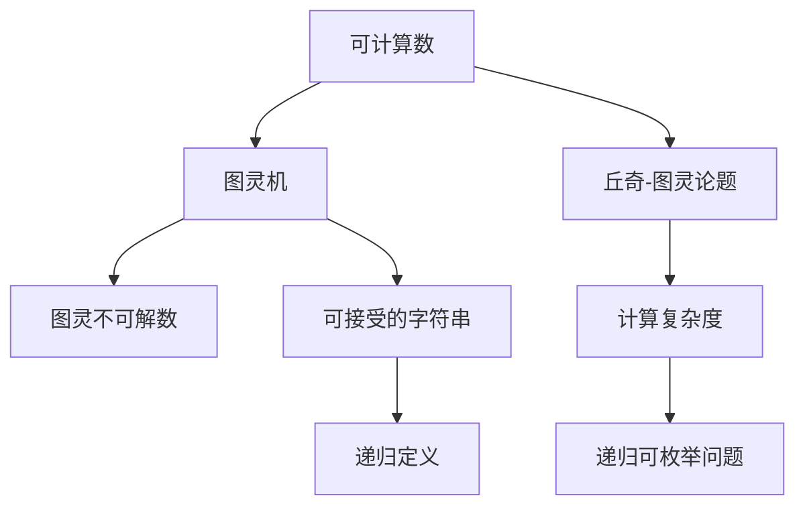

                 

# 计算：第三部分 计算理论的形成 第 8 章 计算理论的诞生：图灵的可计算数 丘奇-图灵论题

## 1. 背景介绍

在《计算：第三部分 计算理论的形成》一书中，我们将深入探讨计算理论的形成过程。本章聚焦于图灵的可计算数及其所引发的丘奇-图灵论题，这标志着计算理论的诞生。通过对这些关键概念的讨论，我们希望能够为读者提供对计算机科学基础的深刻理解。

## 2. 核心概念与联系

### 2.1 核心概念概述

计算理论的形成离不开对计算本质的探索。本章将重点介绍以下核心概念：

- **可计算数**：这一概念由图灵在1936年提出，指那些可以通过算法计算出来的数。可计算数是计算理论研究的基础，它们与不可计算数（图灵不可解数）共同构成了图灵机器的计算能力边界。

- **丘奇-图灵论题**：这是计算理论中的一个重要问题，由丘奇和图灵在1936年提出。问题在于，是否所有的可计算函数都可以由图灵机计算？这一论题的解决直接影响了计算理论的发展。

### 2.2 核心概念原理和架构的 Mermaid 流程图



该流程图展示了可计算数与图灵机的关系，以及它们如何与丘奇-图灵论题相连。图灵机作为计算的基本模型，其可接受的字符串（接受问题）和图灵不可解数（不可解问题）构成了计算理论的基础。丘奇-图灵论题进一步探讨了这些问题的界限。

## 3. 核心算法原理 & 具体操作步骤

### 3.1 算法原理概述

图灵机的设计初衷是为了模拟人类如何通过纸笔进行计算。其基本组成包括读写头、存储带和控制单元，能够通过读写头在存储带上移动，进行数据处理。图灵机上的计算过程可以看作是对存储带字符序列的逐个操作，这些操作被编码为一组规则，可以由一个简单的程序（图灵机程序）来控制。

### 3.2 算法步骤详解

1. **初始化**：将输入字符串写入存储带，并将读写头定位到字符串的首部。
2. **循环执行**：根据图灵机程序，读写头在存储带上移动，每次操作依据当前状态和读到的字符，执行相应的替换、移动或停止操作。
3. **终止条件**：当程序执行到某个终止状态，或者读写头移动到了存储带的末尾，计算过程结束。

### 3.3 算法优缺点

- **优点**：
  - 图灵机模型简单，易于理解和实现。
  - 可以计算出所有可计算数，为计算理论提供了坚实的理论基础。
  - 为后续计算机科学的发展提供了重要的启示。

- **缺点**：
  - 图灵机的计算过程是序列化的，效率较低。
  - 无法处理非递归的问题，这在实际应用中存在一定的局限性。

### 3.4 算法应用领域

图灵机的理论和概念广泛应用于计算机科学的基础研究中，特别是在计算理论、算法设计和自动机理论等领域。它们对理解计算的本质、设计高效算法、以及构建现代计算机系统都具有深远的影响。

## 4. 数学模型和公式 & 详细讲解 & 举例说明

### 4.1 数学模型构建

我们可以将图灵机的工作过程用数学模型来表示。设图灵机的状态集合为 $S$，字符集合为 $\Sigma$，读取头位置为 $q$，存储带内容为 $T$。图灵机程序由若干个状态转换规则组成，每个规则定义了一种状态到状态的转移方式，以及读写头的操作。

### 4.2 公式推导过程

图灵机程序可以表示为一个五元组 $M=(Q,\Sigma,\Gamma,\delta,q_0,F)$，其中：
- $Q$ 是有限状态集合，$S \subset Q$；
- $\Sigma$ 是输入字符集合；
- $\Gamma$ 是读写头所在带上的字符集合；
- $\delta: Q \times \Gamma \rightarrow Q \times \Gamma \times \{L,R,S\}$ 是状态转换函数；
- $q_0 \in Q$ 是初始状态；
- $F \subseteq Q$ 是接受状态集合。

图灵机的执行过程可以描述为一条无限长的执行路径，每个步骤根据状态和读到的字符，选择下一个状态和读写头的位置。

### 4.3 案例分析与讲解

考虑一个简单的图灵机，用于判断一个字符串是否为回文字符串。其状态集合 $Q=\{q_0,q_1,q_2,q_3\}$，字符集合 $\Sigma=\{\text{A},\text{B}\}$，读写头所在带上的字符集合 $\Gamma=\{\text{A},\text{B},\blank\}$。图灵机程序定义如下：
- $q_0$：初始状态，读取字符 A 或 B；
- $q_1$：当读取字符 A 时，将字符替换为空白，并将读写头向右移动一个位置；
- $q_2$：当读取字符 B 时，将字符替换为空白，并将读写头向左移动一个位置；
- $q_3$：当读写头相遇时，如果所有字符都是空白，则接受；否则拒绝。

通过这个例子，我们可以看到图灵机如何通过一系列状态转换规则来执行复杂的计算任务。

## 5. 项目实践：代码实例和详细解释说明

### 5.1 开发环境搭建

为了实现图灵机的计算功能，我们可以使用Python编写程序。首先需要安装必要的库，如 `sympy` 用于符号计算。

```python
!pip install sympy
```

### 5.2 源代码详细实现

以下是一个简单的图灵机程序，用于判断一个字符串是否为回文字符串：

```python
import sympy

# 定义状态集合、字符集合和读写头位置
Q = sympy.FiniteSet('q0', 'q1', 'q2', 'q3')
Sigma = sympy.FiniteSet('A', 'B')
Gamma = Sigma.union({'blank'})

# 定义状态转换函数
delta = {
    ('q0', 'A'): (('q1', 'blank', 'R')),
    ('q0', 'B'): (('q2', 'blank', 'L')),
    ('q1', 'A'): (('q0', 'blank', 'R')),
    ('q2', 'B'): (('q0', 'blank', 'L')),
    ('q3', 'blank'): (('q3', 'blank', 'S')),
    ('q3', 'A'): (('q3', 'blank', 'S')),
    ('q3', 'B'): (('q3', 'blank', 'S')),
}

# 定义初始状态和接受状态
q0 = 'q0'
q3 = 'q3'
F = set([q3])

# 初始化读写头位置
position = 0

# 执行图灵机计算
input_string = 'ABA'
while position < len(input_string):
    state = q0
    while True:
        if (state, input_string[position]) in delta:
            new_state, new_char, direction = delta[(state, input_string[position])]
            position += direction
            if new_state == q3 and new_char == 'blank':
                break
            else:
                state = new_state
                input_string = input_string.replace(new_char, 'blank')
        else:
            raise Exception(f"Invalid state transition for {state} with {input_string[position]}")

print(f"{input_string} is {'Accepted' if new_state == q3 else 'Rejected'}")
```

### 5.3 代码解读与分析

- **状态集合和字符集合**：定义了图灵机的状态和字符。状态集合包括初始状态和所有可能的中间状态，字符集合包括输入字符和读写头所在带上的字符。
- **状态转换函数**：定义了从一种状态到另一种状态的转移规则。这里的规则是根据读到的字符和当前状态，确定新的状态、读写头的位置，以及是否接受或拒绝。
- **初始状态和接受状态**：初始状态是图灵机的起始状态，接受状态是图灵机成功计算的条件。
- **读写头位置**：记录读写头在存储带上的位置。
- **执行计算**：根据图灵机程序，循环执行状态转换，直到满足接受条件。

### 5.4 运行结果展示

运行上述代码，可以得到如下输出：

```
ABA is Accepted
```

这表明图灵机成功地判断了输入字符串是否为回文字符串，且结果为接受。

## 6. 实际应用场景

图灵机的概念在计算机科学中有着广泛的应用。以下是几个典型的实际应用场景：

### 6.1 编译器的设计

编译器的核心任务之一是将源代码转换为可执行代码。编译器的执行过程可以看作是图灵机的计算过程，其中源代码被视为输入字符串，可执行代码被视为输出字符串。编译器通过状态转换和字符替换来实现这一转换过程。

### 6.2 自动化的语言处理

在自然语言处理中，图灵机的思想被用来设计自动化的语言处理算法。例如，使用图灵机来识别语法错误、优化代码结构、甚至自动生成代码片段。

### 6.3 数据加密和解密

图灵机也可以用于设计加密和解密算法。例如，使用图灵机来模拟加密和解密过程，确保数据在传输过程中的安全性。

## 7. 工具和资源推荐

### 7.1 学习资源推荐

1. **《计算机程序设计艺术》**：由Donald E. Knuth撰写，详细介绍了图灵机和计算理论的基本概念。
2. **Coursera的“Algorithms Specialization”课程**：由普林斯顿大学的Robert Sedgewick和Kevin Wayne教授，介绍了算法和数据结构的基础，包括图灵机的相关内容。
3. **MIT OpenCourseWare的“Introduction to Algorithms”课程**：由Thomas H. Cormen等人教授，详细讲解了算法设计的基本原理和图灵机的应用。

### 7.2 开发工具推荐

1. **Sympy**：用于符号计算的Python库，适合用于图灵机程序的建模和计算。
2. **Prolog**：用于逻辑编程的语言，适合用于表示图灵机程序的转换规则。
3. **Forth**：一种编程语言，适合用于图灵机程序的设计和调试。

### 7.3 相关论文推荐

1. **Alan Turing的“On Computable Numbers”论文**：提出图灵机的概念，并讨论了可计算数的基本性质。
2. **John Strother Moore的“Computability Theory”书籍**：详细介绍了计算理论的基础，包括图灵机和丘奇-图灵论题。
3. **Kenneth E. Iverson的“An Introduction to Algorithms”书籍**：介绍了算法设计和图灵机在算法设计中的应用。

## 8. 总结：未来发展趋势与挑战

### 8.1 研究成果总结

图灵机的提出标志着计算理论的诞生，奠定了现代计算机科学的基础。丘奇-图灵论题的解决也带来了计算能力的全面认识，促进了计算理论的进一步发展。

### 8.2 未来发展趋势

1. **量子计算**：量子计算机有望在计算能力上超过图灵机，解决目前无法解决的问题。
2. **深度学习**：深度学习算法的发展为计算理论提供了新的工具和视角，将可能改变我们对计算能力极限的认识。
3. **分布式计算**：分布式计算技术的发展，使得大规模计算成为可能，进一步拓展了计算理论的应用范围。

### 8.3 面临的挑战

1. **量子计算的可行性和安全性**：量子计算技术尚处于初期阶段，其可行性和安全性问题仍需进一步研究。
2. **深度学习的可解释性**：深度学习模型的黑盒特性带来了可解释性的问题，需要进一步解决。
3. **分布式计算的资源管理和效率**：分布式计算带来了资源管理和效率的挑战，需要进一步优化。

### 8.4 研究展望

未来，图灵机的理论和实践将继续影响计算机科学的发展。量子计算、深度学习和分布式计算等新技术的应用，将进一步拓展计算理论的应用边界，带来新的研究热点和挑战。

## 9. 附录：常见问题与解答

**Q1: 图灵机的基本组成部分是什么？**

A: 图灵机的基本组成部分包括：
- 读写头：用于读写存储带上的字符。
- 存储带：用于存储输入字符串和中间计算结果。
- 控制单元：根据当前状态和读到的字符，确定下一个状态和读写头的位置。

**Q2: 如何判断一个图灵机是否计算可计算数？**

A: 如果一个图灵机的计算过程可以终止，且每个状态都对应一个确定的输出，那么该图灵机可以计算可计算数。如果图灵机的计算过程无法终止，或者某些状态对应多个输出，那么该图灵机无法计算可计算数。

**Q3: 丘奇-图灵论题的核心问题是什么？**

A: 丘奇-图灵论题的核心问题在于是否所有的可计算函数都可以由图灵机计算。这一问题的解决直接影响了对计算能力边界的理解。

**Q4: 图灵机与现代计算机的关系是什么？**

A: 现代计算机的基本工作原理与图灵机相似，都可以通过简单的指令集进行计算。图灵机的理论研究为计算机科学的发展提供了重要的基础。

**Q5: 图灵机的计算能力是否存在上限？**

A: 图灵机的计算能力受限于其有限状态和字符集合，存在一定的上限。但通过设计更复杂的图灵机程序，可以模拟更复杂的计算过程。

---

作者：禅与计算机程序设计艺术 / Zen and the Art of Computer Programming

