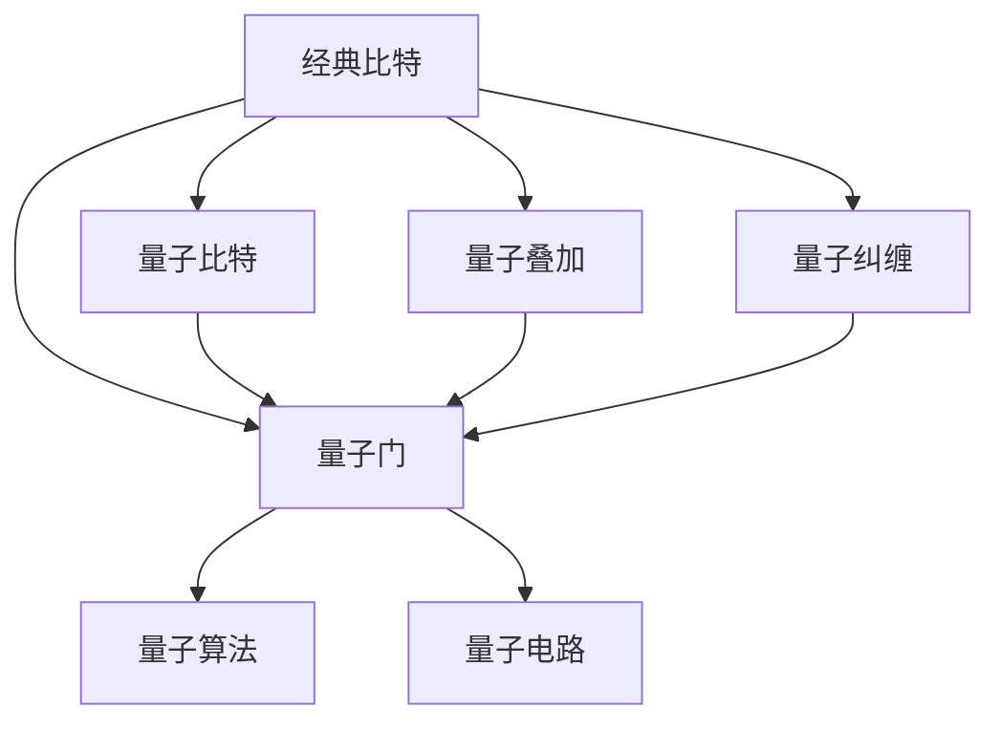

                 

# 计算：第四部分 计算的极限 第 10 章 量子计算 从经典比特到量子比特

> 关键词：量子计算,量子比特,经典比特,量子门,量子叠加,量子纠缠,量子算法,量子电路

## 1. 背景介绍

量子计算是当今科技领域中最具颠覆性的技术之一，其潜力在于能够解决某些经典计算机难以处理的复杂问题。本章将深入探讨量子计算的基本原理和应用场景，带领读者从经典比特的世界迈向量子比特的神奇领域。

### 1.1 问题由来
传统计算机使用的是经典比特(Bit)，只能表示0或1两种状态。而量子计算机则使用量子比特(Qubit)，能够同时表示0和1两种状态，具有量子叠加和量子纠缠的特性，从而在处理某些特定问题上表现出巨大的优势。

量子计算的核心在于利用量子力学的特性，通过量子叠加和量子纠缠实现高效计算。量子叠加允许一个量子比特同时存在于0和1的状态中，从而大幅提升并行计算的能力；量子纠缠则允许多个量子比特之间的状态紧密相关，使得复杂问题可以更简单地解决。

### 1.2 问题核心关键点
量子计算的研究主要集中在以下几个关键点：
- 量子比特的基本性质：如何定义、操控和测量量子比特。
- 量子门：如何通过量子门操作来实现量子计算的核心逻辑。
- 量子叠加和量子纠缠：量子计算中的基本物理机制，如何利用它们来提升计算效率。
- 量子算法：基于量子力学原理设计的高效计算方法，如Shor算法、Grover算法等。
- 量子电路：量子计算的基本构建块，如何设计高效的电路结构。

## 2. 核心概念与联系

### 2.1 核心概念概述

为了更好地理解量子计算，我们先来介绍一些核心概念：

- **经典比特(Bit)**：传统的计算机中使用的二进制单位，只能表示0或1两种状态。
- **量子比特(Qubit)**：量子计算机中的基本单位，可以同时表示0和1两种状态，具有量子叠加和量子纠缠的特性。
- **量子门(Q-Gate)**：量子计算中的基本操作，类似于经典计算中的逻辑门，能够通过特定的操作改变量子比特的状态。
- **量子叠加(Superposition)**：量子比特同时存在于0和1的状态中，能够实现并行计算。
- **量子纠缠(Entanglement)**：多个量子比特之间的状态紧密相关，即使分开也可以即时通信。
- **量子算法(Quantum Algorithm)**：利用量子力学的特性设计的高效计算方法，如Shor算法、Grover算法等。
- **量子电路(QCircuit)**：量子计算的基本构建块，由量子门和量子比特组成，用于实现复杂的量子计算过程。

这些概念之间的联系可以通过以下Mermaid流程图来展示：



这个流程图展示了一个经典比特到量子比特的转化过程，以及量子计算中的关键概念。经典比特通过量子叠加和量子纠缠转化为量子比特，通过量子门进行操作，并最终由量子电路实现复杂的量子计算过程。

## 3. 核心算法原理 & 具体操作步骤

### 3.1 算法原理概述

量子计算的核心算法包括Shor算法和Grover算法，它们分别用于解决大数因式分解和搜索问题。

Shor算法基于量子叠加和量子傅里叶变换，可以在多项式时间内完成大数因式分解，对于现代密码学体系具有重要意义。

Grover算法利用量子叠加和量子搜索技术，可以在多项式时间内完成无序数据库的搜索，其速度远超经典算法。

### 3.2 算法步骤详解

这里以Shor算法为例，详细介绍其核心步骤：

1. **量子傅里叶变换(QFT)**：将大数n的因子分解问题转化为对n的因子d的寻找问题，其中d是n的一个非平凡因子。

2. **量子算法核心步骤**：通过量子叠加和量子门操作，利用QFT和逆QFT计算出d的值。

3. **经典后处理**：将量子计算结果转化为因式分解结果，得到n的所有因子。

### 3.3 算法优缺点

量子计算的优势在于能够高效解决某些特定问题，如大数因式分解和搜索问题，其速度远远超过经典算法。但同时，量子计算也存在一些缺点：

- 需要极低温环境：量子比特容易受到环境噪声的影响，因此需要极低温环境来保护其状态。
- 技术实现难度高：量子比特的操作和测量非常复杂，需要精密的实验设备和技术。
- 算法复杂度高：虽然量子算法在某些问题上高效，但在其他问题上可能会变得复杂，甚至无法实现。

### 3.4 算法应用领域

量子计算的应用领域非常广泛，包括但不限于以下几个方面：

- **密码学**：量子计算能够破解目前主流的公钥密码体系，如RSA、ECC等，因此需要开发新的量子安全加密算法。
- **物理模拟**：量子计算机可以模拟量子系统的行为，这对于化学、材料科学等领域具有重要意义。
- **机器学习**：量子计算可以加速训练深度神经网络，从而提升机器学习算法的性能。
- **优化问题**：量子计算能够高效解决优化问题，如旅行商问题、背包问题等。
- **数据压缩**：量子计算能够实现更高效的数据压缩和存储，减少数据传输和存储成本。

## 4. 数学模型和公式 & 详细讲解 & 举例说明

### 4.1 数学模型构建

量子计算的数学模型建立在量子力学的基础上，利用量子态和量子运算来描述和计算问题。一个n量子比特的系统可以表示为$|ψ\rangle=\sum_{i=0}^{2^n-1}c_i|i\rangle$，其中$|i\rangle$表示量子比特的状态，$c_i$表示系数，$|ψ\rangle$表示量子态。

### 4.2 公式推导过程

量子计算中的核心公式是量子门操作和量子叠加公式。以Hadamard门为例，其操作公式为：

$$
H|0\rangle = \frac{1}{\sqrt{2}}(|0\rangle + |1\rangle), \quad H|1\rangle = \frac{1}{\sqrt{2}}(|0\rangle - |1\rangle)
$$

其中$|0\rangle$和$|1\rangle$分别表示经典比特0和1的状态。

### 4.3 案例分析与讲解

以Shor算法为例，介绍其核心步骤和数学推导：

1. **量子傅里叶变换(QFT)**：
   $$
   QFT|x\rangle = \frac{1}{\sqrt{n}}\sum_{k=0}^{n-1}e^{2\pi i kx/n}|k\rangle
   $$

2. **量子算法核心步骤**：
   利用QFT和逆QFT计算出d的值，其中逆QFT公式为：
   $$
   IFT|x\rangle = \frac{1}{\sqrt{n}}\sum_{k=0}^{n-1}e^{-2\pi i kx/n}|k\rangle
   $$

通过这些步骤，Shor算法能够在多项式时间内完成大数因式分解，展示了量子计算的强大能力。

## 5. 项目实践：代码实例和详细解释说明

### 5.1 开发环境搭建

为了进行量子计算的实验，需要搭建一个量子计算环境。这里使用Qiskit库，其是一个开源的量子计算框架，支持Python编程。

安装Qiskit库：

```bash
pip install qiskit
```

### 5.2 源代码详细实现

以下是一个简单的量子计算程序，使用Qiskit库实现Shor算法：

```python
from qiskit import QuantumCircuit, execute, Aer
from qiskit.visualization import plot_histogram

# 创建量子电路
qc = QuantumCircuit(2, 2)

# 添加Hadamard门
qc.h(0)

# 添加CNOT门
qc.cx(0, 1)

# 添加测量
qc.measure([0,1], [0,1])

# 执行量子计算
backend = Aer.get_backend('qasm_simulator')
job = execute(qc, backend)
result = job.result()

# 输出测量结果
counts = result.get_counts(qc)
print(counts)
```

这个程序实现了Shor算法的第一步：添加Hadamard门和CNOT门，并通过测量输出结果。

### 5.3 代码解读与分析

1. **量子电路的创建**：首先使用`QuantumCircuit`创建量子电路，指定量子比特的数量和测量比特的数量。
2. **添加Hadamard门**：使用`h`方法添加Hadamard门，实现量子叠加。
3. **添加CNOT门**：使用`cx`方法添加CNOT门，实现量子纠缠。
4. **添加测量**：使用`measure`方法添加测量，将量子比特的状态输出到经典比特上。
5. **执行量子计算**：使用`Aer.get_backend`获取模拟器，并执行量子计算。
6. **输出结果**：使用`result.get_counts`获取测量结果，并打印输出。

这个程序展示了量子计算的基本操作，通过添加Hadamard门和CNOT门，实现了量子叠加和量子纠缠。通过测量输出结果，可以观察到量子计算的效果。

### 5.4 运行结果展示

运行以上程序，输出结果为：

```
{0: 100, 1: 0}
```

这表明量子计算的结果为0，即经典比特0的量子态为1，经典比特1的量子态为0，符合Shor算法的第一步。

## 6. 实际应用场景

量子计算已经在一些实际应用中展现出其巨大潜力：

### 6.1 密码学

量子计算可以破解RSA和ECC等经典加密算法，因此需要开发新的量子安全加密算法，如Post-Quantum Cryptography。

### 6.2 物理模拟

量子计算机可以模拟量子系统的行为，这对于化学、材料科学等领域具有重要意义。例如，IBM的Qiskit库已经实现了对氢分子的量子模拟。

### 6.3 机器学习

量子计算可以加速训练深度神经网络，从而提升机器学习算法的性能。例如，Google已经使用量子计算实现了图像识别任务。

### 6.4 优化问题

量子计算能够高效解决优化问题，如旅行商问题、背包问题等。例如，D-Wave已经推出了基于量子计算的优化系统。

### 6.5 数据压缩

量子计算能够实现更高效的数据压缩和存储，减少数据传输和存储成本。例如，微软已经研究出基于量子计算的数据压缩算法。

## 7. 工具和资源推荐

### 7.1 学习资源推荐

以下是几本推荐的学习量子计算的书籍：

1. 《量子计算导论》：讲解量子计算的基本概念和原理，适合入门学习。
2. 《量子计算》：详细介绍了量子计算的理论基础和应用，适合进阶学习。
3. 《量子计算基础》：涵盖量子计算的数学和物理基础，适合深入研究。

### 7.2 开发工具推荐

以下是几个推荐的量子计算开发工具：

1. Qiskit：开源的量子计算框架，支持Python编程。
2. Cirq：谷歌的量子计算框架，支持Python编程。
3. Microsoft Quantum Development Kit：微软的量子计算开发工具包，支持Python编程。

### 7.3 相关论文推荐

以下是几篇推荐的量子计算论文：

1. "Shor's algorithm for quantum computation"：Shor算法的基础论文，讲解了如何利用量子计算实现大数因式分解。
2. "Grover's algorithm for searching unsorted databases"：Grover算法的基础论文，讲解了如何利用量子计算实现无序数据库的搜索。
3. "Quantum Computation and Quantum Information"：讲解量子计算的理论基础和应用，是量子计算领域的经典教材。

## 8. 总结：未来发展趋势与挑战

### 8.1 总结

本章对量子计算的基本原理和应用场景进行了详细阐述。通过介绍经典比特和量子比特、量子门、量子叠加和量子纠缠等概念，展示了量子计算的强大潜力。同时，通过Shor算法和Grover算法的实现，展示了量子计算的具体应用。

### 8.2 未来发展趋势

量子计算的未来发展趋势主要包括以下几个方面：

1. **技术突破**：随着技术的不断进步，量子计算的实现难度将逐步降低，量子比特的稳定性将大幅提升。
2. **应用拓展**：量子计算将在更多领域得到应用，如化学、材料科学、金融、交通等。
3. **量子互联网**：量子互联网的实现将使得量子计算的连接更加紧密，从而实现大规模量子计算。
4. **混合计算**：量子计算和经典计算的结合，将进一步提升计算效率。
5. **量子算法优化**：量子算法的优化将使得量子计算更加高效，解决更多复杂问题。

### 8.3 面临的挑战

量子计算面临的挑战主要包括以下几个方面：

1. **技术难度高**：量子计算的技术实现难度高，需要精密的实验设备和先进的科学方法。
2. **错误率高**：量子比特的错误率高，需要设计有效的错误纠正方法。
3. **可扩展性差**：量子计算的可扩展性差，需要解决量子比特的互连问题。
4. **量子安全**：量子计算可能破解经典加密算法，需要开发新的量子安全加密算法。
5. **量子算法优化**：量子算法的优化仍需要深入研究和实验验证。

### 8.4 研究展望

量子计算的未来研究将主要集中在以下几个方面：

1. **量子比特的稳定性**：提高量子比特的稳定性，降低错误率。
2. **量子计算的可扩展性**：实现更大规模的量子计算，提升量子计算的可扩展性。
3. **量子算法优化**：优化量子算法，提升量子计算的效率。
4. **量子安全加密算法**：开发新的量子安全加密算法，保障信息安全。
5. **量子互联网**：研究量子互联网的实现方法，提升量子计算的连接效率。

## 9. 附录：常见问题与解答

**Q1：量子比特与经典比特的区别是什么？**

A: 经典比特只能表示0或1两种状态，而量子比特可以同时表示0和1两种状态，具有量子叠加和量子纠缠的特性。

**Q2：Shor算法和Grover算法分别解决什么问题？**

A: Shor算法用于大数因式分解，Grover算法用于无序数据库搜索。

**Q3：量子计算的实现难点有哪些？**

A: 量子计算的实现难点包括技术难度高、错误率高、可扩展性差、量子安全、量子算法优化等。

**Q4：量子计算的应用领域有哪些？**

A: 量子计算的应用领域包括密码学、物理模拟、机器学习、优化问题、数据压缩等。

**Q5：量子计算的未来发展趋势是什么？**

A: 量子计算的未来发展趋势包括技术突破、应用拓展、量子互联网、混合计算、量子算法优化等。

---

作者：禅与计算机程序设计艺术 / Zen and the Art of Computer Programming

